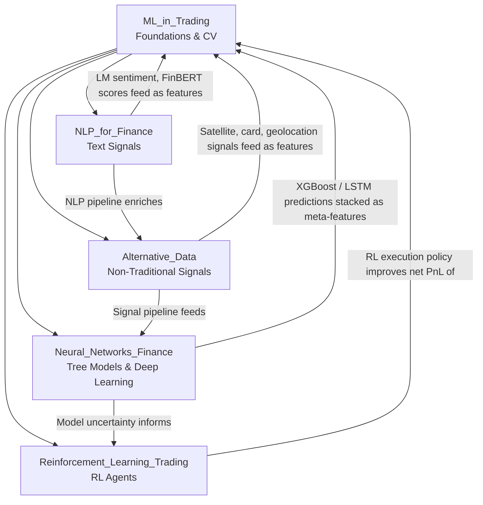

# ML for Finance — Map of Content

> [!abstract]
> Machine learning in finance is not plug-and-play data science — the low signal-to-noise ratio, non-stationarity, and serial correlation of financial data demand specialized techniques. Applying ML to systematic trading requires rigorous cross-validation (purged walk-forward, CPCV), careful feature engineering, and signal evaluation metrics like IC, ICIR, and PSR before any capital is deployed. The five notes in this section cover the full stack: from theoretical foundations and tree/neural models, through NLP signal generation and alternative data, to reinforcement learning for execution and portfolio management.

---

## Concept Map

---

## Learning Path

| Step | Note | Focus |
|------|------|-------|
| 1 | [[ML_in_Trading]] | Structural challenges, purged CV, IC/ICIR/PSR — the meta-framework |
| 2 | [[Neural_Networks_Finance]] | Tree ensembles → deep learning → SHAP — the model toolkit |
| 3 | [[NLP_for_Finance]] | Text signals from filings, calls, social media — feature generation |
| 4 | [[Alternative_Data]] | Non-traditional data taxonomy, pipeline, legal guardrails |
| 5 | [[Reinforcement_Learning_Trading]] | RL for execution and portfolio management — the frontier |

---

## All Notes at a Glance

| Note | Core Topic | Difficulty | Key Concepts |
|------|-----------|------------|--------------|
| [[ML_in_Trading]] | ML fundamentals for finance | Advanced | Purged CV, IC, ICIR, PSR, DSR, signal decay |
| [[Neural_Networks_Finance]] | Tree models, NNs, transformers | Advanced | RF, XGBoost, LSTM, SHAP, Deep Hedging |
| [[NLP_for_Finance]] | NLP signals from text data | Advanced | LM dictionary, FinBERT, 10-K analysis |
| [[Reinforcement_Learning_Trading]] | RL for trading & execution | Advanced | MDP, DQN, PPO, Almgren-Chriss |
| [[Alternative_Data]] | Non-traditional alpha sources | Intermediate | Satellite, card data, signal decay, MNPI |

---

## Key Questions

1. Why is standard k-fold cross-validation inappropriate for financial time series, and how does purged walk-forward CV with embargo correct this?
2. What does an Information Coefficient (IC) of 0.03 with ICIR of 0.6 imply about a strategy's practical deployability?
3. How does Grinold's Fundamental Law of Active Management connect IC, breadth, and Information Ratio?
4. What distinguishes LM sentiment from Harvard GI sentiment for financial text, and why does it matter for signal quality?
5. How does Deep Hedging differ from classical Black-Scholes delta hedging, and when does it materially outperform?
6. What are the primary legal risks of trading on alternative data, and what due diligence steps mitigate them?
7. Why is reward shaping (Sharpe-based vs raw PnL) critical in RL trading agents, and how does it prevent pathological behavior?

---

## Related Sections

- [[_MOC_QuantitativeFinance_Master]] — Master vault entry point
- [[_MOC_Quant_Strategies]] — Factor strategies that consume ML signals
- [[_MOC_Backtesting]] — Walk-forward backtesting framework
- [[_MOC_Risk_Management]] — Tail risk, drawdown management
- [[_MOC_Market_Microstructure]] — Execution context for RL agents

---

#MOC #QuantitativeFinance #MLFinance
