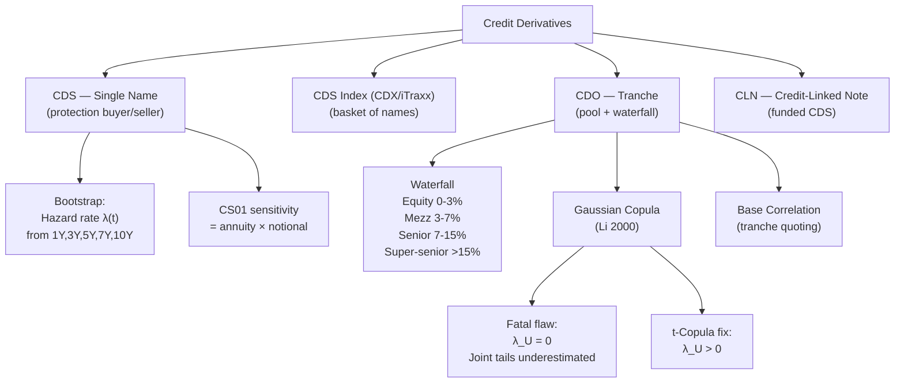

# Credit Derivatives

> [!abstract] TL;DR
> Credit derivatives isolate and transfer credit risk. A CDS prices a single name via its hazard rate and recovery; the bootstrap procedure extracts the term structure of default probabilities from market spreads. CDOs tranche the losses of a pool of credits, with the Gaussian copula (Li 2000) providing the standard (but fatally flawed) pricing model — its zero upper tail dependence caused catastrophic mispricing of senior tranches in the 2008 GFC. The t-copula and base correlation framework address these shortcomings in practice.

---

## Intuition

A credit derivative is insurance on a loan. The buyer of a CDS pays a periodic premium (the spread) and receives a payout if the reference entity defaults. The key insight is that default is not a deterministic event but a Poisson-like arrival with intensity $\lambda$ — the **hazard rate**. Once you parameterize $\lambda$, you can price any credit-contingent cashflow.

CDOs take this further: pool 100+ loans, then sell slices of the loss distribution. The equity tranche absorbs the first losses (like a deductible); the senior tranche only takes losses if defaults are catastrophic. The Gaussian copula model prices these tranches by modeling joint default via a single market factor $M$ — like assuming every borrower's financial health is correlated through one shared economic index. The flaw is that Gaussian correlation underestimates the probability that many borrowers default simultaneously during a crisis — exactly the scenario that destroys the senior tranche.

Think of it like modeling apartment fire risk. Gaussian copula assumes fire on floor 1 has limited impact on floor 10 (near-zero tail dependence). The t-copula recognizes that a gas explosion in the basement destroys the whole building — joint extreme events are far more likely.

---

## How It Works



---

## Key Concepts

### CDS Mechanics

A **Credit Default Swap** has two legs:

- **Premium leg**: buyer pays spread $s$ on notional $N$ until default or maturity
- **Protection leg**: seller pays $N(1-R)$ at default time $\tau$, where $R$ is the recovery rate (market convention: $R = 40\%$)

At inception, both legs have equal value (zero NPV). The **fair spread** is:

$$s = \frac{(1-R)\cdot\text{PV of default leg}}{\text{PV of premium leg (risky annuity)}}$$

Under the standard reduced-form model with constant hazard rate $\lambda$:

$$s \approx \lambda(1-R)$$

For example: $\lambda = 1\%/\text{yr}$, $R = 40\%$ gives $s \approx 60$ bps.

### Hazard Rate and Survival Probability

The **survival probability** to time $T$:

$$\mathbb{P}(\tau > T) = \exp\!\left(-\int_0^T\lambda(t)\,dt\right)$$

With piecewise-constant $\lambda$ (standard bootstrap assumption):

$$\mathbb{P}(\tau > T_k) = \exp\!\left(-\sum_{i=1}^k\lambda_i(T_i - T_{i-1})\right)$$

The **risky annuity** (value of receiving \$1/yr contingent on survival):

$$A(T) = \sum_{k=1}^n \delta_k\,P(0,t_k)\,\mathbb{P}(\tau > t_k)$$

### Bootstrap Procedure

Given CDS spreads at maturities $\{1Y, 3Y, 5Y, 7Y, 10Y\}$, hazard rates are extracted **iteratively**:

1. Start with the 1Y CDS spread. Solve for $\lambda_1$ such that $\text{PV}_{premium}(1Y) = \text{PV}_{protection}(1Y)$.
2. Take $\lambda_1$ as given, use the 3Y CDS to solve for $\lambda_2$ in $[1Y, 3Y]$.
3. Continue to 5Y, 7Y, 10Y.

This gives a piecewise-constant hazard rate term structure that exactly reproduces the market CDS curve.

### CS01 and Risk Sensitivity

**CS01** = sensitivity of CDS mark-to-market to a 1 bp parallel shift in the CDS spread curve:

$$\text{CS01} \approx A(T) \times N \times 0.0001$$

where $A(T)$ is the risky annuity. For a 5Y CDS with $A \approx 4.5$ and $N = \$10M$:

$$\text{CS01} \approx 4.5 \times 10{,}000{,}000 \times 0.0001 = \$4{,}500/\text{bp}$$

### CDO Waterfall Structure

A CDO pools $n$ credits (reference portfolio) and tranches losses $L = \sum_i (1-R_i)\cdot\mathbb{1}[\tau_i \leq T]$:

| Tranche | Attachment | Detachment | Risk Level |
|---------|-----------|-----------|------------|
| Equity (first-loss) | 0% | 3% | Highest yield, first loss |
| Mezzanine | 3% | 7% | Intermediate |
| Senior | 7% | 15% | Investment grade |
| Super-senior | 15% | 100% | Rated AAA |

**Tranche expected loss**:

$$EL[a,d] = \int_0^d(u-a)^+ \cdot p_L(u)\,du - \int_0^a(u-a)^+\cdot p_L(u)\,du$$

where $p_L$ is the portfolio loss density. The tranche spread is $EL[a,d]/(d-a) \div A(T)$.

### Gaussian Copula (Li 2000)

The one-factor Gaussian copula assumes each firm's asset value $V_i$ is:

$$V_i = \sqrt{\rho}\,M + \sqrt{1-\rho}\,Z_i, \quad M, Z_i \sim N(0,1)$$

Default occurs when $V_i \leq N^{-1}(PD_i)$ where $PD_i$ is the individual default probability.

**Conditional default probability** given market factor $M$:

$$PD_i(M) = N\!\left(\frac{N^{-1}(PD_i) - \sqrt{\rho}\,M}{\sqrt{1-\rho}}\right)$$

**Large Homogeneous Portfolio (LHP) approximation** (Vasicek 2002): with $n\to\infty$ names, each having the same $PD$ and correlation $\rho$, the portfolio loss fraction $l$ is:

$$\mathbb{P}(l \leq x) = N\!\left(\frac{\sqrt{1-\rho}\,N^{-1}(x) - N^{-1}(PD)}{\sqrt{\rho}}\right)$$

This gives the loss distribution analytically — no Monte Carlo needed.

### Basel ASRF Formula

The Basel II/III capital formula is based on the Vasicek LHP at the 99.9% confidence level:

$$K = LGD\cdot N\!\left(\frac{N^{-1}(PD) + \sqrt{\rho}\,N^{-1}(0.999)}{\sqrt{1-\rho}}\right) - LGD\cdot PD$$

where $\rho$ is set by asset class (e.g., 12–24% for corporates). This is the backbone of Basel II IRB capital requirements.

### Fatal Flaw: Zero Tail Dependence

The **upper tail dependence coefficient** of the Gaussian copula:

$$\lambda_U^{Gaussian} = \lim_{u\to 1}\frac{\mathbb{P}(V_i > u \mid V_j > u)}{\mathbb{P}(V_i > u)} = 0$$

This means that as we condition on increasingly extreme events, the probability of joint extreme outcomes goes to zero. In a market crash (M very negative), the conditional defaults increase dramatically, but the **marginal joint tail probability** is systematically underestimated.

The **t-copula** with $\nu$ degrees of freedom has positive tail dependence:

$$\lambda_U^{t} = 2\,t_{\nu+1}\!\left(-\sqrt{\frac{(\nu+1)(1-\rho)}{1+\rho}}\right) > 0$$

For $\nu = 4$, $\rho = 0.3$: $\lambda_U^t \approx 0.17$ — a 17% probability of joint extreme default, versus 0% for Gaussian.

### Base Correlation

Just as vanilla options have an implied vol smile, CDO tranches have an **implied correlation smile**. Base correlation is the single $\rho$ that prices the $[0, d]$ tranche correctly using the Gaussian copula:

| Tranche | Equity [0-3%] | Mezz [3-7%] | Senior [7-10%] |
|---------|--------------|------------|---------------|
| Base $\rho$ | ~15-25% | ~30-40% | ~50-70% |

The smile arises because the Gaussian copula is misspecified — different tranches imply different correlations. Base correlation (not compound correlation) is the market-standard quoting convention because it is monotone and consistent.

### Wrong-Way Risk

**Wrong-way risk (WWR)**: the counterparty in a derivative is more likely to default precisely when the derivative has large positive value to us. Example: selling USD/RUB puts to a Russian bank — if RUB collapses, the bank defaults when the put is deep in the money. CVA with WWR is substantially higher than under independence assumptions.

---

## Python Example

```python
import numpy as np
from scipy.stats import norm
from scipy.optimize import brentq

def cds_bootstrap_and_cdo_el(spreads_bps, maturities, rho=0.3, R=0.40,
                              r=0.05, n_mc=500_000):
    """
    1. Bootstrap hazard rates from CDS spreads.
    2. Price CDO equity tranche [0-3%] via Gaussian copula Monte Carlo.
    """
    spreads = np.array(spreads_bps) * 1e-4
    lambdas = []
    survival = [1.0]

    # ---- Bootstrap ----
    def premium_leg(lam, T_prev, T, surv_prev):
        # Simplified: one-period annuity
        surv_T = surv_prev * np.exp(-lam * (T - T_prev))
        avg_surv = 0.5 * (surv_prev + surv_T)
        return (T - T_prev) * np.exp(-r * T) * avg_surv

    def protection_leg(lam, T_prev, T, surv_prev):
        surv_T = surv_prev * np.exp(-lam * (T - T_prev))
        E_default = surv_prev - surv_T
        return (1 - R) * np.exp(-r * 0.5 * (T + T_prev)) * E_default

    T_prev = 0.0
    surv_prev = 1.0
    for s, T in zip(spreads, maturities):
        def equation(lam):
            prem = premium_leg(lam, T_prev, T, surv_prev)
            prot = protection_leg(lam, T_prev, T, surv_prev)
            return s * prem - prot
        lam_sol = brentq(equation, 1e-6, 5.0)
        lambdas.append(lam_sol)
        surv_new = surv_prev * np.exp(-lam_sol * (T - T_prev))
        survival.append(surv_new)
        T_prev, surv_prev = T, surv_new
        print(f"T={T}Y  spread={s*1e4:.0f}bps  lambda={lam_sol*100:.3f}%/yr  "
              f"survival={surv_new:.4f}")

    # ---- Gaussian copula CDO (LHP MC) ----
    T_cdo = maturities[-1]
    PD = 1 - survival[-1]  # use terminal PD for simplicity

    rng = np.random.default_rng(42)
    M = rng.standard_normal(n_mc)
    conditional_PD = norm.cdf((norm.ppf(PD) - np.sqrt(rho) * M) / np.sqrt(1 - rho))

    Z = rng.standard_normal(n_mc)
    defaults = (Z < norm.ppf(conditional_PD)).astype(float)  # 1 name per path
    loss = defaults * (1 - R)  # simplified single-name

    attach, detach = 0.0, 0.03
    tranche_loss = np.minimum(np.maximum(loss - attach, 0), detach - attach)
    EL_equity = tranche_loss.mean() / (detach - attach)
    print(f"\nGaussian copula equity [0-3%] EL = {EL_equity*100:.2f}%  "
          f"(rho={rho}, PD={PD*100:.2f}%)")

    return lambdas, EL_equity

spreads = [50, 80, 120, 160, 200]
mats = [1, 3, 5, 7, 10]
cds_bootstrap_and_cdo_el(spreads, mats)
```

---

## Real-World Notes

- **GFC 2008**: Super-senior CDO tranches rated AAA were pricing using Gaussian copula with $\rho \approx 15\text{-}20\%$. In 2007-2008, realized joint default rates implied $\rho > 80\%$. The model's zero tail dependence caused systematic underpricing of correlation risk.
- **CDS index (CDX IG, iTraxx Europe)**: standardised single-tranche trading on 125-name portfolios; highly liquid, trade on spread rather than upfront.
- **Post-GFC reform**: Dodd-Frank/EMIR mandated CDS clearing through CCPs; most CDS now clear at ICE or CME, dramatically reducing bilateral counterparty risk.
- **CLO market**: Post-2010 credit boom replaced CDOs with CLOs (Collateralized Loan Obligations) on leveraged loans — similar tranching but with active managers and fewer "toxic" assets.

---

## Common Pitfalls

1. **Compound vs base correlation**: Compound correlation (one $\rho$ per tranche) is non-monotone and can have no solution for mezzanine tranches; base correlation fixes this and is the market standard.
2. **Recovery rate assumption**: $R = 40\%$ is a convention; actual recoveries are stochastic and correlated with default — ignoring this understates senior tranche risk.
3. **Continuous vs running spread**: Pre-2009 CDS traded with zero upfront and running spread; post-2009 CDS trade with upfront payment + 100 or 500 bps running. Mis-converting these leads to significant pricing errors.
4. **Wrong-way risk in CVA**: Using independence between exposure and counterparty default is the most common CVA modeling error; WWR can multiply CVA by 3-10x for wrong-way trades.
5. **Bootstrap instability**: If the CDS curve is inverted (short spreads > long spreads), bootstrapping may produce negative hazard rates. A floor $\lambda \geq 0$ is required.

---

## Related Concepts

- [[Structured_Products]] — CDO tranching structure; CLO equity returns
- [[Monte_Carlo_Pricing]] — Gaussian copula simulation; full correlation matrix
- [[Interest_Rate_Derivatives]] — CVA combines credit + rate simulation jointly
- [[Exotic_Options]] — variance swaps analogy for credit vol trading

---

## Review Questions

1. Derive the CDS fair spread formula $s \approx \lambda(1-R)$ from first principles using the survival probability and risky annuity, then explain what happens to the spread if the recovery rate increases from 40% to 60%.
2. Why does the Gaussian copula have zero upper tail dependence ($\lambda_U = 0$)? Derive the expression for $\lambda_U^t$ for the Student-t copula and show it is strictly positive for finite $\nu$.
3. Explain base correlation and why it was adopted over compound correlation as the market-standard quoting convention for CDO tranches. What does the correlation smile (low equity $\rho$, high senior $\rho$) tell us about the model's misspecification?

---

## Sources

- Li, D.X. (2000). *On Default Correlation: A Copula Function Approach*. Journal of Fixed Income.
- Vasicek, O. (2002). *Loan Portfolio Value*. RISK Magazine.
- Lando, D. (2004). *Credit Risk Modeling*. Princeton University Press.
- O'Kane, D. (2008). *Modelling Single-name and Multi-name Credit Derivatives*. Wiley.
- Finger, C.C. (2005). *Issues in the Pricing of Synthetic CDOs*. Journal of Credit Risk.
- Brigo, D., Morini, M. & Pallavicini, A. (2013). *Counterparty Credit Risk, Collateral and Funding*. Wiley.

#quantitative-finance #advanced-derivatives #credit-derivatives #cds #cdo #gaussian-copula #advanced
