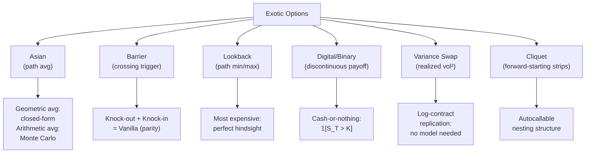

# Exotic Options

> [!abstract] TL;DR
> Exotic options modify the vanilla payoff by making it path-dependent (Asian, barrier, lookback) or by referencing variance directly (variance swaps). Because averaging, monitoring, and extremum tracking all destroy closed-form tractability for continuous dynamics, Monte Carlo simulation — and occasionally PDE methods — replace the Black-Scholes formula. Variance swaps allow model-free vol trading using a strip of vanilla options; VIX is the market's real-time quote of this rate.

---

## Intuition

Vanilla options depend only on $S_T$, the terminal stock price. Exotic options break that restriction by letting the payoff depend on the entire price path — the average, the minimum, whether the stock crossed a line, or the realized volatility. Think of buying travel insurance: a vanilla put pays off if the destination is bad; a barrier put only pays if the destination is bad *and* your flight was never diverted; an Asian put pays off if the average quality of the trip was bad. Each restriction or extension changes the price dramatically.

Variance swaps are the most conceptually important exotic: they let you trade *volatility itself* as a commodity. The beautiful insight (Neuberger 1994) is that a static portfolio of vanilla options — a continuum of puts and calls across all strikes — replicates the realized variance payoff exactly, with no delta-hedging required after setup. This makes the fair strike $K_{var}$ a model-free quantity derivable purely from the options market, with no assumption about the shape of the volatility process.

Dispersion trading extends this logic to correlation. If you sell index variance and buy single-stock variance in the right proportions, you have a trade that profits when realized correlation is lower than implied correlation. This is a direct, structural bet on the covariance matrix rather than on individual volatility levels.

---

## How It Works



---

## Key Concepts

### Asian Options

The payoff of an arithmetic average call is:

$$\text{Payoff} = \max\!\left(\bar S - K,\ 0\right), \quad \bar S = \frac{1}{n}\sum_{i=1}^n S_{t_i}$$

Averaging over observation dates $t_1, \dots, t_n$ **reduces effective volatility**, making Asian options cheaper than vanillas. The geometric average $\tilde S = \left(\prod S_{t_i}\right)^{1/n}$ does have a closed-form (it is lognormal under GBM), and is used as a control variate in [[Monte_Carlo_Pricing]] to price the arithmetic version efficiently.

### Barrier Options

A barrier $B$ activates or extinguishes the option:

- **Knock-Out (KO)**: option expires worthless if $S_t$ crosses $B$
  - *Up-and-Out Call*: $B > S_0$, useful for capped hedging
  - *Down-and-Out Put*: $B < S_0$

- **Knock-In (KI)**: option only becomes active if $S_t$ crosses $B$

**Parity relationship** (fundamental):
$$C_{KI} + C_{KO} = C_{vanilla}$$

Continuous-barrier formulas are closed-form under GBM. Discrete-barrier contracts (observed daily) require Monte Carlo or PDE with grid refinement because the Broadie-Glasserman-Kou correction applies:

$$B_{discrete} \approx B_{continuous} \cdot e^{\pm 0.5826\,\sigma\sqrt{\Delta t}}$$

### Lookback Options

The floating-strike lookback call pays:

$$\text{Payoff} = S_T - \min_{0\leq t\leq T} S_t$$

The fixed-strike lookback call pays $\max\!\left(\max_t S_t - K, 0\right)$. These are the most expensive path-dependent options because they grant **perfect hindsight** — buying at the minimum, selling at the maximum. Closed-form expressions exist under GBM (Goldman-Sosin-Gatto 1979).

### Binary / Digital Options

- **Cash-or-nothing call**: pays \$1 if $S_T > K$, else \$0
  $$V = e^{-rT}\,\mathbb{P}^Q(S_T > K) = e^{-rT}N(d_2)$$
- **Asset-or-nothing call**: pays $S_T$ if $S_T > K$
  $$V = S_0 N(d_1)$$

Note: vanilla call = asset-or-nothing $-$ $K \times$ cash-or-nothing. Digitals have **infinite gamma at expiry** near the strike — hedging a digital book requires buying/selling increasingly large vanilla positions as expiry approaches (pin risk).

### Variance Swaps

A variance swap has payoff at maturity $T$:

$$\Pi = N\!\left(\sigma_R^2 - K_{var}\right)$$

where $\sigma_R^2 = \frac{252}{n}\sum_{i=1}^n\left(\ln\frac{S_{t_i}}{S_{t_{i-1}}}\right)^2$ is realized variance and $K_{var}$ is the fair strike set at inception so $V_0 = 0$.

**Log-contract replication** (Neuberger 1994 / Britten-Jones & Neuberger 2000):

By Ito's lemma applied to $\ln S$:

$$\sigma_R^2 = \frac{2}{T}\left[\int_0^T\frac{dS_t}{S_t} - \ln\frac{S_T}{S_0}\right]$$

The $dS_t/S_t$ term is the delta-hedging P&L; the $\ln$ term is a static log-contract. Under risk-neutral measure, taking expectations and using put-call parity to decompose the log-contract over strikes:

$$K_{var} = \frac{2}{T}\left[\int_0^F\frac{P(K)}{K^2}dK + \int_F^\infty\frac{C(K)}{K^2}dK\right]$$

where $F = Se^{rT}$ is the forward. This is **model-free**: only market prices of vanilla options enter.

**VIX**: $\text{VIX}^2 = K_{var}^{30\text{-day}}$ on the S&P 500 (annualized). Historically, VIX overestimates realized vol by ~2 variance points/month — the **Variance Risk Premium (VRP)**.

**Heston model** gives an analytical formula:

$$K_{var}^{Heston} = \theta + (v_0 - \theta)\frac{1 - e^{-\kappa T}}{\kappa T}$$

where $v_0$ is spot variance, $\theta$ long-run variance, $\kappa$ mean-reversion speed.

**Vol swap convexity correction** (Jensen's inequality):

$$K_{vol} \approx \sqrt{K_{var}} - \frac{\text{Var}[\sigma_R]}{8\,K_{var}^{3/2}}$$

Vol swaps are worth less than the square root of variance swaps — the gap is the convexity adjustment.

### Dispersion Trading

Sell index variance + buy single-stock variance weighted by market cap. The P&L is:

$$\Pi_{disp} \propto \sigma_{I,R}^2 - \sum_i w_i^2\sigma_{i,R}^2 = \sum_{i\neq j}w_iw_j\rho_{ij,R}\sigma_{i,R}\sigma_{j,R}$$

Profit when **realized correlation** $< $ **implied correlation**. Historically profitable because implied correlation (derived from index vs. single-stock vol surface) tends to exceed realized correlation.

### Cliquet Options

A cliquet is a series of $n$ forward-starting ATM options, each reset at date $t_k$ to the then-prevailing spot:

$$\text{Payoff} = \sum_{k=1}^n \max\!\left(\frac{S_{t_k}}{S_{t_{k-1}}} - 1,\ 0\right)$$

Used in **autocallable** structured products where a coupon resets periodically. Pricing requires a stochastic vol model that correctly captures the forward volatility smile — local vol mishandles this (forward smile flattens incorrectly).

---

## Python Example

```python
import numpy as np

def barrier_mc_and_variance_swap(S0=100, K=100, B=120, r=0.05, sigma=0.20,
                                 T=1.0, n_steps=252, n_paths=200_000):
    """
    Prices an up-and-out call (barrier) and a variance swap
    via Monte Carlo simulation.
    """
    rng = np.random.default_rng(42)
    dt = T / n_steps

    # Simulate GBM paths — shape (n_paths, n_steps+1)
    Z = rng.standard_normal((n_paths, n_steps))
    log_increments = (r - 0.5 * sigma**2) * dt + sigma * np.sqrt(dt) * Z
    log_S = np.concatenate([np.zeros((n_paths, 1)),
                            np.cumsum(log_increments, axis=1)], axis=1)
    S = S0 * np.exp(log_S)

    # --- Up-and-out call ---
    max_S = S.max(axis=1)
    alive = max_S < B                          # not knocked out
    payoff_ko = np.maximum(S[:, -1] - K, 0) * alive
    price_ko = np.exp(-r * T) * payoff_ko.mean()
    se_ko = payoff_ko.std() / np.sqrt(n_paths)

    print(f"Up-and-out call:  price={price_ko:.4f}  SE={se_ko:.4f}")

    # --- Variance swap fair strike ---
    log_returns = np.diff(log_S, axis=1)           # shape (n_paths, n_steps)
    realized_var = (log_returns**2).sum(axis=1) * (252 / n_steps)  # annualized
    K_var = realized_var.mean()
    print(f"Variance swap K_var: {K_var:.6f}  (annualized realized var)")
    print(f"Implied vol equiv:   {np.sqrt(K_var)*100:.2f}%")

    return price_ko, K_var

barrier_mc_and_variance_swap()
```

**Expected output** (approx):
```
Up-and-out call:  price=2.1837  SE=0.0091
Variance swap K_var: 0.040012  (annualized realized var)
Implied vol equiv:   20.00%
```

---

## Real-World Notes

- **VRP harvesting**: Selling variance swaps (or VIX futures) is one of the most studied systematic strategies. Returns are high on average but suffer catastrophic drawdowns in vol spikes (2008, 2020, 2018 Feb "Volmageddon").
- **Dispersion trading**: Run by most vol desks; trade-off is execution cost of the single-stock legs and correlation jump risk during crises.
- **Autocallables**: The dominant structured product in Asia and Europe; creates massive short-vol demand from dealers who delta-hedge them, contributing to the persistent implied vol premium.
- **Digital hedging**: Real desks use call spreads (buy $K-\epsilon$, sell $K+\epsilon$) to approximate digital payoffs and manage pin risk near expiry.

---

## Common Pitfalls

1. **Discrete vs continuous barrier**: Pricing a daily-observed barrier with continuous formulas can misprice by 10-30 bps; always apply the Broadie-Glasserman-Kou continuity correction.
2. **Asian arithmetic average**: Assuming it's lognormal (it isn't) or using a geometric approximation without a control variate introduces bias.
3. **Variance swap annualization**: Using 252 for daily data, 52 for weekly — mismatching observation frequency with the annualization factor inflates/deflates $K_{var}$.
4. **Vol swap convexity**: Quoting vol swaps at $\sqrt{K_{var}}$ without the convexity adjustment overpays the vol swap seller by up to 1-2 vol points.
5. **Cliquet local vol error**: Local vol models flatten the forward smile; use stochastic vol (Heston, SABR) or local-stochastic vol for cliquet pricing.

---

## Related Concepts

- [[Monte_Carlo_Pricing]] — GBM simulation, variance reduction, Longstaff-Schwartz
- [[Structured_Products]] — autocallables, dispersion, CPPI
- [[Interest_Rate_Derivatives]] — Heston model for rates
- [[Credit_Derivatives]] — variance swap analogy for credit spreads

---

## Review Questions

1. Derive why $C_{KI} + C_{KO} = C_{vanilla}$ using no-arbitrage arguments, and state one condition under which this parity breaks down.
2. The Neuberger log-contract replication of $K_{var}$ uses options at all strikes. In practice, only a finite strip of strikes trades. How does the CBOE approximate the VIX, and what truncation error arises?
3. A dispersion trade is long single-stock variance and short index variance. Construct a scenario (specific macro event) where this trade loses money and explain the mechanism via the realized correlation formula.

---

## Sources

- Neuberger, A. (1994). *The Log Contract*. Journal of Portfolio Management.
- Britten-Jones, M. & Neuberger, A. (2000). *Option Prices, Implied Price Processes, and Stochastic Volatility*. Journal of Finance.
- Broadie, M., Glasserman, P. & Kou, S. (1997). *A Continuity Correction for Discrete Barrier Options*. Mathematical Finance.
- CBOE VIX White Paper (2019).
- Gatheral, J. (2006). *The Volatility Surface*. Wiley.

#quantitative-finance #advanced-derivatives #exotic-options #variance-swaps #advanced
