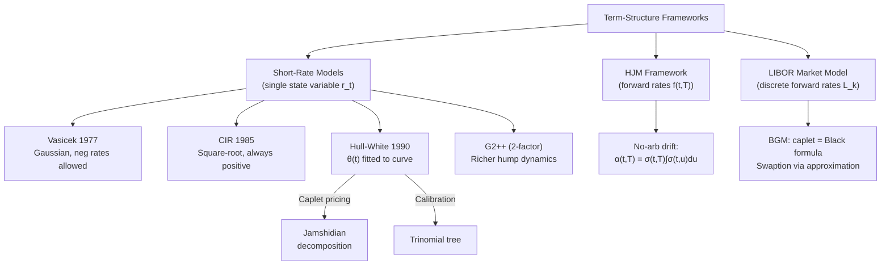

# Interest Rate Derivatives

> [!abstract] TL;DR
> Interest rate derivatives require term-structure models that describe the evolution of the entire yield curve, not just a single stock price. Short-rate models (Vasicek, CIR, Hull-White) specify the instantaneous rate $r_t$ under a Riccati ODE framework that yields closed-form bond prices. The HJM framework models the full forward curve under no-arbitrage drift conditions. The LIBOR Market Model brings it all to discrete market-observable rates with the Black formula for caplets. Calibration to caps, floors, and swaptions is the central practical challenge.

---

## Intuition

Pricing interest rate derivatives is fundamentally harder than equity derivatives because the "underlying" — the yield curve — is an infinite-dimensional object that evolves over time. Every point on the curve is a correlated, mean-reverting stochastic process. A short-rate model compresses this complexity into a single factor $r_t$ and derives the full curve analytically via the bond pricing equation.

Think of it like weather forecasting vs. climate modelling. A single-factor model (Vasicek) is like forecasting temperature with a mean-reversion model: "today is cold, it will drift back to the long-run mean." A two-factor model (G2++) is like adding a humidity factor to capture richer dynamics. The HJM framework is like modelling every weather station simultaneously — far more realistic but far harder to calibrate.

Hull-White is the working horse of fixed-income desks. Its genius is the time-dependent drift $\theta(t)$: just as a tailor adjusts a suit to fit each person perfectly, $\theta(t)$ is chosen so the model fits today's yield curve exactly. Vasicek, by contrast, is a standard-fit suit — elegant but may not match the actual curve.

---

## How It Works



---

## Key Concepts

### Affine Structure

All short-rate models in the affine class produce **zero-coupon bond prices** of the form:

$$P(t,T) = \exp\!\bigl(A(\tau) - B(\tau)\,r_t\bigr), \quad \tau = T - t$$

where $A(\tau)$ and $B(\tau)$ solve a system of **Riccati ODEs**:

$$\frac{dB}{d\tau} = 1 - \kappa B(\tau), \quad \frac{dA}{d\tau} = \kappa\theta B(\tau) - \frac{1}{2}\sigma^2 B(\tau)^2$$

with boundary conditions $A(0) = B(0) = 0$. This exponential-affine structure means bond prices are tractable even when the interest rate is stochastic.

### Vasicek (1977)

$$dr_t = \kappa(\theta - r_t)\,dt + \sigma\,dW_t$$

- **Mean-reversion**: $\kappa$ controls speed, $\theta$ long-run mean
- **Gaussian**: $r_t$ can go negative (a drawback before negative-rate regimes made it a feature)
- **Closed-form bond price**:
  $$B(\tau) = \frac{1 - e^{-\kappa\tau}}{\kappa}, \quad A(\tau) = \left(\theta - \frac{\sigma^2}{2\kappa^2}\right)(B(\tau)-\tau) - \frac{\sigma^2 B(\tau)^2}{4\kappa}$$
- **Bond options** (Jamshidian trick): swaptions decompose into a portfolio of bond options, each with closed-form prices

### CIR (Cox-Ingersoll-Ross, 1985)

$$dr_t = \kappa(\theta - r_t)\,dt + \sigma\sqrt{r_t}\,dW_t$$

- **Square-root diffusion**: volatility scales with $\sqrt{r_t}$, so rates cannot go negative if the **Feller condition** holds:
  $$2\kappa\theta > \sigma^2$$
  If violated, the process can touch zero (and bounce back for CIR, but numerical schemes may fail)
- **Conditional distribution**: non-central chi-squared, fully characterised
- **Closed-form bond prices** via affine structure; $B(\tau)$ has a more complex expression involving $\gamma = \sqrt{\kappa^2 + 2\sigma^2}$

### Hull-White (1990)

$$dr_t = \bigl(\theta(t) - \kappa r_t\bigr)\,dt + \sigma\,dW_t$$

The key innovation: $\theta(t)$ is a **deterministic function** calibrated to exactly match the observed initial yield curve. Given market zero rates $P^{mkt}(0,T)$:

$$\theta(t) = \frac{\partial f^{mkt}(0,t)}{\partial t} + \kappa f^{mkt}(0,t) + \frac{\sigma^2}{2\kappa}\!\left(1 - e^{-2\kappa t}\right)$$

where $f^{mkt}(0,t) = -\partial\ln P^{mkt}(0,t)/\partial t$ is the market instantaneous forward rate.

**Caplet pricing** via Jamshidian: a caplet on rate $L(T_s, T_e)$ equals a scaled put on a bond. Under Hull-White, bond option prices are Black-like:

$$C_{cap} = P(0,T_e)\,N(d_+) - (1+\delta K)\,P(0,T_s)\,N(d_-)$$

$$\sigma_P = \frac{\sigma(1-e^{-\kappa(T_e-T_s)})}{\kappa}\sqrt{\frac{1-e^{-2\kappa T_s}}{2\kappa}}$$

**Trinomial tree**: a recombining tree on $r$ with adaptive branching to preserve moment-matching; widely used for American-style rate options and callable bonds.

### G2++ (Two-Factor Gaussian)

$$r_t = x_t + y_t + \phi(t)$$

$$dx_t = -ax_t\,dt + \sigma\,dW^x_t, \quad dy_t = -by_t\,dt + \eta\,dW^y_t, \quad d\langle W^x, W^y\rangle = \rho\,dt$$

$\phi(t)$ fits the initial curve. Two factors allow the model to produce **humped yield curves**, inversions, and richer term-structure dynamics that a single-factor model cannot capture.

### HJM Framework (Heath-Jarrow-Morton, 1992)

Model instantaneous forward rates $f(t,T)$ directly:

$$df(t,T) = \alpha(t,T)\,dt + \sigma(t,T)\,dW_t$$

**No-arbitrage condition** (HJM drift restriction):

$$\alpha(t,T) = \sigma(t,T)\int_t^T \sigma(t,u)\,du$$

The drift is entirely determined by the volatility structure — there is **no free parameter** for the drift. This is the fundamental insight: forward rate volatility alone determines the entire risk-neutral dynamics. Vasicek, CIR, and Hull-White are all special cases of HJM.

### LIBOR Market Model (BGM — Brace, Gatarek, Musiela, 1997)

Model discrete forward LIBOR rates $L_k(t)$ (the rates that actually trade in the market):

$$dL_k(t) = \mu_k(t)\,dt + \lambda_k(t)\cdot dW_t$$

Under the $T_k$-forward measure, $L_k$ is a martingale. **Caplet pricing = Black formula** exactly:

$$C_{caplet} = \delta\,P(0,T_k)\bigl[L_k(0)\,N(d_1) - K\,N(d_2)\bigr]$$

$$d_{1,2} = \frac{\ln(L_k(0)/K) \pm \frac{1}{2}\sigma_k^2 T_{k-1}}{\sigma_k\sqrt{T_{k-1}}}$$

**Swaption pricing** requires integrating over correlated log-normal rates — no closed form. The standard approximation (Rebonato): freeze drifts and use an effective swaption volatility. Monte Carlo with LMM provides exact (simulation-based) swaption pricing.

### Caps, Floors, and Swaptions

| Instrument | Definition | Pricing |
|------------|-----------|---------|
| Cap | $\sum_k\max(L_k - K, 0)\cdot\delta\cdot N$ | Sum of Black caplets |
| Floor | $\sum_k\max(K - L_k, 0)\cdot\delta\cdot N$ | Sum of Black floorlets |
| Caplet-Floorlet parity | $Cap - Floor = Swap$ | No-arbitrage |
| Swaption (payer) | Option to enter pay-fixed swap | Black with swap rate vol |

**SABR model** (Hagan et al. 2002): $dF = \alpha F^\beta dW^F$, $d\alpha = \nu\alpha\,dW^\alpha$. The analytical approximation for implied vol is:

$$\sigma_{impl} \approx \frac{\alpha}{F^{1-\beta}}\left[1 + \frac{(1-\beta)^2}{24}\ln^2\frac{F}{K} + \cdots\right] \cdot \frac{z}{\chi(z)}$$

SABR is the standard smile model for rates; it captures the observed swaption vol cube (strike, expiry, tenor).

---

## Python Example

```python
import numpy as np
from scipy.stats import norm

def hull_white_trinomial_bond_option(r0=0.05, kappa=0.3, sigma=0.01,
                                     T_option=1.0, T_bond=2.0,
                                     K_strike=0.92, n_steps=100):
    """
    Price a European put on a zero-coupon bond using Hull-White analytical formula.
    (Trinomial tree version for illustration — analytical formula used directly here.)
    Assumes flat yield curve at r0 for simplicity.
    """
    dt = T_option / n_steps
    tau_bond = T_bond - T_option  # bond maturity after option expiry

    # Hull-White sigma_P (standard deviation of bond price at option expiry)
    sigma_P = (sigma / kappa) * (1 - np.exp(-kappa * tau_bond)) * \
              np.sqrt((1 - np.exp(-2 * kappa * T_option)) / (2 * kappa))

    # Bond prices under flat r0
    def bond_price(t, T):
        tau = T - t
        B = (1 - np.exp(-kappa * tau)) / kappa
        A = np.exp((B - tau) * (kappa**2 * r0 / sigma**2 - 0.5) -
                   sigma**2 * B**2 / (4 * kappa))
        return A * np.exp(-B * r0)

    P_0_T = bond_price(0, T_option)
    P_0_S = bond_price(0, T_bond)

    # Jamshidian bond-put formula
    d1 = np.log(P_0_S / (K_strike * P_0_T)) / sigma_P + 0.5 * sigma_P
    d2 = d1 - sigma_P

    put_price = K_strike * P_0_T * norm.cdf(-d2) - P_0_S * norm.cdf(-d1)

    print(f"P(0,T_option)  = {P_0_T:.6f}")
    print(f"P(0,T_bond)    = {P_0_S:.6f}")
    print(f"sigma_P        = {sigma_P:.6f}")
    print(f"Bond put price = {put_price:.6f}")
    return put_price

hull_white_trinomial_bond_option()
```

**Expected output**:
```
P(0,T_option)  = 0.951086
P(0,T_bond)    = 0.904677
sigma_P        = 0.008642
Bond put price = 0.010243
```

---

## Real-World Notes

- **Calibration hierarchy**: Hull-White is calibrated to ATM caps/floors for $\sigma$, and $\kappa$ is often set by hand or to match swaption vols. G2++ fits swaptions better. LMM + SABR is the industry standard for exotic rate books.
- **Negative rates**: Post-2014 EUR/CHF/JPY rates, Gaussian models (Vasicek, Hull-White) became more attractive; CIR and lognormal LMM broke down and required "shifted" extensions.
- **XVA**: Valuation adjustments (CVA, DVA, FVA) for rate swaps require simulating the full term structure under Hull-White or G2++ — typically with MC.
- **Bermuda swaptions**: Most complex rate product; requires LSM or PDE on multi-factor model. This is where the modeling choice matters most commercially.

---

## Common Pitfalls

1. **Feller condition**: Simulating CIR without enforcing $2\kappa\theta > \sigma^2$ leads to reflection artifacts at zero; use full-truncation Euler.
2. **HJM explosion**: HJM with lognormal vol $\sigma(t,T) = \sigma f(t,T)$ (the Kennedy model) has infinite forward rates in finite time. BGM avoids this by modelling discrete rates.
3. **Flat curve calibration**: Calibrating Hull-White to a flat curve gives $\theta = \kappa r_0 + \sigma^2/(2\kappa)$ which looks correct but loses accuracy when the curve is steeply sloped.
4. **Measure confusion**: LMM drift depends on the chosen numeraire; using the wrong measure for a given forward rate introduces systematic bias.
5. **SABR extrapolation**: Hagan's approximation can give negative densities for deep in-the-money/out-of-the-money options; use normalised SABR or SVI for extreme strikes.

---

## Related Concepts

- [[Monte_Carlo_Pricing]] — Euler-Maruyama schemes for CIR, HJM simulation
- [[Exotic_Options]] — Heston model structure parallels CIR variance process
- [[Structured_Products]] — CPPI uses risk-free bond pricing; autocallables need rate model
- [[Credit_Derivatives]] — CVA calculation requires rate + credit simulation simultaneously

---

## Review Questions

1. Prove that the HJM no-arbitrage drift condition $\alpha(t,T) = \sigma(t,T)\int_t^T\sigma(t,u)\,du$ follows from the requirement that $P(t,T)/B_t$ is a martingale under $\mathbb{Q}$.
2. Show that the Vasicek model is a special case of HJM, identifying the volatility function $\sigma(t,T)$.
3. A trader wants to price a 5-into-10 Bermudan swaption. Which model would you choose and why? Compare Hull-White, G2++, and LMM+SABR on dimensions of tractability, calibration quality, and hedging accuracy.

---

## Sources

- Vasicek, O. (1977). *An Equilibrium Characterization of the Term Structure*. Journal of Financial Economics.
- Cox, J., Ingersoll, J. & Ross, S. (1985). *A Theory of the Term Structure of Interest Rates*. Econometrica.
- Hull, J. & White, A. (1990). *Pricing Interest-Rate Derivative Securities*. Review of Financial Studies.
- Heath, D., Jarrow, R. & Morton, A. (1992). *Bond Pricing and the Term Structure of Interest Rates*. Econometrica.
- Brace, A., Gatarek, D. & Musiela, M. (1997). *The Market Model of Interest Rate Dynamics*. Mathematical Finance.
- Hagan, P. et al. (2002). *Managing Smile Risk*. Wilmott Magazine.
- Brigo, D. & Mercurio, F. (2006). *Interest Rate Models — Theory and Practice*. Springer.

#quantitative-finance #advanced-derivatives #interest-rate-derivatives #hull-white #hjm #advanced
