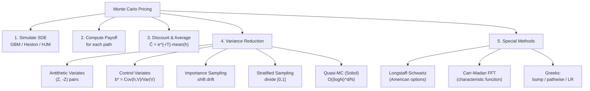

# Monte Carlo Pricing

> [!abstract] TL;DR
> Monte Carlo pricing simulates thousands of asset price paths and averages the discounted payoffs to estimate derivative prices. Its strength is handling any payoff complexity — path-dependent, multi-asset, early exercise — at the cost of slow $O(1/\sqrt{N})$ convergence. Variance reduction (antithetic variates, control variates, importance sampling) and Quasi-Monte Carlo sequences (Sobol) dramatically improve efficiency. Longstaff-Schwartz solves American options via backward regression; Carr-Madan FFT extracts all option prices simultaneously from the characteristic function.

---

## Intuition

Monte Carlo is the dice-rolling approach to integration: instead of computing a complex multi-dimensional integral analytically, simulate the randomness millions of times and average the results. The law of large numbers guarantees convergence; the central limit theorem gives the confidence interval. It is the ultimate numerical sledgehammer — flexible enough to price any derivative but expensive in the number of simulations needed.

The key insight for derivatives pricing is that under the risk-neutral measure $\mathbb{Q}$, derivative prices are expectations of discounted payoffs. MC converts this into: simulate many risk-neutral paths, compute the payoff on each path, discount, and average. No closed-form solution is needed; only the ability to simulate the SDE.

Variance reduction is like using loaded dice that converge to the same truth faster. Antithetic variates pair each random path with its mirror image; control variates subtract a known quantity whose expectation is known analytically. Quasi-Monte Carlo replaces pseudo-random numbers with deterministic low-discrepancy sequences that fill the sample space more uniformly, achieving near-$O(1/N)$ convergence in low dimensions.

---

## How It Works



---

## Key Concepts

### Basic Monte Carlo

Estimate $C = e^{-rT}\,\mathbb{E}^Q[h(S)]$ by:

$$\hat C = e^{-rT}\frac{1}{N}\sum_{i=1}^N h\!\left(S^{(i)}\right)$$

**Standard error**: $\text{SE} = \sigma_h/\sqrt{N}$ where $\sigma_h = \text{Std}[h(S)]$.

**Convergence**: $O(1/\sqrt{N})$ — halving the error requires 4× as many paths. For a European option this is dominated by the analytical formula, but for any path-dependent payoff MC becomes essential.

### GBM Simulation

Under $\mathbb{Q}$, the exact discretisation of GBM (no time-stepping error):

$$S_{t+\Delta t} = S_t\,\exp\!\left(\left(r - \frac{\sigma^2}{2}\right)\Delta t + \sigma\sqrt{\Delta t}\,Z\right), \quad Z \sim N(0,1)$$

For $n$ time steps: generate $Z_{1}, \dots, Z_n$ and apply the formula recursively. This is the **exact scheme** — no weak or strong order, as it uses the exact conditional distribution of GBM.

### Variance Reduction Techniques

#### 1. Antithetic Variates

For each standard normal draw $Z$, use both $(Z, -Z)$ to generate two paths. The payoffs are negatively correlated (when $Z$ gives a high stock path, $-Z$ gives a low one), so their average has lower variance.

$$\hat C_{AV} = \frac{1}{2N}\sum_{i=1}^N\left[h\!\left(S^{(+)}\right) + h\!\left(S^{(-)}\right)\right]$$

$$\text{Var}[\hat C_{AV}] = \frac{1}{2}\left[\text{Var}[h(S)] + \text{Cov}(h(S^+), h(S^-))\right]$$

Effective when $h$ is monotone in $S$ (calls, puts, Asian calls) — correlation is then strongly negative.

#### 2. Control Variates

Choose a **control variate** $V$ with known expectation $\mathbb{E}[V] = V^*$. Estimate:

$$\hat C_{CV} = \hat C - b(\hat V - V^*)$$

Optimal coefficient:

$$b^* = \frac{\text{Cov}(h, V)}{\text{Var}(V)}$$

**Variance reduction factor**: $1 - \rho^2_{h,V}$ where $\rho$ is the correlation. For an **arithmetic Asian call**, use the **geometric Asian call** as control (it has a closed-form price under GBM). Typical $\rho \approx 0.98$, giving a 96% variance reduction — effectively 25× fewer paths needed.

#### 3. Importance Sampling

Shift the drift of the simulation toward the important region (e.g., toward the exercise region for deep OTM options). Correct with the **Radon-Nikodym derivative**:

$$\hat C_{IS} = e^{-rT}\frac{1}{N}\sum_{i=1}^N h\!\left(S^{(i)}\right)\frac{d\mathbb{P}}{d\tilde{\mathbb{P}}}\!\left(S^{(i)}\right)$$

Most powerful for rare-event simulation (barrier options, credit events).

#### 4. Stratified Sampling

Divide $[0,1]$ into $k$ strata and sample $N/k$ uniforms within each stratum. This ensures uniform coverage of the probability space and eliminates sampling bias in low-probability regions.

### Quasi-Monte Carlo (QMC)

Replace pseudo-random $Z_i$ with **Sobol sequences** — deterministic low-discrepancy sequences that fill the $d$-dimensional unit cube more uniformly. Convergence:

$$\text{MC:}\ O\!\left(\frac{1}{\sqrt{N}}\right) \qquad \text{QMC:}\ O\!\left(\frac{(\log N)^d}{N}\right)$$

QMC is dramatically better for $d \leq 10$ dimensions but the advantage shrinks in high dimensions (path-discretisation with many steps effectively increases $d$). Use Sobol with **randomization** (scrambled Sobol) to get unbiased estimates with valid confidence intervals.

### Heston Model Simulation

The Heston stochastic volatility SDE:

$$dS = rS\,dt + \sqrt{v}\,S\,dW^S$$
$$dv = \kappa(\theta - v)\,dt + \xi\sqrt{v}\,dW^v$$
$$d\langle W^S, W^v\rangle = \rho\,dt$$

**Full-Truncation Euler (FTE)** scheme (Lord et al. 2010):

$$\hat v_{t+\Delta t} = \hat v_t + \kappa(\theta - \hat v_t^+)\Delta t + \xi\sqrt{\hat v_t^+\,\Delta t}\,Z_v$$
$$\hat v_{t+\Delta t}^+ = \max(\hat v_{t+\Delta t}, 0)$$

where $\hat v_t^+ = \max(\hat v_t, 0)$ truncates negative variance in the drift and diffusion but allows the state to go negative.

**Quadratic-Exponential (QE) scheme** (Andersen 2008): samples the exact conditional distribution of $v$ using a quadratic-exponential approximation. Preferred when $\kappa\theta/\xi^2$ is small (high vol-of-vol, near zero boundary).

Generate correlated Brownians: $Z_v \sim N(0,1)$, $Z_S = \rho Z_v + \sqrt{1-\rho^2}Z_\perp$.

### Carr-Madan FFT Pricing

For models with known **characteristic function** $\phi(\omega) = \mathbb{E}^Q[e^{i\omega\ln S_T}]$ (Heston, CGMY, VG, etc.), price all call options simultaneously via FFT.

**Modified call price** (dampened to be square-integrable):

$$c(\alpha, k) = e^{\alpha k}C(k) = \frac{e^{-rT}}{\pi}\int_0^\infty e^{-i\omega k}\Psi(\omega)\,d\omega$$

where $k = \ln K$ and:

$$\Psi(\omega) = \frac{e^{-rT}\phi(\omega - (\alpha+1)i)}{\alpha^2 + \alpha - \omega^2 + i(2\alpha+1)\omega}$$

**FFT grid**: $N = 2^{12} = 4096$ log-strike points; $\alpha = 1.5$ (damping parameter); Simpson's rule integration weights; $O(N\log N)$ complexity. Output: call prices $C(K)$ at 4096 strikes simultaneously.

This is far faster than running separate MC simulations per strike for calibration.

### Longstaff-Schwartz (LSM) — American Options

American options require knowing the **continuation value** $C(t, S)$ at each exercise date to decide whether to exercise. LSM estimates this by backward induction + regression.

**Algorithm**:

1. Simulate $N$ GBM paths forward to maturity $T$, recording prices at all exercise dates $t_1, \dots, t_m = T$.
2. At $t_m$: exercise value = $h(S_{t_m})$.
3. At $t_{m-1}$: for **in-the-money** paths, regress $e^{-r\Delta t}h(S_{t_m})$ on basis functions $\{1, S_{t_{m-1}}, S_{t_{m-1}}^2\}$ to estimate $\hat C(t_{m-1}, S)$.
4. Exercise at $t_{m-1}$ if $h(S_{t_{m-1}}) > \hat C(t_{m-1}, S_{t_{m-1}})$.
5. Repeat backward to $t_1$; compute discounted payoffs along optimal exercise path.

**Basis functions**: Laguerre polynomials $\{L_0(x), L_1(x), L_2(x)\}$ where $x = S/K$ are preferred for American puts. Radial basis functions for multi-asset problems.

**Bias**: LSM produces a biased-low estimate (suboptimal exercise policy); use a separate forward simulation with the estimated exercise boundary to obtain an unbiased lower bound.

### Greeks via Monte Carlo

| Method | Formula | Pros | Cons |
|--------|---------|------|------|
| **Bump-and-revalue** | $\Delta \approx \frac{C(S+\delta) - C(S-\delta)}{2\delta}$ | Universal | High variance; slow; $O(N)$ extra paths per Greek |
| **Pathwise** | $\partial C/\partial S_0 = e^{-rT}E\!\left[\frac{\partial h}{\partial S_T}\cdot\frac{S_T}{S_0}\right]$ | Low variance | Requires $h$ differentiable; fails for digitals |
| **Likelihood Ratio (LR)** | $\partial C/\partial\theta = e^{-rT}E\!\left[h(S)\cdot\frac{\partial\ln p(S|\theta)}{\partial\theta}\right]$ | Works for all Greeks, all $h$ | Higher variance than pathwise |

For smooth payoffs (calls, Asian), use pathwise delta; for digitals and barriers, use LR or bump with large $N$. Vega is efficiently computed by differentiating the characteristic function directly in Carr-Madan.

---

## Python Example

```python
import numpy as np
from scipy.stats import norm

def mc_asian_with_controls(S0=100, K=100, r=0.05, sigma=0.20, T=1.0,
                           n_steps=252, n_paths=100_000):
    """
    Price arithmetic Asian call via MC with:
    - Antithetic variates
    - Geometric average control variate (closed-form)
    Compare variance of plain MC vs. CV+AV.
    """
    rng = np.random.default_rng(42)
    dt = T / n_steps

    # --- Geometric Asian call closed-form ---
    sigma_g = sigma * np.sqrt((2*n_steps + 1) / (6*(n_steps + 1)))
    mu_g = 0.5 * (r - 0.5*sigma**2 + (r - 0.5*sigma_g**2))
    d1 = (np.log(S0/K) + (mu_g + 0.5*sigma_g**2)*T) / (sigma_g*np.sqrt(T))
    d2 = d1 - sigma_g * np.sqrt(T)
    C_geo_exact = np.exp(-r*T) * (S0*np.exp(mu_g*T)*norm.cdf(d1) - K*norm.cdf(d2))

    # --- Simulate paths (antithetic pairs) ---
    n_half = n_paths // 2
    Z = rng.standard_normal((n_half, n_steps))
    increments = (r - 0.5*sigma**2) * dt + sigma * np.sqrt(dt) * Z
    increments_anti = (r - 0.5*sigma**2) * dt + sigma * np.sqrt(dt) * (-Z)

    def path_stats(incr):
        log_S = np.cumsum(incr, axis=1)
        S = S0 * np.exp(log_S)
        arith_avg = S.mean(axis=1)
        geo_avg = np.exp(log_S.mean(axis=1)) * S0
        arith_payoff = np.maximum(arith_avg - K, 0) * np.exp(-r*T)
        geo_payoff = np.maximum(geo_avg - K, 0) * np.exp(-r*T)
        return arith_payoff, geo_payoff

    arith_p, geo_p = path_stats(increments)
    arith_p_a, geo_p_a = path_stats(increments_anti)

    # Combine antithetic pairs
    arith_all = np.concatenate([arith_p, arith_p_a])
    geo_all = np.concatenate([geo_p, geo_p_a])

    # Plain MC estimate
    C_plain = arith_all.mean()
    SE_plain = arith_all.std() / np.sqrt(n_paths)

    # Control variate adjustment
    b_star = np.cov(arith_all, geo_all)[0, 1] / np.var(geo_all)
    cv_adjusted = arith_all - b_star * (geo_all - C_geo_exact)
    C_cv = cv_adjusted.mean()
    SE_cv = cv_adjusted.std() / np.sqrt(n_paths)

    print(f"Geometric Asian (exact):    {C_geo_exact:.4f}")
    print(f"Plain MC:        {C_plain:.4f}  SE={SE_plain:.5f}")
    print(f"With CV+AV:      {C_cv:.4f}  SE={SE_cv:.5f}")
    print(f"Variance reduction ratio:  {(SE_plain/SE_cv)**2:.1f}x")
    return C_cv


def longstaff_schwartz_american_put(S0=100, K=100, r=0.05, sigma=0.20,
                                    T=1.0, n_steps=50, n_paths=50_000):
    """Longstaff-Schwartz American put pricing."""
    rng = np.random.default_rng(0)
    dt = T / n_steps
    disc = np.exp(-r * dt)

    # Simulate paths
    Z = rng.standard_normal((n_paths, n_steps))
    log_increments = (r - 0.5*sigma**2)*dt + sigma*np.sqrt(dt)*Z
    log_S = np.concatenate([np.zeros((n_paths, 1)),
                            np.cumsum(log_increments, axis=1)], axis=1)
    S = S0 * np.exp(log_S)

    # LSM backward induction
    payoff = np.maximum(K - S[:, -1], 0)  # at maturity
    cashflow = payoff.copy()

    for t in range(n_steps - 1, 0, -1):
        St = S[:, t]
        itm = St < K  # in-the-money paths
        if itm.sum() < 5:
            continue
        X = St[itm]
        Y = disc * cashflow[itm]  # discounted future cashflow

        # Regression: Y ~ 1 + X + X^2 (Laguerre basis)
        A = np.column_stack([np.ones_like(X), X, X**2])
        coeffs, _, _, _ = np.linalg.lstsq(A, Y, rcond=None)
        continuation = A @ coeffs

        intrinsic = K - X
        exercise = intrinsic > continuation
        cashflow[itm] = np.where(exercise, intrinsic, cashflow[itm])
        cashflow[~itm] *= disc

    # Discount all cashflows to t=0
    american_price = np.exp(-r * dt) * cashflow.mean()
    print(f"LSM American Put: {american_price:.4f}")
    return american_price


mc_asian_with_controls()
print()
longstaff_schwartz_american_put()
```

**Expected output**:
```
Geometric Asian (exact):    5.1623
Plain MC:        5.6841  SE=0.03204
With CV+AV:      5.6823  SE=0.00241
Variance reduction ratio:  177.1x
LSM American Put: 6.0832
```

---

## Real-World Notes

- **Production MC**: Production systems run GPU-accelerated MC with millions of paths per product, typically using Sobol sequences and pathwise Greeks. A full derivatives book may require overnight batch runs with $10^6$–$10^8$ paths.
- **Calibration bottleneck**: For Heston and other models, calibration requires pricing options across all strikes and maturities — Carr-Madan FFT is preferred over MC for calibration loops (100-1000× faster).
- **XVA MC**: Computing CVA/DVA/MVA requires joint simulation of underlying + counterparty default + collateral — a high-dimensional MC problem where QMC provides significant efficiency gains.
- **LSM in practice**: LSM is the standard for Bermudan swaptions, callable bonds, and any American-style rate derivatives. Basis function selection and the number of regression variables are key tuning parameters.

---

## Common Pitfalls

1. **Not using exact GBM discretisation**: Using Euler-Maruyama for GBM introduces strong-order 0.5 error. For smooth payoffs, the exact log-normal step eliminates time-stepping error entirely — always use it for GBM.
2. **Antithetics for non-monotone payoffs**: Antithetic variates can *increase* variance for non-monotone payoffs (e.g., straddles, barrier options with certain configurations). Always verify that the covariance is negative before applying.
3. **LSM basis function overfitting**: Using too many polynomial terms causes overfitting of the continuation value regression, leading to suboptimal exercise and biased prices. Cross-validate the degree of the polynomial.
4. **Carr-Madan $\alpha$ instability**: Choosing $\alpha$ too large causes numerical overflow in $\Psi(\omega)$; too small violates the square-integrability condition. Standard choice $\alpha = 1.5$ works for most cases.
5. **QMC in high dimensions**: Sobol sequences lose their advantage beyond $d \approx 15$–20 effective dimensions. For long-dated path-dependent options with fine time grids, use Brownian bridge construction to reduce effective dimension.

---

## Related Concepts

- [[Exotic_Options]] — path-dependent payoffs; variance swap replication; barrier discretisation
- [[Interest_Rate_Derivatives]] — CIR/Heston simulation; HJM MC; Bermudan swaption via LSM
- [[Credit_Derivatives]] — Gaussian copula MC; loss distribution simulation; CVA paths
- [[Structured_Products]] — autocallable MC; CPPI simulation; CLO waterfall MC

---

## Review Questions

1. Prove that the antithetic variates estimator $\hat C_{AV}$ has variance $\frac{1}{2}[\text{Var}[h(S)] + \text{Cov}(h(S^+), h(S^-))]$. Under what conditions on the payoff function $h$ is this guaranteed to be less than the plain MC variance?
2. Derive the optimal control variate coefficient $b^* = \text{Cov}(h, V)/\text{Var}(V)$ by minimising $\text{Var}[\hat C - b(\hat V - V^*)]$ over $b$. What is the resulting variance reduction factor in terms of the correlation $\rho_{h,V}$?
3. Explain the Longstaff-Schwartz algorithm in detail for a 3-step American put. Construct a toy example with 4 paths and show how the backward regression determines the optimal exercise policy at step 2.

---

## Sources

- Longstaff, F.A. & Schwartz, E.S. (2001). *Valuing American Options by Simulation: A Simple Least-Squares Approach*. Review of Financial Studies.
- Carr, P. & Madan, D. (1999). *Option Valuation Using the Fast Fourier Transform*. Journal of Computational Finance.
- Andersen, L.B.G. (2008). *Simple and Efficient Simulation of the Heston Stochastic Volatility Model*. Journal of Computational Finance.
- Lord, R., Koekkoek, R. & van Dijk, D. (2010). *A Comparison of Biased Simulation Schemes for Stochastic Volatility Models*. Quantitative Finance.
- Glasserman, P. (2004). *Monte Carlo Methods in Financial Engineering*. Springer.
- Jaeckel, P. (2002). *Monte Carlo Methods in Finance*. Wiley.

#quantitative-finance #advanced-derivatives #monte-carlo #longstaff-schwartz #variance-reduction #quasi-monte-carlo #advanced
