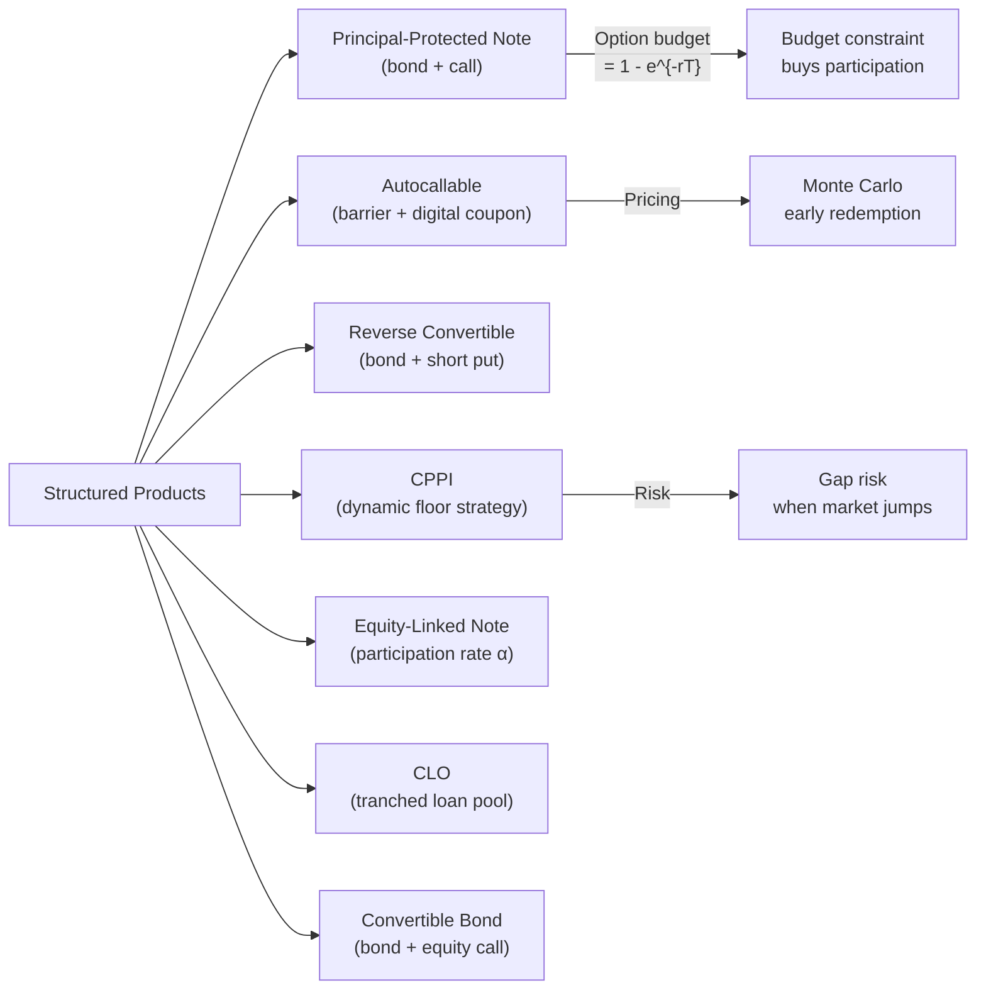

# Structured Products

> [!abstract] TL;DR
> Structured products are custom financial instruments assembled from bonds, derivatives, and conditional payoffs to deliver a specific risk-return profile — capital protection, enhanced yield, or conditional participation. They are client-facing packaging of sophisticated option strategies: a principal-protected note is a zero-coupon bond plus a call; an autocallable is a digital/barrier structure; a reverse convertible is a short put wrapped in a high coupon. CPPI is the dynamic strategy that provides portfolio insurance without paying option premium. Regulatory frameworks (MiFID II, PRIIPs) impose strict distribution and disclosure rules.

---

## Intuition

Structured products are like custom cocktails: the bartender (structurer) combines base spirits (bond, call option, barrier), mixers (leverage, currency feature), and garnishes (capital guarantee, coupon) in precise proportions to create exactly the flavour (risk-return profile) the client wants. A conservative client gets mostly water (bond) with a splash of equity exposure (call option). An aggressive client swaps the bond for yield enhancement and takes on downside risk.

The key discipline of structuring is the **option budget** — the difference between the par value and the cost of the bond component. The structurer must buy all the exotic optionality with this budget. Higher interest rates → cheaper bonds → more budget → better terms for the client. Higher volatility → more expensive options → lower participation rate. Every parameter trade-off flows from this constraint.

CPPI is different: rather than packaging options, it dynamically manages the allocation between a risky portfolio and a safe floor, providing a guarantee through active trading. The risk is not option premium but **gap risk** — the possibility that a market gap breaches the floor before the manager can rebalance.

---

## How It Works



---

## Key Concepts

### Principal-Protected Note (PPN)

Structure: invest $1 into a zero-coupon bond + use the residual to buy equity upside.

**Option budget** (residual after buying bond):

$$\text{Budget} = 1 - P_{bond} = 1 - e^{-rT}$$

With $r = 4\%$, $T = 5Y$: Budget $= 1 - e^{-0.20} \approx 18.1\%$.

**Participation rate** (fraction of index return captured):

$$\alpha = \frac{\text{Budget}}{C_{ATM}} = \frac{1 - e^{-rT}}{C_{ATM}(S_0, T)}$$

If the ATM call costs 10%, then $\alpha = 18.1\%/10\% = 181\%$ — a 181% participation. If volatility rises and the call costs 15%, then $\alpha = 121\%$.

**Key sensitivities**:
- Higher $r$ → larger budget → better participation
- Higher $\sigma$ → more expensive call → lower participation
- Longer $T$ → more budget but also more expensive option → depends on term structure

### Autocallable Notes

An autocallable has **observation dates** $t_1 < t_2 < \cdots < t_n = T$. At each $t_k$:

1. If $S_{t_k} \geq B_{call}$ (autocall barrier, typically 100-105%), the note redeems at par + coupon $\times k$
2. If $S_{t_k} < B_{KI}$ (knock-in barrier, typically 60-70% of $S_0$), note is "knocked in" — final payoff is capped at the equity return (loss scenario)
3. Otherwise, coupon accrues and product continues

**Snowball variant**: coupon accumulates as long as no knock-in event; delivers a large lump sum if underlying stays range-bound over multiple years.

**Pricing**: Pure Monte Carlo — the early redemption condition makes all analytical methods inapplicable. See [[Monte_Carlo_Pricing]] for the early redemption logic.

**Dealer's risk**: Autocallables create massive short vega and short correlation exposure for structuring desks — they must hedge by buying single-stock variance and selling index variance, which is exactly the dispersion trade discussed in [[Exotic_Options]].

### Reverse Convertible

A reverse convertible pays a **high fixed coupon** $c$ but at maturity:

$$\text{Payoff} = \begin{cases}\text{Par} + c & \text{if } S_T \geq B \\ S_T/S_0 \times \text{Par} + c & \text{if } S_T < B\end{cases}$$

**Decomposition**: the investor is effectively **short a put option** and receives the put premium as enhanced coupon:

$$\text{Coupon}_{\text{reverse}} = \text{Bond coupon} + \text{Put premium (amortized)}$$

The client receives upfront yield enhancement; the bank buys the put it needs to hedge the structured note. For retail clients, this means they can lose principal in a falling market while believing they hold a "high yield bond." MiFID II suitability rules apply.

### CPPI — Constant Proportion Portfolio Insurance

CPPI provides a **dynamic capital guarantee** without paying option premium.

**Setup**:
- Floor $F = PV(\text{guarantee}) = \text{Par}\cdot e^{-r(T-t)}$ (grows toward par at maturity)
- Cushion $C_t = P_t - F_t$ (excess of portfolio over floor)
- Risky allocation: $E_t = m \times C_t$ where multiplier $m \in [4, 8]$
- Bond allocation: $P_t - E_t$

**Rebalancing rule**: after each market move, recompute $C_t$ and reset $E_t = m\times C_t$.

**Gap risk**: the floor is breached when a sudden market gap reduces $P_t$ below $F_t$ before rebalancing. With multiplier $m$, a drop of $1/m$ in the risky asset is enough to breach the floor. For $m = 5$, a 20% overnight gap wipes out the cushion.

**Expected cushion growth** (in a Black-Scholes world):

$$E[C_T] = C_0\exp\!\left(\left[r + m(\mu-r) - \frac{1}{2}m^2\sigma^2\right]T\right)$$

The strategy is beneficial when $m(\mu-r) > \frac{1}{2}m^2\sigma^2$, i.e., the Sharpe ratio exceeds $m\sigma/2$.

### Equity-Linked Notes (ELN)

ELN pays:

$$\text{Payoff} = \text{Par} \times (1 + \alpha \times \max(R_I, 0))$$

where $R_I = (I_T - I_0)/I_0$ is the index return. Capital is not protected — the downside is par (zero participation in losses), but also no guarantee beyond par. Participation:

$$\alpha = \frac{\text{Option budget}}{C_{ATM}}$$

Variants include **capped participation** (buy call spread instead of call) or **leveraged participation** (use cheaper digital or barrier call).

### CLO — Collateralized Loan Obligation

A CLO pools 100-200 leveraged loans into a Special Purpose Vehicle (SPV), then issues tranched notes:

| Tranche | Rating | Coupon (SOFR+) | First-loss? |
|---------|--------|----------------|-------------|
| Equity | NR | 15-20% equity IRR | Yes — absorbs first 8-12% losses |
| Mezz B | BB/B | 700-900 bps | Second |
| Mezz A | BBB | 350-450 bps | Third |
| Senior B | A | 180-250 bps | Fourth |
| Senior A | AAA | 110-150 bps | Last |

**Manager incentives**: CLO equity investors benefit from the manager actively trading loans, rotating into better credits, and calling/refinancing the CLO when spreads tighten. Manager fees include senior fees + subordinated fees + equity.

**Key risk**: CLO equity returns are highly sensitive to loan default rates and recovery rates — a 1% increase in annual default rates can reduce equity IRR by 3-5%.

### Convertible Bonds

A convertible bond is a corporate bond with an embedded **equity call option** (the conversion option):

$$\text{Payoff} = \max(\text{Bond value},\ n_c \times S_T)$$

where $n_c$ is the conversion ratio (shares per bond).

**Conversion premium**: $\frac{\text{Bond price} - n_c\times S_0}{n_c\times S_0}$

**Greeks**: the convert has equity delta $\Delta \in [0, 1]$, positive gamma, negative theta.

**Convertible arbitrage**: Buy the convertible, short $\Delta$ shares. The trade is long gamma, long credit (if the bond is cheap), long volatility. PnL comes from delta-hedge rebalancing when the stock moves significantly.

**Pricing**: tree methods or PDE on a two-dimensional grid (stock price, credit spread) to handle simultaneous equity optionality and credit risk.

### Regulatory Framework

- **MiFID II**: Requires suitability assessment for complex products sold to retail clients; manufacturer and distributor responsible for product governance
- **PRIIPs KID**: Key Information Document with standardised 1-3 page disclosure including risk indicator (1-7), performance scenarios, and costs
- **Complex product flag**: Barrier products, leverage products, and any with early termination features require enhanced disclosure
- **Pin risk management**: Barrier products near the barrier at expiry create discontinuous payoffs; desks must manage delta which can swing violently

---

## Python Example

```python
import numpy as np

def cppi_simulation(P0=100.0, F0=80.0, m=4, mu=0.07, sigma=0.15,
                    r=0.04, T=5.0, n_steps=252*5, n_paths=10_000,
                    gap_size=0.0):
    """
    Simulate CPPI strategy with optional gap risk.
    gap_size: fraction of overnight drop in risky asset (e.g. 0.25 = 25% gap).
    """
    rng = np.random.default_rng(42)
    dt = T / n_steps

    results = {'final_port': [], 'floor_breached': [], 'risky_alloc': []}

    for _ in range(n_paths):
        P = P0
        # Floor grows to par at maturity under risk-free rate
        # We track it as PV of guarantee
        T_remaining = T

        for step in range(n_steps):
            T_remaining -= dt
            F = P0 * np.exp(-r * T_remaining)  # PV of guarantee
            cushion = max(P - F, 0.0)
            E = min(m * cushion, P)  # risky (capped at full portfolio)
            B = P - E               # safe (bond)

            # Simulate risky asset return
            dW = rng.standard_normal()
            risky_return = (mu - 0.5 * sigma**2) * dt + sigma * np.sqrt(dt) * dW

            # Apply gap risk on a random step (if specified)
            if gap_size > 0 and step == n_steps // 2:
                risky_return -= gap_size

            E_new = E * np.exp(risky_return)
            B_new = B * np.exp(r * dt)
            P = E_new + B_new

            if P < F:
                results['floor_breached'].append(True)
                results['final_port'].append(P)
                results['risky_alloc'].append(E / P0)
                break
        else:
            results['floor_breached'].append(False)
            results['final_port'].append(P)
            results['risky_alloc'].append(E / P0)

    final = np.array(results['final_port'])
    breached = np.array(results['floor_breached'])

    print(f"CPPI Simulation  m={m}, gap={gap_size*100:.0f}%")
    print(f"  Mean final portfolio: {final.mean():.2f}")
    print(f"  P(floor breach):      {breached.mean()*100:.2f}%")
    print(f"  5th percentile:       {np.percentile(final, 5):.2f}")
    print(f"  Guarantee (F0):       {F0:.2f}")

    return final, breached

# Without gap
cppi_simulation(gap_size=0.0)
print()
# With 25% gap event
cppi_simulation(gap_size=0.25)
```

**Expected output**:
```
CPPI Simulation  m=4, gap=0%
  Mean final portfolio: 131.47
  P(floor breach):      0.00%
  5th percentile:       83.21
  Guarantee (F0):       80.00

CPPI Simulation  m=4, gap=25%
  Mean final portfolio: 98.32
  P(floor breach):      12.43%
  5th percentile:       74.18
  Guarantee (F0):       80.00
```

---

## Real-World Notes

- **Autocallable dominance**: Autocallables account for ~60-70% of structured product issuance in Asia. Their implicit short-vol position by dealers helps explain the sustained implied vol premium in Asian single-stock markets.
- **CPPI in pension funds**: CPPI underpins many lifecycle pension products in Europe (e.g., Axa's Odyssial, BNP Cardif products). Gap risk is the primary reason maximum multipliers stay at 4-5 for retail products.
- **CLO boom**: CLO issuance exceeded $180B in 2021. CLO equity has been one of the best risk-adjusted credit instruments post-GFC due to active management and structural protections.
- **Convertible bond arbitrage**: A core hedge fund strategy; vol is purchased cheaply via the embedded option. Works best when equity vol is underpriced in the convert market relative to listed options.

---

## Common Pitfalls

1. **Stale pricing of autocallables**: Autocallables are illiquid. Marking to model using stale vol surfaces or wrong correlation assumptions leads to significant mispricing when markets move.
2. **Gap risk underestimation**: CPPI gap risk is heavily tail-dependent — stress-test with 2008 (30%+ drops) not just historical vol scenarios.
3. **Convertible credit risk**: Pricing converts without credit spread dynamics misses the most important risk — when the stock falls, the credit spread widens, and the bond floor drops simultaneously (the "credit-equity correlation").
4. **CPPI lock-in**: Once the cushion hits zero, CPPI is 100% in bonds with no recovery — early lock-in in a falling market permanently forfeits equity upside.
5. **PRIIPs performance scenarios**: The regulatory scenarios (favorable, moderate, unfavorable, stress) are calculated using historical data that may not represent future risks — clients may be misled by optimistic scenarios in low-vol environments.

---

## Related Concepts

- [[Exotic_Options]] — barrier/digital mechanics; autocallable components; dispersion hedging
- [[Credit_Derivatives]] — CLO tranching; credit-linked notes; wrong-way risk
- [[Interest_Rate_Derivatives]] — PPN bond component; rate sensitivity of structured products
- [[Monte_Carlo_Pricing]] — essential engine for autocallable and CPPI pricing

---

## Review Questions

1. A 5-year PPN is issued when the risk-free rate is 4% and ATM vol is 20%. Compute the participation rate. If rates fall to 2% next year, what happens to the secondary market value of the PPN and its Greeks?
2. In a CPPI with $m = 5$ and initial cushion $C_0 = \$20$, what is the maximum instantaneous drop in the risky asset that can breach the floor? How does gap risk change if the multiplier is raised to 8?
3. An autocallable has monthly observation dates and a 70% knock-in barrier. Explain qualitatively how the dealer's delta and vega change as the underlying approaches the autocall barrier from below on an observation date.

---

## Sources

- Wilmott, P. (2006). *Paul Wilmott on Quantitative Finance* (Vol. 2). Wiley.
- Perold, A.F. & Sharpe, W.F. (1988). *Dynamic Strategies for Asset Allocation*. Financial Analysts Journal.
- Black, F. & Jones, R. (1987). *Simplifying Portfolio Insurance*. Journal of Portfolio Management.
- De Spiegeleer, J. & Schoutens, W. (2011). *The Handbook of Convertible Bonds*. Wiley.
- Brigo, D. & Mercurio, F. (2006). *Interest Rate Models — Theory and Practice*. Springer.
- MiFID II Directive 2014/65/EU; PRIIPs Regulation (EU) 1286/2014.

#quantitative-finance #advanced-derivatives #structured-products #cppi #autocallable #convertible-bonds #advanced
