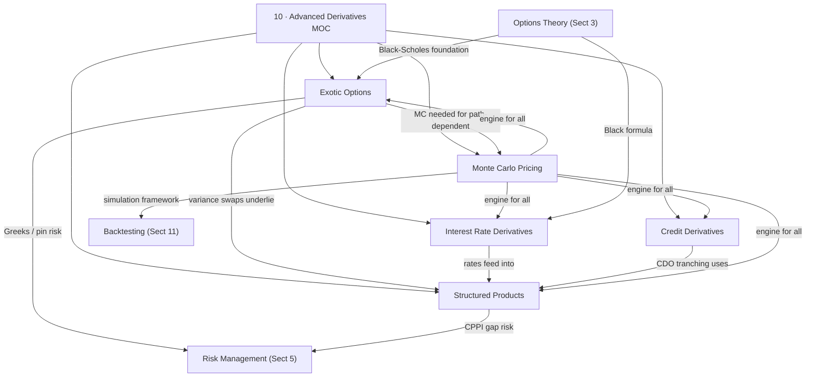

# Advanced Derivatives — Map of Content

> [!abstract]
> Advanced derivatives extend vanilla option theory into exotic payoffs, multi-factor interest rate models, credit-linked instruments, and structured product engineering. This section covers the full breadth of modern derivative pricing — from barrier options and variance swaps to CDO waterfall mechanics and Monte Carlo simulation methods — building on [[03_Options_Theory/_MOC_Options_Theory|Options Theory]] and feeding directly into [[05_Risk_Management/_MOC_Risk_Management|Risk Management]] and [[11_Backtesting_Infrastructure/_MOC_Backtesting|Backtesting]].

---

## Concept Map

---

## Learning Path

| Step | Note | Why This Order |
|------|------|----------------|
| 1 | [[Monte_Carlo_Pricing]] | Foundational engine — all other notes rely on simulation |
| 2 | [[Exotic_Options]] | First application of MC; path-dependent payoffs |
| 3 | [[Interest_Rate_Derivatives]] | Short-rate models, HJM, LMM — rate curve machinery |
| 4 | [[Credit_Derivatives]] | CDS, copulas, CDO tranching — credit risk layer |
| 5 | [[Structured_Products]] | Combines all prior knowledge into client-facing instruments |

---

## All Notes at a Glance

| Note | Core Concept | Key Math | Difficulty |
|------|-------------|----------|------------|
| [[Exotic_Options]] | Asian, barrier, lookback, variance swaps | $K_{var}=\frac{2}{T}\int\frac{C(K)}{K^2}dK$, log-contract | Advanced |
| [[Interest_Rate_Derivatives]] | Vasicek, CIR, Hull-White, HJM, LMM | Affine structure $P=e^{A-Br}$, Riccati ODEs | Advanced |
| [[Credit_Derivatives]] | CDS bootstrap, Gaussian copula, CDO tranches | $s\approx\lambda(1-R)$, conditional PD formula | Advanced |
| [[Structured_Products]] | PPN, autocallable, CPPI, convertible bonds | CPPI: risky = $m\times C$, participation $\alpha$ | Advanced |
| [[Monte_Carlo_Pricing]] | GBM MC, variance reduction, LSM, FFT | SE $=\sigma/\sqrt{N}$, QMC $O((\log N)^d/N)$ | Advanced |

---

## Key Questions

1. Why is a variance swap called "model-free" and how does the log-contract replication work in practice?
2. What is the Feller condition in the CIR model and why does it matter for simulation?
3. How does the Gaussian copula's zero upper tail dependence ($\lambda_U = 0$) explain CDO mispricing during the GFC?
4. Why does CPPI suffer from gap risk and how does the multiplier $m$ amplify that risk?
5. What is the Longstaff-Schwartz algorithm and why does backward induction require regression?
6. How does Hull-White calibrate to the initial yield curve, and what advantage does this give over Vasicek?
7. What is base correlation, and why is it the standard quoting convention for CDO tranches?

---

## Related Sections

- [[_MOC_QuantFinance_Master|Quantitative Finance Master MOC]]
- [[03_Options_Theory/_MOC_Options_Theory|Options Theory]] — Black-Scholes, Greeks, volatility surface
- [[05_Risk_Management/_MOC_Risk_Management|Risk Management]] — VaR, Greeks, counterparty risk
- [[11_Backtesting_Infrastructure/_MOC_Backtesting|Backtesting & Infrastructure]] — simulation pipeline
- [[06_Statistical_Methods/_MOC_Statistical_Methods|Statistical Methods]] — regression, time-series

---

#MOC #QuantitativeFinance #AdvancedDerivatives
