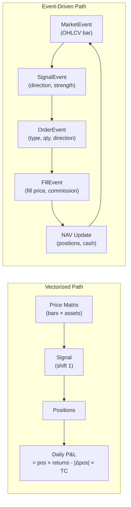

# Backtesting Framework

> [!abstract] TL;DR
> A backtest simulates a strategy's historical P&L as if it were traded live. The two dominant paradigms are vectorized (fast, matrix math) and event-driven (realistic, sequential). Getting the simulation *right* — eliminating look-ahead bias, survivorship bias, and unrealistic fills — is more important than any alpha signal, because a flawed engine silently manufactures profits that vanish in production.

## Intuition — The Rearview Mirror Analogy

Imagine you could watch every horse race *after it happened* and bet accordingly — you'd win every time. Backtesting has this same temptation built in: your code has access to future prices, future constituents, and future fundamentals unless you explicitly prevent it. A backtesting framework is primarily a set of guards against "peeking at the answer sheet." Only after those guards are in place does the simulated P&L carry information about whether the strategy actually works.

---

## How It Works



---

## Key Concepts

### 1. Vectorized vs Event-Driven

| Dimension | Vectorized | Event-Driven |
|---|---|---|
| Speed | Milliseconds (NumPy SIMD) | 10–1000× slower |
| Look-ahead risk | High — requires discipline with `.shift()` | Low — sequential by design |
| Realism | Approximate (uniform fills) | Full order book, partial fills, latency |
| Use case | Research, parameter sweeps | Pre-production, HFT, options |

**Vectorized core equation:**

$$NAV_t = NAV_{t-1} \cdot \left(1 + \sum_i w_{i,t-1} r_{i,t} - \left|\Delta w_{i,t}\right| \cdot c\right)$$

The `.shift(1)` on positions is the single most important line of code: it ensures today's position was decided using yesterday's close, executed at today's open.

### 2. Look-Ahead Bias Prevention

Three rules eliminate the most common source of fabricated alpha:

1. **Bar timestamps**: Label a bar with its *close* time, not its *open* time. If the bar closes at 16:00, the signal derived from it can only execute at the *next* bar's open (16:00+, i.e., next day 09:30).
2. **Execute at Open(t+1)**: `positions = signals.shift(1)` in vectorized; emit OrderEvent during MarketEvent processing and resolve at next bar in event-driven.
3. **PIT (Point-in-Time) fundamental data**: Earnings announced on 2024-05-01 for Q1 2024 must not appear in any backtest bar before 2024-05-01, even though the *period end* was 2024-03-31. The gap (typically 4–8 weeks) is a free look-ahead that inflates fundamental strategies by 1–3% annualized.

### 3. Survivorship Bias

Using an index's *current* constituents as the universe causes survivorship bias: companies that went bankrupt or were acquired are missing, leaving only survivors (which, by definition, did well). The fix is a PIT constituent database that records exactly which securities were in the index on each historical date.

**Magnitude**: Studies estimate survivorship bias inflates Sharpe by 0.2–0.5 across equity long-short strategies.

### 4. Execution Modeling

Realistic fill modeling prevents the "I assumed I could buy at mid" fallacy.

**Fill price model:**

$$P_{fill} = P_{mid} + \frac{s}{2} + \eta \cdot \sigma_i \cdot \sqrt{\frac{Q}{V_i}}$$

Where:
- $s/2$: half bid-ask spread
- $\eta \approx 0.1$: market impact coefficient
- $Q$: order size, $V_i$: daily volume, $\sigma_i$: daily volatility

**Volume participation cap**: Limit each order to $\phi \leq 25\%$ of average daily volume. Any excess rolls to the next bar.

**Short borrow costs**: For equity short-selling, subtract an annualized borrow rate (typically 0.25%–3% for easy-to-borrow, up to 50%+ for hard-to-borrow names) from the daily P&L on short positions.

### 5. Transaction Cost (TC) Drag

TC drag quantifies how much a strategy's gross Sharpe degrades after trading costs.

**Sharpe drag formula:**

$$\Delta S = \frac{2c \cdot TO}{\sigma_{ann}}$$

Where $c$ = one-way cost (bps), $TO$ = annualized turnover (fraction), $\sigma_{ann}$ = annualized return volatility.

**Break-even turnover** — maximum TO that still leaves the strategy profitable:

$$TO^* = \frac{S_{gross} \cdot \sigma_{ann}}{2c}$$

*Example*: $S_{gross} = 1.5$, $\sigma = 15\%$, $c = 5$ bps $\Rightarrow TO^* = 1.5 \times 0.15 / (2 \times 0.0005) = 225$ round-trips/year.

### 6. Performance Metrics Summary

| Metric | Formula | Target |
|---|---|---|
| CAGR | $(NAV_T/NAV_0)^{252/T} - 1$ | Strategy-dependent |
| Sharpe (annualized) | $S_{daily}\sqrt{252}$ | > 1.0 research, > 0.8 live |
| Sharpe SE | $\sqrt{(1+S^2/2)/T}$ | Used for PSR |
| Sortino | $(\mu_p - r_f)/\sigma_d$ | > 1.5 |
| Calmar | CAGR / MaxDD | ≥ 0.5 |
| Ulcer Index | $\sqrt{\frac{1}{T}\sum DD_t^2}$ | Lower is better |

### 7. Kelly Criterion & Sizing

The Kelly fraction maximizes log-wealth growth in expectation:

$$f^* = \frac{\mu - r_f}{\sigma^2}$$

In practice, use **half-Kelly** ($f^*/2$) to reduce variance. Full Kelly maximizes long-run growth but produces catastrophic drawdowns in finite samples.

### 8. Strategy Capacity

A strategy's AUM ceiling $C^*$ where market impact erodes alpha to zero:

$$C^* = \left(\frac{CAGR_{gross}}{c_2}\right)^2 \times ADV$$

Where $c_2$ is the square-root impact coefficient and $ADV$ is average daily volume of the universe. Doubling AUM increases impact drag by $\sqrt{2} - 1 \approx 41\%$.

---

## Python Example — Event-Driven Framework Skeleton

```python
from dataclasses import dataclass, field
from collections import deque
from enum import Enum
import pandas as pd
import numpy as np

class EventType(Enum):
    MARKET = "MARKET"
    SIGNAL = "SIGNAL"
    ORDER  = "ORDER"
    FILL   = "FILL"

@dataclass
class MarketEvent:
    type: EventType = EventType.MARKET
    timestamp: pd.Timestamp = None
    data: dict = field(default_factory=dict)   # {ticker: {open,high,low,close,volume}}

@dataclass
class SignalEvent:
    type: EventType = EventType.SIGNAL
    ticker: str = ""
    direction: float = 0.0                      # +1 long, -1 short, 0 flat
    strength: float = 1.0                       # position sizing hint

@dataclass
class OrderEvent:
    type: EventType = EventType.ORDER
    ticker: str = ""
    quantity: float = 0.0
    direction: str = "BUY"                      # BUY / SELL
    order_type: str = "MKT"

@dataclass
class FillEvent:
    type: EventType = EventType.FILL
    ticker: str = ""
    quantity: float = 0.0
    direction: str = "BUY"
    fill_price: float = 0.0
    commission: float = 0.0


class Portfolio:
    def __init__(self, initial_capital: float = 1_000_000):
        self.cash = initial_capital
        self.positions: dict[str, float] = {}   # ticker -> shares
        self.nav_history: list[float] = []

    def update_fill(self, fill: FillEvent):
        sign = 1 if fill.direction == "BUY" else -1
        cost = sign * fill.quantity * fill.fill_price + fill.commission
        self.cash -= cost
        self.positions[fill.ticker] = self.positions.get(fill.ticker, 0) + sign * fill.quantity

    def mark_to_market(self, prices: dict[str, float]):
        equity = sum(qty * prices.get(t, 0) for t, qty in self.positions.items())
        nav = self.cash + equity
        self.nav_history.append(nav)
        return nav


class ExecutionHandler:
    SPREAD_BPS = 5          # half-spread in bps
    IMPACT_ETA = 0.1        # square-root impact coefficient
    COMMISSION_BPS = 3

    def execute_order(self, order: OrderEvent, bar: dict) -> FillEvent:
        mid = (bar["high"] + bar["low"]) / 2
        vol_ratio = order.quantity / max(bar["volume"], 1)
        spread_cost = mid * self.SPREAD_BPS / 10_000
        impact = self.IMPACT_ETA * bar.get("sigma", mid * 0.01) * np.sqrt(vol_ratio)
        fill_price = mid + spread_cost + impact if order.direction == "BUY" else mid - spread_cost - impact
        commission = abs(order.quantity) * fill_price * self.COMMISSION_BPS / 10_000
        return FillEvent(
            ticker=order.ticker, quantity=order.quantity,
            direction=order.direction, fill_price=fill_price, commission=commission
        )


def run_backtest(price_data: pd.DataFrame, strategy_fn) -> pd.Series:
    """
    price_data: MultiIndex DataFrame (date, ticker) with OHLCV columns
    strategy_fn: callable(bar_data) -> list[SignalEvent]
    Returns NAV series.
    """
    events: deque = deque()
    portfolio = Portfolio()
    execution = ExecutionHandler()

    for timestamp, day_data in price_data.groupby(level=0):
        bar_dict = day_data.droplevel(0).to_dict(orient="index")
        events.append(MarketEvent(timestamp=timestamp, data=bar_dict))

        while events:
            event = events.popleft()

            if event.type == EventType.MARKET:
                for signal in strategy_fn(event.data):
                    events.append(signal)

            elif event.type == EventType.SIGNAL:
                qty = 1000 * event.strength  # simplified fixed sizing
                direction = "BUY" if event.direction > 0 else "SELL"
                events.append(OrderEvent(ticker=event.ticker, quantity=qty, direction=direction))

            elif event.type == EventType.ORDER:
                if event.ticker in event_data := event.__dict__:   # noqa — simplified
                    bar = bar_dict.get(event.ticker, {})
                    if bar:
                        fill = execution.execute_order(event, bar)
                        events.append(fill)

            elif event.type == EventType.FILL:
                portfolio.update_fill(event)

        prices_now = {t: v["close"] for t, v in bar_dict.items()}
        portfolio.mark_to_market(prices_now)

    return pd.Series(portfolio.nav_history)
```

---

## Real-World Notes

- **Bar granularity matters**: Daily bars hide intraday execution; minute bars expose it. Most systematic equity strategies are best prototyped on daily and then stress-tested on minute data.
- **Adjusted vs unadjusted prices**: Always use split/dividend-adjusted prices for signal calculation, but use *unadjusted* prices for trade execution P&L. Mixing them creates phantom returns.
- **Funding costs**: Long-short books require borrowing cash or margin; the cost is LIBOR/SOFR + spread. Omitting this overstates net Sharpe by ~0.15–0.3 for typical 2× gross leverage.

## Common Pitfalls

- Using `df.fillna(method='ffill')` *before* the `.shift(1)` — the fill propagates forward-looking prices.
- Reindexing to a fixed date range without restricting to PIT constituents at each date.
- Ignoring corporate actions (spin-offs, mergers) that create artificial price gaps.
- Assuming unlimited liquidity: a signal sized to 10% of daily volume will move the market against you.
- Forgetting that short-side interest income partially offsets borrow costs in a long-short book.

## Related Concepts

- [[Overfitting_in_Finance]] — once the engine is correct, test whether the signal is statistically robust
- [[Walk_Forward_Analysis]] — use rolling OOS windows to get unbiased performance estimates
- [[Risk_Adjusted_Returns]] — the metrics computed from the NAV series produced here
- [[Portfolio_Construction]] — how to translate signals into actual position sizes
- [[Execution_Market_Impact]] — deeper dive on market impact models

## Review Questions

1. What single line of Python code is most responsible for preventing look-ahead bias in a vectorized backtest, and why?
2. A momentum strategy has $S_{gross} = 1.8$, $\sigma_{ann} = 20\%$, and one-way cost of 8 bps. What is the break-even annual turnover?
3. Explain why using current S&P 500 constituents to backtest a factor strategy since 2000 introduces survivorship bias.
4. If your fill model always assumes mid-price fills, which direction will strategy performance be biased and by roughly how much for a 10% ADV participation order?
5. What is PIT data and why does the announcement-date vs period-end distinction matter for earnings-based signals?

## Sources

- Prado, M. L. de. *Advances in Financial Machine Learning*. Wiley, 2018.
- Chan, E. *Algorithmic Trading: Winning Strategies and Their Rationale*. Wiley, 2013.
- Kissell, R. *The Science of Algorithmic Trading and Portfolio Management*. Academic Press, 2013.
- Grinold, R. & Kahn, R. *Active Portfolio Management*. 2nd ed., McGraw-Hill, 2000.

#quantitative-finance #backtesting #simulation #advanced
