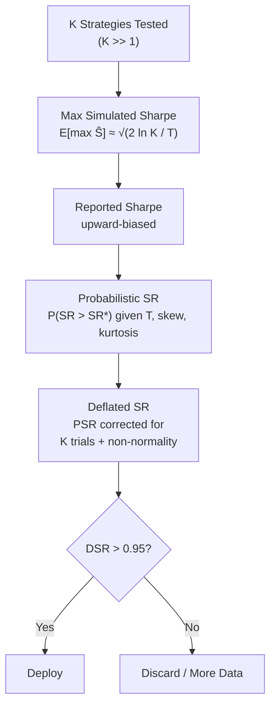

# Overfitting in Finance

> [!abstract] TL;DR
> The expected maximum Sharpe from K random strategies grows as $\sqrt{2\ln K / T}$ — meaning testing 100 strategies for 48 months requires 576 months of data before you'd trust the winner. Finance's version of overfitting is insidious because the "model" is not a neural network's weights but the researcher's own sequential choices. The Probabilistic Sharpe Ratio (PSR) and Deflated Sharpe Ratio (DSR) are the principled antidotes, along with multiple-testing corrections from statistics.

## Intuition — The Monkeys at Typewriters

Suppose you give 1,024 monkeys a coin and ask each one to flip it 10 times, betting heads every time. By chance alone, roughly 1 monkey will flip 10 heads in a row — a perfect record. If you then study that monkey's "strategy" intensely, you'll find all sorts of patterns to justify why it was skilled. This is precisely what happens when researchers test hundreds of parameter combinations and report only the best backtest. The winning monkey is noise, dressed up as skill.

---

## How It Works



---

## Key Concepts

### 1. Backtest Overfitting Theorem (Bailey & López de Prado)

The expected maximum Sharpe ratio obtainable from $K$ independently simulated strategies of length $T$ is approximately:

$$E\left[\max_{k=1\dots K} \hat{S}_k\right] \approx \frac{\sqrt{2 \ln K}}{\sqrt{T}} \cdot \left(1 - \frac{\gamma + \ln(\sqrt{2 \ln K})}{2 \ln K}\right) \approx \sqrt{\frac{2 \ln K}{T}}$$

Where $\gamma \approx 0.5772$ is the Euler-Mascheroni constant. The simplified form:

$$E[\max \hat{S}] \approx \sqrt{\frac{2 \ln K}{T}}$$

**MinBTL (Minimum Backtest Length)**: The data length required before the expected maximum simulated Sharpe equals a target $SR^*$:

$$T_{MinBTL}(K, SR^*) = \left(\frac{\sqrt{2 \ln K}}{SR^*}\right)^2$$

For $K = 100$, $SR^* = 1.0$: $T \approx (2\ln 100)/1 \approx 9.2 \text{ years} = 576 \text{ months}$.

### 2. Bias Taxonomy

| Bias Type | Mechanism | Typical Sharpe Inflation |
|---|---|---|
| **Look-ahead bias** | Signals use future data | 0.5–5.0 (can be unbounded) |
| **Survivorship bias** | Dead companies excluded | 0.2–0.5 |
| **Selection bias** | Reporting best time window | 0.3–1.0 |
| **Time-period bias** | Cherry-picked sample (e.g., post-2009 bull) | 0.5–2.0 |
| **Overfitting (params)** | Too many free parameters fit to noise | 0.2–2.0 |
| **Multiple testing** | Best of K strategies reported as if unique | $\sqrt{2\ln K / T}$ |

### 3. Multiple Testing Corrections

When testing $K$ hypotheses simultaneously at significance level $\alpha$:

**Bonferroni correction** (conservative, assumes independence):
$$p\text{-value threshold} = \frac{\alpha}{K}$$

**Benjamini-Hochberg (BH) FDR** (controls expected false discovery rate for independent tests):
1. Order p-values: $p_{(1)} \leq p_{(2)} \leq \cdots \leq p_{(K)}$
2. Find largest $k$ such that $p_{(k)} \leq \frac{k}{K}\alpha$
3. Reject all $H_0$ for $j \leq k$

**Benjamini-Hochberg-Yekutieli (BHY)** — for dependent tests (use this in finance where strategies share factor exposures):
$$p_{(k)} \leq \frac{k \cdot \alpha}{K \cdot c(K)}, \quad c(K) = \sum_{j=1}^K \frac{1}{j} \approx \ln K + \gamma$$

### 4. HLZ t-Thresholds by Era (Harvey, Liu, Zhu 2016)

| Era | Required t-statistic | Why |
|---|---|---|
| Pre-1980 | t > 1.96 | Few strategies tested |
| 1980–2002 | t > 2.57 | Growing factor zoo |
| Post-2003 | t > 3.00 | Massive computational search |

### 5. White's Reality Check and Hansen's SPA Test

**White's Reality Check**: Bootstraps the distribution of $\max_k \hat{S}_k$ under the null that all strategies have zero Sharpe. Produces a p-value for whether the best strategy beats a naive benchmark.

**Hansen's Superior Predictive Ability (SPA)**: Extension that removes poor-performing models from the null, giving higher power. Both are implemented in `arch` library.

### 6. Probabilistic Sharpe Ratio (PSR)

The PSR answers: given an observed Sharpe $\hat{S}$ from $T$ observations, what is the probability that the true Sharpe exceeds a benchmark $SR^*$?

$$PSR(SR^*) = \Phi\left(\frac{(\hat{S} - SR^*)\sqrt{T-1}}{\sqrt{1 - \hat{S}\cdot\hat{\gamma}_3 + \frac{\hat{S}^2}{4}(\hat{\gamma}_4 - 1)}}\right)$$

Where:
- $\Phi(\cdot)$: standard normal CDF
- $\hat{\gamma}_3$: estimated skewness of returns
- $\hat{\gamma}_4$: estimated excess kurtosis
- $SR^*$: benchmark Sharpe (often 0 or a simple strategy's Sharpe)

> [!note] Non-normality matters
> Negative skewness (tail risk strategies) and excess kurtosis reduce PSR below what a naive Sharpe comparison would suggest. A strategy with $\hat{S} = 1.5$ but high kurtosis may have lower PSR than one with $\hat{S} = 1.2$ and normal returns.

### 7. Deflated Sharpe Ratio (DSR)

DSR adjusts PSR for the number of strategies tried and their non-normality:

$$DSR = PSR\left(SR^*\right) \text{ where } SR^* = \sqrt{\frac{1}{T}}\left[(1-\gamma)\Phi^{-1}\left(1 - \frac{1}{K}\right) + \gamma\Phi^{-1}\left(1 - \frac{1}{K \cdot e}\right)\right]$$

The $SR^*$ here grows with $K$ (the number of trials) — effectively setting a higher bar the more strategies you tested. **Deployment threshold: DSR > 0.95**.

### 8. IS/OOS Information Coefficient Decay

A healthy strategy's in-sample (IS) information coefficient (IC) should partially survive out-of-sample (OOS):

| IC Decay Ratio ($IC_{OOS}/IC_{IS}$) | Interpretation |
|---|---|
| 0.7–1.0 | Suspicious — may be regime-specific |
| 0.3–0.7 | Healthy range |
| 0.1–0.3 | Overfit — limited OOS persistence |
| < 0.1 | Noise — no real signal |

---

## Python Example — PSR/DSR and Multiple Testing

```python
import numpy as np
from scipy import stats

# ── PSR ───────────────────────────────────────────────────────────────────────
def probabilistic_sharpe_ratio(returns: np.ndarray, sr_benchmark: float = 0.0) -> float:
    """
    PSR = P(SR > sr_benchmark) accounting for non-normality of returns.
    returns: daily return series
    """
    T = len(returns)
    sr_hat = returns.mean() / returns.std(ddof=1) * np.sqrt(252)   # annualised

    skew = stats.skew(returns)
    kurt = stats.kurtosis(returns, excess=True)  # excess kurtosis

    denom = np.sqrt(1 - sr_hat * skew + sr_hat**2 * (kurt - 1) / 4)
    z = (sr_hat - sr_benchmark) * np.sqrt(T - 1) / denom
    return float(stats.norm.cdf(z))


# ── DSR ───────────────────────────────────────────────────────────────────────
def deflated_sharpe_ratio(returns: np.ndarray, n_trials: int,
                           skewness: float = None, kurtosis: float = None) -> float:
    """
    DSR adjusts PSR for multiple testing with n_trials strategies evaluated.
    """
    T = len(returns)
    gamma = np.euler_gamma  # 0.5772...

    # Expected max SR under repeated Gaussian trials (benchmark)
    e_max_sr = np.sqrt(2 * np.log(n_trials)) / np.sqrt(T) if n_trials > 1 else 0.0

    # Sharpe ratio* adjusted for number of trials
    sr_star = np.sqrt(1 / T) * (
        (1 - gamma) * stats.norm.ppf(1 - 1 / n_trials)
        + gamma * stats.norm.ppf(1 - 1 / (n_trials * np.e))
    )

    return probabilistic_sharpe_ratio(returns, sr_benchmark=sr_star)


# ── Multiple Testing Corrections ──────────────────────────────────────────────
def benjamini_hochberg(pvalues: np.ndarray, alpha: float = 0.05,
                        dependent: bool = False) -> np.ndarray:
    """
    BH FDR correction (BHY if dependent=True).
    Returns boolean mask of which hypotheses to reject.
    """
    K = len(pvalues)
    order = np.argsort(pvalues)
    sorted_p = pvalues[order]

    c_K = np.sum(1 / np.arange(1, K + 1)) if dependent else 1.0
    thresholds = np.arange(1, K + 1) * alpha / (K * c_K)

    below = sorted_p <= thresholds
    if not below.any():
        return np.zeros(K, dtype=bool)
    cutoff = np.max(np.where(below)[0])

    reject = np.zeros(K, dtype=bool)
    reject[order[:cutoff + 1]] = True
    return reject


# ── Example Usage ─────────────────────────────────────────────────────────────
if __name__ == "__main__":
    rng = np.random.default_rng(42)
    # Simulate 5 years of daily returns for a strategy with SR ~ 1.0
    mu_daily = 0.06 / 252
    sig_daily = 0.15 / np.sqrt(252)
    returns = rng.normal(mu_daily, sig_daily, 252 * 5)

    n_trials = 50   # we tried 50 parameter combinations
    psr = probabilistic_sharpe_ratio(returns, sr_benchmark=0.0)
    dsr = deflated_sharpe_ratio(returns, n_trials=n_trials)

    print(f"PSR (vs SR*=0): {psr:.3f}")
    print(f"DSR (K={n_trials}):  {dsr:.3f}  {'DEPLOY' if dsr > 0.95 else 'REJECT'}")

    # Multiple p-values from a strategy sweep
    pvalues = rng.uniform(0, 1, n_trials)
    pvalues[0] = 0.001   # one genuine signal
    reject_bh  = benjamini_hochberg(pvalues, alpha=0.05, dependent=False)
    reject_bhy = benjamini_hochberg(pvalues, alpha=0.05, dependent=True)
    print(f"BH rejects:  {reject_bh.sum()} / {n_trials}")
    print(f"BHY rejects: {reject_bhy.sum()} / {n_trials}")
```

---

## Real-World Notes

- **The Factor Zoo**: Cochrane (2011) counted 300+ published factors; Harvey, Liu & Zhu (2016) catalogued 316 by 2012. Most do not survive multiple-testing correction.
- **p-hacking in disguise**: Researchers often don't track how many variations they tried before publishing. A pre-registered research plan (where hypotheses are locked before data is seen) is the gold standard but rare in finance.
- **Regime specificity**: A strategy that works brilliantly in 2004–2008 may simply be exposed to credit spreads. IS/OOS decay measured across *different* regimes (not just later dates) is more diagnostic.

## Common Pitfalls

- Computing PSR with annualised Sharpe but daily-frequency $T$ — use consistent time units.
- Applying Bonferroni when strategies share factor exposures — the tests are not independent; use BHY instead.
- Treating DSR > 0.95 as a guarantee of live profitability — it is a statistical filter, not a certainty.
- Ignoring the kurtosis/skewness adjustment in PSR for strategies with option-like payoffs.

## Related Concepts

- [[Backtesting_Framework]] — the engine whose outputs are being evaluated here
- [[Walk_Forward_Analysis]] — OOS validation as the practical antidote to overfitting
- [[Risk_Adjusted_Returns]] — the metrics (Sharpe, Sortino) that feed into PSR/DSR
- [[Statistical_Inference]] — hypothesis testing foundations

## Review Questions

1. If you tested K = 500 parameter combinations over T = 60 months, what is the expected maximum Sharpe you would observe by chance alone?
2. Why does negative return skewness reduce the PSR, even if the annualized Sharpe is unchanged?
3. Under what conditions should you use BHY rather than BH FDR correction for a strategy search?
4. What is the DSR deployment threshold and what does it mean probabilistically?
5. A strategy has IS IC = 0.08 and OOS IC = 0.015. What does this IC decay ratio suggest about overfitting?

## Sources

- Bailey, D. & López de Prado, M. "The Deflated Sharpe Ratio." *Journal of Portfolio Management*, 2014.
- Harvey, C., Liu, Y. & Zhu, H. "... and the Cross-Section of Expected Returns." *Review of Financial Studies*, 2016.
- White, H. "A Reality Check for Data Snooping." *Econometrica*, 2000.
- Hansen, P. R. "A Test for Superior Predictive Ability." *JBES*, 2005.
- Bailey, D. et al. "The Probability of Backtest Overfitting." *JCFM*, 2017.

#quantitative-finance #backtesting #overfitting #statistics #advanced
