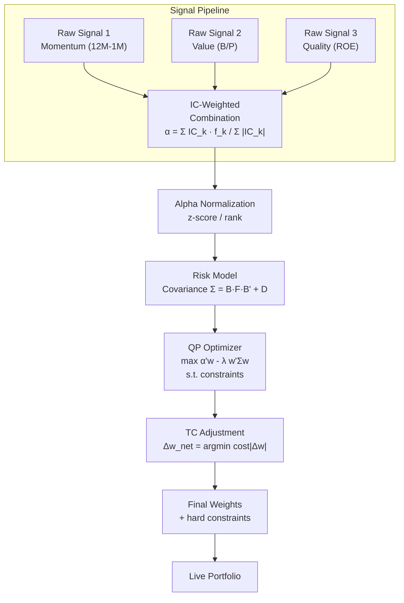

# Portfolio Construction

> [!abstract] TL;DR
> Portfolio construction is the bridge between raw alpha signals and investable weights. The pipeline has six stages: signal combination, normalization, risk model integration, QP optimization, TC adjustment, and constraint enforcement. The backtest-to-live Sharpe gap is typically 0.5–2.0 units due to overfitting, execution slippage, and capacity degradation — the deployment pipeline (WFA gate → paper trading → live at 5% notional) is designed to catch this before it becomes costly.

## Intuition — The Cocktail Mixing Analogy

Each alpha signal is a cocktail ingredient: momentum, value, quality, carry. No single ingredient is drinkable alone; together, with the right proportions, they produce something better than any individual component. Portfolio construction is the recipe. But unlike cocktails, the recipe must account for the "cost" of adding each ingredient (transaction costs), the "container size" (capacity), and regulatory constraints (position limits). Get the proportions wrong and the portfolio sours — it may backtest beautifully but fail live.

---

## How It Works



---

## Key Concepts

### 1. Signal Combination

Raw signals (momentum, value, quality, etc.) are combined into a single composite alpha using IC-weighted averaging:

$$\hat{\alpha}_i = \frac{\sum_k IC_k \cdot f_{ik}}{\sum_k |IC_k|}$$

Where $IC_k$ is the historical information coefficient (rank correlation between signal $k$ and forward returns) and $f_{ik}$ is the standardized signal $k$ for asset $i$. Equal-weighting by $IC$ is appropriate when estimates are noisy; use a covariance-weighted combination (signal IC matrix) when signals are correlated.

**Ensemble methods** (especially ML-based): Use out-of-fold predictions from [[Walk_Forward_Analysis]] to combine base learners, avoiding look-ahead in the combination step.

### 2. Alpha Normalization

Raw alpha must be normalized before entering the optimizer to prevent outliers from dominating:

| Method | Formula | When to use |
|---|---|---|
| Z-score | $\tilde{\alpha}_i = (\alpha_i - \mu_\alpha)/\sigma_\alpha$ | Signal approximately normally distributed |
| Cross-sectional rank | $\tilde{\alpha}_i = \text{rank}(\alpha_i) / N$ | Heavy-tailed signal (common for value) |
| Winsorized z-score | Clip at $\pm 3\sigma$ then z-score | Both extremes and normality desired |

Industry convention: use rank normalization for fundamental signals (eliminating extreme outliers), z-score for statistically derived signals.

### 3. Weighting Schemes

| Scheme | Formula | Pros | Cons |
|---|---|---|---|
| **Equal weight** | $w_i = 1/N$ | Simple, robust, no estimation error | Ignores risk; high-vol assets dominate |
| **Market cap** | $w_i = MktCap_i / \Sigma$ | Represents investable opportunity set | Momentum-tilted; concentration in large caps |
| **Inverse volatility** | $w_i \propto 1/\sigma_i$ | Simple risk parity per asset | Ignores correlations |
| **Risk parity** | $w_i : w_i \sigma_i \rho_{ij} w_j = $ equal | True equal risk contribution | Non-linear optimization; leverage may be needed |
| **Mean-variance (MVO)** | $w^* = \Sigma^{-1}\mu / (\mathbf{1}'\Sigma^{-1}\mu)$ | Theoretically optimal | Highly sensitive to estimation error |

### 4. Covariance Matrix Estimation

The sample covariance matrix is notoriously noisy for large universes ($N > \sqrt{T}$). Solutions:

**Ledoit-Wolf shrinkage** (analytical):

$$\hat{\Sigma}_{LW} = (1-\delta)\hat{\Sigma}_{sample} + \delta \cdot F$$

Where $F$ is a structured target (e.g., constant-correlation matrix) and $\delta$ is the optimal shrinkage intensity (closed-form). LW is the default for universes up to ~500 assets.

**Factor risk model** (Barra-style):

$$\hat{\Sigma} = B F B' + D$$

Where $B$ is the $N \times K$ factor loading matrix, $F$ is the $K \times K$ factor covariance, and $D$ is the diagonal idiosyncratic covariance. This forces structure and dramatically reduces estimation error. Standard for large universes (500–3000 assets).

### 5. QP Optimization — Mean-Variance Framework

The core optimization:

$$\max_w \quad \alpha' w - \lambda \cdot w' \Sigma w$$

Subject to:
$$\sum_i w_i = 1 \quad \text{(fully invested)}$$
$$w_i \geq -w_{max} \quad \text{(short limit)}$$
$$|w_i| \leq w_{max} \quad \text{(position limit)}$$
$$|w' \beta_j| \leq \delta_j \quad \text{(factor exposure limits)}$$

Where $\lambda$ is the **risk aversion coefficient** — larger $\lambda$ produces more diversified, lower-Sharpe portfolios. The risk aversion parameter is often calibrated so that the unconstrained portfolio has target annualized volatility $\sigma^*$:

$$\lambda \approx \frac{\bar{\alpha}}{2\sigma^{*2}}$$

### 6. Turnover-Constrained Optimization

Adding a TC penalty to the objective:

$$\max_w \quad \alpha' w - \lambda \cdot w' \Sigma w - c \cdot \|w - w_{prev}\|_1$$

The $L_1$ penalty on weight changes directly models proportional transaction costs. This is not quadratic (requires SOCP or iterative reweighting), but `cvxpy` handles it natively.

**Turnover budget**: Set a maximum two-way turnover $TO_{max}$ per period:

$$\sum_i |w_i^{new} - w_i^{prev}| \leq TO_{max}$$

Common targets: 20–50% annualized for monthly rebalancing systematic equity; 200–500% for short-horizon mean-reversion.

### 7. Factor Exposure Management

**Neutralization**: Remove unwanted factor tilts by constraining $w' \beta_j = 0$ for factors $j$ you want to be market-neutral (e.g., sector, country, size). This ensures the portfolio's return comes from the alpha signal, not accidental factor exposure.

**Tilts**: If the factor is part of the signal (e.g., a value strategy intentionally tilts on B/P), allow controlled exposure $|w' \beta_{val}| \leq 0.5$ rather than zeroing it.

### 8. Brinson-Hood-Beebower (BHB) Attribution

BHB decomposes active return vs benchmark into three effects:

| Effect | Formula |
|---|---|
| **Allocation** | $\sum_j (W_j - B_j) \cdot (R_j^B - R^B)$ |
| **Selection** | $\sum_j B_j \cdot (R_j^P - R_j^B)$ |
| **Interaction** | $\sum_j (W_j - B_j) \cdot (R_j^P - R_j^B)$ |

Where $W_j$ = portfolio weight in sector $j$, $B_j$ = benchmark weight, $R_j^P$ = portfolio return in sector $j$, $R_j^B$ = benchmark return in sector $j$, $R^B$ = total benchmark return.

BHB is the industry standard for long-only active managers; factor-model attribution (BARRA) is standard for long-short systematic strategies.

### 9. Rebalancing Strategies

| Strategy | Trigger | Pros | Cons |
|---|---|---|---|
| **Calendar** | Fixed interval (monthly, weekly) | Predictable; easy to operationalize | May trade when signal is stale |
| **Threshold** | Drift > $\delta$ from target | Trades only when needed | Threshold calibration needed |
| **Optimal** | Solve TC-constrained QP at each bar | Minimizes TC drag | Computationally intensive |

### 10. Live Trading Transition — The Backtest-to-Live Gap

The most critical and frequently ignored step:

$$S_{live} \approx S_{backtest} - \Delta S_{overfit} - \Delta S_{execution} - \Delta S_{capacity}$$

Typical gap components:
- $\Delta S_{overfit}$: 0.3–1.0 (from multiple-testing, look-ahead residuals)
- $\Delta S_{execution}$: 0.2–0.5 (slippage, market impact, latency)
- $\Delta S_{capacity}$: 0.1–0.5 (strategy underperforms at full AUM)

**Total gap**: 0.5–2.0 SR units is typical. A backtest Sharpe of 1.5 may deliver a live Sharpe of 0.8–1.0.

**Deployment pipeline** (standard practice):

```
1. WFA gate:         DSR > 0.95 and η > 0.4
2. Paper trading:    ≥ 3 months, |ΔS| < 0.3 vs backtest
3. Live at 5%:       ≥ 1 month, monitor slippage and signal decay
4. Live at 25%:      ≥ 2 months, validate capacity
5. Full deployment:  Ongoing monitoring with circuit breakers
```

**Circuit breakers**:

| Threshold | Action |
|---|---|
| −5% drawdown from high-water mark | Alert + review |
| −8% drawdown | Reduce position size by 50% |
| −10% drawdown | Halt new trades |
| −15% drawdown | Shutdown + post-mortem |

---

## Python Example — Full Pipeline

```python
import numpy as np
import pandas as pd
import cvxpy as cp
from sklearn.covariance import LedoitWolf

# ── Signal Combination ────────────────────────────────────────────────────────
def combine_signals(signals: dict[str, pd.DataFrame], ic_window: int = 63) -> pd.DataFrame:
    """
    IC-weighted signal combination.
    signals: dict of {name: DataFrame(date × asset)} with cross-sectional signals
    Returns composite alpha DataFrame(date × asset).
    """
    from scipy.stats import spearmanr

    # Placeholder: assume we have forward returns available for IC calculation
    # In practice, compute IC on a rolling IS window (not leaking future data)
    # Here we use equal weighting as a safe default
    alpha = sum(df.rank(axis=1, pct=True) - 0.5 for df in signals.values())
    return alpha / len(signals)


# ── Ledoit-Wolf Covariance ────────────────────────────────────────────────────
def estimate_covariance(returns: pd.DataFrame) -> np.ndarray:
    """Ledoit-Wolf shrinkage covariance estimate."""
    lw = LedoitWolf()
    lw.fit(returns.dropna())
    return lw.covariance_


# ── QP Portfolio Optimization ─────────────────────────────────────────────────
def optimize_portfolio(
    alpha: np.ndarray,
    cov: np.ndarray,
    prev_weights: np.ndarray = None,
    risk_aversion: float = 1.0,
    tc_cost: float = 0.0005,       # one-way cost
    max_weight: float = 0.05,
    max_sector_exposure: float = 0.25,
    sector_map: np.ndarray = None,  # (N,) integer sector assignments
    turnover_limit: float = 0.20,
) -> np.ndarray:
    """
    Solve the mean-variance optimization with TC and turnover constraints.
    Returns optimal weight vector.
    """
    N = len(alpha)
    w = cp.Variable(N)
    if prev_weights is None:
        prev_weights = np.zeros(N)

    # Objective: alpha - risk - TC
    delta_w  = w - prev_weights
    tc_penalty = tc_cost * cp.norm1(delta_w)
    objective = cp.Maximize(
        alpha @ w
        - risk_aversion * cp.quad_form(w, cov)
        - tc_penalty
    )

    constraints = [
        cp.sum(w) == 1,                          # fully invested
        w >= -max_weight,                        # short limit
        w <= max_weight,                         # long limit
        cp.norm1(delta_w) <= turnover_limit,     # turnover budget
    ]

    # Sector constraints
    if sector_map is not None:
        for s in np.unique(sector_map):
            mask = (sector_map == s)
            constraints.append(cp.abs(cp.sum(w[mask])) <= max_sector_exposure)

    prob = cp.Problem(objective, constraints)
    prob.solve(solver=cp.OSQP, warm_start=True, verbose=False)

    if prob.status not in ("optimal", "optimal_inaccurate"):
        return prev_weights   # fallback to previous
    return w.value


# ── BHB Attribution ───────────────────────────────────────────────────────────
def bhb_attribution(
    portfolio_weights: pd.DataFrame,  # date × sector
    benchmark_weights: pd.DataFrame,
    portfolio_returns: pd.DataFrame,  # date × sector
    benchmark_returns: pd.DataFrame,
) -> pd.DataFrame:
    """
    Brinson-Hood-Beebower attribution per period.
    Returns DataFrame with allocation, selection, interaction columns.
    """
    results = []
    for date in portfolio_weights.index:
        W = portfolio_weights.loc[date]
        B = benchmark_weights.loc[date]
        Rp = portfolio_returns.loc[date]
        Rb = benchmark_returns.loc[date]
        R_bench_total = (B * Rb).sum()

        allocation  = ((W - B) * (Rb - R_bench_total)).sum()
        selection   = (B * (Rp - Rb)).sum()
        interaction = ((W - B) * (Rp - Rb)).sum()
        results.append({"date": date, "allocation": allocation,
                        "selection": selection, "interaction": interaction,
                        "active_return": allocation + selection + interaction})
    return pd.DataFrame(results).set_index("date")


# ── Circuit Breaker Monitor ───────────────────────────────────────────────────
class CircuitBreaker:
    THRESHOLDS = [(-0.05, "ALERT"), (-0.08, "REDUCE_50PCT"),
                  (-0.10, "HALT"), (-0.15, "SHUTDOWN")]

    def __init__(self):
        self.hwm = 1.0          # high-water mark
        self.status = "NORMAL"

    def update(self, nav: float) -> str:
        self.hwm = max(self.hwm, nav)
        dd = (nav - self.hwm) / self.hwm
        for threshold, action in sorted(self.THRESHOLDS, key=lambda x: x[0]):
            if dd <= threshold:
                self.status = action
        return self.status


if __name__ == "__main__":
    rng = np.random.default_rng(42)
    N = 50
    alpha = rng.normal(0, 1, N)
    cov   = np.eye(N) * 0.01 + rng.normal(0, 0.001, (N, N)) ** 2
    cov   = (cov + cov.T) / 2 + np.eye(N) * 0.005   # ensure PSD

    weights = optimize_portfolio(alpha, cov, risk_aversion=2.0, tc_cost=0.0005)
    if weights is not None:
        print(f"Max weight:  {weights.max():.3f}")
        print(f"Min weight:  {weights.min():.3f}")
        print(f"Sum weights: {weights.sum():.3f}")
        print(f"L1 norm:     {np.abs(weights).sum():.3f}")
```

---

## Real-World Notes

- **Capacity degradation**: Doubling AUM increases market impact drag by $\sqrt{2} - 1 \approx 41\%$ (square-root model). A strategy with $S = 1.2$ at $\$50M$ may have $S = 0.9$ at $\$200M$.
- **Factor crowding**: When many systematic funds hold the same factor tilts (momentum, low-vol), a correlated unwind can cause brief but severe losses that are not captured by backtests run before the crowding occurred.
- **Paper trading gotchas**: Paper trading does not capture market impact, borrow scarcity, or corporate action complications. It validates signal and execution logic, not capacity.
- **Risk model updating**: Production risk models (Barra, Axioma) are updated daily or monthly. Using a stale risk model in optimization creates unintended factor tilts.

## Common Pitfalls

- Ignoring the TC penalty in the optimizer: the unconstrained MVO will trade 100%+ per period, destroying returns with costs.
- Using the in-sample covariance matrix for production optimization without shrinkage — extreme weights in low-eigenvalue directions.
- Setting sector neutralization constraints too tight (= 0) when the alpha signal legitimately tilts sectors.
- Failing to account for the full deployment pipeline — launching at 100% capital based on backtest results alone.

## Related Concepts

- [[Backtesting_Framework]] — the engine that tests the full construction pipeline historically
- [[Risk_Adjusted_Returns]] — Calmar, Sharpe, and Ulcer targets that constrain optimization
- [[Walk_Forward_Analysis]] — WFA gate is the first step in the deployment pipeline
- [[Overfitting_in_Finance]] — DSR gate; backtest-to-live gap quantification
- [[Mean_Variance_Optimization]] — mathematical foundations of the QP optimizer

## Review Questions

1. A composite alpha combines three signals with ICs of 0.06, 0.04, and 0.02. What is the IC-weighted contribution of each signal?
2. Why does Ledoit-Wolf shrinkage improve portfolio construction for a universe of 300 assets observed over 500 days?
3. Explain the three BHB attribution components and which one a sector-rotation strategy primarily aims to generate.
4. A strategy has backtest Sharpe = 1.8. What live Sharpe range should you realistically expect, and what are the three main sources of the gap?
5. A portfolio hits a −8% drawdown from its high-water mark. What action does the circuit breaker protocol require, and why does reducing size (rather than halting immediately) make sense at this threshold?

## Sources

- Grinold, R. & Kahn, R. *Active Portfolio Management*. 2nd ed., McGraw-Hill, 2000.
- Brinson, G., Hood, L. & Beebower, G. "Determinants of Portfolio Performance." *FAJ*, 1986.
- Ledoit, O. & Wolf, M. "A Well-Conditioned Estimator for Large-Dimensional Covariance Matrices." *JMVA*, 2004.
- López de Prado, M. *Advances in Financial Machine Learning*. Wiley, 2018. Ch. 16.
- Roncalli, T. *Introduction to Risk Parity and Budgeting*. Chapman & Hall, 2013.

#quantitative-finance #portfolio-construction #optimization #advanced
