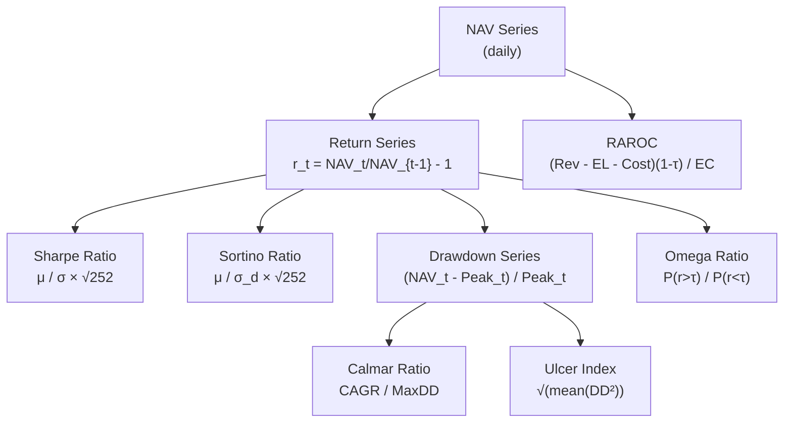

# Risk-Adjusted Returns

> [!abstract] TL;DR
> The Sharpe ratio is the industry default but is insufficient alone: it treats upside and downside volatility symmetrically, ignores tail risk, and has substantial estimation error (SE $\approx \sqrt{(1+S^2/2)/T}$). A complete performance evaluation uses Sortino (downside risk), Calmar (drawdown), Ulcer Index (drawdown smoothness), Omega (full return distribution), and RAROC (economic capital). Together these metrics paint an honest picture of return quality and differentiate skill from leverage.

## Intuition — The Speed vs Safety Analogy

Consider two drivers completing a race: Driver A averages 200 km/h but with wild swerves (high variance both up and down). Driver B averages 185 km/h with smooth, consistent lines. On a pure speed metric (Sharpe analog), A wins. But if you penalize only *dangerous* deviations (downside risk), B may score better. If you measure the worst skid (maximum drawdown), B almost certainly wins. Different metrics capture different aspects of "good" performance — you need the full dashboard, not just the speedometer.

---

## How It Works



---

## Key Concepts

### 1. Sharpe Ratio

$$S = \frac{\mu_p - r_f}{\sigma_p}$$

**Annualization**: Scale from daily to annual using $\sqrt{252}$ (trading days):

$$S_{ann} = S_{daily} \times \sqrt{252} = \frac{\bar{r}_{daily}}{\sigma_{daily}} \times \sqrt{252}$$

**Estimation error (SE)**: The Sharpe ratio has surprisingly large estimation error:

$$SE(S) = \sqrt{\frac{1 + S^2/2}{T}}$$

*Example*: $S = 1.0$, $T = 252$ (one year) $\Rightarrow SE = \sqrt{1.5/252} \approx 0.077$. A 95% CI spans $\pm 0.15$ — so a reported Sharpe of 1.0 from one year of data is consistent with true Sharpe anywhere in $[0.85, 1.15]$.

**Sharpe ≥ 1.0** is a common research threshold; **Sharpe ≥ 0.7–0.8** for live deployment (lower due to anticipated real-world slippage).

**Drawbacks of Sharpe**:
- Symmetric — penalizes upside and downside equally
- Assumes normally distributed returns — underestimates risk for negatively skewed / leptokurtic strategies
- Can be inflated by smoothing returns (e.g., illiquid NAV)
- Does not capture drawdown duration

### 2. Sortino Ratio

Replaces total volatility with **downside deviation** $\sigma_d$, measuring only negative return variation:

$$\sigma_d = \sqrt{\frac{1}{T}\sum_{t: r_t < \tau} (r_t - \tau)^2}$$

$$\text{Sortino} = \frac{\mu_p - r_f}{\sigma_d}$$

Where $\tau$ is the minimum acceptable return (MAR), often 0 or $r_f$. A strategy with high positive skewness (many small gains, rare large gains) will have a higher Sortino than Sharpe — correctly so. A short-vol strategy (many small gains, rare large losses) will have Sortino below Sharpe, revealing the hidden tail risk.

**Target**: Sortino > 1.5 for systematic strategies.

### 3. Calmar Ratio

$$\text{Calmar} = \frac{CAGR}{|\text{Maximum Drawdown}|}$$

Where:
- $CAGR = (NAV_T / NAV_0)^{252/T} - 1$
- $\text{MaxDD} = \max_{0 \leq s \leq t \leq T} \frac{NAV_s - NAV_t}{NAV_s}$

**Target: Calmar ≥ 0.5**. Trend-following CTAs typically target 0.5–1.0; equity L/S often achieves 0.3–0.7.

Calmar directly captures investor concern: "For every dollar of annual return, how many dollars could I have lost at worst?" A strategy with 15% CAGR and 30% MaxDD has Calmar = 0.5.

**Limitation**: MaxDD is a single extreme event, sensitive to the sample period. Calmar computed over 3 years can look very different from one computed over 10 years.

### 4. Maximum Drawdown Mechanics

The drawdown at time $t$ relative to the running peak:

$$DD_t = \frac{NAV_t - \max_{s \leq t} NAV_s}{\max_{s \leq t} NAV_s}$$

Additional drawdown statistics:
- **Average drawdown**: Mean of all $DD_t < 0$
- **Drawdown duration**: Consecutive bars with $DD_t < 0$ (measures recovery time)
- **Expected maximum drawdown**: Depends on $S$ and $T$:

$$E[\text{MaxDD}] \approx \sigma \sqrt{T} \cdot \left(0.63 + \frac{\ln\ln T + \ln(4\pi)}{2\sqrt{2\ln T}}\right)$$

### 5. Ulcer Index

$$UI = \sqrt{\frac{1}{T}\sum_{t=1}^T DD_t^2}$$

Unlike MaxDD (which captures only the single worst event), Ulcer Index penalizes strategies that spend *extended time in drawdown*, even if no single drawdown is catastrophic. A strategy with 10 drawdowns of 5% has higher Ulcer Index than one with 1 drawdown of 7% — reflecting the compounded stress of persistent underwater periods.

**Martin Ratio**: $\text{Martin} = CAGR / UI$ — Calmar's sister metric using Ulcer Index instead of MaxDD.

### 6. Information Ratio

$$IR = \frac{\alpha}{\omega} = \frac{E[r_p - r_b]}{\text{std}(r_p - r_b)}$$

Where $\alpha$ is active return (vs benchmark) and $\omega$ is tracking error. Used for long-only active managers who benchmark against an index.

- $IR > 0.5$: good active manager
- $IR > 1.0$: exceptional

**Fundamental Law of Active Management**: $IR \approx IC \times \sqrt{N}$ where $IC$ is the information coefficient per bet and $N$ is the number of independent bets per year.

### 7. Omega Ratio

The Omega ratio captures the full shape of the return distribution:

$$\Omega(\tau) = \frac{\int_\tau^\infty [1 - F(r)]\, dr}{\int_{-\infty}^\tau F(r)\, dr}$$

Where $F(r)$ is the empirical CDF of returns and $\tau$ is the threshold (often 0). Omega > 1 means gains above $\tau$ outweigh losses below $\tau$ in probability-weighted magnitude.

**Key property**: Under normal returns, Omega and Sharpe rank strategies identically. Under non-normal returns (the common case), they can disagree — Omega is the richer measure.

### 8. RAROC (Risk-Adjusted Return on Capital)

$$RAROC = \frac{(\text{Revenue} - EL - \text{OpEx})(1-\tau)}{EC} \geq 12\%$$

Where:
- $EL$: expected loss (credit/market risk)
- $EC$: economic capital (typically 99.9% VaR or CVaR over 1 year)
- $\tau$: tax rate

Used primarily in banking/trading desks to allocate capital to strategies. A desk with RAROC < 12% (cost of equity) destroys shareholder value even if it is Sharpe-positive.

### 9. Skewness, Kurtosis, and the Limits of Sharpe

Return distributions in finance frequently exhibit:
- **Negative skewness**: strategies that collect small premia but have rare catastrophic losses (short vol, carry)
- **Excess kurtosis (fat tails)**: more extreme returns than Gaussian would predict

A strategy can have $S = 1.5$ but $\gamma_3 = -2.0$ (severe negative skew): the PSR (see [[Overfitting_in_Finance]]) will be lower than a naive Sharpe comparison suggests, because the negative skew correctly penalizes the probability that the observed Sharpe was lucky.

### 10. Performance Persistence — Luck vs Skill

**Kosowski et al. (2006) bootstrap**: Resample fund returns with replacement, compute the bootstrap distribution of Sharpe ratios for *random* funds. If a fund's actual Sharpe exceeds the 95th percentile of the bootstrap distribution, there is evidence of skill rather than luck.

**Hot hands fallacy**: Most equity mutual fund outperformance does not persist beyond 1–2 years. Systematic strategies (trend following, value, momentum) show more durable performance because the underlying risk premiums are structural.

---

## Python Example — Comprehensive Performance Metrics

```python
import numpy as np
import pandas as pd
from scipy import stats

def compute_performance_metrics(
    returns: pd.Series,
    risk_free: float = 0.05,
    mar: float = 0.0,
    periods: int = 252
) -> dict:
    """
    Compute full suite of risk-adjusted performance metrics.
    returns: daily return series
    risk_free: annualized risk-free rate
    mar: minimum acceptable return (annualized) for Sortino
    periods: trading periods per year
    """
    rf_daily = (1 + risk_free) ** (1 / periods) - 1
    mar_daily = (1 + mar) ** (1 / periods) - 1
    excess = returns - rf_daily

    # ── Basic stats ──────────────────────────────────────────────────────
    mu   = returns.mean() * periods
    sig  = returns.std(ddof=1) * np.sqrt(periods)
    skew = stats.skew(returns)
    kurt = stats.kurtosis(returns, excess=True)

    # ── Sharpe ───────────────────────────────────────────────────────────
    sr      = excess.mean() / excess.std(ddof=1) * np.sqrt(periods)
    sr_se   = np.sqrt((1 + sr**2 / 2) / len(returns))

    # ── Sortino ──────────────────────────────────────────────────────────
    downside = returns[returns < mar_daily] - mar_daily
    sigma_d  = np.sqrt((downside**2).mean()) * np.sqrt(periods) if len(downside) > 0 else np.nan
    sortino  = (mu - mar) / sigma_d if sigma_d and sigma_d > 0 else np.nan

    # ── Drawdown series ──────────────────────────────────────────────────
    nav      = (1 + returns).cumprod()
    peak     = nav.cummax()
    dd       = (nav - peak) / peak
    max_dd   = dd.min()
    avg_dd   = dd[dd < 0].mean() if (dd < 0).any() else 0.0

    # Average drawdown duration (consecutive days underwater)
    in_dd    = (dd < 0).astype(int)
    dd_dur   = (in_dd * (in_dd.groupby((in_dd != in_dd.shift()).cumsum()).cumcount() + 1)).max()

    # ── CAGR ─────────────────────────────────────────────────────────────
    cagr = nav.iloc[-1] ** (periods / len(returns)) - 1

    # ── Calmar ───────────────────────────────────────────────────────────
    calmar = cagr / abs(max_dd) if max_dd != 0 else np.nan

    # ── Ulcer Index ───────────────────────────────────────────────────────
    ulcer_index = np.sqrt((dd**2).mean())
    martin      = cagr / ulcer_index if ulcer_index > 0 else np.nan

    # ── Omega Ratio ──────────────────────────────────────────────────────
    threshold = mar_daily
    gains  = returns[returns >= threshold] - threshold
    losses = threshold - returns[returns < threshold]
    omega  = gains.sum() / losses.sum() if losses.sum() > 0 else np.inf

    # ── Information Ratio (vs zero benchmark) ────────────────────────────
    ir = returns.mean() / returns.std(ddof=1) * np.sqrt(periods)   # same as Sharpe vs 0

    return {
        "CAGR":          round(cagr, 4),
        "Volatility":    round(sig, 4),
        "Sharpe":        round(sr, 3),
        "Sharpe_SE":     round(sr_se, 3),
        "Sortino":       round(sortino, 3) if not np.isnan(sortino) else None,
        "Calmar":        round(calmar, 3) if not np.isnan(calmar) else None,
        "Max_Drawdown":  round(max_dd, 4),
        "Avg_Drawdown":  round(avg_dd, 4),
        "MaxDD_Duration_days": int(dd_dur),
        "Ulcer_Index":   round(ulcer_index, 4),
        "Martin_Ratio":  round(martin, 3),
        "Omega":         round(omega, 3),
        "Skewness":      round(skew, 3),
        "Kurtosis":      round(kurt, 3),
    }


def bootstrap_sharpe_pvalue(returns: pd.Series, n_bootstrap: int = 10_000) -> float:
    """
    Kosowski-style bootstrap: what fraction of random resamples yield
    Sharpe >= observed? (p-value for luck hypothesis)
    """
    obs_sr = returns.mean() / returns.std(ddof=1) * np.sqrt(252)
    rng = np.random.default_rng(42)
    boot_srs = []
    for _ in range(n_bootstrap):
        sample = rng.choice(returns.values, size=len(returns), replace=True)
        sr = sample.mean() / sample.std(ddof=1) * np.sqrt(252)
        boot_srs.append(sr)
    return (np.array(boot_srs) >= obs_sr).mean()


if __name__ == "__main__":
    rng = np.random.default_rng(0)
    dates = pd.date_range("2019-01-01", periods=252 * 5, freq="B")
    ret = pd.Series(rng.normal(0.0004, 0.010, len(dates)), index=dates)

    metrics = compute_performance_metrics(ret, risk_free=0.05)
    for k, v in metrics.items():
        print(f"{k:25s}: {v}")

    p_luck = bootstrap_sharpe_pvalue(ret, n_bootstrap=5_000)
    print(f"\nBootstrap p-value (luck): {p_luck:.3f}")
```

---

## Real-World Notes

- **Sharpe inflation via autocorrelation**: A strategy that marks illiquid assets to stale prices has artificially low measured volatility → inflated Sharpe. Lo (2002) provides corrections for autocorrelated returns.
- **Regime-conditioned metrics**: Compute Sharpe and Calmar separately for bull, bear, and sideways regimes. A strategy with Sharpe = 1.2 overall but Sharpe = -0.5 in bear markets is a very different risk than one with consistent performance.
- **Benchmark choice**: IR and alpha depend critically on the benchmark. A small-cap value fund benchmarked against the S&P 500 will mechanically show large active returns that are mostly factor exposure, not skill.

## Common Pitfalls

- Computing Sharpe with calendar-day scaling ($\times\sqrt{365}$) instead of trading days ($\times\sqrt{252}$) — overstates by $\sqrt{365/252} \approx 1.20$.
- Using arithmetic mean returns for CAGR rather than geometric compounding.
- Reporting MaxDD from a short sample period — a 2-year backtest in a bull market will show artificially small MaxDD.
- Ignoring that Omega ratio increases monotonically with the threshold $\tau$; always report $\tau$.

## Related Concepts

- [[Backtesting_Framework]] — produces the NAV series these metrics are computed from
- [[Overfitting_in_Finance]] — PSR/DSR use Sharpe SE to adjust for statistical uncertainty
- [[Walk_Forward_Analysis]] — computes these metrics per OOS fold
- [[Portfolio_Construction]] — constraints are often expressed in terms of Calmar ≥ 0.5 or MaxDD ≤ 15%

## Review Questions

1. A strategy has daily Sharpe 0.063 over 504 trading days. What is the annualized Sharpe and its 95% confidence interval?
2. Explain why a short-volatility strategy (positive carry, negative skewness) will systematically have Sortino < Sharpe, and why this is the *correct* behavior.
3. Two strategies: A has Calmar = 0.8, B has Martin Ratio = 0.8. Describe the type of drawdown behavior each metric emphasizes.
4. What is the Fundamental Law of Active Management and how does it relate to the Information Ratio?
5. A fund's bootstrap p-value (Kosowski) is 0.12. What does this tell you about the fund's performance?

## Sources

- Sharpe, W. F. "The Sharpe Ratio." *Journal of Portfolio Management*, 1994.
- Sortino, F. & van der Meer, R. "Downside Risk." *Journal of Portfolio Management*, 1991.
- Lo, A. W. "The Statistics of Sharpe Ratios." *Financial Analysts Journal*, 2002.
- Kosowski, R. et al. "Can Mutual Fund Stars Really Pick Stocks?" *Journal of Finance*, 2006.
- Martin, P. & McCann, B. *The Investor's Guide to Fidelity Funds*. 1989.

#quantitative-finance #performance-metrics #sharpe #risk-adjusted #intermediate
