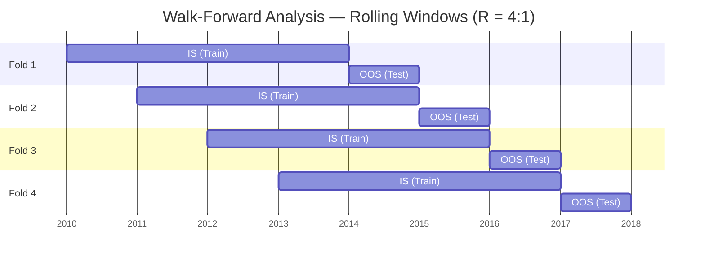

# Walk-Forward Analysis

> [!abstract] TL;DR
> Walk-forward analysis (WFA) is the practitioner's antidote to overfitting: fit your model on an in-sample window, evaluate it on the immediately following out-of-sample window, advance the windows, and repeat. The WFA efficiency ratio $\eta = S_{OOS}/S_{IS}$ is the single most useful diagnostic — values below 0.2 signal overfitting; values below 0 are pathological. Combinatorially Purged Cross-Validation (CPCV) extends this to produce a full OOS Sharpe distribution, not just a point estimate.

## Intuition — The Weather Forecaster Analogy

A weather model is not validated by how well it explains yesterday's temperatures (in-sample) — it is validated by how accurately it forecasts tomorrow's (out-of-sample). A meteorologist who recalibrates the model daily using all past data but never publishes a forward-looking forecast cannot be tested. Walk-forward analysis forces the strategy to make "forecasts" (OOS periods) before the data is revealed, exactly as it would in live trading.

---

## How It Works



---

## Key Concepts

### 1. Rolling vs Anchored WFA

| Variant | IS Window | Pros | Cons |
|---|---|---|---|
| **Rolling (fixed IS)** | Fixed length, slides forward | Weights recent data more | Earlier data discarded; IS/OOS length varies |
| **Anchored (expanding IS)** | Grows from fixed start | Uses all history; parameter estimates improve | Older regimes may dominate; slower |

**Rule of thumb**: Use rolling for mean-reversion and short-horizon strategies (regimes shift); use anchored for cross-sectional value/quality factors where long-horizon IC is stable.

### 2. IS/OOS Ratio Guidelines

The ratio $R = T_{IS}/T_{OOS}$ trades off fitting quality against OOS evaluation length:

| Strategy type | Recommended $R$ |
|---|---|
| High-frequency (HFT) | 3:1 – 5:1 |
| Statistical arbitrage (daily) | 5:1 – 10:1 |
| Systematic macro / CTA | 10:1 – 20:1 |
| Fundamental factor | 15:1 – 30:1 |

Rationale: longer IS is needed when the signal's IC decays slowly (macro) and less is needed when signals are mean-reverting within short horizons.

### 3. Minimum IS Sample Length

The IS window must be long enough to estimate $K$ parameters at significance level $\alpha$ with a target Sharpe $S^*$:

$$T_{IS}^{min} = K \cdot \left(\frac{z_{1-\alpha}\sqrt{1 + S^{*2}/2}}{S^*}\right)^2$$

*Example*: $K = 5$ parameters, $\alpha = 0.05$, $S^* = 1.0$:

$$T_{IS}^{min} = 5 \cdot \left(\frac{1.96\sqrt{1.5}}{1.0}\right)^2 = 5 \cdot (1.96 \times 1.225)^2 \approx 5 \times 5.76 \approx 29 \text{ years (daily)}$$

This is frequently larger than the entire backtest — a strong argument for fewer free parameters.

### 4. WFA Efficiency Ratio

$$\eta = \frac{S_{OOS}}{S_{IS}}$$

Interpretation:

| $\eta$ | Interpretation |
|---|---|
| $\eta > 0.8$ | Excellent — signal generalizes well |
| $0.5 \leq \eta \leq 0.8$ | Good — some overfitting but usable |
| $0.2 \leq \eta < 0.5$ | Moderate concern — simplify model |
| $0 \leq \eta < 0.2$ | Failure — strategy largely overfit |
| $\eta < 0$ | Pathological — strategy reverses OOS |

**Per-fold variance of $\eta$**: If $\eta$ varies dramatically across folds ($\sigma_\eta > 0.3$), the strategy is regime-unstable even if the aggregate $\eta$ looks acceptable.

### 5. Parameter Stability Score

After WFA, you have $J$ estimates of each parameter $\hat{\theta}_j$ (one per fold). The stability score:

$$\text{Stability}_\theta = 1 - \frac{\text{std}(\hat{\theta}_j)}{\text{range}(\Theta_j)}$$

Where $\text{range}(\Theta_j)$ is the search space width. **Stability < 0.5** suggests the parameter is fitting noise and should be fixed or eliminated.

### 6. Purged Cross-Validation

Standard $k$-fold CV is invalid for time series because training folds contain data adjacent to test folds, leaking label information through serial correlation. Purged CV removes training rows within $H-1$ bars of the test fold boundary:

- **Purge gap**: Remove $H-1$ bars (where $H$ is the holding period) from training immediately before/after each test fold.
- **Embargo**: Remove an additional $E$ bars *after* the test fold from the next training window (prevents autocorrelation leakage).

### 7. Combinatorially Purged Cross-Validation (CPCV)

Standard WFA produces one OOS path. CPCV with parameters $(N, k)$ produces $\binom{N}{k}$ OOS paths:

1. Split timeline into $N$ groups of equal size.
2. For each of the $\binom{N}{k}$ combinations of $k$ groups as test set, train on remaining $N-k$ groups (with purging/embargo).
3. Concatenate the $k$ test-fold predictions into one OOS path per combination.
4. Compute the Sharpe ratio for each of the $\binom{N}{k}$ OOS paths → full distribution.

**Recommended**: $N = 6, k = 2$ gives $\binom{6}{2} = 15$ OOS paths, enabling bootstrap inference on the OOS Sharpe distribution and computing the Probability of Backtest Overfitting (PBO).

**PBO calculation**: Fit a logistic regression to predict which training combination produces the better OOS performance. PBO is the AUC of this classifier — values above 0.5 indicate overfitting tendency.

---

## Python Example — WFA and CPCV

```python
import numpy as np
import pandas as pd
from itertools import combinations
from scipy import stats

# ── Walk-Forward Analysis ─────────────────────────────────────────────────────
def walk_forward_analysis(
    returns: pd.Series,
    signals: pd.DataFrame,
    is_months: int = 36,
    oos_months: int = 12,
    anchored: bool = False,
) -> dict:
    """
    Runs rolling (or anchored) WFA.
    returns: daily return series indexed by date
    signals: DataFrame of daily signals, columns = parameters/variants
    Returns dict with per-fold and aggregate efficiency ratios.
    """
    daily_is = int(is_months * 21)
    daily_oos = int(oos_months * 21)
    n = len(returns)

    fold_results = []
    start = 0

    while start + daily_is + daily_oos <= n:
        is_slice  = returns.iloc[start:start + daily_is]
        oos_slice = returns.iloc[start + daily_is:start + daily_is + daily_oos]

        # Best signal selected in IS (simplified: use first signal column)
        best_col = signals.columns[
            np.argmax([
                (returns.iloc[start:start + daily_is] * signals[c].iloc[start:start + daily_is]).mean() /
                max((returns.iloc[start:start + daily_is] * signals[c].iloc[start:start + daily_is]).std(), 1e-9)
                for c in signals.columns
            ])
        ]

        is_sr  = sharpe(is_slice * signals[best_col].iloc[start:start + daily_is])
        oos_sr = sharpe(oos_slice * signals[best_col].iloc[start + daily_is:start + daily_is + daily_oos])
        eta    = oos_sr / is_sr if is_sr != 0 else np.nan

        fold_results.append({
            "is_start": returns.index[start],
            "oos_end":  returns.index[min(start + daily_is + daily_oos - 1, n - 1)],
            "is_sr": is_sr, "oos_sr": oos_sr, "eta": eta, "best_signal": best_col
        })

        if anchored:
            start = 0
            daily_is += daily_oos   # expand IS
        else:
            start += daily_oos

    df = pd.DataFrame(fold_results)
    return {
        "folds": df,
        "aggregate_eta": df["oos_sr"].mean() / df["is_sr"].mean(),
        "eta_std": df["eta"].std(),
        "pct_positive_oos": (df["oos_sr"] > 0).mean(),
    }


def sharpe(ret: pd.Series, periods_per_year: int = 252) -> float:
    if ret.std() == 0:
        return 0.0
    return ret.mean() / ret.std() * np.sqrt(periods_per_year)


# ── CPCV ─────────────────────────────────────────────────────────────────────
def cpcv(
    returns: pd.Series,
    strategy_fn,              # callable(train_returns) -> pd.Series of OOS signals
    N: int = 6,
    k: int = 2,
    holding_period: int = 5,  # for purge gap
    embargo_bars: int = 5,
) -> dict:
    """
    Combinatorially Purged Cross-Validation.
    Produces binom(N, k) OOS Sharpe distribution.
    """
    n = len(returns)
    group_size = n // N
    groups = [returns.iloc[i * group_size:(i + 1) * group_size] for i in range(N)]

    oos_sharpes = []

    for test_idx in combinations(range(N), k):
        train_idx = [i for i in range(N) if i not in test_idx]

        # Assemble training data with purge + embargo
        train_parts = []
        for ti in train_idx:
            group = groups[ti]
            # Simple purge: remove bars adjacent to test group boundaries
            min_test_bar = min(test_idx) * group_size
            max_test_bar = (max(test_idx) + 1) * group_size

            mask = ~((group.index >= returns.index[max(0, min_test_bar - holding_period + 1)]) &
                     (group.index <= returns.index[min(n - 1, max_test_bar + embargo_bars)]))
            train_parts.append(group[mask])

        train_data = pd.concat(train_parts).sort_index()
        test_data  = pd.concat([groups[i] for i in test_idx]).sort_index()

        # Fit strategy on training data, apply to test
        oos_signals = strategy_fn(train_data)
        oos_signals = oos_signals.reindex(test_data.index).fillna(0)
        oos_ret = test_data * oos_signals
        oos_sharpes.append(sharpe(oos_ret))

    oos_arr = np.array(oos_sharpes)
    return {
        "n_paths": len(oos_arr),
        "oos_sharpe_mean": oos_arr.mean(),
        "oos_sharpe_std": oos_arr.std(),
        "pbo": (oos_arr < 0).mean(),   # simplified PBO: fraction of negative OOS paths
        "distribution": oos_arr,
    }


# ── Demo ──────────────────────────────────────────────────────────────────────
if __name__ == "__main__":
    rng = np.random.default_rng(0)
    dates = pd.date_range("2015-01-01", periods=252 * 8, freq="B")
    ret = pd.Series(rng.normal(0.0003, 0.01, len(dates)), index=dates)
    sig = pd.DataFrame({"s1": np.sign(ret.shift(1))}, index=dates).fillna(0)

    wfa = walk_forward_analysis(ret, sig, is_months=24, oos_months=12)
    print(f"Aggregate η = {wfa['aggregate_eta']:.3f}")
    print(f"η std       = {wfa['eta_std']:.3f}")
    print(f"Positive OOS folds = {wfa['pct_positive_oos']:.0%}")
```

---

## Real-World Notes

- **Non-stationarity**: WFA assumes the signal that worked in IS will work in OOS. If a regime change occurs in the OOS window (e.g., COVID, GFC), even a genuine signal will show $\eta < 0$.
- **Parameter search within WFA**: Re-optimize hyperparameters in each IS window (nested CV). This is computationally expensive but prevents IS contamination from a global grid search.
- **Combining OOS paths**: Concatenate all OOS periods into one path for aggregate Sharpe. Avoid averaging per-fold Sharpes (different OOS lengths give different estimation variance).
- **CPCV PBO**: López de Prado recommends PBO < 0.5 as a deployment gate alongside DSR > 0.95.

## Common Pitfalls

- Reporting aggregate IS Sharpe as validation — that is just an elaborate in-sample fit.
- Running a global grid search over all data, then doing WFA — the parameter selection is already contaminated.
- Ignoring purge gaps for strategies with multi-day holding periods ($H > 1$).
- Using too many folds ($N$ large, $k$ small): each OOS window becomes very short, making per-fold Sharpe estimates noisy.

## Related Concepts

- [[Overfitting_in_Finance]] — the problem WFA is designed to detect
- [[Backtesting_Framework]] — the simulation engine providing raw returns to WFA
- [[Risk_Adjusted_Returns]] — Sharpe, Sortino, and other metrics computed per fold
- [[Portfolio_Construction]] — walk-forward parameter stability informs final weighting

## Review Questions

1. What is the WFA efficiency ratio and what values signal a pathological strategy?
2. Why is standard $k$-fold cross-validation invalid for financial time series, and how does purging fix this?
3. You have a strategy with 8 free parameters and a target Sharpe of 1.0. Estimate the minimum IS window length required.
4. CPCV with $N=6, k=2$ gives how many OOS paths? What does the PBO metric from CPCV measure?
5. When would you prefer anchored (expanding) over rolling WFA, and why?

## Sources

- López de Prado, M. *Advances in Financial Machine Learning*. Wiley, 2018. Ch. 7–12.
- Prado, M. L. de. "A Robust Estimator of the Efficient Frontier." SSRN, 2016.
- Bergmeir, C. & Benítez, J. M. "On the Use of Cross-Validation for Time Series Predictor Evaluation." *Information Sciences*, 2012.
- Bailey, D. et al. "Pseudo-Mathematics and Financial Charlatanism." *Notices of the AMS*, 2014.

#quantitative-finance #backtesting #walk-forward #cross-validation #advanced
