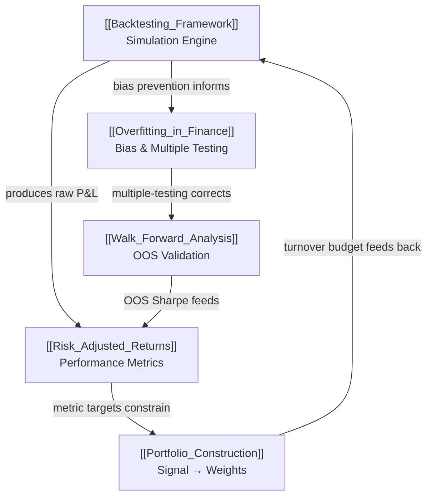

# Backtesting & Infrastructure — Map of Content

> [!abstract] What This Section Covers
> Backtesting is the empirical engine of quantitative finance: it translates a trading hypothesis into a simulated historical P&L, exposing whether signal survives transaction costs, execution slippage, and regime change. This section covers the full lifecycle — from building a rigorous simulation framework free of look-ahead and survivorship bias, through overfitting diagnostics and walk-forward validation, to risk-adjusted performance measurement and the final step of converting signals into investable portfolios. Together these five topics form the quality-control pipeline that separates deployable strategies from curve-fitted noise.

## Concept Map

## Learning Path

1. **[[Backtesting_Framework]]** — Build the simulation correctly before measuring anything; understand vectorized vs event-driven, look-ahead prevention, and execution modeling.
2. **[[Overfitting_in_Finance]]** — Learn why most backtests are statistically meaningless and how to apply the Deflated Sharpe Ratio and multiple-testing corrections.
3. **[[Walk_Forward_Analysis]]** — Validate out-of-sample with rolling and CPCV techniques; measure the IS→OOS efficiency ratio.
4. **[[Risk_Adjusted_Returns]]** — Compute the full suite of performance metrics: Sharpe, Sortino, Calmar, Ulcer Index, Omega, RAROC.
5. **[[Portfolio_Construction]]** — Translate signals into live weights via normalization, covariance modeling, QP optimization, and the backtest-to-live gap.

## All Notes at a Glance

| Note | Core Idea | Key Formula / Tool | Difficulty |
|---|---|---|---|
| [[Backtesting_Framework]] | Simulation fidelity | Fill model; TC drag $\Delta S = 2c \cdot TO/\sigma$ | Advanced |
| [[Overfitting_in_Finance]] | Bias taxonomy + PSR/DSR | $E[\max\hat{S}] \approx \sqrt{2\ln K/T}$ | Advanced |
| [[Walk_Forward_Analysis]] | Rolling OOS validation | $\eta = S_{OOS}/S_{IS}$; CPCV | Advanced |
| [[Risk_Adjusted_Returns]] | Multi-metric evaluation | Sharpe SE $= \sqrt{(1+S^2/2)/T}$ | Intermediate |
| [[Portfolio_Construction]] | Signal → live weights | BHB attribution; QP + Ledoit-Wolf | Advanced |

## Key Questions This Section Answers

1. How do I prevent look-ahead bias when using intraday bar data, and what is PIT fundamental data?
2. If I tested 200 parameter combinations, what t-statistic threshold actually gives me 5% false discovery rate?
3. What is the Deflated Sharpe Ratio and when should I use PSR vs DSR as a deployment gate?
4. How do I choose the IS/OOS ratio and fold count for walk-forward analysis, and what does an efficiency ratio below 0.2 mean?
5. Why is the Sharpe ratio alone insufficient for evaluating a strategy, and what do Sortino, Calmar, and Ulcer Index add?
6. How do I go from a raw alpha signal to a live portfolio with factor neutralization and turnover constraints?
7. What is the typical backtest-to-live Sharpe gap and how should I size and deploy a new strategy responsibly?

## Related Sections

- [[_MOC_QuantFinance_Master|↑ Master MOC]]
- [[_MOC_Quant_Strategies|← Quant Strategies]]
- [[_MOC_ML_Finance|← ML for Finance]]
- [[_MOC_Execution_Microstructure|← Execution & Microstructure]]

#MOC #QuantitativeFinance #Backtesting
