# 📈 Quantitative Finance — Master Map of Content

> [!abstract] About This Vault
> A production-focused reference for engineers and quants building, deploying, and reasoning about systematic trading systems. **67 notes across 11 sections**, covering the full stack from mathematical bedrock through live trading operations. Each note pairs intuition-first analogies with rigorous mathematics, Python code examples, Mermaid diagrams, trade-off tables, and review questions. Content targets practitioners who combine finance theory with software and statistics — from the stochastic calculus that prices options to the Almgren-Chriss ODE that schedules order execution. Start at the section matching your current goal or follow one of the four learning paths below.

## Vault Architecture

```mermaid
graph TD
    Master["📈 Quant Finance Master"]

    %% Foundations — Blue (01-03)
    Master --> S01["01 Mathematical Foundations"]
    Master --> S02["02 Financial Instruments"]
    Master --> S03["03 Options Theory"]

    %% Core Quant — Green (04-06)
    Master --> S04["04 Portfolio Theory"]
    Master --> S05["05 Risk Management"]
    Master --> S06["06 Statistical Methods"]

    %% Strategies & Execution — Orange (07-09)
    Master --> S07["07 Quant Strategies"]
    Master --> S08["08 Execution & Microstructure"]
    Master --> S09["09 ML for Finance"]

    %% Advanced — Red (10-11)
    Master --> S10["10 Advanced Derivatives"]
    Master --> S11["11 Backtesting & Infrastructure"]

    style Master fill:#7c3aed,color:#fff
    style S01 fill:#2563eb,color:#fff
    style S02 fill:#2563eb,color:#fff
    style S03 fill:#2563eb,color:#fff
    style S04 fill:#059669,color:#fff
    style S05 fill:#059669,color:#fff
    style S06 fill:#059669,color:#fff
    style S07 fill:#d97706,color:#fff
    style S08 fill:#d97706,color:#fff
    style S09 fill:#d97706,color:#fff
    style S10 fill:#dc2626,color:#fff
    style S11 fill:#dc2626,color:#fff
```

## Sections at a Glance

| # | Section | Notes | Entry Point | Difficulty |
|---|---------|-------|-------------|------------|
| 01 | Mathematical Foundations | 5 | [[_MOC_Math_Foundations]] | Beginner → Intermediate |
| 02 | Financial Instruments | 5 | [[_MOC_Financial_Instruments]] | Beginner → Intermediate |
| 03 | Options Theory | 5 | [[_MOC_Options_Theory]] | Intermediate |
| 04 | Portfolio Theory | 5 | [[_MOC_Portfolio_Theory]] | Intermediate |
| 05 | Risk Management | 5 | [[_MOC_Risk_Management]] | Intermediate → Advanced |
| 06 | Statistical Methods | 5 | [[_MOC_Statistical_Methods]] | Intermediate → Advanced |
| 07 | Quant Strategies | 5 | [[_MOC_Quant_Strategies]] | Advanced |
| 08 | Execution & Microstructure | 5 | [[_MOC_Execution_Microstructure]] | Advanced |
| 09 | ML for Finance | 5 | [[_MOC_ML_Finance]] | Advanced |
| 10 | Advanced Derivatives | 5 | [[_MOC_Advanced_Derivatives]] | Advanced |
| 11 | Backtesting & Infrastructure | 5 | [[_MOC_Backtesting]] | Advanced |

---

## Learning Paths

### Path 1 — Quant Researcher

> Best for: academics or junior quants building systematic alpha-generation pipelines.

**Math → Stats → Strategies → Backtesting**

[[_MOC_Math_Foundations]] → [[Probability_Theory]] → [[Stochastic_Calculus]] → [[_MOC_Statistical_Methods]] → [[Time_Series_Analysis]] → [[GARCH_Models]] → [[Cointegration]] → [[_MOC_Quant_Strategies]] → [[Statistical_Arbitrage]] → [[Pairs_Trading]] → [[Factor_Investing]] → [[_MOC_Backtesting]] → [[Backtesting_Framework]] → [[Overfitting_in_Finance]] → [[Walk_Forward_Analysis]]

---

### Path 2 — Risk Manager

> Best for: risk professionals at banks, hedge funds, or asset managers.

**Instruments → Options → Risk → Advanced Derivatives**

[[_MOC_Financial_Instruments]] → [[Equities_and_Bonds]] → [[Fixed_Income_Instruments]] → [[_MOC_Options_Theory]] → [[Greeks]] → [[Volatility_Smile]] → [[_MOC_Risk_Management]] → [[Value_at_Risk]] → [[Expected_Shortfall]] → [[Credit_Risk]] → [[Market_Risk]] → [[_MOC_Advanced_Derivatives]] → [[Interest_Rate_Derivatives]] → [[Credit_Derivatives]]

---

### Path 3 — Algo Trader

> Best for: quants building and deploying systematic trading strategies.

**Strategies → Execution → ML → Backtesting**

[[_MOC_Quant_Strategies]] → [[Mean_Reversion]] → [[Momentum_Strategies]] → [[Statistical_Arbitrage]] → [[_MOC_Execution_Microstructure]] → [[Market_Microstructure]] → [[Algorithmic_Execution]] → [[Transaction_Cost_Analysis]] → [[_MOC_ML_Finance]] → [[ML_in_Trading]] → [[Reinforcement_Learning_Trading]] → [[_MOC_Backtesting]] → [[Risk_Adjusted_Returns]] → [[Portfolio_Construction]]

---

### Path 4 — Portfolio Manager

> Best for: discretionary or systematic PMs overseeing multi-asset portfolios.

**Portfolio Theory → Risk → Factor Models → Attribution**

[[_MOC_Portfolio_Theory]] → [[Modern_Portfolio_Theory]] → [[CAPM]] → [[Factor_Models]] → [[Portfolio_Optimization]] → [[Performance_Attribution]] → [[_MOC_Risk_Management]] → [[Value_at_Risk]] → [[Market_Risk]] → [[Operational_Risk]] → [[_MOC_Statistical_Methods]] → [[Regression_in_Finance]] → [[Bayesian_Methods_Finance]]

---

## Cross-Vault Links

This vault is the quantitative finance deep-dive that pairs with other knowledge domains:

- **AI-ML vault** — [[_MOC_AI_ML_Master]] for ML fundamentals underlying [[ML_in_Trading]], [[Neural_Networks_Finance]], and [[Reinforcement_Learning_Trading]]. The AI-ML vault covers the algorithms; this vault covers their financial application.
- **System Design vault** — infrastructure patterns for trading systems, low-latency systems, and distributed data pipelines complement [[Algorithmic_Execution]] and [[High_Frequency_Trading]].
- **DSA vault** — data structures and algorithms underlying order book implementations, priority queues for execution, and efficient backtesting engines.

---

## Section MOC Index

- [[_MOC_Math_Foundations]] — Calculus, linear algebra, probability, stochastic calculus, and numerical methods: the formal toolkit underpinning every pricing formula and optimization problem.
- [[_MOC_Financial_Instruments]] — Equities, bonds, derivatives, futures, swaps, and fixed income: the building blocks of every portfolio and derivative structure.
- [[_MOC_Options_Theory]] — Black-Scholes derivation, the Greeks, binomial trees, and the volatility smile: core options pricing from first principles.
- [[_MOC_Portfolio_Theory]] — Markowitz optimization, CAPM, factor models, Black-Litterman, and performance attribution: the machinery of systematic portfolio construction.
- [[_MOC_Risk_Management]] — VaR, Expected Shortfall, market risk, credit risk, and operational risk: the regulatory and internal risk framework for financial institutions.
- [[_MOC_Statistical_Methods]] — Time series analysis, regression, cointegration, GARCH, and Bayesian methods: the empirical toolkit for financial data.
- [[_MOC_Quant_Strategies]] — Statistical arbitrage, pairs trading, momentum, mean reversion, and factor investing: systematic alpha generation with signal construction and risk controls.
- [[_MOC_Execution_Microstructure]] — Order book dynamics, optimal execution (Almgren-Chriss), algorithmic strategies, TCA, and HFT: how price formation works and how to minimize execution costs.
- [[_MOC_ML_Finance]] — Supervised learning, neural networks, NLP, reinforcement learning, and alternative data: applying modern ML to systematic trading with the right cross-validation methods.
- [[_MOC_Advanced_Derivatives]] — Exotic options, interest rate models, credit derivatives, structured products, and Monte Carlo pricing: advanced derivative structures and calibration.
- [[_MOC_Backtesting]] — Backtesting framework, overfitting, walk-forward analysis, risk-adjusted returns, and portfolio construction: the discipline separating real alpha from noise.

#MOC #QuantitativeFinance #MasterMOC
