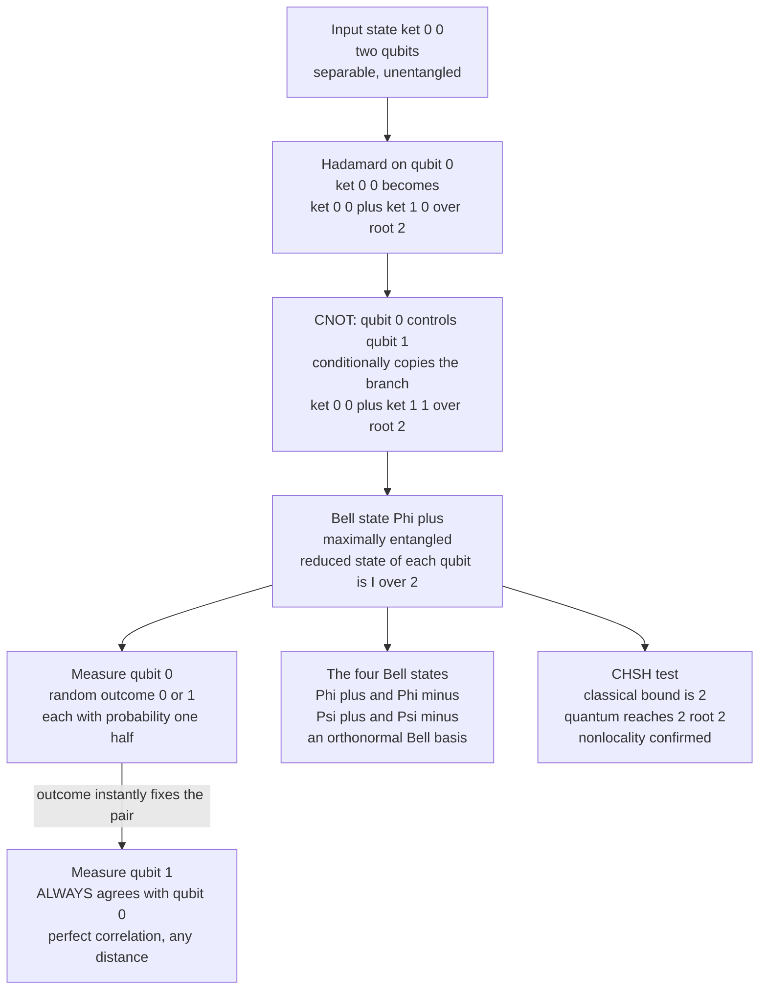

# 🔗 Entanglement and Bell States

> [!abstract] TL;DR
> **Entanglement** is a joint state of two or more qubits that **cannot be written as a product** of individual qubit states — the parts have *no definite state of their own* even though the whole is perfectly defined. The four **Bell states** are the maximally entangled two-qubit states, each buildable with a single **Hadamard** followed by a **CNOT**. Their measurement outcomes are perfectly correlated: look at one qubit and you instantly know the other, *no matter how far apart they are*. Einstein called this "spooky action at a distance" and argued it proved quantum mechanics **incomplete**. **Bell's theorem** settled the debate: *no* local-hidden-variable theory can reproduce quantum correlations. The **CHSH inequality** caps classical correlations at $2$, but entangled qubits reach $2\sqrt{2}$ (**Tsirelson's bound**) — a gap confirmed by loophole-free experiments (2022 Nobel Prize). Crucially, entanglement creates correlation but **cannot** transmit a message faster than light (the no-communication theorem), yet it is the raw **resource** powering teleportation, superdense coding, quantum key distribution, and quantum computing's speedup.

---

## Intuition

**Analogy — the pair of magic coins.** Imagine a machine that mints coins two at a time and mails one to Alice in Tokyo and one to Bob in New York. When each flips their coin, the result looks perfectly random — 50% heads, 50% tails. But whenever they later compare notes, they find the coins *always landed opposite*: Alice heads means Bob tails, every single time. You could explain this with an ordinary secret: maybe each coin was *stamped* at the factory ("you're a heads, you're a tails") and simply carried that hidden label in its pocket. That is a **local hidden variable** — the classical, common-sense story.

Now the twist that *no* pair of classical coins can match. Alice and Bob don't just flip their coins one way — they each get to choose, at the last instant, *which of two different ways* to flip. Quantum entangled coins produce a pattern of agreements and disagreements across those choices that is provably **stronger than any pre-stamped label could ever generate**. There is a statistical test (the **CHSH** test) whose score is capped at $2$ for *anything* carrying hidden labels, yet entangled qubits score $2\sqrt{2} \approx 2.83$. Nature runs this test and wins — so the coins were *not* secretly stamped. Their correlation is created only in the joint act of measurement, and it is genuinely **nonlocal**.

The catch that saves relativity: because each coin *alone* is perfectly random, Alice can't use hers to send Bob a message. She only sees the magic when they later compare results over an ordinary (light-speed-limited) phone call.

---

## How It Works

### 1. Definition — a state that will not factor

For two qubits, a **product (separable) state** is a tensor product of single-qubit states:

$$|\psi\rangle = |a\rangle \otimes |b\rangle, \qquad |a\rangle = \alpha_0|0\rangle + \alpha_1|1\rangle,\quad |b\rangle = \beta_0|0\rangle + \beta_1|1\rangle.$$

A state is **entangled** precisely when it **cannot** be written this way for *any* choice of $|a\rangle, |b\rangle$. The cleanest witness: writing $|\psi\rangle = \psi_{00}|00\rangle + \psi_{01}|01\rangle + \psi_{10}|10\rangle + \psi_{11}|11\rangle$, a product state must satisfy $\psi_{00}\psi_{11} = \psi_{01}\psi_{10}$ (the amplitudes form a rank-1 matrix). When $\psi_{00}\psi_{11} \neq \psi_{01}\psi_{10}$, the state is entangled. The **concurrence** $C = 2\,|\psi_{00}\psi_{11} - \psi_{01}\psi_{10}|$ quantifies it: $C=0$ for separable, $C=1$ for maximal entanglement.

### 2. The parts have no state of their own

The deepest signature: the individual qubit of an entangled pair has **no pure state at all**. Tracing out qubit $B$ (the **partial trace** $\rho_A = \mathrm{Tr}_B\,\rho_{AB}$) of a Bell state gives the **maximally mixed** $\rho_A = I/2$ — the same density matrix as a totally random, unknown qubit. So even though the *pair* is in a perfectly definite pure state (you know everything about the whole), each *part* is maximally uncertain. This is impossible classically, where the parts of a fully-specified whole are themselves fully specified. It links directly to [[Measurement_and_the_No_Cloning_Theorem]] and to the von Neumann [[Quantum_Information_Theory|entanglement entropy]] $S(\rho_A)$, which *is* the standard measure of bipartite pure-state entanglement.

### 3. The four Bell states

The **Bell basis** is the four maximally entangled two-qubit states — an orthonormal basis of the 4-dimensional space:

$$
|\Phi^{\pm}\rangle = \tfrac{1}{\sqrt{2}}\big(|00\rangle \pm |11\rangle\big), \qquad
|\Psi^{\pm}\rangle = \tfrac{1}{\sqrt{2}}\big(|01\rangle \pm |10\rangle\big).
$$

- $|\Phi^{+}\rangle$: measure both in the $Z$ basis → outcomes always **agree** (00 or 11).
- $|\Psi^{-}\rangle$ (the **singlet**): outcomes always **anti-correlate** (01 or 10), and it is rotationally invariant — they anti-correlate in *every* measurement basis.

### 4. Building one: Hadamard then CNOT

Start from $|00\rangle$. Apply a [[Quantum_Gates_and_Circuits|Hadamard]] to qubit 0 to create a superposition, then a **CNOT** (qubit 0 controls qubit 1) to *conditionally copy* the branch:

$$
|00\rangle \;\xrightarrow{\,H \otimes I\,}\; \tfrac{1}{\sqrt2}\big(|0\rangle + |1\rangle\big)|0\rangle \;\xrightarrow{\,\text{CNOT}\,}\; \tfrac{1}{\sqrt2}\big(|00\rangle + |11\rangle\big) = |\Phi^{+}\rangle.
$$

Feeding the other three computational-basis inputs ($|01\rangle, |10\rangle, |11\rangle$) through the same circuit produces the other three Bell states — the map is unitary and reversible.

### 5. The EPR paradox — is quantum mechanics incomplete?

In 1935 **Einstein, Podolsky, and Rosen** used exactly this perfect correlation as a weapon. If measuring Alice's qubit *instantly* determines Bob's distant outcome, then (assuming no faster-than-light influence) Bob's outcome must have been an **element of reality all along** — a pre-existing value the wavefunction fails to list. Conclusion: quantum mechanics is **incomplete**, and a deeper **local-hidden-variable** theory (the pre-stamped coins) should exist. For 30 years this looked like an untestable matter of philosophy.

### 6. Bell's theorem and the CHSH inequality

In 1964 **John Bell** turned philosophy into an experiment. He showed the two views make **numerically different predictions**. The **CHSH** form (Clauser–Horne–Shimony–Holt) has each party choose one of two measurement settings — Alice picks $a$ or $a'$, Bob picks $b$ or $b'$ — with outcomes $\pm 1$. Define the correlation $E(a,b) = \langle A_a B_b\rangle$ and the CHSH quantity:

$$
S = E(a,b) - E(a,b') + E(a',b) + E(a',b').
$$

- **Any local-hidden-variable theory** obeys $\;|S| \le 2\;$ (the classical bound — because each hidden label independently fixes all four outcomes, a term must cancel).
- **Quantum entanglement** with well-chosen angles reaches $\;|S| = 2\sqrt{2} \approx 2.828\;$ — **Tsirelson's bound**, the maximum quantum mechanics allows.

The quantum value *provably exceeds* what any pre-stamped story can produce. The correlations were **not** carried as hidden labels; they are genuinely nonlocal.

### 7. Experiment settles it

**Alain Aspect** (early 1980s) measured $S > 2$ with entangled photons, switching the analyzers so fast that no light-speed signal could coordinate the two sides. Decades of ever-tighter experiments closed the remaining **loopholes** (locality, detection, freedom-of-choice), culminating in the 2015 **loophole-free** tests. The **2022 Nobel Prize in Physics** went to **Aspect, Clauser, and Zeilinger** for confirming that nature is genuinely nonlocal — the hidden-variable escape hatch is closed.

### 8. What entanglement does *not* allow — no signaling

Entanglement seems to scream "faster-than-light communication," but it cannot send a bit. Alice's *local* statistics are exactly $50/50$ regardless of what Bob does or which setting he picks — her reduced state $I/2$ never changes. The correlation only becomes visible when the two parties **compare results over a classical channel**. This is the **no-communication theorem**: entanglement creates correlation, not signaling. Teleportation and superdense coding both *require* an ordinary classical message to work, keeping relativity intact.

### 9. Entanglement as a resource

Entanglement is not a curiosity — it is the **fuel** of quantum information:

- [[Quantum_Teleportation]] — move an unknown qubit using one shared Bell pair plus **2 classical bits**.
- Superdense coding — send **2 classical bits** by transmitting **1 qubit**, given a shared Bell pair.
- [[Quantum_Key_Distribution_and_BB84|Quantum key distribution]] (E91) — Bell-inequality violation *certifies* that no eavesdropper holds a hidden copy.
- **Quantum computing speedup** — see §11.

### 10. Multipartite entanglement — GHZ, W, and monogamy

Beyond pairs, three qubits entangle in **inequivalent** ways. The **GHZ state** $\tfrac{1}{\sqrt2}(|000\rangle + |111\rangle)$ is fragile — losing one qubit destroys all entanglement — but gives an even sharper, *deterministic* contradiction with local realism (the GHZ argument needs no inequality, just a single run). The **W state** $\tfrac{1}{\sqrt3}(|001\rangle + |010\rangle + |100\rangle)$ is robust — it stays entangled if one qubit is lost. Entanglement is also **monogamous**: if $A$ is maximally entangled with $B$, it *cannot* be entangled with $C$ at all. This "you can only be maximally entangled with one partner" is what makes quantum key distribution secure — an eavesdropper is locked out of the correlation.

### 11. Why entanglement is essential to quantum speedup

A quantum computer that only ever produces **unentangled** (product) states can be **efficiently simulated on a classical computer** — its state factorizes, so tracking $n$ qubits costs $O(n)$ numbers instead of $2^n$. Entanglement is what forces the exponential state space to be genuinely irreducible. A related sharpening is the **Gottesman–Knill theorem**: circuits built only from Clifford gates (which *do* create entanglement) are *still* classically simulable — so entanglement is **necessary but not sufficient**; you also need non-Clifford resources like the T gate. Either way, without entanglement there is no quantum advantage. See [[Quantum_Complexity_Theory_and_BQP]].

### Flow — creating a Bell state and its correlated measurements



---

## Key Concepts

### Secondary (intuitive level)
- **Entanglement** is a link between two qubits: as a *pair* they are perfectly coordinated, yet each one *alone* looks totally random.
- The **Bell states** are the four "most entangled" two-qubit states; you build one with a **Hadamard then a CNOT**.
- **"Spooky action at a distance"** — measuring one qubit seems to instantly settle the other, however far apart they are.
- It cannot send a message faster than light: each side alone sees only noise, and the pattern shows up **only when you compare notes** afterward.

### Undergraduate (working level)
- **Separable vs entangled:** $|\psi\rangle = |a\rangle\otimes|b\rangle$ vs the impossibility of any such factoring; the witness $\psi_{00}\psi_{11} \neq \psi_{01}\psi_{10}$ and the **concurrence** $C$.
- **Reduced density matrix** $\rho_A = \mathrm{Tr}_B\,\rho_{AB} = I/2$ for a Bell state — maximally mixed parts, pure whole.
- **Bell basis** $|\Phi^{\pm}\rangle,|\Psi^{\pm}\rangle$ and the $H$-then-CNOT construction; correlated ($\Phi$) vs anti-correlated ($\Psi$) statistics.
- **EPR argument, Bell's theorem, CHSH inequality:** classical bound $|S|\le 2$, quantum bound $|S|\le 2\sqrt2$.
- **No-communication theorem** — correlation without signaling.

### Graduate (theoretical level)
- **Schmidt decomposition** $|\psi\rangle = \sum_i \lambda_i |u_i\rangle|v_i\rangle$; Schmidt rank $>1 \Leftrightarrow$ entangled; **entanglement entropy** $S(\rho_A) = -\sum_i \lambda_i^2\log\lambda_i^2$.
- **Tsirelson's bound** $2\sqrt2$ as the operator-norm maximum of the CHSH operator; where it comes from and why quantum theory is *not* maximally nonlocal (no PR-box).
- **Monogamy of entanglement** (CKW inequality) and its role in QKD security.
- **LOCC** (local operations and classical communication) as the free operations; entanglement as a resource that LOCC cannot increase; distillation and dilution to the Bell-pair "currency" (**ebit**).
- **GHZ nonlocality** (all-or-nothing, single-shot contradiction) vs W-state robustness; entanglement classes under SLOCC.
- **Gottesman–Knill** and the necessity-but-insufficiency of entanglement for quantum computational advantage.

---

## Python Demo

```python
# Entanglement and the CHSH/Bell test with numpy + matplotlib only.
# (1) Build the Bell state |Phi+> via H then CNOT.
# (2) Show it CANNOT be factored into a product of two single-qubit states
#     (concurrence != 0; reduced density matrix is the maximally mixed I/2).
# (3) Simulate Z-basis measurements: the two qubits ALWAYS agree.
# (4) Run the CHSH test: the quantum correlation reaches 2*sqrt(2) ~ 2.83,
#     beating the classical local-hidden-variable bound of 2 -> nonlocality.
import numpy as np
import matplotlib.pyplot as plt

# ---- Gates and Pauli operators ----
I2 = np.eye(2, dtype=complex)
H  = np.array([[1, 1], [1, -1]], dtype=complex) / np.sqrt(2)
X  = np.array([[0, 1], [1, 0]], dtype=complex)
Z  = np.array([[1, 0], [0, -1]], dtype=complex)
CNOT = np.array([[1, 0, 0, 0],
                 [0, 1, 0, 0],
                 [0, 0, 0, 1],
                 [0, 0, 1, 0]], dtype=complex)

# ---- 1. Build |Phi+> = (|00> + |11>)/sqrt(2) with H on qubit 0, then CNOT ----
psi = np.zeros(4, dtype=complex); psi[0] = 1.0   # start in |00>
psi = np.kron(H, I2) @ psi                        # Hadamard on qubit 0
psi = CNOT @ psi                                  # entangle the two qubits
print("Bell amplitudes [00, 01, 10, 11] =", np.round(psi.real, 3))

# ---- 2a. Entanglement signature: it will NOT factor into a tensor product ----
# A pure 2-qubit product state must satisfy psi00*psi11 == psi01*psi10.
# Concurrence C = 2*|psi00*psi11 - psi01*psi10|: 0 = separable, 1 = maximal.
det = psi[0] * psi[3] - psi[1] * psi[2]
C = 2 * abs(det)
print(f"Concurrence C = {C:.3f}   (0 = separable, 1 = maximally entangled)")

# ---- 2b. Each qubit alone is the maximally mixed I/2 (no definite state) ----
rho   = np.outer(psi, psi.conj())
rho_A = rho.reshape(2, 2, 2, 2).trace(axis1=1, axis2=3)   # partial trace over qubit B
print("Reduced rho_A =\n", np.round(rho_A.real, 3), "  -> I/2, maximally mixed")

# ---- 3. Correlated measurements in the Z basis: the qubits always agree ----
probs = np.abs(psi) ** 2                       # P(00), P(01), P(10), P(11)
rng = np.random.default_rng(0)
shots = rng.choice(4, size=20000, p=probs)
bitsA, bitsB = shots // 2, shots % 2
print(f"P(qubit A == qubit B) over 20000 shots = {np.mean(bitsA == bitsB):.3f}  (expect 1.000)")

# ---- 4. CHSH / Bell test ----
def M(theta):
    """Spin observable in the X-Z plane; eigenvalues +-1."""
    return np.cos(theta) * Z + np.sin(theta) * X

def E(tA, tB):
    """Quantum correlation E(a,b) = <psi| M(tA) (x) M(tB) |psi>."""
    return np.real(psi.conj() @ np.kron(M(tA), M(tB)) @ psi)

# Optimal CHSH angles for |Phi+>
a, ap = 0.0, np.pi / 2
b, bp = np.pi / 4, 3 * np.pi / 4
S = E(a, b) - E(a, bp) + E(ap, b) + E(ap, bp)
print(f"\nCHSH  S            = {S:.4f}")
print(f"classical bound    = 2.0000")
print(f"Tsirelson 2*sqrt2  = {2 * np.sqrt(2):.4f}")
print("S > 2  =>  no local-hidden-variable theory can reproduce these correlations.")

# ---- 5. Monte-Carlo CHSH from simulated measurement outcomes ----
def sample_E(tA, tB, n, rng):
    """Estimate E by sampling +-1 outcomes from the joint measurement probabilities."""
    def evec(t, s):  # +1 / -1 eigenvectors of M(t)
        return (np.array([np.cos(t / 2), np.sin(t / 2)]) if s > 0
                else np.array([-np.sin(t / 2), np.cos(t / 2)]))
    keys, pr = [], []
    for sA in (+1, -1):
        for sB in (+1, -1):
            v = np.kron(evec(tA, sA), evec(tB, sB)).astype(complex)
            keys.append(sA * sB); pr.append(abs(v.conj() @ psi) ** 2)
    pr = np.array(pr); pr /= pr.sum()
    return np.mean(np.array(keys)[rng.choice(len(keys), size=n, p=pr)])

grid = np.unique(np.logspace(1, 4.5, 30).astype(int))
S_mc = [sum(s * sample_E(x, y, n, rng)
            for s, (x, y) in zip([1, -1, 1, 1], [(a, b), (a, bp), (ap, b), (ap, bp)]))
        for n in grid]

# ---- Plots ----
fig, ax = plt.subplots(1, 2, figsize=(11, 4))

d = np.linspace(0, np.pi, 300)
ax[0].plot(d, np.cos(d), color="#7c3aed", lw=2, label="quantum  E = cos(dtheta)")
for x, y in [(a, b), (a, bp), (ap, b), (ap, bp)]:
    ax[0].plot(abs(x - y), np.cos(x - y), "o", color="#dc2626", ms=8)
ax[0].axhline(0, color="gray", lw=0.5)
ax[0].set_title("Bell-state correlation vs relative angle")
ax[0].set_xlabel("relative angle  dtheta  [rad]")
ax[0].set_ylabel("E(a, b)")
ax[0].legend()

ax[1].semilogx(grid, S_mc, "o-", color="#059669", label="sampled CHSH  S")
ax[1].axhline(2.0, ls="--", color="gray", label="classical bound = 2")
ax[1].axhline(2 * np.sqrt(2), ls="--", color="#7c3aed", label="Tsirelson = 2 root 2")
ax[1].set_title("CHSH violation from simulated measurements")
ax[1].set_xlabel("shots per setting")
ax[1].set_ylabel("S")
ax[1].legend()

plt.tight_layout()
plt.show()

# Expected output (seed-fixed):
# Bell amplitudes [00, 01, 10, 11] = [0.707 0.    0.    0.707]
# Concurrence C = 1.000   (0 = separable, 1 = maximally entangled)
# Reduced rho_A =
#  [[0.5 0. ]
#   [0.  0.5]]   -> I/2, maximally mixed
# P(qubit A == qubit B) over 20000 shots = 1.000  (expect 1.000)
# CHSH  S            = 2.8284
# classical bound    = 2.0000
# Tsirelson 2*sqrt2  = 2.8284
```

The four numbers tell the whole story. **Concurrence $=1$** and a **reduced state $I/2$** prove the Bell state does not factor — the pair is entangled and each half alone is maximally random. The measurement simulation shows the two qubits agree **100%** of the time. And the CHSH score climbs to **$2\sqrt2 = 2.828$**, sailing past the classical ceiling of **$2$** — a purely numerical demonstration that the correlations cannot come from any pre-existing hidden labels. Nature is nonlocal.

---

## Real-World Applications

- **Quantum teleportation and the quantum internet.** A shared Bell pair is *consumed* to transmit an unknown qubit's state using only classical bits — the primitive behind **quantum repeaters** and networked quantum computers. Demonstrated ground-to-satellite by China's **Micius** over 1200 km.
- **Device-independent quantum key distribution (E91).** Instead of trusting the hardware, Alice and Bob run the **CHSH test** on their shared pairs: a violation of $|S|\le 2$ *certifies*, by monogamy, that no eavesdropper holds a correlated copy — security from physics, not from assumed math hardness.
- **Superdense coding.** One pre-shared Bell pair lets a single transmitted qubit carry **two** classical bits — doubling channel capacity using entanglement as the resource.
- **Quantum sensing and metrology.** Entangled probes (e.g., NOON states, squeezed light) beat the classical shot-noise limit, improving atomic clocks, LIGO gravitational-wave interferometry, and magnetometry.
- **Loophole-free Bell tests as foundational science.** The 2015 experiments (Delft, NIST, Vienna) and the 2022 Nobel work turned a 1935 philosophy debate into hard experimental fact, and now underpin **certified randomness** beacons.

---

## Common Pitfalls

- **"Entanglement sends information faster than light."** No. Each qubit's local outcome is perfectly random; the correlation is invisible until results are compared over a **classical** channel. The **no-communication theorem** guarantees relativity is safe.
- **"Correlation proves the outcomes were predetermined."** That is exactly the hidden-variable intuition Bell **refuted**. Classical predetermination caps CHSH at $2$; the quantum $2\sqrt2$ *rules it out*. Perfect correlation alone (like the magic coins) *could* be classical — it is the **choice of settings** that exposes nonlocality.
- **"Superposition equals entanglement."** A single qubit in superposition is *not* entangled — entanglement needs $\ge 2$ subsystems whose joint state fails to factor. $\tfrac{1}{\sqrt2}(|0\rangle+|1\rangle)\otimes|0\rangle$ is a product state.
- **"Any measurement basis shows the correlation."** For $|\Phi^+\rangle$ the $Z$-basis correlation is perfect, but $Z$-vs-$X$ correlation is **zero**. The singlet $|\Psi^-\rangle$ is the special basis-independent one. Choosing the *wrong* relative angle hides the effect — and choosing it right is the whole art of the CHSH test.
- **"Entanglement alone makes a quantum computer fast."** Necessary, not sufficient: Clifford circuits entangle heavily yet are classically simulable (**Gottesman–Knill**). You also need non-Clifford (magic) resources.
- **Forgetting to normalize / wrong CNOT convention.** Swapping which qubit is control vs target, or mislabeling the basis order (is index 2 the state $|10\rangle$ or $|01\rangle$?), silently produces a *different* Bell state and scrambles the correlations.

---

## Related Concepts

- [[Qubits_and_the_Bloch_Sphere]] — a single qubit's pure state is a point on the Bloch sphere; an entangled qubit's reduced state sits at the *center* (maximally mixed), the geometric fingerprint of entanglement.
- [[Quantum_Gates_and_Circuits]] — the Hadamard and CNOT that build a Bell state; CNOT is the entangling gate, and no product of single-qubit gates can create entanglement.
- [[Measurement_and_the_No_Cloning_Theorem]] — measurement collapse produces the correlated outcomes; no-cloning and monogamy together explain why entanglement-based QKD is secure.
- [[Quantum_Teleportation]] — the flagship protocol that consumes a Bell pair plus two classical bits to move an unknown qubit.
- [[Quantum_Key_Distribution_and_BB84]] — E91 uses Bell-inequality violation to certify eavesdropper-free key exchange.
- [[Quantum_Complexity_Theory_and_BQP]] — entanglement is necessary for quantum speedup; Gottesman–Knill shows it is not sufficient by itself.
- [[Quantum_Information_Theory]] — von Neumann entanglement entropy $S(\rho_A)$, partial trace, and the resource theory of entanglement formalized information-theoretically.
- [[Wave_Particle_Duality_and_Uncertainty]] — the superposition-and-collapse foundations of quantum mechanics on which entangled correlations rest.
- [[Angular_Momentum_and_Spin]] — spin-$\tfrac12$ pairs are the archetypal physical realization; the EPR–Bohm and Aspect experiments use entangled spins/photon polarizations.
- [[Schrodinger_Equation]] — unitary evolution generates entanglement deterministically; the term *Verschränkung* ("entanglement") was coined by Schrödinger in 1935.

---

## Review Questions

**Tier 1 — Conceptual (explain to a peer):**
1. Using the magic-coins analogy, explain the difference between *perfect correlation* (which classical coins can fake) and *nonlocality* (which they cannot). What extra ingredient in the CHSH test exposes the difference?
2. Why can't Alice use her half of a Bell pair to send Bob a faster-than-light message, even though her measurement "instantly" affects his qubit?

**Tier 2 — Applied (compute / reason):**
3. Show that $|\Phi^+\rangle = \tfrac{1}{\sqrt2}(|00\rangle+|11\rangle)$ cannot be written as $|a\rangle\otimes|b\rangle$. Then compute $\rho_A = \mathrm{Tr}_B|\Phi^+\rangle\langle\Phi^+|$ and interpret the result.
4. Walk the input $|10\rangle$ through the "Hadamard on qubit 0, then CNOT" circuit. Which Bell state comes out, and are its $Z$-basis outcomes correlated or anti-correlated?

**Tier 3 — Theoretical (deep understanding):**
5. Derive why any local-hidden-variable model satisfies $|S| \le 2$, then explain where the quantum value $2\sqrt2$ comes from and why quantum mechanics does not reach the algebraic maximum of $4$ (Tsirelson's bound).
6. State the monogamy of entanglement and explain precisely how it makes an entanglement-based QKD protocol secure against an eavesdropper who shares the channel.

---

## Sources

- Nielsen, M. A. & Chuang, I. L. (2010). *Quantum Computation and Quantum Information* (10th Anniversary ed.). Cambridge University Press. — §1.3.6 (EPR/Bell), §2.6 (EPR and the Bell inequality), Bell states throughout.
- Einstein, A., Podolsky, B. & Rosen, N. (1935). *Can Quantum-Mechanical Description of Physical Reality Be Considered Complete?* Physical Review 47, 777. — the original EPR paradox.
- Bell, J. S. (1964). *On the Einstein Podolsky Rosen Paradox.* Physics 1(3), 195–200. — Bell's theorem.
- Clauser, J. F., Horne, M. A., Shimony, A. & Holt, R. A. (1969). *Proposed Experiment to Test Local Hidden-Variable Theories.* Physical Review Letters 23, 880. — the CHSH inequality.
- The Nobel Prize in Physics 2022 — Aspect, Clauser & Zeilinger. [nobelprize.org](https://www.nobelprize.org/prizes/physics/2022/summary/) — loophole-free Bell tests and quantum information science.
- Preskill, J. *Quantum Information* (Caltech Ph219 lecture notes), Ch. 4 — entanglement, Bell inequalities, and nonlocality. [Online](http://theory.caltech.edu/~preskill/ph219/)

---

#quantum-computing #entanglement #bell-states #nonlocality #chsh
