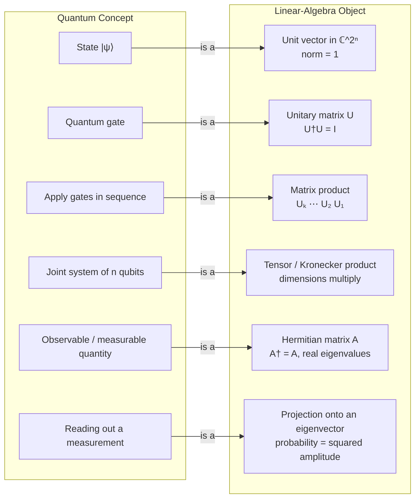

# ⟨🧮⟩ Linear Algebra for Quantum Computing

> [!abstract] TL;DR
> Quantum computing *is* linear algebra wearing a physical dress code: states are unit vectors in a complex Hilbert space, gates are unitary matrices, joining qubits is a tensor product, and measurement is projection onto the eigenvectors of a Hermitian operator. Learn one small toolkit — vectors, inner products, unitary and Hermitian matrices, eigendecomposition, and the Kronecker product — and every quantum rule follows as a corollary.

## Intuition — analogy FIRST

Imagine every possible state of a system is a point on the surface of a high-dimensional glass sphere. A **state** is just an arrow from the center to that surface — always length 1, because probabilities must sum to 1. A **gate** is a rigid rotation of the whole sphere: it moves arrows around but never stretches them, so lengths (probabilities) are preserved. A **measurement** is a set of perpendicular searchlights fixed in space; when you switch them on, the arrow instantly snaps onto whichever searchlight it was most aligned with, and the odds of each snap are the squared shadows the arrow casts on each beam.

That is the entire mathematical story. "Unit vector" = the arrow, "unitary matrix" = the rigid rotation, "orthonormal eigenbasis of a Hermitian operator" = the searchlights, "squared amplitude" = the shadow. Quantum mechanics adds one twist to ordinary geometry: the coordinates are **complex numbers**, which is what lets arrows *interfere* — cancel and reinforce — the way waves do. Master the small linear-algebra toolkit and the quantum rules are no longer mysterious; they are bookkeeping.

---

## How It Works

Quantum computing has a one-to-one dictionary between *physical concepts* and *linear-algebra objects*. There is no separate "quantum math" — there is linear algebra over the complex numbers, plus the rule that probabilities are squared magnitudes of amplitudes (the **Born rule**). The diagram below is the entire dictionary; the rest of this note fills in each entry.



**Core mechanics, step by step:**

1. **State = unit vector.** A qubit lives in $\mathbb{C}^2$ with computational basis $|0\rangle = \binom{1}{0}$, $|1\rangle = \binom{0}{1}$. A general state $|\psi\rangle = \alpha|0\rangle + \beta|1\rangle$ with $\alpha,\beta \in \mathbb{C}$ and normalization $|\alpha|^2 + |\beta|^2 = 1$.
2. **Evolution = unitary matrix.** A gate $U$ acts by matrix-vector multiplication $|\psi'\rangle = U|\psi\rangle$. Unitarity ($U^\dagger U = I$) guarantees the output is still a unit vector — probability is conserved and the operation is reversible.
3. **Composing gates = multiplying matrices.** A circuit that applies $U_1$ then $U_2$ then $U_3$ is the single matrix $U_3 U_2 U_1$ (note the reversed order — the first-applied gate sits rightmost, next to the ket).
4. **Combining qubits = tensor product.** Two qubits live in $\mathbb{C}^2 \otimes \mathbb{C}^2 = \mathbb{C}^4$; $n$ qubits in $\mathbb{C}^{2^n}$. Dimensions *multiply*, which is the origin of the exponential state space.
5. **Measurement = eigendecomposition of a Hermitian operator.** An observable is a Hermitian matrix $A$; its real eigenvalues are the possible outcomes, its orthonormal eigenvectors are the collapse states, and the probability of each outcome is the squared overlap of the state with that eigenvector.

---

## Key Concepts

### 🟢 Secondary (accessible)

- **Complex amplitudes.** Each basis state carries a complex number $\alpha = a + bi$. Its **squared magnitude** $|\alpha|^2 = a^2 + b^2$ is the *probability* of seeing that outcome. Complex numbers (not just positive weights) are what allow **interference**, where amplitudes cancel.
- **Kets are columns.** $|\psi\rangle$ ("ket psi") is a column vector of amplitudes. $|0\rangle$ and $|1\rangle$ are the two "definite" states, like the two faces of a coin, and a general qubit is a weighted blend of them.
- **Normalization.** Every legal state has length 1: $\sqrt{|\alpha|^2 + |\beta|^2} = 1$. This is just "the probabilities add to 100 percent" written in the language of vector length.
- **Computational basis.** The standard axes $\{|0\rangle, |1\rangle\}$ for one qubit, and $\{|00\rangle, |01\rangle, |10\rangle, |11\rangle\}$ for two. Bit strings label the axes.

### 🟡 Undergraduate

- **Bra-ket (Dirac) notation.** A **ket** $|\psi\rangle$ is a column vector; a **bra** $\langle\psi|$ is its **conjugate transpose** (row vector with complex-conjugated entries), i.e. $\langle\psi| = |\psi\rangle^\dagger$.
  - **Inner product** $\langle\phi|\psi\rangle$ = a single complex number measuring **overlap / amplitude**. If it is zero the states are *orthogonal* (mutually exclusive outcomes); $\langle\psi|\psi\rangle = 1$ is normalization.
  - **Outer product** $|\psi\rangle\langle\phi|$ = a *matrix* (an operator). The special case $|\psi\rangle\langle\psi|$ is the **projector** onto $|\psi\rangle$: it is Hermitian and idempotent ($P^2 = P$).
- **Orthonormal bases and change of basis.** A basis $\{|e_i\rangle\}$ with $\langle e_i|e_j\rangle = \delta_{ij}$ lets you decompose any state $|\psi\rangle = \sum_i \langle e_i|\psi\rangle\, |e_i\rangle$. Switching from the computational ($Z$) basis to the Hadamard ($X$) basis $\{|+\rangle, |-\rangle\}$ is just multiplying by a unitary change-of-basis matrix.
- **Unitary operators = gates.** $U^\dagger U = U U^\dagger = I$. Unitaries **preserve inner products** ($\langle U\phi|U\psi\rangle = \langle\phi|\psi\rangle$), hence norms, hence probabilities. Because $U^{-1} = U^\dagger$ always exists, every quantum gate is **reversible** — the deep reason irreversible operations like erasure are not gates (see [[Quantum_Gates_and_Circuits]]).
- **Hermitian operators = observables.** $A^\dagger = A$. The **spectral theorem** guarantees a Hermitian matrix has *real* eigenvalues and a *complete orthonormal* eigenbasis. Measuring $A$ yields one eigenvalue $\lambda_k$ with probability $|\langle e_k|\psi\rangle|^2$ and collapses the state to $|e_k\rangle$ (see [[Measurement_and_the_No_Cloning_Theorem]]).
- **Tensor / Kronecker product.** To join subsystems, take $|\psi\rangle \otimes |\phi\rangle$ (computed as `np.kron`). Dimensions multiply: $2 \times 2 = 4$. A state that **factors** as $|a\rangle \otimes |b\rangle$ is a *product state*; one that cannot be factored is **entangled** — e.g. the Bell state $\tfrac{1}{\sqrt2}(|00\rangle + |11\rangle)$ (see [[Entanglement_and_Bell_States]]).
- **Eigenvalues, eigenvectors, diagonalization.** $A|v\rangle = \lambda|v\rangle$. Diagonalizing a gate reveals it as a **rotation**: a unitary's eigenvalues are phases $e^{i\theta}$ on the unit circle, and the eigenvectors are the invariant axes of that rotation. This is the engine behind phase estimation.
- **Global vs relative phase.** Multiplying an *entire* state by $e^{i\gamma}$ (global phase) changes no measurement probability and is physically undetectable: $|\psi\rangle$ and $e^{i\gamma}|\psi\rangle$ are the same physical state. But the **relative** phase *between* amplitudes, e.g. $\tfrac{1}{\sqrt2}(|0\rangle + e^{i\varphi}|1\rangle)$, is real and measurable — it is what interference manipulates.

### 🔴 Graduate

- **Hilbert space, formally.** Quantum states live in a finite-dimensional complex **Hilbert space** $\mathcal{H} = \mathbb{C}^{2^n}$: a complex inner-product space that is complete (automatic in finite dimension). One qubit is $\mathbb{C}^2$; $n$ qubits are $\mathcal{H}^{\otimes n} = \mathbb{C}^{2^n}$ (see [[Hilbert_Spaces]]).
- **Spectral theorem in operator form.** Every normal operator (in particular every Hermitian or unitary matrix) admits $A = \sum_k \lambda_k P_k$ where $P_k = |e_k\rangle\langle e_k|$ are orthogonal projectors summing to $I$. Measurement is the projective decomposition; unitary evolution reuses the *same* eigenbasis with unit-modulus eigenvalues (see [[Spectral_Theory]]).
- **Density matrix formalism.** A **mixed state** (statistical ensemble, or a subsystem of an entangled whole) is described by a density operator $\rho$ that is **Hermitian, positive-semidefinite, and trace-1**: $\rho = \sum_i p_i |\psi_i\rangle\langle\psi_i|$. Pure states satisfy $\rho^2 = \rho$ ($\mathrm{Tr}(\rho^2) = 1$); mixed states have $\mathrm{Tr}(\rho^2) < 1$. Expectation values are $\langle A\rangle = \mathrm{Tr}(\rho A)$.
- **Partial trace.** To describe one subsystem of a joint state, trace out the rest: $\rho_A = \mathrm{Tr}_B(\rho_{AB})$. Entanglement shows up as a *mixed* reduced state even when the whole is pure — the mathematical signature of decoherence when the "environment" is the discarded subsystem.
- **Why exponential dimension matters.** An $n$-qubit state needs $2^n$ complex amplitudes. At $n = 300$, that is $2^{300} \approx 10^{90}$ amplitudes — more numbers than there are atoms in the observable universe. Storing or updating that vector on a classical machine is intractable; a quantum computer holds and transforms it *physically*. This exponential gap is both the source of quantum power and the reason classical simulation is hard (see [[Quantum_Computation_and_BQP]] and [[Quantum_Information_Theory]]).
- **The recurring toolkit.** Every downstream topic is a specialization: the Bloch sphere is the geometry of $2\times2$ density matrices; quantum circuits are structured products of unitaries; the Quantum Fourier Transform is a specific change of orthonormal basis; error correction lives in stabilizer *subspaces*. Fluency here pays compound interest across the whole vault.

---

## Python Demo

```python
# Build the core quantum linear-algebra toolkit in pure numpy.
# Kets = column vectors, bras = conjugate transposes, and we exercise
# inner/outer products, the tensor product, unitarity, and diagonalizing
# a Hermitian observable to recover measurement outcomes.
import numpy as np
np.set_printoptions(precision=3, suppress=True)

# ---- 1. Kets as column vectors, bras as conjugate-transpose rows ----
ket0 = np.array([[1], [0]], dtype=complex)          # |0>
ket1 = np.array([[0], [1]], dtype=complex)          # |1>
plus = (ket0 + ket1) / np.sqrt(2)                   # |+> = (|0>+|1>)/sqrt(2)

def bra(ket):
    """<psi| is the conjugate transpose (dagger) of |psi>."""
    return ket.conj().T

print("|+> =\n", plus.ravel())
print("<+| =", bra(plus).ravel(), "\n")

# ---- 2. Inner product <phi|psi>: overlap / probability amplitude ----
print("<+|+> =", (bra(plus) @ plus).item().real, " (norm^2, should be 1)")
print("<0|1> =", (bra(ket0) @ ket1).item().real, " (orthogonal basis)\n")

# ---- 3. Outer product |psi><psi|: the projector onto |psi> ----
P_plus = plus @ bra(plus)                           # |+><+|
print("Projector |+><+| =\n", P_plus.real)
print("Idempotent P^2 == P ?", np.allclose(P_plus @ P_plus, P_plus), "\n")

# ---- 4. Two-qubit space via the Kronecker (tensor) product ----
ket00 = np.kron(ket0, ket0)                         # |00> lives in C^4
print("|00> = |0> (x) |0> =", ket00.ravel().real.astype(int))
print("dim(1 qubit)=2, dim(2 qubits)=", ket00.shape[0])
bell = (np.kron(ket0, ket0) + np.kron(ket1, ket1)) / np.sqrt(2)
print("Bell |Phi+> =", bell.ravel().real, " (cannot be factored -> entangled)\n")

# ---- 5. Verify a gate is unitary: U-dagger U = I ----
H = (1/np.sqrt(2)) * np.array([[1, 1],
                               [1, -1]], dtype=complex)   # Hadamard
print("Hadamard unitary?  U-dagger U == I :", np.allclose(H.conj().T @ H, np.eye(2)))
print("H|0> =", (H @ ket0).ravel().real, " (equals |+>)\n")

# ---- 6. Diagonalize a Hermitian observable: eigenvalues = outcomes ----
Z = np.array([[1, 0],
              [0, -1]], dtype=complex)              # Pauli-Z observable
print("Z Hermitian?  A-dagger == A :", np.allclose(Z.conj().T, Z))
eigvals, eigvecs = np.linalg.eigh(Z)                # eigh: Hermitian solver
print("Measurement outcomes (eigenvalues):", eigvals.real)
print("Collapse states (eigenvectors as columns):\n", eigvecs.real)

# Born rule: probability of outcome +1 when measuring |+> in the Z basis.
plus_eigvec = eigvecs[:, [np.argmax(eigvals)]]      # eigenvector for +1
prob = np.abs((plus_eigvec.conj().T @ plus).item())**2
print("P(outcome +1 | state |+>) =", round(prob, 3), " (expected 0.5)")
```

Expected highlights: `<+|+>` prints `1.0` (normalized), `<0|1>` prints `0.0` (orthogonal), the projector is idempotent, the 2-qubit space has dimension 4, the Hadamard passes the unitarity check, and diagonalizing $Z$ returns eigenvalues $\{-1, +1\}$ with the Born-rule probability of $+1$ from $|+\rangle$ equal to $0.5$.

---

## Real-World Applications

- **Circuit simulators (Qiskit Aer, Cirq, PennyLane).** State-vector simulators literally store the $2^n$ complex amplitude array and apply gates as (sparse) matrix multiplications; the tensor-product structure is what lets them apply a single-qubit gate without materializing the full $2^n \times 2^n$ matrix.
- **Shor's and phase estimation.** Extracting a period reduces to finding the eigenvalue phase $e^{2\pi i\theta}$ of a unitary — pure eigendecomposition, connecting to [[Eigenvalues_and_Eigenvectors]].
- **Quantum error correction.** Codes are defined by *stabilizer subspaces* — simultaneous $+1$ eigenspaces of commuting Hermitian operators; syndrome measurement is projection onto those eigenspaces.
- **Variational quantum algorithms (VQE, QAOA).** Estimating $\langle\psi|H|\psi\rangle = \mathrm{Tr}(\rho H)$ for a Hermitian Hamiltonian $H$ is the inner-product/expectation machinery applied to chemistry and optimization.
- **Noise and decoherence modeling.** Density matrices and the partial trace are the working tools for describing realistic, non-pure hardware states and open-system dynamics.

---

## Common Pitfalls

- **Forgetting to conjugate in the bra.** $\langle\psi|$ is the *conjugate* transpose, not just the transpose. Dropping the conjugation silently breaks inner products (and norms) for any state with complex amplitudes.
- **Reversing gate-composition order.** A circuit "first $U_1$, then $U_2$" is the matrix product $U_2 U_1$, not $U_1 U_2$. The first-applied gate sits *rightmost*, adjacent to the ket. Matrix multiplication is not commutative, so this matters.
- **Confusing tensor product with matrix product.** `A @ B` composes operations on the *same* space; `np.kron(A, B)` builds an operator on the *combined* space. Using `@` where you meant `kron` collapses multi-qubit structure.
- **Treating global phase as physical.** $e^{i\gamma}|\psi\rangle$ is the same state as $|\psi\rangle$. Chasing a global phase wastes effort; only *relative* phase between amplitudes is observable.
- **Assuming a two-qubit state always factors.** Most joint states are entangled and have *no* factorization $|a\rangle \otimes |b\rangle$. Testing entanglement means checking whether the reduced density matrix is mixed, not eyeballing the amplitudes.
- **Using the general eigen-solver for Hermitian matrices.** Prefer `np.linalg.eigh` over `eig` for observables: it exploits Hermiticity to return *real* eigenvalues and a truly orthonormal eigenbasis, avoiding tiny imaginary numerical artifacts.
- **Sloppy normalization.** After building or superposing states, re-normalize. An un-normalized vector yields probabilities that do not sum to 1 and quietly corrupts every downstream result.

---

## Related Concepts

- [[Qubits_and_the_Bloch_Sphere]] — a single qubit *is* a unit vector in $\mathbb{C}^2$; the Bloch sphere is the geometric picture of that normalized complex 2-vector (and of its density matrix).
- [[Quantum_Gates_and_Circuits]] — gates are exactly the unitary matrices from this note; circuits are their ordered matrix products.
- [[Entanglement_and_Bell_States]] — entanglement is defined by the tensor product: states that cannot be factored across the Kronecker structure.
- [[Measurement_and_the_No_Cloning_Theorem]] — measurement is projection onto the eigenbasis of a Hermitian observable, with Born-rule probabilities.
- [[Inner_Product_Spaces]] — the real-vector-space parent of the complex inner product $\langle\phi|\psi\rangle$ used throughout.
- [[Eigenvalues_and_Eigenvectors]] — measurement outcomes are eigenvalues; collapse states are eigenvectors; gates diagonalize into rotations.
- [[Hilbert_Spaces]] — the formal home of quantum states; here specialized to the finite dimension $\mathbb{C}^{2^n}$.
- [[Spectral_Theory]] — the spectral theorem that guarantees Hermitian observables have real eigenvalues and orthonormal eigenbases.
- [[Vectors_and_Vector_Spaces]] — the underlying algebra of kets, bases, and linear combinations.
- [[Matrices_and_Determinants]] — the matrix mechanics behind gates, operators, and unitarity.
- [[Linear_Transformations]] — gates and observables as linear maps on the state space.
- [[Complex_Numbers_and_Functions]] — complex amplitudes and phases $e^{i\theta}$ are the reason quantum states can interfere.
- [[Singular_Value_Decomposition]] — the Schmidt decomposition (SVD applied across a bipartition) quantifies entanglement.
- [[Quantum_Computation_and_BQP]] — why the exponential $2^n$ dimension makes classical simulation hard and defines the quantum complexity class.
- [[Quantum_Information_Theory]] — density matrices, entropy, and the information-theoretic view built on this same algebra.

---

## Review Questions

1. **(Conceptual)** Explain why gates must be unitary. Starting from $\langle\psi|\psi\rangle = 1$, show that applying any unitary $U$ leaves the norm unchanged, and connect this to the conservation of probability and the reversibility of quantum computation.
2. **(Scenario)** You are handed a two-qubit column vector of four amplitudes and asked whether it is entangled. Describe a concrete linear-algebra procedure to decide, and explain what "cannot be written as $|a\rangle \otimes |b\rangle$" means in terms of the reduced density matrix.
3. **(Trade-off)** A classical state-vector simulator stores all $2^n$ amplitudes exactly, while a tensor-network or stabilizer simulator stores a compressed representation. Discuss the trade-off: when does the exponential blow-up of the full state vector force you to a specialized representation, and what class of circuits does each representation handle efficiently?

---

## Sources

- Nielsen, M. A., & Chuang, I. L. (2010). *Quantum Computation and Quantum Information* (10th Anniversary ed.), Chapter 2 "Introduction to quantum mechanics" and the linear-algebra appendix. Cambridge University Press.
- Kaye, P., Laflamme, R., & Mosca, M. (2007). *An Introduction to Quantum Computing*, Chapter 2. Oxford University Press.
- Aaronson, S. (2018). *Quantum Computing Since Democritus* / Lecture notes 6.845, MIT — on Hilbert space and the role of amplitudes.
- IBM Quantum. "Basics of quantum information: Single systems." [https://learning.quantum.ibm.com/course/basics-of-quantum-information](https://learning.quantum.ibm.com/course/basics-of-quantum-information)
- Watrous, J. (2018). *The Theory of Quantum Information*, Chapter 1 "Mathematical preliminaries." Cambridge University Press. [https://cs.uwaterloo.ca/~watrous/TQI/](https://cs.uwaterloo.ca/~watrous/TQI/)

---

#quantum-computing #linear-algebra #hilbert-space #tensor-product #unitary
