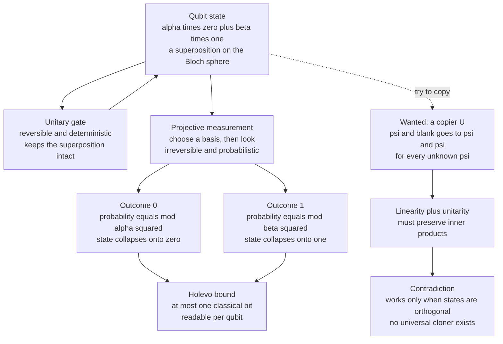

# 🔎 Measurement and the No-Cloning Theorem

> [!abstract] TL;DR
> **Measurement** is the one irreversible, probabilistic step in quantum mechanics: reading a state $\lvert\psi\rangle = \sum_k a_k\lvert k\rangle$ in a chosen basis returns outcome $k$ with **Born-rule** probability $\lvert a_k\rvert^2$ and **collapses** the state onto $\lvert k\rangle$, erasing the rest of the superposition. Because you pick *what* to measure, measuring in the wrong basis destroys information (the trick behind BB84), and you can extract at most **one classical bit per qubit** (Holevo's bound). The **no-cloning theorem** (Wootters–Zurek and Dieks, 1982) says linearity forbids any machine that copies an *unknown* state — a "bug" that makes quantum cryptography secure, forces quantum error correction to be clever, and blocks faster-than-light signaling. When a state is noisy or is one half of an entangled pair, its complete description is not a vector but a **density matrix** $\rho$.

---

## Intuition

**Analogy — the sealed mystery box.** Imagine a box that, before you open it, genuinely holds a blend of "cat" and "dog" at once — not "one of them and I just don't know which," but a real mixture with its own hidden structure (a *phase*). The moment you open the lid — a **measurement** — you see exactly one animal, chosen at random with odds fixed by how much of each was in the blend. Opening is a one-way act: the blend is gone, and the box now definitely contains whatever you saw. Worse, you can never build a photocopier that duplicates an *unknown* sealed box, so you cannot secretly clone it, open the copy, and peek at the original without disturbing it.

Technically: measuring a qubit gives one definite classical answer, destroys the superposition (**collapse**), and — by the **no-cloning theorem** — cannot be sidestepped by first copying the state. Superposition is a resource you can *compute* with but only *read out* one bit at a time, and only once.

---

## How It Works

### Core mechanics

1. **The Born rule.** Write a state in an orthonormal basis $\{\lvert k\rangle\}$ as $\lvert\psi\rangle = \sum_k a_k\lvert k\rangle$ with $\sum_k \lvert a_k\rvert^2 = 1$. Measuring in that basis returns outcome $k$ with probability $p_k = \lvert a_k\rvert^2 = \lvert\langle k\vert\psi\rangle\rvert^2$. This is a **postulate** of quantum mechanics (Gleason's theorem shows it is the *only* probability rule consistent with the Hilbert-space structure).

2. **Collapse / projection.** After you observe $k$, the state is no longer $\lvert\psi\rangle$ — it becomes the eigenstate $\lvert k\rangle$ (up to normalization, $P_k\lvert\psi\rangle / \lVert P_k\lvert\psi\rangle\rVert$ where $P_k = \lvert k\rangle\langle k\rvert$ is the projector). Re-measuring immediately gives the *same* answer with certainty. Measurement is therefore **irreversible and probabilistic** — the exact opposite of a **unitary gate**, which is reversible, deterministic, and preserves superposition.

3. **You choose the measurement basis.** Measuring the *observable* $\hat A = \sum_k \lambda_k P_k$ means projecting onto its eigenbasis. Measure $\tfrac{1}{\sqrt2}(\lvert0\rangle+\lvert1\rangle)$ in the computational $\{\lvert0\rangle,\lvert1\rangle\}$ basis and you get a random bit; measure it in its *own* $\{\lvert+\rangle,\lvert-\rangle\}$ basis and you get "$+$" with certainty. **Measuring in the wrong basis destroys the information** — precisely what BB84 quantum key distribution weaponizes, since an eavesdropper who guesses the basis wrong scrambles the qubit and reveals their presence.

4. **Projective vs generalized (POVM) measurement.** Projective measurement uses orthogonal projectors $P_k$ with $\sum_k P_k = I$. The more general **POVM** replaces them with any positive operators $\{E_k\}$ satisfying $E_k \succeq 0$ and $\sum_k E_k = I$; probabilities are $p_k = \langle\psi\rvert E_k\lvert\psi\rangle$. Every POVM is a projective measurement on a larger space (Naimark dilation) and is the right tool for optimal state discrimination.

5. **One bit per qubit — the Holevo bound.** A qubit hides a *continuum* of amplitudes $(\theta,\phi)$, yet the **accessible information** you can decode from it is capped at **one classical bit** ($\log_2 d$ for a $d$-level system). The extra amplitude structure is real for computation and correlation but is *not* freely downloadable as data.

6. **No-cloning theorem.** There is no unitary $U$ with $U(\lvert\psi\rangle\lvert 0\rangle) = \lvert\psi\rangle\lvert\psi\rangle$ for *every* unknown $\lvert\psi\rangle$. Proof sketch: suppose it worked for $\lvert a\rangle$ and $\lvert b\rangle$. Unitaries preserve inner products, so $\langle a\vert b\rangle = \langle a\vert b\rangle\,\langle a\vert b\rangle = \langle a\vert b\rangle^2$. That forces $\langle a\vert b\rangle \in \{0,1\}$: you can copy *orthogonal* or *identical* (i.e. known-basis) states, but **never non-orthogonal unknown states**. A second one-line argument uses **linearity**: a device that copies $\lvert0\rangle$ and $\lvert1\rangle$ must map $\lvert+\rangle$ to the entangled Bell state, not to $\lvert+\rangle\lvert+\rangle$.

7. **Why no-cloning matters.** It makes **BB84** secure (an eavesdropper cannot copy qubits in transit undetected); it forces **quantum error correction** to protect information *without* making backup copies (using redundancy across entanglement instead); and it blocks **faster-than-light signaling**, since you cannot amplify one half of an entangled pair to read out a distant partner's choice.

8. **Mixed states and the density matrix.** A pure state has $\rho = \lvert\psi\rangle\langle\psi\rvert$. When there is *classical uncertainty* ("50% $\lvert0\rangle$, 50% $\lvert1\rangle$") or when the qubit is one half of an *entangled* pair, no single vector suffices — the complete description is the **density matrix** $\rho = \sum_i p_i\lvert\psi_i\rangle\langle\psi_i\rangle$, Hermitian, positive semidefinite, with $\mathrm{Tr}\,\rho = 1$. Under noise the environment continuously "measures" the system (**decoherence**), driving $\rho$ toward a diagonal, classical mixture. Born-rule probabilities generalize to $p_k = \mathrm{Tr}(P_k\,\rho)$.

9. **The measurement problem and deferred measurement.** *Why* and *when* collapse happens is interpretation-dependent — **Copenhagen** treats it as primitive, **many-worlds** denies collapse (all outcomes occur in branches), and **decoherence** explains the *appearance* of collapse via environmental entanglement. Operationally, the **principle of deferred measurement** lets you push every mid-circuit measurement to the end without changing statistics, and **weak measurement** trades a small amount of information for a small amount of disturbance rather than collapsing fully.

### Diagram



---

## Key Concepts

### Secondary (intuitive level)
- Before you look, a qubit is a genuine blend of 0 and 1; **looking picks one at random** and destroys the blend.
- The odds are set by the **amplitudes**: outcome 0 appears with chance $\lvert\alpha\rvert^2$, outcome 1 with chance $\lvert\beta\rvert^2$.
- Measurement is **one-way** — you cannot un-look, and you get a single ordinary bit out.
- You **cannot photocopy** an unknown qubit, which is exactly why quantum-secured messages are tamper-evident.

### Undergraduate (working level)
- **Born rule** $p_k = \lvert\langle k\vert\psi\rangle\rvert^2$ and **collapse** onto $P_k\lvert\psi\rangle/\lVert P_k\lvert\psi\rangle\rVert$ with projector $P_k = \lvert k\rangle\langle k\rvert$.
- **Observables** $\hat A = \sum_k \lambda_k P_k$; expectation value $\langle\hat A\rangle = \langle\psi\rvert\hat A\lvert\psi\rangle$; the **measurement basis** is the eigenbasis of $\hat A$.
- **Wrong-basis destruction**: measuring $\lvert+\rangle$ in the computational basis yields a random bit and erases the phase — the mechanism BB84 exploits.
- **No-cloning theorem**: statement, the inner-product proof $\langle a\vert b\rangle = \langle a\vert b\rangle^2$, and the linearity proof; you *can* clone orthogonal / known states.
- **Density matrix** $\rho$: pure ($\mathrm{Tr}\,\rho^2 = 1$) vs mixed; $p_k = \mathrm{Tr}(P_k\rho)$; the reduced state of an entangled qubit is mixed.
- **Holevo bound**: at most one classical bit of *accessible* information per qubit.

### Graduate (theoretical level)
- **POVM** $\{E_k\}$, $E_k \succeq 0$, $\sum_k E_k = I$; **Kraus operators** $M_k$ with $E_k = M_k^\dagger M_k$; post-measurement state $M_k\rho M_k^\dagger / \mathrm{Tr}(M_k\rho M_k^\dagger)$. **Naimark dilation** realizes any POVM as a projective measurement on an enlarged Hilbert space.
- **Gleason's theorem**: for Hilbert-space dimension $\geq 3$, the Born rule is the unique probability measure on projectors — the rule is not an independent postulate but forced.
- **No-cloning** generalizes to **no-broadcasting** (mixed states) and to **no-deleting**; it is tightly linked to **no-signaling** — if cloning existed, entanglement plus local amplification would transmit information superluminally.
- **Holevo $\chi$ bound**: accessible info $\leq \chi = S\!\big(\sum_i p_i\rho_i\big) - \sum_i p_i S(\rho_i)$ with $S$ the von Neumann entropy (see [[Quantum_Information_Theory]]).
- **Density matrix as the complete state**: decoherence suppresses off-diagonal coherences $\rho_{nm}$, selecting a classical **pointer basis**; the **principle of deferred measurement** and **weak (Aharonov–Albert–Vaidman) measurement** round out the operational picture.

---

## Python Demo

```python
# Simulate quantum measurement (Born rule + collapse) and numerically demonstrate
# the no-cloning theorem, using ONLY numpy and matplotlib.
#   1. Born rule: sample many measurements of |psi> = alpha|0> + beta|1>,
#      show empirical frequencies converge to (|alpha|^2, |beta|^2).
#   2. Collapse is real: after measuring, an immediate re-measurement repeats the answer.
#   3. No-cloning: (a) inner-product contradiction for non-orthogonal states,
#      (b) a device (CNOT) that copies |0>,|1> perfectly FAILS on |+>.
import numpy as np
import matplotlib.pyplot as plt

rng = np.random.default_rng(42)

# --- 1. A generic (non 50/50) superposition on the Bloch sphere ----------
theta = np.pi / 3                                   # polar angle
alpha = np.cos(theta / 2)                           # amplitude of |0>
beta  = np.sin(theta / 2) * np.exp(1j * 0.7)        # amplitude of |1>, with phase
psi = np.array([alpha, beta], dtype=complex)
psi = psi / np.linalg.norm(psi)

p0, p1 = np.abs(psi[0])**2, np.abs(psi[1])**2       # Born rule
print(f"Born-rule probabilities:  P0 = {p0:.4f},  P1 = {p1:.4f}")


def measure_once(state, rng):
    """Project onto the computational basis; return outcome and collapsed state."""
    probs = np.abs(state)**2
    probs = probs / probs.sum()                     # guard against float drift
    outcome = rng.choice(len(state), p=probs)
    collapsed = np.zeros_like(state)
    collapsed[outcome] = 1.0                         # post-measurement basis state
    return outcome, collapsed


# --- 2. Measure the SAME prepared state many times -> random results ------
shots = 20000
outcomes = np.array([measure_once(psi, rng)[0] for _ in range(shots)])
emp0, emp1 = np.mean(outcomes == 0), np.mean(outcomes == 1)
print(f"Empirical frequencies:    f0 = {emp0:.4f},  f1 = {emp1:.4f}  ({shots} shots)")

# --- 3. Collapse: re-measuring the collapsed state repeats the outcome ----
o1, post = measure_once(psi, rng)
o2, _    = measure_once(post, rng)
print(f"First outcome {o1}; immediate re-measure of collapsed state -> {o2} (must equal {o1})")

# --- 4a. No-cloning via inner products (non-orthogonal |0> and |+>) --------
ket0     = np.array([1, 0], dtype=complex)
ket1     = np.array([0, 1], dtype=complex)
ket_plus = np.array([1, 1], dtype=complex) / np.sqrt(2)
ov  = np.vdot(ket0, ket_plus)                       # <0|+> that a unitary must preserve
print("\nNo-cloning inner-product test for |0> and |+>:")
print(f"  <0|+>          = {ov.real:.4f}   (overlap before cloning)")
print(f"  <0|+> squared  = {(ov**2).real:.4f}   (overlap the two copies would have)")
print(f"  Consistent only if x = x^2, i.e. overlap in {{0,1}}: {abs(ov):.4f} != {abs(ov**2):.4f} -> CONTRADICTION")

# --- 4b. No-cloning via linearity: CNOT copies |0>,|1> but not |+> ---------
CNOT = np.array([[1, 0, 0, 0],
                 [0, 1, 0, 0],
                 [0, 0, 0, 1],
                 [0, 0, 1, 0]], dtype=complex)
copies_0 = np.allclose(CNOT @ np.kron(ket0, ket0), np.kron(ket0, ket0))
copies_1 = np.allclose(CNOT @ np.kron(ket1, ket0), np.kron(ket1, ket1))
out_plus  = CNOT @ np.kron(ket_plus, ket0)          # what the device actually makes
want_plus = np.kron(ket_plus, ket_plus)             # a true copy would be |+>|+>
fidelity  = np.abs(np.vdot(want_plus, out_plus))**2
print(f"\nCNOT copies |0>? {copies_0}    copies |1>? {copies_1}")
print(f"Fidelity of actual output vs desired |+>|+> copy = {fidelity:.4f}  (1.0 = success)")
print("Actual output is the entangled Bell state (|00>+|11>)/sqrt2, not two copies of |+>.")

# --- 5. Plot the measurement statistics -----------------------------------
running = np.cumsum(outcomes == 0) / np.arange(1, shots + 1)
fig, ax = plt.subplots(1, 2, figsize=(11, 4))

x, w = np.array([0, 1]), 0.35
ax[0].bar(x - w/2, [p0, p1], width=w, label="Born rule |amp|^2", color="#7c3aed")
ax[0].bar(x + w/2, [emp0, emp1], width=w, label="empirical", color="#059669")
ax[0].set_xticks(x); ax[0].set_xticklabels(["outcome 0", "outcome 1"])
ax[0].set_ylabel("probability")
ax[0].set_title("Measurement statistics match the Born rule")
ax[0].legend()

ax[1].plot(np.arange(1, shots + 1), running, color="#059669", lw=1)
ax[1].axhline(p0, ls="--", color="#7c3aed", label="P0 = |alpha|^2")
ax[1].set_xscale("log")
ax[1].set_xlabel("number of shots")
ax[1].set_ylabel("empirical f0")
ax[1].set_title("Empirical frequency converges to |alpha|^2")
ax[1].legend()

plt.tight_layout()
plt.show()

# Expected output (fidelity 0.5 shows the copy failed):
# Born-rule probabilities:  P0 = 0.7500,  P1 = 0.2500
# Empirical frequencies:    f0 ~ 0.75,    f1 ~ 0.25
# CNOT copies |0>? True    copies |1>? True
# Fidelity of actual output vs desired |+>|+> copy = 0.5000
```

The two numbers that carry the lesson: empirical frequencies land on $(0.75, 0.25) = (\lvert\alpha\rvert^2, \lvert\beta\rvert^2)$ exactly as the Born rule predicts, and the cloning fidelity for $\lvert+\rangle$ is **0.5, not 1** — a machine tuned to copy $\lvert0\rangle$ and $\lvert1\rangle$ perfectly produces an *entangled* Bell state instead of two copies, which is the no-cloning theorem made concrete by linearity.

---

## Real-World Applications

- **Quantum key distribution (BB84 / E91).** Alice encodes bits in randomly chosen bases; because Eve can neither **clone** nor measure the qubits without disturbance, any interception raises the quantum bit-error rate and is *detected*. Security rests on the laws of measurement and no-cloning rather than computational hardness — deployed in metropolitan fiber networks and the Micius satellite.
- **Quantum error correction.** Since you cannot back up an unknown qubit, codes such as the surface code spread one *logical* qubit across many physical qubits and measure **stabilizer operators** — parity checks that reveal errors *without* measuring (and collapsing) the encoded data itself. No-cloning is the reason naive replication is impossible.
- **Certified randomness and QRNGs.** Measurement collapse is intrinsically unpredictable, so measuring superposition states yields device-independent true random numbers used in cryptographic key generation.
- **Readout in every quantum algorithm.** Shor's and Grover's algorithms compute in superposition but must end in a **measurement**; the whole art is arranging interference so the right answer's amplitude is large *before* the single, destructive readout (see [[Quantum_Computation_and_BQP]]).
- **No superluminal signaling.** No-cloning plus the local randomness of measurement outcomes guarantees that entanglement alone cannot transmit information faster than light — a consistency check that keeps quantum mechanics compatible with relativity.

---

## Common Pitfalls

- **"Superposition means the qubit is secretly already 0 or 1."** No — a pure superposition is a *definite* state with a phase that can **interfere**; it is not classical ignorance. Measurement *creates* the definite value, it does not merely reveal a pre-existing one.
- **"Measurement disturbs because the apparatus is clumsy."** The randomness and collapse are fundamental, not a hardware limitation. Even an ideal detector yields a random outcome and destroys the superposition.
- **"A qubit stores infinitely many bits because $(\theta,\phi)$ is continuous."** The amplitudes are usable for computation, but **Holevo's bound** caps *readout* at one classical bit per qubit.
- **"No-cloning forbids all copying."** You *can* copy **orthogonal** or **known-basis** states, and CNOT copies computational-basis bits. Only a *universal* copier of **arbitrary unknown** states is impossible.
- **"Entanglement plus cloning lets you signal faster than light."** It would — which is exactly why no-cloning holds. Measurement outcomes are locally random and correlations only appear after classical communication.
- **Forgetting to normalize after collapse.** The post-measurement state is $P_k\lvert\psi\rangle$ **divided by** $\lVert P_k\lvert\psi\rangle\rVert$; skipping the renormalization corrupts all subsequent probabilities.

---

## Related Concepts

- [[Quantum_Information_Theory]] — the density matrix, von Neumann entropy, the Holevo bound, and the information-theoretic statement of no-cloning are developed in full there.
- [[Wave_Particle_Duality_and_Uncertainty]] — superposition and wave-function collapse are the quantum-mechanical foundations measurement acts on; also introduces the measurement problem and decoherence.
- [[Schrodinger_Equation]] — unitary Schrödinger evolution is the reversible, deterministic counterpart to irreversible measurement.
- [[Angular_Momentum_and_Spin]] — a spin-$\tfrac12$ particle is the archetypal physical qubit; a Stern–Gerlach apparatus is a literal basis measurement whose axis you choose.
- [[Many_Body_Quantum_Systems]] — decoherence links measurement-like collapse to the emergence of classical behavior via the density matrix.
- [[Quantum_Statistical_Mechanics]] — the same density matrix $\rho$ describes thermal mixed states, connecting measurement to statistical physics.
- [[Quantum_Computation_and_BQP]] — measurement is the final readout step that turns a quantum computation into a classical answer.

---

## Review Questions

**Tier 1 — Conceptual (explain to a peer):**
1. Using the sealed mystery-box analogy, explain why measurement is irreversible and why you only ever get one classical bit out of a qubit.
2. The no-cloning theorem forbids copying an unknown state. Explain why this is a *feature* rather than a limitation from the standpoint of BB84 quantum key distribution.

**Tier 2 — Applied (compute / reason):**
3. A qubit is prepared as $\lvert\psi\rangle = \tfrac{1}{\sqrt2}(\lvert0\rangle + \lvert1\rangle)$. Give the outcome probabilities and post-measurement states for a measurement in (a) the computational $\{\lvert0\rangle,\lvert1\rangle\}$ basis and (b) the $\{\lvert+\rangle,\lvert-\rangle\}$ basis. Why does the choice of basis change everything?
4. Show, using linearity alone, that a device satisfying $U\lvert0\rangle\lvert0\rangle = \lvert0\rangle\lvert0\rangle$ and $U\lvert1\rangle\lvert0\rangle = \lvert1\rangle\lvert1\rangle$ cannot output $\lvert+\rangle\lvert+\rangle$ when fed $\lvert+\rangle\lvert0\rangle$. What does it output instead?

**Tier 3 — Theoretical (deep understanding):**
5. State the no-cloning theorem and prove it two ways: from inner-product preservation and from linearity. Why do orthogonal states escape the obstruction?
6. Explain how no-cloning, the local randomness of Born-rule outcomes, and the requirement of a classical channel together guarantee that entanglement cannot be used for faster-than-light signaling. Where would the argument break if cloning were possible?

---

## Sources

- Nielsen, M. A. & Chuang, I. L. (2010). *Quantum Computation and Quantum Information* (10th Anniversary ed.). Cambridge University Press. — Ch. 2 (measurement postulates, projective and POVM measurement, density operators), Box 12.1 (no-cloning).
- Wootters, W. K. & Zurek, W. H. (1982). *A single quantum cannot be cloned.* Nature, 299, 802–803. — the original no-cloning theorem.
- Dieks, D. (1982). *Communication by EPR devices.* Physics Letters A, 92(6), 271–272. — the independent no-cloning result.
- Holevo, A. S. (1973). *Bounds for the quantity of information transmittable by a quantum communication channel.* Problems of Information Transmission, 9, 177–183. — the one-bit-per-qubit bound.
- Preskill, J. *Quantum Information* (Caltech Ph219 lecture notes), Ch. 3: "Foundations II — Measurement and Evolution." [Online](http://theory.caltech.edu/~preskill/ph219/) — density operators, POVMs, and no-cloning.

---

#quantum-computing #measurement #no-cloning #born-rule #density-matrix
