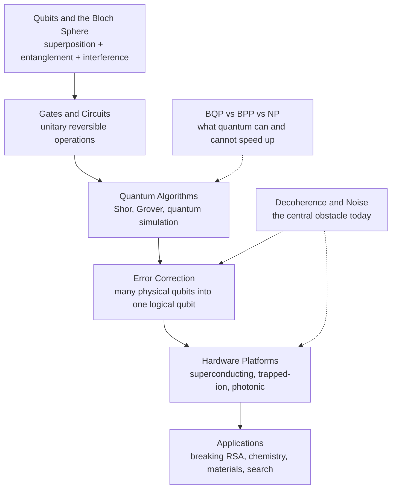

# ⚛️ Quantum Computing Overview

> [!abstract] TL;DR
> **Quantum computing** performs computation by exploiting quantum-mechanical phenomena — **superposition**, **entanglement**, and above all **interference** — to reshape probability *amplitudes* in a way no classical machine can. It is **not** a "try every answer at once" box: the exponential state space is real, but a measurement hands back only one outcome, so a quantum algorithm is a piece of engineering that makes the *wrong* answers' amplitudes cancel and the *right* one's amplitude swell. This buys **exponential** speedups for a *few* structured problems (**Shor's** factoring breaks RSA; **quantum simulation** of chemistry is the likely first killer app) and only a **quadratic** speedup for brute search (**Grover**). Crucially, it is **not** a magic solver for NP-complete problems. The efficiently-quantum-solvable class is **BQP**, believed to strictly contain classical **BPP** yet be incomparable to **NP**. Today we live in the **NISQ era** — noisy, few-hundred-qubit devices where **decoherence** is the central obstacle standing between theory and fault-tolerant hardware.

---

## Intuition

**Analogy — the dimmer switch and the waves of possibility.** A classical **bit** is a light switch: it is *on (1)* or *off (0)*, full stop. A **qubit** is a *dimmer* that can sit at a controlled blend of both at once — not because we are ignorant of which it "really" is, but because a genuine superposition of on-and-off is its physical state. Now imagine every possible answer to your problem is a wave rippling across a pond. A classical computer checks one ripple at a time. A quantum computer sets *all* the ripples going together — but each ripple carries a **phase**, so where crests meet troughs they **cancel to stillness**, and where crests meet crests they **pile into a towering wave**. A good quantum algorithm is *wave engineering*: you arrange the phases so the wrong answers cancel each other into silence and the right answer's wave grows so tall that, when you finally look (measure), you are overwhelmingly likely to see it.

That single move — **cancellation** — is the whole difference from a classical machine. Probabilities can only ever *add up* (they are never negative); **amplitudes are complex numbers, so they can subtract**. Quantum computing is computing with *waves of possibility*, not brute-force parallelism.

---

## How It Works

### Core Mechanics

**1. The qubit — amplitudes, not bits.** A classical bit is `0` or `1`. A qubit is a unit vector `α|0⟩ + β|1⟩` where the amplitudes `α, β` are **complex** with `|α|² + |β|² = 1`. Every pure qubit maps to a point on the **Bloch sphere** (poles are `|0⟩`/`|1⟩`, the equator holds equal-weight superpositions distinguished only by *phase*). See [[Qubits_and_the_Bloch_Sphere]]; a physical realization is a spin-1/2 particle from [[Angular_Momentum_and_Spin]].

**2. Superposition scales exponentially.** `n` qubits live in a `2ⁿ`-dimensional complex space — the state is a vector of `2ⁿ` amplitudes, one per bit-string. A single **Hadamard** gate on each qubit creates a uniform superposition over all `2ⁿ` strings in one shot. This exponential state space is the *raw material* of quantum speedup, but you never read it out directly.

**3. Entanglement — correlations with no classical analog.** Multi-qubit states like the **Bell state** `(|00⟩ + |11⟩)/√2` cannot be written as independent single-qubit states: measuring one instantly determines the other, with correlations stronger than any classical model permits. Entanglement is a *resource* that lets quantum circuits explore structure a product of independent bits cannot represent. See [[Entanglement_and_Bell_States]].

**4. Interference is the actual source of speedup.** Gates are **unitary** (reversible, norm-preserving) matrices that rotate the amplitude vector. Because amplitudes are complex, two computational paths leading to the same *wrong* answer can arrive out of phase and **cancel** — impossible for probabilities. This is the resource Shor and Grover exploit; the exponential parallelism alone is useless.

**5. Measurement collapses — the Born rule.** You cannot inspect amplitudes. Measuring returns bit-string `x` with probability `|amplitude of x|²` and destroys the superposition. So the *only* way to get an answer is to have already herded the amplitude onto the outcome you want. This is why "tries all `2ⁿ` answers and reads off the best" is flatly wrong — measurement gives back **one** string.

**6. The circuit model.** Initialize qubits to `|0…0⟩`, apply a sequence of gates from a fixed universal set (the **circuit**, see [[Quantum_Gates_and_Circuits]]), then measure. A problem is efficiently solvable if a uniform family of *polynomial-size* circuits decides it — the quantum cousin of the classical Turing/circuit model in [[Quantum_Computation_and_BQP]].

### The Quantum-Computing Stack (Vault Map)



---

## Key Concepts

**Secondary (build the picture):**
- **Bit vs qubit** — a switch (on/off) versus a dimmer (a controlled blend of both at once).
- **Superposition** — a qubit genuinely holds `0` and `1` together until measured; measurement forces a single answer and destroys the rest.
- **Interference, not parallelism** — speedup comes from making wrong answers cancel like waves, not from "checking everything simultaneously."
- **Reality check** — a quantum computer will *not* replace your laptop; it is a scalpel for a few special problems, not a faster PC.

**Undergraduate (the machinery):**
- **State vector and Born rule** — `α|0⟩ + β|1⟩`; probabilities are `|α|²`, `|β|²`.
- **Unitary gates** — Hadamard (makes superposition), phase, CNOT (makes entanglement); all reversible.
- **Entanglement / Bell states** — correlations no product of independent bits can reproduce.
- **Shor vs Grover** — *exponential* speedup for factoring/period-finding versus only a *quadratic* speedup for unstructured search.
- **BQP vs BPP vs NP** — quantum efficiency is broader than classical randomized efficiency but is **not** believed to swallow NP-complete problems.
- **No-cloning theorem** — an unknown quantum state cannot be copied (see [[Quantum_Information_Theory]]).

**Graduate (the frontier):**
- **Tensor-product Hilbert space** — `n` qubits inhabit a `2ⁿ`-dimensional space; unitary evolution `U†U = I`.
- **Fault tolerance and the threshold theorem** — below a physical error rate, arbitrarily long computation is possible by encoding logical qubits ([[Quantum_Error_Correction]]).
- **Decoherence (T1/T2 times)** — coupling to the environment destroys phase, the resource interference depends on ([[Decoherence_and_Quantum_Noise]]).
- **Oracle separations and BQP** — relativized evidence that BQP outruns classical models on structured (e.g. period-finding) problems ([[Quantum_Complexity_Theory_and_BQP]]).
- **Quantum advantage / supremacy** — demonstrations of a task beyond classical reach, and the ongoing debate over usefulness in the NISQ era.

---

## Python Demo

The core idea in one runnable script: a **phase between two Hadamards** steers *all* the probability onto a chosen outcome — that is interference. A classical "fair coin" run twice can never do this; probabilities only stay at 50/50. This makes "interference, not parallelism" concrete.

```python
# Interference vs a classical coin, with numpy state vectors only.
import numpy as np
import matplotlib.pyplot as plt

# --- Quantum building blocks: 1-qubit state vector + unitary gates ---
ket0 = np.array([1, 0], dtype=complex)                      # |0>
H = (1 / np.sqrt(2)) * np.array([[1,  1],
                                 [1, -1]], dtype=complex)   # Hadamard

def phase(phi):
    # Phase gate: leave |0> alone, multiply |1> amplitude by e^{i*phi}
    return np.array([[1, 0],
                     [0, np.exp(1j * phi)]], dtype=complex)

def quantum_run(phi):
    # Circuit:  |0> --H--> superposition --phase--> --H--> measure
    psi = H @ ket0            # equal superposition (|0> + |1>)/sqrt(2)
    psi = phase(phi) @ psi    # imprint a relative phase between the paths
    psi = H @ psi             # second Hadamard: the two paths INTERFERE
    return np.abs(psi)**2     # Born rule -> [P(0), P(1)]

# --- Classical stochastic analog: a "fair coin" mixing matrix ---
p0 = np.array([1.0, 0.0])                 # start in state 0
F = np.array([[0.5, 0.5],
              [0.5, 0.5]])                # random flip -- NO phase available

def classical_run(_phi):
    p = F @ p0                            # randomize
    p = F @ p                             # randomize again -> still 50/50
    return p

# --- Sweep the phase; record probability of outcome 0 ---
phis  = np.linspace(0, 2 * np.pi, 200)
q_p0  = np.array([quantum_run(phi)[0]   for phi in phis])
c_p0  = np.array([classical_run(phi)[0] for phi in phis])

fig, (ax1, ax2) = plt.subplots(1, 2, figsize=(11, 4))

ax1.plot(phis, q_p0, lw=2, label="Quantum  P(0) = cos^2(phi/2)")
ax1.plot(phis, c_p0, "--", lw=2, label="Classical  P(0) = 0.5")
ax1.set_xlabel("relative phase phi (radians)")
ax1.set_ylabel("probability of measuring 0")
ax1.set_title("Interference steers probability; a coin cannot")
ax1.legend()

q, c = quantum_run(0.0), classical_run(0.0)   # snapshot at phi = 0
x = np.arange(2)
ax2.bar(x - 0.2, q, width=0.4, label="Quantum")
ax2.bar(x + 0.2, c, width=0.4, label="Classical")
ax2.set_xticks(x); ax2.set_xticklabels(["outcome 0", "outcome 1"])
ax2.set_ylabel("probability")
ax2.set_title("At phi = 0 the two Hadamards cancel back to |0>")
ax2.legend()

plt.tight_layout(); plt.show()

print("Quantum   at phi=0 :", np.round(quantum_run(0.0),   3))   # [1. 0.]
print("Quantum   at phi=pi:", np.round(quantum_run(np.pi), 3))   # [0. 1.]
print("Classical (any phi):", np.round(classical_run(0.0), 3))   # [0.5 0.5]
```

At `phi = 0` the second Hadamard perfectly *undoes* the first — interference collapses all probability back to `0`. At `phi = π` it swings everything to `1`. The classical coin sits stubbornly at 50/50 no matter what, because probabilities cannot cancel. Same two "mixing" steps; only the quantum version has phases to interfere.

---

## Real-World Applications

> **Example — post-quantum cryptography (the reason governments care).** **Shor's algorithm** ([[Shors_Factoring_Algorithm]]) factors integers and computes discrete logs in polynomial time, which would break **RSA** and **elliptic-curve** cryptography that secures nearly all internet traffic. No machine today can run it at scale, but the *threat* has already forced NIST to standardize **post-quantum** algorithms (Kyber, Dilithium) and driven "harvest-now-decrypt-later" concerns.

- **Quantum simulation of chemistry and materials** — Feynman's original 1981 motivation and the likely **first killer app**: simulating molecules (catalysts, nitrogen fixation, battery materials, drug candidates) whose electron behavior is exponentially hard classically ([[Quantum_Simulation]]).
- **Search and optimization** — **Grover's algorithm** ([[Grovers_Search_Algorithm]]) gives a provable *quadratic* speedup for unstructured search; variational methods (QAOA, VQE) target combinatorial and chemistry problems on near-term hardware, though practical advantage is still unproven.
- **Quantum linear algebra** — algorithms (e.g. HHL) offer speedups for some structured linear-system and machine-learning tasks, subject to strong caveats about data loading and read-out.
- **Hardware race** — superconducting (IBM, Google Sycamore), trapped-ion (IonQ, Quantinuum), photonic (PsiQuantum, Xanadu), and neutral-atom platforms ([[Quantum_Hardware]]) are all scaling qubit counts and fighting error rates.

---

## Common Pitfalls

- **The "tries all answers at once" myth** — the amplitudes for all `2ⁿ` answers coexist, but measurement returns *one*. Speedup comes from **interference** herding amplitude onto the right answer, never from reading out a parallel result.
- **Thinking quantum computers solve NP-complete problems fast** — this is *not* believed. BQP is not known to contain NP-complete problems; for generic search you only get Grover's **quadratic** speedup, not exponential. A crucial and widely mangled point (see [[Quantum_Complexity_Theory_and_BQP]]).
- **Ignoring the read-out bottleneck** — the **Holevo bound** says `n` qubits yield at most `n` classical bits on measurement. A rich `2ⁿ`-amplitude state does not mean `2ⁿ` bits of extractable output.
- **Confusing more qubits with more power** — noisy qubits without error correction accumulate errors; 1000 noisy qubits can be *less* useful than a handful of clean, error-corrected ones.
- **Assuming NISQ devices are already useful** — today's noisy intermediate-scale machines have short coherence times; decoherence destroys the phase relationships interference depends on ([[Decoherence_and_Quantum_Noise]]).
- **Conflating quantum annealing with universal quantum computing** — D-Wave-style annealers solve a restricted optimization model and are *not* the universal gate-model machines that run Shor's algorithm.

---

## Related Concepts

**Cross-vault (verified):**
- [[Quantum_Computation_and_BQP]] — the Theory-of-Computation view: the class **BQP**, believed to strictly contain **BPP** yet incomparable to **NP**, and why quantum is a scalpel not a sledgehammer.
- [[Quantum_Information_Theory]] — Shannon's theory rebuilt on qubits: von Neumann entropy, no-cloning, the Holevo read-out bound that caps how much you can extract.
- [[Wave_Particle_Duality_and_Uncertainty]] — the physics of superposition and measurement that qubits are built on.
- [[Angular_Momentum_and_Spin]] — spin-1/2 is the canonical physical qubit; the Bloch sphere is its state space.
- [[Schrodinger_Equation]] — unitary time evolution `U = e^{-iHt/ħ}` is exactly how quantum gates act.

**This vault (six-section roadmap):**
- [[Qubits_and_the_Bloch_Sphere]] — Section 01: the qubit, amplitudes, and the geometry of a single quantum state.
- [[Entanglement_and_Bell_States]] — Section 01: correlations with no classical analog, the second key resource.
- [[Quantum_Gates_and_Circuits]] — Section 02: unitary operations and the circuit model of computation.
- [[Quantum_Algorithms]] — Section 03: how interference is engineered into real speedups.
- [[Shors_Factoring_Algorithm]] — Section 03: the exponential speedup that threatens RSA.
- [[Grovers_Search_Algorithm]] — Section 03: the quadratic speedup for unstructured search.
- [[Quantum_Simulation]] — Section 03: Feynman's motivation and the likely first killer app.
- [[Quantum_Error_Correction]] — Section 04: turning noisy physical qubits into reliable logical ones.
- [[Quantum_Hardware]] — Section 05: superconducting, trapped-ion, photonic, and neutral-atom platforms.
- [[Decoherence_and_Quantum_Noise]] — Section 05: the central obstacle between theory and fault tolerance.
- [[Quantum_Complexity_Theory_and_BQP]] — Section 06: where quantum helps, where it does not, and the BQP picture.

---

## Review Questions

1. **(Secondary)** Your friend says "a quantum computer is fast because it tries all possible answers at the same time and then picks the best one." In one or two sentences, explain what is right and what is wrong about this, using the word *interference*.
2. **(Undergraduate)** Given a choice between speeding up (a) factoring a 2048-bit RSA modulus and (b) solving a generic NP-complete scheduling problem, which does a quantum computer help with dramatically and which only modestly, and why? Name the relevant algorithm and speedup class for each.
3. **(Graduate)** BQP is believed to strictly contain BPP yet be incomparable to NP. Explain why this means a fault-tolerant quantum computer would *not* be a universal accelerator, and describe how decoherence in the NISQ era undermines the specific resource (interference) that gives BQP its power in the first place.

---

## Sources

- Nielsen, M. A. & Chuang, I. L. *Quantum Computation and Quantum Information* (Cambridge University Press, 2010) — the standard graduate text. [Publisher](https://www.cambridge.org/9781107002173)
- Feynman, R. P. "Simulating Physics with Computers," *International Journal of Theoretical Physics* 21 (1982): 467–488. [DOI](https://doi.org/10.1007/BF02650179)
- Shor, P. W. "Polynomial-Time Algorithms for Prime Factorization and Discrete Logarithms on a Quantum Computer," *SIAM J. Computing* 26 (1997). [arXiv:quant-ph/9508027](https://arxiv.org/abs/quant-ph/9508027)
- Preskill, J. "Quantum Computing in the NISQ Era and Beyond," *Quantum* 2 (2018): 79. [arXiv:1801.00862](https://arxiv.org/abs/1801.00862)
- Aaronson, S. "The Limits of Quantum Computers," *Scientific American* 298 (2008); see also *Quantum Computing Since Democritus* (Cambridge, 2013). [Article](https://www.scientificamerican.com/article/the-limits-of-quantum-computers/)

---

#quantum-computing #qubits #superposition #quantum-algorithms #overview
