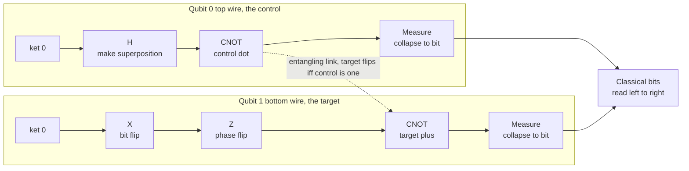

# ⚛️ Quantum Gates and Circuits

> [!abstract] TL;DR
> A **quantum gate** is a **unitary matrix** `U` (a rotation obeying `U†U = I`) that transforms the amplitude vector of one or more qubits **reversibly** and without destroying total probability. Wiring gates together left-to-right on a set of qubit wires — single-qubit gates like the **Pauli** X/Y/Z and the superposition-making **Hadamard**, plus a two-qubit entangler like **CNOT** — and reading out with a **measurement** at the end gives the **circuit model**, the standard programming abstraction of a quantum computer. A tiny finite set such as `{H, T, CNOT}` is **universal**: it can approximate *any* unitary to arbitrary precision, the quantum analogue of NAND-completeness in classical logic.

---

## Intuition

**Analogy — LEGO bricks that only ever rotate an arrow.** Picture each qubit as a tiny arrow that can point anywhere on the surface of a globe (the Bloch sphere). A quantum gate is a **LEGO brick** you snap onto that arrow's wire, and every brick does the *same kind of thing*: it **rigidly rotates the arrow** to a new orientation. You can never crush, shrink, or duplicate the arrow — only spin it — which is exactly what "**unitary**" means: length (total probability) is preserved and the move can always be undone by rotating back. A **quantum circuit** is a wiring diagram of these bricks laid out on parallel rails, read left to right, with a camera (measurement) at the far right that snaps a photo and forces the arrow to fall onto `0` or `1`.

Classical logic gates like AND are bulldozers by contrast: two input bits go in, one comes out, and the inputs are **gone** — you cannot run an AND backwards to recover them. Quantum gates forbid that. Every quantum gate is a reversible rotation, so information is *rearranged*, never *erased*, until the final measurement. That single constraint — unitarity — is the source of both the power and the peculiarity of quantum computation.

---

## How It Works

### Core Mechanics

**1. State lives in an amplitude vector.** One qubit is a unit vector `α|0⟩ + β|1⟩` with complex `α, β` and `|α|² + |β|² = 1`. `n` qubits live in a `2ⁿ`-dimensional space, and the joint state is built with the **tensor (Kronecker) product**: `|0⟩ ⊗ |1⟩ = |01⟩`. Multi-qubit gates are likewise Kronecker products of single-qubit matrices (see [[Linear_Algebra_for_Quantum_Computing]]).

**2. Gates must be unitary.** A gate is a square complex matrix `U` with `U†U = UU† = I`, where `U†` is the conjugate transpose. Unitarity guarantees two physical facts at once: the operation is **norm-preserving** (probabilities still sum to 1) and **reversible** (`U⁻¹ = U†` always exists). This is the deep contrast with classical irreversible gates like **AND** and **OR**, which map two bits to one and thereby **destroy information** — a physical erasure that, by [[Landauer_Principle_and_Thermodynamics_of_Computation]], must dissipate at least `kT ln 2` of heat per bit. Quantum gates erase nothing until measurement.

**3. Single-qubit gates — the Pauli family and the Hadamard.**
- **X (bit flip):** swaps `|0⟩ ↔ |1⟩` — the quantum NOT. A 180° rotation about the Bloch x-axis.
- **Z (phase flip):** leaves `|0⟩`, sends `|1⟩ → −|1⟩` — a 180° rotation about z. Invisible to a measurement in the computational basis, but decisive once interference is in play.
- **Y (bit + phase flip):** `Y = iXZ`, a 180° rotation about y.
- **H (Hadamard) — the workhorse:** maps `|0⟩ → (|0⟩+|1⟩)/√2` and `|1⟩ → (|0⟩−|1⟩)/√2`, creating **superposition**. Apply H to every qubit and you get a uniform superposition over all `2ⁿ` strings in one layer — the opening move of almost every algorithm.
- **Phase gates S and T:** `S` adds a 90° phase to `|1⟩`, `T` adds 45°. `T` is the crucial "cheap but non-Clifford" gate that lifts a gate set from classically-simulable to universal.
- **General rotations Rx, Ry, Rz:** continuous rotations by angle `θ` about each Bloch axis; X, Y, Z, S, T are all special angles of these. See [[Qubits_and_the_Bloch_Sphere]].

**4. Two-qubit gates create entanglement.** No product of single-qubit gates can entangle qubits — you need a genuine two-qubit gate.
- **CNOT (controlled-NOT):** flips the **target** qubit iff the **control** is `|1⟩`. Algebraically `CNOT = |0⟩⟨0| ⊗ I + |1⟩⟨1| ⊗ X`. It is the canonical **entangling** gate: `H` on qubit 0 then `CNOT` turns `|00⟩` into the **Bell state** `(|00⟩+|11⟩)/√2` (see [[Entanglement_and_Bell_States]]).
- **Controlled-Z:** applies `Z` to the target iff the control is `|1⟩`; symmetric in its two qubits.
- **SWAP:** exchanges the states of two qubits; equals three CNOTs.

**5. Universal gate sets.** A finite set of gates is **universal** if any unitary on any number of qubits can be approximated to arbitrary accuracy `ε` by a finite circuit over that set. `{H, T, CNOT}` is the textbook example (`{H, CNOT, Toffoli}` also works). The **Solovay–Kitaev theorem** guarantees the approximation is *efficient*: it needs only `polylog(1/ε)` gates. This is the direct quantum echo of **NAND-completeness** — just as every Boolean function reduces to NANDs ([[Boolean_Algebra_and_Logic_Gates]]), every quantum operation reduces to a handful of gates.

**6. Reversible classical logic sits inside quantum.** To embed irreversible classical functions, you make them reversible first. The **Toffoli** gate (controlled-controlled-NOT, CCNOT) flips its target iff both controls are `1` — it is **universal for reversible classical computation** and computes AND without erasing inputs. The **Fredkin** gate (controlled-SWAP) is another reversible universal primitive. This is how any classical circuit becomes a quantum sub-circuit.

**7. Phase kickback — the mechanism many algorithms exploit.** When a controlled-`U` acts and the target is an **eigenstate** of `U` with eigenvalue `e^{iφ}`, the phase `φ` is "kicked back" onto the **control** qubit instead of visibly changing the target. Applying a `Z` on a `|−⟩` target via a control flips the control's relative phase. This quiet transfer of phase to the control is the engine behind [[Quantum_Algorithms_and_the_Oracle_Model]], Deutsch–Jozsa, and the Quantum Fourier Transform.

**8. The circuit model.** Initialize `n` qubits to `|0…0⟩`; apply a sequence of gates from a universal set (the **circuit**), drawn as **wires** carrying qubits and **boxes** as gates, read **left to right**; **measure** at the end. **Width** = number of qubits, **depth** = number of sequential gate layers (the critical-path length that bounds runtime and decoherence exposure). **Mid-circuit measurement** — measuring some qubits partway and conditioning later gates on the result — enables error correction and teleportation.

**9. Compiling to hardware.** Real devices expose only a **native gate set** (e.g. superconducting chips give `Rz`, `√X`, and a two-qubit `CZ` or `iSWAP`; ions give Mølmer–Sørensen). A **transpiler** rewrites an abstract circuit into native gates, **routes** two-qubit gates onto the chip's limited qubit-connectivity graph by inserting SWAPs, and minimizes depth to beat decoherence.

### Flow / Architecture



*Two qubit wires read left to right. Single-qubit gates H, X, Z are boxes on one wire; the CNOT spans both wires as a control dot on qubit 0 and a target on qubit 1, and is the only gate here that can entangle them. Measurement at the right collapses each qubit to a classical bit.*

---

## Key Concepts

**Secondary (intuitive, no linear algebra needed)**
- **A gate only rotates the arrow.** Every quantum gate spins a qubit's Bloch arrow to a new direction and can always be undone — nothing is copied or thrown away.
- **Hadamard makes "both at once."** `H` turns a definite `0` into an equal mix of `0` and `1`; it is the gate that switches superposition on.
- **CNOT is the "if" gate.** It flips a target bit only when the control bit is `1`, and doing so links the two qubits into an inseparable pair (entanglement).
- **A circuit is a wiring diagram.** Qubits are horizontal wires, gates are boxes placed left to right, and a camera at the end reads out `0`s and `1`s.

**Undergraduate (a first quantum-computing course)**
- **Unitarity `U†U = I`.** Encodes both reversibility and probability conservation; the defining property distinguishing legal quantum operations from classical AND/OR.
- **Pauli group and Hadamard.** X, Y, Z as 180° Bloch rotations; H as the basis-changing workhorse; `HZH = X`, `HXH = Z`.
- **Clifford + T.** Clifford gates `{H, S, CNOT}` are efficiently classically simulable (**Gottesman–Knill**); adding `T` yields universality — the reason `T` gates dominate fault-tolerant cost accounting.
- **Universal sets and Solovay–Kitaev.** `{H, T, CNOT}` approximates any unitary with `polylog(1/ε)` gates.
- **Tensor products.** Multi-qubit states and gates are Kronecker products; `CNOT = |0⟩⟨0|⊗I + |1⟩⟨1|⊗X`.
- **Circuit depth vs width.** Depth bounds runtime and decoherence exposure; width is qubit count.

**Graduate (advanced circuit theory and compilation)**
- **Phase kickback and eigenphase estimation.** Controlled-`U` on an eigenstate imprints `e^{iφ}` on the control — the primitive underlying quantum phase estimation and the QFT.
- **Reversible embedding of classical logic.** Toffoli/Fredkin universality; garbage-qubit uncomputation (Bennett) to restore ancillae and avoid entangling junk with the answer.
- **T-count and magic-state distillation.** Under surface-code fault tolerance, Clifford gates are cheap but each `T` requires a distilled magic state; algorithms are optimized to minimize **T-count** and **T-depth**.
- **Transpilation as a compiler pass.** Gate synthesis, qubit routing on a connectivity graph (SWAP insertion), and depth reduction under hardware noise and crosstalk.
- **Barren-plateau caveat.** Deep hardware-efficient parameterized circuits can suffer exponentially vanishing gradients — a structural warning for variational algorithms.

---

## Python Demo

```python
# Quantum gates as numpy UNITARY matrices, and a small circuit simulated on a
# state vector. We build the Bell state (|00> + |11>)/sqrt(2) by applying H to
# qubit 0 then CNOT, verify every gate satisfies U-dagger U = I, and plot the
# measurement probabilities. Multi-qubit gates are Kronecker (tensor) products.
# numpy / matplotlib only -- no qiskit, no external quantum libraries.

import numpy as np
import matplotlib.pyplot as plt

# ---- Single-qubit gates as 2x2 complex unitaries ----
I = np.array([[1, 0], [0, 1]], dtype=complex)
X = np.array([[0, 1], [1, 0]], dtype=complex)          # bit flip  (quantum NOT)
Y = np.array([[0, -1j], [1j, 0]], dtype=complex)       # bit + phase flip
Z = np.array([[1, 0], [0, -1]], dtype=complex)         # phase flip
H = np.array([[1, 1], [1, -1]], dtype=complex) / np.sqrt(2)   # superposition
S = np.array([[1, 0], [0, 1j]], dtype=complex)         # 90-degree phase
T = np.array([[1, 0], [0, np.exp(1j * np.pi / 4)]], dtype=complex)  # 45-degree phase

GATES = {"X": X, "Y": Y, "Z": Z, "H": H, "S": S, "T": T}

def is_unitary(U, tol=1e-12):
    """A gate is legal iff U-dagger U = I (reversible and norm-preserving)."""
    return np.allclose(U.conj().T @ U, np.eye(U.shape[0]), atol=tol)

print("Unitarity check  (U-dagger U = I):")
for name, U in GATES.items():
    print(f"  {name}: unitary = {is_unitary(U)}")

# ---- Two-qubit CNOT built from projectors and tensor products ----
# CNOT = |0><0| (x) I  +  |1><1| (x) X    with qubit 0 as control, qubit 1 target.
P0 = np.array([[1, 0], [0, 0]], dtype=complex)   # |0><0|
P1 = np.array([[0, 0], [0, 1]], dtype=complex)   # |1><1|
CNOT = np.kron(P0, I) + np.kron(P1, X)
print(f"\nCNOT unitary = {is_unitary(CNOT)}")
print("CNOT matrix (rows/cols = 00, 01, 10, 11):")
print(np.real_if_close(CNOT).astype(int))

# ---- Simulate the circuit on a 2-qubit state vector ----
# Start in |00>, apply H to qubit 0 (H (x) I), then CNOT.
psi = np.array([1, 0, 0, 0], dtype=complex)      # |00>
psi = np.kron(H, I) @ psi                        # H on qubit 0 -> (|00> + |10>)/sqrt2
psi = CNOT @ psi                                 # entangle -> Bell state

labels = ["00", "01", "10", "11"]
print("\nFinal state amplitudes (Bell state |Phi+>):")
for amp, lab in zip(psi, labels):
    print(f"  |{lab}> : {amp: .3f}")

probs = np.abs(psi) ** 2                          # Born rule: P(x) = |amplitude|^2
print(f"\nMeasurement probabilities: {dict(zip(labels, np.round(probs, 3)))}")
print(f"Norm preserved (sum of probs) = {probs.sum():.6f}")

# ---- Plot the measurement probabilities ----
plt.figure(figsize=(6, 4))
bars = plt.bar(labels, probs, color=["#dc2626", "#9ca3af", "#9ca3af", "#dc2626"])
for bar, p in zip(bars, probs):
    plt.text(bar.get_x() + bar.get_width() / 2, p + 0.01,
             f"{p:.2f}", ha="center", fontsize=10)
plt.ylabel("probability of measuring outcome")
plt.title("Bell state via H then CNOT:  only 00 and 11 appear")
plt.ylim(0, 0.65)
plt.tight_layout()
plt.savefig("bell_state_probs.png", dpi=130)
print("\nSaved measurement-probability plot to bell_state_probs.png")

# Takeaways:
#   * every gate passes U-dagger U = I, so each is a legal reversible rotation;
#   * H then CNOT correlates the qubits perfectly -- 50% |00>, 50% |11>, and
#     NEVER |01> or |10>: that impossibility of "one 0, one 1" is entanglement;
#   * the state stays normalized throughout, the hallmark of unitary evolution.
```

Running it prints `unitary = True` for X, Y, Z, H, S, T and CNOT, shows the `4×4` CNOT permutation matrix, and reports the final amplitudes `(0.707, 0, 0, 0.707)` — the Bell state `|Φ⁺⟩`. The saved bar chart shows probability `0.5` on `00` and `0.5` on `11` with `01` and `11` cross-terms at zero, the visual signature of maximal two-qubit entanglement produced by exactly one Hadamard and one CNOT.

---

## Real-World Applications

> **Example — Qiskit and Cirq compile every program down to these gates.** When you write a circuit in IBM's **Qiskit** or Google's **Cirq**, the framework's transpiler decomposes your high-level operations into a **universal native gate set** and lays out CNOTs onto the physical chip's connectivity graph. On IBM's superconducting processors the native two-qubit gate is an echoed cross-resonance realizing CNOT/CZ, and single-qubit gates are virtual `Rz` plus `√X`; on Google's Sycamore it is `√iSWAP`-family. Your `H` and `CNOT` are not run as-is — they are **synthesized and routed** onto whatever the hardware physically supports, exactly the compile step in Core Mechanics.

- **Building entanglement for teleportation and superdense coding.** The `H`-then-`CNOT` Bell-pair recipe demonstrated above is the literal first step of quantum teleportation and entanglement-based QKD (E91) — foundational quantum-networking primitives.
- **Fault-tolerant algorithm costing.** Resource estimates for running Shor on RSA-2048 are quoted in **T-count** and **CNOT-count** because those gates dominate the surface-code overhead; the entire economics of "when will quantum break RSA" is a gate-counting exercise ([[Quantum_Computation_and_BQP]]).
- **Variational circuits (VQE, QAOA).** NISQ-era chemistry and optimization run **parameterized** `Rx/Ry/Rz` layers interleaved with CNOTs; the tunable rotation angles are the trainable parameters optimized classically.
- **Reversible arithmetic via Toffoli networks.** Quantum adders and modular exponentiation (the heavy core of Shor) are Toffoli-gate circuits — classical logic embedded reversibly so it can run coherently inside a superposition.

---

## Common Pitfalls

- **Treating gates like classical logic gates.** AND/OR are irreversible and lose inputs; quantum gates are **unitary and reversible** with equal input and output counts. There is no 2-in-1-out quantum "AND" — you must use a 3-qubit Toffoli that keeps the inputs.
- **Forgetting phase gates matter.** `Z`, `S`, and `T` do nothing visible to a computational-basis measurement, so beginners dismiss them. But **relative phase is the whole substrate of interference** — omit a phase and the algorithm silently produces the wrong amplitudes.
- **Wrong tensor-product ordering.** `np.kron(H, I)` (H on qubit 0) is *not* `np.kron(I, H)` (H on qubit 1). Getting the qubit indexing or endianness backwards is the single most common simulation bug and yields subtly wrong states.
- **Assuming any gate set is universal.** The **Clifford** set `{H, S, CNOT}` is *not* universal and is efficiently classically simulable (Gottesman–Knill). You must add a non-Clifford gate like `T` to gain quantum power.
- **Ignoring connectivity when counting cost.** A CNOT between non-adjacent hardware qubits costs extra **SWAP** gates, inflating depth and error. Abstract circuit depth is a lower bound, not the deployed cost.
- **Over-deep circuits on real hardware.** Every extra gate layer accumulates decoherence and gate error. A theoretically correct but deep circuit can return pure noise on a NISQ device — depth minimization is not optional.

---

## Related Concepts

- [[Qubits_and_the_Bloch_Sphere]] — the state that gates rotate; X/Y/Z/H are literal rotations of the Bloch arrow, and Rx/Ry/Rz are the continuous versions.
- [[Entanglement_and_Bell_States]] — what the two-qubit CNOT produces; the `H`-then-CNOT recipe here builds the canonical Bell pair.
- [[Linear_Algebra_for_Quantum_Computing]] — the tensor products, unitary matrices, and inner products that gates and circuits are made of.
- [[Quantum_Algorithms_and_the_Oracle_Model]] — how circuits of these gates plus an oracle exploit **phase kickback** for speedups like Deutsch–Jozsa and Grover.
- [[Quantum_Computation_and_BQP]] — the complexity-theoretic model: uniform families of polynomial-size gate circuits define BQP.
- [[Boolean_Algebra_and_Logic_Gates]] — the classical counterpart; NAND-completeness is the direct analogue of a quantum universal gate set, and irreversible AND/OR is the contrast that motivates unitarity.
- [[Landauer_Principle_and_Thermodynamics_of_Computation]] — why irreversible classical gates must dissipate heat and why reversible (unitary/Toffoli) computation escapes that floor.

---

## Review Questions

1. **(Conceptual)** Using the "LEGO bricks that only rotate an arrow" analogy, explain why every quantum gate must be **unitary** and what two physical guarantees `U†U = I` provides. Then explain precisely why a classical **AND** gate cannot be a quantum gate, and how a **Toffoli** gate fixes this.
2. **(Scenario)** You are handed the gate set `{H, S, CNOT}` and asked whether it can run Shor's algorithm. What is your answer, why, and what single gate would you add to make the set universal? Reference the Clifford hierarchy and the Solovay–Kitaev theorem in your reasoning.
3. **(Trade-off / graduate)** You must run a 200-qubit variational circuit on a superconducting device with nearest-neighbour connectivity and a native `{Rz, √X, CZ}` gate set. Discuss the trade-offs a transpiler faces among **T-count**, **circuit depth**, **SWAP-insertion for routing**, and **decoherence** — and explain why a circuit that is provably correct in theory may still return noise on the hardware.

---

## Sources

- Nielsen, M. A., Chuang, I. L. *Quantum Computation and Quantum Information*, 10th Anniversary ed. Cambridge University Press, 2010 — Chapter 4 develops single- and multi-qubit gates, universality, and the circuit model.
- Barenco, A. et al. "Elementary Gates for Quantum Computation." *Physical Review A*, 52(5), 1995 — the foundational decomposition of arbitrary unitaries into single-qubit gates and CNOTs.
- Dawson, C. M., Nielsen, M. A. "The Solovay-Kitaev Algorithm." *Quantum Information and Computation*, 6(1), 2006 — efficient approximation of any unitary from a finite universal set.
- Gottesman, D. "The Heisenberg Representation of Quantum Computers." *arXiv:quant-ph/9807006*, 1998 — the Gottesman-Knill theorem on efficient classical simulation of Clifford circuits.
- Preskill, J. "Quantum Computing in the NISQ Era and Beyond." *Quantum*, 2, 2018 — gate error, depth, and the compilation constraints of real hardware.

---

#quantum-computing #quantum-gates #quantum-circuits #unitary #universal-gate-set
