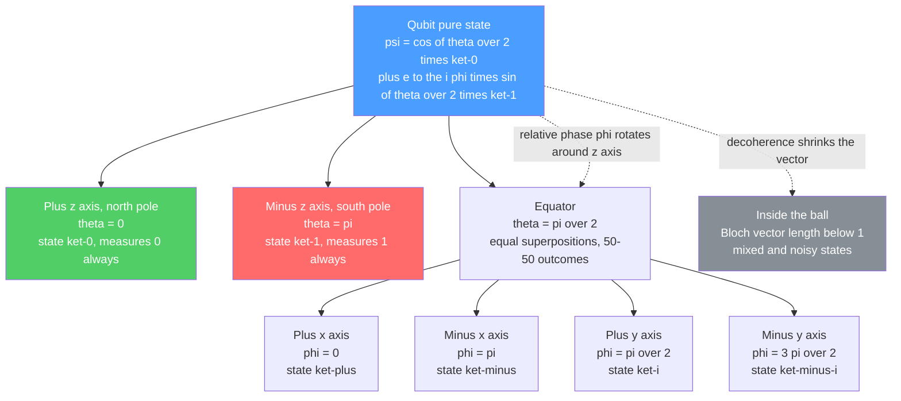

# 🔮 Qubits and the Bloch Sphere

> [!abstract] TL;DR
> A **qubit** is the fundamental unit of quantum information: a normalized vector $\alpha\lvert 0\rangle + \beta\lvert 1\rangle$ in a two-dimensional complex Hilbert space, where the **complex amplitudes** $\alpha,\beta$ satisfy $|\alpha|^2 + |\beta|^2 = 1$ and are *not* probabilities — the **Born rule** turns them into probabilities via $|\text{amplitude}|^2$. Unlike a classical or even a probabilistic bit, a qubit can sit in a genuine **superposition** whose amplitudes can be negative or complex and therefore **interfere**. Every pure single-qubit state is a point on the **Bloch sphere** — poles $\lvert 0\rangle$ and $\lvert 1\rangle$, equator the equal superpositions like $\lvert +\rangle$ and $\lvert -\rangle$ — parameterized by a polar angle $\theta$ and azimuthal angle $\phi$. Single-qubit gates are rotations of this sphere; measurement collapses the point to a pole. The continuous state does *not* mean infinite storage: measurement extracts only **one classical bit** (Holevo's bound).

---

## Intuition

**Analogy — an arrow on a globe.** Picture a globe with an arrow pointing from the center to a spot on its surface. The **north pole** means the bit value **0**; the **south pole** means the bit value **1**. A classical bit is only ever allowed to sit at one of those two poles. A **qubit** can point the arrow *anywhere* on the surface — every other point is a specific, definite **superposition** of 0 and 1. A spot on the equator is an even blend; a spot near the north pole is "mostly 0 with a splash of 1."

The crucial twist is what happens when you *look*. You cannot read off the arrow's direction. The moment you **measure**, the arrow snaps to one of the two poles, and the height of the arrow before you looked decides the odds: the closer it leaned to the north pole, the more likely you see 0. After that snap, all memory of exactly *where* the arrow pointed — its longitude, its lean — is gone forever. So a qubit *holds* a rich continuous direction but *yields* only a single yes-or-no answer.

That globe is not a metaphor you outgrow — it is a literal, exact picture of a single pure qubit called the **Bloch sphere**, and the rest of this note is about reading it precisely.

---

## How It Works

### Core mechanics

1. **State vector.** A qubit is a unit vector in the complex Hilbert space $\mathbb{C}^2$:
$$\lvert\psi\rangle = \alpha\lvert 0\rangle + \beta\lvert 1\rangle,\qquad \alpha,\beta\in\mathbb{C},\qquad |\alpha|^2+|\beta|^2=1.$$
The two reference vectors $\lvert 0\rangle=\left[\begin{smallmatrix}1\\0\end{smallmatrix}\right]$ and $\lvert 1\rangle=\left[\begin{smallmatrix}0\\1\end{smallmatrix}\right]$ form the **computational basis**.

2. **Amplitudes are not probabilities.** $\alpha$ and $\beta$ are **probability amplitudes**. They can be negative or complex — something no probability can be. The **Born rule** converts them: measuring in the computational basis yields $0$ with probability $|\alpha|^2$ and $1$ with probability $|\beta|^2$. Normalization $|\alpha|^2+|\beta|^2=1$ is just the statement that these probabilities sum to one.

3. **Superposition, not ignorance.** A qubit in $\tfrac{1}{\sqrt2}(\lvert 0\rangle+\lvert 1\rangle)$ is *not* "secretly 0 or 1 and we don't know which." It is a single definite state that is genuinely both. The proof is **interference**: because amplitudes can cancel, applying the right operation twice can steer the state *away* from an outcome a classical coin flip could never avoid. This is the departure from a **probabilistic bit** $(p_0,p_1)$, whose weights only ever add — they never subtract.

4. **Global vs relative phase.** Multiplying the whole state by $e^{i\gamma}$ (a **global phase**) changes no measurement statistics in any basis — it is physically **unobservable**, so $\lvert\psi\rangle$ and $e^{i\gamma}\lvert\psi\rangle$ are the *same* state. But the **relative phase** between $\alpha$ and $\beta$ is real and observable: it is exactly what distinguishes $\lvert +\rangle=\tfrac{1}{\sqrt2}(\lvert 0\rangle+\lvert 1\rangle)$ from $\lvert -\rangle=\tfrac{1}{\sqrt2}(\lvert 0\rangle-\lvert 1\rangle)$, and it is the ingredient that **drives interference** in quantum gates and circuits.

5. **The Bloch sphere.** Kill the global phase by choosing $\alpha$ real and non-negative, then write
$$\lvert\psi\rangle = \cos\tfrac{\theta}{2}\,\lvert 0\rangle + e^{i\phi}\sin\tfrac{\theta}{2}\,\lvert 1\rangle,\qquad \theta\in[0,\pi],\ \phi\in[0,2\pi).$$
The pair $(\theta,\phi)$ are spherical coordinates: **every pure single-qubit state is a point on the surface of the unit sphere.** Note the **half-angle** — $\theta$ runs from $0$ at the north pole to $\pi$ at the south pole, so orthogonal states ($\lvert 0\rangle$ and $\lvert 1\rangle$) sit at *opposite* poles even though their state vectors differ by only a $90^\circ$ rotation in $\mathbb{C}^2$. The Cartesian Bloch vector is $(x,y,z)=(\sin\theta\cos\phi,\ \sin\theta\sin\phi,\ \cos\theta)$.

6. **Gates are rotations; measurement is collapse.** Any single-qubit **quantum gate** is a unitary $U\in SU(2)$, and its action on the Bloch sphere is a rigid **rotation** in $SO(3)$ (the $X$, $Y$, $Z$ gates are $180^\circ$ rotations about their axes; the Hadamard swaps $\lvert 0\rangle\leftrightarrow\lvert +\rangle$). A computational-basis **measurement** projects the point onto the $z$-axis: it lands at a pole with the Born-rule probability and the state **collapses** there.

7. **Mixed states live inside the ball.** A pure state has Bloch vector length exactly $1$ (on the surface). Noise and entanglement with the environment produce **mixed states**, described by a **density matrix** $\rho=\tfrac12(I + \vec r\cdot\vec\sigma)$ whose Bloch vector satisfies $|\vec r|<1$ — a point *inside* the ball. The center $\vec r=\vec 0$ is the maximally mixed state $\tfrac12 I$. **Decoherence** is literally the Bloch vector shrinking toward the center.

### Flow / Architecture



---

## Key Concepts

### Secondary (intuition-level)
- **Bit vs qubit:** a classical bit is a switch stuck on 0 or 1; a qubit is an arrow that can point anywhere on a globe, with 0 and 1 as the two poles.
- **Superposition:** a real, single state that is a blend of 0 and 1 — not a hidden "it's really one of them."
- **Measurement:** looking forces the arrow to snap to a pole; how far it leaned decides the odds of seeing 0 versus 1.
- **One answer only:** no matter how rich the arrow's direction, you get back a single 0 or 1.

### Undergraduate (formal)
- **State vector in $\mathbb{C}^2$:** $\lvert\psi\rangle=\alpha\lvert 0\rangle+\beta\lvert 1\rangle$, normalized, in the computational basis $\{\lvert 0\rangle,\lvert 1\rangle\}$.
- **Amplitudes vs probabilities & the Born rule:** $P(0)=|\alpha|^2$, $P(1)=|\beta|^2$; amplitudes may be complex and interfere.
- **Global vs relative phase:** $e^{i\gamma}\lvert\psi\rangle\equiv\lvert\psi\rangle$ (unobservable); relative phase separates $\lvert +\rangle$ from $\lvert -\rangle$ and enables interference.
- **Bloch parameterization:** $\lvert\psi\rangle=\cos\tfrac{\theta}{2}\lvert 0\rangle+e^{i\phi}\sin\tfrac{\theta}{2}\lvert 1\rangle$; polar $\theta$, azimuthal $\phi$; half-angle sends orthogonal states to antipodal points.
- **Named states:** $\lvert 0\rangle,\lvert 1\rangle$ (poles $\pm z$); $\lvert \pm\rangle=\tfrac{1}{\sqrt2}(\lvert 0\rangle\pm\lvert 1\rangle)$ (axes $\pm x$); $\lvert \pm i\rangle=\tfrac{1}{\sqrt2}(\lvert 0\rangle\pm i\lvert 1\rangle)$ (axes $\pm y$).
- **Gates as rotations:** single-qubit unitaries are rigid rotations of the sphere; Pauli $X,Y,Z$ are $\pi$-rotations, Hadamard is a $\pi$-rotation about the $x{+}z$ diagonal.

### Graduate (rigorous)
- **Density matrix:** $\rho=\tfrac12(I+\vec r\cdot\vec\sigma)$ with $\vec\sigma=(\sigma_x,\sigma_y,\sigma_z)$; pure iff $|\vec r|=1$ iff $\mathrm{Tr}(\rho^2)=1$; purity $\mathrm{Tr}(\rho^2)=\tfrac12(1+|\vec r|^2)$.
- **Bloch vector as observables:** $r_k=\langle\sigma_k\rangle=\mathrm{Tr}(\rho\sigma_k)$, so $x=2\,\mathrm{Re}(\alpha^*\beta),\ y=2\,\mathrm{Im}(\alpha^*\beta),\ z=|\alpha|^2-|\beta|^2$ for a pure state.
- **$SU(2)\to SO(3)$ double cover:** every single-qubit gate $U=e^{-i\phi\,\hat n\cdot\vec\sigma/2}$ implements a Bloch rotation by angle $\phi$ about axis $\hat n$; the factor-of-two double cover is why a $2\pi$ state rotation returns a $-1$ global phase.
- **Mixed states & decoherence:** the interior of the Bloch ball is the convex set of density matrices; dephasing shrinks $x,y$ (loss of relative phase), amplitude damping drags $\vec r$ toward the $\lvert 0\rangle$ pole.
- **Holevo bound:** although $(\alpha,\beta)$ span a continuum, at most **1 classical bit** of information is accessible per qubit measurement — continuous state is not continuous storage.

---

## Python Demo

```python
# Represent qubits as 2D complex amplitude vectors, map them to the Bloch
# sphere via the angles theta and phi, print Born-rule probabilities, and
# draw each state as an arrow on a 3D Bloch sphere. numpy + matplotlib only.
import numpy as np
import matplotlib.pyplot as plt

# --- 1. A qubit is a normalized 2D complex amplitude vector [alpha, beta] ---
def qubit(alpha, beta):
    psi = np.array([alpha, beta], dtype=complex)
    norm = np.linalg.norm(psi)
    if norm == 0:
        raise ValueError("The zero vector is not a valid quantum state.")
    return psi / norm  # enforce |alpha|^2 + |beta|^2 = 1

# --- 2. Map amplitudes -> Bloch vector (x, y, z) = <sigma_x,y,z> ------------
def bloch_vector(psi):
    alpha, beta = psi
    x = 2.0 * np.real(np.conj(alpha) * beta)
    y = 2.0 * np.imag(np.conj(alpha) * beta)
    z = np.abs(alpha) ** 2 - np.abs(beta) ** 2
    return np.array([x, y, z])

def bloch_angles(psi):
    x, y, z = bloch_vector(psi)
    theta = np.arccos(np.clip(z, -1.0, 1.0))  # polar angle from +z axis
    phi = np.arctan2(y, x)                     # azimuth around the z axis
    return theta, phi

def measurement_probs(psi):
    alpha, beta = psi
    return np.abs(alpha) ** 2, np.abs(beta) ** 2  # Born rule: P(0), P(1)

# --- 3. Canonical example states -------------------------------------------
s = 1.0 / np.sqrt(2.0)
states = {
    "|0>": qubit(1, 0),
    "|1>": qubit(0, 1),
    "|+>": qubit(s, s),
    "|->": qubit(s, -s),
    "|i>": qubit(s, 1j * s),
    "psi": qubit(np.cos(np.pi / 6), np.exp(1j * np.pi / 4) * np.sin(np.pi / 6)),
}

print(f"{'state':>6} | {'theta(deg)':>10} | {'phi(deg)':>9} | {'P(0)':>6} | {'P(1)':>6}")
for name, psi in states.items():
    theta, phi = bloch_angles(psi)
    p0, p1 = measurement_probs(psi)
    print(f"{name:>6} | {np.degrees(theta):10.1f} | "
          f"{np.degrees(phi):9.1f} | {p0:6.3f} | {p1:6.3f}")

# Global phase is unobservable: e^{i*gamma}|psi> has the same Bloch vector.
same = qubit(1j * np.cos(np.pi / 6), 1j * np.exp(1j * np.pi / 4) * np.sin(np.pi / 6))
print("\nglobal-phase check (should match 'psi'):",
      np.round(bloch_vector(same), 6))

# --- 4. Draw the states as arrows on a 3D Bloch sphere ----------------------
fig = plt.figure(figsize=(7, 7))
ax = fig.add_subplot(111, projection="3d")

u, v = np.mgrid[0:2 * np.pi:40j, 0:np.pi:20j]     # translucent unit sphere
ax.plot_surface(np.cos(u) * np.sin(v), np.sin(u) * np.sin(v), np.cos(v),
                color="skyblue", alpha=0.10, linewidth=0)

ax.plot([-1, 1], [0, 0], [0, 0], color="gray", lw=0.6)   # x axis
ax.plot([0, 0], [-1, 1], [0, 0], color="gray", lw=0.6)   # y axis
ax.plot([0, 0], [0, 0], [-1, 1], color="gray", lw=0.6)   # z axis
ax.text(0, 0, 1.20, "|0>", ha="center")
ax.text(0, 0, -1.30, "|1>", ha="center")

colors = plt.cm.tab10(np.linspace(0, 1, len(states)))
for (name, psi), c in zip(states.items(), colors):
    x, y, z = bloch_vector(psi)
    ax.quiver(0, 0, 0, x, y, z, color=c, arrow_length_ratio=0.12, lw=2)
    ax.text(1.15 * x, 1.15 * y, 1.15 * z, name, color=c)

ax.set_xlim([-1, 1]); ax.set_ylim([-1, 1]); ax.set_zlim([-1, 1])
ax.set_xlabel("x"); ax.set_ylabel("y"); ax.set_zlabel("z")
ax.set_title("Single-qubit pure states on the Bloch sphere")
ax.set_box_aspect([1, 1, 1])
plt.tight_layout()
plt.show()
```

Expected printed table (the plot shows six arrows on the sphere):

```
 state | theta(deg) |  phi(deg) |   P(0) |   P(1)
   |0> |        0.0 |       0.0 |  1.000 |  0.000
   |1> |      180.0 |     180.0 |  0.000 |  1.000
   |+> |       90.0 |       0.0 |  0.500 |  0.500
   |-> |       90.0 |     180.0 |  0.500 |  0.500
   |i> |       90.0 |      90.0 |  0.500 |  0.500
   psi |       60.0 |      45.0 |  0.750 |  0.250
```

Note how $\lvert +\rangle$, $\lvert -\rangle$, and $\lvert i\rangle$ share the *same* measurement probabilities ($50/50$) yet occupy *different* points on the equator — the difference is entirely **relative phase** $\phi$, invisible to a $z$-basis measurement but decisive under interference.

---

## Real-World Applications

> **Example — superconducting transmon qubits (IBM Quantum, Google Quantum AI).** Each transmon is an artificial two-level atom whose $\lvert 0\rangle$ and $\lvert 1\rangle$ are its two lowest energy levels. Engineers calibrate and control it *entirely* through the Bloch sphere: a resonant microwave pulse drives **Rabi oscillations** — the Bloch vector rotating from pole toward the equator — and its duration is tuned to land a precise $\theta$. **Ramsey experiments** measure how fast the equatorial phase $\phi$ precesses to characterize $T_2$ dephasing, and **state tomography** reconstructs the full Bloch vector to check gate fidelity.

- **Trapped-ion qubits (IonQ, Quantinuum):** two internal electronic states of an ion; laser pulses implement Bloch rotations with very long coherence times.
- **Photonic qubits:** horizontal/vertical **polarization** encodes $\lvert 0\rangle/\lvert 1\rangle$; the Poincaré sphere of optics is mathematically identical to the Bloch sphere.
- **Spin qubits:** a single electron or nuclear **spin-1/2** is the archetypal two-level system (see [[Angular_Momentum_and_Spin]]); this is where the Bloch sphere originated.
- **NMR and MRI:** the Bloch *equations* describing precessing nuclear spins are the classical-ensemble ancestor of the qubit Bloch sphere and underpin medical imaging.
- **Quantum state tomography & benchmarking:** reconstructing $\vec r$ from many measurements is the standard way to validate hardware.

---

## Common Pitfalls

- **Confusing amplitude with probability.** $\alpha$ is *not* the probability of 0 — $|\alpha|^2$ is. Amplitudes can be negative or complex; the Born rule squares the magnitude. Forgetting this makes interference (and the whole speedup story) inexplicable.
- **Treating superposition as ignorance.** A qubit in $\lvert +\rangle$ is not "really 0 or 1 behind the scenes." That hidden-variable picture predicts no interference and is experimentally falsified. Superposition is a definite state, not missing information.
- **Ignoring the half-angle.** The state uses $\theta/2$, but the Bloch *polar* angle is $\theta$. This is why orthogonal states are antipodal ($180^\circ$ apart on the sphere) despite being only $90^\circ$ apart as vectors in $\mathbb{C}^2$. Skipping the factor of two puts states in the wrong place.
- **Thinking global phase matters.** $e^{i\gamma}\lvert\psi\rangle$ is the *same* physical state — it maps to the *same* Bloch point. Only **relative** phase is observable. Chasing a global phase is chasing nothing.
- **Believing a qubit stores infinite data.** The state is a continuous $(\theta,\phi)$, but measurement returns **one bit** and destroys the rest (**Holevo bound**). You cannot losslessly stash a real number in a qubit and read it back.
- **Confusing the surface with the interior.** Only *pure* states sit on the surface. Noisy/mixed states live *inside* the ball with $|\vec r|<1$; the center is maximally mixed. Placing a mixed state on the surface overstates its coherence.
- **Over-extending the picture to many qubits.** The Bloch sphere is a single-qubit tool. Two qubits need a 15-parameter state space with no simple 3D sphere — and entanglement can leave each qubit's reduced state at the *center* of its own Bloch ball.

---

## Related Concepts

- [[Quantum_Information_Theory]] — develops the qubit as the atom of information, the density matrix, von Neumann entropy, and the **Holevo bound** that caps readout at one classical bit.
- [[Angular_Momentum_and_Spin]] — the physical archetype: a **spin-1/2** particle is a natural qubit, and the Pauli matrices and Bloch sphere come directly from spin.
- [[Wave_Particle_Duality_and_Uncertainty]] — the deeper quantum-mechanical origin of **superposition** and the disruptive nature of **measurement**.
- [[Schrodinger_Equation]] — governs how the qubit's state vector (its **wave function**) evolves unitarily between gates and measurements.
- [[Quantum_Statistical_Mechanics]] — the **density matrix** formalism for mixed states, connecting decoherence and thermal noise to points inside the Bloch ball.

> Sibling foundation notes to be added to this vault and cross-linked: **Quantum Computing Overview**, **Quantum Gates and Circuits** (single-qubit gates as Bloch rotations), **Measurement and the No-Cloning Theorem** (Born-rule collapse), **Linear Algebra for Quantum Computing** (Hilbert spaces, bra-ket, Pauli operators), and **Quantum Hardware** (physical two-level realizations).

---

## Review Questions

**Secondary**
1. Using the globe analogy, where do the values 0 and 1 live, and what happens to the arrow when you measure the qubit? Why can't you read the arrow's exact direction?

**Undergraduate**
2. A qubit is prepared in $\tfrac{1}{\sqrt2}\big(\lvert 0\rangle - \lvert 1\rangle\big)$. What are its measurement probabilities in the computational basis, and where does it sit on the Bloch sphere? Explain why it is a physically different state from $\lvert +\rangle$ even though both give $50/50$ outcomes.

**Graduate**
3. Given the pure state $\lvert\psi\rangle=\cos\tfrac{\theta}{2}\lvert 0\rangle+e^{i\phi}\sin\tfrac{\theta}{2}\lvert 1\rangle$, derive its Bloch vector $\vec r=(\langle\sigma_x\rangle,\langle\sigma_y\rangle,\langle\sigma_z\rangle)$ and show $|\vec r|=1$. Then argue why a maximally decohered qubit sits at the origin, and reconcile the *continuum* of $(\theta,\phi)$ with the Holevo bound of one accessible classical bit.

---

## Sources

- [Nielsen, M. A. & Chuang, I. L. — *Quantum Computation and Quantum Information* (Cambridge, 2010), Ch. 1.2 "Qubits" and 1.3 "Single qubit gates"](https://doi.org/10.1017/CBO9780511976667)
- [IBM Quantum Learning — *Basics of Quantum Information: Single Systems*](https://learning.quantum.ibm.com/course/basics-of-quantum-information/single-systems)
- [John Preskill — *Ph219/CS219 Quantum Computation Lecture Notes*, Caltech](http://theory.caltech.edu/~preskill/ph219/)
- [Wikipedia — *Bloch sphere*](https://en.wikipedia.org/wiki/Bloch_sphere)
- [Qiskit Textbook — *Representing Qubit States*](https://github.com/Qiskit/textbook)

---

#quantum-computing #qubit #bloch-sphere #superposition #quantum-state
