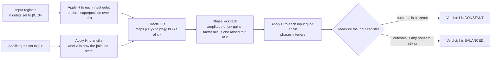

# 🪙 Deutsch-Jozsa and Bernstein-Vazirani Algorithms

> [!abstract] TL;DR
> **Deutsch-Jozsa (1992)** and **Bernstein-Vazirani (1993)** are the first algorithms to prove a **provable, exact quantum speedup** in the black-box (oracle) model. Given a hidden Boolean function $f:\{0,1\}^n\to\{0,1\}$ promised to be either **constant** (same output everywhere) or **balanced** (0 on half the inputs, 1 on the other half), Deutsch-Jozsa decides which with **exactly one quantum query**, whereas a *deterministic* classical algorithm may need up to $2^{n-1}+1$. **Bernstein-Vazirani** recovers a hidden $n$-bit string $s$ from the linear oracle $f(x)=s\cdot x$ in **one** query versus $n$ classically. Both use the same three-move template — **Hadamards to build superposition, an oracle that imprints values as phases via *phase kickback*, Hadamards again to *interfere*, then measure** — the template that Simon's and ultimately [[Shors_Factoring_Algorithm|Shor's]] algorithm turned into real-world impact.

---

## Intuition

**Analogy — weighing a batch of coins in a single weighing.** Suppose someone hands you a huge bag of $N=2^n$ coins with a promise: *either every coin is genuine (all the same weight — "constant"), or exactly half are counterfeit and half are genuine ("balanced")*. Your job is only to say **which of the two situations you are in**, not to find the fakes. A classical inspector has to pick coins up and weigh them one at a time; in the worst case they must weigh *just over half the bag* — $2^{n-1}+1$ coins — before they can be sure it isn't constant. A quantum inspector, by contrast, puts a *single question to the whole bag at once* and reads off the answer in **one weighing**.

The trick is not magic parallel computing. Quantum superposition does let the oracle "touch" all $2^n$ inputs in one shot, but the catch is that a measurement would collapse that superposition and hand you back just **one** random input value — no better than one classical query. The real engine is **interference**. Deutsch-Jozsa arranges the phases so that the *global* property you care about — constant versus balanced — is encoded in whether the amplitudes reinforce or cancel. When $f$ is **constant**, all the phases line up and re-focus onto the single all-zeros outcome $|0\dots0\rangle$; when $f$ is **balanced**, the $+1$ and $-1$ phases cancel *exactly* at $|0\dots0\rangle$, so that outcome becomes impossible. You do not read a number — you read an **interference pattern**, and the pattern *is* the answer.

That lesson — *speedup comes from structure and interference, not from brute-force parallel evaluation* — is the single most important thing these toy problems teach.

---

## How It Works

### 1. The problem, precisely

- **Deutsch (n = 1).** $f:\{0,1\}\to\{0,1\}$. There are exactly four such functions: two **constant** ($f\equiv0$, $f\equiv1$) and two **balanced** ($f(x)=x$, $f(x)=\lnot x$). Decide constant vs balanced. Classically this *requires 2 queries*: you must learn both $f(0)$ and $f(1)$, because knowing either one alone leaves both possibilities open.
- **Deutsch-Jozsa (general n).** $f:\{0,1\}^n\to\{0,1\}$ is **promised** to be either constant or balanced (no other case is allowed). Decide which. A *deterministic* classical algorithm may, in the worst case, have to query $2^{n-1}+1$ distinct inputs: after seeing $2^{n-1}$ identical outputs it still cannot rule out a balanced function that happens to agree on exactly that half.

The quantum cost in the **exact / deterministic query model** is **one** query, for any $n$ — an *exponential* separation.

### 2. The oracle and phase kickback

The function is supplied as a reversible **quantum oracle** $U_f$ acting on an $n$-qubit *input register* and a single *ancilla* qubit:

$$U_f\,|x\rangle|y\rangle \;=\; |x\rangle\,|y \oplus f(x)\rangle .$$

The whole scheme hinges on one trick. Prepare the ancilla in the **minus state** $|-\rangle = \tfrac{1}{\sqrt2}(|0\rangle-|1\rangle)$, which is an eigenvector of the bit-flip $X$ with eigenvalue $-1$. Then applying $\oplus f(x)$ (an $X$ when $f(x)=1$, identity when $f(x)=0$) *does nothing to the ancilla except attach a sign to the whole term*:

$$U_f\,|x\rangle|-\rangle \;=\; (-1)^{f(x)}\,|x\rangle|-\rangle .$$

This is **phase kickback**: the classical output bit, which "should" have landed in the ancilla, instead reappears as a **relative phase on the input register**. The ancilla is left untouched and can be ignored from here on. (This same eigenstate-phase mechanism reappears in [[Quantum_Fourier_Transform_and_Phase_Estimation|phase estimation]] and [[Shors_Factoring_Algorithm|Shor's algorithm]].)

### 3. The three-move circuit

Start in $|0\rangle^{\otimes n}|1\rangle$, then:

1. **Hadamard the input register** ($H^{\otimes n}$) to build the uniform superposition, and Hadamard the ancilla to make $|-\rangle$:
$$\frac{1}{\sqrt{2^n}}\sum_{x\in\{0,1\}^n}|x\rangle \;\otimes\; |-\rangle .$$
2. **Query the oracle once.** By phase kickback the input register becomes
$$\frac{1}{\sqrt{2^n}}\sum_{x}(-1)^{f(x)}|x\rangle .$$
3. **Hadamard the input register again**, using $H^{\otimes n}|x\rangle=\frac{1}{\sqrt{2^n}}\sum_z(-1)^{x\cdot z}|z\rangle$. The amplitude of any outcome $z$ becomes $\frac{1}{2^n}\sum_x(-1)^{f(x)+x\cdot z}$. **Measure.**

### 4. Why the answer pops out — the all-zeros amplitude

Set $z=0\dots0$. Then $x\cdot z=0$ for every $x$, so the amplitude of the all-zeros outcome is simply the **average sign** of $f$:

$$\langle 0\dots0 \,|\, \psi\rangle \;=\; \frac{1}{2^n}\sum_{x\in\{0,1\}^n}(-1)^{f(x)} .$$

- **Constant $f$:** every term has the same sign, the sum is $\pm 2^n$, so the amplitude is $\pm 1$ — you measure $|0\dots0\rangle$ with **probability 1**.
- **Balanced $f$:** exactly half the terms are $+1$ and half are $-1$, so they **cancel to 0** — the all-zeros outcome has **probability 0**, and you are guaranteed to see some **nonzero** string.

Decision rule: *all zeros ⇒ constant; anything else ⇒ balanced.* One query, zero error.



### 5. Bernstein-Vazirani — reading a hidden string in one query

Bernstein-Vazirani uses the **exact same circuit** but a special oracle: $f(x)=s\cdot x = s_1x_1\oplus\cdots\oplus s_nx_n$ for a fixed hidden bitstring $s$. (This $f$ is balanced whenever $s\neq 0$.) After the oracle, the input register holds $\frac{1}{\sqrt{2^n}}\sum_x(-1)^{s\cdot x}|x\rangle$. Applying $H^{\otimes n}$ gives amplitude of outcome $z$ equal to

$$\frac{1}{2^n}\sum_x(-1)^{(s\oplus z)\cdot x} \;=\; \begin{cases}1 & z=s\\ 0 & z\neq s\end{cases}$$

because the sign sum is a perfect **orthogonality relation** that is $2^n$ only when $z=s$. The final state is exactly $|s\rangle$: **measuring returns the whole hidden string $s$ with certainty, in one query**, whereas classically you must probe $n$ times (query the unit vectors $e_1,\dots,e_n$ to read $s$ bit by bit). This is really a **Fourier / Hadamard sampling** of the oracle's linear structure.

---

## Key Concepts

**Secondary (intuition level).**
- A *black-box / oracle* is a function you can only evaluate, never look inside.
- *Constant* = same answer for every input; *balanced* = yes for exactly half the inputs, no for the other half.
- Quantum superposition lets you ask about all inputs at once, but **measurement only gives one answer** — the win comes from arranging *cancellation* so the answer you want stands out.

**Undergraduate (mechanics level).**
- **Phase kickback:** an oracle $|x\rangle|y\rangle\mapsto|x\rangle|y\oplus f(x)\rangle$ with the ancilla in $|-\rangle$ acts as $|x\rangle\mapsto(-1)^{f(x)}|x\rangle$.
- **Hadamard transform:** $H^{\otimes n}$ maps computational basis states to sign-weighted superpositions; it is its own inverse and turns *phase patterns into measurable amplitude patterns*.
- **All-zeros test:** the amplitude of $|0\dots0\rangle$ equals the average of $(-1)^{f(x)}$, which is $\pm1$ for constant and $0$ for balanced.
- **Query complexity:** deterministic classical $=2^{n-1}+1$ worst case; quantum exact $=1$.

**Graduate (theory level).**
- **Exact-query separation:** Deutsch-Jozsa gives an exponential gap in the *exact* (zero-error) query model, but **collapses to no asymptotic gap under bounded-error randomization** — a few random classical samples decide constant vs balanced with tiny error. This caveat is essential intellectual honesty about the result.
- **Robust separations:** Bernstein-Vazirani needs $\Omega(n)$ classical queries *even with bounded error*, so it survives beyond the exact model; it is a *Fourier-sampling* primitive. **Simon's problem** gives the first *exponential* separation robust to bounded error and is the direct conceptual precursor to **period finding** in [[Shors_Factoring_Algorithm|Shor's algorithm]].
- **Structure over parallelism:** these results formalize that quantum advantage arises from problem *structure* exploited by interference, not from evaluating $2^n$ branches in parallel (you can never extract more than one of them by measurement).

---

## Python Demo

```python
# Deutsch-Jozsa and Bernstein-Vazirani from scratch with numpy state vectors.
# We build the oracle U_f as a signed permutation matrix on (n input + 1 ancilla)
# qubits, run the H -> oracle -> H circuit, and read the interference pattern.
# numpy + matplotlib only.
import numpy as np
import matplotlib.pyplot as plt

# ---- single-qubit gates ----
H1 = (1 / np.sqrt(2)) * np.array([[1.0, 1.0], [1.0, -1.0]])
I2 = np.eye(2)

def kron_list(mats):
    out = np.array([[1.0]])
    for m in mats:
        out = np.kron(out, m)
    return out

def H_on_inputs(n):
    # Hadamard on each of the n input qubits, identity on the trailing ancilla.
    return kron_list([H1] * n + [I2])

# Basis ordering for |x_1...x_n>|y>: integer index = (x << 1) | y
def oracle_from_f(f, n):
    dim = 2 ** (n + 1)
    U = np.zeros((dim, dim))
    for x in range(2 ** n):
        for y in range(2):
            out_idx = (x << 1) | (y ^ f(x))   # ancilla flips iff f(x)=1
            in_idx = (x << 1) | y
            U[out_idx, in_idx] = 1.0
    return U

def run_circuit(f, n):
    """Prepare |0..0>|1>, apply H, the oracle, and H again. Return full probs."""
    dim = 2 ** (n + 1)
    state = np.zeros(dim)
    state[(0 << 1) | 1] = 1.0          # |0...0>|1>
    Hn = H_on_inputs(n)
    state = Hn @ state                 # inputs -> superposition, ancilla -> |->
    state = oracle_from_f(f, n) @ state  # single query (phase kickback)
    state = Hn @ state                 # interfere
    return np.abs(state) ** 2

def marginal_over_inputs(probs, n):
    # sum out the ancilla to get P(input register = x)
    return np.array([probs[(x << 1) | 0] + probs[(x << 1) | 1] for x in range(2 ** n)])

# ---------- Deutsch-Jozsa ----------
def deutsch_jozsa(f, n):
    marg = marginal_over_inputs(run_circuit(f, n), n)
    p_all_zero = marg[0]
    verdict = "CONSTANT" if p_all_zero > 0.5 else "BALANCED"
    return verdict, p_all_zero, marg

n = 3
f_const = lambda x: 1                       # constant: f(x) = 1
f_bal   = lambda x: bin(x).count("1") & 1   # balanced: parity of x

print("=== Deutsch-Jozsa (n = 3, single query each) ===")
for name, f in [("constant", f_const), ("balanced", f_bal)]:
    verdict, p0, _ = deutsch_jozsa(f, n)
    print(f"  {name:8s}:  P(all-zeros) = {p0:.3f}  ->  verdict = {verdict}")

# ---------- Bernstein-Vazirani ----------
def bernstein_vazirani(s, n):
    f = lambda x: bin(x & s).count("1") & 1   # linear oracle f(x) = s . x
    marg = marginal_over_inputs(run_circuit(f, n), n)
    recovered = int(np.argmax(marg))          # collapses to |s> with prob 1
    return recovered, marg

s_true, n_bv = 0b1011, 4
recovered, marg_bv = bernstein_vazirani(s_true, n_bv)
print("\n=== Bernstein-Vazirani (n = 4, single query) ===")
print(f"  hidden s = {s_true:0{n_bv}b}  ->  recovered = {recovered:0{n_bv}b}"
      f"  (match = {recovered == s_true}, classical would need {n_bv} queries)")

# ---------- plots ----------
fig, axes = plt.subplots(1, 3, figsize=(15, 4))

_, _, marg_c = deutsch_jozsa(f_const, n)
axes[0].bar(range(8), marg_c, color="#2a9d8f")
axes[0].set_title("Deutsch-Jozsa: CONSTANT f\nall weight on |000>")

_, _, marg_b = deutsch_jozsa(f_bal, n)
axes[1].bar(range(8), marg_b, color="#e76f51")
axes[1].set_title("Deutsch-Jozsa: BALANCED f\nzero weight on |000>")

for ax, m in [(axes[0], marg_c), (axes[1], marg_b)]:
    ax.set_xticks(range(8))
    ax.set_xticklabels([format(x, "03b") for x in range(8)], rotation=45)
    ax.set_xlabel("input outcome x"); ax.set_ylabel("probability"); ax.set_ylim(0, 1.05)

axes[2].bar(range(16), marg_bv, color="#264653")
axes[2].set_title(f"Bernstein-Vazirani\nspike at hidden s = {s_true:04b}")
axes[2].set_xticks(range(16))
axes[2].set_xticklabels([format(x, "04b") for x in range(16)], rotation=90)
axes[2].set_xlabel("input outcome x"); axes[2].set_ylabel("probability"); axes[2].set_ylim(0, 1.05)

plt.tight_layout()
plt.savefig("deutsch_jozsa_bv.png", dpi=120)
plt.show()

# Expected output:
#   constant : P(all-zeros) = 1.000 -> CONSTANT
#   balanced : P(all-zeros) = 0.000 -> BALANCED
#   BV: hidden 1011 -> recovered 1011 (match = True)
```

The demo confirms the theory numerically: the constant oracle re-focuses *all* amplitude onto $|000\rangle$, the balanced oracle drives $|000\rangle$ to probability zero, and Bernstein-Vazirani collapses to a single spike at the hidden string $s$ — each decided in **one** oracle call.

---

## Real-World Applications

- **Proof-of-concept and hardware benchmarking.** Deutsch-Jozsa and Bernstein-Vazirani are the "hello world" circuits run on nearly every new quantum processor (IBM, Google, IonQ, Rigetti). Because the ideal output is a *single deterministic bitstring*, they are excellent low-depth diagnostics for gate fidelity, readout error, and cross-talk — how close the measured distribution sits to the perfect spike is a quick health check.
- **Teaching the algorithmic template.** They isolate the three ideas — **superposition, phase kickback, interference** — that every later quantum algorithm reuses, so they are the standard on-ramp to [[Grovers_Search_Algorithm|Grover]], [[Quantum_Fourier_Transform_and_Phase_Estimation|phase estimation]], and [[Shors_Factoring_Algorithm|Shor]].
- **Fourier sampling and learning theory.** Bernstein-Vazirani is the simplest instance of *quantum Fourier sampling*: recovering a linear (or later, low-degree) Boolean function from queries. It seeds a line of results in quantum **learning theory** (e.g., learning parity and juntas) where a single quantum query replaces many classical ones.
- **Oracle-separation lineage.** Bernstein-Vazirani and especially **Simon's algorithm** provided the first oracle separations of quantum from classical complexity classes ($\mathrm{BQP}$ vs $\mathrm{BPP}$ relative to an oracle), directly motivating the search that produced Shor's polynomial-time factoring — the result with real cryptographic stakes.

---

## Common Pitfalls

- **"Superposition = free parallel computing."** The oracle really does evaluate $f$ on all $2^n$ inputs at once, but a measurement returns only **one** collapsed value. Without the final Hadamards and the *cancellation* they orchestrate, one quantum query is no better than one classical query. The speedup is interference, not parallel readout.
- **Forgetting the ancilla in $|-\rangle$.** Phase kickback only occurs because the ancilla is an eigenstate of $X$. If you leave the ancilla in $|0\rangle$, the oracle writes $f(x)$ *into* the ancilla, entangles it with the input, and no useful phase pattern forms — the algorithm fails.
- **Overstating the Deutsch-Jozsa speedup.** The exponential gap holds only in the **exact / deterministic** classical model. Allow a tiny error probability and a handful of *random* classical samples decides constant vs balanced — so DJ is **not** an exponential separation for bounded-error algorithms. Quote it honestly as an *exact-query* separation; point to **Bernstein-Vazirani** (linear, robust) and **Simon** (exponential, robust) for stronger claims.
- **Assuming it factors numbers or breaks crypto.** These are contrived promise problems with no direct application. Their value is pedagogical and foundational; the real-world payoff came only after the same template was scaled up in Shor's period finding.
- **Endianness and bit-order bugs.** When coding the oracle by hand, an inconsistent mapping between integers and qubit order silently permutes the recovered Bernstein-Vazirani string. Keep one convention (here: input register in the high bits, ancilla in the low bit) throughout.

---

## Related Concepts

- [[Quantum_Algorithms_and_the_Oracle_Model]] — the black-box / query-complexity framework these algorithms are stated in; defines what "one query" formally means.
- [[Quantum_Gates_and_Circuits]] — the Hadamard, $X$, and controlled operations that build the $H$-oracle-$H$ circuit and enable phase kickback.
- [[Shors_Factoring_Algorithm]] — inherits the superposition-oracle-interference template; its period finding is Simon's algorithm scaled to the integers.
- [[Grovers_Search_Algorithm]] — the other canonical oracle algorithm, but delivering a *quadratic* (not exponential) speedup via amplitude amplification rather than one-shot interference.
- [[Quantum_Fourier_Transform_and_Phase_Estimation]] — generalizes the Hadamard (which is the QFT over $\mathbb{Z}_2^n$) and the phase-kickback idea into the workhorse subroutine of quantum computing.

---

## Review Questions

1. **(Secondary / conceptual)** In one sentence, why can a quantum computer decide "constant vs balanced" in a single query while a deterministic classical computer might need more than half of all inputs? What role does *interference* play that raw superposition alone does not?
2. **(Undergraduate / mechanics)** Show that after the $H$-oracle-$H$ circuit the amplitude of the all-zeros outcome equals $\frac{1}{2^n}\sum_x(-1)^{f(x)}$, and use this to explain why constant functions give probability 1 and balanced functions give probability 0 for $|0\dots0\rangle$. Where exactly does phase kickback enter the derivation?
3. **(Graduate / trade-off)** A colleague claims Deutsch-Jozsa "proves quantum computers are exponentially faster." How would you correct this using the bounded-error classical model? Contrast the robustness of the Deutsch-Jozsa, Bernstein-Vazirani, and Simon separations, and explain which one is the true conceptual ancestor of Shor's algorithm and why.

---

## Sources

- Deutsch, D. (1985). *Quantum theory, the Church-Turing principle and the universal quantum computer.* Proc. R. Soc. Lond. A **400**, 97-117. [DOI](https://doi.org/10.1098/rspa.1985.0070)
- Deutsch, D. & Jozsa, R. (1992). *Rapid solution of problems by quantum computation.* Proc. R. Soc. Lond. A **439**, 553-558. [DOI](https://doi.org/10.1098/rspa.1992.0167)
- Bernstein, E. & Vazirani, U. (1997). *Quantum complexity theory.* SIAM J. Comput. **26**(5), 1411-1473 (orig. STOC 1993). [DOI](https://doi.org/10.1137/S0097539796300921)
- Simon, D. R. (1997). *On the power of quantum computation.* SIAM J. Comput. **26**(5), 1474-1483. [DOI](https://doi.org/10.1137/S0097539796298637)
- Nielsen, M. A. & Chuang, I. L. (2010). *Quantum Computation and Quantum Information*, 10th Anniversary ed., §1.4.3-1.4.4 (Deutsch and Deutsch-Jozsa). Cambridge University Press.

---

#quantum-computing #deutsch-jozsa #bernstein-vazirani #phase-kickback #quantum-parallelism
