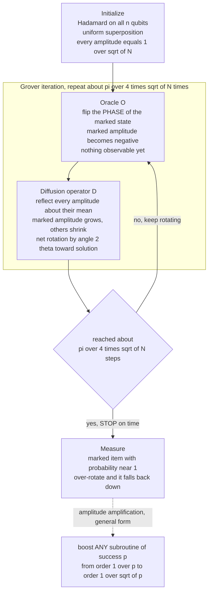

# 🔍 Grover's Search Algorithm

> [!abstract] TL;DR
> **Grover's algorithm** (Grover, 1996) searches an *unstructured* space of `N` items for one that satisfies a condition checkable by an **oracle**, using only `O(√N)` oracle queries — a **quadratic** speedup over the `O(N)` a classical scan needs. It works by starting in a **uniform superposition**, then repeating a two-step **Grover iteration**: the **oracle** flips the *phase* of the marked state, and the **diffusion operator** reflects every amplitude about their mean, which nudges probability onto the marked item. Geometrically it is a fixed-angle **rotation in a 2D plane** toward the solution; after `~ (π/4)√N` iterations the marked amplitude is near `1`. The crucial pitfall: run **too many** iterations and you *over-rotate* past the solution and success probability *falls* — in quantum search, more is not better. `Ω(√N)` is **provably optimal** for a black-box (the BBBV bound), and the underlying **amplitude amplification** is a general primitive that boosts any quantum subroutine quadratically. But quadratic is *not* exponential: `√(2ⁿ)` is still exponential, so Grover does **not** make NP-complete problems tractable — it only *halves* the effective key length of symmetric ciphers.

---

## Intuition

**Analogy — finding a needle in a haystack of `N` items.** Suppose there are `N` numbered boxes and exactly one hides a needle. A classical searcher with no clues must open boxes one at a time; on average they open about `N/2` before finding it, and `N` in the worst case. There is no shortcut, because the boxes are *unstructured* — nothing about box #7 tells you whether the needle is in box #500.

Grover's trick is to stop treating the boxes as separate. Prepare a **quantum wave** that has an equal sliver of amplitude sitting on *every* box at once. An **oracle** — a device that recognizes the needle without telling you where it is — reaches into the wave and flips the *sign* of only the needle's sliver. Then a second operation reflects the whole wave about its own average height, which is like folding all the amplitude a little bit toward the one box the oracle marked. Do this fold-and-flip about `√N` times and almost all of the wave's height has piled onto the needle, so a single measurement finds it. You never opened `N` boxes — you *rotated a wave* into the answer in `√N` steps.

---

## How It Works

### Core Mechanics

**1. The problem and the oracle.** We are given a black-box function `f` on `{0, 1, ..., N-1}` where `f(x) = 1` for the marked item (or `M` marked items) and `0` otherwise, with `N = 2ⁿ`. The oracle can *check* a candidate but gives no structural hint about *where* the solution is. Classically, finding a marked item requires `O(N)` queries on average — you must inspect roughly half the list. This is the **oracle / query model**: we count oracle calls, not gate-level cost.

**2. Start in uniform superposition.** Apply a **Hadamard** gate to each of the `n` qubits. This produces the state `|s⟩` in which every basis state carries the same real amplitude `1/√N`. The probability of measuring the marked item right now is only `1/N` — no better than a random guess.

**3. The oracle step — a phase flip.** The Grover oracle `Oₓ` multiplies the amplitude of the marked state by `-1` and leaves all others unchanged (`Oₓ = I − 2|w⟩⟨w|`, where `|w⟩` is the marked state). Nothing observable changes yet — a global phase is invisible — but the marked amplitude now points the *opposite way* from the rest. This is where interference is seeded; probabilities could never go negative, but amplitudes can.

**4. The diffusion step — inversion about the mean.** The **diffusion operator** `D = 2|s⟩⟨s| − I` reflects every amplitude about the *average* amplitude of the whole vector. Because the oracle just made the marked amplitude negative, the mean is pulled slightly below the bulk; reflecting about that mean sends the (negative) marked amplitude to a *larger positive* value while shrinking all the others. Net effect: amplitude flows onto the marked item and away from the rest. `D` is implementable in `O(n)` gates, so each iteration is cheap.

**5. The Grover iteration is a rotation.** Together `G = D·Oₓ` acts, inside the 2D plane spanned by the marked state `|w⟩` and the uniform-of-unmarked state, as a **rotation by a fixed angle `2θ`** toward `|w⟩`, where `sin θ = 1/√N`. Starting angle from `|w⟩` is `θ`; after `k` iterations the state sits at angle `(2k+1)θ`, so the marked probability is `sin²((2k+1)θ)`. It rises, hits `1`, then — if you keep going — *falls back down*. The amplitude is being rotated, and rotation is periodic.

**6. Optimal iteration count and over-rotation.** The probability is maximal when `(2k+1)θ ≈ π/2`, i.e. `k ≈ π/(4θ) − 1/2 ≈ (π/4)√N` for large `N` (since `θ ≈ 1/√N`). Overshooting this optimum rotates *past* `|w⟩`, so success probability *decreases* — the signature quantum pitfall that "more iterations = worse." You must stop on time.

**7. Multiple / unknown marked items.** With `M` marked items the rotation angle satisfies `sin θ = √(M/N)`, so the optimum is `~ (π/4)√(N/M)` iterations — search speeds up as more items match. If `M` is unknown you cannot know when to stop; **quantum counting** (phase estimation on the Grover operator) first estimates `M`, or you use exponentially-increasing guess schedules.

**8. Optimality — the BBBV lower bound.** Bennett, Bernstein, Brassard, and Vazirani (1997) proved that *any* quantum algorithm needs `Ω(√N)` queries to search a true black box. Grover matches this, so it is **provably optimal** for unstructured search: no quantum algorithm can do better without exploiting structure in `f`.

**9. Amplitude amplification — the general framework.** Grover generalizes: given *any* quantum subroutine `A` that produces a "good" outcome with success probability `p`, you can build an amplified operator that reaches success in `O(1/√p)` repetitions instead of the classical `O(1/p)`. Grover is the special case `p = 1/N`. This makes amplitude amplification a widely reused **primitive** inside larger quantum algorithms.

### Flow / Architecture



*The oracle marks by phase, the diffusion operator converts that phase into visible amplitude, and the pair is a fixed-angle rotation toward the solution — repeated the right number of times, then stopped before it over-rotates.*

---

## Key Concepts

**Secondary (intuitive, no CS background needed)**
- **Unstructured search** — hunting for one marked item among `N` with no map; classically you check them one by one, about `N/2` on average.
- **Quadratic speedup** — Grover finds it in about `√N` checks instead of `N`. For a million items that is roughly `1000` steps versus `500,000` — big, but not magic.
- **Marking by phase** — the oracle does not point at the answer; it secretly tags it, and the algorithm amplifies the tag.
- **Stop on time** — Grover is a rotation, so running it too long spins *past* the answer and makes you *less* likely to find it.

**Undergraduate (a first quantum / algorithms course)**
- **Uniform superposition** — `H⊗ⁿ|0⟩ⁿ` puts amplitude `1/√N` on every basis state; measuring now succeeds with probability `1/N`.
- **Oracle `Oₓ = I − 2|w⟩⟨w|`** — a phase flip of the marked state; costs one query per iteration.
- **Diffusion `D = 2|s⟩⟨s| − I`** — inversion about the mean amplitude; `O(n)` gates, no oracle call.
- **Rotation picture** — the state lives in the 2D span of `|w⟩` and the unmarked-uniform state; `G = D·Oₓ` rotates by `2θ` with `sin θ = 1/√N`; probability is `sin²((2k+1)θ)`.
- **Optimal `k ≈ (π/4)√N`** — and over-rotation drops success probability, so the count matters.
- **Multiple targets** — `~ (π/4)√(N/M)` iterations when `M` items match.

**Graduate (query complexity and amplitude amplification)**
- **BBBV lower bound** — `Ω(√N)` quantum queries are necessary for black-box search (hybrid / adversary argument); Grover is optimal.
- **Amplitude amplification (Brassard–Høyer–Mosca–Tapp, 2000)** — generalizes Grover to boost any subroutine's success amplitude, and **amplitude estimation** yields quantum counting for unknown `M` with `O(√N)` overhead.
- **Fixed-point and QAA variants** — Yoder–Low–Chuang fixed-point search avoids over-rotation when `M` is uncertain, at a mild constant-factor cost.
- **Optimality is tight in constant** — the leading constant `π/4` is provably the best achievable; you cannot shave it.
- **No exponential help** — `√(2ⁿ) = 2^{n/2}` is still exponential; Grover on SAT is `O(2^{n/2})`, so BQP is *not* believed to contain NP-complete problems ([[The_Class_NP_and_Verification]]).
- **Oracle-implementation cost** — the `√N` query win can be eaten by the gate cost of building the oracle and by quantum-RAM access, which is why practical advantage for "database search" is debated.

---

## Python Demo

```python
# Grover's algorithm simulated with plain numpy amplitude vectors -- no qubits,
# no gates library, just the length-N complex/real amplitude vector it manipulates.
#
# We build the two ingredients by hand:
#   ORACLE    : flip the SIGN (phase) of the marked amplitude          -> I - 2|w><w|
#   DIFFUSION : reflect every amplitude about their mean (inversion     -> 2|s><s| - I
#               about the mean), which turns the oracle's phase flip
#               into a real GAIN of probability on the marked item.
#
# Two things we prove empirically:
#   (1) the marked probability rises toward 1 near k = (pi/4)*sqrt(N), then
#       OVER-ROTATES and falls again -- "more iterations is NOT better";
#   (2) the optimal iteration count scales like sqrt(N) with slope ~ pi/4.
# numpy / matplotlib only.

import numpy as np
import matplotlib.pyplot as plt


def oracle(state, marked):
    """Phase-flip the marked index: I - 2|w><w|."""
    out = state.copy()
    out[marked] *= -1.0
    return out


def diffusion(state):
    """Inversion about the mean amplitude: 2|s><s| - I, computed in O(N)."""
    return 2.0 * state.mean() - state


def grover_marked_prob(N, marked, steps):
    """Return the marked-item probability after each of `steps` iterations."""
    state = np.full(N, 1.0 / np.sqrt(N))       # uniform superposition (Hadamards)
    probs = [state[marked] ** 2]
    for _ in range(steps):
        state = oracle(state, marked)          # 1 oracle query
        state = diffusion(state)               # amplify what was marked
        probs.append(state[marked] ** 2)
    return np.array(probs)


# --- Panel 1: amplitude of the marked item vs iteration (rise then over-rotation) ---
n = 10
N = 2 ** n                                     # 1024 items
marked = 777                                   # the hidden "needle"
opt = (np.pi / 4) * np.sqrt(N)                 # optimal iteration count
steps = int(round(3.0 * opt))                  # run WELL past the optimum
probs = grover_marked_prob(N, marked, steps)

k = np.arange(len(probs))
theta = np.arcsin(1.0 / np.sqrt(N))            # rotation half-angle, sin(theta)=1/sqrt(N)
theory = np.sin((2 * k + 1) * theta) ** 2      # closed form sin^2((2k+1)*theta)

first_peak = int(np.argmax(probs[: int(round(1.6 * opt)) + 1]))

print(f"N = {N} items, hidden index = {marked}")
print(f"Classical average scan  : ~N/2 = {N // 2} queries")
print(f"Grover optimum          : ~(pi/4)*sqrt(N) = {opt:.1f}  (empirical first peak k = {first_peak})")
print(f"Prob at first peak       : {probs[first_peak]:.4f}")
print(f"Prob after over-rotating : k={2*first_peak:>3d} -> {probs[2 * first_peak]:.4f}  (fell back down)")

# --- Panel 2: confirm the sqrt(N) scaling of the optimal iteration count ---
ns = np.arange(4, 17)
Ns = 2 ** ns
emp_opt = []
for Nv in Ns:
    window = int(round(1.6 * (np.pi / 4) * np.sqrt(Nv))) + 1
    p = grover_marked_prob(Nv, 0, window)      # any marked index works by symmetry
    emp_opt.append(int(np.argmax(p)))
emp_opt = np.array(emp_opt)
slope, intercept = np.polyfit(np.sqrt(Ns), emp_opt, 1)
print(f"\nFitted optimal-k vs sqrt(N): slope = {slope:.4f}  (theory pi/4 = {np.pi/4:.4f})")

fig, (ax1, ax2) = plt.subplots(1, 2, figsize=(13, 5))

ax1.plot(k, probs, "o-", color="#dc2626", ms=3, lw=1.4, label="simulated |amplitude|^2")
ax1.plot(k, theory, "--", color="#2563eb", lw=1.3, label="theory sin^2((2k+1)*theta)")
ax1.axvline(first_peak, color="gray", ls=":", lw=1.2)
ax1.text(first_peak + 1, 0.12, f"optimum\nk = {first_peak}", fontsize=9, color="gray")
ax1.set_xlabel("Grover iteration k")
ax1.set_ylabel("P(measure the marked item)")
ax1.set_title(f"Amplitude amplification and over-rotation (N = {N})")
ax1.set_ylim(0, 1.05)
ax1.grid(True, ls=":", alpha=0.4)
ax1.legend(loc="upper right", fontsize=9)

ax2.plot(np.sqrt(Ns), emp_opt, "o", color="#dc2626", ms=6, label="empirical optimum")
ax2.plot(np.sqrt(Ns), slope * np.sqrt(Ns) + intercept, "-", color="#2563eb", lw=1.5,
         label=f"linear fit, slope = {slope:.3f}")
ax2.set_xlabel("sqrt(N)")
ax2.set_ylabel("optimal iteration count k*")
ax2.set_title("Optimal iterations scale like sqrt(N)")
ax2.grid(True, ls=":", alpha=0.4)
ax2.legend(loc="upper left", fontsize=9)

plt.tight_layout()
plt.savefig("grovers_search.png", dpi=130)
print("\nSaved plots to grovers_search.png")

# Takeaways the run makes concrete:
#   * marked probability climbs from 1/1024 ~ 0.001 to ~1.0 in about 25 oracle calls,
#     versus ~512 for an average classical scan -- the sqrt(N) win;
#   * push past the optimum and it FALLS, then rises again: Grover is a periodic
#     rotation you must STOP on time, not "run longer to be surer";
#   * the fitted slope of k* vs sqrt(N) lands near pi/4 ~ 0.785, confirming the law.
```

Running it prints that the marked probability rises from `~0.001` to near `1.0` in about `(π/4)√1024 ≈ 25` oracle calls (versus `~512` for an average classical scan), then *falls* once you over-rotate past the optimum — and the right panel's linear fit recovers the `π/4 ≈ 0.785` slope of `k*` against `√N`, confirming the quadratic query law. The simulated curve tracks the closed-form `sin²((2k+1)θ)` exactly.

---

## Real-World Applications

> **Example — halving symmetric-cipher key strength.** Grover turns a brute-force key search over a `k`-bit key (a `2ᵏ`-item unstructured space) from `2ᵏ` down to `~2^{k/2}` operations. So **AES-256 offers only ~128-bit security against a quantum attacker**, and **AES-128 drops to ~64-bit**. This is exactly why post-quantum guidance says to *double symmetric key and hash-output sizes* — a far milder fix than the total break Shor's algorithm inflicts on public-key crypto. See [[Symmetric_Encryption]] and [[Post_Quantum_Cryptography]].

- **Constraint / satisfiability search.** Any problem where you can *verify* a candidate cheaply — SAT assignments, graph coloring, scheduling — can wrap that verifier as an oracle and get a `√` speedup on the brute-force search over candidates. It stays exponential, but the exponent halves.
- **Collision and preimage finding.** Grover speeds up hash preimage search (`2ⁿ → 2^{n/2}`); combined with quantum walks it informs collision-finding bounds, which is why hash outputs are sized conservatively for a post-quantum world.
- **Subroutine inside larger algorithms.** As **amplitude amplification**, it boosts the success probability of quantum subroutines (e.g. inside quantum algorithms for mean estimation, minimum finding, and some machine-learning primitives) quadratically.
- **Honest limits.** The `√N` advantage is often eaten by (a) large constant factors, (b) the gate cost of *building* the oracle, and (c) the cost of **quantum RAM** to load a classical database into superposition. For plain "unstructured database lookup," a real-world quantum win is genuinely debated — the speedup is real in query count but frequently illusory end-to-end.
- **What it does NOT do.** Grover does *not* make NP-complete problems polynomial: `√(2ⁿ)` is still exponential ([[NP_Completeness_and_the_Cook_Levin_Theorem]], [[Quantum_Computation_and_BQP]]).

---

## Common Pitfalls

- **Over-rotation — "more iterations is better."** Grover is a *rotation*; past `~(π/4)√N` steps it rotates *beyond* the solution and success probability *falls*. Always stop at (or near) the optimum. This is the single most counterintuitive property and the one the demo makes visible.
- **Unknown number of solutions `M`.** If you do not know `M`, you cannot compute the stopping point; guessing wrong wrecks the success probability. Use **quantum counting** / amplitude estimation first, or a **fixed-point** amplification variant that will not over-rotate.
- **Expecting an exponential speedup.** It is **quadratic**, provably optimal (BBBV). Only *structured* problems (period-finding via the QFT, as in Shor) get exponential speedups — Grover is the ceiling of *generic* quantum speedup.
- **Ignoring oracle and QRAM cost.** Counting only oracle queries hides the real bill: implementing `f` as a reversible circuit and loading data into superposition can dominate, erasing the `√N` advantage in practice.
- **Conflating Grover with an NP-solver.** A quadratic speedup on brute-force search leaves NP-complete problems exponential. Grover shrinks the exponent; it does not remove it.
- **Global-phase confusion.** After the oracle's phase flip *before* diffusion, nothing is measurable yet — the flip is only useful because diffusion converts a *relative* phase into *amplitude*. Measuring right after the oracle gains you nothing.

---

## Related Concepts

- [[Quantum_Computation_and_BQP]] — where Grover sits in complexity theory: quadratic (not exponential), provably optimal, and *not* an NP-solver; contrasts with Shor's exponential period-finding.
- [[Quantum_Information_Theory]] — the qubit, amplitude, and superposition foundations Grover manipulates; why amplitudes (unlike probabilities) can go negative and interfere.
- [[Post_Quantum_Cryptography]] — Grover's practical fallout: doubling symmetric key/hash sizes so `2^{k/2}` quantum search stays infeasible, alongside the Shor-driven public-key migration.
- [[Symmetric_Encryption]] — AES key lengths and rounds; Grover halves effective strength, so AES-256 gives ~128-bit quantum security and AES-128 weakens.
- [[The_Class_NP_and_Verification]] — the verifier-as-oracle view; Grover's `√` speedup on candidate search does not collapse NP into polynomial time.
- [[NP_Completeness_and_the_Cook_Levin_Theorem]] — SAT and constraint search as brute-force targets; Grover only quarter-roots... i.e. square-roots the search, keeping it exponential.

*(Companion notes planned for this Quantum_Computing vault — `Quantum_Algorithms_and_the_Oracle_Model`, `Deutsch_Jozsa_and_Bernstein_Vazirani` — are not yet created, so they are named here without links.)*

---

## Review Questions

1. **(Conceptual)** Using the "needle in a haystack" picture, explain why the oracle's *phase flip* alone changes nothing measurable, and why it is specifically the **diffusion operator** (inversion about the mean) that converts that phase into a real increase in the marked item's probability. Why can a *classical* probabilistic search never reproduce this effect?
2. **(Scenario)** You must search an unstructured space of `N = 2²⁰` items with exactly one marked item, but a colleague suggests running `2·(π/4)√N` Grover iterations "to be extra sure." Predict what happens to the success probability, explain it with the rotation-angle formula `sin²((2k+1)θ)`, and state the correct number of iterations. Then say how your answer changes if there are `M = 16` marked items and how you would proceed if `M` were unknown.
3. **(Trade-off / graduate)** Grover gives a *provably optimal* `Θ(√N)` query complexity for black-box search, yet many argue it delivers little *practical* speedup. Reconcile these: address the BBBV lower bound, the constant factor `π/4`, the cost of the oracle and quantum RAM, and why `√(2ⁿ)` being exponential means Grover cannot place NP-complete problems in polynomial time — contrasting this with the *exponential* speedup structured problems get from the Quantum Fourier Transform.

---

## Sources

- Grover, L. K. "A Fast Quantum Mechanical Algorithm for Database Search." *Proceedings of the 28th ACM STOC*, 1996 — the original `O(√N)` unstructured-search algorithm.
- Bennett, C. H., Bernstein, E., Brassard, G., Vazirani, U. "Strengths and Weaknesses of Quantum Computing." *SIAM J. Computing*, 26(5), 1997 — the `Ω(√N)` lower bound proving Grover optimal.
- Brassard, G., Høyer, P., Mosca, M., Tapp, A. "Quantum Amplitude Amplification and Estimation." *AMS Contemporary Mathematics*, 305, 2002 — the general amplitude-amplification and quantum-counting framework.
- Nielsen, M. A., Chuang, I. L. *Quantum Computation and Quantum Information*, 10th Anniversary ed. Cambridge University Press, 2010 — Chapter 6 derives the Grover iteration, rotation geometry, and optimal iteration count.
- NIST SP 800-208 / FIPS 197 guidance and NSA CNSA 2.0 — rationale for doubling symmetric key sizes given Grover's quadratic search speedup.

---

#quantum-computing #grovers-algorithm #amplitude-amplification #quantum-search #quadratic-speedup
