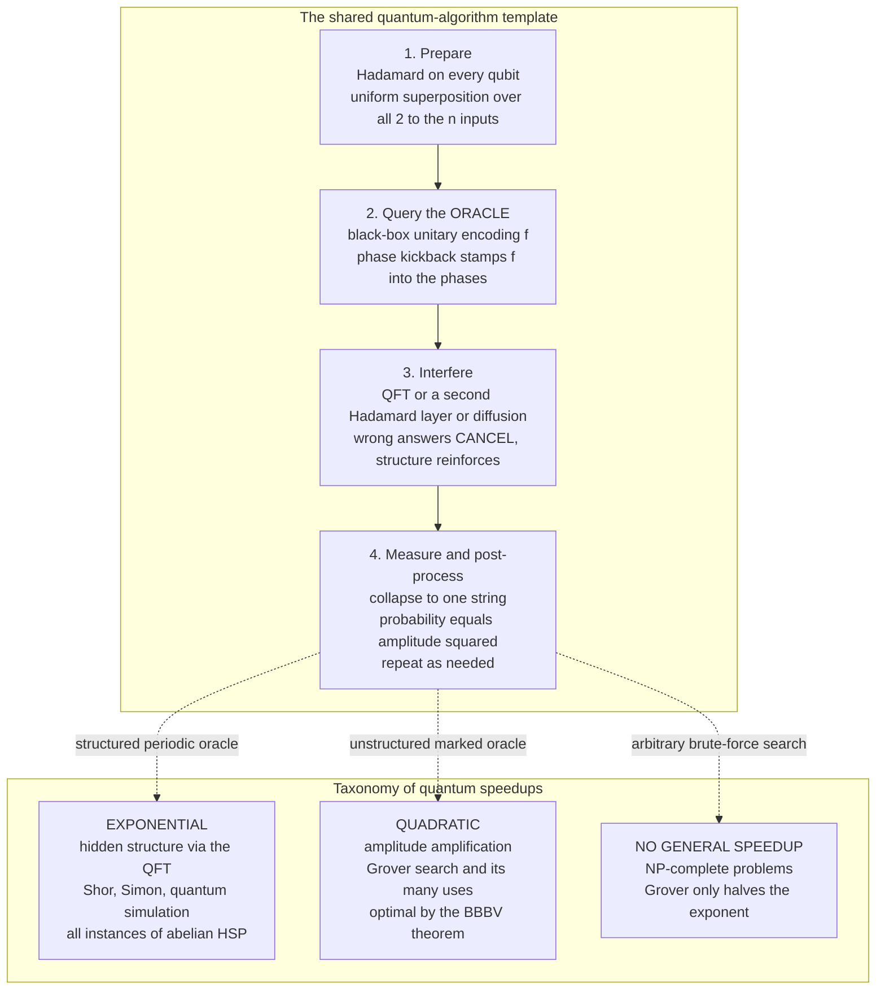

# 🧭 Quantum Algorithms and the Oracle Model

> [!abstract] TL;DR
> Almost every famous quantum algorithm is built from the **same three moves**: use **Hadamard** gates to place the machine in a **superposition** of all `2ⁿ` inputs at once, feed that superposition into an **oracle** — a black box encoding the problem — and then engineer **interference** so that wrong answers *cancel* and the problem's hidden structure *rings out* before a final **measurement**. The single most important truth is that superposition alone is worthless: measuring a naively-prepared superposition returns a **uniformly random** answer, so the whole art is arranging *destructive interference*. We study these algorithms in the **query (oracle) model**, counting the number of black-box calls, because oracle separations let us *prove* quantum beats classical **even though we cannot settle whether BQP ≠ P**. Two engines dominate: **phase kickback** (a controlled operation on an eigenstate stamps the eigenphase onto the control register — the heart of Deutsch–Jozsa and phase estimation) and **amplitude amplification** (rotating amplitude toward marked states — the generalization of Grover). Speedups split into **exponential** ones that exploit hidden periodic structure (Shor, Simon, quantum simulation, all instances of the **Hidden Subgroup Problem** solved by the Quantum Fourier Transform) and **quadratic** ones for unstructured search (Grover) — with the hard caveat that quantum computers give **no general speedup for NP-complete problems**.

---

## Intuition

**Analogy — finding a hidden rhythm by listening to the whole song at once.** A classical computer trying to detect a repeating beat in a long track has to sample it note by note, tapping its foot and checking each moment against the last. A quantum algorithm instead plays **every note simultaneously** and listens to the *whole song as one chord*. Because each note carries a **phase** (like a sound wave with a crest and a trough), the notes that are "off the beat" collide out of step and **cancel to silence**, while the notes that land *on* the hidden rhythm reinforce into a single loud tone. You do not hear every note; you hear the **period** the music was built around. That is exactly what the Quantum Fourier Transform does to the output of an oracle, and it is why a quantum computer can expose the hidden structure of a problem in one shot where a classical machine must grind through the inputs.

The crucial subtlety hides in the word *arrange*. Superposition by itself is not the magic — a quantum computer holding all `2ⁿ` answers at once still hands you back exactly **one, chosen at random**, when you measure. A quantum algorithm is therefore a piece of **acoustic engineering**: you must sculpt the phases so that, by the time you listen, the amplitude has already been herded onto the answer (or the *property* of the answer set) you care about. Wrong paths must destructively interfere; the right structure must constructively swell. Everything below — the oracle model, phase kickback, amplitude amplification, the Hidden Subgroup Problem — is machinery for doing that sculpting reliably.

---

## How It Works

### The three ingredients almost every quantum algorithm shares

**1. Superposition — explore all inputs at once (Hadamards).** Applying a **Hadamard** gate to each of `n` qubits initialized to the all-zero state produces a perfectly **uniform superposition** over all `2ⁿ` bit-strings, `Hⁿ|0…0⟩ = (1/√N) Σₓ |x⟩` with `N = 2ⁿ`. In one gate layer the machine "holds" every possible input. This is the cheap, universal opening move.

**2. The oracle — a black box encoding the problem.** The problem is presented as a function `f`, accessible only through a reversible **oracle** unitary. Two standard forms exist. The **bit oracle** `U_f|x⟩|y⟩ = |x⟩|y ⊕ f(x)⟩` XORs the answer into an ancilla. The **phase oracle** `O_f|x⟩ = (−1)^{f(x)}|x⟩` stamps the answer into the *sign* of each amplitude. As shown below, the two are connected by **phase kickback**, and the phase form is what makes interference possible. The oracle is treated as a black box precisely so we can reason about *how many times we must consult it* without assuming anything about its internals.

**3. Interference — concentrate amplitude on the answer.** Superposition plus oracle is still useless: the state now encodes `f` in its phases, but **measuring it returns a uniformly random `x`**. The decisive step is a final unitary — a second Hadamard layer (Deutsch–Jozsa), a **Quantum Fourier Transform** (Shor, phase estimation), or a **diffusion** operator (Grover) — that makes the amplitudes for "wrong" or "off-structure" strings **destructively cancel** while the wanted structure **constructively reinforces**. Only then does measurement pay off. Interference, not parallelism, is the entire source of quantum advantage.

### The query / oracle model — how we measure cost and prove speedups

In the **query model** the cost of an algorithm is the **number of oracle calls** it makes, ignoring all other gates. This abstraction is powerful for two reasons. First, it gives clean, provable numbers: the **quantum query complexity** of a problem versus its **classical (deterministic or randomized) query complexity** is often exactly computable, whereas full circuit lower bounds are hopeless. Deutsch–Jozsa needs **1** quantum query where a classical deterministic algorithm needs up to `2^{n-1}+1`; Grover needs `O(√N)` where classical needs `Θ(N)`; Simon's problem needs `O(n)` where classical needs `Θ(√{2ⁿ})`.

Second — and this is why theorists love it — **oracle separations are how we prove quantum speedups at all**. We do **not** know whether `BQP ≠ P` (that would resolve deep open problems in [[Time_and_Space_Complexity|complexity theory]]). But *relative to an oracle* we can prove **unconditional** exponential gaps: Simon's problem is provably exponentially hard classically and easy quantumly **in the query model**. Oracle separations sidestep the `P` vs `BQP` impasse and give rigorous evidence that quantum computers are genuinely more powerful for structured tasks. See [[Quantum_Computation_and_BQP]] for how these query results relate to the class **BQP**.

### Phase kickback — the workhorse trick

**Phase kickback** is the mechanism that turns a bit oracle into a phase oracle, and it powers Deutsch–Jozsa, Bernstein–Vazirani, and phase estimation alike. Prepare the ancilla in the state `|−⟩ = (|0⟩ − |1⟩)/√2`, which is an **eigenstate** of the NOT operation the oracle applies, with eigenvalue `−1`. Now apply the bit oracle:

```
U_f |x⟩|−⟩ = |x⟩ (|0 ⊕ f(x)⟩ − |1 ⊕ f(x)⟩)/√2 = (−1)^{f(x)} |x⟩|−⟩
```

The ancilla comes out **unchanged**, but its eigenphase `(−1)^{f(x)}` has been **kicked back** onto the *control* register `|x⟩`. In one stroke the answer `f(x)` moves from a data register into the **phases** of the input superposition — exactly the raw material interference needs. Generalized to a controlled-`U` acting on an eigenstate `U|ψ⟩ = e^{2πiφ}|ψ⟩`, the same effect writes the eigenphase `φ` onto the control, which is the beating heart of the **Quantum Fourier Transform and phase estimation** and hence of Shor's algorithm.

### Amplitude amplification — the generalization of Grover

Where phase kickback feeds *structured* algorithms, **amplitude amplification** handles *unstructured search*. Given an oracle that marks "good" states with a phase flip, Grover's algorithm alternates the oracle with a **diffusion** operator (inversion about the mean). Geometrically this is a **rotation** in the 2-D plane spanned by the "good" and "bad" subspaces: each iteration rotates the state vector by a fixed angle `2θ` toward the marked subspace, so after `≈ (π/4)√{N/M}` iterations (for `M` marked items among `N`) the amplitude is concentrated on the solutions. Amplitude amplification is the *general* statement — Grover is the special case of a uniform starting superposition — and it delivers a **quadratic** speedup for any subroutine that can only *verify* solutions, from search to collision-finding to speeding up Monte Carlo estimation.

### The Hidden Subgroup Problem — the abstraction unifying the exponential wins

The great exponential-speedup algorithms are not a grab-bag of tricks; they are all instances of one template, the **Hidden Subgroup Problem (HSP)**. Given a function `f` on a group `G` that is *constant and distinct on the cosets* of some unknown subgroup `H`, find `H`. Deutsch–Jozsa, Bernstein–Vazirani, **Simon's algorithm**, and **Shor's algorithm** are all HSP over different groups. The recipe is always the same: create a superposition over `G`, query `f`, and apply the **Quantum Fourier Transform** over `G`, which makes amplitudes interfere so that measurement reveals a random element of the subgroup's dual — enough repetitions pin down `H`. For **abelian** groups (period-finding, factoring, discrete log) the QFT solves HSP efficiently; the **non-abelian** cases (graph isomorphism, lattice problems) resist, which is *why* lattice-based post-quantum cryptography is believed quantum-safe.

**Simon's algorithm is the conceptual bridge to Shor.** It solves HSP over `(ℤ₂)ⁿ` — find the secret string `s` such that `f(x) = f(x ⊕ s)` — using only `O(n)` queries, and it was the **first problem with a provable exponential oracle separation** between quantum and classical. Shor took Simon's period-finding idea, moved it from `(ℤ₂)ⁿ` to the integers modulo `N`, and swapped the parity check for the full QFT — turning a toy oracle separation into the algorithm that factors RSA moduli.

### Taxonomy of speedups — and its hard limits

- **Exponential speedups** come *only* from hidden algebraic structure exploitable by the QFT: **Shor's factoring / discrete log**, **Simon's problem**, and **quantum simulation** of many-body physics and chemistry. These are the crown jewels — and there are surprisingly few of them.
- **Polynomial (usually quadratic) speedups** come from **amplitude amplification**: **Grover search** and its descendants (amplitude estimation, quantum walks for element distinctness, speeding classical heuristics). Broadly applicable, but modest.
- **No general speedup for NP-complete problems.** This is the most-abused point in the subject. Grover applied to SAT search only *halves the exponent* (`2^{n/2}` instead of `2ⁿ`) — still exponential. **NP-complete problems are believed to lie outside BQP** ([[The_Class_NP_and_Verification]], [[NP_Completeness_and_the_Cook_Levin_Theorem]]); a quantum computer is a scalpel for structured problems, not a universal fast-everything box ([[P_versus_NP]]).

The **BBBV theorem** (Bennett–Bernstein–Brassard–Vazirani, 1997) makes the ceiling precise: relative to a *random* oracle, quantum search of an unstructured space of size `N` requires `Ω(√N)` queries — Grover is **optimal**, and there is **no** quantum way to do unstructured search faster. Quantum advantage lives exactly where the problem has structure the oracle exposes; strip the structure away and the advantage collapses to the quadratic wall.

### Reading a quantum algorithm — and a roadmap of this section

Every algorithm in this section can be read as the same five-beat rhythm: **prepare** a superposition, **evolve** it through the oracle, **interfere** to concentrate amplitude, **measure**, and **repeat** with classical post-processing. Keep that skeleton in mind and each algorithm becomes a variation on a theme:

- **Foundations (Section 01):** *Quantum Computing Overview* and *Quantum Gates and Circuits* — qubits, Hadamard, unitaries, measurement, the circuit model that everything here assumes.
- **This note:** the oracle model, phase kickback, amplitude amplification, HSP, and the speedup taxonomy that frame the algorithms below.
- **Deutsch–Jozsa and Bernstein–Vazirani** — the simplest oracle separations; phase kickback in its purest, single-query form.
- **Grover's Search Algorithm** — amplitude amplification and the quadratic speedup, bounded by BBBV.
- **Quantum Fourier Transform and Phase Estimation** — the interference engine behind every exponential speedup.
- **Shor's Factoring Algorithm** — abelian HSP / period-finding applied to breaking RSA and ECC.
- **Quantum Simulation and VQE** — Feynman's original motivation and the leading near-term application.
- **Quantum Complexity Theory and BQP** — the formal home of these results; see [[Quantum_Computation_and_BQP]].

### Flow / Architecture



*Left: the four-beat pipeline every algorithm in this section follows — the interference stage manufactures the speedup, not the superposition. Right: the three-way split of what quantum buys you, from the exponential jackpot of hidden-structure problems down to the flat wall at NP-complete brute force.*

---

## Key Concepts

**Secondary (intuitive, no CS background needed)**
- **Superposition is not the trick.** Holding all inputs at once is free and useless on its own — a measurement returns a *random* one. The trick is arranging cancellation.
- **Interference is the trick.** Wrong answers behave like sound waves that cancel to silence; the right structure swells into a tone you can hear. That is the whole difference from a classical guess.
- **Oracle = the problem in a box.** We hand the algorithm a black box that answers `f(x)` and count how many times it must peek inside.
- **Two kinds of win.** A *huge* win when the problem has hidden repetition (factoring), and a *modest* win (roughly square-root faster) for plain searching. No magic win for the hardest general problems.

**Undergraduate (a first quantum / theory course)**
- **Bit oracle vs phase oracle** — `U_f|x⟩|y⟩ = |x⟩|y ⊕ f(x)⟩` versus `O_f|x⟩ = (−1)^{f(x)}|x⟩`; connected by phase kickback.
- **Phase kickback** — the ancilla `|−⟩` is a `−1` eigenstate, so the oracle's action becomes a phase `(−1)^{f(x)}` on the control register.
- **Query complexity** — cost measured in oracle calls; quantum versus classical query complexity is the arena for provable separations.
- **Amplitude amplification / Grover** — oracle-plus-diffusion is a rotation in the good/bad plane; `≈(π/4)√{N/M}` iterations; over-rotation degrades the answer.
- **Deutsch–Jozsa and Bernstein–Vazirani** — one-query oracle separations built purely from Hadamards and phase kickback.

**Graduate (advanced quantum algorithms)**
- **Hidden Subgroup Problem** — the unifying abstraction; **abelian** HSP is solved efficiently by the QFT (Shor, Simon, discrete log), **non-abelian** HSP (graph isomorphism, dihedral / lattice problems) remains open and underpins post-quantum security.
- **Simon's algorithm** — HSP over `(ℤ₂)ⁿ`; the first **provable exponential** query separation and the template Shor generalized.
- **BBBV lower bound** — `Ω(√N)` for unstructured search relative to a random oracle; the hybrid argument that proves Grover optimal.
- **Quantum query lower-bound methods** — the **polynomial method** and the **adversary method** bound what interference can buy for a given oracle problem.
- **Relativized separations** — oracles where `BQP ⊄ PH` (Raz–Tal *Forrelation*, 2018); why oracle results both illuminate and *limit* what we can conclude about the unrelativized world.
- **Amplitude estimation** — the amplitude-amplification generalization that gives quadratic speedups for Monte Carlo integration and counting.

---

## Python Demo

```python
# PHASE KICKBACK: the primitive that powers Deutsch-Jozsa, Bernstein-Vazirani,
# Grover, and (via phase estimation) Shor. We show, with plain numpy state
# vectors, how a BIT oracle acting on an ancilla in |-> turns into a PHASE
# oracle that flips the SIGN of the marked input amplitudes -- the exact
# mechanism that lets a later interference step cancel the wrong answers.
#
# Setup: n input qubits + 1 ancilla qubit (total 2^(n+1) amplitudes).
#   - Hadamard on everything  -> inputs become a uniform superposition (all +),
#                                the ancilla becomes |-> = (|0> - |1>)/sqrt2.
#   - Bit oracle U_f|x>|a> = |x>|a XOR f(x)>  (a reversible permutation matrix).
#   - Because |-> is a (-1)-eigenstate of the NOT the oracle applies, the phase
#     (-1)^f(x) is KICKED BACK onto the input register while the ancilla is
#     left untouched -- i.e. U_f behaves like the phase oracle diag((-1)^f(x)).
# numpy / matplotlib only.

import numpy as np
import matplotlib.pyplot as plt

# ---- 1. Build the n-input + 1-ancilla uniform-superposition-with-|-> state ----
n = 3                     # number of input qubits
N = 2 ** n                # number of inputs = 8
H = np.array([[1, 1], [1, -1]], dtype=complex) / np.sqrt(2)

def kron_all(mats):       # tensor product of a list of 2x2 gates
    out = np.array([[1.0 + 0j]])
    for m in mats:
        out = np.kron(out, m)
    return out

Hall = kron_all([H] * (n + 1))          # Hadamard on all n+1 qubits
init = np.zeros(2 ** (n + 1), dtype=complex)
init[0b0001] = 1.0                       # inputs = |000>, ancilla = |1>
state_before = Hall @ init               # uniform inputs (all +), ancilla in |->

# ---- 2. Define f: mark a solution set S with a minus sign (Grover/DJ style) ----
S = {2, 5}                               # the "solutions" the oracle knows
f = np.array([1 if x in S else 0 for x in range(N)])

# ---- 3. Build the BIT oracle U_f|x>|a> = |x>|a XOR f(x)> as a permutation ----
dim = 2 ** (n + 1)
U_f = np.zeros((dim, dim), dtype=complex)
for x in range(N):
    for a in range(2):
        src = x * 2 + a                  # index = input (high bits) * 2 + ancilla
        dst = x * 2 + (a ^ int(f[x]))
        U_f[dst, src] = 1.0
state_after = U_f @ state_before

# ---- 4. Extract the input-register amplitudes in the |-> ancilla basis ----
def input_amplitudes(state):
    amp = state.reshape(N, 2)            # amp[x, ancilla_bit]
    # projection onto ancilla |-> = (|0> - |1>)/sqrt2
    return (amp[:, 0] - amp[:, 1]) / np.sqrt(2)

amp_before = input_amplitudes(state_before).real
amp_after = input_amplitudes(state_after).real

# ---- 5. Verify the kickback: ancilla unchanged, marked states sign-flipped ----
# ancilla stays |-> for every x  <=>  amp[x,0] == -amp[x,1]
resid = state_after.reshape(N, 2)
ancilla_intact = np.allclose(resid[:, 0], -resid[:, 1])
flipped = [x for x in range(N) if amp_after[x] * amp_before[x] < 0]
print(f"Inputs N = {N}, marked solutions S = {sorted(S)}")
print(f"Ancilla left in |-> for every input (kickback clean)? {ancilla_intact}")
print(f"Input amplitudes with a flipped SIGN after the oracle: {flipped}")
print(f"So U_f acted as the phase oracle diag((-1)^f(x)) = {[int((-1)**f[x]) for x in range(N)]}")

# ---- 6. Visualize the amplitude and phase pattern before vs after ----
xs = np.arange(N)
fig, (ax1, ax2) = plt.subplots(1, 2, figsize=(12, 4.5))

w = 0.4
ax1.bar(xs - w / 2, amp_before, w, color="#2563eb", label="before oracle")
ax1.bar(xs + w / 2, amp_after, w, color="#dc2626", label="after oracle")
ax1.axhline(0, color="black", lw=0.8)
ax1.set_xticks(xs)
ax1.set_xlabel("input state x")
ax1.set_ylabel("real amplitude")
ax1.set_title("Phase kickback flips the marked amplitudes' sign")
ax1.legend(loc="lower right", fontsize=9)
ax1.grid(True, axis="y", ls=":", alpha=0.4)

phase_after = np.where(amp_after < 0, np.pi, 0.0)
ax2.stem(xs, phase_after, basefmt=" ")
for x in S:
    ax2.annotate("marked", (x, np.pi), textcoords="offset points",
                 xytext=(0, 6), ha="center", fontsize=8, color="#dc2626")
ax2.set_xticks(xs)
ax2.set_yticks([0, np.pi])
ax2.set_yticklabels(["0", "pi"])
ax2.set_xlabel("input state x")
ax2.set_ylabel("phase of amplitude")
ax2.set_title("Solutions carry phase pi, everything else phase 0")
ax2.grid(True, axis="y", ls=":", alpha=0.4)

plt.tight_layout()
plt.savefig("phase_kickback.png", dpi=130)
print("\nSaved amplitude/phase visualization to phase_kickback.png")

# Takeaways the run makes concrete:
#   * the ancilla is returned UNTOUCHED in |-> -- the oracle's eigenphase was
#     kicked back onto the input register, not left in the ancilla;
#   * exactly the marked inputs S = {2, 5} have their amplitude sign flipped,
#     i.e. the bit oracle became the phase oracle diag((-1)^f(x)) for free;
#   * this signed pattern is the RAW MATERIAL a later interference step needs:
#     Grover's diffusion amplifies these minus-signed states, while a second
#     Hadamard layer (Deutsch-Jozsa) reads the global parity out of them.
```

Running it prints that the ancilla is returned **exactly in `|−⟩`** for every input (the kickback is clean), that inputs `2` and `5` — and only those — have their amplitude **sign flipped**, and that the bit oracle has therefore acted as the phase oracle `diag((−1)^{f(x)})` at no extra cost. The saved `phase_kickback.png` shows the amplitudes all-positive before the oracle and two of them driven negative after, with a companion phase plot marking the solutions at phase `π`. That signed superposition is precisely the input that Grover's diffusion amplifies and that Deutsch–Jozsa's final Hadamard layer converts into a global parity readout — one primitive, two famous algorithms.

---

## Real-World Applications

> **Example — why the query model, not the hardware, is where speedups are proven.** When Shor announced polynomial-time factoring in 1994, no quantum computer existed to run it. The evidence that quantum computing was *fundamentally* more powerful came earlier and more rigorously from **Simon's oracle separation**: a black-box problem provably needing exponentially many classical queries but only linearly many quantum ones. That query-model result, not any physical device, is what convinced the field the effort was worth it — and it is the template Shor then instantiated into an algorithm that threatens RSA and ECC.

- **Cryptanalysis (Shor / HSP).** Period-finding via the QFT breaks RSA (factoring) and Diffie–Hellman / ECC (discrete log), both abelian HSP instances. This is the entire motivation for the migration to post-quantum, lattice-based cryptography — whose security rests on the *non-abelian / lattice* HSP cases that the QFT does **not** crack.
- **Search and optimization heuristics (amplitude amplification).** Grover-style quadratic speedups accelerate database-style search, constraint satisfaction back-ends, collision-finding, and — via **amplitude estimation** — Monte Carlo pricing and risk simulation in quantitative finance, wherever the bottleneck is verifying candidate solutions.
- **Quantum simulation of chemistry and materials.** The leading candidate for *useful* near-term advantage: estimating molecular ground-state energies (catalysts, batteries, nitrogen fixation) is exponential classically but polynomial on a quantum simulator, exactly Feynman's 1982 argument.
- **Complexity-theoretic benchmarking.** *Forrelation* and random-circuit sampling are oracle / sampling problems chosen because they are provably hard to simulate classically; they probe the boundary of quantum advantage and the Extended Church–Turing thesis rather than computing anything useful.

---

## Common Pitfalls

- **"Superposition means the computer tries every answer in parallel and reads off the best."** No. All `2ⁿ` amplitudes coexist, but measurement returns **one** string with probability amplitude-squared. Without an interference step that cancels the wrong answers first, you get a **uniformly random** result. Interference, not parallelism, is the resource.
- **"Grover gives an exponential speedup."** It is **quadratic** (`√N` vs `N`), and the **BBBV theorem** proves that is optimal for unstructured search. Only hidden-structure problems (period-finding via the QFT) get exponential speedups.
- **"Quantum computers solve NP-complete problems efficiently."** They are **not** known to and almost certainly do not. Grover only halves the exponent for SAT; NP-complete is believed to lie outside BQP ([[The_Class_NP_and_Verification]]).
- **"An oracle separation proves BQP ≠ P."** It does **not**. Relativized (oracle) results can even point in *opposite* directions from the unrelativized truth. Oracle separations prove quantum advantage **in the query model** and give strong evidence, but they cannot settle the real-world `P` vs `BQP` question ([[P_versus_NP]]).
- **"Amplitudes are just probabilities."** Amplitudes are **complex** and can be negative or out of phase, which is exactly why phase kickback and interference work. Probabilities are non-negative and only add; conflate the two and the entire mechanism disappears.
- **"More Grover iterations is always better."** Amplitude amplification is a **rotation**; past `≈(π/4)√{N/M}` it **over-rotates** and the success probability falls again. You must stop at the optimum.
- **"Forgetting the oracle must be reversible."** A quantum oracle is a **unitary**; encoding `f` as `|x⟩ → |f(x)⟩` is illegal if `f` is not injective. The bit-oracle form `|x⟩|y⟩ → |x⟩|y ⊕ f(x)⟩` exists precisely to keep the map reversible.

---

## Related Concepts

- [[Quantum_Computation_and_BQP]] — the complexity-theoretic home of these algorithms: how query-model separations relate to the class **BQP**, and why NP-complete is believed to sit outside it.
- [[Quantum_Information_Theory]] — the substrate the oracle model rides on: qubits, amplitudes, the Born rule, no-cloning, and the Holevo bound that caps how much a measurement can extract.
- [[The_Class_NP_and_Verification]] — the class of efficiently-verifiable problems; the crucial caveat that quantum computers do **not** give general speedups for NP-complete problems.
- [[NP_Completeness_and_the_Cook_Levin_Theorem]] — why the hardest search problems are structurally equivalent, and why Grover's quadratic wall is not enough to crack them.
- [[P_versus_NP]] — the surrounding open landscape that oracle separations deliberately sidestep; BQP is conjectured incomparable to NP.
- [[Time_and_Space_Complexity]] — the resource-based framework of complexity classes into which quantum query and time complexity are slotted.

*Section 02 companion notes (Deutsch–Jozsa and Bernstein–Vazirani, Grover's Search Algorithm, Quantum Fourier Transform and Phase Estimation, Shor's Factoring Algorithm, Quantum Simulation and VQE) and the Section 01 foundations (Quantum Computing Overview, Quantum Gates and Circuits) are being built alongside this entry; wikilinks will be wired in once those files exist.*

---

## Review Questions

1. **(Conceptual)** Using the "hidden rhythm in a song" analogy, explain why placing a quantum computer in a uniform superposition over all `2ⁿ` inputs achieves *nothing* on its own, and identify precisely which of the three ingredients — superposition, oracle, or interference — is the actual source of speedup. What does the Born rule imply about measuring a naively-prepared superposition?
2. **(Scenario)** You are handed a black-box function `f` and told that either `f` is constant or it satisfies `f(x) = f(x ⊕ s)` for some secret `s`. Describe how you would set up the input register, the ancilla, and the oracle so that **phase kickback** loads `f` into the phases, and explain what interference step then extracts the answer. Which real algorithm is each variant, and what is its quantum query complexity versus the classical one?
3. **(Trade-off / graduate)** A colleague claims their quantum startup will "exponentially speed up any search or optimization problem." Referencing (a) the **BBBV** `Ω(√N)` lower bound, (b) the distinction between **abelian** and **non-abelian** Hidden Subgroup Problems, and (c) the fact that an **oracle separation does not prove `BQP ≠ P`**, explain exactly where exponential speedups are and are not available — and name one problem the startup genuinely could accelerate exponentially and one it could only accelerate quadratically.

---

## Sources

- Nielsen, M. A., Chuang, I. L. *Quantum Computation and Quantum Information*, 10th Anniversary ed. Cambridge University Press, 2010 — Chapters 5–6 cover the oracle model, phase kickback, Deutsch–Jozsa, Grover, and the quantum Fourier transform.
- Simon, D. R. "On the Power of Quantum Computation." *SIAM Journal on Computing*, 26(5), 1997 — the first provable exponential oracle separation and the bridge to Shor's period-finding.
- Bennett, C. H., Bernstein, E., Brassard, G., Vazirani, U. "Strengths and Weaknesses of Quantum Computing." *SIAM Journal on Computing*, 26(5), 1997 — the BBBV theorem establishing the `Ω(√N)` optimality of quantum search.
- Montanaro, A. "Quantum Algorithms: An Overview." *npj Quantum Information*, 2, 15023, 2016 — a modern survey of the oracle model, HSP, amplitude amplification, and the speedup taxonomy.
- Childs, A. M., van Dam, W. "Quantum Algorithms for Algebraic Problems." *Reviews of Modern Physics*, 82(1), 2010 — the Hidden Subgroup Problem as the unifying framework for Deutsch–Jozsa, Simon, and Shor.

---

#quantum-computing #quantum-algorithms #oracle #phase-kickback #query-complexity
