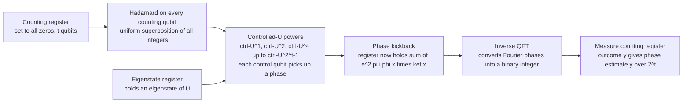

# 🌀 Quantum Fourier Transform and Phase Estimation

> [!abstract] TL;DR
> The **Quantum Fourier Transform (QFT)** is the quantum version of the discrete Fourier transform: it rewrites a state's amplitudes as their Fourier coefficients using only about **n² gates on 2ⁿ amplitudes** — exponentially fewer operations than the classical FFT. On its own that speed is unusable (you cannot read out all the coefficients), but as the read-out stage of **Quantum Phase Estimation (QPE)** it becomes the single most important primitive in quantum algorithms: QPE extracts the hidden eigenphase of a unitary, and that is exactly the engine behind Shor's factoring, HHL, and quantum-chemistry eigenvalue solvers.

---

## Intuition

**Analogy:** A **prism** takes white light and fans it out into its constituent colors — it does not "compute" anything, it just re-expresses the same light in the frequency basis so hidden structure becomes visible as bright bands. The QFT is a prism for a quantum state: it fans the 2ⁿ amplitudes out into their frequencies, so a *hidden periodicity* buried in the amplitudes shows up as a bright peak.

The twist is speed. The classical FFT already does the DFT in `O(N log N) = O(n·2ⁿ)` operations. The QFT does the *same* transform in `O(n²)` gates, because a quantum register holds all 2ⁿ amplitudes at once and the transform is applied to all of them in parallel by a shallow ladder of gates. But there is a catch you must internalize before anything else: **you cannot look at the prism's output directly.** A measurement returns *one* frequency sampled from the output distribution, not the whole spectrum. So the QFT only helps when the answer you want is a single *structural* fact — a period, an order, an eigenphase — that a well-placed measurement can reveal with high probability.

**Phase Estimation** turns this into a tool. Every unitary gate `U` secretly rotates its eigenstates by some angle: `U|ψ⟩ = e^{2πiφ}|ψ⟩`. QPE reads that hidden rotation angle `φ` and writes it into a register as an ordinary binary number, to as many bits of precision as you are willing to pay ancilla qubits for.

---

## How It Works

### The QFT itself

On an `n`-qubit register (`N = 2ⁿ` basis states) the QFT maps computational basis state `|j⟩` to a Fourier superposition:

```
QFT |j⟩ = (1/√N) Σ_{k=0}^{N-1} e^{2πi jk / N} |k⟩
```

As a matrix its `(j,k)` entry is `ω^{jk}/√N` with `ω = e^{2πi/N}` — the *same* matrix as the classical DFT, just applied to probability amplitudes instead of a data array.

**The circuit** decomposes this dense `N×N` matrix into a tiny gate ladder:

1. **Hadamard** on the top qubit creates the coarsest frequency bit.
2. **Controlled-phase rotations** `R_k` (phase `2π/2^k`) from the lower qubits add the finer phase corrections. Qubit `j` receives a controlled rotation from each qubit below it.
3. Repeat down the register — each qubit gets one Hadamard plus a shrinking fan of controlled rotations.
4. **Bit reversal** (a final wire swap) puts the output qubits in the conventional order.

Counting gates: qubit `i` uses `1` Hadamard and up to `n-1` controlled rotations, giving `O(n²)` gates total versus the FFT's `O(n·2ⁿ)`. That is the exponential *gate-count* advantage — for `n = 50` qubits, `n² = 2500` gates transform a 10¹⁵-amplitude vector.

> [!warning] The read-out caveat
> The QFT is exponentially fast at **transforming**, not at **reporting**. Those `2ⁿ` Fourier coefficients live in amplitudes you can never fully observe — one measurement yields one sample. The advantage is real only inside an algorithm whose answer is a single structural property (a period or a phase), where measurement lands on the informative peak with high probability.

### Quantum Phase Estimation

QPE is the central subroutine. Inputs: a unitary `U` (available as a controlled gate you can raise to powers) and one of its eigenstates `|ψ⟩` with unknown eigenphase `φ ∈ [0,1)`, where `U|ψ⟩ = e^{2πiφ}|ψ⟩`. Goal: estimate `φ` to `t` bits.

1. **Counting register** of `t` qubits starts in `|0…0⟩`; **Hadamards** put it in a uniform superposition over all integers `0 … 2ᵗ−1`.
2. **Controlled-U powers.** Apply `controlled-U^{2^k}` from counting qubit `k` onto the eigenstate register. Because `|ψ⟩` is an eigenstate, `U` does not change it — instead the eigenphase is **kicked back** onto the control qubit (phase kickback). After the ladder, the counting register holds `(1/√2ᵗ) Σ_x e^{2πiφx} |x⟩` — the phase `φ` is now encoded in the *Fourier basis*.
3. **Inverse QFT** on the counting register decodes those Fourier phases into an ordinary binary integer.
4. **Measure.** The outcome `y` gives the estimate `φ ≈ y / 2ᵗ`. If `φ` is exactly `t` bits, the answer is deterministic; otherwise the peak sits at the nearest `t`-bit value with probability at least `4/π² ≈ 0.405`, and adding a few extra ancilla qubits pushes success arbitrarily close to 1.

The whole point: the QFT *writes* a phase into an unreadable Fourier basis, and the **inverse** QFT *reads* it back out as binary. QPE is nothing more than "encode with controlled-U powers, decode with inverse QFT."



---

## Key Concepts

**Secondary (plain-language core):**
- A prism-like operation re-expresses a quantum state by *frequency* instead of by *position*, so a repeating pattern becomes a visible peak.
- You get the transform fast but can only *sample* one output — useful when the answer is a single number like a period.
- Phase estimation reads the "hidden rotation angle" of a gate and writes it as a binary number.

**Undergraduate (CS / linear algebra background):**
- **QFT matrix:** unitary with entries `ω^{jk}/√N`, `ω = e^{2πi/N}`; identical to the DFT matrix acting on amplitudes.
- **Circuit cost:** `O(n²)` gates (Hadamards + controlled-phase rotations + bit reversal) versus FFT's `O(n·2ⁿ)`.
- **Phase kickback:** a controlled-`U` on an eigenstate leaves the target unchanged and deposits `e^{2πiφ}` on the control — the mechanism that loads the phase.
- **Precision–resource trade:** `t` counting qubits give `t` bits of `φ`; `t + ⌈log(2 + 1/2ε)⌉` qubits guarantee success probability `1−ε`.

**Graduate (algorithmic / systems level):**
- **Hidden Subgroup Problem (HSP):** the QFT over an abelian group projects onto irreducible representations, revealing the hidden subgroup. Period finding and order finding are the cyclic-group instances — the reason Shor's speedup is exponential.
- **Order finding:** Shor runs QPE on the modular-multiplication unitary `U_a: |x⟩ → |ax mod N⟩`; the eigenphases are `s/r`, so QPE + continued fractions recovers the order `r`.
- **Eigenvalue extraction:** HHL and quantum-chemistry algorithms use QPE to bring eigenvalues of a Hamiltonian or matrix into an ancilla register for further processing.
- **Iterative / semiclassical QPE:** replaces the `t`-qubit counting register with a *single* recycled ancilla, measuring one bit at a time and feeding classical feedback into later rotations — same precision, far fewer qubits, at the cost of more circuit repetitions (Kitaev / Griffiths–Niu).

---

## Python Demo

```python
# numpy/matplotlib only. Two demonstrations:
#   (1) Build the QFT as a unitary matrix and apply it to a periodic state;
#       show that it concentrates amplitude at the frequency set by the period.
#   (2) Simulate Quantum Phase Estimation for a unitary with a known eigenphase
#       and show the measurement distribution peaks at the estimated phase.
import numpy as np
import matplotlib.pyplot as plt


def qft_matrix(N):
    """N x N Quantum Fourier Transform unitary. Entry (j,k) = w^{jk}/sqrt(N)."""
    j = np.arange(N).reshape(-1, 1)
    k = np.arange(N).reshape(1, -1)
    return np.exp(2j * np.pi * j * k / N) / np.sqrt(N)


# ---- Part 1: QFT reveals a hidden period ----------------------------------
n_qft = 5
N = 2 ** n_qft           # 32 amplitudes
period = 4               # hidden period of the input "comb" state

state = np.zeros(N, dtype=complex)
state[np.arange(0, N, period)] = 1.0   # amplitude on 0, 4, 8, ... 28
state /= np.linalg.norm(state)

QFT = qft_matrix(N)
qft_out = QFT @ state
qft_probs = np.abs(qft_out) ** 2

peaks = np.where(qft_probs > 1e-9)[0]
spacing = peaks[1] - peaks[0]
print("QFT demo:")
print("  input period r        =", period)
print("  output peak positions =", peaks.tolist())
print("  peak spacing N/r      =", spacing, "-> recovered r = N/spacing =", N // spacing)

# ---- Part 2: Quantum Phase Estimation -------------------------------------
# U = diag(1, e^{2 pi i phi}); eigenstate |1> has eigenphase phi.
t = 5                    # counting qubits -> resolution 1/2^t = 1/32
M = 2 ** t
phi_true = 0.4           # NOT exactly t-bit representable: nearest is 13/32 = 0.40625

# After Hadamards + controlled-U^{2^k}, phase kickback leaves the counting
# register in (1/sqrt(M)) * sum_x e^{2 pi i phi x} |x>. Then apply inverse QFT.
x = np.arange(M)
reg = np.exp(2j * np.pi * phi_true * x) / np.sqrt(M)
inv_qft = qft_matrix(M).conj().T          # inverse QFT = Hermitian conjugate
qpe_amp = inv_qft @ reg
qpe_probs = np.abs(qpe_amp) ** 2

best = int(np.argmax(qpe_probs))
print("\nQPE demo:")
print("  true phi          =", phi_true)
print("  best outcome y    =", best, "/", M, "=", best / M)
print("  peak probability  =", round(qpe_probs[best], 3))
print("  estimation error  =", round(abs(best / M - phi_true), 5))

# ---- Plots ----------------------------------------------------------------
fig, (ax1, ax2) = plt.subplots(1, 2, figsize=(12, 4))

ax1.stem(np.arange(N), qft_probs, basefmt=" ")
ax1.set_title(f"QFT output: hidden period r={period} -> peaks every {spacing}")
ax1.set_xlabel("frequency index k")
ax1.set_ylabel("probability")

ax2.stem(x / M, qpe_probs, basefmt=" ")
ax2.axvline(phi_true, color="red", ls="--", label=f"true phi = {phi_true}")
ax2.axvline(best / M, color="green", ls=":", label=f"estimate = {best}/{M}")
ax2.set_title("QPE output: probability peaks at the estimated phase")
ax2.set_xlabel("phase estimate y / 2^t")
ax2.set_ylabel("probability")
ax2.legend()

plt.tight_layout()
plt.show()
```

Expected console output:

```
QFT demo:
  input period r        = 4
  output peak positions = [0, 8, 16, 24]
  peak spacing N/r      = 8 -> recovered r = N/spacing = 4

QPE demo:
  true phi          = 0.4
  best outcome y    = 13 / 32 = 0.40625
  peak probability  = 0.875
  estimation error  = 0.00625
```

The QFT panel shows a dense input comb collapsing to just four bright bands whose spacing encodes the period; the QPE panel shows a sharp Dirichlet-kernel peak sitting at the nearest 5-bit value to `φ = 0.4`, recovered with ~88% probability and error below one bit of resolution.

---

## Real-World Applications

> **Shor's factoring / order finding.** The headline application. Factoring `N` reduces to finding the multiplicative order `r` of a random `a` mod `N`. Shor loads that order into eigenphases `s/r` of the modular-multiplication unitary and runs **QPE**, then post-processes with continued fractions. The QFT is the read-out stage that turns a period into a measurable peak — this is the exponential speedup over the best known classical factoring.

> **HHL linear systems.** The quantum algorithm for `Ax = b` uses QPE to bring the eigenvalues of `A` into an ancilla register, applies a controlled rotation proportional to `1/λ`, then uncomputes — solving (in the amplitude-encoded sense) an `N×N` system in time polynomial in `log N` under strong assumptions.

> **Quantum chemistry and materials.** Estimating ground-state energies of molecular Hamiltonians is eigenvalue estimation: QPE reads the energy eigenphase of `e^{-iHt}`. Fault-tolerant chemistry algorithms are essentially "QPE on a simulated time-evolution operator." (Near-term hardware substitutes the shallower **VQE** because full QPE is too deep for noisy qubits.)

> **Why Shor is still not practical.** QPE for a cryptographically relevant `2048`-bit RSA modulus needs thousands of *logical* qubits and billions of gates, each logical qubit costing hundreds-to-thousands of noisy physical qubits under **error correction**. The primitive is proven; the hardware is not there yet.

---

## Common Pitfalls

- **Believing the QFT gives you the whole spectrum.** It does not. The transform is exponentially fast, but a single measurement samples *one* frequency. Algorithms must be designed so the informative peak dominates the output distribution — otherwise the speed is inaccessible.
- **Forgetting the bit-reversal swap.** The textbook QFT circuit produces output qubits in reversed order. Omitting the final swaps (or the equivalent index relabel) silently transposes your result.
- **Loading a superposition instead of an eigenstate.** QPE assumes the second register is an eigenstate `|ψ⟩`. Feed it a *superposition* of eigenstates and you get the eigenphase of a *randomly collapsed* eigenstate — correct for Shor (which exploits exactly this), but a bug if you expected one specific phase.
- **Under-provisioning ancilla qubits.** `t` counting qubits give `t` bits but only ~40% success on the nearest value when `φ` is not exactly representable. Guaranteeing `t` accurate bits with high probability needs a few *extra* ancillas — a classic off-by-log error.
- **Confusing "gate count" with "runtime."** The `O(n²)` gate count of the QFT is not a free lunch: controlled-`U^{2^k}` in QPE can be expensive, and modular exponentiation dominates Shor's actual circuit depth. The QFT is cheap; the oracle around it usually is not.
- **Assuming exact eigenphases.** Real `φ` values are rarely `t`-bit exact; the output is always a peak with skirts (the Dirichlet kernel). Post-processing (continued fractions, majority voting over repetitions) is part of the algorithm, not an afterthought.

---

## Related Concepts

- [[Quantum_Algorithms_and_the_Oracle_Model]] — QPE sits inside the oracle/query framework; the controlled-`U` powers play the role of the algorithm's oracle calls.
- [[Shors_Factoring_Algorithm]] — the flagship user of QPE: factoring is order finding, which is phase estimation on modular multiplication.
- [[Quantum_Simulation_and_VQE]] — QPE is the fault-tolerant route to eigenvalues; VQE is the near-term, shallow-circuit alternative when QPE is too deep.
- [[Linear_Algebra_for_Quantum_Computing]] — QFT and QPE are pure linear algebra: unitary matrices, eigenvectors, and eigenvalues acting on amplitude vectors.
- [[DFT_and_FFT]] — the classical counterpart; the QFT uses the identical transform matrix, and the FFT's `O(N log N)` is the bar the QFT's `O(n²)` beats.
- [[Fourier_Analysis]] — the underlying mathematics of decomposing signals into frequency components, of which the DFT and QFT are discrete instances.
- [[Quantum_Information_Theory]] — frames what information a measurement can and cannot extract, explaining the QFT read-out caveat.
- [[Quantum_Computation_and_BQP]] — the complexity class where these speedups live; QPE-based algorithms are the canonical evidence that BQP may exceed classical polynomial time.

---

## Review Questions

1. **(Conceptual)** The QFT transforms `2ⁿ` amplitudes in `O(n²)` gates, yet nobody uses it as a drop-in replacement for the classical FFT on ordinary data. Explain precisely why this exponential advantage cannot be harvested for general signal processing.
2. **(Scenario)** You are handed a unitary `U` and told one of its eigenstates. You want `φ` to 8 bits with at least 95% success probability. How many counting qubits do you provision, what does the circuit look like stage-by-stage, and where does the inverse QFT enter?
3. **(Trade-off)** Standard QPE uses a `t`-qubit counting register; iterative/semiclassical QPE uses a single recycled ancilla. Compare the two on qubit count, circuit depth, number of repetitions, and suitability for near-term versus fault-tolerant hardware — and say which you would pick for a NISQ device and why.

---

## Sources

- Nielsen, M. A. & Chuang, I. L. *Quantum Computation and Quantum Information* (10th Anniversary ed.), Ch. 5 — QFT and phase estimation. Cambridge University Press, 2010.
- Shor, P. W. "Polynomial-Time Algorithms for Prime Factorization and Discrete Logarithms on a Quantum Computer." *SIAM J. Computing* 26(5), 1997. [arXiv:quant-ph/9508027](https://arxiv.org/abs/quant-ph/9508027)
- Kitaev, A. Y. "Quantum measurements and the Abelian Stabilizer Problem." 1995. [arXiv:quant-ph/9511026](https://arxiv.org/abs/quant-ph/9511026)
- Harrow, A. W., Hassidim, A. & Lloyd, S. "Quantum Algorithm for Linear Systems of Equations (HHL)." *Phys. Rev. Lett.* 103, 150502, 2009. [arXiv:0811.3171](https://arxiv.org/abs/0811.3171)
- Cleve, R., Ekert, A., Macchiavello, C. & Mosca, M. "Quantum algorithms revisited." *Proc. R. Soc. Lond. A* 454, 1998. [arXiv:quant-ph/9708016](https://arxiv.org/abs/quant-ph/9708016)

---

#quantum-computing #quantum-fourier-transform #phase-estimation #period-finding #shor
