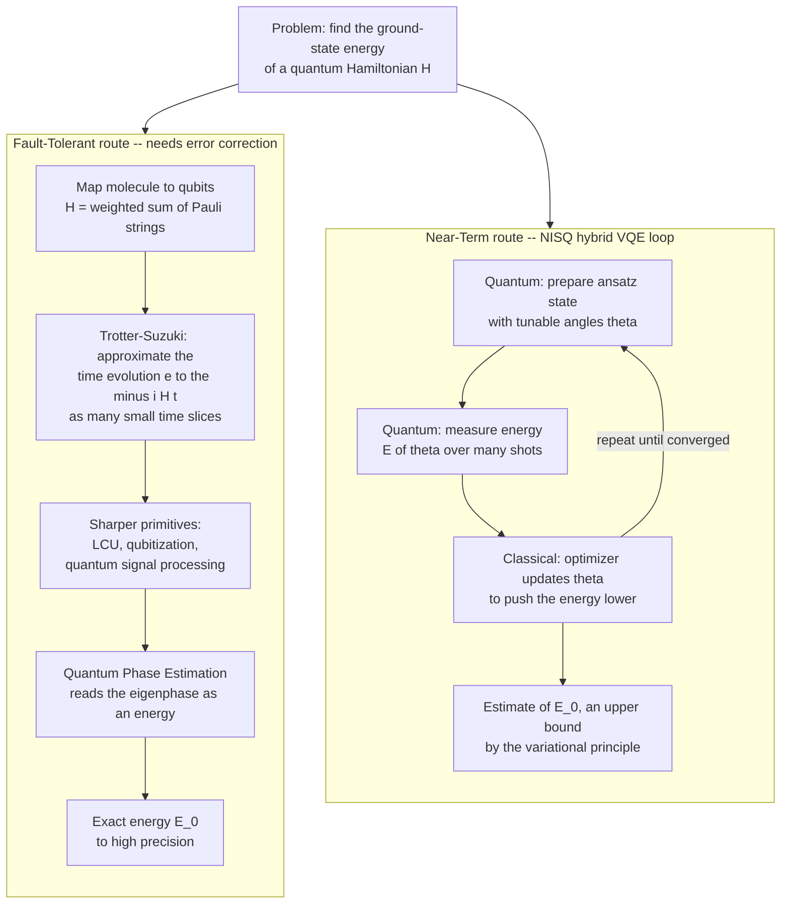

# ⚛️ Quantum Simulation and the Variational Quantum Eigensolver

> [!abstract] TL;DR
> **Quantum simulation** is the original reason quantum computers were proposed (Feynman, 1981) and remains their **most defensible near-term application**: because describing `n` interacting quantum particles classically means tracking `2^n` complex amplitudes — an exponentially growing table that overwhelms any classical machine — a quantum computer that *is itself* a controllable quantum system can represent that state **natively** and evolve it under the same physics. Two routes exist. The **fault-tolerant** route directly simulates dynamics: approximate the time-evolution operator `e^{-iHt}` by chopping the Hamiltonian into local pieces (**Trotter-Suzuki**, or the sharper **LCU / qubitization / quantum signal processing**) and read off energies with **quantum phase estimation** — but this needs error-corrected qubits we do not yet have. The **near-term** route is the **Variational Quantum Eigensolver (VQE)**: prepare a tunable trial state (an **ansatz**) on today's noisy hardware, *measure* its energy, and let a **classical optimizer** adjust the parameters downward until it converges to the ground-state energy — guaranteed to sit above the true minimum by the **variational principle**. The payoff is **quantum chemistry and materials**: catalysts, nitrogen fixation, battery electrolytes, high-`T_c` superconductors. The obstacles are equally real — **ansatz design**, **barren plateaus**, **measurement (shot) overhead**, and **NISQ noise** — and honest experts agree that *useful* chemistry still awaits error correction and more qubits.

---

## Intuition

**Analogy — the wind tunnel for quantum matter.** To learn how air flows over a new wing you have two options. You can grind through the fluid-dynamics equations on a computer — accurate, but the cost explodes as the flow gets turbulent. Or you can build a scale model, put it in a **wind tunnel**, and let *real air* do the computing: nature solves its own equations for free, in real time, exactly. A quantum computer is a **wind tunnel for quantum systems**. Instead of asking a classical machine to bookkeep the astronomically large wavefunction of a molecule, you build a small, *controllable* quantum system that obeys the **same** [[Schrodinger_Equation|Schrödinger equation]] as the molecule, let it evolve, and measure the answer. This is Feynman's 1981 insight in one line: **to simulate nature, use a computer that runs on nature's own rules.**

Why is this necessary and not merely elegant? A single spin-1/2 particle needs 2 numbers to describe. Two need 4, three need 8, and `n` need `2^n`. At `n = 50` that is a quadrillion complex amplitudes — a table no classical supercomputer can even *store*, let alone evolve. The quantum state of `n` qubits lives in exactly that `2^n`-dimensional space **for free**, because the hardware *is* a quantum system. That is why the **likely first killer app** of quantum computing is not codebreaking but **modelling molecules and materials** — the exact systems whose exponential wavefunctions choke classical machines (see [[Many_Body_Quantum_Systems]]). We compute nature *with* nature.

---

## How It Works

### Core Mechanics

The central task of most quantum simulation is to find the **ground-state energy** of a system — the lowest eigenvalue `E_0` of its Hamiltonian `H` — because that number governs chemistry: bond strengths, reaction barriers, and whether a material superconducts. There are two families of methods.

**1. The fault-tolerant route — simulate the dynamics, then extract energies.**
- **Represent the Hamiltonian.** A molecule's electronic Hamiltonian is mapped to qubits via a **fermion-to-qubit encoding** (Jordan-Wigner or Bravyi-Kitaev), producing `H` as a weighted sum of **Pauli strings** (tensor products of `I, X, Y, Z`).
- **Simulate time evolution.** The evolution operator is `e^{-iHt}`. Because the local pieces `H_k` of `H` generally do not commute, you cannot exponentiate them independently — so the **Trotter-Suzuki decomposition** approximates `e^{-iHt}` by applying each `e^{-iH_k \Delta t}` in many tiny time slices `\Delta t`, with error shrinking as the slices get thinner (Lloyd, 1996). More advanced primitives — **Linear Combination of Unitaries (LCU)**, **qubitization**, and **Quantum Signal Processing** — achieve provably optimal scaling in evolution time and precision.
- **Read the energy.** Feeding this controlled time evolution into **Quantum Phase Estimation** turns the *eigenphase* accumulated by an eigenstate into a directly measurable binary number — the energy `E_0` to high precision. This is the rigorous, scalable method, but phase estimation demands deep coherent circuits and therefore **error-corrected qubits**.

**2. The near-term route — the Variational Quantum Eigensolver (VQE).** VQE trades circuit depth for a **quantum-classical feedback loop**, making it friendly to today's noisy hardware:
- **Ansatz.** Prepare a parameterized trial state `|ψ(θ)⟩` with a shallow circuit of tunable rotation angles `θ` (a *hardware-efficient* ansatz, or a chemistry-motivated one like **UCCSD**).
- **Measure the energy.** Estimate the expectation `E(θ) = ⟨ψ(θ)|H|ψ(θ)⟩` by measuring each Pauli term of `H` over **many repeated shots** and summing the weighted averages.
- **Optimize classically.** A **classical optimizer** (gradient descent, SPSA, COBYLA) proposes new angles that lower `E(θ)`. Loop until convergence.
- **Guaranteed floor — the variational principle.** For *any* trial state, `⟨ψ|H|ψ⟩ \geq E_0`. The measured energy is therefore always an **upper bound** on the true ground state, so *minimizing* it can only ever approach `E_0` from above — you can never accidentally undershoot the real answer.

**3. Analog vs digital.** The above is **digital** (gate-based, universal) simulation. **Analog** quantum simulation instead engineers a physical system — ultracold atoms in optical lattices, trapped ions, superconducting arrays — whose *native* Hamiltonian mimics the target (e.g. a Hubbard model), and simply lets it evolve. Analog machines are less flexible and harder to error-correct but are already probing many-body physics beyond classical reach.

**4. The optimization cousin — QAOA.** The Quantum Approximate Optimization Algorithm applies the identical variational template to *combinatorial* problems: encode the cost function as a Hamiltonian whose ground state is the optimal solution, then variationally drive toward it. VQE and QAOA are the same NISQ idea aimed at chemistry versus optimization respectively.

### Two Routes to the Ground-State Energy



*Left branch: deep coherent circuits give exact energies but require fault tolerance. Right branch: a shallow ansatz plus a classical optimizer trades depth for iterations, running on today's noisy devices.*

---

## Key Concepts

**Secondary (the big picture)**
- **Why classical simulation fails.** Describing `n` quantum particles needs `2^n` numbers; that table doubles with every particle and quickly outgrows any classical computer.
- **Using nature to compute nature.** A quantum computer is itself a quantum system, so it holds a `2^n`-amplitude state for free and can imitate the molecule you want to study — the wind-tunnel idea.
- **The goal is the ground state.** The single most useful number is the *lowest energy* a system can have; it decides bond strengths, reaction rates, and material properties.
- **Two ways to get it.** Either simulate the physics directly (needs future error-corrected machines) or use the **VQE** guess-measure-improve loop (runs on today's noisy hardware).

**Undergraduate (the machinery)**
- **Hamiltonian as Pauli strings.** After a fermion-to-qubit mapping (Jordan-Wigner, Bravyi-Kitaev), `H` is a weighted sum of tensor products of `I, X, Y, Z`; its lowest eigenvalue is the ground-state energy.
- **Time evolution and Trotterization.** `e^{-iHt}` is approximated by interleaving the exponentials of `H`'s non-commuting local terms in small steps; error decreases with step size (Lloyd, 1996).
- **Quantum phase estimation.** Extracts an eigenvalue of a unitary as a measurable phase — the fault-tolerant energy read-out.
- **The variational principle.** For any normalized `|ψ⟩`, `⟨ψ|H|ψ⟩ \geq E_0`; VQE turns this inequality into an optimization whose minimum approaches `E_0` from above. Same principle underpins Hartree-Fock and DFT in [[Quantum_Chemistry_and_Atomic_Orbitals]].
- **Ansatz and expressibility.** The trial circuit must be *expressive* enough to contain (a good approximation of) the true ground state, yet *shallow* enough to run without drowning in noise — a fundamental tension.
- **Measurement / shot overhead.** Each expectation value is a statistical average; halving the error costs `4x` the shots, so estimating chemical-accuracy energies can demand millions of circuit repetitions.

**Graduate (the frontier)**
- **Advanced Hamiltonian simulation.** LCU, **qubitization** (block-encoding `H` in a larger unitary), and **Quantum Signal Processing** achieve near-optimal `O(t + \log(1/\epsilon))` query complexity, superseding Trotter for asymptotic regimes.
- **Barren plateaus.** For deep, unstructured hardware-efficient ansätze the cost-function gradient vanishes **exponentially** in qubit count, so the optimizer sees a flat landscape and cannot train (McClean et al., 2018). Structured ansätze, local cost functions, and clever initialization mitigate it.
- **Fermionic encodings and locality.** Jordan-Wigner produces non-local Pauli strings of length `O(n)`; Bravyi-Kitaev reduces this to `O(\log n)`, cutting gate cost.
- **Error mitigation vs error correction.** NISQ VQE leans on *mitigation* (zero-noise extrapolation, probabilistic error cancellation) rather than full *correction*; these reduce bias at exponential sampling cost and do not scale indefinitely.
- **Analog vs digital trade-off.** Analog simulators (cold atoms, ion crystals) reach larger, more coherent many-body regimes today but sacrifice universality and rigorous error control.
- **Resource reality.** Fault-tolerant estimates for industrially relevant catalysts (e.g. FeMoco / nitrogen fixation) run to millions of physical qubits and hours-to-days of runtime — the honest gap between demo and utility.

---

## Python Demo

The whole VQE loop on a tiny **2-qubit toy `H2`-inspired Hamiltonian** using only numpy and matplotlib: build `H` from Pauli tensor products, prepare a two-parameter entangling ansatz, compute the energy expectation `⟨ψ|H|ψ⟩`, and let a classical gradient-descent optimizer drive it down to the true ground-state energy (the lowest eigenvalue). The plot shows energy converging from above — exactly what the variational principle guarantees.

```python
# VQE on a tiny 2-qubit Hamiltonian, numpy + matplotlib only (no qiskit).
# We minimize the variational energy <psi(theta)|H|psi(theta)> and watch it
# converge to the true ground-state energy = smallest eigenvalue of H.
import numpy as np
import matplotlib.pyplot as plt

np.random.seed(7)

# ---- Pauli matrices (2x2 complex) ----
I2 = np.eye(2, dtype=complex)
X = np.array([[0, 1], [1, 0]], dtype=complex)
Z = np.array([[1, 0], [0, -1]], dtype=complex)

# ---- Toy H2-inspired Hamiltonian:  H = 0.5 * (Z0 Z1) + 0.5 * (X0 X1) ----
# Its ground state is the ENTANGLED singlet (|01> - |10>)/sqrt(2), energy = -1.
H = 0.5 * np.kron(Z, Z) + 0.5 * np.kron(X, X)

# Exact reference (classical diagonalization -- only feasible for tiny systems).
eigvals = np.linalg.eigvalsh(H)
E_ground = eigvals.min()
print("Exact eigenvalues     :", np.round(eigvals, 4))
print("True ground-state E_0 :", round(float(E_ground), 6))

# ---- Ansatz building blocks ----
def Ry(theta):                      # single-qubit y-rotation
    c, s = np.cos(theta / 2), np.sin(theta / 2)
    return np.array([[c, -s], [s, c]], dtype=complex)

P0 = np.array([[1, 0], [0, 0]], dtype=complex)   # |0><0|
P1 = np.array([[0, 0], [0, 1]], dtype=complex)   # |1><1|
CNOT = np.kron(P0, I2) + np.kron(P1, X)          # control qubit 0, target qubit 1
ket00 = np.array([1, 0, 0, 0], dtype=complex)    # start state |00>

def ansatz(params):
    """Hardware-efficient ansatz: Ry(t0) (x) Ry(t1), then CNOT to entangle.
    The CNOT is essential -- a product state alone cannot reach the singlet."""
    t0, t1 = params
    psi = np.kron(Ry(t0), Ry(t1)) @ ket00
    return CNOT @ psi

def energy(params):
    """Variational energy <psi|H|psi>. On real hardware this is ESTIMATED by
    measuring each Pauli term over many shots; here we compute it exactly."""
    psi = ansatz(params)
    return float(np.real(psi.conj() @ H @ psi))

# ---- Classical optimizer: gradient descent with finite-difference gradients ----
def grad(params, eps=1e-5):
    g = np.zeros_like(params)
    for i in range(len(params)):
        pp, pm = params.copy(), params.copy()
        pp[i] += eps
        pm[i] -= eps
        g[i] = (energy(pp) - energy(pm)) / (2 * eps)
    return g

def run_vqe(init, lr=0.3, steps=80):
    params = np.array(init, dtype=float)
    history = [energy(params)]
    for _ in range(steps):
        params = params - lr * grad(params)
        history.append(energy(params))
    return np.array(history)

# ---- Random restarts (mitigates local minima / barren plateaus) ----
best_hist = None
for _ in range(6):
    hist = run_vqe(np.random.uniform(-np.pi, np.pi, size=2))
    if best_hist is None or hist[-1] < best_hist[-1]:
        best_hist = hist

print("VQE estimate of E_0   :", round(float(best_hist[-1]), 6))
print("error vs exact        :", round(float(best_hist[-1] - E_ground), 6))

# ---- Plot: energy vs optimization iteration converging to the true minimum ----
plt.figure(figsize=(7, 4.5))
plt.plot(best_hist, "o-", ms=3, lw=1.6, color="#2563eb",
         label="VQE energy  <psi|H|psi>")
plt.axhline(E_ground, ls="--", color="#dc2626",
            label=f"true ground-state E_0 = {E_ground:.3f}")
plt.xlabel("optimization iteration")
plt.ylabel("energy (arb. units)")
plt.title("VQE: classical optimizer drives the ansatz energy down to the ground state")
plt.legend()
plt.tight_layout()
plt.savefig("vqe_convergence.png", dpi=130)
print("Saved convergence plot to vqe_convergence.png")

# Takeaways:
#   * the energy monotonically approaches E_0 = -1 FROM ABOVE -- never below --
#     because the variational principle forces <psi|H|psi> >= E_0 for any state;
#   * the ground state here is ENTANGLED (the singlet), so the CNOT layer is
#     mandatory: a product ansatz Ry (x) Ry alone cannot represent it;
#   * we cheated by diagonalizing H classically for reference; the whole point
#     of VQE is that for large H that diagonalization is impossible and only the
#     measure-and-optimize loop remains feasible.
```

Running it prints the exact eigenvalues `[-1, 0, 0, 1]`, so the true ground-state energy is `-1`. The VQE loop, starting from random angles and keeping the best of several restarts, converges to `≈ -1.000`, and the saved plot shows the blue energy curve sliding down to the red dashed line — approaching from above, exactly as the variational principle demands.

---

## Real-World Applications

> **Example — computing a molecule's ground-state energy on real hardware.** The **first VQE experiment** (Peruzzo et al., 2014) found the ground-state energy of the **He-H⁺** molecule on a photonic chip; two years later Google/IBM teams computed the full **dissociation curve of H₂** on superconducting qubits (O'Malley et al., 2016). In both, a shallow parameterized circuit prepared the trial state, the energy was estimated shot-by-shot, and a classical optimizer on a laptop closed the loop — the exact pattern in the demo above, just with a chemistry-derived Hamiltonian.

- **Quantum chemistry and catalysis.** The flagship promise is designing molecules *in silico*: modelling reaction intermediates for **nitrogen fixation** (the FeMoco cofactor, whose electronic structure defies classical methods), industrial catalysts, and drug candidates by computing binding and activation energies to **chemical accuracy**.
- **Battery and energy materials.** Ground-state and excited-state energies of electrolyte and cathode candidates guide the search for higher-capacity, safer batteries — a direct handshake with computational [[Quantum_Chemistry_and_Atomic_Orbitals|quantum chemistry]].
- **Correlated materials and superconductivity.** Simulating Hubbard-model physics targets **high-`T_c` superconductors** and other strongly correlated materials where classical approximations break down (see [[Superconductivity_and_BCS_Theory]] and [[Many_Body_Quantum_Systems]]).
- **Nuclear and high-energy physics.** Lattice gauge theories and nuclear binding energies are being reformulated for quantum and analog simulators, probing regimes inaccessible to classical Monte Carlo (sign problem).
- **Analog quantum simulators today.** Cold-atom and trapped-ion machines already emulate many-body dynamics (thermalization, phase transitions) at system sizes beyond exact classical simulation — quantum simulation's most mature present-day form.

---

## Common Pitfalls

- **"VQE is exact."** It is only as good as its **ansatz**. If the trial circuit cannot represent the true ground state, the optimizer converges to an energy *above* `E_0` and stops — a systematic bias no amount of shots removes. Expressibility, not shot count, sets the floor.
- **Ignoring barren plateaus.** Piling on layers to boost expressibility can make gradients vanish **exponentially** in qubit number, so the optimizer sees a flat landscape and never trains. Deeper is not automatically better; structure and initialization matter more.
- **Underestimating measurement cost.** Statistical error falls only as `1/\sqrt{shots}`, so reaching chemical accuracy can require **millions** of measurements per optimization step. Naive term-by-term measurement of a large Hamiltonian is often the true bottleneck, not gate depth.
- **Forgetting the ground state can be entangled.** Real molecular ground states are correlated; a product-state ansatz (no entangling gates) cannot reach them, as the singlet in the demo shows. Entangling layers are mandatory, not decorative.
- **Confusing Trotter error with hardware noise.** Fault-tolerant simulation has a *controllable* algorithmic error from finite Trotter steps; NISQ VQE additionally suffers *uncontrolled* decoherence and gate error. Shrinking the Trotter step does nothing about the second.
- **Overselling NISQ advantage.** VQE demos run, but no VQE result has yet beaten the best classical chemistry methods on a real problem. Useful, provable quantum advantage in chemistry is widely expected to require **error correction** and far more qubits — the honest assessment.
- **Treating quantum simulation as a magic solver.** It targets ground/dynamical properties of *quantum* Hamiltonians. It does not make arbitrary classical optimization or NP-hard problems easy (that is a separate, more skeptical story).

---

## Related Concepts

- [[Quantum_Computing_Overview]] — the parent overview that names quantum simulation of chemistry as the *likely first killer app*; this note is that claim, worked out in detail.
- [[Quantum_Gates_and_Circuits]] — the parameterized `Rx/Ry/Rz` rotations plus CNOT entanglers that build a VQE ansatz, and the reversible unitary structure Trotterization exploits.
- [[Schrodinger_Equation]] — the equation being simulated: unitary time evolution `e^{-iHt}` and the eigenvalue problem `Hψ = Eψ` whose lowest solution VQE hunts for.
- [[Many_Body_Quantum_Systems]] — why classical simulation is exponentially hard (`2^n` Hilbert space, second quantization) and how Hartree-Fock/DFT approximate it — the classical baseline quantum simulation aims to beat.
- [[Quantum_Chemistry_and_Atomic_Orbitals]] — the **variational principle**, Slater determinants, and molecular-orbital ground-state energies that VQE reproduces on quantum hardware; the chemistry payoff of this whole enterprise.
- [[Superconductivity_and_BCS_Theory]] — a headline materials-science target: correlated-electron physics and high-`T_c` superconductivity where classical methods struggle and quantum simulation is most promising.

---

## Review Questions

1. **(Secondary)** Your friend asks why anyone would build a fragile, expensive quantum computer just to study a molecule when we already have supercomputers. Using the wind-tunnel analogy and the phrase "`2^n` amplitudes," explain in two or three sentences why some molecules are simply out of reach for classical machines.
2. **(Undergraduate)** VQE minimizes `⟨ψ(θ)|H|ψ(θ)⟩` over the angles `θ`. Explain why this minimization can never return an energy *below* the true ground-state energy `E_0`, name the principle responsible, and describe what happens to the result if your chosen ansatz is not expressive enough to contain the true ground state.
3. **(Graduate)** You are asked to compute the ground-state energy of an industrially relevant catalyst. Compare the **fault-tolerant** route (Trotterization / qubitization plus phase estimation) against the **near-term VQE** route across at least three axes — circuit depth, sensitivity to noise, and provable accuracy — and explain the roles that **barren plateaus** and **measurement overhead** play in why today's VQE demonstrations have not yet achieved practical quantum advantage in chemistry.

---

## Sources

- Feynman, R. P. "Simulating Physics with Computers," *International Journal of Theoretical Physics* 21 (1982): 467–488 — the founding argument that quantum systems are best simulated by quantum computers. [DOI](https://doi.org/10.1007/BF02650179)
- Lloyd, S. "Universal Quantum Simulators," *Science* 273 (1996): 1073–1078 — the theorem that local Hamiltonian dynamics can be efficiently simulated by a quantum computer (Trotterization). [DOI](https://doi.org/10.1126/science.273.5278.1073)
- Peruzzo, A. et al. "A Variational Eigenvalue Solver on a Photonic Quantum Processor," *Nature Communications* 5 (2014): 4213 — the paper that introduced VQE and ran it on hardware. [arXiv:1304.3061](https://arxiv.org/abs/1304.3061)
- McClean, J. R. et al. "The Theory of Variational Hybrid Quantum-Classical Algorithms," *New Journal of Physics* 18 (2016): 023023 — the formal framework and variational-principle grounding of VQE. [arXiv:1509.04279](https://arxiv.org/abs/1509.04279)
- Cao, Y. et al. "Quantum Chemistry in the Age of Quantum Computing," *Chemical Reviews* 119 (2019): 10856–10915 — comprehensive review of Hamiltonian simulation, VQE, encodings, and the resource gap to useful chemistry. [arXiv:1812.09976](https://arxiv.org/abs/1812.09976)

---

#quantum-computing #quantum-simulation #vqe #quantum-chemistry #hamiltonian-simulation
