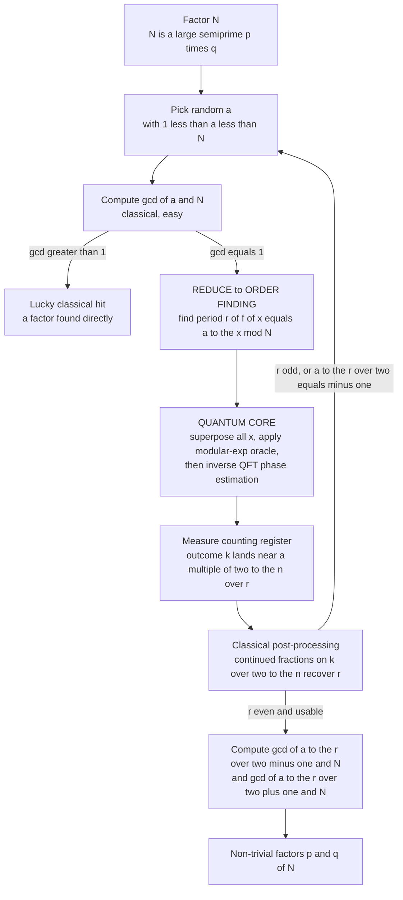

# 🔓 Shor's Factoring Algorithm

> [!abstract] TL;DR
> **Shor's algorithm** (Peter Shor, 1994) factors an `n`-bit integer in **polynomial time** — roughly `O(n³)` — where the best known classical method, the **general number field sieve**, is **sub-exponential**. It works by a two-part trick: a purely *classical* number-theoretic reduction turns **factoring `N`** into **finding the period `r`** of the function `f(x) = aˣ mod N`, and then a *quantum* subroutine — **phase estimation built on the quantum Fourier transform** — extracts that period **exponentially faster** than any classical machine can. Once `r` is known, two greatest-common-divisor computations `gcd(a^{r/2} ± 1, N)` reveal the factors. Because **RSA**, **Diffie–Hellman**, and **elliptic-curve cryptography** rest entirely on factoring/discrete-log being hard, a large fault-tolerant quantum computer running Shor would **break essentially all deployed public-key cryptography** — the reason **post-quantum cryptography** exists and why "harvest-now, decrypt-later" is a live threat. The catch: factoring a cryptographically relevant 2048-bit modulus needs **millions of physical qubits** with error correction, far beyond today's hardware. Crucially, factoring sits in **BQP** and in `NP ∩ co-NP` but is **not** known to be NP-complete — so Shor's success does **not** mean quantum computers crack NP-complete problems.

---

## Intuition

**Analogy — finding the length of a repeating pattern instead of searching for a needle.** Suppose I hand you a colossal number and ask for its two prime factors. Searching for a factor directly is like checking an astronomically long list of suspects one by one — hopeless for a 2048-bit number. Shor's insight is to **stop searching for the factor and start listening for a rhythm**. Take any number `a` and look at the sequence `a¹, a², a³, …` but only keep the *remainders* after dividing by `N` (clock arithmetic). That sequence **always eventually repeats**, cycling with some period `r` — like a song's chorus coming back around. Here is the magic: knowing *how long the cycle is* is almost enough to crack `N` wide open, because a repeating cycle of even length lets you write `N` as a product of two pieces you can pull apart with a simple `gcd`.

The problem is that finding the period of that sequence classically is just as hard as factoring — you would have to walk the whole cycle. But **finding the period of a repeating signal is exactly what a Fourier transform is built to do**: shine the right transform on the pattern and its hidden frequency lights up as a sharp peak. A quantum computer can evaluate `aˣ mod N` for *all* exponents `x` **in superposition at once**, then run a **quantum Fourier transform** over that whole superposition so that interference concentrates the amplitude onto multiples of `2ⁿ / r`. Measure, read off a peak, and continued fractions hand you `r`. The exponential state space plus interference is what no classical computer can match — it turns a needle-in-a-haystack search into a single act of *hearing the beat*.

---

## How It Works

### Core Mechanics

**1. The stakes — why factoring is the load-bearing wall.** Multiplying two large primes is trivial; recovering them from the product is believed **classically intractable**. The best classical factoring algorithm, the **general number field sieve (GNFS)**, runs in time roughly `exp( c · (ln N)^{1/3} (ln ln N)^{2/3} )` — **sub-exponential**, but still hopeless at 2048 bits. **RSA** encrypts using the modulus `N = p·q` and trusts that no one can find `p, q`; **Diffie–Hellman** and **ECC** trust the sibling **discrete-logarithm** problem (see [[Asymmetric_Cryptography_and_PKI]]). Shor breaks *all* of them.

**2. The classical reduction — factoring becomes ORDER FINDING.** This step is pure number theory and uses **no quantum mechanics** (see [[Modular_Arithmetic]]).
   - Pick a random `a` with `1 < a < N`. Compute `gcd(a, N)`. If it happens to exceed `1`, you already found a factor (lucky, but astronomically unlikely for large `N`).
   - Otherwise `a` is coprime to `N`. Define the **order** (period) `r` as the smallest positive integer with `aʳ ≡ 1 (mod N)`. Equivalently `r` is the period of `f(x) = aˣ mod N`.
   - If `r` is **even** and `a^{r/2} ≢ −1 (mod N)`, then `a^{r/2} − 1` and `a^{r/2} + 1` share a non-trivial factor with `N`, because `(a^{r/2} − 1)(a^{r/2} + 1) = aʳ − 1 ≡ 0 (mod N)`. So `gcd(a^{r/2} − 1, N)` and `gcd(a^{r/2} + 1, N)` are the factors.
   - A random `a` yields a *usable* `r` with probability at least `1/2`, so a handful of retries succeeds with overwhelming probability.

   The entire difficulty has now been shifted onto one question: **what is the period `r`?** Classically that is as hard as factoring. Quantumly it is easy.

**3. The quantum core — period finding via phase estimation and the QFT.** Use two registers: a **counting register** of `n` qubits (dimension `Q = 2ⁿ`, chosen with `N² ≤ Q < 2N²` so the period is resolvable) and a **work register** holding values mod `N`. This is a textbook application of **quantum phase estimation** (see [[Quantum_Fourier_Transform_and_Phase_Estimation]]).
   - **Superposition:** Hadamard the counting register into a uniform superposition over all `x ∈ {0, …, Q−1}`.
   - **Modular exponentiation in superposition:** apply the reversible oracle `|x⟩|0⟩ → |x⟩|aˣ mod N⟩`. This is the heavy classical sub-circuit (repeated modular squaring built from Toffoli-style reversible arithmetic, see [[Quantum_Gates_and_Circuits]]) and dominates the qubit and gate cost.
   - **Entanglement forces periodicity:** the state is now `(1/√Q) Σ_x |x⟩|aˣ mod N⟩`. Because `f` repeats with period `r`, every fixed work-value `y` is tied to an **arithmetic progression** of `x`-values spaced exactly `r` apart.
   - **Inverse QFT:** apply the **quantum Fourier transform** to the counting register. The QFT of a comb spaced by `r` is a comb spaced by `Q/r`: amplitude piles up (constructive interference) at outcomes `k ≈ c · Q/r` and cancels (destructive interference) everywhere else.
   - **Measure:** you sample some `k` near a multiple of `Q/r`. One measurement gives one peak.

**4. Classical post-processing — continued fractions then gcd.** Take the measured `k`. The ratio `k/Q ≈ c/r` for some unknown integer `c`. The **continued-fraction expansion** of `k/Q` recovers the fraction `c/r` in lowest terms whenever `Q ≥ N²`, handing you a candidate `r`. Verify `aʳ ≡ 1 (mod N)`; if `gcd(c, r) ≠ 1` the recovered denominator may be a *divisor* of `r`, so combine a couple of runs or take the least common multiple. Then apply the gcd formula from step 2 to read off the factors.

**5. Runtime.** Modular exponentiation is `O(n²)` to `O(n³)` gates, the QFT is `O(n²)` (or `O(n log n)` approximate), and only `O(1)` expected repetitions are needed. Total: **polynomial**, about `O(n³)` — an **exponential** improvement over GNFS.

**6. Complexity classification — a vital caveat.** Factoring is in **BQP** (efficiently quantum-solvable) and in `NP ∩ co-NP` (its answer is efficiently *checkable* both ways), but it is **not known to be NP-complete** and is widely believed **not** to be. Therefore Shor's breakthrough is **narrow**: it exploits the *hidden periodic structure* of factoring. It does **not** imply `NP ⊆ BQP`, and quantum computers are **not** believed to solve NP-complete problems efficiently (see [[Quantum_Computation_and_BQP]]).

**7. Discrete log and the general pattern.** The same period/phase-estimation machinery solves the **discrete-logarithm** problem (breaking Diffie–Hellman and ECC) and generalizes to the **hidden subgroup problem** over abelian groups — the unifying template behind nearly every known exponential quantum speedup (see [[Quantum_Algorithms_and_the_Oracle_Model]]).

### Flow / Architecture



---

## Key Concepts

**Secondary (the picture, no linear algebra):**
- **Factoring is hard, checking is easy.** Multiplying two primes is instant; splitting the product back apart is what security relies on.
- **The rhythm trick.** Shor stops hunting for a factor and instead finds the *period* of a repeating remainder pattern `a¹, a², a³, … mod N`; that period almost gives away the factors.
- **Fourier transform finds periods.** A quantum computer builds the whole pattern at once and uses a quantum Fourier transform to make its hidden frequency show up as a sharp peak.
- **Reality check.** This would break the locks securing internet traffic — *if* a big enough error-corrected quantum computer existed, which it does not yet.

**Undergraduate (the machinery):**
- **Order / period `r`.** The smallest `r` with `aʳ ≡ 1 (mod N)`; the object the whole algorithm computes.
- **The reduction identity.** `aʳ − 1 = (a^{r/2} − 1)(a^{r/2} + 1) ≡ 0 (mod N)` gives factors via `gcd` when `r` is even and `a^{r/2} ≢ −1`.
- **Superposition + modular-exp oracle.** `(1/√Q) Σ_x |x⟩|aˣ mod N⟩` evaluates `f` at all exponents simultaneously.
- **Quantum Fourier transform.** Turns a period-`r` comb into a comb of peaks spaced `Q/r`; interference does the work, measurement samples a peak.
- **Continued fractions.** Classical routine that turns a measured `k/Q ≈ c/r` back into `r`.
- **Runtime `O(n³)` vs sub-exponential GNFS.** The exponential separation.

**Graduate (the frontier):**
- **Quantum phase estimation.** Order finding is a special case of estimating the eigenphase `e^{2πi s/r}` of the modular-multiplication unitary `U_a : |y⟩ → |ay mod N⟩`; the QFT is the eigenvalue-reading engine.
- **Hidden subgroup problem (HSP).** Factoring, discrete log, and Deutsch–Jozsa are all abelian HSP instances — the structural reason a single technique yields them all.
- **BQP and `NP ∩ co-NP`.** Factoring's location in the complexity zoo, and why Shor is *not* evidence that `NP ⊆ BQP`.
- **Resource estimation and fault tolerance.** Surface-code overhead, `T`-count and magic-state distillation, and logical-vs-physical qubit blow-up set the real hardware bar (millions of physical qubits for RSA-2048).
- **Ekerå–Håstad and variants.** Modern optimizations reduce qubit/exponent requirements for RSA and discrete-log, sharpening threat timelines.

---

## Python Demo

```python
# Shor's algorithm end-to-end on a small semiprime, using numpy/matplotlib only
# (no qiskit, no sympy). We do the CLASSICAL reduction (pick a, gcd), then a
# faithful STATE-VECTOR simulation of the quantum period-finding step: build the
# modular-exp oracle f(x)=a^x mod N over a counting register of size Q=2^n, apply
# the (inverse) QFT, and compute the exact measurement distribution over outcomes
# k. Peaks appear at multiples of Q/r. We sample "measurements", recover r by
# continued fractions, and extract the factors via gcd(a^(r/2) +/- 1, N).

import numpy as np
import matplotlib.pyplot as plt


def gcd(x, y):                         # Euclid's algorithm (no imports needed)
    while y:
        x, y = y, x % y
    return x


def modexp_sequence(a, N, Q):
    """f(x) = a^x mod N for x = 0..Q-1 -- the reversible oracle, precomputed."""
    seq = np.empty(Q, dtype=np.int64)
    val = 1
    for x in range(Q):
        seq[x] = val
        val = (val * a) % N
    return seq


def qft_measurement_distribution(fx, Q):
    """Exact probability of measuring counting-register outcome k AFTER the QFT.

    Joint state (1/sqrt(Q)) * sum_x |x>|f(x)>.  Summing over the work-register
    value y, the QFT gives P(k) = sum_y | (1/Q) sum_{x: f(x)=y} e^{-2πi x k/Q} |^2.
    """
    x = np.arange(Q)
    k = np.arange(Q)
    probs = np.zeros(Q)
    for y in np.unique(fx):                       # group x by the value a^x mod N
        idx = x[fx == y]                          # x's sharing this work value
        # amplitude(k) = (1/Q) * sum over those x of exp(-2πi x k / Q)
        amp = np.exp(-2j * np.pi * np.outer(idx, k) / Q).sum(axis=0) / Q
        probs += np.abs(amp) ** 2
    return probs / probs.sum()                    # normalize (already ~1)


def period_from_k(k, Q, N):
    """Continued-fraction expansion of k/Q -> best denominator r < N."""
    a, b = k, Q
    p_prev, p_cur = 1, 0
    q_prev, q_cur = 0, 1
    best_r = 1
    while b:
        c = a // b
        a, b = b, a % b
        p_prev, p_cur = p_cur, c * p_cur + p_prev
        q_prev, q_cur = q_cur, c * q_cur + q_prev
        if 0 < q_cur < N:
            best_r = q_cur
    return best_r


def shor(N, a, n_count=8, shots=64, seed=1):
    rng = np.random.default_rng(seed)

    # ---- Classical preprocessing ----
    g = gcd(a, N)
    if g > 1:                                     # lucky: a shares a factor with N
        return g, N // g, None, None, None

    Q = 2 ** n_count                              # counting-register dimension
    fx = modexp_sequence(a, N, Q)                 # modular-exp oracle f(x)=a^x mod N
    probs = qft_measurement_distribution(fx, Q)   # quantum period-finding output

    # ---- Simulate measurements, then classical continued-fraction + gcd ----
    samples = rng.choice(Q, size=shots, p=probs)
    for k in samples:
        if k == 0:
            continue                              # k=0 peak carries no period info
        r_guess = period_from_k(int(k), Q, N)
        # the recovered denominator can be a divisor of r; try small multiples
        for m in (1, 2, 3, 4, 5):
            r = r_guess * m
            if r % 2 == 0 and pow(a, r, N) == 1:  # true even period?
                half = pow(a, r // 2, N)
                if half != N - 1:                 # avoid the -1 trivial case
                    f1, f2 = gcd(half - 1, N), gcd(half + 1, N)
                    if 1 < f1 < N:
                        return f1, N // f1, probs, Q, r
                    if 1 < f2 < N:
                        return f2, N // f2, probs, Q, r
    return None, None, probs, Q, None


# ---- Run it: factor N = 15 with base a = 7 (true period r = 4) ----
N, a, n_count = 15, 7, 8
p, q, probs, Q, r = shor(N, a, n_count=n_count)
print(f"Factoring N = {N} with base a = {a}")
print(f"Recovered period r = {r}  (check: {a}^{r} mod {N} = {pow(a, r, N)})")
print(f"a^(r/2) mod N = {pow(a, r // 2, N)}")
print(f"FACTORS:  {N} = {p} x {q}   (verify: {p * q == N})")

# ---- Plot the period-finding measurement distribution ----
k_axis = np.arange(Q)
plt.figure(figsize=(9, 4))
plt.bar(k_axis, probs, width=1.0, color="#2563eb")   # P(k) over all outcomes
for c in range(r):                                    # expected peaks at k = c * Q/r
    plt.axvline(c * Q / r, color="#dc2626", ls="--", lw=1, alpha=0.7)
plt.title(f"Shor period-finding: peaks at multiples of Q/r = {Q}/{r} = {Q // r}")
plt.xlabel("counting-register measurement outcome  k")
plt.ylabel("probability  P(k)")
plt.tight_layout()
plt.savefig("shor_period_finding.png", dpi=130)
print("\nSaved measurement-distribution plot to shor_period_finding.png")

# Expected output:
#   Recovered period r = 4  (7^4 mod 15 = 1)
#   a^(r/2) mod N = 4   ->  gcd(3,15)=3, gcd(5,15)=5
#   FACTORS: 15 = 3 x 5
# The plot shows four sharp peaks at k = 0, 64, 128, 192 (spacing Q/r = 64),
# each with probability ~0.25 -- the Fourier signature of a period-4 signal.
```

The run prints `15 = 3 × 5`. The counting register (dimension `Q = 256`) produces four sharp peaks at `k = 0, 64, 128, 192`, i.e. multiples of `Q/r = 256/4 = 64`. Continued fractions turn a peak such as `k = 64` into `64/256 = 1/4`, revealing `r = 4`; then `a^{r/2} = 7² = 4 (mod 15)` gives `gcd(3, 15) = 3` and `gcd(5, 15) = 5`. Change `N, a` to `21, 2` (period `r = 6`) to watch the same machinery split `21 = 3 × 7`. Here `r` divides `Q` so the peaks are perfectly sharp; for a general `N` with `r ∤ Q` the peaks *broaden* around `c·Q/r`, which is exactly why the continued-fraction step is essential rather than optional.

---

## Real-World Applications

> **Example — the "harvest now, decrypt later" threat driving NIST's post-quantum standards.** Nearly all TLS/HTTPS, SSH, VPN, code-signing, and cryptocurrency signatures rely on **RSA** or **ECC**, whose security is *exactly* the factoring/discrete-log hardness Shor destroys. No machine today can run Shor at cryptographic scale, yet adversaries **record encrypted traffic now** to decrypt it once a cryptographically relevant quantum computer (CRQC) exists. That non-hypothetical risk pushed **NIST to standardize post-quantum algorithms in 2024** — CRYSTALS-Kyber (FIPS 203, key exchange), CRYSTALS-Dilithium (FIPS 204) and SPHINCS+ (FIPS 205, signatures) — built on lattice and hash problems Shor does *not* break. See [[Post_Quantum_Cryptography]].

- **The public-key apocalypse scenario.** A single large fault-tolerant machine running Shor would retroactively break every RSA/ECC key ever used, forcing migration of the entire internet's key infrastructure ([[Asymmetric_Cryptography_and_PKI]]).
- **Blockchain and long-lived signatures.** Wallets and on-chain data with exposed public keys are especially exposed, motivating quantum-resistant chains ([[Post_Quantum_Cryptography_Blockchain]]).
- **Hardware resource benchmarking.** "When will RSA-2048 fall?" is quoted in **logical qubits, `T`-count, and code distance**; Gidney & Ekerå's 2021 estimate — ~20 million *noisy* physical qubits for an ~8-hour run — is the canonical yardstick for how far current hardware still is.
- **Small physical demonstrations.** Labs have factored tiny numbers (15, 21, 35) with a few qubits, but these are proofs of principle, often with shortcuts, not scalable attacks.

---

## Common Pitfalls

- **"Shor tries all divisors in parallel."** It does *not* search for divisors at all. It finds the **period** of `aˣ mod N` by **interference**, and a factor falls out of a `gcd`. The exponential state space is real, but the speedup is the QFT concentrating amplitude on period peaks, not brute parallelism.
- **Assuming quantum computers therefore crack NP-complete problems.** Factoring is **not** NP-complete (it is in `NP ∩ co-NP`). Shor exploits *hidden periodic structure* that generic NP-complete problems lack; believing "Shor factors, so quantum solves everything hard" is a serious and common error ([[Quantum_Computation_and_BQP]]).
- **Ignoring the classical half.** Roughly *all* of the number theory — the reduction, continued fractions, and gcd — is classical. The quantum computer does one job: period finding. Skipping the `r`-even / `a^{r/2} ≠ −1` conditions produces only the trivial factorization `1 × N`.
- **Under-sizing the counting register.** If `Q < N²`, continued fractions cannot uniquely resolve `c/r` and period recovery fails. `Q ≈ N²` is not a nicety; it is a correctness requirement.
- **Confusing peak location with the period directly.** A measured peak `k` gives `c/r`, not `r`. If `gcd(c, r) > 1` the denominator you recover is a *divisor* of `r`; you must verify `aʳ ≡ 1` and possibly combine runs (as the demo's small-multiple loop does).
- **Overstating the near-term threat — or dismissing it.** Cryptographically relevant Shor needs *millions* of physical qubits with error correction, absent today ([[Quantum_Gates_and_Circuits]]). But "not yet" is not "never," and harvest-now-decrypt-later makes migration urgent for long-lived secrets.
- **Treating small-number demos as scalable.** Many "we factored 15/21" demonstrations pre-bake knowledge of the answer or use compiled circuits; they validate the principle, not an attack path.

---

## Related Concepts

- [[Quantum_Fourier_Transform_and_Phase_Estimation]] — the quantum engine at Shor's heart: the QFT reveals the period and phase estimation reads the eigenphase `e^{2πi s/r}`.
- [[Quantum_Algorithms_and_the_Oracle_Model]] — the oracle framing and the hidden-subgroup problem that unifies Shor, discrete log, and Deutsch–Jozsa.
- [[Grovers_Search_Algorithm]] — the contrast case: only a *quadratic* speedup for unstructured search, versus Shor's *exponential* speedup on structured period-finding.
- [[Quantum_Computation_and_BQP]] — the complexity home of Shor: factoring is in **BQP** and `NP ∩ co-NP` but not known NP-complete, so the speedup is structural, not universal.
- [[Quantum_Gates_and_Circuits]] — the unitary circuit model; the modular-exponentiation oracle and QFT are built from these gates, and gate/`T`-counts set the fault-tolerant cost.
- [[Modular_Arithmetic]] — the number theory the reduction lives in: orders, Euler's/Fermat's theorems, and why `aʳ ≡ 1 (mod N)` factors `N`.
- [[Divisibility_and_Primes]] — gcd, primes, and semiprimes `N = p·q` that RSA and Shor both revolve around.
- [[Asymmetric_Cryptography_and_PKI]] — RSA and ECC, whose factoring/discrete-log foundations Shor demolishes.
- [[Post_Quantum_Cryptography]] — the defensive response: lattice- and hash-based schemes (Kyber, Dilithium, SPHINCS+) immune to Shor.
- [[Post_Quantum_Cryptography_Blockchain]] — the same threat and migration in the blockchain/wallet setting.
- [[Complexity_Cryptography_and_Average_Case_Hardness]] — why cryptography rests on *believed* average-case hardness, and how a quantum break rewrites those assumptions.
- [[Quantum_Computing_Overview]] — the parent map: superposition, interference, and where Shor sits among quantum algorithms.

---

## Review Questions

1. **(Secondary)** A friend says "a quantum computer breaks RSA by trying every possible factor of the key at the same time." Using the *rhythm/period* analogy, explain what the algorithm actually looks for and why finding it is enough to recover the factors.
2. **(Undergraduate)** You run the quantum step with counting register `Q = 2⁸ = 256` and measure `k = 192`. Show how continued fractions turn `k/Q` into a candidate period `r`, and then, for `N = 15` and `a = 7`, carry the arithmetic through to the two factors. What goes wrong if you had chosen `Q < N²`?
3. **(Graduate / trade-off)** Shor factors in polynomial time, yet it is *not* evidence that `NP ⊆ BQP`. Explain the complexity-theoretic distinction (factoring's membership in `NP ∩ co-NP`, the hidden-subgroup structure it exploits) and why an NP-complete problem such as SAT is not expected to yield to the same phase-estimation approach. Then discuss why, despite the polynomial asymptotics, RSA-2048 remains safe on 2026 hardware.

---

## Sources

- Shor, P. W. "Polynomial-Time Algorithms for Prime Factorization and Discrete Logarithms on a Quantum Computer." *SIAM Journal on Computing* 26(5), 1997. [arXiv:quant-ph/9508027](https://arxiv.org/abs/quant-ph/9508027)
- Nielsen, M. A. & Chuang, I. L. *Quantum Computation and Quantum Information*, 10th Anniversary ed., Cambridge University Press, 2010 — Chapter 5 (quantum Fourier transform, phase estimation, order finding, and factoring).
- Gidney, C. & Ekerå, M. "How to factor 2048 bit RSA integers in 8 hours using 20 million noisy qubits." *Quantum* 5, 433, 2021. [arXiv:1905.09749](https://arxiv.org/abs/1905.09749)
- National Institute of Standards and Technology. FIPS 203 (ML-KEM/Kyber), FIPS 204 (ML-DSA/Dilithium), FIPS 205 (SLH-DSA/SPHINCS+), 2024. [NIST PQC](https://csrc.nist.gov/projects/post-quantum-cryptography)
- Mermin, N. D. *Quantum Computer Science: An Introduction*, Cambridge University Press, 2007 — Chapter 3, a careful walkthrough of Shor's period-finding and the classical reduction.

---

#quantum-computing #shors-algorithm #factoring #rsa #period-finding
