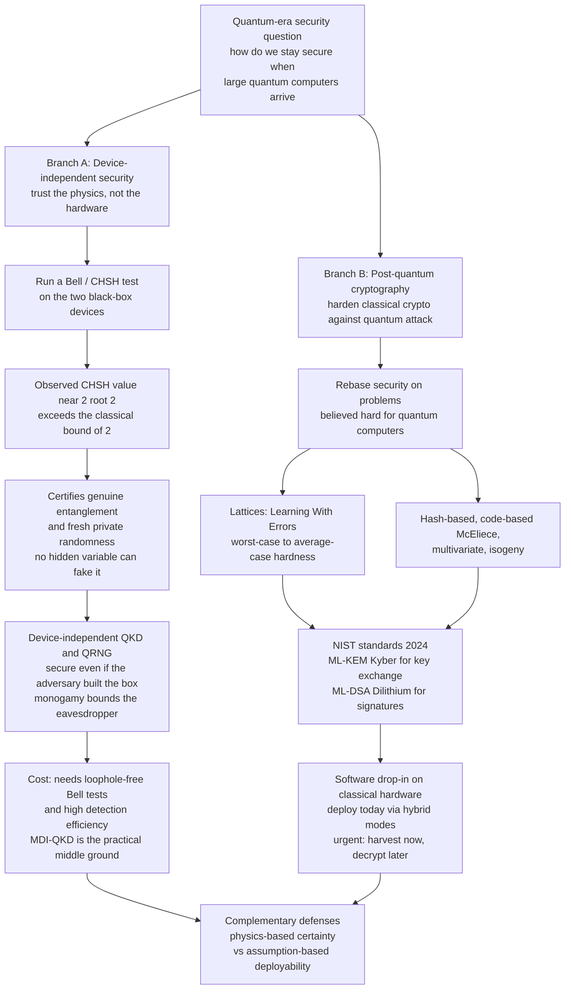

# 🛡️ Device-Independent and Post-Quantum Security

> [!abstract] TL;DR
> The quantum era poses one question with two complementary answers: **how do we stay secure when large quantum computers arrive?** **Device-independent (DI) security** is the *strongest* form of quantum cryptography — its security is certified by the observed **violation of a Bell inequality**, so it trusts *only the measurement statistics*, not the internals of the (possibly adversary-built) hardware. A genuine **CHSH** score of $2\sqrt2$ cannot be faked by any classical, pre-programmed, or hidden-variable device, so it certifies real entanglement and therefore **fresh, private randomness or key** — and the **monogamy of entanglement** bounds any eavesdropper's information. The catch is that DI protocols demand **loophole-free Bell violations** with high detection efficiency, so they are extremely hard to build; **measurement-device-independent (MDI) QKD** is the practical middle ground. The second answer, **post-quantum cryptography (PQC)**, keeps classical crypto but rebases it on math problems believed hard even for quantum computers — because **Shor's algorithm** breaks RSA and ECC. The leading family is **lattice-based** (Learning With Errors, with worst-case-to-average-case hardness); NIST standardized **ML-KEM / Kyber** for key exchange and **ML-DSA / Dilithium** for signatures in 2024. Symmetric crypto only faces **Grover's** quadratic speedup, so doubling key length (AES-256) suffices. QKD is physics-based but needs quantum hardware; PQC is a software drop-in resting on *unproven* hardness — they are complementary, and **"harvest now, decrypt later"** makes migration urgent today.

---

## Intuition

**Analogy — two ways to trust a vault built by a stranger.** Imagine you need a secure vault, but the only company that can build one is a firm you do not trust — it might have installed a hidden backdoor. You have two very different strategies.

**Strategy 1 (device-independent): trust the physics, not the hardware.** Instead of inspecting the vault's wiring, you run a *challenge test* whose passing score is physically impossible to fake with any hidden mechanism. If the vault passes, you know — from the score alone — that no backdoor exists, *even though you never opened the box*. In cryptography that challenge is a **Bell test**: a pair of black-box devices that scores $2\sqrt2$ on the **CHSH** game must genuinely share quantum entanglement, because no pre-programmed or classically-correlated box can exceed $2$. The score *certifies* the security. You trust the statistics, never the internals.

**Strategy 2 (post-quantum): keep your ordinary lock, but change it to one the new master key cannot open.** A quantum computer running **Shor's algorithm** is a master key that instantly picks today's RSA and elliptic-curve locks. So you swap every lock for a new design based on a puzzle — finding short vectors in a high-dimensional **lattice** — that *even the quantum master key* cannot solve efficiently. Same doors, same building, new locks: a software upgrade that runs on the classical computers you already own.

Both strategies answer the same question. The first is stronger but needs exotic quantum hardware; the second is deployable today but rests on a mathematical bet. Real-world quantum-era security uses both.

---

## How It Works

### Branch A — Device-independent security: certified by a Bell violation

1. **The trust problem.** Standard QKD (like BB84) proves security *assuming* the devices behave as modeled — single-photon sources, honest detectors. But real hardware has **side channels**: detector-blinding attacks, imperfect sources, and multi-photon leaks let an eavesdropper break "provably secure" systems in practice. DI security removes those assumptions.
2. **Treat the devices as black boxes.** Alice and Bob each hold an uncharacterized box. Each box takes a *setting* (which of two measurements to perform) and emits an outcome ($+1$ or $-1$). We assume nothing about what is inside — an adversary may have manufactured them.
3. **Run the CHSH game.** Over many entangled pairs, they randomly choose settings and record correlations $E(a,b)$, forming the **CHSH quantity** $S = E(a,b) - E(a,b') + E(a',b) + E(a',b')$.
4. **The certification logic.** *Any* local hidden-variable strategy — including a device pre-programmed with a script, or two boxes sharing a secret table — obeys $|S| \le 2$. Genuinely entangled quantum devices reach $|S| = 2\sqrt2 \approx 2.83$ (**Tsirelson's bound**). So observing $S > 2$ is a *physical certificate*: the boxes really do share fresh entanglement, and their outputs cannot have been predetermined or copied. This is exactly the [[Entanglement_and_Bell_States|CHSH]] logic, repurposed as a security check.
5. **From certificate to secret.** The **monogamy of entanglement** guarantees that if Alice and Bob's boxes are strongly entangled with *each other*, they cannot also be entangled with an eavesdropper's system — so Eve's information about the outcomes is provably bounded by how close $S$ is to $2\sqrt2$. The certified randomness is distilled (via privacy amplification) into a secret key (**DIQKD**) or into certified random numbers (**device-independent QRNG**).
6. **Why it is hard — loopholes.** The certificate is only valid if the Bell test is **loophole-free**: no *detection loophole* (lost/undetected events could let a classical strategy fake $S > 2$, so detection efficiency must exceed roughly two-thirds) and no *locality loophole* (the two boxes must be measured fast enough that no signal could coordinate them). Meeting both at cryptographic rates is extraordinarily demanding; the first experimental DIQKD demonstrations arrived only in 2022, over short distances.
7. **The practical compromise — MDI-QKD.** Measurement-device-independent QKD keeps trust in the *sources* but removes all trust in the *detectors* (historically the most attacked component) by routing both parties' signals into an untrusted middle relay that performs a Bell-state measurement. It closes every detector side channel and is deployable with today's technology, making it the pragmatic bridge between full DI and standard QKD.

### Branch B — Post-quantum cryptography: quantum-hard math

1. **The quantum threat.** Shor's algorithm factors integers and solves discrete logarithms in polynomial time, so it breaks **RSA, Diffie-Hellman, and elliptic-curve** cryptography — the entire public-key layer of the internet. Grover's algorithm only gives a *quadratic* speedup for brute-force search, so symmetric ciphers survive by doubling key length (AES-256 keeps 128-bit quantum security).
2. **Harvest now, decrypt later (HNDL).** An adversary can record encrypted traffic *today* and decrypt it *years later* once a cryptographically-relevant quantum computer exists. Any secret with a long shelf life (state records, health data, long-term keys) is already at risk, which is why migration cannot wait for the quantum computer to arrive.
3. **Rebase security on quantum-hard problems.** PQC replaces factoring and discrete log with problems that have *no known* efficient quantum algorithm:
   - **Lattice-based** (the leading family) — **Learning With Errors (LWE)** and its ring/module variants; solving noisy linear systems over a lattice. Its appeal is a **worst-case-to-average-case reduction**: breaking a random instance is as hard as the *worst case* of a lattice problem, a strong theoretical footing described in [[Complexity_Cryptography_and_Average_Case_Hardness]].
   - **Hash-based signatures** — security rests *only* on a hash function (SPHINCS+/SLH-DSA); very conservative, large signatures.
   - **Code-based** — the decades-old McEliece cryptosystem, based on decoding random linear codes; large keys but long-trusted.
   - **Multivariate** and **isogeny-based** — the latter (SIKE) was dramatically *broken* in 2022 by a classical attack, a reminder that "quantum-hard" is a moving target.
4. **NIST standardization.** After an eight-year competition, NIST published **ML-KEM (Kyber, FIPS 203)** for key encapsulation, **ML-DSA (Dilithium, FIPS 204)** and **SLH-DSA (SPHINCS+, FIPS 205)** for signatures in 2024, all covered in [[Post_Quantum_Cryptography]]. Deployments use **hybrid** modes (classical + PQC) so a break in either component still leaves the other standing.

### Flow — the two branches of quantum-era security



---

## Key Concepts

### Secondary (intuitive level)
- **Device-independent** means you trust the *test results*, not the machine. If two boxes pass a Bell test, you know they share real quantum entanglement even if a stranger built them.
- **Post-quantum cryptography** keeps ordinary software encryption but swaps the math so a future quantum computer cannot break it.
- The **quantum threat** is real but not yet here — the danger is **harvest now, decrypt later**: recording secrets today to crack tomorrow.
- Symmetric encryption (AES) survives quantum computers by using longer keys; public-key encryption (RSA) must be replaced entirely.

### Undergraduate (working level)
- **CHSH certification:** classical/hidden-variable bound $|S| \le 2$ vs quantum $|S| = 2\sqrt2$ (Tsirelson). $S > 2$ certifies entanglement and thus private randomness.
- **Monogamy of entanglement** bounds an eavesdropper: strong Alice-Bob entanglement leaves little for Eve, turning the Bell score into a security parameter.
- **Loopholes:** the *detection loophole* (efficiency threshold) and *locality loophole* (spacelike separation) must both be closed for a valid certificate.
- **MDI-QKD:** removes all trust in detectors via an untrusted central Bell-state measurement — the deployable compromise.
- **PQC families:** lattice (LWE), hash-based, code-based (McEliece), multivariate, isogeny; **Shor** breaks RSA/ECC, **Grover** only halves symmetric security.
- **NIST standards:** ML-KEM (Kyber), ML-DSA (Dilithium), SLH-DSA (SPHINCS+); hybrid deployment.

### Graduate (theoretical level)
- **DI security proofs** bound Eve's Holevo information as a function of the observed CHSH violation; security against **collective** and **coherent** attacks via entropy accumulation, giving a device-independent min-entropy rate.
- **Self-testing / rigidity:** a maximal CHSH violation *uniquely* pins down the state (a singlet) and measurements up to local isometry — the mathematical engine behind certification without characterization.
- **Learning With Errors:** $\mathbf{b} = A\mathbf{s} + \mathbf{e} \bmod q$ with small error $\mathbf{e}$; **Regev's worst-case-to-average-case reduction** ties average-case LWE to worst-case lattice problems (GapSVP, SIVP), and Ring/Module-LWE trade some structure for efficiency.
- **Grover's quadratic bound** is provably optimal for unstructured search (BBBV lower bound), so symmetric key-doubling is a *tight* mitigation, not a heuristic.
- **Impagliazzo's worlds** framing: PQC needs quantum-resistant one-way functions to exist; DI security instead derives from physical nonlocality, sidestepping unproven complexity assumptions but requiring quantum resources.
- **QKD vs PQC tradeoff:** information-theoretic (physics-based) security with a hardware/channel cost vs computational (assumption-based) security as a software drop-in; they compose in defense-in-depth.

---

## Python Demo

```python
# Device-independent certification via a CHSH Bell test (numpy + matplotlib only).
# The security check: honest ENTANGLED devices reach the quantum value S = 2*sqrt(2),
# which NO classical / pre-programmed / hidden-variable box can fake (capped at S = 2).
# Observing S > 2 therefore certifies genuine quantum behaviour -- and hence fresh,
# private randomness -- WITHOUT trusting the internal workings of the devices.
import numpy as np
import matplotlib.pyplot as plt

# ---------- 1. Honest quantum devices: a shared Bell state |Phi+> ----------
psi = np.array([1, 0, 0, 1], dtype=complex) / np.sqrt(2)   # (|00> + |11>)/sqrt(2)
Z = np.array([[1, 0], [0, -1]], dtype=complex)
X = np.array([[0, 1], [1, 0]], dtype=complex)

def M(theta):
    """Measurement observable in the X-Z plane; eigenvalues +-1."""
    return np.cos(theta) * Z + np.sin(theta) * X

def E_q(tA, tB):
    """Quantum correlation E(a,b) = <psi| M(tA) (x) M(tB) |psi>."""
    return np.real(psi.conj() @ np.kron(M(tA), M(tB)) @ psi)

# Optimal CHSH measurement angles for |Phi+>
a, ap = 0.0, np.pi / 2            # Alice's two settings
b, bp = np.pi / 4, 3 * np.pi / 4  # Bob's two settings
S_quantum = E_q(a, b) - E_q(a, bp) + E_q(ap, b) + E_q(ap, bp)
print(f"Quantum CHSH  S = {S_quantum:.4f}   (Tsirelson 2*sqrt2 = {2*np.sqrt(2):.4f})")

# ---------- 2. Classical devices: EVERY deterministic hidden-variable box ----------
# A LOCAL box outputs a FIXED +-1 for each of its two settings, with no knowledge of
# the other side's setting. Enumerate ALL such strategies (4 x 4 = 16) exhaustively.
# Probabilistic mixtures are convex combinations of these vertices, so they cannot
# exceed the vertex maximum -- the local bound is 2, period.
strategies = [(-1, -1), (-1, +1), (+1, -1), (+1, +1)]  # outputs for (setting_1, setting_2)

def S_classical(alice, bob):
    (Aa, Aap), (Bb, Bbp) = alice, bob
    return Aa*Bb - Aa*Bbp + Aap*Bb + Aap*Bbp            # deterministic products

classical_S = np.array([S_classical(al, bo) for al in strategies for bo in strategies])
print(f"Classical CHSH: max |S| = {np.abs(classical_S).max()}  "
      f"(local bound is 2 -> classical boxes can never certify)")

# ---------- 3. Sweep Bob's angle to trace the full quantum CHSH curve ----------
theta = np.linspace(0, np.pi / 2, 400)
S_curve = np.array([E_q(0.0, t) - E_q(0.0, t + np.pi/2)
                    + E_q(np.pi/2, t) + E_q(np.pi/2, t + np.pi/2) for t in theta])

# ---------- Plots ----------
fig, ax = plt.subplots(1, 2, figsize=(11, 4.4))

# (a) the certification gap: classical cloud vs the quantum star
ax[0].axhspan(-2, 2, color="#cbd5e1", alpha=0.6,
              label="classical / hackable region  |S| <= 2")
ax[0].scatter(range(len(classical_S)), classical_S, color="#334155", s=30,
              zorder=3, label="16 deterministic local boxes")
ax[0].axhline(2, ls="--", color="#dc2626", lw=1.5)
ax[0].axhline(-2, ls="--", color="#dc2626", lw=1.5)
ax[0].scatter([7.5], [S_quantum], color="#7c3aed", s=220, marker="*",
              zorder=4, label="honest quantum devices  S = 2 root 2")
ax[0].set_title("The certification gap")
ax[0].set_xlabel("classical strategy index")
ax[0].set_ylabel("CHSH value  S")
ax[0].set_ylim(-3.3, 3.3)
ax[0].legend(loc="lower center", fontsize=8)

# (b) quantum CHSH vs Bob's measurement angle -> the certified-secure band
ax[1].plot(theta, S_curve, color="#7c3aed", lw=2, label="quantum  S(theta)")
ax[1].axhline(2, ls="--", color="#dc2626", label="classical bound = 2")
ax[1].axhline(2*np.sqrt(2), ls="--", color="#059669", label="Tsirelson = 2 root 2")
ax[1].fill_between(theta, 2, S_curve, where=(S_curve > 2),
                   color="#a78bfa", alpha=0.5, label="certified-secure band  S > 2")
ax[1].set_title("A Bell violation certifies the devices")
ax[1].set_xlabel("Bob's measurement angle theta  [rad]")
ax[1].set_ylabel("CHSH value  S")
ax[1].legend(loc="lower center", fontsize=8)

plt.tight_layout()
plt.show()

# Expected output (deterministic, no random seed needed):
# Quantum CHSH  S = 2.8284   (Tsirelson 2*sqrt2 = 2.8284)
# Classical CHSH: max |S| = 2  (local bound is 2 -> classical boxes can never certify)
```

The two panels tell the whole story. **Left:** all 16 pre-programmed classical boxes fall inside the grey $|S| \le 2$ band — no hidden-variable strategy escapes it — while the honest entangled devices sit at the purple star, $S = 2\sqrt2$, *outside* the classical reach. That gap is the certificate: seeing $S > 2$ proves the boxes are genuinely quantum without ever inspecting their internals. **Right:** sweeping Bob's measurement angle traces the quantum CHSH curve; wherever it rises into the shaded band above $2$, the Bell violation certifies fresh, private randomness that an adversary cannot have predetermined.

---

## Real-World Applications

- **Device-independent QKD (DIQKD) milestones.** In 2022, three groups (Oxford/CQT-led trapped-ion and photonic experiments) demonstrated the first DIQKD, distributing key whose security rested on an observed loophole-free-style Bell violation rather than trusted hardware — a proof of concept for cryptography secured by physics alone.
- **Certified quantum random-number generation.** Bell-test-certified randomness (following Pironio et al.) is deployed in **randomness beacons** and high-assurance key generation, where the CHSH violation guarantees the numbers were not pre-seeded or backdoored — the strongest possible randomness guarantee.
- **MDI-QKD in metro networks.** Measurement-device-independent QKD has been field-tested over deployed fiber (multi-hundred-kilometer links and city networks in China and Europe), closing detector side channels that broke earlier commercial QKD systems.
- **PQC migration at internet scale.** Cloudflare, Google, Apple (iMessage PQ3), and Signal (PQXDH) have deployed **hybrid ML-KEM (Kyber)** key exchange in TLS and messaging since 2023 to defeat harvest-now-decrypt-later, per the NIST FIPS 203/204/205 standards.
- **Government mandates.** NSA's CNSA 2.0 and equivalent national roadmaps require PQC (ML-KEM, ML-DSA) for new systems around 2030, driving PKI, code-signing, and VPN migration now rather than after a quantum computer exists.

---

## Common Pitfalls

- **"Device-independent means we trust nothing at all."** Not quite — DI removes trust in the *internal workings* of the devices, but still assumes no information leaks out of the labs, that the settings are freely and randomly chosen, and that the measurements are properly space-like separated. Break those and the certificate is void.
- **Ignoring the detection loophole.** A Bell violation measured with low detector efficiency can be *faked* by a purely classical device that only "answers" on favorable rounds. Cryptographic DI security demands efficiencies above roughly two-thirds; a raw $S > 2$ on a lossy setup certifies nothing.
- **Confusing standard QKD with DI security.** BB84-style QKD is secure *only* under a hardware model, and real detector-blinding attacks have broken commercial units. DI (and MDI) protocols exist precisely to close those side channels — assuming otherwise gives a false sense of security.
- **"Post-quantum means quantum-based."** PQC is *classical* software running on ordinary computers; it uses no quantum hardware. QKD is the physics-based approach. Conflating the two leads to buying the wrong solution.
- **Waiting for a quantum computer to migrate.** Harvest-now-decrypt-later means long-lived secrets sent today are already exposed. PQC migration takes years across PKI, code signing, and at-rest data — it must start before the threat materializes.
- **Trusting PQC hardness as proven.** Lattice and code hardness are *conjectures*; SIKE (isogeny-based) was broken classically in 2022. This is why deployments use **hybrid** classical-plus-PQC modes and why physics-based QKD remains a complementary hedge.
- **Assuming symmetric crypto is doomed.** Grover gives only a quadratic speedup with a tight lower bound, so AES-256 and SHA-384 stay safe; the mistake is over-reacting on symmetric primitives while under-reacting on the truly broken public-key layer.

---

## Related Concepts

- [[Entanglement_and_Bell_States]] — the CHSH inequality, Tsirelson's bound $2\sqrt2$, and the monogamy of entanglement are the exact physics that make device-independent certification work.
- [[Post_Quantum_Cryptography]] — the Cybersecurity companion covering the NIST-standardized ML-KEM (Kyber), ML-DSA (Dilithium), and SLH-DSA (SPHINCS+) in deployment detail.
- [[Complexity_Cryptography_and_Average_Case_Hardness]] — Learning With Errors and the worst-case-to-average-case reduction that give lattice PQC its theoretical footing.
- [[Measurement_and_the_No_Cloning_Theorem]] — no-cloning and measurement disturbance underpin why any eavesdropping on a quantum channel is detectable, the basis of all QKD security.
- [[Quantum_Computing_Overview]] — the broader landscape of quantum algorithms (Shor, Grover) that create the threat these two branches respond to.

---

## Review Questions

**Tier 1 — Conceptual (explain to a peer):**
1. Using the "vault built by a stranger" analogy, explain the difference between device-independent security and post-quantum cryptography. Which one trusts the hardware, and which one trusts the math?
2. What does "harvest now, decrypt later" mean, and why does it make PQC migration urgent *before* any quantum computer is built?

**Tier 2 — Applied (reason / compute):**
3. A vendor advertises a QKD box that "measured a CHSH value of $2.4$." What further questions must you ask before believing this certifies security? Name at least two loopholes and the efficiency condition.
4. Explain why AES-256 remains quantum-safe while RSA-2048 does not. What is the difference between the speedups Grover and Shor provide, and how does that difference dictate the mitigation for each?

**Tier 3 — Theoretical (deep understanding):**
5. State the monogamy of entanglement and explain precisely how an observed CHSH violation bounds an eavesdropper's information in device-independent QKD. Why is a value close to $2\sqrt2$ better than a value just above $2$?
6. Compare the *nature* of the security guarantee in QKD versus PQC: information-theoretic/physics-based versus computational/assumption-based. Under what threat model and deployment constraints would you choose each, and why might a real system use both?

---

## Sources

- Acín, A., Brunner, N., Gisin, N., Massar, S., Pironio, S. & Scarani, V. (2007). *Device-Independent Security of Quantum Cryptography against Collective Attacks.* Physical Review Letters 98, 230501. — foundational DIQKD security proof.
- Pironio, S. et al. (2010). *Random numbers certified by Bell's theorem.* Nature 464, 1021. — device-independent certified randomness from a Bell violation.
- Nadlinger, D. P. et al. (2022). *Experimental quantum key distribution certified by Bell's theorem.* Nature 607, 682–686. — first experimental DIQKD.
- Lo, H.-K., Curty, M. & Qi, B. (2012). *Measurement-Device-Independent Quantum Key Distribution.* Physical Review Letters 108, 130503. — the MDI-QKD middle ground.
- Regev, O. (2009). *On lattices, learning with errors, random linear codes, and cryptography.* Journal of the ACM 56(6). — LWE and its worst-case-to-average-case hardness.
- NIST (2024). *FIPS 203 (ML-KEM), 204 (ML-DSA), 205 (SLH-DSA).* [csrc.nist.gov](https://csrc.nist.gov/publications/fips) — the standardized post-quantum algorithms.

---

#quantum-computing #device-independent #post-quantum-cryptography #bell-test #quantum-security
