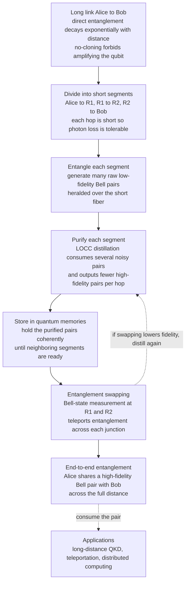

# 🕸️ Entanglement Distillation and Quantum Networks

> [!abstract] TL;DR
> Sharing a clean **Bell pair** between two distant nodes is the master resource behind quantum teleportation, entanglement-based key distribution, and distributed quantum computing — but entanglement is fragile. Over optical fiber, the probability that a photon survives falls **exponentially** with distance (roughly a factor of ten every $\sim$50 km), and the **no-cloning theorem** forbids the classical trick of amplifying or copying the signal along the way. Two ideas rescue long-distance entanglement. **Entanglement distillation (purification)** takes several *low*-fidelity noisy pairs and, using only **local operations and classical communication (LOCC)**, produces a *smaller* number of *higher*-fidelity pairs — trading quantity for quality, but only *above a fidelity threshold* ($F>\tfrac12$ for the standard protocol). **Quantum repeaters** chain this together: divide the link into short segments where loss is tolerable, generate and purify entanglement on each segment, hold the qubits in **quantum memories**, then use **entanglement swapping** (teleporting entanglement) to fuse the segments into one end-to-end pair. Together they convert an exponential distance penalty into a merely polynomial one and form the backbone of the emerging **quantum internet**.

---

## Intuition

**Analogy — a whispered message relayed across a noisy valley.** Imagine two friends, Alice and Bob, standing on hilltops far apart, trying to share a *perfectly synchronized secret* — think of it as two magic coins that always land the same way. If Alice simply shouts across the whole valley, her voice fades with distance and the wind garbles it; by the time it reaches Bob almost nothing coherent survives. Worse, she *cannot* just place loudspeakers along the way to boost the signal, because this particular message has a strange rule: **the moment anyone copies or amplifies it, it is destroyed** (this is the no-cloning theorem for quantum states).

Two fixes make it work. First, **distillation**: instead of relying on one faint garbled whisper, Alice and Bob compare *several* faint copies and, by talking on an ordinary phone line about what they each heard, boil them down into *one* whisper they trust — fewer copies, but far cleaner. Second, **relays**: they post trusted friends on the hilltops in between. Each neighbor pair shares a *good short-range* synchronized coin, and then — by a clever local measurement and a phone call — a middle friend "stitches" his link to Alice's onto his link to Bob's, so that **Alice and Bob end up perfectly synchronized even though they never exchanged a signal directly.** This stitching is *entanglement swapping*, and it is exactly how the old telegraph relayed a message hop by hop across a continent — except here each relay must *hold* its half of the coin steady in a **quantum memory** while the other hops catch up.

That is the whole subject: because you cannot amplify a qubit, you **purify** weak entanglement with local operations plus a phone call, and you **relay** it in short hops joined by swapping.

---

## How It Works

### Core mechanics

1. **Entanglement is the resource, and it is fragile.** A perfect shared **Bell state** such as $\lvert\Phi^+\rangle=\tfrac{1}{\sqrt2}(\lvert 00\rangle+\lvert 11\rangle)$ lets two nodes teleport an unknown qubit, run entanglement-based QKD, or link separate processors. Real channels never deliver perfect pairs: photons are **lost** and the surviving states **decohere**, so what arrives is a *mixed* state with only partial overlap — its **fidelity** $F=\langle\Phi^+\rvert\rho\lvert\Phi^+\rangle$ — to the ideal pair. A convenient noise model is the **Werner state**, $\rho_W(F)=F\lvert\Phi^+\rangle\langle\Phi^+\rvert+\tfrac{1-F}{3}\big(\lvert\Phi^-\rangle\langle\Phi^-\rvert+\lvert\Psi^+\rangle\langle\Psi^+\rvert+\lvert\Psi^-\rangle\langle\Psi^-\rvert\big)$, a Bell pair contaminated by depolarizing noise.

2. **Why distance is exponentially hard.** In standard telecom fiber the loss is about $0.2\ \text{dB/km}$, so the transmission probability is $p(L)=10^{-0.02L}=e^{-L/L_{\text{att}}}$ with attenuation length $L_{\text{att}}\approx22\ \text{km}$. Over $1000\ \text{km}$ that is $p\approx10^{-20}$ — even a $10\ \text{GHz}$ source would deliver roughly one photon every few thousand years. Decoherence in any quantum memory compounds the problem.

3. **Why you cannot just amplify.** A classical repeater samples a weak signal and re-emits a strong copy. Quantum information forbids this: the **no-cloning theorem** proves no device can copy an *unknown* qubit, and a phase-insensitive optical amplifier necessarily injects noise that wipes out the delicate entanglement. So the classical solution is off the table — you must *regenerate* entanglement without ever measuring or copying the unknown state directly.

4. **LOCC and entanglement as a non-increasable resource.** The rules of the game for two distant parties are **Local Operations and Classical Communication (LOCC)**: each side may apply any gate or measurement to *its own* qubits and they may talk over an ordinary (classical) channel, but no quantum channel is used during the manipulation. A cornerstone of entanglement theory is that **LOCC can never *increase* the total entanglement** of a shared state (any entanglement monotone is non-increasing under LOCC). This sounds like it should doom purification — and it is precisely why distillation must *sacrifice pairs*: it does not create entanglement, it *concentrates* the entanglement that is already spread thinly across many noisy pairs into fewer clean ones.

5. **Entanglement distillation / purification.** The archetypal recurrence protocol (**BBPSSW**, and its optimized cousin **DEJMPS**) works on *two* noisy pairs at a time:
   - Alice and Bob each hold one qubit of pair 1 (kept) and one qubit of pair 2 (sacrificed).
   - Each party applies a **bilateral CNOT** — a local CNOT from its pair-1 qubit (control) to its pair-2 qubit (target).
   - Each party **measures the pair-2 (target) qubit** in the computational basis and phones the result across.
   - They **keep pair 1 only if the two measurement outcomes agree**; otherwise they discard both pairs.
   For Werner inputs of fidelity $F$, a successful round outputs a pair of higher fidelity
   $$F' = \frac{F^2+\tfrac19(1-F)^2}{F^2+\tfrac23F(1-F)+\tfrac59(1-F)^2},$$
   which succeeds with probability equal to the denominator. The map has a **threshold** at $F=\tfrac12$: for $F>\tfrac12$ iterating drives $F'\to1$; for $F<\tfrac12$ it makes things *worse*. The price is **yield** — each round consumes (at least) two pairs to make one, so pushing fidelity toward 1 costs an exponentially growing supply of raw pairs.

6. **Quantum repeaters — the architecture.** To cross a long link you *nest* the two ideas:
   - **Segment** the total distance $L$ into $N$ short hops of length $L/N$, each short enough that photon loss is manageable.
   - **Generate** raw entanglement independently on each hop (heralded, so both ends know when a pair is ready).
   - **Purify** each hop's pairs with LOCC distillation up to a target fidelity.
   - **Store** the purified pairs in **quantum memories** while neighboring hops catch up.
   - **Entanglement-swap** at each intermediate node: a **Bell-state measurement** on the two memory qubits at a repeater *teleports* the entanglement, fusing an $A\!-\!R_1$ pair and an $R_1\!-\!R_2$ pair into a single $A\!-\!R_2$ pair. Repeat until Alice and Bob share one long pair — **without any direct quantum channel between them.**
   Because purification and swapping keep fidelity from collapsing at each level, the resource cost scales **polynomially** in $L$ instead of exponentially.

7. **Quantum memories are the hard part.** Swapping only works if the segments are *simultaneously* alive. Since each hop succeeds probabilistically and asynchronously, a repeater must **hold** its qubit coherently — long **coherence time** $T_2$, high storage-and-retrieval efficiency, and multimode capacity — long enough for the whole chain to line up. Memory quality, not gate count, is usually the bottleneck.

8. **Entanglement swapping is teleportation of entanglement.** It is exactly the **quantum teleportation** primitive, but the "unknown state" being teleported is *itself half of an entangled pair*. A Bell measurement plus two classical correction bits move Alice's entanglement from the middle node onto Bob's qubit. This is why the repeater and the quantum-internet story are inseparable from teleportation.

### Flow — a quantum repeater chain



---

## Key Concepts

### Secondary (intuition level)
- **Entanglement fades with distance:** a shared "quantum link" weakens like a radio signal — the farther apart, the noisier and rarer it gets.
- **You cannot boost a qubit:** unlike a phone line, you cannot install amplifiers, because copying a quantum signal destroys it (no-cloning).
- **Distillation:** combine several weak, noisy links into one strong, clean link by measuring locally and comparing notes over a normal phone line — fewer links, but better.
- **Repeaters:** post relay stations along the route; each holds its piece steady and "stitches" its two neighbors together so the endpoints end up connected.

### Undergraduate (working level)
- **Fidelity** $F=\langle\Phi^+\rvert\rho\lvert\Phi^+\rangle$ as the quality measure of a noisy pair; the **Werner / depolarized** Bell state as the standard noise model.
- **Exponential loss:** $p(L)=10^{-\alpha L/10}=e^{-L/L_{\text{att}}}$, $\alpha\approx0.2\ \text{dB/km}$, $L_{\text{att}}\approx22\ \text{km}$.
- **LOCC** — local operations plus classical communication — and the rule that entanglement is **non-increasing under LOCC** (why distillation trades quantity for quality).
- **BBPSSW/DEJMPS recurrence:** bilateral CNOT + measurement + post-selection on agreement; the fidelity map $F\to F'$ with **threshold** $F=\tfrac12$ and fixed point $F=1$.
- **Yield vs fidelity trade-off:** each successful round consumes two pairs for one; success probability $<1$.
- **Quantum repeater loop:** segment $\to$ entangle $\to$ purify $\to$ store $\to$ **entanglement-swap** (Bell measurement) $\to$ repeat.

### Graduate (theoretical level)
- **Entanglement measures:** entanglement of formation, **distillable entanglement** $E_D$, and entanglement cost $E_C$; distillable entanglement is generally *strictly less* than the entanglement of the raw pairs, and **bound entangled** states have $E_D=0$ yet are still entangled — they cannot be purified at all.
- **Hashing and one-way vs two-way distillation:** the hashing protocol gives an achievable rate $1-S(\rho)$ for Bell-diagonal states; two-way LOCC (recurrence) can distill states one-way protocols cannot.
- **Repeater rate scaling:** nested purification converts the entanglement-generation cost from $e^{+L/L_{\text{att}}}$ to $\mathrm{poly}(L)$, at the expense of $O(\text{poly})$ qubits and coherence time per node (Briegel–Dür–Cirac–Zoller analysis).
- **Repeaterless bounds:** the **PLOB / TGW bound** caps the secret-key/entanglement rate of any *direct* lossy channel at $\approx1.44\,\eta$ bits per mode for transmissivity $\eta$ — the fundamental limit repeaters must beat.
- **Connection to fault tolerance:** purification is conceptually **quantum error correction** applied to a communication resource; encoded / one-way repeaters replace heralded purification with QEC codes to remove the classical round-trip latency.
- **DEJMPS optimality:** for two Bell-diagonal pairs, adding local basis rotations before the bilateral CNOT (DEJMPS) is provably the optimal recurrence step, converging faster than BBPSSW.

---

## Python Demo

```python
# Entanglement distillation, the distillation threshold, and the exponential
# distance penalty -- numpy + matplotlib only.
#
#   (1) SIMULATE the BBPSSW purification step on two noisy Werner pairs with an
#       actual bilateral CNOT + measurement, and confirm the KEPT pair has
#       HIGHER fidelity to |Phi+> than the noisy inputs.
#   (2) PLOT output fidelity vs input fidelity -> the curve rises above the
#       diagonal only past the threshold F = 1/2 (the "distillation gain").
#   (3) ITERATE the recurrence: F -> 1, but the yield (pairs consumed) explodes.
#   (4) SHOW why entanglement decays EXPONENTIALLY with fiber length, and how
#       segmenting into repeater hops tames it.
import numpy as np
import matplotlib.pyplot as plt

# ----------------------------------------------------------------------------
# Bell basis (|ab>, a most significant: index = 2a + b)
# ----------------------------------------------------------------------------
s = 1.0 / np.sqrt(2.0)
phi_plus  = np.array([1, 0, 0,  1], dtype=complex) * s   # (|00>+|11>)/sqrt2
phi_minus = np.array([1, 0, 0, -1], dtype=complex) * s
psi_plus  = np.array([0, 1, 1,  0], dtype=complex) * s
psi_minus = np.array([0, 1, -1, 0], dtype=complex) * s

def proj(v):
    return np.outer(v, v.conj())

def werner(F):
    """Depolarized Bell pair of fidelity F to |Phi+> (Bell-diagonal Werner state)."""
    other = (1.0 - F) / 3.0
    return (F * proj(phi_plus) + other * (proj(phi_minus)
            + proj(psi_plus) + proj(psi_minus)))

# ----------------------------------------------------------------------------
# 4-qubit helpers (qubit order [a1, a2, b1, b2]); Alice holds a*, Bob holds b*.
# Pair 1 = (a1,b1) is KEPT; pair 2 = (a2,b2) is sacrificed.
# ----------------------------------------------------------------------------
I2 = np.eye(2, dtype=complex)
P0 = np.array([[1, 0], [0, 0]], dtype=complex)
P1 = np.array([[0, 0], [0, 1]], dtype=complex)
X  = np.array([[0, 1], [1, 0]], dtype=complex)

def op_on(ops, n=4):
    """Tensor a 2x2 op onto each listed qubit, identity elsewhere."""
    M = ops.get(0, I2)
    for q in range(1, n):
        M = np.kron(M, ops.get(q, I2))
    return M

def cnot(c, t, n=4):
    return op_on({c: P0}, n) + op_on({c: P1, t: X}, n)

def permute_qubits(rho, perm, n=4):
    """Reorder the qubits of a density matrix according to perm."""
    t = rho.reshape([2] * n + [2] * n)
    order = list(perm) + [p + n for p in perm]
    return np.transpose(t, order).reshape(2 ** n, 2 ** n)

def partial_trace_keep(rho, keep, n=4):
    """Trace out all qubits not in `keep` (using letter labels for einsum)."""
    import string
    letters = list(string.ascii_lowercase)
    row, col = letters[:n], list(letters[n:2 * n])
    out_r, out_c = [], []
    for q in range(n):
        if q in keep:
            out_r.append(row[q]); out_c.append(col[q])
        else:
            col[q] = row[q]                       # contract this qubit
    t = rho.reshape([2] * n + [2] * n)
    res = np.einsum(''.join(row) + ''.join(col) + '->' + ''.join(out_r + out_c), t)
    d = 2 ** len(keep)
    return res.reshape(d, d)

def distill_step_simulated(F):
    """One BBPSSW round on two Werner(F) pairs via real gates + measurement.
    Returns (output_fidelity, success_probability)."""
    rho_pair = werner(F)
    # combined state in order [a1,b1,a2,b2] = pair1 (x) pair2, then reorder
    rho = np.kron(rho_pair, rho_pair)
    rho = permute_qubits(rho, [0, 2, 1, 3])       # -> [a1,a2,b1,b2]

    U = cnot(2, 3) @ cnot(0, 1)                    # Alice CNOT a1->a2, Bob CNOT b1->b2
    rho = U @ rho @ U.conj().T

    # measure targets a2 (qubit 1) and b2 (qubit 3); keep when outcomes AGREE
    keep_proj = op_on({1: P0, 3: P0}) + op_on({1: P1, 3: P1})
    rho_kept = keep_proj @ rho @ keep_proj
    p_success = np.real(np.trace(rho_kept))
    rho_kept /= p_success

    rho_out = partial_trace_keep(rho_kept, keep=[0, 2])   # surviving pair (a1,b1)
    fidelity = np.real(phi_plus.conj() @ rho_out @ phi_plus)
    return fidelity, p_success

def distill_step_analytic(F):
    """Closed-form BBPSSW recurrence for Werner inputs (matches the simulation)."""
    num = F ** 2 + (1.0 / 9.0) * (1 - F) ** 2
    den = F ** 2 + (2.0 / 3.0) * F * (1 - F) + (5.0 / 9.0) * (1 - F) ** 2
    return num / den, den            # (F', p_success)

# --- (1) One concrete purification round: noisy in -> cleaner out ------------
F_in = 0.70
F_sim, p_sim = distill_step_simulated(F_in)
F_ana, p_ana = distill_step_analytic(F_in)
print("Entanglement distillation, one BBPSSW round")
print(f"  input pairs fidelity          F_in  = {F_in:.4f}")
print(f"  output fidelity (simulated)   F_out = {F_sim:.4f}   p_success = {p_sim:.4f}")
print(f"  output fidelity (analytic)    F_out = {F_ana:.4f}   p_success = {p_ana:.4f}")
print(f"  distillation gain             {F_sim - F_in:+.4f}  "
      f"(two noisy pairs -> one cleaner pair)")
assert F_sim > F_in and abs(F_sim - F_ana) < 1e-9
print("  simulation matches the analytic recurrence.\n")

# --- (2)-(4) plots ----------------------------------------------------------
fig, ax = plt.subplots(2, 2, figsize=(12, 9))

# (2) output fidelity vs input fidelity -> gain only above threshold F=1/2
Fin = np.linspace(0.0, 1.0, 400)
Fout = np.array([distill_step_analytic(f)[0] for f in Fin])
ax[0, 0].plot(Fin, Fout, color="#7c3aed", lw=2, label="F_out after one round")
ax[0, 0].plot(Fin, Fin, ls="--", color="gray", label="no change (y = x)")
ax[0, 0].axvline(0.5, color="#d1495b", ls=":", lw=1.5, label="threshold F = 1/2")
ax[0, 0].fill_between(Fin, Fin, Fout, where=(Fout > Fin),
                      color="#7c3aed", alpha=0.15, label="distillation gain")
ax[0, 0].set_title("Distillation gain (BBPSSW recurrence)")
ax[0, 0].set_xlabel("input fidelity  F_in")
ax[0, 0].set_ylabel("output fidelity  F_out")
ax[0, 0].legend(fontsize=8, loc="upper left")

# (3) iterate the recurrence -> F -> 1, but pairs consumed explodes
rounds = 9
for F0, c in zip([0.60, 0.70, 0.85], ["#059669", "#2563eb", "#e07a1f"]):
    fids, pairs, F = [F0], [1.0], F0
    for _ in range(rounds):
        Fnext, p = distill_step_analytic(F)
        pairs.append(pairs[-1] * 2.0 / p)   # 2 input pairs per success of prob p
        F = Fnext
        fids.append(F)
    ax[0, 1].plot(range(rounds + 1), fids, "-o", ms=4, color=c,
                  label=f"start F = {F0}")
ax[0, 1].axhline(1.0, ls="--", color="gray")
ax[0, 1].set_title("Iterated distillation: fidelity converges to 1")
ax[0, 1].set_xlabel("purification round")
ax[0, 1].set_ylabel("fidelity")
ax[0, 1].legend(fontsize=8, loc="lower right")

# yield cost of the F0 = 0.70 curve, on a second panel-in-panel via twin axis
axb = ax[0, 1].twinx()
F, raw = 0.70, [1.0]
for _ in range(rounds):
    _, p = distill_step_analytic(F)
    raw.append(raw[-1] * 2.0 / p)
    F, _ = distill_step_analytic(F)
axb.semilogy(range(rounds + 1), raw, ":", color="#2563eb", alpha=0.6)
axb.set_ylabel("raw pairs per output (F=0.70, dotted)", color="#2563eb", fontsize=8)

# (4) exponential loss with distance, and the effect of segmenting into hops
L = np.linspace(0, 1000, 400)          # km
alpha = 0.2                            # dB/km  (standard telecom fiber)
p_direct = 10 ** (-alpha * L / 10.0)   # = exp(-L / 21.7 km)
for N, c in [(1, "#d1495b"), (10, "#2563eb"), (20, "#059669")]:
    p_seg = 10 ** (-alpha * (L / N) / 10.0)
    lbl = "direct link (no repeaters)" if N == 1 else f"per hop, {N} segments"
    ax[1, 0].semilogy(L, p_seg, color=c, lw=2, label=lbl)
ax[1, 0].axhline(1e-20, ls=":", color="gray")
ax[1, 0].annotate("direct: ~1e-20 at 1000 km\n(1 photon per ~3000 yr at 10 GHz)",
                  xy=(1000, 1e-20), xytext=(300, 1e-15), fontsize=8,
                  arrowprops=dict(arrowstyle="->"))
ax[1, 0].set_title("Photon transmission: exponential wall vs short hops")
ax[1, 0].set_xlabel("distance  [km]")
ax[1, 0].set_ylabel("transmission probability (log)")
ax[1, 0].legend(fontsize=8, loc="lower left")

# success probability of one distillation round vs input fidelity (the "cost")
ax[1, 1].plot(Fin, [distill_step_analytic(f)[1] for f in Fin],
              color="#e07a1f", lw=2)
ax[1, 1].axvline(0.5, color="#d1495b", ls=":", lw=1.5)
ax[1, 1].set_title("Cost of distillation: success probability per round")
ax[1, 1].set_xlabel("input fidelity  F_in")
ax[1, 1].set_ylabel("p_success (fraction of rounds kept)")

plt.tight_layout()
plt.show()
```

Expected printed output:

```
Entanglement distillation, one BBPSSW round
  input pairs fidelity          F_in  = 0.7000
  output fidelity (simulated)   F_out = 0.7353   p_success = 0.6800
  output fidelity (analytic)    F_out = 0.7353   p_success = 0.6800
  distillation gain             +0.0353  (two noisy pairs -> one cleaner pair)
  simulation matches the analytic recurrence.
```

The single round is the whole idea in one line: two fidelity-$0.70$ pairs go in, a fidelity-$0.735$ pair comes out — and it only happens because $0.70>\tfrac12$. The plots show the flip side: below $F=\tfrac12$ the curve dips *under* the diagonal (distillation makes noise worse), pushing fidelity toward $1$ costs an exponentially growing pile of raw pairs, and — crucially — direct transmission collapses to $\sim10^{-20}$ at $1000\ \text{km}$ while each short repeater hop stays comfortably probable. That gap is exactly the room quantum repeaters exploit.

---

## Real-World Applications

> **Example — the Micius satellite (2017).** Because a photon's survival falls exponentially with fiber length, ground-based fiber cannot distribute entanglement much beyond a few hundred km. China's **Micius** satellite sidestepped the fiber by beaming entangled photon pairs down through the near-vacuum of space to two ground stations **1200 km** apart — a distance at which fiber transmission would be $\sim10^{-24}$. It is a "trusted-node / free-space" workaround to the same exponential wall that memory-based repeaters attack on the ground.

- **Long-distance QKD beyond the repeaterless limit.** Direct fiber QKD is capped by the **PLOB bound** ($\approx1.44\,\eta$ secret bits per mode). Quantum repeaters are the only way to exceed it over continental scales without trusting intermediate nodes; metropolitan QKD networks (e.g. the Beijing–Shanghai backbone) today stitch links with *trusted* relays, the classical stand-in that true repeaters will replace.
- **Memory-based repeater demonstrations.** Groups using **rare-earth-doped crystals**, **cold atomic ensembles**, **trapped ions**, and **NV centers in diamond** have shown heralded entanglement between memories, on-demand storage, and (in ion and NV systems) entanglement swapping — the individual repeater primitives, now being integrated.
- **Distributed quantum computing.** Entanglement swapping lets several small quantum processors act as one larger machine by teleporting gates between them; distillation guarantees the shared links are clean enough for fault-tolerant operation.
- **Networked quantum sensing and clock synchronization.** Distributing entanglement between distant atomic clocks or interferometers enables measurements below the classical shot-noise limit and ultra-precise time transfer over a network.
- **Building blocks of the quantum internet.** Distillation, memories, and swapping are the three primitives a full quantum internet needs to deliver end-to-end entanglement on demand between any two nodes.

---

## Common Pitfalls

- **"Just amplify the qubit like a classical repeater."** The **no-cloning theorem** and the noise floor of phase-insensitive amplifiers make this impossible for unknown quantum states. Repeaters *regenerate* entanglement by swapping and purifying, never by copying.
- **Thinking distillation *creates* entanglement.** LOCC can never *increase* entanglement — distillation only *concentrates* it, spending many noisy pairs to make fewer clean ones. If you forget the yield cost, your resource budget will be wildly optimistic.
- **Ignoring the threshold.** Below $F=\tfrac12$ the recurrence protocol *reduces* fidelity. Feeding in pairs that are too noisy makes them worse, not better; raw fidelity must clear the threshold before purification helps.
- **Assuming every entangled state is distillable.** **Bound entangled** states have zero distillable entanglement — they are entangled yet *cannot* be purified into Bell pairs. Distillability is a stronger condition than mere entanglement.
- **Underestimating the quantum memory.** Swapping requires all segments alive *at once*; because each hop is heralded and probabilistic, memories must store qubits with long $T_2$ and high retrieval efficiency for the whole chain to synchronize. Memory decoherence, not gate error, usually sets the achievable distance.
- **Confusing entanglement swapping with signaling.** Swapping teleports entanglement but transmits *no information by itself* — it always needs the classical Bell-measurement results to be communicated, so it never beats light speed.
- **Treating a trusted-node network as a true repeater network.** Today's metropolitan QKD links relay keys through *trusted* nodes that see the plaintext key. Real quantum repeaters remove that trust assumption entirely; conflating the two overstates current security guarantees.

---

## Related Concepts

- [[Quantum_Information_Theory]] — supplies the resource-theoretic backbone: fidelity, the density matrix, von Neumann entropy, distillable entanglement, and the **no-cloning theorem** that forbids amplifying qubits.
- [[Qubits_and_the_Bloch_Sphere]] — the single-qubit state and its decoherence (Bloch vector shrinking toward the center) that noisy channels inflict on each half of a Bell pair.
- [[Quantum_Gates_and_Circuits]] — the bilateral **CNOT** and measurement that implement a purification round, and the Bell-state measurement behind entanglement swapping, are ordinary circuit primitives.
- [[Linear_Algebra_for_Quantum_Computing]] — Bell states, partial traces, and density-matrix manipulations used throughout distillation are pure Hilbert-space linear algebra.
- [[Quantum_Computing_Overview]] — situates communication and networking alongside computation as the two pillars of quantum information technology.

> Sibling notes to be added to this section of the vault and cross-linked here: **Entanglement and Bell States** (the shared resource), **Quantum Teleportation** (the primitive behind entanglement swapping), **Measurement and the No-Cloning Theorem** (why amplification is forbidden), **Decoherence and Quantum Noise** (the physical origin of low-fidelity pairs), **Quantum Key Distribution and BB84** (the application that repeaters extend beyond the direct-transmission limit), **The Quantum Internet** (the network these primitives build), and **Quantum Error Correction Principles** (whose ideas parallel — and eventually replace — heralded purification).

---

## Review Questions

**Secondary**
1. Using the "whispered message across a valley" analogy, explain why Alice cannot just install loudspeakers (amplifiers) to reach Bob, and what two tricks she uses instead. What real-world limit forces them?

**Undergraduate**
2. Two identical noisy pairs each have fidelity $F=0.6$ to $\lvert\Phi^+\rangle$. Using the recurrence $F'=\dfrac{F^2+\frac19(1-F)^2}{F^2+\frac23F(1-F)+\frac59(1-F)^2}$, compute the output fidelity and the success probability of one BBPSSW round. Repeat for $F=0.4$ and explain, in terms of the threshold, why one improves and the other degrades. What is the cost you paid in either case?

**Graduate**
3. A repeater divides a $600\ \text{km}$ link into segments. (a) Explain why LOCC alone can never raise the total entanglement, and reconcile this with the fact that distillation *increases* the fidelity of the kept pair. (b) Sketch why nested purification-and-swapping turns the entanglement-generation cost from exponential to polynomial in $L$, and identify which physical resource (hint: not gates) sets the practical ceiling. (c) Contrast heralded purification with an **encoded (one-way) repeater** built on quantum error correction — what does the QEC approach buy you, and what does it cost?

---

## Sources

- Bennett, C. H., Brassard, G., Popescu, S., Schumacher, B., Smolin, J. A., & Wootters, W. K. (1996). *Purification of noisy entanglement and faithful teleportation via noisy channels.* Physical Review Letters, 76, 722. [DOI](https://doi.org/10.1103/PhysRevLett.76.722) — the BBPSSW distillation protocol.
- Deutsch, D., Ekert, A., Jozsa, R., Macchiavello, C., Popescu, S., & Sanpera, A. (1996). *Quantum privacy amplification and the security of quantum cryptography over noisy channels.* Physical Review Letters, 77, 2818. [DOI](https://doi.org/10.1103/PhysRevLett.77.2818) — the optimized DEJMPS recurrence.
- Briegel, H.-J., Dür, W., Cirac, J. I., & Zoller, P. (1998). *Quantum repeaters: The role of imperfect local operations in quantum communication.* Physical Review Letters, 81, 5932. [DOI](https://doi.org/10.1103/PhysRevLett.81.5932) — the original quantum repeater architecture.
- Sangouard, N., Simon, C., de Riedmatten, H., & Gisin, N. (2011). *Quantum repeaters based on atomic ensembles and linear optics.* Reviews of Modern Physics, 83, 33. [arXiv:0906.2699](https://arxiv.org/abs/0906.2699) — comprehensive review of memory-based repeaters.
- Wehner, S., Elkouss, D., & Hanson, R. (2018). *Quantum internet: A vision for the road ahead.* Science, 362, eaam9288. [DOI](https://doi.org/10.1126/science.aam9288) — the networking roadmap and stages of a quantum internet.
- Yin, J. et al. (2017). *Satellite-based entanglement distribution over 1200 kilometers.* Science, 356, 1140. [DOI](https://doi.org/10.1126/science.aan3211) — the Micius long-distance entanglement experiment.

---

#quantum-computing #entanglement-distillation #quantum-repeaters #quantum-networks #purification
