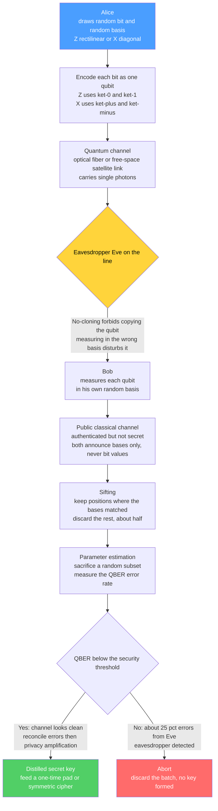

# 🔐 Quantum Key Distribution and BB84

> [!abstract] TL;DR
> **Quantum key distribution (QKD)** lets two parties (Alice and Bob) share a secret cryptographic key whose secrecy is guaranteed by the **laws of physics**, not by the assumed hardness of a math problem. Its security rests on two facts about qubits: you **cannot copy an unknown quantum state** (the no-cloning theorem) and you **cannot measure it in the wrong basis without disturbing it**. The canonical protocol, **BB84** (Bennett & Brassard, 1984), has Alice send bits encoded in randomly chosen **conjugate bases** ($Z$ rectilinear or $X$ diagonal); Bob measures in his own random bases; they publicly compare *only which basis* they used and **keep the bits where the bases matched** (sifting); then they sacrifice a random subset to estimate the **error rate**. An eavesdropper (Eve) who intercepts and resends necessarily guesses the wrong basis half the time and injects a tell-tale **~25% quantum bit error rate (QBER)**, so Alice and Bob simply abort. A low error rate certifies no eavesdropper, and the surviving bits become a shared secret after **error correction** and **privacy amplification** — ideally fed to a one-time pad for information-theoretic secrecy.

---

## Intuition

**Analogy — a secret handshake that self-destructs if a stranger tries to learn it.** Imagine Alice mails Bob a stream of spinning coins, but she is allowed to spin each one about one of two *different axes* — say "north-south" or "east-west" — chosen at random and known only to her. Bob catches each coin and, without knowing her choice, picks one of the two axes at random to read it. Here is the physics: if Bob happens to read along the **same axis** Alice spun, he recovers her value perfectly; if he reads along the **wrong axis**, the answer is pure chance. Afterward they shout across a crowded room (a public, non-secret line) *only* which axis each of them used — never the values — and throw away every coin where the axes disagreed. The coins that survive form a shared secret string.

Now suppose a spy, Eve, snatches each coin midflight to peek. She, too, must guess an axis. Half the time she guesses wrong, reads garbage, and — crucially — the very act of reading **re-spins the coin about her wrong axis**. When Bob later measures that tampered coin along the correct axis, he now gets the right answer only half the time. So Eve's peeking bleeds unavoidable errors into the shared string. Alice and Bob sacrifice a handful of coins, compare them out loud, and if the disagreement rate is suspiciously high they know someone listened and they throw the whole batch away. You cannot eavesdrop on a qubit the way you silently tap a copper wire: **to look is to disturb, and to disturb is to be caught.**

That "coin spun about a hidden axis" is a literal qubit prepared in one of two **conjugate bases** on the [[Qubits_and_the_Bloch_Sphere|Bloch sphere]], and the whole protocol below is about turning that physics into a usable cryptographic key.

---

## How It Works

### Core mechanics

BB84 encodes each classical bit into a single qubit using **two conjugate bases** — the rectilinear $Z$ basis $\{\lvert 0\rangle,\lvert 1\rangle\}$ and the diagonal $X$ basis $\{\lvert +\rangle,\lvert -\rangle\}$ — chosen so that measuring a state of one basis in the *other* basis yields a completely random result.

| Bit | $Z$ basis (rectilinear) | $X$ basis (diagonal) |
|-----|-------------------------|----------------------|
| 0   | $\lvert 0\rangle$       | $\lvert +\rangle=\tfrac{1}{\sqrt2}(\lvert 0\rangle+\lvert 1\rangle)$ |
| 1   | $\lvert 1\rangle$       | $\lvert -\rangle=\tfrac{1}{\sqrt2}(\lvert 0\rangle-\lvert 1\rangle)$ |

1. **Prepare (Alice).** For each of $n$ rounds Alice draws a random **bit** and a random **basis** ($Z$ or $X$) and sends the corresponding qubit down the quantum channel (an optical fiber or a free-space/satellite link carrying single photons).
2. **Measure (Bob).** For each incoming qubit Bob independently picks a random basis and measures. If his basis matches Alice's, his outcome equals her bit with certainty; if not, his outcome is a fair coin flip — **uncorrelated** with her bit.
3. **Sift.** Over a public but **authenticated** classical channel, Alice and Bob announce *only their basis choices* (never the bit values). They discard every round where the bases differed. About **half** the rounds survive; the surviving bits are the **sifted key**, which in an ideal, unattacked channel is identical for both.
4. **Estimate error (parameter estimation).** They reveal and compare a random subset of the sifted bits to measure the **quantum bit error rate (QBER)** — the fraction that disagree. In a perfect world with no eavesdropper and no noise, QBER is 0.
5. **Decide.** If the QBER exceeds a security threshold (roughly **11%** for standard one-way BB84), they assume Eve was present and **abort**. Below threshold, the residual errors are attributed to channel noise and Eve's *partial* information, both of which the next step removes.
6. **Distill (classical post-processing).** **Information reconciliation / error correction** makes Alice's and Bob's keys bit-for-bit identical (leaking a little parity information publicly), then **privacy amplification** — hashing the reconciled key down to a shorter one — squeezes out whatever partial knowledge Eve and the leaked parities could have given away. What remains is a shorter, provably secret key.
7. **Use the key.** The distilled key drives a **symmetric cipher**. If it is used once, as long as the message, and never reused, it realizes the **one-time pad** — the only cipher with *information-theoretic* (unconditional) secrecy.

**Why intercept-resend fails.** Eve has no copy operation available: the **no-cloning theorem** forbids duplicating an unknown qubit (see [[Measurement_and_the_No_Cloning_Theorem]]), so she cannot keep a copy while forwarding the original untouched. Her best simple attack is **intercept-resend**: measure each qubit in a random basis and send Bob a fresh qubit reflecting her result. But she guesses Alice's basis wrong half the time; on those rounds her measurement randomizes the state, and when Bob later measures in the (matching) correct basis he gets the wrong bit half of *those* times. Net effect on the sifted key: an error rate of $\tfrac12\times\tfrac12 = \tfrac14 = \mathbf{25\%}$ — far above threshold, and therefore detected.

**E91 — security from entanglement.** Ekert's 1991 protocol replaces the prepare-and-send picture with a shared source that emits **entangled pairs** ([[Entanglement_and_Bell_States|Bell states]]); Alice and Bob each measure one half in randomly chosen settings. Instead of checking an error rate directly, they check a **Bell inequality (CHSH)**: a strong violation certifies genuine entanglement, and by the **monogamy of entanglement** a third party cannot be strongly correlated with a maximally entangled pair — so a passing Bell test *bounds Eve's information*. This entanglement-based, correlation-testing view is the seed of **device-independent QKD**, whose security holds even if the hardware is untrusted, as long as the Bell violation is real.

### Flow / Architecture



---

## Key Concepts

### Secondary (intuition-level)
- **Key distribution problem:** two people who have never met need a *shared secret* to encrypt messages; getting that secret to each other safely is the hard part.
- **Physics-based security:** QKD's guarantee comes from how nature behaves, not from a code being "too hard to crack" with today's computers.
- **Peeking leaves fingerprints:** because you cannot copy or silently read an unknown qubit, any eavesdropper adds errors that the two parties can spot.
- **Two random axes:** Alice and Bob each pick one of two ways to encode/read each bit; they keep only the bits where they happened to agree.

### Undergraduate (formal)
- **Conjugate bases & mutual unbiasedness:** the $Z$ basis $\{\lvert 0\rangle,\lvert 1\rangle\}$ and $X$ basis $\{\lvert +\rangle,\lvert -\rangle\}$ satisfy $\lvert\langle 0\lvert +\rangle\rvert^2=\tfrac12$ — measuring a $Z$ state in $X$ (or vice versa) is maximally random.
- **No-cloning theorem:** there is no unitary $U$ with $U(\lvert\psi\rangle\lvert 0\rangle)=\lvert\psi\rangle\lvert\psi\rangle$ for all $\lvert\psi\rangle$; Eve cannot duplicate an unknown state to keep one and forward the other.
- **Sifting:** publicly compare bases, keep matches; expected yield $\approx n/2$ raw bits from $n$ transmitted qubits.
- **QBER and the intercept-resend bound:** an intercept-resend Eve injects $\text{QBER}=25\%$ on the sifted key; the standard one-way BB84 secret-key rate goes to zero near $\text{QBER}\approx 11\%$.
- **E91 / Bell test:** shared Bell pairs plus a CHSH inequality; violation $S>2$ (up to $2\sqrt2$) certifies entanglement and caps a third party's correlation.
- **One-time pad:** XOR of an $n$-bit message with a fresh, uniform, secret $n$-bit key gives ciphertext independent of the plaintext — perfect secrecy in Shannon's sense.

### Graduate (rigorous)
- **Information-disturbance tradeoff:** any measurement extracting information $I_{AE}$ about the conjugate-basis encoding necessarily induces disturbance; formal bounds (e.g. Fuchs–Peres) quantify the unavoidable QBER for a given information gain.
- **Security proofs:** unconditional security of BB84 (Mayers; Shor–Preskill via CSS codes / entanglement distillation) shows the distilled key is $\epsilon$-close to uniform *and* independent of Eve's quantum side information, valid against **coherent attacks**; modern proofs use the **quantum leftover-hash lemma** for privacy amplification in terms of the **smooth min-entropy** $H_{\min}^{\epsilon}(K\mid E)$.
- **Secret-key rate:** in the asymptotic Devetak–Winter form, $r \ge I(A:B) - \chi(A:E)$ — the mutual information Bob shares with Alice minus the Holevo information Eve could hold; reconciliation costs $\approx H(A\mid B)$ leaked bits and privacy amplification removes $\chi(A:E)$.
- **Decoy-state method:** real sources emit weak coherent pulses (occasionally multi-photon), enabling **photon-number-splitting** attacks; randomly varied decoy intensities let Alice and Bob estimate single-photon yields and restore near-ideal rates.
- **Monogamy of entanglement:** for a maximally entangled $A$–$B$ pair, no system $E$ can be strongly correlated with either — the quantitative backbone of entanglement-based and **device-independent** QKD, where security is inferred from a Bell violation without trusting the devices.
- **Composable security:** the distilled key must remain secure when *used* by a later protocol; the $\epsilon$-security definition (trace distance to an ideal secret key) guarantees composability.

---

## Python Demo

```python
# Simulate the BB84 protocol with numpy, then add an intercept-resend
# eavesdropper (Eve) and show she injects a ~25% quantum bit error rate (QBER)
# that Alice and Bob detect by sacrificing part of the sifted key.
# numpy + matplotlib only.
import numpy as np
import matplotlib.pyplot as plt

rng = np.random.default_rng(42)

# Bases: 0 = Z (rectilinear, encodes |0>,|1>); 1 = X (diagonal, |+>,|->).
Z, X = 0, 1

def measure(prep_basis, prep_bit, meas_basis, rng):
    """Ideal noiseless single-qubit measurement.
    If the measurement basis matches the preparation basis the outcome is
    deterministic (equals prep_bit); otherwise it is a fair coin flip,
    because Z and X are mutually unbiased (conjugate) bases."""
    matched = (meas_basis == prep_basis)
    coin = rng.integers(0, 2, size=prep_bit.shape)
    return np.where(matched, prep_bit, coin)

def run_bb84(n, eavesdrop, rng):
    # --- Alice: random bits encoded in random bases ---
    alice_bits  = rng.integers(0, 2, size=n)
    alice_bases = rng.integers(0, 2, size=n)

    if eavesdrop:
        # --- Eve: intercept-resend attack in her own random bases ---
        eve_bases = rng.integers(0, 2, size=n)
        eve_bits  = measure(alice_bases, alice_bits, eve_bases, rng)
        # Eve cannot clone; she resends what she read, prepared in HER basis:
        prep_basis, prep_bit = eve_bases, eve_bits
    else:
        prep_basis, prep_bit = alice_bases, alice_bits

    # --- Bob: measures in his own random bases ---
    bob_bases = rng.integers(0, 2, size=n)
    bob_bits  = measure(prep_basis, prep_bit, bob_bases, rng)

    # --- Sifting: keep only rounds where Alice and Bob used the same basis ---
    keep = (alice_bases == bob_bases)
    sifted_alice = alice_bits[keep]
    sifted_bob   = bob_bits[keep]

    qber = np.mean(sifted_alice != sifted_bob) if keep.any() else 0.0
    return sifted_alice, sifted_bob, qber

# --- Single large run to read off the headline numbers ---
n = 20000
sa, sb, qber_clean = run_bb84(n, eavesdrop=False, rng=rng)
_,  _,  qber_eve   = run_bb84(n, eavesdrop=True,  rng=rng)

print(f"Sifted key length from {n} qubits (no Eve): {sa.size}  (~n/2)")
print(f"QBER without Eve: {qber_clean:7.3%}  (expected ~0%)")
print(f"QBER with    Eve: {qber_eve:7.3%}  (expected ~25%)")

# --- Repeat many small protocols to see the QBER distributions ---
trials, m = 300, 2000
clean = np.array([run_bb84(m, False, rng)[2] for _ in range(trials)])
eve   = np.array([run_bb84(m, True,  rng)[2] for _ in range(trials)])

fig, (ax1, ax2) = plt.subplots(1, 2, figsize=(12, 4.5))

ax1.bar(["No eavesdropper", "Intercept-resend Eve"],
        [clean.mean(), eve.mean()],
        yerr=[clean.std(), eve.std()],
        color=["#51cf66", "#ff6b6b"], capsize=6)
ax1.axhline(0.11, ls="--", color="gray", label="abort threshold ~0.11")
ax1.set_ylabel("Quantum bit error rate (QBER)")
ax1.set_title("BB84 sifted-key error rate")
ax1.legend()

ax2.hist(clean, bins=25, alpha=0.7, color="#51cf66", label="no Eve")
ax2.hist(eve,   bins=25, alpha=0.7, color="#ff6b6b", label="with Eve")
ax2.axvline(0.25, ls="--", color="black", label="Eve mean 0.25")
ax2.set_xlabel("QBER over sifted key")
ax2.set_ylabel("count of protocol runs")
ax2.set_title(f"QBER distribution over {trials} runs")
ax2.legend()

plt.tight_layout()
plt.show()
```

Running this prints a sifted key of about `n/2` bits, a QBER near **0%** with no eavesdropper, and a QBER near **25%** whenever Eve intercept-resends. The histogram shows the two distributions cleanly separated on either side of the ~11% abort threshold — the statistical signature that lets Alice and Bob *detect* eavesdropping without ever knowing how Eve attacked.

---

## Real-World Applications

> **Example — the Micius satellite (China, 2016 onward).** Ground-based fiber QKD is limited to roughly a few hundred kilometers because photons are absorbed and cannot be amplified without destroying their quantum state (no-cloning again). The Micius satellite sidesteps this by beaming entangled photons and BB84 qubits through free space from orbit, distributing keys between ground stations **over 1,000 km apart** and enabling an intercontinental QKD-secured video call between Beijing and Vienna. It is the flagship demonstration that QKD works at continental scale via **free-space/satellite** links rather than fiber.

- **Metropolitan fiber QKD networks:** deployments such as the Tokyo QKD Network, the SwissQuantum/Geneva links, and China's Beijing–Shanghai backbone use dark fiber and **trusted-node repeaters** — intermediate stations that decrypt and re-encrypt keys — to bridge distances beyond a single link. Trusted nodes are a practical crutch, not a cryptographic ideal, since each node must itself be secured.
- **Commercial systems:** ID Quantique, Toshiba, and others sell rack-mounted BB84 (usually **decoy-state**) systems used by banks, government, and telecom operators for high-value point-to-point links.
- **The one-time pad in practice:** QKD's continuously refreshed key is the natural fuel for a **one-time pad** or for frequently rekeyed AES, giving forward secrecy that does not depend on any computational assumption.
- **Toward quantum repeaters:** overcoming the distance limit *without* trusted nodes requires **quantum repeaters** built on entanglement swapping and distillation — the core enabling technology for a future long-range quantum internet.

---

## Common Pitfalls

- **Believing QKD encrypts your data.** QKD distributes a **key**, nothing more. The message is still encrypted with a classical symmetric cipher (ideally a one-time pad). QKD replaces the *key-exchange* step, not the encryption step.
- **Forgetting the classical channel must be authenticated.** BB84 defeats *passive* and *intercept-resend* eavesdropping, but the public discussion channel must be **authenticated** or Eve mounts a **man-in-the-middle** attack, impersonating Bob to Alice and vice versa. That authentication needs a pre-shared secret (or classical crypto), so QKD *grows* a shared secret rather than creating one from nothing.
- **Assuming the 25% signature means "always caught instantly."** The 25% QBER is a *statistical* signature over many sifted bits; on a short key it fluctuates. Security comes from sacrificing enough bits for a confident estimate, plus privacy amplification to erase Eve's *partial* information even below threshold.
- **Ignoring implementation side channels.** The *protocol* is provably secure, but real **devices** leak. **Detector-blinding** attacks shine bright light to force single-photon detectors into a classical regime Eve controls; **photon-number-splitting** exploits multi-photon pulses from imperfect sources. These motivate the **decoy-state** method and **device-independent / measurement-device-independent (MDI) QKD**.
- **Confusing QKD with quantum-resistant software.** QKD and **post-quantum cryptography (PQC)** solve overlapping problems by opposite means. QKD needs special quantum hardware and a dedicated quantum channel but offers physics-based security; PQC is drop-in *classical software* believed hard for quantum computers to break. Most agencies (e.g. NSA/NIST) currently favor PQC for general use and treat QKD as a niche.
- **Overstating practicality.** QKD is rate- and distance-limited, cannot be routed through ordinary internet infrastructure, needs point-to-point quantum links or trusted nodes, and does not by itself solve authentication. It is a real technology with a **narrow niche**, not a wholesale replacement for classical key exchange.

---

## Related Concepts

- [[Measurement_and_the_No_Cloning_Theorem]] — the security foundation: an unknown qubit cannot be copied, and measuring it in the wrong basis disturbs it, so any eavesdropper is forced to leave detectable errors.
- [[Entanglement_and_Bell_States]] — the resource behind the **E91** protocol; a CHSH Bell-inequality test plus the **monogamy of entanglement** bounds Eve's information.
- [[Qubits_and_the_Bloch_Sphere]] — the $Z$ and $X$ encodings are two **conjugate (mutually unbiased) bases** on the Bloch sphere; measuring one in the other is maximally random, which is exactly what makes eavesdropping detectable.
- [[Quantum_Gates_and_Circuits]] — a **Hadamard** gate rotates between the $Z$ and $X$ bases, so it is how you physically prepare $\lvert +\rangle/\lvert -\rangle$ and how Bob switches his measurement basis.
- [[Information_Theoretic_Security_and_Privacy]] — the **one-time pad** and **perfect secrecy** that a QKD key enables, plus the min-entropy view of **privacy amplification**.
- [[Post_Quantum_Cryptography]] — the competing, **classical-software** answer to the quantum threat; contrast physics-based QKD against computational-hardness PQC.
- [[Symmetric_Encryption]] — the cipher that actually consumes the distilled key (one-time pad or frequently rekeyed AES).
- [[Quantum_Information_Theory]] — the no-cloning theorem, Holevo bound, and entropy tools underpinning the security proofs.

> Sibling notes planned for this vault and to be cross-linked once written: **Device-Independent and Post-Quantum Security** (untrusted-hardware QKD and the QKD-vs-PQC tradeoff), **Entanglement Distillation and Quantum Networks** and **The Quantum Internet** (quantum repeaters that beat the distance limit without trusted nodes), and **Shor's Factoring Algorithm** (the quantum attack on RSA/ECC that makes quantum-safe key exchange urgent).

---

## Review Questions

**Secondary**
1. Using the "coins spun about a hidden axis" analogy, explain why a spy who intercepts the coins cannot learn the shared key without leaving evidence. What do Alice and Bob shout across the room, and what do they keep secret?

**Undergraduate**
2. In BB84, Alice sends 8 qubits with (bit, basis) pairs `(1,Z) (0,X) (1,X) (0,Z) (1,Z) (0,X) (1,Z) (0,X)` and Bob happens to measure in bases `Z X Z Z X X Z X`. Which positions survive sifting, and what is the resulting sifted key (assume an ideal, unattacked channel)? Then explain quantitatively why an intercept-resend Eve would raise the error rate on the sifted key to about 25%.

**Graduate**
3. State the asymptotic Devetak–Winter secret-key rate $r \ge I(A:B) - \chi(A:E)$ and explain how **error correction** consumes the first term's deficit and **privacy amplification** removes the second. Then contrast BB84's security argument with E91's: how does the **monogamy of entanglement** plus a CHSH violation let you bound Eve's information *without trusting the measurement devices*, and what real-world attack (name one) does this device-independent view defend against that prepare-and-measure BB84 does not?

---

## Sources

- [Bennett, C. H. & Brassard, G. — "Quantum cryptography: Public key distribution and coin tossing," Proc. IEEE ICCSSP (1984); reprinted Theor. Comput. Sci. 560 (2014)](https://doi.org/10.1016/j.tcs.2014.05.025)
- [Ekert, A. K. — "Quantum cryptography based on Bell's theorem," Phys. Rev. Lett. 67, 661 (1991)](https://doi.org/10.1103/PhysRevLett.67.661)
- [Gisin, N., Ribordy, G., Tittel, W. & Zbinden, H. — "Quantum cryptography," Rev. Mod. Phys. 74, 145 (2002)](https://doi.org/10.1103/RevModPhys.74.145)
- [Scarani, V. et al. — "The security of practical quantum key distribution," Rev. Mod. Phys. 81, 1301 (2009)](https://doi.org/10.1103/RevModPhys.81.1301)
- [Liao, S.-K. et al. — "Satellite-to-ground quantum key distribution" (Micius), Nature 549, 43 (2017)](https://doi.org/10.1038/nature23655)
- [Nielsen, M. A. & Chuang, I. L. — *Quantum Computation and Quantum Information* (Cambridge, 2010), Ch. 12.6 "Quantum cryptography"](https://doi.org/10.1017/CBO9780511976667)

---

#quantum-computing #quantum-key-distribution #bb84 #quantum-cryptography #qkd
