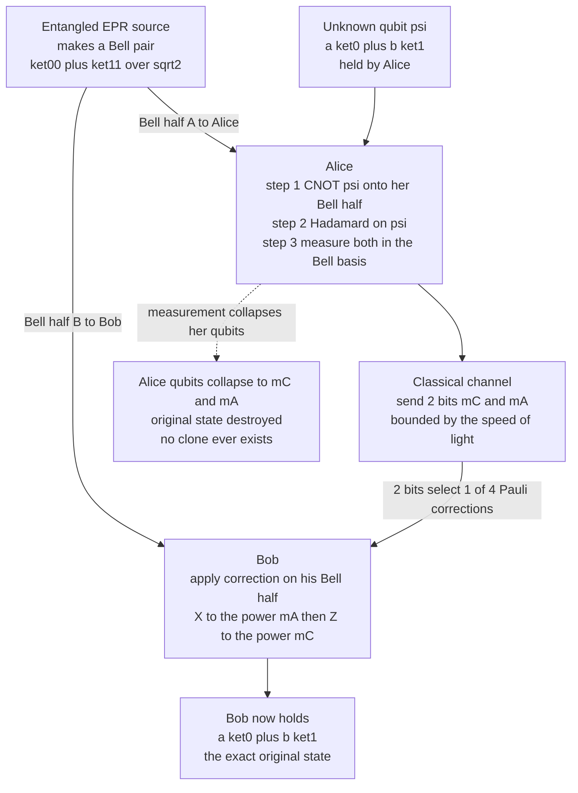

# 🛰️ Quantum Teleportation

> [!abstract] TL;DR
> **Quantum teleportation** (Bennett, Brassard, Crépeau, Jozsa, Peres & Wootters, 1993) transfers an **unknown** qubit state $|\psi\rangle = \alpha|0\rangle + \beta|1\rangle$ from Alice to Bob **without ever sending the qubit itself**, by consuming two resources: one **pre-shared entangled Bell pair** (one *ebit*) and **two classical bits**. Alice performs a joint **Bell-basis measurement** on her unknown qubit and her half of the pair; this instantly projects **Bob's** half into a state related to $|\psi\rangle$ by one of four Pauli operators, *and destroys Alice's original* — no copy ever exists, so **no-cloning is respected**. Alice then phones Bob her 2 measurement bits; Bob applies the matching Pauli correction and recovers $|\psi\rangle$ **exactly**. It is **not** matter transport (nothing physical travels) and **not** faster-than-light (Bob's qubit is useless noise until the classical bits arrive, so relativity and the no-communication theorem hold). Teleportation is the foundational primitive of the **quantum internet**, of **quantum repeaters** (via entanglement swapping), and of **fault-tolerant gate teleportation**. Its exact dual is **superdense coding**.

---

## Intuition

**Analogy — a quantum fax that shreds the original.** Imagine you want to send a friend an impossibly intricate sculpture whose exact shape you are *forbidden to measure or copy* (any attempt to inspect it would smudge it). A normal fax scans the original and prints a duplicate — but that would mean two copies exist, which quantum mechanics flatly forbids for an unknown state (the [[Measurement_and_the_No_Cloning_Theorem|no-cloning theorem]]). Quantum teleportation is a stranger kind of fax: you and your friend each hold one glove of a magical **pair of gloves** prepared long ago so that they are perfectly correlated (an [[Entanglement_and_Bell_States|entangled Bell pair]]). You press the sculpture against *your* glove, read a **2-bit dial** that lights up, and in doing so you **vaporize both the sculpture and your glove**. You then text your friend those 2 bits. Following the text as an instruction, your friend rotates *their* glove into one of four orientations — and it becomes the exact sculpture. The original was destroyed the instant you read the dial; only ever **one** copy existed.

Two things this analogy nails and pop culture gets wrong. First, **nothing material crossed the room** — not the sculpture, not atoms, not energy; only the *pattern* (the quantum information) was reconstructed on your friend's pre-existing glove. Second, the text message is **mandatory and travels at ordinary speed**: before it arrives, your friend's glove is in a random one-of-four orientation that looks like pure noise, carrying zero usable information. So teleportation is a **transfer, not a duplication**, and it is emphatically **not faster-than-light**.

---

## How It Works

### Core Mechanics

Label three qubits: **C** = the unknown message qubit $|\psi\rangle = \alpha|0\rangle + \beta|1\rangle$ that Alice wants to send; **A** = Alice's half of a shared Bell pair; **B** = Bob's half of that same pair. Alice holds C and A; Bob holds B, possibly light-years away.

**1. Pre-share entanglement (done in advance).** Some source distributes the Bell state $|\Phi^+\rangle_{AB} = \tfrac{1}{\sqrt2}(|00\rangle + |11\rangle)$ to Alice and Bob. This is the *only* quantum link they will ever need, and it can be established long before Alice knows which state she will send. The full three-qubit system starts as $|\psi\rangle_C \otimes |\Phi^+\rangle_{AB}$.

**2. Alice entangles the message with her half.** Alice applies a **CNOT** with C as control and A as target, then a **Hadamard** on C (see [[Quantum_Gates_and_Circuits]]). Expanding the algebra, the state can be regrouped so that each of the four possible outcomes of measuring C and A leaves Bob's qubit B in a known Pauli-image of $|\psi\rangle$:

$$
|\psi\rangle_C |\Phi^+\rangle_{AB} = \tfrac{1}{2}\Big[ |00\rangle_{CA}\,|\psi\rangle_B + |01\rangle_{CA}\,X|\psi\rangle_B + |10\rangle_{CA}\,Z|\psi\rangle_B + |11\rangle_{CA}\,XZ|\psi\rangle_B \Big]
$$

**3. Alice measures in the Bell basis.** Measuring C and A in the computational basis (after the CNOT + H, this *is* a Bell-basis measurement of the original two qubits) yields **2 classical bits** $(m_C, m_A)$, each outcome equally likely with probability $\tfrac14$ **regardless of $\alpha, \beta$** — which is precisely why Alice learns *nothing* about the state she is sending. This measurement **collapses Alice's C and A** to definite classical bits: the original $|\psi\rangle$ is now **gone from Alice's side entirely**.

**4. Alice sends the 2 bits over a classical channel.** A phone call, fiber, or radio link carries $(m_C, m_A)$ to Bob. This step is bound by the speed of light.

**5. Bob applies the matching Pauli correction.** Reading the equation above, Bob applies $X^{m_A}$ then $Z^{m_C}$ to his qubit B:

| $(m_C, m_A)$ | Bob's state before | Correction | Result |
|:---:|:---:|:---:|:---:|
| 0 0 | $\|\psi\rangle$ | $I$ | $\|\psi\rangle$ |
| 0 1 | $X\|\psi\rangle$ | $X$ | $\|\psi\rangle$ |
| 1 0 | $Z\|\psi\rangle$ | $Z$ | $\|\psi\rangle$ |
| 1 1 | $XZ\|\psi\rangle$ | $X$ then $Z$ | $\|\psi\rangle$ |

Bob's qubit is now **exactly** $|\psi\rangle$, with **fidelity 1** — the amplitudes $\alpha, \beta$ have been reconstructed on a qubit that was never anywhere near Alice.

**Why it breaks no laws.** (a) **No-cloning holds** because Alice's measurement destroyed the original *before* Bob's copy became usable — at no instant do two copies coexist. (b) **No faster-than-light signalling** because until the classical bits arrive, Bob's qubit is a uniform random mixture over the four Pauli images, which is the *maximally mixed state* $I/2$ — statistically identical no matter what Alice sent, so it carries zero information (the **no-communication theorem**). The entanglement provides correlation, but only the classical bits unlock meaning.

**Resource accounting.** Teleporting one qubit costs exactly **1 ebit + 2 classical bits**. This is the fundamental exchange rate: *entanglement plus classical communication can substitute for sending quantum information directly.* Its **dual**, superdense coding, spends **1 ebit + 1 qubit** to transmit **2 classical bits** — the same three ingredients rebalanced.

### The Teleportation Protocol



---

## Key Concepts

**Secondary (the big picture):**
- **A transfer, not a copy.** The unknown state moves from Alice to Bob; the original is *destroyed* in the process, so only one copy ever exists.
- **Two ingredients required.** A shared "entangled pair" set up beforehand, plus a short **2-bit text message** sent the normal way.
- **Not sci-fi, not FTL.** No matter or energy travels; the qubit itself never moves. And nothing outruns light — the message must arrive before Bob's qubit means anything.
- **Why bother?** You can move a fragile quantum state across a network using only a pre-shared link and two classical bits — the seed idea behind a future **quantum internet**.

**Undergraduate (the machinery):**
- **The BBCJPW protocol:** CNOT, then Hadamard, then a Bell-basis measurement on Alice's two qubits, then Pauli correction on Bob's.
- **Bell-basis measurement** projects onto the four maximally-entangled states; each of the four outcomes is equally likely, which is why Alice extracts no information about $|\psi\rangle$.
- **The four corrections** $\{I, X, Z, XZ\}$ are indexed by the 2 classical bits; without them Bob holds the maximally mixed state $I/2$.
- **No-cloning consistency** — teleportation is *not* a workaround for [[Measurement_and_the_No_Cloning_Theorem|no-cloning]]; the destruction of the original is exactly what keeps it legal.
- **No-communication theorem** — Bob's local statistics are independent of Alice's action until the classical bits arrive; entanglement alone signals nothing (see [[Entanglement_and_Bell_States]]).

**Graduate (the frontier):**
- **Entanglement swapping** — teleport *one half of a Bell pair itself*, fusing two short-range entangled links into one long-range link. This is the operating principle of a **quantum repeater** and, with entanglement distillation, of scalable quantum networks.
- **Gate teleportation** — teleporting a qubit *through* a specially prepared resource state applies a chosen gate as a side effect. Because non-Clifford gates (like $T$) can be applied by consuming distilled **magic states**, teleportation is a core primitive of **fault-tolerant** quantum computing and the **threshold theorem**.
- **Measurement-based quantum computing (MBQC / one-way model)** — an entire computation is driven by adaptive single-qubit measurements on a pre-entangled **cluster state**; every step is essentially teleportation with a gate baked in.
- **Continuous-variable teleportation** — the optical version (Vaidman; Braunstein & Kimble) teleports the quadratures of a light mode using two-mode squeezed vacuum and homodyne detection; fidelity is bounded by finite squeezing.
- **Resource theory** — the $1\text{ ebit} + 2\text{ cbits} \to 1\text{ qubit}$ relation and its dual, superdense coding, are the anchor identities of quantum Shannon theory (see [[Quantum_Information_Theory]]).

---

## Python Demo

```python
# Quantum teleportation from scratch with numpy state vectors (no qiskit).
# We prepare a RANDOM unknown qubit |psi> = a|0> + b|1> on Alice, share a Bell
# pair, run the BBCJPW protocol (CNOT, H, Bell-basis measurement), send the two
# classical bits, apply Bob's Pauli correction, and verify fidelity 1 while
# Alice's original is destroyed. Repeated over many random input states.
# numpy / matplotlib only.

import numpy as np
import matplotlib.pyplot as plt

# ---- single-qubit gates and basis kets ----
I2 = np.eye(2, dtype=complex)
X  = np.array([[0, 1], [1, 0]], dtype=complex)   # bit flip
Z  = np.array([[1, 0], [0, -1]], dtype=complex)  # phase flip
H  = np.array([[1, 1], [1, -1]], dtype=complex) / np.sqrt(2)
ket0 = np.array([1, 0], dtype=complex)
ket1 = np.array([0, 1], dtype=complex)
P0 = np.array([[1, 0], [0, 0]], dtype=complex)   # |0><0|
P1 = np.array([[0, 0], [0, 1]], dtype=complex)   # |1><1|

def kron3(A, B, C):
    return np.kron(np.kron(A, B), C)

# qubit order in the 8-vector is (C = message, A = Alice's half, B = Bob's half)
CNOT_CA = kron3(P0, I2, I2) + kron3(P1, X, I2)   # CNOT: control C, target A
H_on_C  = kron3(H, I2, I2)                        # Hadamard on the message qubit

def random_qubit(rng):
    """Uniformly random single-qubit pure state a|0> + b|1>."""
    v = rng.normal(size=2) + 1j * rng.normal(size=2)
    return v / np.linalg.norm(v)

def bell_pair():
    """(|00> + |11>)/sqrt(2) shared between Alice (A) and Bob (B)."""
    return (np.kron(ket0, ket0) + np.kron(ket1, ket1)) / np.sqrt(2)

def fidelity(u, w):
    """|<u|w>|^2 for two normalized pure single-qubit states."""
    return abs(np.vdot(u, w)) ** 2

def teleport(psi, rng):
    state = np.kron(psi, bell_pair())     # |psi> (x) |Phi+>  -> 8-dim vector
    state = CNOT_CA @ state               # Alice entangles message with her half
    state = H_on_C  @ state               # Alice's basis change (-> Bell measurement)

    # Born-rule probabilities for measuring (C, A) in the computational basis
    probs = {}
    for mC in (0, 1):
        for mA in (0, 1):
            Proj = kron3(P0 if mC == 0 else P1,
                         P0 if mA == 0 else P1, I2)
            branch = Proj @ state
            probs[(mC, mA)] = np.real(np.vdot(branch, branch))

    # sample one measurement outcome, then project and renormalize (collapse)
    outcomes = list(probs)
    p = np.array([probs[o] for o in outcomes]); p /= p.sum()
    mC, mA = outcomes[rng.choice(len(outcomes), p=p)]
    Proj = kron3(P0 if mC == 0 else P1, P0 if mA == 0 else P1, I2)
    post = Proj @ state
    post = post / np.linalg.norm(post)

    # Bob's qubit is the B-slice once C, A are pinned to (mC, mA)
    bob = post.reshape(2, 2, 2)[mC, mA, :]
    bob = bob / np.linalg.norm(bob)

    # Alice sends the 2 classical bits; Bob applies X^mA then Z^mC
    if mA == 1: bob = X @ bob
    if mC == 1: bob = Z @ bob

    # Alice's leftover message qubit has collapsed to the basis state |mC>
    alice_leftover = ket0 if mC == 0 else ket1
    return bob, alice_leftover, (mC, mA), probs[(mC, mA)]

# ---- run the protocol over many random unknown states ----
rng = np.random.default_rng(7)
N = 200
recovered_fid, destroyed_fid, branch_probs = [], [], []
for _ in range(N):
    psi = random_qubit(rng)
    bob, alice_leftover, bits, pr = teleport(psi, rng)
    recovered_fid.append(fidelity(psi, bob))            # Bob vs original -> ~1
    destroyed_fid.append(fidelity(psi, alice_leftover)) # Alice vs original -> not 1
    branch_probs.append(pr)

recovered_fid = np.array(recovered_fid)
destroyed_fid = np.array(destroyed_fid)

print(f"Bob recovered fidelity : mean={recovered_fid.mean():.6f}  "
      f"min={recovered_fid.min():.6f}")
print(f"Alice leftover fidelity: mean={destroyed_fid.mean():.3f}  "
      f"(a copy would be 1.0 -> it is NOT: original destroyed)")
print(f"Each Bell-measurement outcome probability ~ {np.mean(branch_probs):.3f} "
      f"(= 0.25, independent of the input -> Alice learns nothing)")

# ---- plot ----
fig, (ax1, ax2) = plt.subplots(1, 2, figsize=(11, 4))
ax1.plot(recovered_fid, "o", ms=3, color="#16a34a",
         label="Bob after correction")
ax1.plot(destroyed_fid, ".", ms=4, color="#dc2626",
         label="Alice leftover qubit")
ax1.axhline(1.0, ls="--", color="gray", lw=1)
ax1.set_ylim(-0.05, 1.08); ax1.set_xlabel("random input state #")
ax1.set_ylabel("fidelity with original |psi>")
ax1.set_title("Teleport succeeds (Bob=1); original is gone (Alice<1)")
ax1.legend(loc="center right")

ax2.hist(recovered_fid, bins=np.linspace(0.999, 1.001, 20), color="#16a34a")
ax2.set_xlabel("Bob's recovered fidelity")
ax2.set_ylabel("count")
ax2.set_title("Every teleport lands at fidelity 1")
plt.tight_layout()
plt.savefig("teleportation_fidelity.png", dpi=130)
print("\nSaved plot to teleportation_fidelity.png")
```

Running it prints a **mean Bob fidelity of 1.000000** across all 200 random inputs — the state is reconstructed perfectly every time. Alice's leftover qubit has fidelity well below 1 (it has collapsed to a classical $|0\rangle$ or $|1\rangle$), the numerical proof that **the original was destroyed and no clone remains**. And each Bell-measurement outcome occurs with probability $\approx 0.25$ *independent of the input*, confirming Alice's measurement leaks nothing about $|\psi\rangle$.

---

## Real-World Applications

> **Example — the Micius satellite teleporting qubits to space.** In 2017 a Chinese team (Ren et al.) used the **Micius** satellite to teleport single-photon polarization states from a ground station in Tibet to the orbiting satellite over distances up to **1400 km**, far beyond what fiber loss allows. Ground-based fiber and free-space links suffer exponential photon loss, so a shared Bell pair cannot be distributed over continental scales directly — teleportation over a satellite relay, combined with entanglement swapping, is a leading route to a global **quantum network**.

- **Quantum repeaters and the quantum internet** — Direct entanglement distribution decays exponentially with distance. Repeaters chain short high-quality links by **entanglement swapping** (teleporting entanglement itself) plus **entanglement distillation** to purify noisy pairs, extending secure links (e.g., for device-independent **QKD**) across a continent.
- **Fault-tolerant quantum computing** — **Gate teleportation** applies hard non-Clifford gates by consuming distilled **magic states**, and **lattice surgery** / code-switching move logical qubits by teleportation. Nearly every surface-code architecture leans on teleportation as a primitive.
- **Measurement-based (one-way) quantum computing** — Photonic platforms (e.g., cluster-state machines) run algorithms as sequences of adaptive measurements on a large entangled state; each logical step is teleportation with a gate embedded.
- **Modular / networked quantum processors** — Trapped-ion and superconducting groups (e.g., Oxford, Delft/QuTech, Yale) teleport quantum gates and states between separate modules or chips, a path to scaling beyond a single device. Deterministic teleportation between two trapped-ion modules has been demonstrated over a photonic link.
- **Superdense coding (the dual)** — the mirror-image protocol that sends **2 classical bits** per qubit using a shared Bell pair; it and teleportation together define the entanglement/communication exchange rate.

---

## Common Pitfalls

- **"Teleportation is faster-than-light."** No. Bob's qubit is the maximally mixed state $I/2$ until the 2 classical bits arrive over a light-speed-bounded channel; before that it carries zero information. The **no-communication theorem** guarantees no signalling. This is the single most common misconception.
- **"It violates no-cloning by copying the state."** No — it *moves* the state. Alice's Bell-basis measurement destroys her original the instant it happens, so two copies never coexist. The destruction is not a side-effect; it is what makes the protocol legal.
- **"Matter or energy is teleported."** Only the **quantum information** (the amplitudes $\alpha, \beta$) is transferred onto a pre-existing qubit at Bob's end. No particles, atoms, mass, or energy travel; the message qubit itself never leaves Alice.
- **"Entanglement alone transmits the state."** The shared Bell pair is necessary but *insufficient*. Without the classical bits Bob cannot pick the right Pauli correction, and his qubit is useless. Entanglement + classical communication together do the job.
- **Confusing teleportation with entanglement swapping.** Swapping is teleporting *one member of a Bell pair* to link two distant parties who never shared entanglement — the repeater trick. Ordinary teleportation moves an arbitrary (possibly unknown) qubit.
- **Forgetting the resource cost.** Each teleported qubit **consumes** one Bell pair and two classical bits; the entanglement is used up and must be re-supplied. Treating the shared pair as reusable is a classic accounting error.
- **Getting the correction order or bit-to-Pauli mapping wrong.** The correction is $Z^{m_C} X^{m_A}$ (apply $X$ then $Z$); swapping which bit drives $X$ vs $Z$, or reversing the order for the $(1,1)$ outcome, silently produces a Pauli-rotated (wrong) output with fidelity below 1.

---

## Related Concepts

- [[Entanglement_and_Bell_States]] — the shared Bell pair is the fuel of teleportation; teleportation is the flagship application that *consumes* entanglement as a resource, and the no-communication theorem lives here.
- [[Measurement_and_the_No_Cloning_Theorem]] — Alice's Bell-basis measurement is why the original is destroyed; teleportation is fully consistent with (not a loophole in) no-cloning.
- [[Qubits_and_the_Bloch_Sphere]] — the arbitrary unknown state $\alpha|0\rangle + \beta|1\rangle$ being teleported is a point on the Bloch sphere; fidelity 1 means Bob's arrow matches Alice's exactly.
- [[Quantum_Gates_and_Circuits]] — the protocol is a small circuit: CNOT, Hadamard, mid-circuit measurement, and conditional Pauli corrections.
- [[Quantum_Information_Theory]] — the $1\text{ ebit} + 2\text{ cbits} \to 1\text{ qubit}$ resource identity and its dual, superdense coding, are anchor results of quantum Shannon theory.
- [[Linear_Algebra_for_Quantum_Computing]] — the tensor products, projectors, and unitaries that make the three-qubit derivation and the numpy demo work.
- [[Quantum_Computing_Overview]] — situates teleportation among the core quantum resources: superposition, entanglement, interference, and measurement.

---

## Review Questions

1. **(Secondary)** A friend says "quantum teleportation means we can send messages instantly across the galaxy, faster than light." Explain in two or three sentences what is right and what is wrong, using the fact that Bob's qubit is useless until the 2 classical bits arrive.
2. **(Undergraduate)** Walk through the four possible outcomes of Alice's Bell-basis measurement and give the exact Pauli correction Bob applies for each. Then explain why Alice's measurement outcomes are each equally likely (probability $\tfrac14$) *no matter what state she is teleporting*, and why that fact is essential to the no-cloning and no-signalling consistency of the protocol.
3. **(Graduate)** Contrast three uses of the same primitive: (a) teleporting an unknown data qubit across a network, (b) **entanglement swapping** in a quantum repeater, and (c) **gate teleportation** of a non-Clifford $T$ gate via a magic state. For each, state what is being teleported, what resource is consumed, and why teleportation is the natural tool rather than direct transmission.

---

## Sources

- Bennett, C. H., Brassard, G., Crépeau, C., Jozsa, R., Peres, A., Wootters, W. K. "Teleporting an Unknown Quantum State via Dual Classical and Einstein-Podolsky-Rosen Channels." *Physical Review Letters* 70, 1895 (1993) — the original protocol. [DOI](https://doi.org/10.1103/PhysRevLett.70.1895)
- Bouwmeester, D., Pan, J.-W., Mattle, K., Eibl, M., Weinfurter, H., Zeilinger, A. "Experimental Quantum Teleportation." *Nature* 390, 575 (1997) — first photonic demonstration. [DOI](https://doi.org/10.1038/37539)
- Ren, J.-G. et al. "Ground-to-Satellite Quantum Teleportation." *Nature* 549, 70 (2017) — the Micius satellite over ~1400 km. [DOI](https://doi.org/10.1038/nature23675)
- Gottesman, D., Chuang, I. L. "Quantum Teleportation is a Universal Computational Primitive." *Nature* 402, 390 (1999) — gate teleportation and fault tolerance. [arXiv:quant-ph/9908010](https://arxiv.org/abs/quant-ph/9908010)
- Nielsen, M. A., Chuang, I. L. *Quantum Computation and Quantum Information*, 10th Anniversary ed. Cambridge University Press, 2010 — Section 1.3.7 and Chapter 12 develop teleportation, superdense coding, and the resource picture.

---

#quantum-computing #quantum-teleportation #entanglement #bell-measurement #quantum-communication
