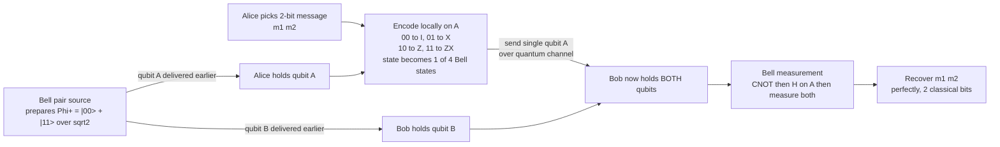

# 📡 Superdense Coding

> [!abstract] TL;DR
> **Superdense coding** lets Alice send **two classical bits** to Bob by physically transmitting **only one qubit** — provided the two of them already **pre-share an entangled Bell pair**. Alice applies one of four single-qubit **Pauli** operations (`I`, `X`, `Z`, or `ZX`) to *her* half of the pair, which secretly rotates the shared state into one of the **four orthogonal Bell states**; she then sends that single qubit to Bob, who — now holding *both* halves — runs a **Bell measurement** (`CNOT` then `H`, then measure) to read off both bits perfectly. It looks like it beats the **Holevo bound** ("one qubit carries at most one classical bit"), but it does not: the entangled pair is an *extra resource* that had to be distributed by an *earlier* qubit transmission. Superdense coding is the exact **mirror image of quantum teleportation**, and it was the first clean proof that **entanglement is a communication resource with quantifiable value** — the seed of quantum Shannon theory (Bennett & Wiesner, 1992).

---

## Intuition

**Analogy — the two keys you mailed last month.** Imagine you want to send a friend a message that is one of four possibilities: "meet at noon," "meet at dusk," "cancel," or "as usual." Normally a single postcard (one symbol) can only carry a small, fixed amount. But suppose that a month ago you and your friend each tore *the same photograph* in half and kept your ragged edge — a shared secret that means nothing on its own, but that **fits together perfectly** only with the partner half. Now you can nudge, tear, or fold *your* half in one of four agreed ways, mail that single half across, and when your friend lays it against the half they kept, the *combined* pattern spells out one of four messages. You mailed **one** object today, yet delivered a **two-bit** message — because part of the information was pre-positioned as a shared correlation before you ever wrote anything.

That pre-shared torn photograph is an **entangled Bell pair**. A single qubit normally carries at most one classical bit, but if the receiver already holds a qubit that is *entangled* with yours, then a single operation on your qubit steers the **joint** state, and one qubit's worth of transmission unlocks two bits' worth of message. Crucially there is **no free lunch**: distributing that entangled pair in the first place cost you an earlier qubit trip. Superdense coding is the exact reverse of **quantum teleportation** — where you spend entanglement plus *classical* bits to move a qubit; here you spend entanglement plus a *qubit* to move classical bits.

---

## How It Works

### Core Mechanics

**Setup — the pre-shared ebit.** At some earlier time, a source prepares the Bell state `|Φ+⟩ = (|00⟩ + |11⟩)/√2` and delivers the first qubit (call it `A`) to **Alice** and the second (`B`) to **Bob**. Neither has any message yet; they simply hold two halves of one **ebit** (a unit of entanglement). Held alone, Alice's qubit `A` is *maximally mixed* — it carries **zero** information by itself.

**Step 1 — Alice encodes 2 bits with one local gate.** Alice wants to send a 2-bit message `m1 m2`. She applies a single-qubit **Pauli** operation to *her* qubit only. The mapping transforms the shared `|Φ+⟩` into one of the four **Bell states**:

| Message `m1 m2` | Alice applies to `A` | Resulting shared Bell state |
|:---:|:---:|:---|
| `00` | `I` (identity) | `|Φ+⟩ = (|00⟩ + |11⟩)/√2` |
| `01` | `X` (bit flip) | `|Ψ+⟩ = (|01⟩ + |10⟩)/√2` |
| `10` | `Z` (phase flip) | `|Φ-⟩ = (|00⟩ − |11⟩)/√2` |
| `11` | `ZX` (both) | `|Ψ-⟩ = (|01⟩ − |10⟩)/√2` |

The four Bell states are **mutually orthogonal**, so they are *perfectly distinguishable* — this orthogonality is exactly why the scheme is exact, not merely probabilistic. Alice never touched Bob's qubit, yet her local gate rotated the **global** two-qubit state.

**Step 2 — Alice sends one qubit.** She transmits her single qubit `A` over a quantum channel to Bob. That is the *entire* transmission: **one qubit** on the wire.

**Step 3 — Bob decodes with a Bell measurement.** Bob now holds *both* qubits. He runs the inverse of a Bell-state preparation: a **`CNOT`** with `A` as control and `B` as target, then a **Hadamard** `H` on `A`. This rotates the Bell basis onto the computational basis:

- `|Φ+⟩ → |00⟩`, `|Ψ+⟩ → |01⟩`, `|Φ-⟩ → |10⟩`, `|Ψ-⟩ → |11⟩`.

Bob measures both qubits in the computational basis and reads out `m1 m2` **with certainty**. Two classical bits recovered from one transmitted qubit.

**Why it does not break the Holevo bound.** The **Holevo bound** says a *single unentangled* qubit yields at most **one** classical bit on measurement. Superdense coding does not violate it, because the accounting is honest: to enable it, one qubit (`B`) *already traveled* to Bob to establish the ebit. So the true ledger is **two qubit-transmissions for two classical bits** — no magic, just the *timing* rearranged. What is genuinely remarkable is that the entanglement, distributed *before Alice knew her message*, can be "cashed in" later to double the classical payload of a single qubit.

### Flow of the protocol



### The beautiful duality with teleportation

Superdense coding and **quantum teleportation** are mirror images that trade quantum and classical resources in opposite directions. Both consume exactly **one ebit**; they differ in *what* is sent and *what* is delivered:

| Protocol | Consumes | Transmits on the wire | Delivers |
|:---|:---|:---|:---|
| **Superdense coding** | 1 ebit | **1 qubit** | 2 classical bits |
| **Quantum teleportation** | 1 ebit | **2 classical bits** | 1 qubit |

In resource-inequality shorthand of quantum Shannon theory: superdense coding realizes `1 ebit + 1 qubit ≥ 2 cbits`, while teleportation realizes `1 ebit + 2 cbits ≥ 1 qubit`. Reading one as the "inverse" of the other captures the deep symmetry: **entanglement is the shared substrate that lets you convert between quantum and classical channels**, spending one to save on the other.

---

## Key Concepts

**Secondary (the headline):**
- **Two bits from one qubit** — you deliver a 2-bit message by physically sending a *single* qubit, *if* you already share an entangled pair with the receiver.
- **The pre-shared secret** — the entangled pair carries no message on its own; it is a correlation set up in advance, like two halves of the same torn photo.
- **No faster-than-light, no free lunch** — Alice must still *send* her qubit; the entangled pair alone signals nothing, and distributing it cost an earlier qubit trip.
- **Mirror of teleportation** — teleportation moves a qubit using entanglement plus classical bits; superdense coding moves classical bits using entanglement plus a qubit.

**Undergraduate (the machinery):**
- **The four Pauli encodings** — `I`, `X`, `Z`, `ZX` rotate the shared `|Φ+⟩` into the four orthogonal **Bell states**; the message is which Bell state results.
- **Bell-basis measurement** — `CNOT` then `H` rotates the Bell basis onto the computational basis so both bits read out deterministically.
- **Orthogonality is why it is exact** — the four Bell states are mutually orthogonal, hence perfectly distinguishable; no error, no probabilistic guessing.
- **Local operations steer the global state** — Alice acts only on her half, yet changes which *joint* Bell state the pair occupies.
- **Holevo bound** — a lone qubit carries `≤ 1` classical bit; superdense coding respects this because it counts only the *second* qubit transmission (see [[Quantum_Information_Theory]]).

**Graduate (the frontier):**
- **Resource accounting** — the inequality `1 ebit + 1 qubit ≥ 2 cbits`, and its role generating the **entanglement-assisted classical capacity** of a noisy quantum channel.
- **Quantum Shannon theory** — superdense coding and teleportation are the two primitive protocols from which coherent-information and mother/father protocols are built.
- **Global-phase invariance** — `ZX` versus `XZ` differ only by a global phase (`ZX = −XZ`), which measurement statistics cannot see; either yields `|Ψ-⟩` up to phase.
- **Noisy entanglement and fidelity** — imperfect Bell pairs reduce the recoverable mutual information; **entanglement distillation** trades many noisy pairs for fewer near-perfect ebits.
- **Qudit generalization** — with a `d`-dimensional maximally entangled pair, one qudit plus `d²` generalized Pauli (Weyl-Heisenberg) operators carry `2 log₂ d` classical bits.

---

## Python Demo

This simulates the **entire protocol on state vectors with numpy only**: build the Bell pair, have Alice encode each of the four 2-bit messages with `I`, `X`, `Z`, or `ZX` on her qubit, "send" it to Bob, and have Bob run `CNOT + H` (a Bell measurement) to recover both bits. It verifies that **all four messages decode perfectly** and plots the readout probabilities.

```python
# Superdense coding, end to end, with numpy state vectors + matplotlib only.
import numpy as np
import matplotlib.pyplot as plt

# --- Single-qubit gates (2x2) ---
I2 = np.eye(2, dtype=complex)
X  = np.array([[0, 1], [1, 0]], dtype=complex)          # bit flip
Z  = np.array([[1, 0], [0, -1]], dtype=complex)         # phase flip
H  = (1/np.sqrt(2)) * np.array([[1, 1], [1, -1]], dtype=complex)

# Two-qubit CNOT, control = qubit 0 (high bit), target = qubit 1.
# Basis order: |00>=0, |01>=1, |10>=2, |11>=3.
CNOT = np.array([[1, 0, 0, 0],
                 [0, 1, 0, 0],
                 [0, 0, 0, 1],
                 [0, 0, 1, 0]], dtype=complex)

# --- Shared resource: the Bell pair |Phi+> = (|00> + |11>)/sqrt(2) ---
bell = np.array([1, 0, 0, 1], dtype=complex) / np.sqrt(2)

# Alice's encoding: message (m1, m2) -> apply Z^m1 then X^m2 on HER qubit (qubit 0).
def alice_encode(state, m1, m2):
    op_A = (Z if m1 else I2) @ (X if m2 else I2)   # Z^m1 X^m2 on Alice's qubit
    full = np.kron(op_A, I2)                        # identity on Bob's qubit
    return full @ state

# Bob's decoding: CNOT then Hadamard on qubit 0 (Bell measurement basis change).
DECODE = np.kron(H, I2) @ CNOT
def bob_decode(state):
    final = DECODE @ state
    probs = np.abs(final)**2                        # Born rule over |00>,|01>,|10>,|11>
    idx = int(np.argmax(probs))                     # deterministic: one outcome has prob 1
    return (idx >> 1, idx & 1), probs               # recovered (m1, m2)

# --- Run all four messages and verify ---
messages = [(0, 0), (0, 1), (1, 0), (1, 1)]
gate_name = {(0, 0): "I", (0, 1): "X", (1, 0): "Z", (1, 1): "ZX"}
bell_name = {(0, 0): "Phi+", (0, 1): "Psi+", (1, 0): "Phi-", (1, 1): "Psi-"}

print(f"{'send m1m2':>9} | {'Alice gate':>10} | {'Bell state':>10} | {'Bob reads':>9} | ok")
print("-" * 58)
all_probs = {}
for (m1, m2) in messages:
    sent = alice_encode(bell, m1, m2)               # encoded pair (one of 4 Bell states)
    (r1, r2), probs = bob_decode(sent)              # Bob recovers the two bits
    all_probs[(m1, m2)] = probs
    ok = (r1, r2) == (m1, m2)
    print(f"{m1}{m2:>8} | {gate_name[(m1,m2)]:>10} | "
          f"{bell_name[(m1,m2)]:>10} | {r1}{r2:>8} | {ok}")

assert all(bob_decode(alice_encode(bell, a, b))[0] == (a, b) for a, b in messages)
print("\nAll four 2-bit messages decoded PERFECTLY from a single transmitted qubit.")

# --- Visualize: each message concentrates on the correct 2-bit outcome ---
labels = ["00", "01", "10", "11"]
fig, axes = plt.subplots(2, 2, figsize=(9, 6))
for ax, (m1, m2) in zip(axes.ravel(), messages):
    ax.bar(labels, all_probs[(m1, m2)], color="#4C72B0")
    ax.set_ylim(0, 1.05)
    ax.set_title(f"Alice sent {m1}{m2}  (gate {gate_name[(m1,m2)]})")
    ax.set_ylabel("readout probability")
fig.suptitle("Superdense coding: Bob's Bell measurement recovers 2 bits from 1 qubit")
plt.tight_layout()
plt.show()
```

Running it prints a clean encode/decode table where `Bob reads` always equals `send m1m2`, and the four bar charts each spike to probability `1.0` on the correct outcome — a numeric proof that one transmitted qubit plus one pre-shared ebit delivers two classical bits with zero error.

---

## Real-World Applications

> **Example — entanglement-assisted channel capacity (quantum Shannon theory).** Superdense coding is the founding demonstration that pre-shared entanglement can **double** the classical-carrying capacity of a noiseless qubit channel (1 bit becomes 2). Generalized to noisy channels by Bennett, Shor, Smolin, and Thapliyal (1999), this becomes the **entanglement-assisted classical capacity** — one of the cleanest, most complete capacity formulas in all of quantum information, and a direct descendant of the superdense-coding idea.

- **Experimental realizations.** The first demonstration was photonic: Mattle, Weinfurter, Kwiat, and Zeilinger (1996) encoded a "trit" of information on a single photon. A subtlety with real depth: **linear-optics Bell measurements can only distinguish 3 of the 4 Bell states**, capping that channel at `log₂ 3 ≈ 1.58` bits; achieving the full 2 bits needed nonlinear interactions or ancillae. Later realizations in NMR, trapped ions, atom-photon systems, and continuous-variable optics reached the full channel and even high-dimensional (qudit) dense coding.
- **Quantum networks and repeaters.** In a **quantum internet**, entanglement can be distributed and *stored in quantum memories* during idle time, then "spent" later to boost classical throughput exactly when a message must be sent — pre-distributed correlation as bandwidth on demand.
- **Security angle.** An eavesdropper who intercepts Alice's single in-flight qubit gains **nothing**: one half of a Bell pair is a *maximally mixed* state carrying no information without Bob's partner qubit. This "the message lives in the correlation, not the qubit" property is conceptually kin to the security of quantum key distribution.
- **Metrology and protocol design.** The dense-coding primitive appears inside larger entanglement-assisted communication, distributed-sensing, and quantum-network coding schemes as a reusable building block.

---

## Common Pitfalls

- **"It sends information faster than light."** No. The entangled pair alone signals nothing — Alice must *physically transmit* her qubit through a channel, at or below light speed. The **no-signaling theorem** holds; superdense coding is not a communication shortcut, only a payload doubler.
- **Forgetting the pre-shared qubit already traveled.** The ebit had to be distributed beforehand, which required an earlier qubit trip. Counting honestly, you spend **two qubit-transmissions to deliver two classical bits** — you gain *timing flexibility*, not free bandwidth.
- **Claiming it violates the Holevo bound.** Holevo bounds a *single unentangled* qubit at 1 bit. Superdense coding uses *entanglement*, which sits outside that premise; it bends the timing, not the physics.
- **Wrong Bell-measurement order.** Decoding is `CNOT` **then** `H` on the control, with the correct control/target roles. Swapping the order, or the control and target, scrambles the mapping and corrupts the readout.
- **`ZX` versus `XZ` confusion.** These differ by a **global phase** (`ZX = −XZ`), which measurement cannot detect; both send message `11` correctly. Panicking over the sign is a common student trap.
- **Assuming the intercepted qubit leaks the message.** A lone half of a Bell pair is maximally mixed — grabbing it in transit reveals *nothing* about `m1 m2` without Bob's qubit. Do not treat the traveling qubit as if it "contained" the two bits.

---

## Related Concepts

**Cross-vault (verified in this vault):**
- [[Quantum_Information_Theory]] — home of the **Holevo bound**, von Neumann entropy, and the resource-theoretic view where superdense coding and teleportation formalize entanglement's communication value.
- [[Qubits_and_the_Bloch_Sphere]] — the single-qubit state space; the Pauli encodings `I`, `X`, `Z`, `ZX` are rotations of the Bloch sphere applied to Alice's qubit.
- [[Quantum_Gates_and_Circuits]] — the exact gates the protocol runs: Pauli `X`/`Z`, the entangling `CNOT`, and the Hadamard `H` that performs the Bell-basis change.
- [[Quantum_Computing_Overview]] — situates entanglement and measurement (the Holevo read-out limit) inside the broader picture of what quantum information can and cannot do.

**Sibling notes planned for this section (03_Quantum_Communication_and_Cryptography) — not yet created, so linked in prose only:** *Quantum Teleportation* (the exact dual protocol), *Entanglement and Bell States* (the shared resource and the four states used here), *Measurement and the No-Cloning Theorem* (why the qubit cannot simply be copied and why measurement is destructive), *Quantum Key Distribution and BB84* (the security cousin), and *The Quantum Internet* (entanglement distribution and quantum networks). These should back-link to this note once written.

---

## Review Questions

1. **(Secondary)** A friend claims superdense coding lets Alice message Bob *instantly* because their entangled pair is "connected." Explain what is wrong with this, and state exactly what must physically travel for the two bits to arrive.
2. **(Undergraduate)** Alice and Bob share `|Φ+⟩ = (|00⟩ + |11⟩)/√2`. Alice wants to send the message `10`. Which single-qubit Pauli does she apply, which Bell state results, and show step by step how Bob's `CNOT` followed by `H` on the control yields the readout `10`.
3. **(Graduate)** Write the resource inequality for superdense coding and the one for teleportation, and explain why they are duals. Then argue precisely why superdense coding does *not* violate the Holevo bound, and explain why a **linear-optics** photonic implementation is limited to `log₂ 3 ≈ 1.58` bits rather than the full 2.

---

## Sources

- Bennett, C. H. & Wiesner, S. J. "Communication via One- and Two-Particle Operators on Einstein-Podolsky-Rosen States," *Physical Review Letters* 69, 2881 (1992). [DOI](https://doi.org/10.1103/PhysRevLett.69.2881)
- Mattle, K., Weinfurter, H., Kwiat, P. G. & Zeilinger, A. "Dense Coding in Experimental Quantum Communication," *Physical Review Letters* 76, 4656 (1996). [DOI](https://doi.org/10.1103/PhysRevLett.76.4656)
- Bennett, C. H., Shor, P. W., Smolin, J. A. & Thapliyal, A. V. "Entanglement-Assisted Classical Capacity of Noisy Quantum Channels," *Physical Review Letters* 83, 3081 (1999). [arXiv:quant-ph/9904023](https://arxiv.org/abs/quant-ph/9904023)
- Nielsen, M. A. & Chuang, I. L. *Quantum Computation and Quantum Information*, §2.3 (Cambridge University Press, 2010). [Publisher](https://www.cambridge.org/9781107002173)
- Wilde, M. M. *Quantum Information Theory*, 2nd ed. (Cambridge University Press, 2017) — resource inequalities and entanglement-assisted capacity. [arXiv:1106.1445](https://arxiv.org/abs/1106.1445)

---

#quantum-computing #superdense-coding #entanglement #quantum-communication #holevo
