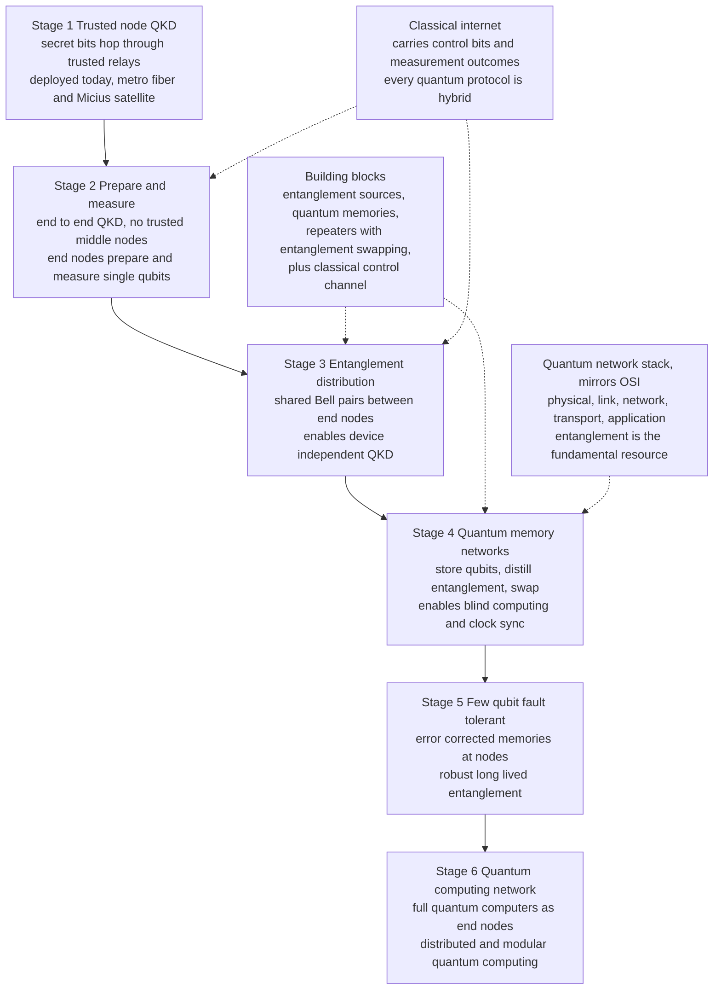

# 🌐 The Quantum Internet

> [!abstract] TL;DR
> The **quantum internet** is a network that distributes **entanglement** — shared Bell pairs — between distant nodes, exactly as today's internet distributes **bits**. It does **not** replace the classical internet; it rides *alongside* it (and depends on it for control), adding capabilities classical networks can *never* have: **provably secure keys** at scale (QKD), **blind quantum computing** on a remote server that never learns your data or algorithm, **distributed quantum computing** that stitches small processors into a bigger one, and **networked quantum sensing** (better clocks, longer-baseline telescopes, distributed metrology). The fundamental resource it delivers is not data but **correlation**: one shared entangled pair (an **ebit**) plus two classical bits lets you **teleport** an unknown qubit, so fragile quantum states never have to survive the fiber directly. The central engineering obstacle is that photon loss is **exponential** in distance and the **no-cloning theorem** forbids classical-style amplification — so long distance requires **quantum repeaters** (entanglement swapping + distillation + **quantum memories**), which turn one exponential decay into many short sub-exponential hops. Reality today: metropolitan **QKD networks** are deployed, satellite entanglement (**Micius**) spans 1200 km, and small multi-node fiber networks work (**Delft**), but memory-based long-distance repeaters remain **nascent**. The community follows a six-stage roadmap (**Wehner–Elkouss–Hanson**) from trusted-node QKD up to a full, fault-tolerant, entanglement-based quantum internet.

---

## Intuition

**Analogy — a network that ships correlation, not copies.** Picture today's internet as a global postal system for *copies of information*: any packet can be duplicated, cached, broadcast, and amplified along the way. Now imagine a second network running through the *same* buildings and cables whose job is completely different — it delivers, to any two parties who want it, **one half each of a magic pair of gloves**. Neither glove has a definite handedness until someone looks; the instant one party checks theirs, the distant partner's is fixed to the opposite. You cannot photocopy a glove in transit, and you cannot amplify it, so a courier who tries to peek is caught. What the network *delivers* is not a message but a **shared correlation** — and that correlation is a raw resource you can spend.

That is the quantum internet. It distributes **entanglement** the way the classical internet distributes **bits**. It is not a replacement — you still send ordinary email over TCP/IP — but the shared entanglement unlocks things bits alone never can: keys no eavesdropper can copy, the ability to hand a computation to a remote quantum computer *without revealing what you are computing*, and sensors on different continents that behave as one giant instrument. And crucially, the two networks are partners: every quantum protocol below finishes by sending a few ordinary **classical bits** over the old internet to complete the job.

---

## How It Works

### 1. The resource is entanglement, and teleportation is the transport

The unit the quantum internet moves is the **ebit** — one maximally [[Entanglement_and_Bell_States|entangled Bell pair]] $|\Phi^+\rangle = \tfrac{1}{\sqrt2}(|00\rangle+|11\rangle)$ shared between two nodes. You almost never ship a *payload* qubit directly. Instead, once Alice and Bob share a Bell pair, Alice can transfer an unknown qubit $|\psi\rangle$ to Bob by **quantum teleportation**: she performs a joint Bell-basis measurement on $|\psi\rangle$ and her half of the pair, then sends Bob **2 classical bits** telling him which of four corrections to apply. Bob's half becomes $|\psi\rangle$ exactly; the original is destroyed (no cloning is violated). This is why **entanglement is the fundamental network resource**: pre-distributed ebits plus a cheap classical message move quantum states *without* the fragile payload ever traversing the lossy channel.

### 2. Why you cannot just send qubits down a fiber

A photon in fiber survives with probability $\eta(L)=10^{-\alpha L/10}$, where $\alpha\approx 0.2$ dB/km. Loss is **exponential**: at 100 km $\eta\approx 1\%$, at 1000 km $\eta\approx 10^{-20}$ — roughly one photon every few thousand years at a 1 GHz source. Classically you would install **amplifiers** every few km. But the **no-cloning theorem** ([[Measurement_and_the_No_Cloning_Theorem]]) forbids copying an unknown quantum state, so amplifiers are impossible. The **Pirandola–Laurenza–Ottaviani–Banchi (PLOB) bound** makes this precise: the *ultimate* repeaterless secret-key/entanglement rate is capped at $-\log_2(1-\eta)\approx 1.44\,\eta$ ebits per mode — decaying exponentially in $L$. Direct transmission simply cannot reach continental scale.

### 3. Quantum repeaters: turn one long exponential into many short ones

A **quantum repeater** breaks a link of length $L$ into $N$ short **segments** of length $L/N$. Each segment independently generates a Bell pair (heralded, so you *know* when it succeeds). Adjacent pairs are then fused by **entanglement swapping** — a Bell measurement at the intermediate node that "teleports" entanglement outward, connecting the two end qubits that never interacted. Repeated swapping stitches the segments into one end-to-end pair. Because a segment is short, its transmissivity $\eta(L/N)$ is far higher, so the end-to-end rate scales *sub-exponentially* in $L$. Two more ingredients are essential:

- **Quantum memories** store a successfully generated segment-pair while its neighbors keep trying, so the whole chain does not have to fire simultaneously. Memory *coherence time* is the make-or-break hardware spec.
- **Entanglement distillation / purification** ([[Entanglement_Distillation_and_Quantum_Networks]]) consumes several noisy pairs to yield fewer, higher-fidelity ones, fighting the error accumulated over many swaps.

### 4. The building blocks

An end-to-end quantum network is assembled from five layers of hardware and one borrowed classical one:

1. **Entanglement sources** — spontaneous parametric down-conversion, quantum dots, or atom–photon emitters that emit heralded photon pairs.
2. **Quantum memories** — atomic ensembles, trapped ions, NV centers in diamond, or rare-earth crystals that hold a qubit long enough to synchronize swaps.
3. **Quantum repeaters** — nodes performing entanglement swapping and distillation to span distance.
4. **End nodes** — anything from a bare photon detector (enough for QKD) to a full fault-tolerant [[Quantum_Teleportation|quantum processor]] (needed for distributed computing).
5. **A classical control channel** — the ordinary internet, carrying heralding signals, measurement outcomes, and teleportation corrections. Every quantum protocol is *hybrid*: quantum resource + classical control.

### 5. What it enables that the classical internet cannot

- **Provably secure communication (QKD at scale).** [[Quantum_Key_Distribution_and_BB84|Quantum key distribution]] yields shared secret keys whose security rests on physics — an eavesdropper cannot copy or measure the qubits without detection — not on assumed math hardness. Entanglement-based QKD (E91) extends this across a network.
- **Blind quantum computing.** A client with only simple quantum hardware can delegate a computation to a remote quantum server such that the server learns *neither the input, the algorithm, nor the output* — impossible classically without fully homomorphic overhead, natural with entanglement.
- **Distributed / modular quantum computing.** Linking many small processors by entanglement (teleporting gates between them) builds one larger logical machine — the networking analog of scaling a supercomputer, and a leading path in [[Building_and_Scaling_Quantum_Computers|modular quantum architectures]].
- **Networked quantum sensing.** Sharing entanglement between distant sensors beats the classical shot-noise limit: **networked atomic clocks** synchronized below individual-clock precision, **very-long-baseline telescopes / interferometry** with entanglement-assisted photon correlation, and distributed magnetometry.
- **Anonymous transmission and quantum-secure consensus.** Multipartite entanglement (GHZ states) enables anonymous message broadcast and distributed agreement protocols with security guarantees no classical network can match.

### 6. The stages of development — the Wehner–Elkouss–Hanson roadmap

A quantum internet will not arrive all at once. The influential 2018 roadmap ranks networks by the *strongest application* each can run, each stage strictly harder than the last:

1. **Trusted-node QKD** — secret bits hop through *trusted* relay nodes; secure only if every relay is honest. (Deployed today.)
2. **Prepare-and-measure** — end-to-end QKD with *no* trusted middle nodes; end nodes prepare and measure single qubits.
3. **Entanglement distribution** — end nodes share Bell pairs; enables **device-independent** QKD and verified entanglement.
4. **Quantum-memory networks** — nodes store qubits, distill entanglement, and swap; unlocks **blind computing** and clock synchronization.
5. **Few-qubit fault-tolerant networks** — error-corrected memories give robust, long-lived entanglement.
6. **Quantum-computing networks** — full quantum computers as end nodes; arbitrary **distributed quantum computation**.

### 7. The quantum network stack

Just as the classical internet is organized into the [[OSI_Reference_Model|OSI layers]], a quantum network needs a **stack** with entanglement as the fundamental transported resource: a **physical layer** (photons, fibers, detectors, memories), a **link layer** that produces heralded entanglement between neighbors, a **network layer** that routes and swaps entanglement across long distances, a **transport layer** that delivers qubits end-to-end via teleportation, and an **application layer** (QKD, blind computing, sensing). Standardization efforts (IETF, ITU, and the EU Quantum Internet Alliance) are drafting exactly these abstractions.

### 8. Honest state of the art

Metropolitan QKD networks run in China, Europe, and elsewhere; the Beijing–Shanghai backbone spans ~2000 km using *trusted nodes* (stage 1). The **Micius** satellite distributed entangled photon pairs to ground stations 1200 km apart and enabled intercontinental QKD. **Delft/QuTech** demonstrated a three-node processor network (stage 3–4) with quantum memories. But **true long-distance, memory-based repeater links remain nascent** — memory coherence times, source rates, and swap fidelities are still short of what a continental entanglement backbone needs. The realistic near-term is QKD and small entanglement testbeds; distributed quantum computing is a longer horizon.

### Flow — the quantum-network stack and its stages of development



---

## Key Concepts

### Secondary (intuitive level)
- The quantum internet ships **entanglement** (shared "magic gloves"), not copies of data; it works *with* the ordinary internet, not instead of it.
- You cannot photocopy or amplify a quantum signal, so long distance needs **quantum repeaters** instead of ordinary amplifiers.
- Its superpowers: **unbreakable keys**, using a **remote quantum computer without revealing your data**, and **sensors that act as one giant instrument**.
- It always needs a normal classical message to finish the job — so it can never send information faster than light.

### Undergraduate (working level)
- **Ebit** as the network resource; **teleportation** (1 ebit + 2 classical bits) as the transport mechanism; **superdense coding** as its dual.
- **Exponential fiber loss** $\eta=10^{-\alpha L/10}$ and the **PLOB repeaterless bound** $-\log_2(1-\eta)$; why no-cloning forbids amplification.
- **Quantum repeater** = segmentation + **entanglement swapping** + **quantum memory** + **distillation**; sub-exponential end-to-end scaling.
- The **Wehner–Elkouss–Hanson six stages**; trusted-node vs end-to-end-entanglement security.
- The **quantum network stack** by analogy to the OSI layers; entanglement as the transported quantity.

### Graduate (theoretical level)
- **Rate-vs-distance analysis**: optimizing segment count $N$ against swap/distillation overhead; the secret-key capacity of a lossy bosonic channel and the two-way assisted capacity (PLOB); repeater rates that beat the repeaterless bound.
- **Nested purification** (Briegel–Dür–Cirac–Zoller) and the resource cost / memory-time requirements of scalable repeaters; first- vs second- vs third-generation repeaters (heralded entanglement, quantum error correction, one-way).
- **Device-independent** protocols: certifying entanglement and security from Bell-inequality violation without trusting the hardware ([[Device_Independent_and_Post_Quantum_Security]]).
- **Blind and verifiable quantum computation** (universal blind QC via measurement-based computation); distributed gate teleportation and non-local CNOT for **modular** processors.
- **Networked metrology**: entanglement-enhanced clock networks and distributed phase estimation approaching the Heisenberg limit; entanglement-assisted VLBI.

---

## Python Demo

```python
# Why a quantum internet needs REPEATERS: reach and rate vs distance.
# We compare the end-to-end entanglement-distribution rate for
#   (A) DIRECT fiber transmission  -> exponential decay (repeaterless PLOB bound)
#   (B) a REPEATER NETWORK         -> distance split into N short hops, sub-exponential
# and overlay the number of repeater nodes that the optimal split requires.
# numpy + matplotlib only.
import numpy as np
import matplotlib.pyplot as plt

# ---- Fiber and hardware parameters --------------------------------------
alpha_dB  = 0.2      # fiber loss [dB/km] at telecom 1550 nm
R_clock   = 1e9      # entanglement attempts per second (a 1 GHz source)
L_min_seg = 10.0     # shortest practical repeater spacing [km]
INV_LN2   = 1.0 / np.log(2.0)

def transmissivity(d_km):
    """Fraction of photons surviving distance d in fiber: eta = 10^(-alpha*d/10)."""
    return 10.0 ** (-alpha_dB * d_km / 10.0)

# ---- (A) Direct transmission: the repeaterless PLOB bound ----------------
# Ultimate rate with NO repeaters ~ -log2(1-eta) ~ 1.44*eta ebits/mode.
# Use the small-eta linear form to stay numerically stable at huge distance.
def rate_direct(L_km):
    return R_clock * transmissivity(L_km) * INV_LN2   # ebits / s

# ---- (B) Repeater chain: split L into N segments with memories + swapping -
# Simplified model: end-to-end rate ~ R_clock * eta(segment) / overhead(N),
# where overhead ~ N stands in for probabilistic swapping and synchronization.
def rate_repeater(L_km, N):
    return R_clock * transmissivity(L_km / N) / N

def best_repeater(L_km):
    """Pick the number of segments N that maximizes the end-to-end rate."""
    Nmax = max(1, int(L_km // L_min_seg))
    Ns = np.arange(1, Nmax + 1)
    rates = R_clock * transmissivity(L_km / Ns) / Ns
    i = int(np.argmax(rates))
    return rates[i], int(Ns[i])

# ---- Sweep distance from metro to continental scale ----------------------
L = np.linspace(10, 2000, 400)                    # 10 km ... 2000 km
r_direct = np.array([rate_direct(x) for x in L])
rep      = [best_repeater(x) for x in L]
r_rep    = np.array([a for a, _ in rep])
N_opt    = np.array([n for _, n in rep])

# ---- Plots ---------------------------------------------------------------
fig, ax = plt.subplots(1, 2, figsize=(12, 4.5))

ax[0].semilogy(L, r_direct, color="#dc2626", lw=2,
               label="direct fiber (PLOB, no repeater)")
ax[0].semilogy(L, r_rep, color="#059669", lw=2,
               label="repeater network (optimized)")
ax[0].set_title("Entanglement rate vs distance")
ax[0].set_xlabel("distance L  [km]")
ax[0].set_ylabel("rate  [ebits / s]")
ax[0].set_ylim(1e-30, 1e11)
ax[0].grid(True, which="both", alpha=0.3)
ax[0].legend()

ax[1].plot(L, N_opt - 1, color="#7c3aed", lw=2)
ax[1].set_title("Repeater nodes needed vs distance")
ax[1].set_xlabel("distance L  [km]")
ax[1].set_ylabel("number of repeater nodes")
ax[1].grid(True, alpha=0.3)

plt.tight_layout()
plt.show()

# ---- Numeric takeaways ---------------------------------------------------
print("  L(km)   direct(ebit/s)  repeater(ebit/s)  nodes   repeater/direct")
for x in (100, 500, 1000, 2000):
    rd = rate_direct(x)
    rr, n = best_repeater(x)
    print(f"  {x:5d}   {rd:13.3e}   {rr:14.3e}   {n-1:5d}   {rr/rd:15.3e}")

# Expected output (approximately):
#   L(km)   direct(ebit/s)  repeater(ebit/s)  nodes   repeater/direct
#     100       1.443e+07        7.962e+07       4         5.518e+00
#     500       1.443e-01        1.598e+07      22         1.108e+08
#    1000       1.443e-11        7.988e+06      45         5.537e+17
#    2000       1.443e-31        3.994e+06      91         2.768e+37
```

The table is the whole argument. At **100 km** the two schemes are comparable — repeaters barely help, and their overhead can even lose to a direct link at very short range. But the direct rate falls off a cliff: by **1000 km** it is $\sim 10^{-11}$ ebits/s (one pair every ~2000 years), while a repeater network still delivers **~8 million ebits per second** — a gain of over $10^{17}$. The catch is visible in the right panel: the optimal number of repeater nodes grows roughly **linearly** with distance (about one node every ~20 km), so a continental backbone needs *dozens to hundreds* of memory-equipped stations. That linear hardware cost buying a super-exponential rate advantage is precisely why quantum repeaters are the non-negotiable centerpiece of any global quantum internet.

---

## Real-World Applications

- **Metropolitan and backbone QKD (stage 1).** China's ~2000 km Beijing–Shanghai trunk and city networks in Europe and Asia deliver [[Quantum_Key_Distribution_and_BB84|QKD]] keys today using *trusted* relay nodes — useful now, but a security compromise the later stages remove.
- **Satellite entanglement distribution — Micius.** The Chinese satellite distributed entangled photon pairs to ground stations 1200 km apart and enabled an intercontinental (Beijing–Vienna) quantum-secured video call, sidestepping fiber loss by going through low-loss free space.
- **Multi-node fiber testbeds — Delft/QuTech.** A three-node NV-center network demonstrated deterministic entanglement delivery, entanglement swapping, and a working link layer — the first taste of stages 3–4. The EU **Quantum Internet Alliance** aims to link Delft, The Hague, and Leiden.
- **Blind quantum computing demos.** Photonic experiments have delegated computations to a server that provably learns neither input nor algorithm — the security model that makes *cloud* quantum computing trustworthy.
- **Networked sensing and clocks.** Proposals and early experiments use shared entanglement to synchronize distant atomic clocks below single-clock precision and to extend telescope baselines (entanglement-assisted VLBI) for sharper astronomical imaging.

---

## Common Pitfalls

- **"The quantum internet replaces the classical internet."** No — it *complements* it and *depends* on it. Every protocol (teleportation, QKD, swapping) finishes by sending ordinary classical bits over the existing internet for control and corrections.
- **"Entanglement lets nodes communicate faster than light."** Shared entanglement alone transmits nothing; the correlation is invisible until parties compare classical results. Teleportation *requires* the 2-bit classical message, keeping relativity intact.
- **"Just amplify the quantum signal like a classical repeater."** The **no-cloning theorem** forbids copying an unknown state, so amplification is impossible. Quantum repeaters are a fundamentally different beast — entanglement swapping and distillation with memories, not signal boosting.
- **"Deployed QKD means we already have a quantum internet."** Trusted-node QKD is stage 1 of six; it is *not* end-to-end entanglement, and each trusted relay is a point the security assumption could fail. True memory-based repeater networks remain nascent.
- **"Better lasers alone will fix the rate."** The bottleneck is not source brightness but **exponential loss** plus **quantum-memory coherence time** and **swap fidelity**. Without long-lived memories, segments cannot be synchronized and the sub-exponential advantage evaporates.
- **"More entanglement = more raw bandwidth for classical data."** Entanglement is not extra classical capacity; Holevo's bound still caps classical readout at 1 bit per qubit. What entanglement buys is *new capabilities* (security, blind computing, sensing), not a fatter pipe for ordinary data.

---

## Related Concepts

- [[Quantum_Teleportation]] — the transport mechanism of the quantum internet: 1 shared ebit + 2 classical bits move an unknown qubit, so payload qubits never traverse the lossy channel.
- [[Entanglement_Distillation_and_Quantum_Networks]] — the repeater machinery (entanglement swapping, purification, memories) that spans distance and beats the repeaterless bound.
- [[Quantum_Key_Distribution_and_BB84]] — the first and most mature killer app; the earliest stages of the roadmap are QKD networks.
- [[Superdense_Coding]] — the dual of teleportation (1 qubit + 1 ebit carries 2 classical bits); together they define the entanglement-assisted channel primitives.
- [[Device_Independent_and_Post_Quantum_Security]] — security certified from Bell-violation without trusting hardware; the security layer of an entanglement-distribution network.
- [[Building_and_Scaling_Quantum_Computers]] — end nodes as full processors; distributed/modular architectures link small chips into one machine via networked entanglement.
- [[Entanglement_and_Bell_States]] — the Bell pair (ebit) is the fundamental resource the network distributes; monogamy underpins its security.
- [[Measurement_and_the_No_Cloning_Theorem]] — no-cloning forbids amplification (forcing repeaters) and simultaneously makes eavesdropping detectable (enabling QKD).
- [[Quantum_Information_Theory]] — quantum channel capacity, the PLOB repeaterless bound, and Holevo's limit that frame what the network can and cannot deliver.
- [[OSI_Reference_Model]] — the classical layered stack the emerging quantum network stack is deliberately modeled on.

---

## Review Questions

**Tier 1 — Conceptual (explain to a peer):**
1. Using the "magic gloves" analogy, explain what the quantum internet *delivers* and why it complements rather than replaces the classical internet. Name one capability it adds that bits alone can never provide.
2. Why can't you extend a quantum link to 1000 km simply by installing amplifiers every few kilometers, the way classical networks do?

**Tier 2 — Applied (compute / reason):**
3. Fiber loss is $\eta=10^{-0.02L}$ (with $L$ in km). Compare the surviving fraction over a single 200 km link versus ten 20 km segments. Explain, using entanglement swapping, why splitting the distance turns an exponential decay into a sub-exponential one.
4. A network is at "stage 3" (entanglement distribution) but lacks quantum memories. Which of the roadmap's applications (blind computing, clock synchronization, distributed quantum computing) does it *unlock*, and which must wait for "stage 4"? Why do memories matter?

**Tier 3 — Theoretical (deep understanding):**
5. State the PLOB repeaterless bound and explain why it caps *any* direct-transmission scheme. Then argue why a repeater network can exceed it, and identify the physical resource (hint: memory coherence time and swap fidelity) that ultimately limits the repeater rate.
6. Blind quantum computing lets a client use a remote quantum server without revealing input, algorithm, or output. Explain conceptually how shared entanglement plus classical communication achieves this, and why an analogous *classical* guarantee would require prohibitively expensive fully-homomorphic machinery.

---

## Sources

- Wehner, S., Elkouss, D. & Hanson, R. (2018). *Quantum internet: A vision for the road ahead.* Science, 362, eaam9288. — the six-stage roadmap and the definitive framing of the field.
- Kimble, H. J. (2008). *The quantum internet.* Nature, 453, 1023–1030. — the foundational vision paper (nodes, channels, quantum networks).
- Pirandola, S., Laurenza, R., Ottaviani, C. & Banchi, L. (2017). *Fundamental limits of repeaterless quantum communications.* Nature Communications, 8, 15043. — the PLOB repeaterless capacity bound.
- Yin, J. et al. (2017). *Satellite-based entanglement distribution over 1200 kilometers.* Science, 356, 1140–1144. — the Micius satellite experiment.
- Pompili, M. et al. (2021). *Realization of a multinode quantum network of remote solid-state qubits.* Science, 372, 259–264. — the Delft three-node network.
- Briegel, H.-J., Dür, W., Cirac, J. I. & Zoller, P. (1998). *Quantum repeaters: The role of imperfect local operations in quantum communication.* Physical Review Letters, 81, 5932. — the original quantum-repeater proposal.

---

#quantum-computing #quantum-internet #quantum-network #entanglement-distribution #distributed-quantum
