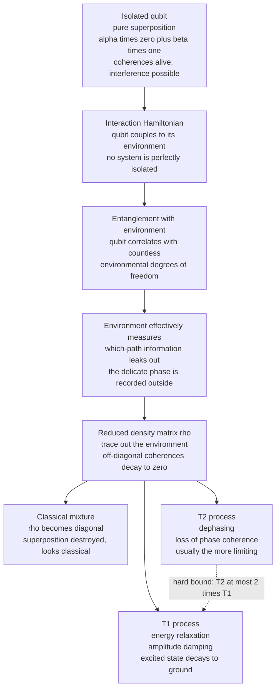

# 🌫️ Decoherence and Quantum Noise

> [!abstract] TL;DR
> A qubit is *never* perfectly isolated. Its unavoidable interaction with the surrounding environment **entangles** it with countless uncontrolled degrees of freedom, which effectively **measures** it and drains away the delicate phase relationships that make a superposition quantum. In the density-matrix picture this shows up as the **off-diagonal coherences $\rho_{01}$ decaying exponentially**, turning a pure superposition into a classical statistical mixture — **decoherence**. Two timescales govern it: **$T_1$** (energy relaxation / amplitude damping — the excited state decaying to ground) and **$T_2$** (dephasing / loss of phase coherence), with the hard constraint $T_2 \le 2T_1$. Decoherence is simultaneously *why the macroscopic world looks classical* and *why quantum computers are so hard to build*: gate operations must finish far faster than $T_1$ and $T_2$. The saving grace is the **discretization of errors** — although physical noise is a continuous rotation, correcting the discrete Pauli errors $X$, $Y$, $Z$ suffices, which is exactly what makes quantum error correction possible.

---

## Intuition

**Analogy — the spinning top on a crowded table.** Picture a qubit as a perfectly balanced spinning top, its axis pointing in some precise direction that encodes both a "how much 0 versus 1" and a delicate *phase* (which way it is tilted around the vertical). In a vacuum, on a frictionless table, it would spin forever in a clean, predictable way — that is **unitary evolution**, reversible and lossless. But the real table is crowded: air molecules buffet it, the surface has tiny vibrations, a draft nudges it. Each bump is minuscule, but there are *countless* of them, and every bump carries away a little information about which way the top was leaning. Very quickly the environment has, in effect, "read" the top's orientation. The top wobbles, its precise phase smears into randomness, and it topples toward the table — settling into a boring, definite, classical state.

That leaking-away is **decoherence**. The quantum information does not vanish — it *escapes* into the environment's astronomically many degrees of freedom, where you can no longer retrieve or reverse it. What is left behind looks exactly like a classical coin that was always secretly heads or tails. The entire engineering challenge of quantum computing is keeping the top spinning cleanly — preserving **coherence** — long enough to finish a computation before the environment measures it for you.

---

## How It Works

### Core mechanics

1. **No qubit is an island.** A real qubit is coupled to an environment (electromagnetic field, phonons in the substrate, nearby two-level defects, control wiring, stray magnetic flux). Write the total Hamiltonian as $H = H_{\text{sys}} + H_{\text{env}} + H_{\text{int}}$. The interaction term $H_{\text{int}}$ is the culprit: it correlates the system with the environment.

2. **Interaction creates entanglement.** Start with a clean product state $(\alpha\lvert 0\rangle + \beta\lvert 1\rangle)\otimes\lvert E_0\rangle$. Because different qubit states push the environment into *different* configurations, unitary evolution of the whole thing produces $\alpha\lvert 0\rangle\lvert E_0\rangle + \beta\lvert 1\rangle\lvert E_1\rangle$ — the qubit is now **entangled** with the environment. This is ordinary, reversible Schrödinger evolution of the *closed* total system; nothing mystical happens.

3. **The environment "measures" the qubit.** As $\lvert E_0\rangle$ and $\lvert E_1\rangle$ become nearly orthogonal ($\langle E_0\vert E_1\rangle \to 0$), the environment has recorded *which-path* information — it has effectively performed a measurement (see [[Measurement_and_the_No_Cloning_Theorem]]). You do not control or read the environment, so from the qubit's point of view the phase relationship is simply *gone*.

4. **Trace out the environment → the reduced density matrix.** Since the environment is inaccessible, the correct description of the qubit alone is the **reduced density matrix** $\rho = \mathrm{Tr}_{\text{env}}\lvert\Psi\rangle\langle\Psi\rvert$ (see [[Linear_Algebra_for_Quantum_Computing]] for the partial trace). The overlap $\langle E_0\vert E_1\rangle$ multiplies the **off-diagonal coherence** terms:
$$\rho = \begin{pmatrix} \lvert\alpha\rvert^2 & \alpha\beta^{*}\,\langle E_1\vert E_0\rangle \\ \alpha^{*}\beta\,\langle E_0\vert E_1\rangle & \lvert\beta\rvert^2 \end{pmatrix} \;\xrightarrow[\text{decoherence}]{\langle E_0\vert E_1\rangle\to 0}\; \begin{pmatrix} \lvert\alpha\rvert^2 & 0 \\ 0 & \lvert\beta\rvert^2 \end{pmatrix}.$$
The diagonal (populations) survives; the off-diagonals (coherences, the interference-carrying phase) decay to zero. A **pure superposition** has become a **classical mixture** — indistinguishable from "the qubit was always either 0 or 1, we just did not know which."

5. **Two timescales, $T_1$ and $T_2$.**
   - **$T_1$ — energy relaxation (amplitude damping).** The excited state $\lvert 1\rangle$ loses energy to the environment and decays toward the ground state $\lvert 0\rangle$: the excited-state population obeys $\rho_{11}(t) = \rho_{11}(0)\,e^{-t/T_1}$. This is a *population* process — the diagonal changes.
   - **$T_2$ — dephasing (coherence time).** The relative phase between $\lvert 0\rangle$ and $\lvert 1\rangle$ randomizes: the coherence obeys $\rho_{01}(t) = \rho_{01}(0)\,e^{-t/T_2}$. This is usually the *more limiting* number, and it is what actually kills interference.
   - **The constraint $T_2 \le 2T_1$.** Any energy-relaxation event also destroys phase, so $T_1$ imposes a hard ceiling on coherence: $\frac{1}{T_2} = \frac{1}{2T_1} + \frac{1}{T_\phi}$, where $T_\phi$ is the *pure* dephasing time. When there is no pure dephasing ($T_\phi \to \infty$) the qubit is "$T_1$-limited" and $T_2 = 2T_1$; extra dephasing only shortens $T_2$.

6. **Noise as a quantum channel (CPTP map).** Any physical noise process is a **completely-positive trace-preserving (CPTP) map** $\mathcal{E}$, expressible with **Kraus operators** $\{K_k\}$:
$$\mathcal{E}(\rho) = \sum_k K_k\,\rho\,K_k^{\dagger}, \qquad \sum_k K_k^{\dagger}K_k = I.$$
The canonical single-qubit channels: **bit flip** $X$, **phase flip** $Z$, **bit-phase flip** $Y$, **depolarizing** (a mix of $X,Y,Z$), **amplitude damping** (the $T_1$ channel, Kraus $K_0=\begin{psmallmatrix}1&0\\0&\sqrt{1-\gamma}\end{psmallmatrix},\,K_1=\begin{psmallmatrix}0&\sqrt{\gamma}\\0&0\end{psmallmatrix}$), and **phase damping / dephasing** (the $T_\phi$ channel). This is the working formalism of *open quantum systems* (see [[Quantum_Information_Theory]]).

7. **The discretization-of-errors miracle.** Real errors are *continuous* — a tiny over-rotation by angle $\epsilon$, $R = e^{-i\epsilon Z/2} \approx I - i\tfrac{\epsilon}{2}Z$. It looks hopeless to correct a continuum. But *any* single-qubit operation expands in the Pauli basis $\{I, X, Y, Z\}$, and when a stabilizer measurement is performed it **projects** the error onto exactly one discrete Pauli outcome. So correcting the four discrete Paulis suffices to correct *arbitrary* continuous noise. This is the single most important fact that makes quantum error correction possible at all, rather than a fight against an infinite-precision analog machine.

8. **Emergence of classicality.** Decoherence explains *why the everyday world looks classical*. A macroscopic object couples to its environment so strongly that its coherences vanish in unimaginably short times, selecting a stable "pointer basis" (position) — this is **einselection** (Zurek). Superpositions of live-and-dead cats are not forbidden; they simply decohere essentially instantaneously. Quantum computing is the deliberate, heroic effort to hold off this process (see [[Wave_Particle_Duality_and_Uncertainty]] and [[Many_Body_Quantum_Systems]]).

### Diagram



---

## Key Concepts

### 🟢 Secondary (accessible)
- A qubit is like a spinning top that must stay perfectly balanced; the environment constantly nudges it and the fragile superposition **leaks away** into the surroundings.
- **Decoherence** is the enemy: the quantum "phase" information escapes into the environment and cannot be pulled back.
- Two clocks are ticking: **$T_1$** is how long the qubit keeps its energy (before flopping from 1 down to 0), and **$T_2$** is how long it keeps its *phase* (the truly quantum part). $T_2$ is usually the shorter, more painful one.
- This is *why the ordinary world looks classical* — big objects decohere so fast you never see a coffee mug in two places at once.
- It is also *why quantum computers are hard*: you must finish the whole computation before the environment "measures" your qubits for you.

### 🟡 Undergraduate (working level)
- **Density matrix $\rho$ as the state of an open system.** Populations sit on the diagonal ($\rho_{00}, \rho_{11}$), **coherences** on the off-diagonal ($\rho_{01}, \rho_{10}$). Decoherence = the off-diagonals shrinking to zero; the state's purity $\mathrm{Tr}(\rho^2)$ drops from 1 toward $1/2$.
- **Bloch-ball picture.** A pure state sits on the surface ($\lvert\vec r\rvert = 1$). Dephasing collapses the transverse components $r_x, r_y$ (coherence) toward the axis; amplitude damping drags $r_z$ toward the ground-state pole. A **shrinking Bloch vector** *is* decoherence made geometric.
- **$T_1$ vs $T_2$.** $\rho_{11}(t)=\rho_{11}(0)e^{-t/T_1}$ (relaxation); $\lvert\rho_{01}(t)\rvert = \lvert\rho_{01}(0)\rvert e^{-t/T_2}$ (dephasing); constraint $T_2 \le 2T_1$ via $\tfrac{1}{T_2}=\tfrac{1}{2T_1}+\tfrac{1}{T_\phi}$.
- **The gate-time requirement.** A gate of duration $t_g$ incurs error roughly $\sim t_g/T_2$. Useful computation needs $t_g \ll T_2$; the ratio $T_2/t_g$ (coherence time over gate time) is a headline hardware figure of merit.
- **Error channels.** Bit flip $X$, phase flip $Z$, bit-phase flip $Y$, depolarizing, amplitude damping, phase damping — memorize these six; every noise model is built from them.
- **Discretization of errors.** Continuous noise → expand in $\{I,X,Y,Z\}$ → syndrome measurement projects onto a discrete Pauli → correct that. Continuous problem, discrete fix.

### 🔴 Graduate (theoretical level)
- **CPTP maps and the Kraus (operator-sum) representation.** $\mathcal{E}(\rho)=\sum_k K_k\rho K_k^{\dagger}$ with $\sum_k K_k^{\dagger}K_k=I$; equivalently the **Stinespring dilation** $\mathcal{E}(\rho)=\mathrm{Tr}_{\text{env}}\big[U(\rho\otimes\lvert E_0\rangle\langle E_0\rvert)U^{\dagger}\big]$ — every channel is unitary evolution on a larger space followed by discarding the environment. This *is* decoherence.
- **Lindblad master equation.** For Markovian environments, $\dot\rho = -\tfrac{i}{\hbar}[H,\rho] + \sum_k\big(L_k\rho L_k^{\dagger} - \tfrac12\{L_k^{\dagger}L_k,\rho\}\big)$. Jump operators $L=\sqrt{1/T_1}\,\sigma_-$ give amplitude damping; $L=\sqrt{1/2T_\phi}\,\sigma_z$ gives pure dephasing. Non-Markovian (memory) environments require more (e.g. the Redfield or hierarchical-equations approaches).
- **Einselection and the pointer basis.** The environment continuously monitors the observable that commutes with $H_{\text{int}}$, dynamically *selecting* a preferred basis in which coherences are robust — the mechanism behind the quantum-to-classical transition (Zurek).
- **The Pauli twirl and error discretization, rigorously.** Twirling an arbitrary channel over the Pauli group produces a **Pauli channel**; combined with the projective nature of stabilizer syndrome extraction, this is why a code correcting $\{X,Y,Z\}$ on the relevant qubits corrects *any* CPTP error of low enough weight — the formal basis of fault tolerance and the **threshold theorem**.
- **Noise characterization.** **Randomized benchmarking** extracts an average gate error (error-per-Clifford) robustly against SPAM errors; **gate-set / process tomography** reconstructs the full channel; **$T_1/T_2$ (and $T_2^{*}$ vs echo $T_2$)** are measured by inversion-recovery and Ramsey/Hahn-echo experiments. **Dynamical decoupling** (CPMG pulse trains) actively refocuses low-frequency dephasing, extending $T_2$ toward $2T_1$.

---

## Python Demo

```python
# Decoherence of a single qubit via the density matrix, using ONLY numpy + matplotlib.
#
# We start in the equator state |+> = (|0> + |1>)/sqrt(2), whose density matrix has
# LARGE off-diagonal coherence.  We then apply two quantum channels, expressed with
# Kraus operators, repeatedly over small time steps:
#     * amplitude damping   -> the T1 process (|1> decays to |0>)
#     * phase damping       -> the pure-dephasing (T_phi) process
# and watch:
#     (1) the off-diagonal coherence |rho_01| decay exponentially at rate 1/T2,
#     (2) the excited-state population rho_11 decay at rate 1/T1,
#     (3) the Bloch-vector length shrink (superposition leaking away).
#
# Micro-rate bookkeeping:  1/T2 = 1/(2*T1) + 1/T_phi   (this is why T2 <= 2*T1).
import numpy as np
import matplotlib.pyplot as plt

# Pauli matrices, used only to read off the Bloch vector r = (Tr[X.rho], Tr[Y.rho], Tr[Z.rho]).
X = np.array([[0, 1], [1, 0]], dtype=complex)
Y = np.array([[0, -1j], [1j, 0]], dtype=complex)
Z = np.array([[1, 0], [0, -1]], dtype=complex)

def bloch_vector(rho):
    """|r| = 1 for a pure state (surface), 0 for the maximally mixed state (center)."""
    return np.array([np.trace(X @ rho).real,
                     np.trace(Y @ rho).real,
                     np.trace(Z @ rho).real])

def apply_channel(rho, kraus):
    """A CPTP map:  rho -> sum_k K_k rho K_k^dagger."""
    return sum(K @ rho @ K.conj().T for K in kraus)

def kraus_amp_damp(gamma):
    """Amplitude damping (T1): excited |1> decays to ground |0> with probability gamma."""
    K0 = np.array([[1, 0], [0, np.sqrt(1 - gamma)]], dtype=complex)
    K1 = np.array([[0, np.sqrt(gamma)], [0, 0]], dtype=complex)
    return [K0, K1]

def kraus_phase_damp(lam):
    """Pure dephasing (T_phi): scrambles phase, leaves populations untouched."""
    K0 = np.array([[1, 0], [0, np.sqrt(1 - lam)]], dtype=complex)
    K1 = np.array([[0, 0], [0, np.sqrt(lam)]], dtype=complex)
    return [K0, K1]

def evolve(T1, T2, dt=0.5, tmax=400.0):
    inv_Tphi = 1.0 / T2 - 1.0 / (2.0 * T1)          # pure-dephasing rate
    assert inv_Tphi >= -1e-12, "unphysical: requires T2 <= 2*T1"
    gamma = 1.0 - np.exp(-dt / T1)                   # amp-damp prob per step
    lam   = 1.0 - np.exp(-2.0 * dt * max(inv_Tphi, 0.0))  # dephasing prob per step
    Ka, Kp = kraus_amp_damp(gamma), kraus_phase_damp(lam)

    rho = 0.5 * np.array([[1, 1], [1, 1]], dtype=complex)  # |+><+| : on the equator
    ts, coh, pop_e, rlen = [], [], [], []
    for n in range(int(tmax / dt) + 1):
        ts.append(n * dt)
        coh.append(abs(rho[0, 1]))                   # off-diagonal coherence
        pop_e.append(rho[1, 1].real)                 # excited-state population
        rlen.append(np.linalg.norm(bloch_vector(rho)))
        rho = apply_channel(rho, Ka)                 # T1 channel
        rho = apply_channel(rho, Kp)                 # T_phi channel
    return map(np.array, (ts, coh, pop_e, rlen))

cases = [
    ("T1=100, T2=200  (T1-limited, T2 = 2*T1)", 100, 200, "#7c3aed"),
    ("T1=100, T2=120",                           100, 120, "#059669"),
    ("T1=100, T2=40   (dephasing-dominated)",    100,  40, "#dc2626"),
]

fig, ax = plt.subplots(1, 3, figsize=(15, 4.2))
for label, T1, T2, c in cases:
    t, coh, pe, rl = evolve(T1, T2)
    ax[0].plot(t, coh / coh[0], color=c, label=label)
    ax[0].plot(t, np.exp(-t / T2), color=c, ls=":", lw=1)   # analytic exp(-t/T2)
    ax[1].plot(t, pe, color=c, label=label)
    ax[2].plot(t, rl, color=c, label=label)

ax[0].set_title("Coherence |rho_01| decays as exp(-t / T2)")
ax[0].set_xlabel("time"); ax[0].set_ylabel("normalized coherence")
ax[0].legend(fontsize=7)

ax[1].set_title("Excited population decays as exp(-t / T1)")
ax[1].set_xlabel("time"); ax[1].set_ylabel("P(excited) = rho_11")
ax[1].legend(fontsize=7)

ax[2].set_title("Bloch-vector length: the superposition leaks away")
ax[2].set_xlabel("time"); ax[2].set_ylabel("|r|   (1 = pure surface, 0 = center)")
ax[2].legend(fontsize=7)

plt.tight_layout(); plt.show()

# Numerical check that the fitted coherence-decay rate matches 1/T2.
t, coh, pe, rl = evolve(100, 40)
fit_rate = -np.polyfit(t[:120], np.log(coh[:120] / coh[0]), 1)[0]
print(f"Dephasing-dominated case: fitted 1/T2 = {fit_rate:.5f}, expected {1/40:.5f}")
print("Dotted lines (analytic exp(-t/T2)) lie exactly on the simulated coherence curves.")
```

What the three panels show: **(1)** the off-diagonal coherence collapses exponentially, faster the shorter $T_2$ is, with the analytic $e^{-t/T_2}$ (dotted) landing exactly on the Kraus-simulated curve — this *is* the loss of superposition. **(2)** The excited population relaxes at the slower $T_1$ rate, independent of the dephasing. **(3)** The Bloch-vector length dips as the state loses purity (transverse coherence gone) and, because amplitude damping ultimately drives the qubit toward the *pure* ground-state pole, it partially re-lengthens — a faithful reminder that decoherence first scrambles phase and only then settles populations. The printed line confirms the fitted decay rate equals $1/T_2$ to numerical precision.

---

## Real-World Applications

- **Superconducting qubits (IBM, Google, Rigetti).** Transmons live in a dilution refrigerator at ~15 mK precisely to suppress thermal excitations that shorten $T_1$. Coherence times have climbed from nanoseconds (circa 1999) to hundreds of microseconds today, with single-qubit gates in tens of nanoseconds — the ratio $T_2/t_g$ of a few thousand is what makes them viable, yet still far from fault tolerance. Dominant noise: two-level-system defects in oxides, quasiparticles, flux noise, and even **cosmic-ray / ionizing-radiation bursts** that briefly wreck many qubits at once.
- **Trapped ions (IonQ, Quantinuum).** Hyperfine qubit states enjoy enormous $T_2$ (seconds and beyond), so the limiting noise is *not* decoherence of the memory but control imperfections, motional-mode heating, and laser phase noise during gates. Different platform, different noise budget.
- **Dynamical decoupling in the wild.** CPMG and XY-8 pulse sequences are applied on real hardware (NV centers in diamond, spin qubits, superconductors) to refocus slow dephasing and push measured $T_2$ toward the $2T_1$ ceiling — active *error suppression* that costs no extra qubits.
- **NISQ error mitigation.** Because today's devices are **noisy and not yet error-corrected**, running deep circuits accumulates decoherence until results are noise. Techniques such as zero-noise extrapolation and probabilistic error cancellation trade many extra shots for a bias-corrected expectation value — a stopgap until full **quantum error correction** and **fault tolerance** (surface codes, the threshold theorem) can suppress logical error rates below any target.
- **Benchmarking every chip.** Randomized benchmarking and $T_1/T_2$ characterization are run continuously in production to calibrate gates, map "hot" qubits to avoid, and track drift — decoherence metrics are the daily vital signs of a quantum processor.

---

## Common Pitfalls

- **"Decoherence is measurement collapse — it's magic."** No. Decoherence is *ordinary unitary evolution* of the system-plus-environment; only when you trace out the inaccessible environment does the qubit's reduced state *look* collapsed. It is entanglement leakage, not a new law of physics (see [[Measurement_and_the_No_Cloning_Theorem]]).
- **Confusing $T_1$ with $T_2$.** $T_1$ is *energy* loss (populations, the diagonal); $T_2$ is *phase* loss (coherences, the off-diagonal). You can have long $T_1$ but short $T_2$ — dephasing usually strikes first and is the one that kills interference.
- **Forgetting the $T_2 \le 2T_1$ ceiling.** Quoting a $T_2$ larger than $2T_1$ is physically impossible; it usually means a measurement or fitting error. Relaxation *itself* dephases, so $T_1$ caps $T_2$.
- **Reporting $T_2^{*}$ as $T_2$.** The Ramsey $T_2^{*}$ includes slow, quasi-static inhomogeneous dephasing and is *shorter* than the Hahn-echo $T_2$, which refocuses it. Compare like with like, and state the measurement.
- **"Continuous noise means error correction is impossible."** The opposite: syndrome measurement **projects** continuous errors onto discrete Paulis, so correcting $\{X, Y, Z\}$ handles arbitrary noise. Missing this is missing the whole reason QEC works.
- **Adding channels in the wrong order or double-counting.** Amplitude damping *already* contributes $1/(2T_1)$ to the dephasing rate; adding a separate "$1/T_2$" pure-dephasing term on top double-counts. Always decompose as $1/T_2 = 1/(2T_1) + 1/T_\phi$ and use $T_\phi$ for the *pure* part.
- **Assuming noise is always Markovian.** Real environments have memory (1/f flux noise, TLS switching). Modeling everything with a simple Lindblad/exponential decay can badly mispredict deep-circuit behavior; non-Markovian effects and correlated (crosstalk, cosmic-ray) errors matter.

---

## Related Concepts

- [[Measurement_and_the_No_Cloning_Theorem]] — decoherence *is* the environment effectively measuring the qubit; the density matrix and the pointer-basis discussion started there are the foundation here, and no-cloning is exactly why you cannot beat noise by backing qubits up.
- [[Linear_Algebra_for_Quantum_Computing]] — the density matrix, partial trace, and Kronecker/tensor structure used to trace out the environment are developed there; decoherence is those tools applied to open systems.
- [[Qubits_and_the_Bloch_Sphere]] — the Bloch ball makes decoherence geometric: dephasing shrinks the transverse ($x,y$) components, amplitude damping drags $z$ toward a pole, purity leaves the surface.
- [[Quantum_Information_Theory]] — CPTP maps, Kraus operators, von Neumann entropy, and the full open-systems/quantum-channel formalism live here.
- [[Wave_Particle_Duality_and_Uncertainty]] — decoherence explains the quantum-to-classical transition and the *appearance* of wave-function collapse via environmental entanglement.
- [[Schrodinger_Equation]] — unitary, reversible closed-system evolution is the contrast case; decoherence is what open-system, non-unitary dynamics looks like once the environment is discarded.
- [[Many_Body_Quantum_Systems]] — the environment is a many-body system with astronomically many degrees of freedom; einselection and emergent classicality are many-body phenomena.
- [[Quantum_Gates_and_Circuits]] — gate fidelity is bounded by the ratio of gate time to $T_1$/$T_2$; every gate races the decoherence clock.
- [[Entanglement_and_Bell_States]] — decoherence is entanglement with the *wrong* partner (the environment), and it is precisely what degrades the useful entanglement inside a computation.

---

## Review Questions

**Tier 1 — Conceptual (explain to a peer):**
1. Using the spinning-top-on-a-crowded-table analogy, explain what decoherence is and why the quantum information is not destroyed but *leaks away*. Where does it go, and why can't you get it back?
2. Distinguish $T_1$ from $T_2$ in plain language. Which one usually limits a computation first, and why does $T_1$ nonetheless put a hard ceiling on $T_2$?

**Tier 2 — Applied (compute / reason):**
3. A qubit is prepared in $\lvert +\rangle = \tfrac{1}{\sqrt2}(\lvert 0\rangle + \lvert 1\rangle)$. Write its density matrix, identify the coherence terms, and describe what happens to the matrix (and to the Bloch vector) under (a) pure dephasing only, and (b) amplitude damping only. Where does each end up on the Bloch ball?
4. A device has $T_1 = 120\,\mu\text{s}$ and $T_\phi = 80\,\mu\text{s}$. Compute $T_2$. If a two-qubit gate takes $300\,\text{ns}$, estimate the per-gate dephasing error and roughly how many such gates you can run before coherence is essentially gone.

**Tier 3 — Theoretical (deep understanding):**
5. State the discretization-of-errors principle. Starting from a continuous over-rotation $e^{-i\epsilon Z/2}$, explain precisely how expanding in the Pauli basis plus a projective stabilizer measurement converts a continuous error into a discrete one that a code can correct. Why is this the linchpin of fault tolerance?
6. Derive (or justify) the constraint $\tfrac{1}{T_2} = \tfrac{1}{2T_1} + \tfrac{1}{T_\phi}$ and hence $T_2 \le 2T_1$. Then explain how a Hahn echo or CPMG dynamical-decoupling sequence pushes the *measured* coherence time back toward the $2T_1$ ceiling, and what class of noise it cannot fix.

---

## Sources

- Nielsen, M. A. & Chuang, I. L. (2010). *Quantum Computation and Quantum Information* (10th Anniversary ed.), Chapter 8 "Quantum noise and quantum operations" (Kraus/operator-sum representation, amplitude and phase damping, depolarizing channel). Cambridge University Press.
- Zurek, W. H. (2003). "Decoherence, einselection, and the quantum origins of the classical." *Reviews of Modern Physics*, 75, 715–775. — the definitive account of decoherence and the emergence of classicality.
- Breuer, H.-P. & Petruccione, F. (2002). *The Theory of Open Quantum Systems.* Oxford University Press. — Lindblad master equation, CPTP maps, Markovian and non-Markovian dynamics.
- Krantz, P., Kjaergaard, M., Yan, F., Orlando, T. P., Gustavsson, S. & Oliver, W. D. (2019). "A quantum engineer's guide to superconducting qubits." *Applied Physics Reviews*, 6, 021318. — $T_1$/$T_2$, real hardware noise sources, dynamical decoupling.
- Preskill, J. (2018). "Quantum Computing in the NISQ era and beyond." *Quantum*, 2, 79. — why current devices are noise-limited and the road to fault tolerance. [https://quantum-journal.org/papers/q-2018-08-06-79/](https://quantum-journal.org/papers/q-2018-08-06-79/)

---

#quantum-computing #decoherence #quantum-noise #t1-t2 #density-matrix
