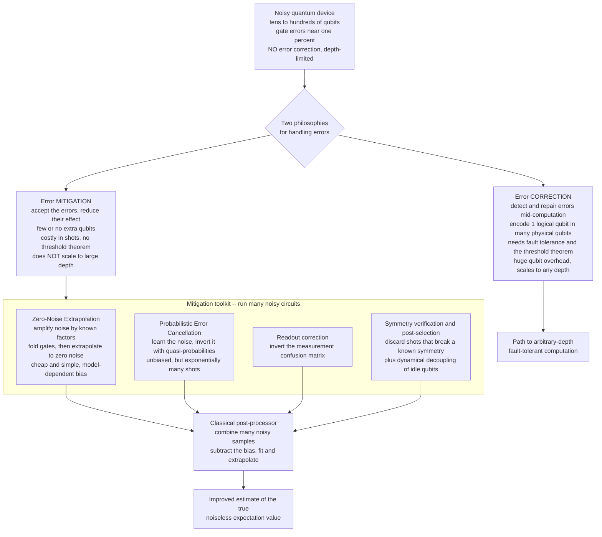

# 🧹 Error Mitigation in the NISQ Era

> [!abstract] TL;DR
> Today's quantum processors have **tens to hundreds of noisy qubits and no error correction** — Preskill's **NISQ** regime (Noisy Intermediate-Scale Quantum). They are far too small to pay the thousand-to-one qubit overhead that full **quantum error correction** demands, so noise corrupts the answer long before a deep circuit finishes. **Error mitigation** is the practical stopgap: rather than *detecting and fixing* errors during the computation (correction), you **accept** the errors, run the noisy circuit **many times under deliberately varied conditions**, and then **statistically subtract** the noise's effect on the final answer in **classical post-processing**. The workhorse techniques are **zero-noise extrapolation (ZNE)** — amplify the noise by known factors, measure at each level, and extrapolate back to the zero-noise limit; **probabilistic error cancellation (PEC)** — characterize the noise channel and invert it by sampling with quasi-probabilities (unbiased, but exponentially many shots); **readout-error correction** — invert the measurement confusion matrix; plus **symmetry verification / post-selection** and **dynamical decoupling**. Mitigation is *cheap in qubits but costly in circuit repetitions (shots)*, and its sampling overhead grows **exponentially** with circuit size and noise. That is the crux: mitigation buys **near-term utility, not scalability** — it can make **VQE**, **QAOA**, and IBM's "utility"-scale dynamics experiments produce usable numbers today, but it **cannot replace error correction** for large-scale, arbitrary-depth computation. It is a bridge across the noisy present, not the destination.

---

## Intuition

**Analogy — subtracting a known bias from a bent bathroom scale.** Suppose your bathroom scale reads a little heavy, and worse, its error *grows* the longer you stand on it. You cannot open it up and repair the spring (that would be error *correction*, and you lack the tools). But you *can* do something clever: weigh yourself while holding known extra weights — 0 kg, 5 kg, 10 kg — plot the readings against the added load, and **extrapolate the line back to "zero extra load"** to recover a better estimate of your true weight than any single reading gives. You never fixed the scale; you **characterized how it lies and mathematically undid the lie** using many measurements and a bit of arithmetic afterward.

That is exactly **zero-noise extrapolation**, the flagship error-mitigation technique. Today's quantum computers are too small to *correct* errors — that needs an overhead of hundreds-to-thousands of physical qubits per protected logical qubit that no current machine has. So instead of fixing errors *inside* the computation, mitigation runs the noisy circuit repeatedly — sometimes with the noise **deliberately amplified** — and **post-processes the noisy outputs on a classical computer** to estimate what the clean, noiseless answer would have been. It is a stopgap for the noisy present: it reduces the *effect* of errors on the final number without ever removing the errors themselves.

---

## How It Works

### Core mechanics

1. **What NISQ means (Preskill, 2018).** "Noisy Intermediate-Scale Quantum" names the machines we actually have: **50 to a few thousand physical qubits**, gate error rates around `10^{-3}` to `10^{-2}`, **no error correction**, and therefore a hard limit on **circuit depth** — after roughly `1 / error_rate` two-qubit gates, noise has scrambled the state and the signal drowns. NISQ devices cannot run **Shor's** or long **phase-estimation** circuits; they can run *shallow* circuits, and mitigation is what squeezes a usable answer out of them.

2. **Mitigation targets *expectation values*, not bitstrings.** Almost all NISQ algorithms (VQE, QAOA, dynamics simulation) ultimately need one thing: an **expectation value** `⟨O⟩ = ⟨ψ|O|ψ⟩` of some observable, estimated by averaging measurement outcomes over many **shots**. Noise **biases** this estimate — typically pulling it toward the maximally-mixed value (often `0`). Mitigation is a set of tricks to **remove that bias** from the estimate. It does *not* recover the full quantum state, and it does *not* protect information mid-circuit.

3. **Correction vs mitigation — two different philosophies.**
   - **Error correction** *actively detects and repairs* errors *during* the computation. It encodes one **logical** qubit across many **physical** qubits, measures **stabilizers** (parity checks that reveal errors without collapsing the data — possible only because of the [[Measurement_and_the_No_Cloning_Theorem|no-cloning constraint]] forces cleverness), and applies corrections in real time. Given a physical error rate **below the threshold**, it suppresses logical error **arbitrarily** and scales to **any depth** — at a **massive qubit overhead** and the machinery of **fault tolerance** (the *threshold theorem*).
   - **Error mitigation** *accepts* the errors and *reduces their effect on the final number* via sampling and classical post-processing. It costs **few or no extra qubits** but pays in **many more circuit repetitions (shots)** and **does not scale to arbitrary depth**. There is **no threshold theorem** for mitigation.

4. **Zero-Noise Extrapolation (ZNE).** Run the circuit at several **noise scale factors** `λ` (with `λ = 1` the native noise, `λ > 1` amplified). Noise is amplified in a controlled way by **gate folding** — replacing a gate `G` with `G G† G`, which is logically identical but triples that gate's noise exposure — or by stretching pulse durations. Measure `⟨O⟩(λ)` at each `λ`, then **fit** `⟨O⟩` versus `λ` and **extrapolate to `λ = 0`**, the zero-noise limit. Simple, hardware-agnostic, and **biased by the choice of fit model** (linear/Richardson vs exponential).

5. **Probabilistic Error Cancellation (PEC).** First **characterize** the noise channel `N` of each gate (via gate-set tomography or cycle benchmarking). The ideal operation is `N^{-1} N`; since `N^{-1}` is generally **not** a physical channel, express it as a **quasi-probability** decomposition `N^{-1} = Σ_i c_i P_i` over *implementable* operations `P_i` with **signed** coefficients `c_i`. Sample circuits according to `|c_i|`, multiply each result by `sign(c_i)`, and average. The estimator is **unbiased** (recovers the exact noiseless value in expectation) but its variance blows up by a factor `γ^2`, where `γ = Σ_i |c_i| ≥ 1` **compounds multiplicatively across gates** — hence **exponential shot cost**.

6. **Readout / measurement-error correction.** Real detectors misreport: a prepared `0` sometimes reads `1` and vice versa. Calibrate the **confusion (assignment) matrix** `A`, where `A_{ij}` is the probability of reading `i` given true state `j`. The measured distribution is `p_meas = A p_true`, so **invert**: `p_true ≈ A^{-1} p_meas` (in practice a constrained least-squares solve to avoid unphysical negative probabilities). Cheap and widely used as a first mitigation layer.

7. **Symmetry verification, post-selection, and dynamical decoupling.** If the ideal state must obey a **symmetry** (fixed particle number, parity), *discard* shots that violate it — **post-selection** throws away detectably-corrupted runs. **Dynamical decoupling** inserts sequences of pulses on **idle** qubits so environmental dephasing averages out, suppressing errors during the waits between gates.

8. **Learning-based methods.** **Clifford Data Regression (CDR)** builds near-Clifford training circuits whose ideal values are *classically computable*, runs them on hardware, learns a noisy-to-ideal correction map, and applies it to the real (non-Clifford) circuit. **Virtual distillation** runs `M` copies and estimates values on the purified state `ρ^M / Tr(ρ^M)`, exponentially suppressing incoherent error.

9. **The fundamental limit.** Every unbiased mitigation method pays a **sampling overhead that grows exponentially** with the number of noisy gates (`γ^{#gates}`). Recent theory (Takagi et al.; Quek et al.) proves this is **not a shortcoming of current techniques but a fundamental barrier**: under generic local noise, the shots needed grow **exponentially in circuit depth and width**. Therefore mitigation **cannot substitute for error correction** at scale — it extends the *reach* of NISQ devices by a useful but bounded amount.

### Correction vs mitigation, and the mitigation toolkit



*Left branch: correction fixes errors as they happen but demands qubits we do not yet have. Right branch: mitigation leaves the errors in place and cancels their statistical effect afterward — usable today, but exponentially costly as circuits grow.*

---

## Key Concepts

### Secondary (intuitive level)
- Today's quantum computers are **small and noisy**; errors pile up so fast that deep programs give garbage.
- **Full error correction** — the real fix — needs *hundreds to thousands* of extra qubits per protected qubit, which no current machine has.
- **Mitigation** instead runs the noisy program **many times** and does **clever math afterward** to estimate the clean answer, like extrapolating a bent scale's readings back to zero load.
- It is a **stopgap**: it buys useful results *now*, but the cost **explodes** as programs get bigger, so it cannot replace correction forever.

### Undergraduate (working level)
- **NISQ (Preskill, 2018):** `50`–`~1000` noisy qubits, no correction, depth capped near `1 / gate_error`; runs shallow circuits like VQE and QAOA.
- **Mitigation acts on expectation values `⟨O⟩`,** removing the noise-induced **bias** in the estimate; it does not protect the quantum state.
- **ZNE:** scale noise by `λ` via **gate folding** `G → G G† G`, measure `⟨O⟩(λ)`, fit and **extrapolate to `λ = 0`**.
- **Readout correction:** build the **confusion matrix** `A`, solve `p_true ≈ A^{-1} p_meas` (least squares, constrained to be physical).
- **Dynamical decoupling** on idle qubits; **symmetry verification / post-selection** discards corrupted shots.
- **Shots, not qubits:** mitigation trades qubit overhead for **circuit repetitions**; statistical variance grows as you push harder.

### Graduate (theoretical level)
- **PEC quasi-probability:** `N^{-1} = Σ_i c_i P_i` with signed `c_i`; unbiased estimator, variance inflated by `γ^2` where `γ = Σ_i |c_i|` and the total overhead `γ_total = Π_gates γ_gate` grows **exponentially** in gate count.
- **Bias–variance trade-off:** ZNE reduces bias but **amplifies variance** (noise scaling widens error bars); the **extrapolation model** (linear, Richardson/polynomial, exponential) is a bias knob and must match the physical noise decay.
- **Fundamental limits (Takagi et al. 2022; Quek et al. 2024):** for a broad class of local-noise models, the sampling cost of *any* mitigation scheme grows **exponentially in circuit depth and qubit number** — a no-go for replacing QEC at scale.
- **Advanced methods:** **Clifford Data Regression**, **virtual distillation / M-copy purification** (`ρ^M / Tr(ρ^M)` suppresses incoherent error exponentially in `M`), **probabilistic error amplification** (learn a sparse Pauli-noise model, then amplify it precisely for ZNE — IBM's utility protocol).
- **Relation to complexity:** NISQ + mitigation samples expectation values that live *near* but not obviously beyond classical reach; whether this yields anything **classically hard and useful** before fault tolerance is the live debate at the boundary of [[Quantum_Computation_and_BQP|BQP]].
- **Early fault tolerance:** the transition regime combines **light error correction** (a few rounds, small codes) with mitigation on top of the residual logical noise — mitigation as a **bridge**, not a dead end.

---

## Python Demo

Zero-noise extrapolation end to end, using only `numpy` and `matplotlib`. We fix a *true* noiseless expectation value `E_ideal`. A depolarizing-style noise model shrinks it multiplicatively with the **noise scale factor** `λ`, so the raw device reading (at `λ = 1`) is biased low. We **amplify the noise** to `λ = 1, 2, 3, 4, 5` (as gate folding would), **measure** each with realistic shot noise, then **fit and extrapolate back to `λ = 0`** two ways — a linear (Richardson-style) fit and an exponential fit matched to the depolarizing decay — and compare the mitigated estimates against the ideal value and the raw noisy reading.

```python
# Zero-Noise Extrapolation (ZNE) from scratch -- numpy + matplotlib only.
# Idea: the device only runs AT or ABOVE its native noise. We deliberately
# amplify the noise by known factors lambda, measure the (biased) expectation
# value at each level, then extrapolate the trend back to lambda = 0 to recover
# an improved estimate of the true, noiseless value.
import numpy as np
import matplotlib.pyplot as plt

rng = np.random.default_rng(7)

# ---- 1. The ground truth we are trying to recover ------------------------
E_ideal = 0.80          # true noiseless <O>, lives in [-1, 1]
f       = 0.72          # noise attenuation per unit scale (depolarizing-like)

# Physical model: under depolarizing noise, an expectation value decays
# multiplicatively with the noise strength -> E(lambda) = E_ideal * f**lambda.
# At lambda = 0 (zero noise) this returns E_ideal exactly; the native device
# sits at lambda = 1 and already reads biased-low.
def true_expectation_at_scale(lam):
    return E_ideal * f**lam

# ---- 2. Simulate a hardware measurement with finite shots ----------------
# <O> in [-1,1]  <=>  P(+1 outcome) = (1 + <O>) / 2. Sample counts, estimate.
def measure(E_true, shots):
    p_plus = (1.0 + E_true) / 2.0
    counts_plus = rng.binomial(shots, p_plus)
    return 2.0 * counts_plus / shots - 1.0

shots  = 40000
scales = np.array([1.0, 2.0, 3.0, 4.0, 5.0])   # noise amplification factors
measured = np.array([measure(true_expectation_at_scale(l), shots) for l in scales])

raw_noisy = measured[0]   # what you would report with NO mitigation (lambda = 1)

# ---- 3a. LINEAR (Richardson-style) extrapolation to lambda = 0 -----------
slope_lin, intcpt_lin = np.polyfit(scales, measured, deg=1)
E_linear = intcpt_lin                      # value of the line at lambda = 0

# ---- 3b. EXPONENTIAL extrapolation (matches depolarizing decay) ----------
# Fit log(E) = log(A) + b*lambda  (E>0 here), then A = E-estimate at lambda=0.
b_exp, logA = np.polyfit(scales, np.log(measured), deg=1)
E_exp = np.exp(logA)

# ---- 4. Report ------------------------------------------------------------
print(f"true noiseless value   E_ideal   = {E_ideal:.4f}")
print(f"raw noisy reading      (lam = 1) = {raw_noisy:.4f}   err = {abs(raw_noisy-E_ideal):.4f}")
print(f"ZNE linear extrapolation         = {E_linear:.4f}   err = {abs(E_linear-E_ideal):.4f}")
print(f"ZNE exponential extrapolation    = {E_exp:.4f}   err = {abs(E_exp-E_ideal):.4f}")

# ---- 5. Plot the noisy measurements + both extrapolations ----------------
lam_grid = np.linspace(0.0, 5.2, 200)
plt.figure(figsize=(7.5, 4.8))
plt.scatter(scales, measured, s=55, color="#2563eb", zorder=5,
            label="noisy measurements  <O>(lambda)")
plt.plot(lam_grid, slope_lin*lam_grid + intcpt_lin, "--", color="#059669",
         label="linear (Richardson) fit")
plt.plot(lam_grid, np.exp(logA + b_exp*lam_grid), ":", color="#9333ea",
         label="exponential fit")
plt.axhline(E_ideal, color="#dc2626", lw=1.4,
            label=f"true value E_ideal = {E_ideal:.2f}")
plt.scatter([0], [E_linear], marker="s", s=80, color="#059669", zorder=6,
            label=f"ZNE linear at 0 = {E_linear:.3f}")
plt.scatter([0], [E_exp], marker="D", s=80, color="#9333ea", zorder=6,
            label=f"ZNE exponential at 0 = {E_exp:.3f}")
plt.scatter([1], [raw_noisy], marker="o", s=90, facecolors="none",
            edgecolors="#111827", linewidths=1.6, zorder=6,
            label=f"raw noisy at 1 = {raw_noisy:.3f}")
plt.axvline(0, color="#9ca3af", lw=0.8)
plt.xlabel("noise scale factor  lambda   (0 = noiseless, 1 = native device)")
plt.ylabel("expectation value  <O>")
plt.title("Zero-Noise Extrapolation: measure at amplified noise, extrapolate to zero")
plt.legend(fontsize=8, loc="upper right")
plt.tight_layout()
plt.savefig("zne_extrapolation.png", dpi=130)
print("Saved plot to zne_extrapolation.png")

# Takeaways:
#   * the RAW device reading at lambda = 1 is badly biased low (~0.58 vs 0.80);
#   * extrapolating amplified-noise data back to lambda = 0 RECOVERS the truth;
#   * the EXPONENTIAL fit nearly nails E_ideal because it matches the real
#     depolarizing decay, while the LINEAR fit is a decent-but-biased approx --
#     this is the ZNE bias-variance trade-off: the extrapolation MODEL matters;
#   * we never fixed a single error -- we only amplified, measured, and did math.
```

Running it prints the raw noisy reading near `0.58` (badly biased below the true `0.80`), while the exponential extrapolation lands almost exactly on `0.80` and the linear fit gets close but retains a model-mismatch bias. The saved plot shows the blue points sloping down with amplified noise and both fit lines projected leftward to `λ = 0`, where the exponential estimate meets the red ideal line — the whole mechanism of ZNE in one picture, with **no error ever repaired**, only characterized and undone in post-processing.

---

## Real-World Applications

> **Example — IBM's "utility before fault tolerance" experiment (Kim et al., *Nature* 2023).** On a **127-qubit** superconducting processor (Eagle), IBM ran a **2D transverse-field Ising** time-evolution circuit far deeper than brute-force classical simulation can handle, and extracted accurate magnetization expectation values using **error mitigation** — a learned sparse **Pauli-noise model** plus **probabilistic error amplification** feeding **zero-noise extrapolation**. Crucially, the mitigated quantum results were **cross-checked against state-of-the-art classical tensor-network methods** in the regimes those could still reach, and agreed. This is the exact ZNE-plus-post-processing pattern of the demo above, scaled to real hardware, and it defined the term **"quantum utility"** — useful computation on a **noisy** machine.

- **Making VQE and QAOA usable on NISQ hardware.** Variational algorithms estimate an **energy** `⟨H⟩` shot by shot, and raw noise biases it above the true ground state, ruining chemical accuracy. Layering **readout correction + ZNE** onto the energy estimate is standard practice in [[Quantum_Simulation_and_VQE|VQE]] chemistry demos and QAOA optimization runs — it is often the difference between a meaningless and a meaningful number.
- **Dynamics and condensed-matter simulation.** Quench dynamics, spin-chain evolution, and Hubbard-model probes on trapped-ion (Quantinuum, IonQ) and superconducting (Google, IBM) devices routinely combine **dynamical decoupling**, **symmetry post-selection**, and **ZNE** to push observable accuracy.
- **Quantum-advantage / utility demonstrations.** Beyond IBM's Ising experiment, mitigation is central to arguments about **near-term quantum advantage** — whether NISQ machines plus classical post-processing can compute something **classically hard and useful** before fault tolerance arrives. The debate is genuinely open: several early "advantage" claims were later matched by improved classical algorithms, so mitigation-enabled *utility* is not yet proven *advantage*.
- **Software toolboxes.** Open-source stacks — **Mitiq** (a mitigation-focused library implementing ZNE, PEC, CDR) and mitigation modules in **Qiskit Runtime**, **Cirq**, and **PennyLane** — ship these methods so any user can wrap a noisy circuit in mitigation with a few lines.
- **The bridge to early fault tolerance.** As the first **small error-correcting codes** come online, mitigation is being layered *on top of* lightly-corrected logical qubits to squeeze out residual logical noise — a hybrid **"early fault-tolerant"** strategy that carries value from the pure-NISQ era into the corrected one.

---

## Common Pitfalls

- **"Mitigation is just cheap error correction."** No — they are categorically different. Correction *protects quantum information during* the computation and, above threshold, scales to **arbitrary depth**. Mitigation only *de-biases a final expectation value* in post-processing; it offers **no threshold theorem** and **no protection of the state**. Conflating them oversells NISQ.
- **Ignoring the exponential shot cost.** Every unbiased mitigation method inflates variance by a factor that **compounds multiplicatively across gates** (`γ_total = Π γ_gate`). Push the circuit deeper and the shots needed for a fixed error bar explode **exponentially** — the fundamental reason mitigation cannot scale. Budget shots, not just qubits.
- **Wrong extrapolation model in ZNE.** ZNE's answer depends on the **fit function**. A linear fit to a genuinely **exponential** noise decay (or vice versa) injects a **systematic bias** that no amount of averaging removes — as the demo's linear-vs-exponential gap shows. Match the model to the physics, or use several and report the spread.
- **Unphysical readout inversion.** Naively computing `A^{-1} p_meas` can yield **negative probabilities** when `A` is ill-conditioned. Use **constrained least squares** (or iterative Bayesian unfolding) that enforces a valid probability distribution.
- **Over-amplifying noise until signal dies.** ZNE needs `λ > 1` data points, but if you amplify so hard that `⟨O⟩(λ)` collapses into shot noise, the extrapolation becomes meaningless. There is a sweet spot between too little lever arm and a vanished signal.
- **Confusing utility with advantage.** Mitigated NISQ results that *match* classical methods demonstrate **utility**, not **quantum advantage**. Several headline claims were later reproduced classically. Be precise: "useful on a noisy machine" is a weaker, honest claim than "beyond all classical computers."
- **Mitigating the wrong quantity.** Mitigation cleans up **expectation values**, not full output **distributions**. If your algorithm needs to *sample bitstrings* (not average an observable), most mitigation methods do not directly apply.

---

## Related Concepts

- [[Quantum_Simulation_and_VQE]] — the flagship NISQ workload that mitigation exists to serve; ZNE and readout correction are what make VQE energy estimates and QAOA runs accurate enough to matter today.
- [[Measurement_and_the_No_Cloning_Theorem]] — mitigation acts on measured expectation values, and **no-cloning** is precisely why error *correction* must use stabilizer parity checks instead of simple backups — the reason correction is so expensive and mitigation so tempting.
- [[Quantum_Computing_Overview]] — the parent map of the field; this note is the honest "what NISQ can and cannot do" chapter of that overview.
- [[Quantum_Gates_and_Circuits]] — gate noise is the enemy being fought; **gate folding** `G → G G† G` (the ZNE noise amplifier) and **dynamical decoupling** pulses are circuit-level manipulations defined here.
- [[Quantum_Information_Theory]] — density matrices, noise channels, and the quasi-probability decompositions that make **PEC** an unbiased-but-costly estimator are formalized there.
- [[Quantum_Computation_and_BQP]] — frames the deep question mitigation raises: whether NISQ-plus-post-processing reaches anything **classically hard**, i.e. where near-term devices sit relative to **BQP** and classical simulation.

---

## Review Questions

**Tier 1 — Conceptual (explain to a peer):**
1. Using the bent-bathroom-scale analogy, explain the difference between *fixing* the scale (error correction) and *extrapolating its biased readings back to zero load* (error mitigation). Why can today's quantum computers only do the second?
2. Preskill coined "NISQ." State what each word means and give two concrete constraints (on qubit count *and* on circuit depth) that force us to rely on mitigation rather than correction.

**Tier 2 — Applied (reason / compute):**
3. In zero-noise extrapolation you can only run the device **at or above** its native noise (`λ ≥ 1`), yet you want the value at `λ = 0`. Explain how gate folding `G → G G† G` amplifies noise without changing the logical circuit, and why the *choice* of fit function (linear vs exponential) can change the mitigated answer even with infinite shots.
4. A VQE run reports a ground-state energy that sits *above* the true value even after many shots. Which mitigation techniques would you stack (name at least two) to reduce this bias, and what new cost does each impose?

**Tier 3 — Theoretical (deep understanding):**
5. Probabilistic error cancellation gives an **unbiased** estimator of the noiseless expectation value, yet is often impractical. Derive intuitively why its sampling overhead `γ_total = Π_gates γ_gate` grows **exponentially** with circuit size, and connect this to the theorem that mitigation cannot replace error correction at scale.
6. Argue both sides of the near-term-quantum-advantage debate: what does IBM's 127-qubit "utility" experiment demonstrate, what does it *not* demonstrate, and why is the distinction between **"quantum utility"** and **"quantum advantage"** more than semantics given that some prior claims were later matched classically?

---

## Sources

- Preskill, J. "Quantum Computing in the NISQ Era and Beyond," *Quantum* 2, 79 (2018) — the paper that named the NISQ era and framed its promise and limits. [arXiv:1801.00862](https://arxiv.org/abs/1801.00862)
- Temme, K., Bravyi, S. & Gambetta, J. M. "Error Mitigation for Short-Depth Quantum Circuits," *Physical Review Letters* 119, 180509 (2017) — foundational proposals of zero-noise extrapolation and probabilistic error cancellation. [arXiv:1612.02058](https://arxiv.org/abs/1612.02058)
- Kim, Y. et al. "Evidence for the Utility of Quantum Computing before Fault Tolerance," *Nature* 618, 500–505 (2023) — IBM's 127-qubit mitigation experiment defining "quantum utility." [DOI](https://doi.org/10.1038/s41586-023-06096-3)
- Cai, Z. et al. "Quantum Error Mitigation," *Reviews of Modern Physics* 95, 045005 (2023) — the comprehensive modern review of the full mitigation toolkit. [arXiv:2210.00921](https://arxiv.org/abs/2210.00921)
- Takagi, R., Endo, S., Minagawa, S. & Gu, M. "Fundamental Limits of Quantum Error Mitigation," *npj Quantum Information* 8, 114 (2022) — proves the exponential sampling-overhead barrier. [arXiv:2109.04457](https://arxiv.org/abs/2109.04457)

---

#quantum-computing #error-mitigation #nisq #zero-noise-extrapolation #near-term-quantum
