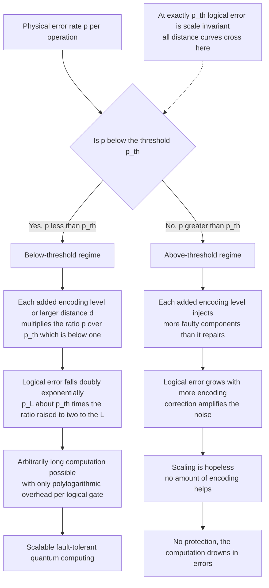

# 🛡️ Fault Tolerance and the Threshold Theorem

> [!abstract] TL;DR
> **Fault tolerance** is the discipline of building a quantum computer whose gates, measurements, state preparation, *and error correction itself* are all noisy, yet which still computes reliably — by engineering every operation so a single physical fault cannot cascade into many logical errors. The **threshold theorem** is the landmark guarantee that makes this possible: **if the physical error rate per operation is below a critical value `p_th`, then adding more error correction (larger code distance or more concatenation levels) drives the *logical* error rate down exponentially, with only polylogarithmic overhead** — so arbitrarily long quantum computations become possible on imperfect hardware. Below `p_th` correction wins; above it correction makes things worse. It is a sharp phase transition between "hopeless" and "scalable," and it is the theoretical reason scalable quantum computing is not forbidden by noise.

---

## Intuition

**Analogy:** Imagine you are copy-editing a book, but *your own pen leaks*. Every correction you make also has some chance of introducing a new typo. The terrifying question: does editing help at all, or do your leaky corrections just add more errors than they remove? Intuitively it feels circular — you are fixing mistakes with a mistake-prone tool. The stunning answer of the threshold theorem is that there is a **critical leakiness**. If your pen is *cleaner than that threshold* — if each stroke introduces errors more rarely than it fixes them — then editing the book, then editing your edits, then editing *those* edits, drives the final error rate toward zero exponentially fast. But if your pen is dirtier than the threshold, every round of editing makes the book worse, and no amount of re-editing saves it. There is a razor-sharp dividing line between the two worlds.

Quantum error correction has exactly this circularity, and it is worse than the book analogy suggests. The gates that *perform* the correction are themselves noisy. Worse, quantum errors **propagate**: a single fault on one qubit can spread through an entangling gate (a CNOT copies both bit-flip and phase-flip errors between qubits) to corrupt many qubits at once. And you cannot simply look at a qubit to check it — measuring it destroys the very superposition you are protecting (**no-cloning** forbids the naive "keep three copies and vote" trick you would use for classical bits). So the raw situation looks genuinely hopeless: noisy correction of noisy data, with faults that multiply as they move.

Fault tolerance is the set of design rules that tames the propagation, and the threshold theorem is the mathematical proof that, below a critical physical error rate, the taming *wins* — decisively, exponentially, and arbitrarily far. It is the moment the field turned from "noise probably makes large quantum computers impossible" to "noise is an engineering problem with a known finish line."

---

## How It Works

### The circularity problem, stated precisely

Error correction seems to assume perfect machinery it does not have:

1. **The correction gates are noisy.** To detect an error you extract a *syndrome* — a set of parity checks on the data qubits, computed onto ancilla qubits and measured. But every CNOT, every ancilla preparation, every measurement in that extraction can itself fail.
2. **Errors propagate through gates.** A CNOT with a fault on its control can spread a bit-flip to the target; run through a syndrome-extraction circuit naively, one ancilla fault can smear errors across *many* data qubits — more than the code can correct. This is the killer: a single fault becoming a logical error.
3. **You cannot copy quantum information** (no-cloning), so classical majority-vote redundancy is unavailable; you must encode into entangled states and measure *parities* that reveal errors without revealing (and collapsing) the data.

### Fault-tolerant design: stopping the cascade

A circuit is **fault-tolerant** if a single physical fault produces at most one error per logical code block — an error the code can still correct — and cannot cascade into an uncorrectable one. The core techniques:

- **Transversal gates.** Apply a logical gate by acting on corresponding physical qubits of different code blocks independently (qubit `i` of block A with qubit `i` of block B), never coupling two qubits *within* the same block. A fault then stays confined to one qubit of a block, so it never spreads into a multi-qubit logical error. Transversal gates are the gold standard of fault tolerance — but (see below) no code has a *universal* transversal gate set.
- **Verified / fault-tolerant syndrome extraction.** Prepare ancillas in verified special states (Shor, Steane, or Knill styles), or use **flag qubits** — extra ancillas whose measurement *raises a flag* when a dangerous fault has occurred mid-extraction, telling the decoder to treat that round differently. This prevents one ancilla fault from masquerading as a benign syndrome while it silently corrupts several data qubits.
- **Fault-tolerant everything.** State preparation, gates, measurement, *and* the correction cycle are all built to this same standard. Fault tolerance is not a feature you bolt on; it is a property the entire circuit must satisfy end to end.
- **Repeated syndrome measurement.** Because measurement is itself noisy, you measure syndromes *many times* and decode the space-time history, so a single faulty measurement does not trigger a wrong (and damaging) correction.

### The threshold theorem

With fault-tolerant gadgets in hand, the central result (proved independently by **Aharonov–Ben-Or**, **Kitaev**, and **Knill–Laflamme–Zurek** in the late 1990s) states:

> There exists a constant threshold `p_th > 0` such that if the physical error rate per operation `p < p_th`, then for any target logical error rate `ε > 0`, a quantum circuit of size `N` can be simulated fault-tolerantly using `O(N · polylog(N/ε))` operations.

The mechanism is cleanest for **concatenated codes**. Encode each logical qubit in a small code; then encode each of *those* physical qubits in the same small code again; repeat for `L` levels. If one level of encoding maps physical error `p` to an effective error of roughly `p_th (p/p_th)^2` (the square appears because it now takes *two* faults, not one, to cause a logical error), then after `L` levels:

```
p_L  ≈  p_th · (p / p_th)^(2^L)
```

If `p < p_th` the ratio `p/p_th < 1`, and raising it to `2^L` sends `p_L` toward zero **doubly exponentially** in the number of levels — while the qubit and time overhead grows only *singly* exponentially in `L`, i.e. **polylogarithmically** in the target `1/ε`. If `p > p_th`, the same recursion *amplifies* the error at every level and the computation drowns.

For the **surface code** the same physics shows up through code distance `d` rather than concatenation level:

```
p_L(d)  ≈  A · (p / p_th)^((d+1)/2)
```

Increasing `d` (a bigger patch of physical qubits) suppresses the logical error exponentially when `p < p_th`. The exponent `(d+1)/2` is the number of independent faults needed to cause an undetectable logical error — a distance-`d` code corrects up to `⌊(d-1)/2⌋` errors.

### The phase-transition picture

The threshold is a genuine **critical point**, mathematically kin to a physical phase transition (order parameter: does logical error flow to 0 or to 1 as you scale the code?). Below `p_th`, the renormalization-group-like flow of "error per level" runs to the trivial fixed point (zero error); above `p_th` it runs to the disordered fixed point (total error). At exactly `p_th`, logical error is scale-invariant — independent of `d`. Plotting `p_L` versus physical `p` for several code distances, **all the curves cross at a single point, and that crossing point is `p_th`** — the experimental signature everyone hunts for.



---

## Key Concepts

**Secondary (plain-language core):**
- If the machine that fixes errors is *itself* error-prone, fixing can either help or hurt. There is a critical error rate that decides which.
- **Below the threshold:** doing *more* error correction makes the answer *more* reliable — as reliable as you like.
- **Above the threshold:** doing more error correction makes things *worse*. No amount of it rescues you.
- This is why "scalable quantum computing is possible in principle" is a theorem, not a hope — but the *cost* (extra qubits and time) is enormous.

**Undergraduate (CS / linear-algebra background):**
- **Fault tolerance** = a circuit where one physical fault causes at most one correctable error per code block; achieved via **transversal gates**, **verified ancillas**, and **flag qubits** that stop errors cascading through entangling gates.
- **Concatenation recursion:** `p_L ≈ p_th (p/p_th)^(2^L)` — doubly-exponential suppression below threshold, doubly-exponential blow-up above it, for only polylog overhead in `1/ε`.
- **Surface-code scaling:** `p_L(d) ≈ A (p/p_th)^((d+1)/2)`; distance `d` corrects `⌊(d-1)/2⌋` errors; overhead ≈ `~2d²` physical qubits per logical qubit.
- **Threshold values are code-dependent:** early concatenated codes ~`10⁻⁴`–`10⁻⁵`; the **surface code** a far more forgiving ~`1%`, which is why it dominates practical roadmaps.

**Graduate (systems / architecture level):**
- **Threshold theorem** (Aharonov–Ben-Or; Kitaev; Knill–Laflamme–Zurek): rigorous existence of `p_th > 0` under reasonable (local, stochastic or bounded-strength) noise models; adversarial and non-Markovian noise weaken but do not destroy it.
- **The threshold is model-dependent:** its numerical value depends on the noise model (depolarizing vs biased vs coherent), the gate set, connectivity, measurement and reset times, and the decoder. "1% threshold" is a circuit-level-depolarizing statement, not a universal constant.
- **Eastin–Knill no-go theorem:** no quantum code has a *universal* set of transversal logical gates. You get a transversal Clifford group cheaply, but at least one non-Clifford gate (e.g. `T`) must come from elsewhere — typically **magic-state distillation**, which dominates the resource budget of fault-tolerant algorithms.
- **Overhead reality:** reaching algorithmically useful logical error rates (`~10⁻¹⁰` to `10⁻¹⁵`) needs distances `d ≈ 20`–`30+`, i.e. **hundreds to thousands of physical qubits per logical qubit**, and full algorithms like Shor's factoring of RSA-2048 project into the **millions of physical qubits** plus enormous time overhead from serialized magic-state consumption.
- **Renormalization-group view:** the threshold is the critical point of a noise-flow map; below it noise flows to the trivial fixed point, above it to the disordered one — literally the same mathematics as a statistical-mechanics **phase transition** (the surface-code threshold maps onto the phase boundary of the random-bond Ising model).

---

## Python Demo

```python
# numpy / matplotlib only. Three demonstrations of the threshold theorem
# using the surface-code logical-error model:
#     p_L(d) = A * (p_phys / p_th) ** ((d + 1) / 2)
#   (1) logical error vs code distance, for physical rates below/at/above threshold
#   (2) the THRESHOLD CROSSOVER: p_L vs physical p for several distances -> all
#       curves cross at a single point, which IS p_th
#   (3) physical-qubit OVERHEAD needed to reach a target logical error rate,
#       exploding as the physical error rate approaches the threshold
import numpy as np
import matplotlib.pyplot as plt

A = 0.03          # prefactor (order 0.01-0.1 in the literature)
p_th = 0.01       # surface-code threshold ~ 1 percent

def logical_error(p_phys, d):
    """Surface-code logical error per cycle. Clipped at 1 (a probability)."""
    val = A * (np.asarray(p_phys) / p_th) ** ((np.asarray(d) + 1) / 2.0)
    return np.minimum(val, 1.0)

# ---- (1) logical error vs code distance ------------------------------------
distances = np.arange(3, 32, 2)                 # odd distances 3,5,...,31
phys_rates = [0.002, 0.005, 0.010, 0.020]       # two below, one AT, one above p_th

print("Demo 1 -- logical error vs distance")
for p in phys_rates:
    tag = "below" if p < p_th else ("at   " if np.isclose(p, p_th) else "above")
    pL_small = logical_error(p, 5)
    pL_large = logical_error(p, 25)
    print(f"  p={p:.3f} ({tag} threshold):  p_L(d=5)={pL_small:.2e}   "
          f"p_L(d=25)={pL_large:.2e}   -> "
          f"{'suppressed' if pL_large < pL_small else 'amplified'}")

# ---- (2) threshold crossover -----------------------------------------------
p_scan = np.logspace(-3.3, -1.3, 300)           # physical rates ~5e-4 .. 5e-2
distances_cross = [3, 7, 11, 15, 21]

# ---- (3) physical-qubit overhead to hit a target ---------------------------
p_target = 1e-12
p_below = np.linspace(0.001, 0.009, 200)        # strictly below threshold

def qubits_for_target(p_phys, p_target):
    # solve p_L(d) = p_target for d, round UP to the next odd integer
    d_real = 2.0 * np.log(p_target / A) / np.log(p_phys / p_th) - 1.0
    d = np.ceil(d_real)
    d = np.where(d % 2 == 0, d + 1, d)          # distance must be odd
    d = np.maximum(d, 3.0)
    return 2.0 * d**2, d                         # ~2 d^2 physical qubits / logical

n_phys, d_needed = qubits_for_target(p_below, p_target)

print("\nDemo 3 -- overhead to reach p_L = 1e-12")
for p in [0.001, 0.005, 0.008]:
    n, d = qubits_for_target(np.array([p]), p_target)
    print(f"  p={p:.3f}:  distance d={int(d[0]):3d}   "
          f"physical qubits per logical = {int(n[0]):,}")

# ---- Plots -----------------------------------------------------------------
fig, (ax1, ax2, ax3) = plt.subplots(1, 3, figsize=(16, 4.6))

# Panel 1: exponential suppression vs amplification
for p in phys_rates:
    style = "-" if p < p_th else ("--" if np.isclose(p, p_th) else ":")
    ax1.semilogy(distances, logical_error(p, distances), style, marker="o",
                 ms=3, label=f"p = {p:.3f}")
ax1.axhline(A, color="gray", lw=0.8, ls="--")
ax1.set_title("(1) Logical error vs code distance")
ax1.set_xlabel("code distance d")
ax1.set_ylabel("logical error rate p_L")
ax1.legend(title="physical error rate")
ax1.grid(True, which="both", alpha=0.3)

# Panel 2: the threshold crossover -- all curves cross at p_th
for d in distances_cross:
    ax2.loglog(p_scan, logical_error(p_scan, d), label=f"d = {d}")
ax2.axvline(p_th, color="red", ls="--", lw=1.2, label=f"threshold p_th = {p_th}")
ax2.set_title("(2) Threshold crossover: curves cross at p_th")
ax2.set_xlabel("physical error rate p")
ax2.set_ylabel("logical error rate p_L")
ax2.legend()
ax2.grid(True, which="both", alpha=0.3)

# Panel 3: overhead explodes as p -> p_th
ax3.semilogy(p_below, n_phys, "-", color="darkgreen")
ax3.axvline(p_th, color="red", ls="--", lw=1.2, label=f"threshold p_th = {p_th}")
ax3.set_title("(3) Physical qubits per logical qubit\nto reach p_L = 1e-12")
ax3.set_xlabel("physical error rate p")
ax3.set_ylabel("physical qubits per logical qubit")
ax3.legend()
ax3.grid(True, which="both", alpha=0.3)

plt.tight_layout()
plt.show()
```

Expected console output (values are model estimates, not hardware numbers):

```
Demo 1 -- logical error vs distance
  p=0.002 (below threshold):  p_L(d=5)=2.40e-06   p_L(d=25)=6.29e-19   -> suppressed
  p=0.005 (below threshold):  p_L(d=5)=9.38e-04   p_L(d=25)=8.94e-09   -> suppressed
  p=0.010 (at    threshold):  p_L(d=5)=3.00e-02   p_L(d=25)=3.00e-02   -> amplified
  p=0.020 (above threshold):  p_L(d=5)=9.60e-01   p_L(d=25)=1.00e+00   -> amplified

Demo 3 -- overhead to reach p_L = 1e-12
  p=0.001:  distance d= 21   physical qubits per logical = 882
  p=0.005:  distance d= 69   physical qubits per logical = 9,522
  p=0.008:  distance d=217   physical qubits per logical = 94,178
```

The three panels tell the whole story: (1) below threshold, logical error plunges exponentially with distance while above threshold it climbs to 1; (2) the family of distance curves **all cross at `p = p_th`**, the visual fingerprint of the phase transition; (3) staying *just* below threshold is ruinously expensive — the qubit overhead diverges as `p → p_th`, whereas an order of magnitude of headroom (`p ≈ p_th/10`) makes fault tolerance cheap. This is exactly why every hardware roadmap chases physical error rates *well* under 1%, not merely *at* it.

---

## Real-World Applications

> **Google's surface-code milestones (2023–2024).** Google's *Sycamore*/*Willow* superconducting processors demonstrated the threshold theorem's signature directly: as they increased the surface-code distance from `d = 3` to `d = 5` to `d = 7`, the **logical error rate went *down* with each step** — the first convincing evidence of operating *below* threshold, with a logical qubit outperforming its best constituent physical qubit and error suppressed by roughly a constant factor (`Λ ≈ 2`) per distance step. This is the experimental "curves crossing below `p_th`" moment the theory predicted for 25 years.

> **Why Shor's algorithm is not practical yet.** Factoring RSA-2048 needs a few thousand *logical* qubits running billions of fault-tolerant gates at logical error rates near `10⁻¹⁵`. Under surface-code overhead that projects to **millions of physical qubits** plus long runtimes dominated by serialized **magic-state distillation** (forced by the Eastin–Knill no-go theorem, since the non-Clifford `T` gate cannot be transversal). The threshold theorem proves it is *possible*; the overhead is why it is not *imminent*.

> **The surface code's dominance.** Its ~1% threshold — one to two orders of magnitude more forgiving than early concatenated codes at `10⁻⁴`–`10⁻⁵` — is precisely why nearly every superconducting and neutral-atom roadmap builds around it: it demands only *nearest-neighbor* 2D connectivity and tolerates the error rates real hardware can actually reach today.

> **The NISQ / fault-tolerant dividing line.** Fault tolerance is the concept that *separates the two eras of quantum computing*. Today's Noisy Intermediate-Scale Quantum (NISQ) devices sit below the qubit counts and above the error rates needed for full fault tolerance, so they lean on **error *mitigation*** (statistical noise cancellation, no encoding) rather than **error *correction***. Crossing the threshold at scale is the gateway from "interesting demonstrations" to "arbitrarily long, reliable computation."

---

## Common Pitfalls

- **Thinking "below threshold" means "done."** Being just below `p_th` is barely useful — the overhead to reach a small logical error diverges as `p → p_th` (Panel 3). Practically you need `p` an order of magnitude *under* threshold so distances stay modest. "We crossed threshold" is the start of the engineering, not the end.
- **Quoting *the* threshold as a universal number.** `p_th` is model-dependent: it changes with the noise type (depolarizing vs coherent vs biased), the gate set, connectivity, decoder quality, and whether measurement/reset errors are included. "The surface code threshold is 1%" is a specific circuit-level-depolarizing figure, not a constant of nature.
- **Confusing error *mitigation* with error *correction*.** NISQ-era mitigation (zero-noise extrapolation, probabilistic error cancellation) reduces bias in *expectation values* with no encoding and no threshold guarantee; its sampling cost grows exponentially with circuit depth. Only *correction* with an under-threshold code gives arbitrarily long reliable computation. They are different regimes, not degrees of the same thing.
- **Forgetting that correction is itself noisy.** The whole subtlety is that syndrome extraction, ancilla prep, and gates all fail. A "fault-tolerant" claim requires that a *single* physical fault cannot become a logical error — verify the gadget-level fault tolerance, do not assume it because a code has distance `d`.
- **Ignoring error propagation through entangling gates.** A CNOT copies both `X` and `Z` errors between qubits. Naive syndrome-extraction circuits let one ancilla fault spread to many data qubits, exceeding the code's correction power. This is *the* thing transversal gates, verified ancillas, and flag qubits exist to prevent.
- **Assuming transversal gates give universality.** The Eastin–Knill no-go theorem forbids a universal transversal gate set. Non-Clifford gates require magic-state distillation, whose resource cost frequently *dominates* the whole computation — a fact easy to omit from qubit-count estimates.
- **Treating overhead as a fixed multiplier.** Physical-qubits-per-logical-qubit is not a constant; it depends on the target logical error rate and how far below threshold you operate. Deeper algorithms need lower `p_L`, hence larger `d`, hence more qubits — the budget scales with the computation.

---

## Related Concepts

- [[Quantum_Computing_Overview]] — situates fault tolerance as the bridge from today's noisy devices to the scalable machines the whole field is aiming at.
- [[Quantum_Gates_and_Circuits]] — fault-tolerant *logical* gates (transversal constructions and their limits) are built from the physical gate primitives introduced here; error propagation is a circuit-level phenomenon.
- [[Measurement_and_the_No_Cloning_Theorem]] — no-cloning forbids naive copy-and-vote redundancy, forcing *syndrome* measurement of parities; noisy measurement is exactly why repeated syndrome extraction is needed.
- [[Entanglement_and_Bell_States]] — quantum codes store logical information in highly entangled states so that local errors become detectable parities without collapsing the encoded data.
- [[Quantum_Fourier_Transform_and_Phase_Estimation]] — the flagship consumer of fault tolerance: Shor's factoring runs QPE for billions of gates and only works at the tiny logical error rates fault tolerance provides.
- [[Phase_Transitions_and_Critical_Phenomena]] — the threshold is a genuine critical point; the surface-code threshold maps onto the phase boundary of the random-bond Ising model, and the "below vs above" behavior is a renormalization-group flow to distinct fixed points.

> [!note] Planned companion notes in this section
> This note forward-references sibling notes not yet written in `04_Quantum_Error_Correction_and_Fault_Tolerance/`: **Quantum Error Correction Principles** (the codes and syndromes assumed here), **Stabilizer Codes and the Surface Code** (where the ~1% threshold and `p_L(d)` scaling come from), **Logical Qubits and Magic States** (the Eastin–Knill workaround for universality), and **Error Mitigation in the NISQ Era** (the pre-threshold alternative). Wikilinks will be added once those files exist.

---

## Review Questions

1. **(Conceptual)** Error correction seems circular: the gates that perform the correction are themselves faulty, and entangling gates can spread one fault to many qubits. Explain precisely why this does *not* make reliable computation impossible — what does the threshold theorem guarantee, and what must be true of the physical error rate for the guarantee to hold?
2. **(Scenario)** Your hardware team reports a physical error rate of `p = 0.9%` on a code with threshold `p_th = 1%`. A colleague says "great, we're below threshold, ship it." Using the overhead scaling `p_L(d) ≈ A (p/p_th)^((d+1)/2)`, explain what happens to the required code distance and physical-qubit count as `p` creeps from `0.9%` toward `1%`, and why "just below threshold" is a dangerous place to operate.
3. **(Trade-off)** Compare concatenated codes (threshold `~10⁻⁴`–`10⁻⁵`) with the surface code (threshold `~1%`). Why does the surface code dominate practical roadmaps despite both satisfying the threshold theorem? In your answer address connectivity requirements, achievable hardware error rates, and the price paid in qubit overhead and logical-gate difficulty (including the Eastin–Knill constraint).

---

## Sources

- Aharonov, D. & Ben-Or, M. "Fault-Tolerant Quantum Computation with Constant Error Rate." *SIAM J. Computing* 38(4), 2008 (orig. STOC 1997). [arXiv:quant-ph/9906129](https://arxiv.org/abs/quant-ph/9906129)
- Knill, E., Laflamme, R. & Zurek, W. H. "Resilient Quantum Computation." *Science* 279, 342, 1998. [arXiv:quant-ph/9702058](https://arxiv.org/abs/quant-ph/9702058)
- Kitaev, A. Y. "Fault-tolerant quantum computation by anyons." *Annals of Physics* 303(1), 2003. [arXiv:quant-ph/9707021](https://arxiv.org/abs/quant-ph/9707021)
- Fowler, A. G., Mariantoni, M., Martinis, J. M. & Cleland, A. N. "Surface codes: Towards practical large-scale quantum computation." *Phys. Rev. A* 86, 032324, 2012. [arXiv:1208.0928](https://arxiv.org/abs/1208.0928)
- Google Quantum AI. "Quantum error correction below the surface code threshold." *Nature* 638, 2025 (Willow). [arXiv:2408.13687](https://arxiv.org/abs/2408.13687)
- Eastin, B. & Knill, E. "Restrictions on Transversal Encoded Quantum Gate Sets." *Phys. Rev. Lett.* 102, 110502, 2009. [arXiv:0811.4262](https://arxiv.org/abs/0811.4262)

---

#quantum-computing #fault-tolerance #threshold-theorem #logical-qubits #scalable-quantum
