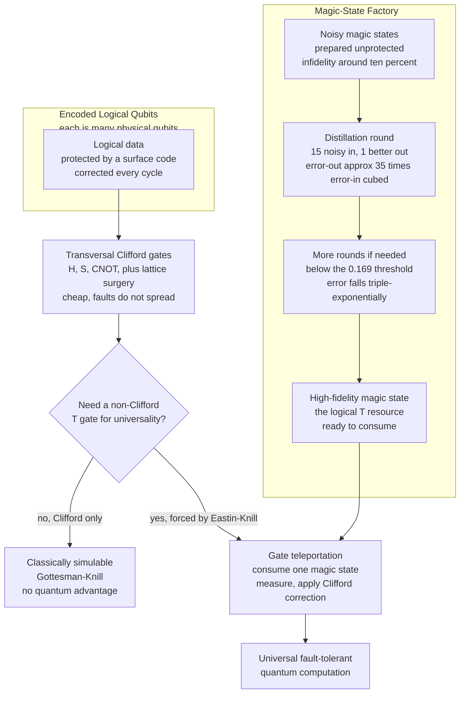

# 🃏 Logical Qubits and Magic States

> [!abstract] TL;DR
> A **logical qubit** is an error-protected "virtual" qubit encoded across **many physical qubits** by a quantum error-correcting code; a fault-tolerant algorithm runs on logical qubits, never on raw physical ones. Computing on them requires performing **gates without decoding** and **without letting one physical fault spread** into an uncorrectable error. The easiest such gates are **transversal**: apply a physical gate to each qubit independently so errors stay isolated. The **Clifford group** `{H, S, CNOT}` is often transversal and cheap — but Cliffords alone are **not universal** and are **classically simulable** (the **Gottesman–Knill theorem**), so they carry *no* quantum advantage. The **Eastin–Knill theorem** proves that **no** code can make a *universal* gate set transversal, so at least one gate must come from elsewhere. That gate is a **non-Clifford** like the **`T` gate**, injected by consuming a special resource — a **magic state** — via **gate teleportation**. Magic states cannot be prepared fault-tolerantly by transversal Cliffords, so they are made noisily and **distilled**: many low-fidelity copies are combined to yield a few high-fidelity ones, driving error down below a threshold at enormous cost. **Magic-state factories dominate** the qubit and time budget of real fault-tolerant algorithms — much of why running **Shor** on RSA-2048 needs *millions* of physical qubits. The one-line moral: **Clifford is free and classical; magic is the expensive quantum fuel.**

---

## Intuition

**Analogy — a bank vault built from a thousand cheap padlocks, with one gold key you can barely mint.** Imagine you cannot buy a single reliable lock, only flimsy padlocks that pop open on their own every few minutes. To protect one valuable, you box it behind *hundreds* of these flimsy locks arranged so that no small handful failing ever exposes the contents — and a night guard keeps re-locking any that spring open. That reinforced box is a **logical qubit**: a robust unit assembled from many unreliable **physical qubits**, kept alive by constant error-correction. The milestone everyone chases — *a logical qubit better than its physical parts* — is the moment the reinforced box actually loses valuables **less often** than a single bare padlock would, so that adding more locks keeps making it safer instead of worse.

Now here is the twist that this whole note is about. **Most operations on the box are easy and safe.** You can slide it, rotate it, or chain it to another box using moves that touch each padlock separately, so one jammed lock never cascades — these are the "transversal Clifford" moves. But there is **one crucial manipulation** — the move that actually gives quantum computing its power over an ordinary classical machine — that **cannot** be done with those safe independent touches. It requires a special, hard-to-manufacture ingredient: a **magic state**, a tiny pre-charged "gold key" that you consume to perform the operation. And you cannot mint a clean gold key directly; you can only stamp out *shoddy* keys and then run many of them through an expensive **refinery** (distillation) that melts down fifteen bad keys to cast one good one. The refinery — the **magic-state factory** — ends up occupying most of the whole vault. That single bottleneck, not the error correction itself, is what makes universal fault-tolerant quantum computing so costly.

---

## How It Works

### Core Mechanics

**1. What a logical qubit is, and the overhead it costs.** A quantum error-correcting code (see [[Quantum_Error_Correction_Principles]] for the stabilizer-measurement machinery, and [[Measurement_and_the_No_Cloning_Theorem]] for why we cannot simply copy a qubit to protect it) spreads the information of **one logical qubit** across **many physical qubits**, so that low-weight physical errors can be detected and reversed by measuring *stabilizers* without disturbing the encoded data. In the surface code (see [[Stabilizer_Codes_and_the_Surface_Code]]), a distance-`d` logical qubit uses on the order of `d²` physical qubits and can correct any `(d−1)/2` faults; pushing the logical error rate down means raising `d`, so the **physical-to-logical overhead** is typically **hundreds to thousands** of physical qubits per logical qubit. The key milestone — **"a logical qubit better than its physical qubits"** — is *below-threshold operation*: when the physical error rate sits under the code's threshold, increasing `d` makes the **logical** error rate fall *exponentially*, so the encoded qubit genuinely outlives its noisy components (the crux of the [[Fault_Tolerance_and_the_Threshold_Theorem]]). Above threshold, adding qubits makes things worse.

**2. Gates must act on encoded data without decoding, and without spreading faults.** A fault-tolerant algorithm never unwraps a logical qubit to operate on it — decoding would expose the fragile bare state to noise. Instead, gates act **directly on the encoded form**. The defining fault-tolerance requirement (formalized by the [[Fault_Tolerance_and_the_Threshold_Theorem]]): a **single** physical fault during a gate must not produce **two or more** errors on the *same* logical qubit (which the code could then no longer correct). Every logical operation must be engineered so faults stay sparse and correctable.

**3. Transversal gates — the simplest fault-tolerant construction.** A logical gate is **transversal** if it is implemented by applying a physical gate to each physical qubit **independently** (qubit `i` of one code block interacts only with qubit `i`, never `i` with `j` inside a block). Because the physical operations never couple qubits within a block, a single faulty gate can corrupt at most **one** qubit per block — errors **cannot spread**, which is exactly the fault-tolerance condition. Transversality is the cleanest, cheapest source of fault-tolerant gates. For many codes, the entire **Clifford group** — generated by the **Hadamard `H`**, the **phase gate `S`**, and the **`CNOT`** (see [[Quantum_Gates_and_Circuits]]) — is transversal or nearly so.

**4. Why Clifford-only is not enough — Gottesman–Knill.** Here is the catch. The Clifford group is **not universal**, and worse, any circuit built *only* from Clifford gates acting on stabilizer inputs can be **simulated efficiently on a classical computer** — the **Gottesman–Knill theorem**. The reason: Clifford gates map Pauli operators to Pauli operators, so an `n`-qubit stabilizer state is fully tracked by `O(n²)` bits (its stabilizer generators) and updated in polynomial time. A machine that can only do Cliffords therefore has **no quantum advantage** — it is a (very structured) classical device. Real quantum power *requires* at least one gate outside the Clifford group (see [[Quantum_Computation_and_BQP]]).

**5. The Eastin–Knill no-go theorem — the fundamental obstruction.** Could we just find a code that makes a *universal* gate set transversal, and get everything for free? **No.** The **Eastin–Knill theorem** proves that for **any** nontrivial quantum error-correcting code, the set of transversal logical gates is a **finite group** — and a finite group can never be universal (universality needs a continuum of unitaries, or at least a non-Clifford gate that generates a dense set). So **at least one gate in a universal set can never be transversal** and must be implemented by some other, costlier mechanism. This is not an engineering inconvenience; it is a theorem.

**6. Magic states and the `T` gate — importing universality.** Universality needs a **non-Clifford** gate, canonically the **`T` gate** (a 45° `Z`-axis phase rotation, `diag(1, e^{iπ/4})`). Since `T` cannot be transversal (Eastin–Knill), it is applied *indirectly*: prepare a special single-qubit resource state — the **magic state** `|T⟩ = (|0⟩ + e^{iπ/4}|1⟩)/√2` — and **consume** it to enact `T` on the data via **gate teleportation**. Gate teleportation is a small measurement-based circuit — the same measure-and-correct primitive behind [[Quantum_Teleportation]]: entangle the logical data qubit with the magic state using a transversal `CNOT`, **measure**, and apply a Clifford **correction** conditioned on the outcome (see [[Entanglement_and_Bell_States]]). Every operation in the injection circuit is Clifford and fault-tolerant; all the non-Clifford "quantumness" was pre-loaded into the magic state. **Magic states are literally the resource that lifts a classically-simulable Clifford machine into a universally powerful quantum one.**

**7. Magic-state distillation — the expensive refinery.** Magic states themselves *cannot* be prepared fault-tolerantly by transversal gates (that is the whole point of Eastin–Knill). So they are prepared **noisily** — a direct, unprotected rotation with some infidelity `ε` — and then **distilled**. A distillation protocol takes **many** noisy copies, runs them through a Clifford circuit based on an error-detecting code, and post-selects on the checks to output **fewer** copies of **much higher** fidelity. The canonical **15-to-1** protocol (Bravyi–Kitaev, built on the `[[15,1,3]]` Reed–Muller code) consumes **15** noisy magic states to produce **1** whose output error is `ε_out ≈ 35 · ε_in³` — a **cubic** suppression. Iterating drives the error down **triple-exponentially fast**, *provided* `ε_in` is below the distillation threshold `ε_in < 1/√35 ≈ 0.169`. The price is steep: each round multiplies the input count by 15, so reaching very low error costs **thousands** of raw magic states per clean one, plus all the physical qubits to error-correct every intermediate step.

**8. The resource-cost picture — magic dominates.** Because Cliffords are cheap and magic is dear, the cost of a fault-tolerant algorithm is measured in **`T`-count** and **`T`-depth** — how many magic states it burns. Whole regions of the chip become dedicated **magic-state factories** running distillation in parallel, and these factories often occupy the **majority of the qubits and runtime**. This is a headline reason estimates for running **[[Shors_Factoring_Algorithm]]** against RSA-2048 reach the scale of **millions** of physical qubits (much of it factory) — and why post-quantum migration is urgent even though no such machine exists yet (see [[Post_Quantum_Cryptography]]).

**9. Doing logical gates on the surface code — lattice surgery.** The surface code has no clean transversal two-qubit gate between separate logical patches, so logical `CNOT`s and measurements are done by **lattice surgery** (and its cousin **code deformation**): patches are temporarily **merged** and **split** along their boundaries by turning stabilizer measurements on and off, enacting joint `ZZ` or `XX` measurements that compose into a logical `CNOT` (see [[Stabilizer_Codes_and_the_Surface_Code]]). Combined with transversal single-qubit Cliffords and injected magic states for `T`, lattice surgery gives a full universal fault-tolerant gate set on a 2D chip.

**10. The frontier.** The dominant research target is **shrinking magic-state overhead**: cheaper distillation protocols, **magic-state cultivation** (growing a high-fidelity state directly at small code distance, skipping bulky distillation), better codes with more transversal gates, and alternative universality routes such as **code switching** between two codes whose transversal gate sets are complementary. The conceptual payoff stays fixed: **Clifford = free and classical, magic = the scarce quantum fuel.**

### Flow / Architecture



---

## Key Concepts

**Secondary (the picture, no linear algebra):**
- **Logical qubit = a reinforced box of many flimsy locks.** One protected qubit is built from hundreds of noisy physical qubits, kept alive by constant error-correction.
- **The milestone.** "A logical qubit better than its physical qubits" means the box loses its contents *less* often than a single bare lock — so adding more locks helps instead of hurting.
- **Easy moves vs the one hard move.** Most gates on the box are safe and cheap (Clifford); one crucial move that gives real quantum power needs a special consumable "magic" ingredient.
- **You cannot mint clean magic directly.** You stamp out shoddy copies and run many through a refinery (distillation) that melts several bad ones into one good one — expensive.
- **The refinery eats the chip.** Magic-state factories take up most of the qubits, which is why breaking RSA needs *millions* of them.

**Undergraduate (the machinery):**
- **Physical-to-logical overhead.** Distance-`d` surface code ≈ `d²` physical qubits per logical qubit; below-threshold operation makes logical error fall exponentially in `d`.
- **Transversal gate.** Apply a physical gate to each qubit independently so a single fault stays confined to one qubit per block — the errors-cannot-spread fault-tolerance condition.
- **Clifford group `{H, S, CNOT}`.** Often transversal and cheap, maps Paulis to Paulis — but *not* universal.
- **Gottesman–Knill theorem.** Clifford-only circuits on stabilizer states are classically simulable in `O(n²)` bits, hence carry no quantum advantage.
- **`T` gate and the magic state `|T⟩`.** The non-Clifford gate that grants universality, injected by consuming `|T⟩ = (|0⟩ + e^{iπ/4}|1⟩)/√2` via gate teleportation.
- **`T`-count / `T`-depth.** The true cost metric of a fault-tolerant algorithm, since Cliffords are nearly free.

**Graduate (the frontier):**
- **Eastin–Knill theorem.** For any nontrivial code the transversal logical gates form a finite group, so no code admits a universal transversal gate set — a fundamental obstruction, not an engineering gap.
- **15-to-1 distillation and its fixed point.** `ε_out ≈ 35 ε_in³` (Reed–Muller `[[15,1,3]]` code); the map contracts iff `ε_in < 1/√35 ≈ 0.169`, giving cubic error suppression at 15× state cost per round.
- **Lattice surgery and code deformation.** Merge/split of surface-code patches to realize logical `CNOT` and joint Pauli measurements without a transversal two-qubit gate.
- **Resource estimation.** Layered "widget" accounting — logical qubits, code distance, factory count, and `T`-count — yields the millions-of-qubits figures for Shor at RSA scale.
- **Overhead-reduction frontier.** Magic-state cultivation, block-code distillation with better yield, code switching, and non-Clifford transversal codes (3D color codes) as competing universality routes.

---

## Python Demo

```python
# Two ideas in one script, numpy + matplotlib only (no qiskit / no stim):
#
#   PART A -- MAGIC-STATE DISTILLATION as a nonlinear fidelity map.
#     The 15-to-1 protocol consumes 15 noisy magic states to output 1 whose
#     infidelity obeys  eps_out ~= 35 * eps_in**3  (cubic suppression). We plot
#     eps_out vs eps_in against the y = x line to expose the distillation
#     THRESHOLD at eps* = 1/sqrt(35) ~= 0.169, and iterate the map from below
#     threshold to show error crashing triple-exponentially -- at the cost of
#     15**k raw states per clean state after k rounds.
#
#   PART B -- CLIFFORD vs NON-CLIFFORD resource distinction.
#     A Clifford-only circuit (H, S, CNOT) is simulated CLASSICALLY via the
#     stabilizer tableau (Gottesman-Knill): the whole n-qubit state is tracked
#     with an n x (2n+1) bit table and updated in polynomial time. A T gate is
#     NOT Clifford -- it cannot update the tableau, which is exactly why it needs
#     a distilled magic state. The T gate is the hard, quantum resource.

import numpy as np
import matplotlib.pyplot as plt

# ======================================================================
# PART A -- magic-state distillation: the cubic fidelity map
# ======================================================================
def distill_15_to_1(eps):
    """One round of 15-to-1 distillation, leading-order output infidelity."""
    return 35.0 * eps ** 3

threshold = 1.0 / np.sqrt(35.0)          # fixed point where 35*eps^2 = 1
print(f"Distillation threshold  eps* = 1/sqrt(35) = {threshold:.4f}")

# Iterate the map starting BELOW threshold; track error and cumulative cost.
eps = 0.10                                # noisy magic states at 10% infidelity
errors, costs = [eps], [1]
for k in range(1, 5):
    eps = distill_15_to_1(eps)
    errors.append(eps)
    costs.append(15 ** k)                 # 15 inputs per output, compounded
    print(f"round {k}: infidelity = {eps:.3e}   raw states per clean state = {15**k}")

# ---- Figure with two panels ----
fig, (axL, axR) = plt.subplots(1, 2, figsize=(12, 4.6))

# Left: the fidelity map eps_out vs eps_in, with y = x and the threshold.
x = np.linspace(0, 0.30, 400)
axL.plot(x, distill_15_to_1(x), color="#2563eb", lw=2,
         label="eps_out = 35 * eps_in^3")
axL.plot(x, x, "--", color="#6b7280", lw=1.5, label="eps_out = eps_in")
axL.axvline(threshold, color="#dc2626", ls=":", lw=1.5)
axL.fill_between(x, 0, 0.30, where=(x < threshold), color="#22c55e", alpha=0.10)
axL.text(threshold + 0.005, 0.24, f"threshold\neps* = {threshold:.3f}",
         color="#dc2626", fontsize=9)
axL.text(0.03, 0.255, "DISTILLATION\nHELPS\n(eps_out < eps_in)",
         color="#166534", fontsize=9, weight="bold")
axL.set_xlim(0, 0.30); axL.set_ylim(0, 0.30)
axL.set_xlabel("input infidelity  eps_in"); axL.set_ylabel("output infidelity  eps_out")
axL.set_title("15-to-1 distillation: cubic error suppression"); axL.legend(loc="upper right", fontsize=8)

# Right: error vs round (log scale) with the compounding resource cost.
rounds = np.arange(len(errors))
axR.semilogy(rounds, errors, "o-", color="#7c3aed", lw=2)
for r, (e, c) in enumerate(zip(errors, costs)):
    axR.annotate(f"{c} states", (r, e), textcoords="offset points",
                 xytext=(6, 6), fontsize=8, color="#4b5563")
axR.set_xlabel("distillation round  k"); axR.set_ylabel("magic-state infidelity")
axR.set_title("Error crashes triple-exponentially -- cost grows 15^k")
axR.grid(True, which="both", ls=":", alpha=0.4)

plt.tight_layout()
plt.savefig("magic_state_distillation.png", dpi=130)
print("Saved distillation plot to magic_state_distillation.png\n")

# ======================================================================
# PART B -- Clifford stabilizer simulation (Gottesman-Knill), no T gate
# ======================================================================
class Stabilizer:
    """Aaronson-Gottesman stabilizer tableau for the CLIFFORD group only.

    State of n qubits is tracked by n stabilizer generators. Each generator is a
    signed Pauli string encoded by bit-vectors x, z (n bits each) and a phase r.
    Clifford gates update this O(n^2)-bit table in poly time -> Gottesman-Knill.
    """
    def __init__(self, n):
        self.n = n
        self.x = np.zeros((n, n), dtype=int)     # X-part of each generator
        self.z = np.eye(n, dtype=int)            # |0..0> is stabilized by Z_1..Z_n
        self.r = np.zeros(n, dtype=int)          # phase bit: 0 -> +, 1 -> -

    def h(self, a):                              # Hadamard on qubit a
        self.r ^= self.x[:, a] & self.z[:, a]
        self.x[:, a], self.z[:, a] = self.z[:, a].copy(), self.x[:, a].copy()

    def s(self, a):                              # Phase gate S on qubit a
        self.r ^= self.x[:, a] & self.z[:, a]
        self.z[:, a] ^= self.x[:, a]

    def cnot(self, a, b):                        # CNOT control a, target b
        self.r ^= self.x[:, a] & self.z[:, b] & (self.x[:, b] ^ self.z[:, a] ^ 1)
        self.x[:, b] ^= self.x[:, a]
        self.z[:, a] ^= self.z[:, b]

    def t(self, a):                              # T gate -- NOT Clifford!
        raise NotImplementedError(
            "T is non-Clifford: it maps a Pauli to a non-Pauli, so it CANNOT "
            "update the stabilizer tableau. This is exactly why a fault-tolerant "
            "T requires a distilled MAGIC STATE consumed via gate teleportation.")

    def generators(self):
        sym = {(0, 0): "I", (1, 0): "X", (0, 1): "Z", (1, 1): "Y"}
        out = []
        for i in range(self.n):
            s = "".join(sym[(self.x[i, j], self.z[i, j])] for j in range(self.n))
            out.append(("-" if self.r[i] else "+") + s)
        return out

# Build a 3-qubit GHZ state with a Clifford circuit: H(0), CNOT(0,1), CNOT(1,2).
sim = Stabilizer(3)
sim.h(0); sim.cnot(0, 1); sim.cnot(1, 2)
print("Clifford GHZ circuit  H(0), CNOT(0,1), CNOT(1,2)")
print("stabilizer generators (state fully tracked by 3 x 7 bits):")
for g in sim.generators():
    print("   ", g)
print("Classically simulated in polynomial time -- NO quantum advantage.\n")

# Now try the hard resource: a T gate.
try:
    sim.t(0)
except NotImplementedError as e:
    print("Attempting a T gate:\n   ", str(e))

# Expected output (GHZ is stabilized by +XXX, +ZZI, +IZZ up to sign convention),
# then the T gate refuses -- the whole point: Clifford is free & classical,
# magic (the T gate) is the expensive quantum fuel.
```

The distillation panel shows the cubic map `ε_out = 35 ε_in³` dipping **below** the `y = x` diagonal only to the left of `ε* = 1/√35 ≈ 0.169`: start below threshold and each round shrinks the error, start above and each round *amplifies* it. The iteration panel makes the two-edged nature vivid — from a 10% noisy state the infidelity plunges `0.10 → 0.035 → 1.5×10⁻³ → 1.2×10⁻⁷` in four rounds (triple-exponential), while the annotation shows the cost compounding `15 → 225 → 3375 → 50625` raw states per clean output. Part B prints the GHZ stabilizers, proving the entire Clifford evolution is a polynomial bit-table update (Gottesman–Knill, no advantage), and then the `T` gate **refuses to run** in the stabilizer formalism — the concrete reason it must be imported as a distilled magic state.

---

## Real-World Applications

> **Example — Google's and IBM's roadmaps to error correction, and Litinski's surface-code "game of surface codes."** Google's 2023–2024 surface-code experiments demonstrated the pivotal milestone in mechanic #1: a distance-5 logical qubit with a **lower** logical error rate than a distance-3 one, i.e. *below-threshold* scaling where adding physical qubits makes the logical qubit better — a logical qubit beating its physical parts. On the software side, resource-estimation tools (Microsoft's Azure Quantum Resource Estimator, Google's and PsiQuantum's compilers) quote every algorithm in **logical qubits, code distance, `T`-count, and number of magic-state factories**, because the factory count and distillation rounds — not the data qubits — dominate the footprint and the runtime.

- **Costing Shor against RSA-2048.** Gidney–Ekerå's canonical estimate (~20 million noisy physical qubits, ~8 hours) is dominated by magic-state distillation feeding the modular-exponentiation `T` gates; halving the `T`-count roughly halves the machine, so distillation efficiency directly sets the "when does RSA fall" timeline (see [[Shors_Factoring_Algorithm]], [[Post_Quantum_Cryptography]]).
- **Magic-state factories as chip floorplan.** In surface-code architectures (Litinski, Fowler–Gidney), dedicated factory tiles run 15-to-1 (or 116-to-12 block) distillation in parallel and *pipe* finished magic states to the compute region via lattice surgery; the factory commonly occupies **more than half** the qubits.
- **Magic-state cultivation (2024).** Newer protocols grow a high-fidelity magic state directly at small code distance and expand it, cutting the distillation overhead by an order of magnitude — an active attack on exactly the bottleneck this note describes.
- **Benchmarking `T`-count in compilers.** Circuit optimizers (`T`-par, phase-polynomial synthesis) exist almost solely to **minimize `T`-count**, because Clifford gates are nearly free under fault tolerance and every saved `T` saves a magic state.

---

## Common Pitfalls

- **Confusing physical and logical qubits.** A "100-qubit" NISQ chip is 100 *physical* qubits with no protection; a fault-tolerant algorithm needs that many *logical* qubits, each costing hundreds to thousands of physical qubits. Quoting algorithm sizes in physical qubits without the code overhead understates the hardware by orders of magnitude.
- **Thinking error correction alone gives you a quantum computer.** Storing a logical qubit is only half the job. Eastin–Knill guarantees you *cannot* get a universal gate set transversally, so a fault-tolerant *memory* is useless without the magic-state machinery to actually **compute** on it.
- **Believing Clifford gates give quantum speedup.** By Gottesman–Knill, a Clifford-only machine is classically simulable — no advantage whatsoever. Beginners build impressive-looking entangled Clifford circuits and wrongly infer power; the power lives entirely in the non-Clifford `T`.
- **Assuming magic states can be error-corrected into existence cheaply.** They cannot be prepared by transversal Cliffords (that is Eastin–Knill again), so the *only* route is noisy preparation plus distillation. There is no shortcut that makes `T` as cheap as `H`.
- **Ignoring the distillation threshold.** Distillation only *improves* fidelity if the raw input error is below the protocol's threshold (`≈ 0.169` for 15-to-1). Feed it states that are too noisy and each round makes them **worse** — the cubic map runs the wrong way above the fixed point.
- **Under-budgeting `T`-count.** Two circuits with identical qubit counts and Clifford structure can differ by 1000× in cost if one uses far more `T` gates. Resource estimates that count qubits but not `T`-count (and thus factory load) are meaningless.
- **Forgetting the surface code has no easy transversal `CNOT`.** Two-qubit logical gates on the surface code come from **lattice surgery**, not a transversal application; treating logical `CNOT` as "free and transversal" like single-qubit Cliffords mis-costs the circuit.

---

## Related Concepts

- [[Fault_Tolerance_and_the_Threshold_Theorem]] — supplies the below-threshold guarantee and the "one fault must not spread" rule that every logical gate here must obey; this note is *how you compute* once that theorem lets you *store*.
- [[Stabilizer_Codes_and_the_Surface_Code]] — the concrete code these logical qubits live in; its stabilizer structure sets which gates are transversal and forces lattice surgery for the logical `CNOT`.
- [[Quantum_Error_Correction_Principles]] — the encoding, syndrome-measurement, and correction machinery that defines a logical qubit in the first place.
- [[Quantum_Gates_and_Circuits]] — defines the Clifford set `{H, S, CNOT}`, the non-Clifford `T`, and universality; this note explains which of those are transversal/free and which need a magic state.
- [[Quantum_Teleportation]] — the measure-and-correct primitive that gate teleportation reuses to inject a `T` gate by consuming a magic state.
- [[Quantum_Computation_and_BQP]] — Gottesman–Knill places Clifford-only circuits *outside* the source of quantum advantage; magic states are what let a fault-tolerant machine reach the full power of BQP.
- [[Shors_Factoring_Algorithm]] — the flagship algorithm whose fault-tolerant cost (millions of physical qubits) is dominated by the magic-state factories feeding its `T` gates.
- [[Measurement_and_the_No_Cloning_Theorem]] — no-cloning forbids simply copying a qubit (or a magic state) for protection; measurement is also the engine of the gate-teleportation `T` injection.
- [[Entanglement_and_Bell_States]] — gate teleportation entangles the data qubit with the magic state, then measures and corrects — the same teleportation primitive applied to inject a gate.
- [[Post_Quantum_Cryptography]] — the defensive response whose urgency is set by how quickly magic-state overhead (hence Shor's real cost) can be driven down.

---

## Review Questions

1. **(Secondary)** Using the "reinforced box of flimsy padlocks" analogy, explain what a **logical qubit** is, what it means for "a logical qubit to be better than its physical qubits," and why *most* operations on the box are cheap while *one* crucial operation needs a scarce, hard-to-make ingredient.
2. **(Undergraduate)** Your circuit uses only `H`, `S`, and `CNOT` gates on stabilizer inputs. (a) Why is it fault-tolerant to implement these **transversally**, and what does "transversal" mean precisely? (b) By the **Gottesman–Knill theorem**, what can you conclude about running this circuit on a classical computer, and therefore about its quantum advantage? (c) What single kind of gate must you add to gain real quantum power, and by what mechanism is it implemented fault-tolerantly?
3. **(Graduate / trade-off)** A fault-tolerant algorithm needs magic states at output infidelity `10⁻¹²`, and your noisy factory produces them at infidelity `0.05`. (a) Using the 15-to-1 map `ε_out ≈ 35 ε_in³`, estimate how many distillation **rounds** and roughly how many **raw magic states per clean output** are required, and confirm you are below the threshold `1/√35`. (b) Explain, invoking the **Eastin–Knill theorem**, why there is no way to sidestep this cost by finding a code with a transversal `T`. (c) Given that magic-state factories can occupy most of the chip, argue how reducing an algorithm's **`T`-count** (or adopting **magic-state cultivation**) changes the physical-qubit estimate for running Shor on RSA-2048.

---

## Sources

- Eastin, B. & Knill, E. "Restrictions on Transversal Encoded Quantum Gate Sets." *Physical Review Letters* 102, 110502, 2009. [arXiv:0811.4262](https://arxiv.org/abs/0811.4262)
- Bravyi, S. & Kitaev, A. "Universal Quantum Computation with Ideal Clifford Gates and Noisy Ancillas." *Physical Review A* 71, 022316, 2005. [arXiv:quant-ph/0403025](https://arxiv.org/abs/quant-ph/0403025)
- Gottesman, D. "The Heisenberg Representation of Quantum Computers." *arXiv:quant-ph/9807006*, 1998 — the Gottesman–Knill theorem on efficient classical simulation of Clifford circuits.
- Fowler, A. G., Mariantoni, M., Martinis, J. M. & Cleland, A. N. "Surface Codes: Towards Practical Large-Scale Quantum Computation." *Physical Review A* 86, 032324, 2012. [arXiv:1208.0928](https://arxiv.org/abs/1208.0928)
- Litinski, D. "A Game of Surface Codes: Large-Scale Quantum Computation with Lattice Surgery." *Quantum* 3, 128, 2019. [arXiv:1808.02892](https://arxiv.org/abs/1808.02892)
- Gidney, C. & Ekerå, M. "How to factor 2048 bit RSA integers in 8 hours using 20 million noisy qubits." *Quantum* 5, 433, 2021. [arXiv:1905.09749](https://arxiv.org/abs/1905.09749)

---

#quantum-computing #logical-qubits #magic-states #t-gate #fault-tolerant
