# 🛡️ Quantum Error Correction Principles

> [!abstract] TL;DR
> Quantum bits are catastrophically fragile: **decoherence** and noise corrupt them millions of times faster than classical bits, yet the three obvious defenses are all *forbidden by quantum mechanics* — you cannot **copy** an unknown state to make backups (**no-cloning**), you cannot **read** the data to check it without collapsing the superposition, and the errors are **continuous** rotations rather than tidy discrete flips. **Quantum error correction (QEC)** escapes this trap with three insights: (1) spread one **logical** qubit across many **physical** qubits using **entanglement**, not duplication; (2) measure carefully chosen **syndrome** (stabilizer) operators that reveal *what error happened and where* while revealing *nothing* about the encoded data, so the superposition survives; and (3) that same measurement **discretizes** a continuous error, projecting it onto a finite Pauli set $\{X, Y, Z\}$ that a small lookup table can undo. A code with parameters $[[n, k, d]]$ encodes $k$ logical qubits into $n$ physical ones with distance $d$, correcting up to $\lfloor (d-1)/2 \rfloor$ arbitrary single-qubit errors. Foundational examples — the 3-qubit bit-flip/phase-flip codes, **Shor's 9-qubit code**, the 5-qubit perfect code, and the 7-qubit **Steane code** — build up to the **threshold theorem**: below a critical physical error rate, encoding *suppresses* logical errors, and larger codes drive them arbitrarily low. The price is a brutal **overhead** of hundreds-to-thousands of physical qubits per usable logical qubit, which is exactly why fault-tolerant machines need so many qubits.

---

## Intuition

**Analogy — protecting a secret you are not allowed to read, photograph, or write down.** Imagine you must safeguard a fragile message written in disappearing ink, under three impossible-sounding rules. You may **not photocopy it** (any copier destroys the original). You may **not read it** (reading it burns the page). And the "damage" it suffers isn't a clean torn corner but a slow, continuous *fade* that could be anywhere along a spectrum. How could you *possibly* detect and repair damage to something you can neither duplicate nor look at?

The trick: instead of storing the message on one page, you **weave it across many pages so tightly that the meaning lives in the *relationships between* the pages, not on any single page**. Now you never ask "what does page 3 say?" — that would burn it. Instead you ask *comparison* questions: "do pages 2 and 3 still agree?" A yes/no answer to a comparison leaks nothing about the secret itself, yet a *disagreement* pinpoints exactly which page got damaged. And the very act of asking a sharp yes/no comparison **forces the vague, continuous fade to snap into a definite, discrete flaw** you can name and reverse.

Technically: QEC encodes one **logical qubit** into an **entangled** state of many **physical qubits**; it measures **joint parity (stabilizer) operators** — the "do these pages agree?" checks — which return an error **syndrome** without collapsing the encoded superposition; and that projective measurement **discretizes** the continuous noise into a Pauli error you can correct with a single gate. Redundancy without copying, checking without reading, discrete fixes for continuous faults.

---

## How It Works

### Why it looked impossible: three obstacles

Classical error correction is easy — you just copy bits and take a majority vote. Every step of that recipe is illegal in quantum mechanics:

1. **You cannot copy (no-cloning).** There is no machine that turns an unknown $\lvert\psi\rangle$ into $\lvert\psi\rangle\lvert\psi\rangle$ (see [[Measurement_and_the_No_Cloning_Theorem]]). So "keep three backup copies and vote" is off the table from the first line.
2. **You cannot look (measurement collapses).** Reading a qubit to "check if it's still right" projects the superposition $a\lvert 0\rangle + b\lvert 1\rangle$ onto a single basis state, destroying the very information you were protecting. The check itself becomes the fatal error.
3. **Errors are continuous, not discrete.** A classical bit either flips or it doesn't. A qubit can suffer *any* tiny rotation on the Bloch sphere — a continuum of possible errors $e^{-i\theta \hat n \cdot \vec\sigma}$. There seem to be *infinitely many* distinct errors to correct, and you can't build an infinitely large lookup table.

For a while these obstacles made QEC look not just hard but *provably* impossible. It isn't.

### The three insights that make it possible

**Insight 1 — Redundancy through entanglement, not duplication.** No-cloning forbids $\lvert\psi\rangle \to \lvert\psi\rangle\lvert\psi\rangle$, but it says *nothing* about spreading one qubit's information into an *entangled* many-qubit state. The 3-qubit bit-flip code encodes

$$a\lvert 0\rangle + b\lvert 1\rangle \;\longrightarrow\; a\lvert 000\rangle + b\lvert 111\rangle .$$

This is emphatically **not** three copies of $a\lvert 0\rangle + b\lvert 1\rangle$ (that would be $(a\lvert 0\rangle + b\lvert 1\rangle)^{\otimes 3}$, a product state). It is a single entangled state where the amplitudes $a, b$ are delocalized: no individual physical qubit carries $a$ or $b$ on its own. You built redundancy *without* cloning.

**Insight 2 — Syndrome measurement reads the error, not the data.** Don't measure the qubits; measure *joint parities*. For the bit-flip code, measure the two **stabilizer** operators

$$S_1 = Z_1 Z_2, \qquad S_2 = Z_2 Z_3 .$$

Each is a $\pm 1$-valued observable that compares neighbors. Crucially, both $\lvert 000\rangle$ and $\lvert 111\rangle$ are $+1$ eigenstates of $S_1$ and $S_2$, so measuring them on $a\lvert 000\rangle + b\lvert 111\rangle$ returns $+1, +1$ *with certainty and without disturbing $a$ or $b$* — the measurement commutes with the logical information. If qubit 1 flips ($X_1$), the state becomes $a\lvert 100\rangle + b\lvert 011\rangle$; now $S_1 = -1$ (qubits 1,2 disagree) and $S_2 = +1$ (qubits 2,3 agree). The **syndrome** $(-1, +1)$ *names the flipped qubit* while the superposition rides along untouched. This is the heart of QEC and is developed systematically as the **stabilizer formalism** underlying the surface code.

| Syndrome $(S_1, S_2)$ | Diagnosis | Correction |
|---|---|---|
| $(+1, +1)$ | no error | none |
| $(-1, +1)$ | qubit 1 flipped | apply $X_1$ |
| $(-1, -1)$ | qubit 2 flipped | apply $X_2$ |
| $(+1, -1)$ | qubit 3 flipped | apply $X_3$ |

**Insight 3 — Measurement discretizes continuous errors.** Suppose the error is a tiny rotation $E = \cos\theta\, I + i\sin\theta\, X_1$ (a continuous mix of "no error" and "full flip"). The post-error state is a superposition of an uncorrupted branch and a flipped branch. When you measure the syndrome, you **project**: with probability $\cos^2\theta$ you get $(+1,+1)$ and the state collapses to the *clean* code state; with probability $\sin^2\theta$ you get $(-1,+1)$ and it collapses to the state with a *full, discrete* $X_1$ error, which you then undo. The continuum of possible rotations collapses onto a *finite* set of Pauli outcomes. Because any single-qubit operator can be written in the Pauli basis $\{I, X, Y, Z\}$ (with $Y = iXZ$), **correcting the discrete Paulis is sufficient to correct arbitrary continuous noise** — the deep reason QEC works at all despite obstacle #3, and the bridge back to decoherence and quantum noise.

### From bit-flips to *any* error: the foundational codes

- **3-qubit bit-flip code** $\lvert 0\rangle \to \lvert 000\rangle$: corrects a single $X$ (bit-flip) error, but is *blind* to $Z$ (phase-flip) errors.
- **3-qubit phase-flip code** $\lvert 0\rangle \to \lvert {+}{+}{+}\rangle$: the same code rotated into the Hadamard basis, correcting a single $Z$ error but blind to $X$. A phase-flip in one basis *is* a bit-flip in the other.
- **Shor's 9-qubit code** (1995): the first *full* QEC code. **Concatenate** the two — protect against phase-flips with the 3-qubit phase code, then protect each of those three qubits against bit-flips with a 3-qubit bit-flip code ($3 \times 3 = 9$). Because $X$, $Z$, and $Y = iXZ$ are all handled, it corrects *any* arbitrary single-qubit error. This concretely proved QEC is possible.
- **5-qubit perfect code** $[[5, 1, 3]]$ (Laflamme *et al.* 1996): the *smallest possible* code correcting an arbitrary single-qubit error — it saturates the quantum Hamming bound, wasting nothing.
- **7-qubit Steane code** $[[7, 1, 3]]$ (1996): built from the classical **Hamming(7,4)** code (see [[Error_Correcting_Codes_Fundamentals]]); its extra structure makes many logical gates especially easy, so it is a workhorse of fault-tolerance theory.

### Code parameters and distance

A quantum code is labeled $[[n, k, d]]$ (double brackets distinguish it from a classical $[n, k, d]$):

- $n$ = number of **physical** qubits used,
- $k$ = number of **logical** qubits protected (dimension $2^k$ code space),
- $d$ = **code distance**, the minimum weight of an undetectable logical error.

A distance-$d$ code **detects** up to $d - 1$ errors and **corrects** up to

$$t = \left\lfloor \frac{d-1}{2} \right\rfloor$$

arbitrary single-qubit errors — *exactly* the classical sphere-packing formula, now in a Hilbert space. Shor $[[9,1,3]]$, the 5-qubit $[[5,1,3]]$, and Steane $[[7,1,3]]$ all have $d = 3$, so each corrects $t = 1$ error. To correct more errors you need larger $d$, which needs more physical qubits — the origin of QEC's crushing overhead.

### CSS codes and the classical connection

**Calderbank–Shor–Steane (CSS) codes** make the classical link explicit: take two classical **linear block codes** (see [[Linear_Block_Codes_and_Reed_Solomon]]) with a nesting property, use one to fight $X$ errors and the other to fight $Z$ errors, and you get a quantum code whose parity checks are literally the classical parity-check matrices. Steane's code *is* the Hamming code used twice. This is why quantum coding theory inherited half a century of classical coding theory — but it must additionally slay the phase-error and no-cloning dragons that classical codes never faced.

### The threshold preview and the overhead cost

QEC is only worth it if correcting introduces fewer errors than it removes. The **threshold theorem** promises that *if* the physical error rate per operation is below a critical value $p_{\text{th}}$, then encoding **suppresses** the logical error rate, and **concatenating** codes (or growing the surface code) drives it *arbitrarily* low with only polylogarithmic overhead. Below threshold, more qubits = fewer logical errors; above threshold, more qubits = *more* errors. That threshold and its fault-tolerance machinery are the subject of their own dedicated treatment.

The catch is **overhead**: realistic thresholds ($\sim 10^{-2}$) demand roughly $10^3$–$10^4$ physical qubits per logical qubit for useful algorithms. This single fact drives the enormous qubit counts on every quantum-hardware roadmap and separates today's noisy **NISQ** machines (which use *error mitigation* rather than correction) from the future **fault-tolerant** era (which uses full QEC plus **logical operations and magic states** to run arbitrarily long computations).

### Flow / Architecture

```mermaid
graph LR
    LQ["One logical qubit<br/>a times zero-L plus b times one-L<br/>fragile, must not be measured"]
    ENC["Encoder<br/>entangle across n physical qubits<br/>redundancy WITHOUT copying"]
    PHYS["n physical qubits<br/>amplitudes a and b delocalized<br/>held in the code space"]
    NOISE["Noise and decoherence<br/>continuous rotations on each qubit<br/>bit-flip X and phase-flip Z"]
    SYN["Syndrome measurement<br/>measure joint parity stabilizers<br/>Z1 Z2 and Z2 Z3 style checks"]
    PROJ["Error discretization<br/>projects the continuous error<br/>onto a discrete Pauli X, Y or Z"]
    DEC["Decoder<br/>syndrome names the correction<br/>apply the inverse Pauli"]
    OUT["Logical qubit restored<br/>amplitudes a and b untouched<br/>superposition survives"]

    LQ --> ENC
    ENC --> PHYS
    PHYS --> NOISE
    NOISE --> SYN
    SYN --> PROJ
    PROJ --> DEC
    DEC --> OUT
    SYN -. "learns the error, never the data" .-> PHYS
```



---

## Key Concepts

### Secondary (intuitive level)
- A qubit is far more fragile than a bit, and the three easy fixes — copy it, check it, wait for a clean flip — are all *banned* by quantum rules.
- **Solution:** hide one logical qubit inside the *relationships* between many physical qubits (entanglement), so no single qubit holds the secret.
- Ask *comparison* questions ("do these two agree?"), never "what is this qubit?" A comparison pinpoints damage while learning nothing about the protected data.
- Asking a sharp comparison **forces vague, continuous damage to become a definite, nameable flaw** you can reverse — so a finite toolkit fixes infinitely many possible errors.

### Undergraduate (working level)
- **Encoding:** logical $\lvert 0\rangle_L, \lvert 1\rangle_L$ are entangled multi-qubit states; e.g. bit-flip code $\lvert 0\rangle_L = \lvert 000\rangle$, $\lvert 1\rangle_L = \lvert 111\rangle$. This is *not* $(\ldots)^{\otimes 3}$ — no-cloning is respected.
- **Stabilizers & syndromes:** the code space is the $+1$ eigenspace of commuting Pauli operators (stabilizers) like $Z_1 Z_2$, $Z_2 Z_3$. Measuring them yields a **syndrome** that identifies the error *without measuring $a, b$*.
- **Error discretization:** syndrome measurement projects a continuous error onto $\{I, X, Y, Z\}$; correcting the Pauli group suffices for all single-qubit noise.
- **Parameters $[[n,k,d]]$:** corrects $t = \lfloor (d-1)/2 \rfloor$ errors. Bit-flip code protects only $X$; **Shor $[[9,1,3]]$** protects everything by concatenation; **Steane $[[7,1,3]]$** and the **5-qubit $[[5,1,3]]$** are compact single-error correctors.
- **Classical analog:** the bit-flip code is the quantum version of the repetition/parity code; the extra job is the *phase* error, which has no classical counterpart.
- **Overhead & threshold (preview):** many physical qubits per logical qubit; below a threshold error rate, encoding wins and larger codes win more.

### Graduate (theoretical level)
- **Knill–Laflamme conditions:** a code with projector $P$ corrects an error set $\{E_a\}$ iff $P E_a^\dagger E_b P = \alpha_{ab} P$ for a Hermitian matrix $\alpha$. The off-diagonal terms encode "the environment learns nothing distinguishing the logical states"; this is the exact statement of *correctability* and directly implies error discretization.
- **Stabilizer formalism (Gottesman):** an $[[n, k, d]]$ stabilizer code is fixed by an abelian subgroup $S \subset \mathcal{P}_n$ of the $n$-qubit Pauli group with $-I \notin S$ and $n - k$ independent generators. Syndromes are the eigenvalues of the generators; logical operators are the normalizer $N(S)/S$; distance $d$ is the minimum weight in $N(S) \setminus S$.
- **CSS construction:** from classical codes $C_2 \subset C_1$ with $C_1$ correcting $X$ errors and $C_1^\perp \subset C_2^\perp$-style nesting correcting $Z$ errors, build $[[n, k_1 - k_2, d]]$; parity-check matrices $H_X, H_Z$ satisfy $H_X H_Z^\top = 0$, guaranteeing commuting stabilizers.
- **Quantum Hamming / Singleton bounds:** the 5-qubit code saturates the quantum Hamming bound (a *perfect* nondegenerate code); **degenerate** codes (like Shor's) can beat naive bounds because distinct errors act identically on the code space.
- **Transversal gates & Eastin–Knill:** some logical gates apply bitwise across the code (transversal, hence fault-tolerant), but no single code has a *universal* transversal gate set (Eastin–Knill), forcing **magic-state distillation** for universality.
- **Threshold theorem:** with fault-tolerant syndrome extraction, a below-threshold physical rate $p < p_{\text{th}}$ yields logical rate $p_L \sim (p/p_{\text{th}})^{2^\ell}$ after $\ell$ concatenation levels — super-exponential suppression at polylog overhead.

---

## Python Demo

```python
# The 3-qubit BIT-FLIP code, simulated as real 8-dim statevectors with numpy only.
#   Encode a|0>+b|1|  ->  a|000> + b|111>   (entanglement, NOT copying)
#   Apply an independent bit-flip (X) to each qubit with probability p
#   Measure the two syndrome stabilizers S1 = Z1 Z2 and S2 = Z2 Z3
#       -> the syndrome reveals WHICH qubit flipped, and its value does NOT
#          depend on a, b, so the logical superposition is never disturbed
#   Correct with the accused Pauli X, then check recovery via fidelity.
#   Sweep p, plot the LOGICAL error rate vs the PHYSICAL error rate p, and show
#   the pseudo-threshold (crossover with the break-even line y = x) below which
#   encoding SUPPRESSES errors (quadratic ~ 3 p^2 scaling).
import numpy as np
import matplotlib.pyplot as plt

rng = np.random.default_rng(7)

# ---- single-qubit operators ----
I2 = np.eye(2, dtype=complex)
X  = np.array([[0, 1], [1, 0]], dtype=complex)
Z  = np.array([[1, 0], [0, -1]], dtype=complex)

def op3(a, b, c):
    """Tensor three single-qubit ops into an 8x8 three-qubit operator."""
    return np.kron(np.kron(a, b), c)

# Stabilizers (joint parity checks); their eigenvalues are the syndrome.
S1 = op3(Z, Z, I2)      # compares qubits 1 and 2
S2 = op3(I2, Z, Z)      # compares qubits 2 and 3

# Basis kets |000> ... |111> as columns of the 8x8 identity.
E = np.eye(8, dtype=complex)
ket000, ket111 = E[:, 0], E[:, 7]

# Syndrome -> which qubit to flip back (assume at most one error).
CORRECTION = {(+1, +1): op3(I2, I2, I2),   # no error
              (-1, +1): op3(X,  I2, I2),   # qubit 1
              (-1, -1): op3(I2, X,  I2),   # qubit 2
              (+1, -1): op3(I2, I2, X)}    # qubit 3

def encode(a, b):
    """Logical qubit -> entangled 3-qubit code state a|000> + b|111>."""
    psi = a * ket000 + b * ket111
    return psi / np.linalg.norm(psi)

def apply_bitflips(psi, p, rng):
    """Independently flip each physical qubit with probability p; return
    (corrupted state, tuple of which qubits were flipped)."""
    flips = tuple(int(rng.random() < p) for _ in range(3))
    err = op3(X if flips[0] else I2,
              X if flips[1] else I2,
              X if flips[2] else I2)
    return err @ psi, flips

def measure_syndrome(psi):
    """Read the two stabilizer eigenvalues. For a definite Pauli error the state
    is a stabilizer eigenstate, so <psi|S|psi> is exactly +1 or -1 and is
    INDEPENDENT of a, b -- the logical data is not measured."""
    s1 = int(np.round(np.real(np.vdot(psi, S1 @ psi))))
    s2 = int(np.round(np.real(np.vdot(psi, S2 @ psi))))
    return (s1, s2)

def correct(psi):
    return CORRECTION[measure_syndrome(psi)] @ psi

# ---------- 1. One concrete round: syndrome names the error, spares the data ----
a, b = np.cos(1.1), np.sin(1.1) * np.exp(1j * 0.6)   # a generic logical qubit
psi0 = encode(a, b)
corrupted = op3(X, I2, I2) @ psi0                    # deterministically flip qubit 1
print("flipped qubit 1 by hand")
print("syndrome        :", measure_syndrome(corrupted), "  (-1,+1) accuses qubit 1")
recovered = correct(corrupted)
fid = np.abs(np.vdot(psi0, recovered))**2
print(f"fidelity after correction : {fid:.6f}  (1.0 = perfect recovery)")

# The SAME error on a DIFFERENT logical state gives the SAME syndrome ->
# proof the syndrome leaks nothing about (a, b):
other = op3(X, I2, I2) @ encode(np.cos(0.3), np.sin(0.3))
print("same error, different data -> syndrome:", measure_syndrome(other),
      "(identical, so no data leaked)")

# ---------- 2. Monte-Carlo logical error rate vs physical error rate ----------
def logical_error_rate(p, trials, rng):
    a, b = np.cos(1.1), np.sin(1.1) * np.exp(1j * 0.6)
    psi0 = encode(a, b)
    fails = 0
    for _ in range(trials):
        corrupted, _ = apply_bitflips(psi0, p, rng)
        recovered = correct(corrupted)
        if np.abs(np.vdot(psi0, recovered))**2 < 0.5:   # correction failed
            fails += 1
    return fails / trials

ps = np.logspace(-2, np.log10(0.5), 18)
trials = 6000
logical = np.array([logical_error_rate(p, trials, rng) for p in ps])
theory  = 3 * ps**2 - 2 * ps**3     # exact: P(>=2 of 3 qubits flip)

cross = ps[np.argmin(np.abs(theory - ps))]   # pseudo-threshold ~ 0.5
print(f"\nPseudo-threshold (crossover with y=x): p* ~ {cross:.2f}")
print("Below p*, encoding SUPPRESSES errors; above it, encoding HURTS.")

# ---------- 3. Plot ----------
plt.figure(figsize=(7.5, 5.5))
plt.loglog(ps, ps,      'k--', label="unencoded physical qubit  (rate = p)")
plt.loglog(ps, theory,  'b-',  lw=2, label="3-qubit code  (theory 3p^2 - 2p^3)")
plt.loglog(ps, logical, 'go', ms=6, alpha=0.8, label="3-qubit code  (Monte Carlo)")
plt.axvline(cross, color="red", ls=":", label=f"pseudo-threshold p* ~ {cross:.2f}")
plt.xlabel("physical bit-flip probability  p")
plt.ylabel("logical error rate")
plt.title("QEC works below threshold: quadratic suppression of errors")
plt.legend()
plt.grid(True, which="both", alpha=0.3)
plt.tight_layout()
plt.show()

# Takeaways:
#  * The syndrome pinpoints the flipped qubit and is identical across logical
#    states -> the encoded superposition is never measured or disturbed.
#  * The coded curve falls as ~3p^2 (slope 2 on log-log): a logical error needs
#    TWO physical flips, so errors are squared away at small p.
#  * The curves cross near p* ~ 0.5: below it encoding helps, above it the
#    majority-vote miscorrects and encoding makes things worse -- a threshold.
```

Two numbers carry the lesson. The **fidelity after correction is 1.0** even though a physical qubit was flipped — the syndrome $(-1, +1)$ located the error and the encoded amplitudes $a, b$ came through untouched (and the syndrome was *identical* for a different logical state, proving no data leaked). And the logical-error curve scales as $\sim 3p^2$ — **slope 2 on a log-log plot** — so at small $p$ the code *squares away* the error rate, the tell-tale signature of correction working below its pseudo-threshold near $p^* \approx 0.5$.

---

## Real-World Applications

> **Example — the surface code on superconducting hardware (Google, IBM).** The leading experimental QEC scheme arranges physical qubits on a 2D grid and repeatedly measures exactly the kind of joint parity stabilizers shown above (weight-4 $X$- and $Z$-checks via ancilla qubits), never measuring the data qubits themselves. In 2023–2024, Google's *Willow*-class devices demonstrated the milestone this whole note predicts: a **larger** code (distance 5, then 7) produced a **lower** logical error rate than a smaller one — direct evidence of operating *below threshold*, where adding physical qubits suppresses logical errors instead of amplifying them.

- **Fault-tolerant algorithm resource estimates.** Running Shor's algorithm to break RSA-2048 is estimated to need on the order of **thousands of logical qubits** and, at surface-code overheads of $\sim 10^3$ physical qubits each, **millions of physical qubits** — the overhead argument of this note is the single biggest number on the roadmap to useful quantum computing.
- **Quantum memory / repeaters.** QEC-protected logical qubits are the target for long-lived quantum memories in networking and repeater chains, where information must survive far longer than any physical coherence time.
- **Trapped-ion and neutral-atom QEC.** Color codes (a CSS family related to Steane's) and surface codes have been demonstrated on trapped-ion (Quantinuum) and neutral-atom (QuERA) platforms, exploiting their high-fidelity gates and all-to-all or reconfigurable connectivity for cheaper syndrome extraction.
- **Benchmarking the NISQ-to-FT transition.** The logical-vs-physical error-rate crossover (the pseudo-threshold in the demo) is the standard experimental yardstick for whether a device has crossed from the noisy **NISQ** regime — where only *error mitigation* is possible — into the **fault-tolerant** regime where true error *correction* pays off.

---

## Common Pitfalls

- **"$a\lvert 000\rangle + b\lvert 111\rangle$ is just three copies, so it violates no-cloning."** It is *not* a copy — it is an **entangled** state where $a, b$ live in the correlations, not on any single qubit. Three copies would be the product $(a\lvert 0\rangle + b\lvert 1\rangle)^{\otimes 3}$, which expands to eight terms, not two. Encoding sidesteps no-cloning precisely because it never duplicates the amplitudes.
- **Measuring the data instead of the syndrome.** The whole game is to measure *joint parities* (stabilizers) that commute with the logical operators. Measuring an individual qubit — or any operator that fails to commute with the logical $\bar X, \bar Z$ — collapses the superposition and destroys the qubit. Choosing checks that reveal the error but not the data is the non-negotiable design constraint.
- **Forgetting phase errors.** The 3-qubit bit-flip code corrects $X$ but is *totally blind* to $Z$; naively "scaling it up" never protects phases. Any full code must handle $X$, $Z$, *and* $Y = iXZ$ — which is exactly why Shor concatenates bit-flip and phase-flip protection, and why classical intuition ("just add parity bits") is insufficient.
- **Believing continuous errors need continuous corrections.** Syndrome measurement **discretizes** noise onto the Pauli set; you never need an infinite lookup table. Missing this makes QEC look impossible when it is not.
- **Ignoring that syndrome extraction is itself noisy.** Real ancilla qubits and measurement gates introduce their *own* errors. Naive syndrome measurement can inject more errors than it removes; **fault-tolerant** circuits (and repeated, redundant syndrome rounds) are required, and only below the **threshold** does the whole scheme come out ahead.
- **Underestimating overhead.** A single distance-$d$ surface-code logical qubit needs $\sim d^2$ physical qubits *and* constant re-measurement; multiply by thousands of logical qubits for a real algorithm. Treating QEC as "a few extra qubits" wildly under-budgets a fault-tolerant machine.
- **Confusing error correction with error mitigation.** NISQ *mitigation* (zero-noise extrapolation, probabilistic error cancellation) post-processes noisy results and does **not** extend computation depth; QEC *actively* removes errors mid-circuit and enables arbitrarily long computation. They are different regimes, not interchangeable tools.

---

## Related Concepts

- [[Measurement_and_the_No_Cloning_Theorem]] — supplies the two impossibility results QEC must dodge: no-cloning (no backups) and measurement collapse (no peeking); QEC's answer is entangled redundancy plus stabilizer (syndrome) measurement that reads the error without reading the data.
- [[Error_Correcting_Codes_Fundamentals]] — the classical parent: Hamming distance, minimum distance $d$, the sphere-packing $t = \lfloor (d-1)/2 \rfloor$ correction bound, and syndrome decoding all carry over verbatim; QEC adds the phase-error and no-cloning constraints on top.
- [[Linear_Block_Codes_and_Reed_Solomon]] — CSS codes (including Steane's) are literally built from classical linear block codes via their parity-check matrices; the generator/parity-check machinery is the algebra behind quantum stabilizers.
- [[Quantum_Information_Theory]] — provides the density-matrix / von Neumann-entropy language for decoherence, the Knill–Laflamme correctability conditions, and the information-theoretic view of why the environment must learn nothing about the logical state.
- [[Entanglement_and_Bell_States]] — the entangled structure of encoded states ($a\lvert 000\rangle + b\lvert 111\rangle$ generalizes GHZ/Bell entanglement) is the physical resource that enables redundancy without cloning.
- [[Quantum_Gates_and_Circuits]] — encoding, syndrome extraction, and correction are all built from CNOT/Hadamard/Pauli gates; transversal logical gates and fault-tolerant circuits are QEC's circuit-level implementation.
- [[Qubits_and_the_Bloch_Sphere]] — continuous errors are rotations on the Bloch sphere; understanding that geometry makes error *discretization* (projection onto discrete Paulis) click.

*(Sibling notes planned for this section — Decoherence and Quantum Noise, Stabilizer Codes and the Surface Code, Fault Tolerance and the Threshold Theorem, Logical Qubits and Magic States, Building and Scaling Quantum Computers, and Error Mitigation in the NISQ Era — extend this material; links will be added once those files exist.)*

---

## Review Questions

**Tier 1 — Conceptual (explain to a peer):**
1. Using the "protect a secret you cannot copy, read, or write down" analogy, explain the three obstacles QEC faces and the three insights that overcome them. Why is asking "do these two qubits agree?" fundamentally different from asking "what is this qubit?"
2. Why is $a\lvert 000\rangle + b\lvert 111\rangle$ *not* a violation of the no-cloning theorem, even though it looks like three redundant copies?

**Tier 2 — Applied (compute / reason):**
3. A logical qubit $a\lvert 000\rangle + b\lvert 111\rangle$ suffers a bit-flip on qubit 3. Work out the eigenvalues of $S_1 = Z_1 Z_2$ and $S_2 = Z_2 Z_3$, state the syndrome, and give the correction. Then explain in one sentence why this measurement does not reveal $a$ or $b$.
4. The 3-qubit code has logical error rate $\approx 3p^2$ at small $p$, while an unencoded qubit fails at rate $p$. Below what $p$ does encoding help, and why must *any* fixed distance-3 code have such a crossover (pseudo-threshold) rather than helping at every $p$?

**Tier 3 — Theoretical (deep understanding):**
5. Explain **error discretization**: given a continuous error $E = \cos\theta\, I + i\sin\theta\, X_1$, describe precisely what syndrome measurement does to the state and to the probabilities, and argue why correcting the finite Pauli set $\{I, X, Y, Z\}$ therefore suffices for *all* single-qubit noise.
6. Shor's code corrects any single-qubit error by concatenating a phase-flip code with bit-flip codes. Explain why bit-flip protection alone is insufficient, how the concatenation covers $X$, $Z$, and $Y$ simultaneously, and how this generalizes to the CSS construction from a pair of nested classical linear codes.

---

## Sources

- Shor, P. W. (1995). *Scheme for reducing decoherence in quantum computer memory.* Physical Review A, 52(4), R2493–R2496. — the 9-qubit code; the first demonstration that QEC is possible.
- Steane, A. M. (1996). *Error Correcting Codes in Quantum Theory.* Physical Review Letters, 77(5), 793–797. — the 7-qubit CSS code.
- Calderbank, A. R. & Shor, P. W. (1996). *Good quantum error-correcting codes exist.* Physical Review A, 54(2), 1098–1105. — the CSS construction from classical linear codes.
- Nielsen, M. A. & Chuang, I. L. (2010). *Quantum Computation and Quantum Information* (10th Anniversary ed.). Cambridge University Press. — Ch. 10 (quantum error correction, stabilizer codes, threshold).
- Devitt, S. J., Munro, W. J. & Nemoto, K. (2013). *Quantum error correction for beginners.* Reports on Progress in Physics, 76(7), 076001. — accessible tutorial from the 3-qubit codes through the surface code.
- Preskill, J. *Quantum Information* (Caltech Ph219 lecture notes), Ch. 7: "Quantum Error Correction." [Online](http://theory.caltech.edu/~preskill/ph219/) — stabilizer formalism, Knill–Laflamme conditions, and the threshold theorem.

---

#quantum-computing #quantum-error-correction #syndrome-measurement #shor-code #qec
