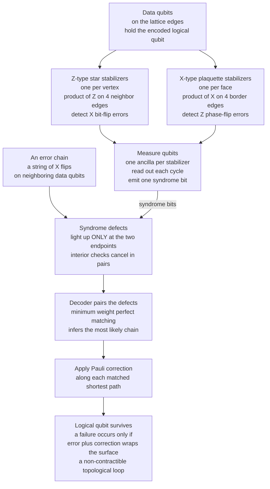

# 🧩 Stabilizer Codes and the Surface Code

> [!abstract] TL;DR
> The **stabilizer formalism** (Gottesman) describes a quantum code by a group of commuting **Pauli operators that fix — "stabilize" — the code states**: the protected code space is their simultaneous $+1$ eigenspace, and *measuring* those stabilizers reveals errors as sign flips **without ever touching the logical information**. The **Gottesman–Knill theorem** warns that stabilizer/Clifford circuits — however entangled — are *efficiently classically simulable*, so entanglement alone buys no quantum advantage; you need non-Clifford **magic states**. The **surface code** is the leading practical stabilizer code: qubits on a 2D lattice with only **nearest-neighbor** X-type and Z-type checks, hardware-friendly for planar chips. Errors appear as chains whose endpoints "light up" pairs of **syndrome defects**; a **decoder** (minimum-weight perfect matching, Union-Find, or a neural net) pairs the defects to infer and undo the chain. Because the logical information is **topological** — stored in global loop properties immune to local errors — enlarging the lattice raises the **code distance** and **exponentially suppresses** the logical error rate, *provided the physical error rate sits below the famously high ~1% threshold*. The catch is brutal **overhead**: roughly a thousand physical qubits per useful logical qubit. Google's 2023–2024 below-threshold demonstrations — logical error *shrinking* as distance grows — are why the surface code dominates every serious roadmap.

---

## Intuition

**Analogy — the checkerboard and the string of dominoes.** Lay your qubits out on a big checkerboard. You are forbidden from ever *looking directly* at any qubit (that would collapse the delicate quantum information you are trying to protect). Instead you install a referee on every tile whose *only* job is to repeatedly announce one harmless yes/no fact: **"do the qubits bordering my tile have even or odd parity?"** In a healthy code every tile reports "even." When a stray error strikes a qubit, the tiles touching it suddenly flip to "odd" — a red light with no idea *what* the qubit's value is, only that *something* toggled its parity.

Now the beautiful part. Errors do not happen one tile at a time; they come as **strings** — a run of neighboring qubits flipped like a line of toppled dominoes. Every tile *inside* the string sees **two** flipped neighbors that cancel, so it stays quiet. Only the **two ends** of the string light up. So the entire error, however long, announces itself as just **a pair of glowing tiles at its endpoints** — like seeing only the two frayed ends of a hidden thread. To repair the damage you don't need to know the exact thread: you just **draw the shortest string connecting the two lit tiles and cancel it**. Trace, pair, cancel. Make the board bigger and the threads must grow longer to fool you, so the chance of an undetectable error plummets. That checkerboard is the **surface code**, the leading real-world quantum error-correcting code — and the "trace and pair the endpoints" repair is exactly what a **matching decoder** does.

---

## How It Works

### 1. The stabilizer formalism — protect a state by fixing it, not by reading it

The **Pauli group** on $n$ qubits is generated by tensor products of $I, X, Y, Z$. A **stabilizer code** picks an **abelian subgroup** $\mathcal{S}$ of commuting Pauli operators (with $-I \notin \mathcal{S}$) and *defines the code space to be the states these operators leave fixed*:

$$
\mathcal{C} = \{\,|\psi\rangle : S\,|\psi\rangle = +|\psi\rangle \ \text{ for all } S \in \mathcal{S}\,\}.
$$

The code is the **simultaneous $+1$ eigenspace** of a set of commuting **stabilizer generators** $S_1,\dots,S_{n-k}$. Each independent generator halves the space, so $n$ physical qubits with $n-k$ generators encode **$k$ logical qubits**, giving an $[[n,k,d]]$ code. This is the quantum echo of a classical **parity-check** description — see [[Error_Correcting_Codes_Fundamentals]] and [[Linear_Block_Codes_and_Reed_Solomon]] — but the checks are *Pauli operators* rather than bit sums; it is the concrete machinery behind the general [[Quantum_Error_Correction_Principles|principles of quantum error correction]].

### 2. Syndrome measurement — learning the error, not the message

Suppose a Pauli error $E$ (a bit-flip $X$, a phase-flip $Z$, or both — the *digitized* residue of continuous [[Decoherence_and_Quantum_Noise|decoherence]]) strikes an encoded state. For each generator $S_i$ there are only two possibilities: $E$ **commutes** with $S_i$ (measuring $S_i$ still yields $+1$) or $E$ **anticommutes** ($S_i E = -E S_i$, so measuring $S_i$ now yields $-1$). The list of $\pm 1$ outcomes is the **syndrome** — the quantum analog of the classical syndrome. Crucially, because every $S_i$ **commutes with the logical operators**, measuring the stabilizers projects out the error's signature while leaving the encoded superposition **completely undisturbed**: you learn *which coset of errors* occurred, never the value of the logical qubit. This is the only escape from the [[Measurement_and_the_No_Cloning_Theorem|no-cloning theorem]]'s ban on naive backup copies — you protect information *without ever copying or reading it*.

### 3. The Gottesman–Knill theorem — a warning about "quantumness"

Stabilizer states are exactly the states reachable from $|0\rangle^{\otimes n}$ using only **Clifford** gates (Hadamard, phase $S$, and CNOT) and Pauli measurements. The **Gottesman–Knill theorem** proves such circuits are **efficiently simulable on a classical computer** — you track $O(n^2)$ bits of a check matrix instead of $2^n$ amplitudes — pinning down the boundary between classically-easy and quantum-hard that [[Quantum_Computation_and_BQP]] formalizes. The lesson is deep: Clifford circuits create *massive entanglement* yet no quantum speedup, so **entanglement alone is not enough** (compare [[Entanglement_and_Bell_States]]). Genuine advantage requires **non-Clifford resources** — the $T$ gate, injected via distilled **magic states** (see [[Logical_Qubits_and_Magic_States]]). Stabilizer codes protect the Clifford part cheaply; the expensive, indispensable magic is what fault-tolerant machines must manufacture.

### 4. The surface code — nearest-neighbor checks on a 2D lattice

The **surface code** places data qubits on the edges of a 2D square lattice and uses two kinds of local, weight-4 stabilizers measured by dedicated **measure (ancilla) qubits**:

- **Z-type "star" checks** at each vertex — the product of $Z$ on the 4 edges meeting that vertex. They **detect $X$ (bit-flip) errors**.
- **X-type "plaquette" checks** on each face — the product of $X$ on the 4 edges bordering that face. They **detect $Z$ (phase-flip) errors**.

Every check touches only **nearest-neighbor** qubits on a planar grid — precisely the connectivity that superconducting and neutral-atom chips can build, which is why the surface code is the darling of current hardware roadmaps. An $X$ error on one edge flips the *two* star checks at its endpoints; a *chain* of $X$ errors leaves every interior check with two cancelling flips, so **only the two chain endpoints produce syndrome "defects."**

### 5. Topological protection, code distance, and error suppression

The logical information is stored **topologically**: a logical operator is a chain of Paulis that stretches all the way **across the surface** (a non-contractible loop on the torus, or a boundary-to-boundary string on the planar code). No *local* error can enact a logical operation — you would need to flip a whole spanning chain by accident. The **code distance** $d$ is the length of the shortest such logical operator, equal to the lattice width; the code corrects any error of weight up to $\lfloor (d-1)/2 \rfloor$. Below the **threshold** physical error rate $p_\text{th}$, the logical error rate falls **exponentially** in the distance,

$$
p_L \;\sim\; \Big(\tfrac{p}{p_\text{th}}\Big)^{\,d/2},
$$

so every two rows you add roughly *squares* the suppression. The surface code's threshold is famously high — around **$1\%$** under realistic circuit-level noise — which is what makes it *practical* rather than a theoretical curiosity. (The full guarantee that this suppression composes into arbitrarily long computations is the **threshold theorem**; see [[Fault_Tolerance_and_the_Threshold_Theorem]].)

### 6. Decoding — matching the syndrome to the most likely error

The syndrome is **degenerate**: many different error chains produce the *same* pair of lit defects, and any two that differ only by stabilizers are equally good corrections. The **decoder's** job is to infer the **most likely** error consistent with the syndrome, in **real time**. Because defects come in pairs at chain endpoints, this is naturally a **graph problem**: build a graph whose nodes are the defects, weight each edge by the shortest-path distance between them (see [[Bipartite_Matching]] and shortest-path methods like [[Dijkstra]]), and find the **minimum-weight perfect matching (MWPM)**. Pairing the defects and flipping the edges along each matched path cancels the error — unless error-plus-correction closes a spanning loop, which is a **logical failure**. Production alternatives trade optimality for speed: the near-linear-time **Union-Find** decoder (see [[Union_Find]]) and **neural-network** decoders that must keep pace with microsecond syndrome cycles.

### 7. The toric code and topological order — the theoretical parent

Kitaev's **toric code** is the surface code with periodic (torus) boundaries and the conceptual origin of the whole family. It is the simplest model of **topological order**: its ground space is 4-fold degenerate on a torus (encoding 2 logical qubits), and its excitations are **anyons** — the "e" charges on stars and "m" fluxes on plaquettes — whose braiding statistics store and manipulate information nonlocally. Logical operators are **non-contractible Wilson loops**; error correction is literally the search for a **minimum-weight representative of a homology class**. This topological viewpoint is what connects error correction to topological qubits and anyonic hardware.

### 8. The overhead problem and the code-family landscape

The price of topological protection is staggering **overhead**. A useful logical qubit at distance $d \approx 25$–$30$ needs on the order of $d^2 \approx$ **a thousand physical qubits**, and running an algorithm like Shor's could demand *millions* of physical qubits — the central scaling challenge of building fault-tolerant machines. This drives interest in cheaper codes: **color codes** (which support more transversal gates), and especially **quantum LDPC (qLDPC) codes**, the sparse-check quantum descendants of classical [[Modern_Codes_LDPC_and_Turbo|LDPC codes]] that promise *constant-rate* encoding and dramatically lower overhead — at the cost of non-local checks that today's planar chips struggle to wire. The surface code dominates *now* precisely because its checks are strictly nearest-neighbor.

### Flow — surface-code cycle from error to correction



---

## Key Concepts

### Secondary (intuitive level)
- Qubits sit on a **checkerboard**; a referee on each tile keeps checking whether its neighbors have **even parity** — never looking at the qubits directly.
- Errors come as **strings**, and only the **two ends** of a string light up; trace the ends, connect them by the shortest path, and cancel.
- **Bigger board $\Rightarrow$ safer**: longer strings are needed to fool the code, so the failure rate drops fast — *if* the hardware is already good enough (below threshold).
- The price is **huge overhead**: hundreds to thousands of physical qubits to protect one logical qubit. This is the leading practical error-correcting code today.

### Undergraduate (working level)
- **Stabilizer code**: an abelian group $\mathcal{S}$ of commuting Paulis ($-I \notin \mathcal{S}$); code space $=$ their simultaneous $+1$ eigenspace; $n$ qubits, $n-k$ generators encode $k$ logical qubits as an $[[n,k,d]]$ code.
- **Syndrome measurement**: measuring $S_i$ returns $-1$ exactly when the error **anticommutes** with $S_i$; reveals the error coset while **commuting with — hence not disturbing — the logical operators**.
- **Gottesman–Knill theorem**: Clifford/stabilizer circuits are **classically simulable**; entanglement is necessary but not sufficient — you need non-Clifford **magic states**.
- **Surface code**: data qubits on edges; weight-4 **Z star** (detect $X$) and **X plaquette** (detect $Z$) checks; strictly **nearest-neighbor**; defects appear at **chain endpoints**.
- **Code distance** $d$ $=$ shortest logical operator $=$ lattice width; corrects $\lfloor (d-1)/2 \rfloor$ errors; below threshold $p_L \sim (p/p_\text{th})^{d/2}$, threshold $\approx 1\%$.
- **Decoding**: MWPM / Union-Find / neural-net decoders pair defects using **shortest-path** weights; must run in **real time**.
- **CSS codes** are stabilizer codes built from a pair of classical linear codes with separate $X$ and $Z$ checks.

### Graduate (theoretical level)
- **Group structure**: $\mathcal{S} \subset \mathcal{P}_n$ abelian; **logical operators** live in the normalizer quotient $N(\mathcal{S})/\mathcal{S}$; distance $d = \min$ weight of a nontrivial element of $N(\mathcal{S}) \setminus \mathcal{S}$.
- **Symplectic (binary) representation**: each Pauli $\mapsto (x\,|\,z) \in \mathbb{F}_2^{2n}$; commutation $\Leftrightarrow$ vanishing **symplectic inner product**; codes and decoding become **linear algebra over $\mathbb{F}_2$** — the direct quantum lift of classical parity-check codes.
- **Toric code as $\mathbb{Z}_2$ topological order / lattice gauge theory**: ground-state degeneracy $2^{2g}$ on a genus-$g$ surface; **anyonic** $e$/$m$ excitations with mutual semionic braiding; logical operators are non-contractible loops.
- **Homological QEC**: qubits on 1-cells, stabilizers are boundary/coboundary maps ($\partial_2, \partial_1^{\top}$); a syndrome fixes a chain up to a cycle; **decoding = minimum-weight representative of a $\mathbb{Z}_2$ homology class**, solved by MWPM on the defect graph.
- **Fault-tolerant subtleties**: measurements are themselves noisy, so syndrome extraction is repeated over $\sim d$ rounds and decoded on a **3D space-time** matching graph; the **threshold theorem** guarantees composability below $p_\text{th}$; **magic-state distillation** supplies non-Clifford gates (Gottesman–Knill forbids Clifford-only universality).
- **Beyond the surface code**: **color codes** (transversal Clifford set), and **good qLDPC codes** with constant rate and linear distance that break the surface code's $\Theta(d^2)$-per-logical-qubit overhead — the frontier of low-overhead fault tolerance.

---

## Python Demo

```python
# Toric / surface-code error correction with numpy + matplotlib ONLY.
#
# Model: the TORIC CODE (surface code on a periodic L x L lattice).
#   * Data qubits live on the EDGES of the lattice (2*L^2 of them).
#   * Z-type "star" stabilizers live on VERTICES: the product of Z on the 4
#     edges touching a vertex. They DETECT X (bit-flip) errors.
#   * An X error on an edge flips the syndrome of the TWO vertices at its ends,
#     so a CHAIN of X errors lights up syndrome "defects" only at its ENDPOINTS
#     (interior vertices see two flips that cancel).
#
# Decoder: a simple minimum-weight matching -- greedily pair syndrome defects
#   by shortest toroidal path and flip the connecting edges.
#
# A LOGICAL error occurs iff (error XOR correction) wraps the torus as a
#   non-contractible loop -- a topological, global failure. We then show the
#   logical error rate FALLING as the code distance d = L grows: the hallmark
#   of operating BELOW threshold.
import numpy as np
import matplotlib.pyplot as plt
from matplotlib.lines import Line2D

# ---------------------------------------------------------------- core ops
def syndrome(eH, eV, L):
    """Vertex (star) syndromes = parity of the 4 incident edge errors."""
    return eH ^ np.roll(eH, 1, axis=1) ^ eV ^ np.roll(eV, 1, axis=0)

def ring_step(a, b, L):
    """Shortest move on a ring of length L from a to b: (steps, +1/-1)."""
    fwd = (b - a) % L
    return (fwd, +1) if fwd <= L - fwd else (L - fwd, -1)

def toro_dist(v1, v2, L):
    dr, _ = ring_step(v1[0], v2[0], L)
    dc, _ = ring_step(v1[1], v2[1], L)
    return dr + dc

def connect(v1, v2, L, cH, cV):
    """Flip edges along a shortest path v1 -> v2 (columns then rows)."""
    r, c = v1
    r2, c2 = v2
    steps, d = ring_step(c, c2, L)               # horizontal leg
    for _ in range(steps):
        if d > 0:
            cH[r, c] ^= 1; c = (c + 1) % L
        else:
            c = (c - 1) % L; cH[r, c] ^= 1
    steps, d = ring_step(r, r2, L)               # vertical leg
    for _ in range(steps):
        if d > 0:
            cV[r, c] ^= 1; r = (r + 1) % L
        else:
            r = (r - 1) % L; cV[r, c] ^= 1

def greedy_match(defects, L):
    """Simple matching decoder: repeatedly pair the two nearest defects."""
    rem = list(range(len(defects)))
    pairs = []
    while rem:
        best = None
        for i in range(len(rem)):
            for j in range(i + 1, len(rem)):
                d = toro_dist(defects[rem[i]], defects[rem[j]], L)
                if best is None or d < best[0]:
                    best = (d, rem[i], rem[j])
        _, a, b = best
        pairs.append((a, b)); rem.remove(a); rem.remove(b)
    return pairs

def logical_class(nH, nV):
    """Homology class of the residual cycle: (w_x, w_y) in Z2 x Z2.
    Nonzero => the error wraps the torus => LOGICAL error."""
    return int(nH[:, 0].sum() % 2), int(nV[0, :].sum() % 2)

def run_trial(L, p, rng):
    eH = (rng.random((L, L)) < p).astype(int)    # X errors on horizontal edges
    eV = (rng.random((L, L)) < p).astype(int)    # X errors on vertical edges
    s = syndrome(eH, eV, L)
    defects = [tuple(v) for v in np.argwhere(s == 1)]
    cH = np.zeros((L, L), int); cV = np.zeros((L, L), int)
    for a, b in greedy_match(defects, L):
        connect(defects[a], defects[b], L, cH, cV)
    nH, nV = eH ^ cH, eV ^ cV
    failed = logical_class(nH, nV) != (0, 0)
    return failed, (eH, eV, s, cH, cV)

# ---------------------------------------------------- Monte-Carlo threshold
rng = np.random.default_rng(7)
Ls = [3, 5, 7, 9]
ps = [0.03, 0.06, 0.10]
trials = 1200
rates = {}
for p in ps:
    rates[p] = []
    for L in Ls:
        fails = sum(run_trial(L, p, rng)[0] for _ in range(trials))
        rates[p].append(fails / trials)
        print(f"p = {p:.2f}   d = L = {L}:   logical error rate = {fails/trials:.4f}")

# ------------------------------------------- one decoded instance to draw
rng2 = np.random.default_rng(2)
Lp = 8
_, (eH, eV, s, cH, cV) = run_trial(Lp, 0.06, rng2)
assert (syndrome(eH ^ cH, eV ^ cV, Lp) == 0).all()   # correction removed all defects

def draw(ax, L, eH, eV, s, cH, cV):
    for r in range(L):                                # faint lattice skeleton
        for c in range(L):
            if c < L - 1: ax.plot([c, c + 1], [r, r], color="#e2e8f0", lw=1, zorder=0)
            if r < L - 1: ax.plot([c, c], [r, r + 1], color="#e2e8f0", lw=1, zorder=0)
    for r in range(L):
        for c in range(L):
            if eH[r, c]:                              # X error on horizontal edge
                if c < L - 1: ax.plot([c, c + 1], [r, r], color="#dc2626", lw=4, zorder=3)
                else: ax.plot(c + 0.5, r, "s", color="#dc2626", ms=8, zorder=3)
            if eV[r, c]:                              # X error on vertical edge
                if r < L - 1: ax.plot([c, c], [r, r + 1], color="#dc2626", lw=4, zorder=3)
                else: ax.plot(c, r + 0.5, "s", color="#dc2626", ms=8, zorder=3)
            if cH[r, c] and c < L - 1:                # correction path
                ax.plot([c, c + 1], [r, r], color="#2563eb", lw=2, ls="--", zorder=2)
            if cV[r, c] and r < L - 1:
                ax.plot([c, c], [r, r + 1], color="#2563eb", lw=2, ls="--", zorder=2)
            ax.plot(c, r, "o", color="#94a3b8", ms=3, zorder=1)   # vertices
    rr, cc = np.where(s == 1)                          # syndrome defects
    ax.plot(cc, rr, "*", color="#f59e0b", ms=18, markeredgecolor="#78350f", zorder=4)

fig, (ax1, ax2) = plt.subplots(1, 2, figsize=(13, 6))
draw(ax1, Lp, eH, eV, s, cH, cV)
ax1.set_title(f"Toric-code patch  (d = {Lp}, periodic boundaries)\n"
              "X-error chains (red); defects (stars) light up at the ENDPOINTS")
ax1.set_aspect("equal"); ax1.axis("off")
ax1.legend(handles=[
    Line2D([0], [0], color="#dc2626", lw=4, label="X error on a data qubit"),
    Line2D([0], [0], color="#2563eb", lw=2, ls="--", label="decoder correction path"),
    Line2D([0], [0], marker="*", color="w", markerfacecolor="#f59e0b",
           markeredgecolor="#78350f", markersize=14, label="syndrome defect")],
    loc="upper center", bbox_to_anchor=(0.5, -0.02), ncol=3, frameon=False)

floor = 1.0 / (2 * trials)
for p in ps:
    y = [max(v, floor) for v in rates[p]]
    ax2.plot(Ls, y, "o-", lw=2, label=f"p = {p:.2f}")
ax2.set_yscale("log")
ax2.set_xticks(Ls)
ax2.set_xlabel("code distance   d = L")
ax2.set_ylabel("logical error rate")
ax2.set_title("Below threshold: logical error falls as distance grows")
ax2.grid(True, which="both", ls=":", alpha=0.4)
ax2.legend()
plt.tight_layout(); plt.show()

# Expected qualitative output:
#   * For the low physical rates (p = 0.03, 0.06), the logical error rate
#     DECREASES as the distance d = L grows -- more qubits => better protection.
#   * Near the decoder's threshold (p = 0.10) the curve flattens / turns up:
#     above threshold, adding qubits makes things WORSE. The crossover of the
#     curves is the threshold -- the whole point of scalable error correction.
```

The two panels carry the entire lesson. The **left** panel shows what the code actually "sees": red $X$-error chains on the data qubits, and orange **syndrome defects that appear only at the endpoints** of those chains — never in the middle — with the decoder's dashed correction paths pairing the defects along shortest routes. The **right** panel is the payoff: for physical error rates **below threshold**, the logical error rate *drops* as the lattice (and thus the code distance $d$) grows, while near threshold the trend reverses. That crossover is the threshold, and the downward slope below it is exponential error suppression made concrete.

---

## Real-World Applications

- **Google's below-threshold logical qubit (Willow, 2023–2024).** Google Quantum AI demonstrated a surface-code logical qubit whose error rate *decreased* as the code grew from distance 3 to 5 to 7 — the first convincing experimental evidence of the $p_L \sim (p/p_\text{th})^{d/2}$ scaling. This is the milestone that turned "surface codes should work" into "surface codes do work," and it anchors nearly every superconducting-qubit roadmap.
- **IBM, and the pivot to qLDPC.** IBM's roadmap targets fault tolerance and has published **bivariate-bicycle qLDPC codes** that protect a logical qubit with roughly an order of magnitude fewer physical qubits than the surface code — trading nearest-neighbor simplicity for long-range checks, using the same stabilizer formalism.
- **Neutral-atom processors (QuEra, Atom Computing).** Reconfigurable atom arrays can shuttle qubits to realize non-local checks, running surface *and* color codes and even qLDPC codes; recent experiments demonstrated dozens of logical qubits and logical algorithms on atom hardware.
- **Trapped-ion logical qubits (Quantinuum).** Ion traps with all-to-all connectivity have run small color codes and CSS stabilizer codes with real-time decoding, demonstrating fault-tolerant logical gates and below-break-even memory.
- **Real-time classical decoders.** Because syndromes stream out every ~$1\,\mu s$, decoding is now a hardware-engineering problem: FPGA/ASIC implementations of MWPM (e.g., PyMatching / sparse blossom), the **Union-Find** decoder, and neural-network decoders are deployed to keep the classical control loop from becoming the bottleneck.

---

## Common Pitfalls

- **"Measuring the stabilizers measures — and destroys — the qubits."** No. Stabilizers are engineered to **commute with the logical operators**, so their measurement extracts only the error's coset and leaves the encoded superposition intact. This is the whole trick that dodges no-cloning; forgetting it makes the code seem impossible.
- **"Entanglement means we already have quantum advantage."** The **Gottesman–Knill theorem** flatly refutes this: heavily entangled Clifford circuits are classically simulable. Advantage needs non-Clifford **magic states**; a code that only protects Clifford operations is not yet a universal quantum computer.
- **"More physical qubits always help."** Only **below threshold**. Above $p_\text{th}$, each added qubit injects more error than the code removes, and $p_L$ *grows* with distance. Getting the physical error rate under ~$1\%$ is the *prerequisite*, not an afterthought.
- **"The syndrome tells you exactly which qubits erred."** It does not — the syndrome is **degenerate**. Countless error chains share the same defect pair, and corrections differing by a stabilizer are equally valid. The decoder returns the *most likely* class, not the literal error; this degeneracy is a feature (it makes decoding a homology problem), not a bug.
- **"Assume perfect syndrome extraction."** Real ancilla measurements are noisy, so a single round of syndromes is untrustworthy. Fault-tolerant protocols repeat extraction over ~$d$ rounds and decode a **3D space-time** graph. Benchmarks that assume noiseless syndromes wildly overstate performance.
- **"Code distance equals qubit count."** Distance $d$ is the **minimum-weight logical operator** (the lattice width), and it sets the suppression *exponent*; the qubit count scales as $\sim d^2$. Conflating them hides the real overhead.
- **Overhead denial.** "1000 physical qubits, therefore fault-tolerant" ignores that a *single* useful logical qubit can consume most of them. Honest resource estimates for algorithms like Shor's reach **millions** of physical qubits.

---

## Related Concepts

- [[Quantum_Error_Correction_Principles]] — the general framework (redundancy across entanglement, digitizing continuous noise into Pauli errors, syndrome extraction) that stabilizer codes make concrete.
- [[Fault_Tolerance_and_the_Threshold_Theorem]] — why the surface code's below-threshold suppression composes into arbitrarily long, reliable computation.
- [[Logical_Qubits_and_Magic_States]] — supplies the non-Clifford $T$ gates (via magic-state distillation) that Gottesman–Knill proves stabilizer codes alone cannot provide.
- [[Decoherence_and_Quantum_Noise]] — the physical $X$, $Z$, and depolarizing errors the stabilizer checks are built to catch.
- [[Measurement_and_the_No_Cloning_Theorem]] — stabilizer measurement extracts a syndrome *without* collapsing the logical state; no-cloning is exactly why naive backup copies are forbidden.
- [[Entanglement_and_Bell_States]] — the **Gottesman–Knill theorem** shows Clifford/stabilizer circuits entangle yet stay classically simulable; the surface code stores its logical qubit in global entanglement.
- [[Quantum_Computation_and_BQP]] — the complexity boundary between classically simulable stabilizer circuits and quantum-hard computation that magic states unlock.
- [[Quantum_Gates_and_Circuits]] — the Clifford group, the Pauli group, and the syndrome-extraction circuits (CNOTs into ancilla measure qubits) that implement stabilizer checks.
- [[Quantum_Information_Theory]] — quantum channels and Pauli/depolarizing noise models; stabilizer codes are the quantum analog of classical channel coding.
- [[Error_Correcting_Codes_Fundamentals]] — classical parity checks, syndromes, and code distance — the direct conceptual ancestor of the stabilizer formalism.
- [[Linear_Block_Codes_and_Reed_Solomon]] — CSS stabilizer codes are assembled from a pair of classical linear block codes with separate $X$ and $Z$ parity checks.
- [[Modern_Codes_LDPC_and_Turbo]] — **quantum LDPC** codes generalize sparse-check classical LDPC and are the leading route to overhead far below the surface code.
- [[Bipartite_Matching]] — the decoder pairs syndrome defects; **minimum-weight perfect matching (MWPM)** is the graph-matching problem at its core.
- [[Union_Find]] — the Union-Find decoder is a near-linear-time, real-time alternative to MWPM for surface-code decoding.
- [[Dijkstra]] — shortest-path distances between defects supply the edge weights the matching decoder minimizes.
- [[Qubits_and_the_Bloch_Sphere]] — the physical data and ancilla qubits; $X$ and $Z$ Pauli errors are the bit- and phase-flips the two check types detect.

---

## Review Questions

**Tier 1 — Conceptual (explain to a peer):**
1. Using the checkerboard-and-string analogy, explain why a *chain* of errors produces syndrome signals only at its two **endpoints**, and why that turns error correction into a "connect the dots" matching problem.
2. Why is measuring a stabilizer safe when directly measuring a data qubit would be catastrophic? What property of the stabilizers guarantees the logical information is left untouched?

**Tier 2 — Applied (compute / reason):**
3. A surface code has distance $d = 5$ and operates at physical error rate $p = 0.1\%$ with threshold $p_\text{th} = 1\%$. Using $p_L \sim (p/p_\text{th})^{d/2}$, estimate the logical error rate, and estimate how it changes if you increase the distance to $d = 9$. Roughly how many physical qubits does each choice cost?
4. You are told a decoder returns a correction, yet a colleague insists a *different* correction is "the right one." Explain, in terms of stabilizers and homology classes, how both can be simultaneously correct — and what single condition actually determines whether decoding *failed*.

**Tier 3 — Theoretical (deep understanding):**
5. State the Gottesman–Knill theorem and explain its consequence for quantum advantage. If Clifford circuits create maximal entanglement yet are classically simulable, what *additional* resource makes a fault-tolerant machine universal, and how do stabilizer codes and magic states divide that labor?
6. Explain why the surface code dominates current hardware roadmaps despite its enormous $\sim d^2$ overhead, and under what conditions a **quantum LDPC** code would displace it. Which specific property of the surface code's stabilizers is both its greatest practical asset and the thing qLDPC codes must sacrifice?

---

## Sources

- Gottesman, D. (1997). *Stabilizer Codes and Quantum Error Correction.* PhD thesis, Caltech. [arXiv:quant-ph/9705052](https://arxiv.org/abs/quant-ph/9705052) — the stabilizer formalism and the Gottesman–Knill theorem.
- Kitaev, A. Yu. (2003). *Fault-tolerant quantum computation by anyons.* Annals of Physics 303, 2–30. [arXiv:quant-ph/9707021](https://arxiv.org/abs/quant-ph/9707021) — the toric code, anyons, and topological order.
- Dennis, E., Kitaev, A., Landahl, A. & Preskill, J. (2002). *Topological quantum memory.* J. Math. Phys. 43, 4452. [arXiv:quant-ph/0110143](https://arxiv.org/abs/quant-ph/0110143) — the surface code as a memory, homological decoding, and the threshold.
- Fowler, A. G., Mariantoni, M., Martinis, J. M. & Cleland, A. N. (2012). *Surface codes: Towards practical large-scale quantum computation.* Phys. Rev. A 86, 032324. [arXiv:1208.0928](https://arxiv.org/abs/1208.0928) — the definitive practical surface-code review, thresholds, and MWPM decoding.
- Google Quantum AI (2023). *Suppressing quantum errors by scaling a surface code logical qubit.* Nature 614, 676–681. [DOI:10.1038/s41586-022-05434-1](https://doi.org/10.1038/s41586-022-05434-1) — first below-threshold-trend demonstration.
- Google Quantum AI (2025). *Quantum error correction below the surface code threshold.* Nature 638, 920–926. [DOI:10.1038/s41586-024-08449-y](https://doi.org/10.1038/s41586-024-08449-y) — the Willow below-threshold logical-qubit result.

---

#quantum-computing #stabilizer-codes #surface-code #toric-code #topological
