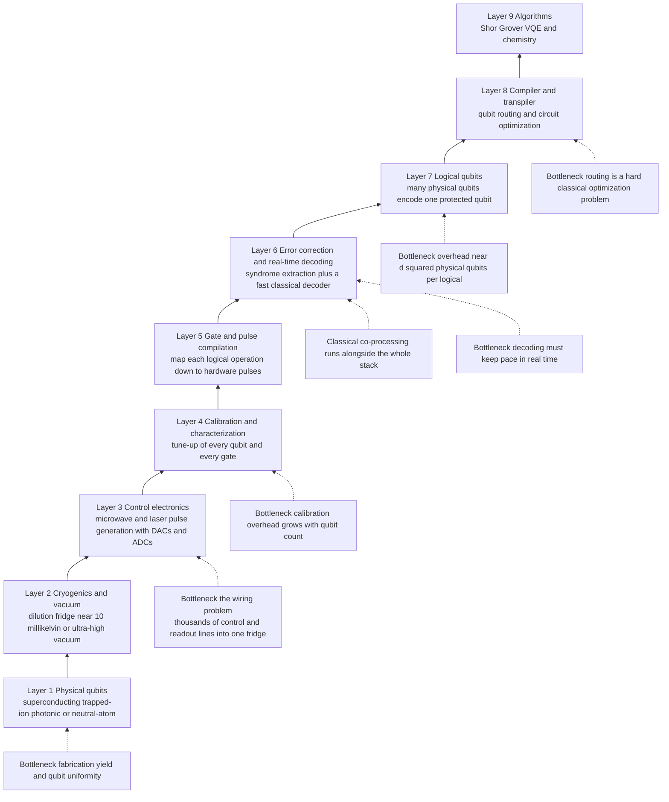

# 🏗️ Building and Scaling Quantum Computers

> [!abstract] TL;DR
> Making a handful of good qubits is a physics achievement; making a **useful** quantum computer is a **systems-engineering** one. The hard part is scaling from today's noisy tens-to-hundreds of qubits to the **millions of high-quality qubits** that fault-tolerant algorithms demand — and doing it across the *whole stack at once*: physical qubits, cryogenics and vacuum, control electronics, calibration, gate compilation, real-time error decoding, logical qubits, the compiler/transpiler, and the classical co-processor. Every layer has a scaling bottleneck — the **wiring problem** (thousands of coax lines into one fridge), **fabrication yield** and qubit uniformity, **crosstalk**, **calibration overhead** that grows with qubit count, and **real-time decoding** that must keep pace with a firehose of syndrome data. The central number is the **physical-to-logical overhead**: error correction means a useful algorithm needs *far* more physical than logical qubits, so surface-code estimates for factoring RSA-2048 land in the **millions of physical qubits and hours-to-days of runtime**, dominated by **magic-state distillation**. Raw qubit count is a marketing number; **Quantum Volume, CLOPS, and algorithmic qubits** measure useful computation. The likely path forward is **modular, networked** machines (photonic interconnects, ion shuttling, movable atom arrays) plus a co-designed software stack — quantum computing is a **full-stack systems problem**, not a single device.

---

## Intuition

**Analogy — a few good qubits is like a few good transistors.** In 1947 Bell Labs demonstrated a single working transistor. That did *not* give the world a CPU. Turning one device into the billions-of-transistors chip in your phone took decades of *unglamorous* systems engineering: photolithography that yields uniform devices at scale, packaging and interconnect to wire them together, power delivery and heat removal, and an entire compiler-and-tools ecosystem so humans could actually program the thing. The physics of the transistor was settled early; the **engineering to scale it** is what actually decided the industry.

Quantum computing is sitting at its "few transistors" moment. We have demonstrated qubits on several platforms that individually do the right thing — but a *useful* machine needs on the order of a **million** of them, all uniform, all wired, all kept cold or under vacuum, all calibrated, all corrected in real time, and all driven by a compiler that maps a mathematician's algorithm down to microwave and laser pulses. The winner will not be whoever demos the flashiest single qubit; it will be whoever solves the boring, brutal, interlocking engineering problems of **scale**. That is what this note is about.

---

## How It Works

### The full quantum-computing stack

A quantum computer is not "the qubits." It is a tower of tightly coupled layers, each of which must scale in lockstep — a bottleneck at *any* level caps the whole machine.

1. **Physical qubits (bottom).** The information carriers — superconducting circuits, trapped ions, photons, neutral atoms, or (aspirationally) topological modes. Each platform trades off gate speed, coherence, connectivity, and manufacturability. (Companion notes for each platform are planned in this section; see the callout under *Related Concepts*.)
2. **Cryogenics and vacuum.** Superconducting qubits live in a **dilution refrigerator** near 10 millikelvin; trapped ions and neutral atoms live in ultra-high vacuum with elaborate laser systems. Cooling power, wiring heat load, and fridge real estate are hard physical limits.
3. **Control electronics and signal generation.** Every qubit needs shaped microwave or laser pulses to drive gates, plus readout lines to measure it. Digital-to-analog and analog-to-digital converters, mixers, amplifiers, and routing generate and capture these signals — today mostly at room temperature, connected by cables running into the cold.
4. **Calibration and characterization.** Real qubits drift. Frequencies, gate amplitudes, crosstalk, and readout thresholds must be measured and re-tuned continuously. Calibration is a background job whose cost scales with qubit and gate count.
5. **Gate and pulse compilation.** Logical operations become concrete pulse sequences, respecting the device's connectivity and timing.
6. **Error correction and real-time decoding.** Physical qubits are grouped into codes; **syndrome** measurements are extracted every cycle and fed to a **classical decoder** that must infer and correct errors *faster than they accumulate* — a real-time streaming problem.
7. **Logical qubits.** Many physical qubits encode one protected logical qubit whose error rate is driven exponentially low (see [[Fault_Tolerance_and_the_Threshold_Theorem]]). This is where the machine finally becomes reliable — at enormous cost in raw qubits.
8. **Compiler and transpiler.** Algorithms are mapped onto the logical layer: qubit **routing**, circuit optimization, and gate synthesis (including expensive non-Clifford gates) — themselves hard classical problems.
9. **Algorithms and classical co-processing (top).** [[Shors_Factoring_Algorithm]], Grover search, [[Quantum_Simulation_and_VQE]], and hybrid workflows run here, with a classical computer orchestrating, pre/post-processing, and closing feedback loops.



### The scaling bottlenecks

- **The wiring / interconnect problem.** Each superconducting qubit needs roughly one or more control lines plus a readout line. At a few hundred qubits that is a bird's nest of coax; at a million it is physically impossible to run that many room-temperature cables into a fridge with finite cooling power and finite space. This is arguably *the* near-term blocker for superconducting platforms.
- **Cryogenic CMOS control.** The fix is to move the electronics *into the cold*, next to the qubits — control chips fabricated in CMOS that operate at cryogenic temperatures (Intel's *Horse Ridge* is a well-known example). This slashes cable count via multiplexing but must dissipate almost no heat, a severe design constraint.
- **Fabrication yield and uniformity.** A million qubits is a manufacturing problem. If each qubit has even a small chance of being out of spec, yield collapses exponentially with count. Qubits must also be **uniform** — the same frequency and gate behavior — or calibration and crosstalk become unmanageable.
- **Crosstalk.** Driving one qubit leaks onto its neighbors; simultaneous gates interfere. Crosstalk grows with density and is a leading source of correlated errors that error correction handles poorly.
- **Calibration overhead.** Tuning up `N` qubits and their gates is not free, and naive schemes scale badly with `N`. Keeping a large device calibrated against drift can consume more wall-clock time than the computation itself.
- **Real-time decoding.** The surface code emits syndrome data every measurement cycle (microseconds for superconductors). The classical **decoder** must process this stream and decide corrections *without falling behind* — if decoding lags, the error backlog grows and the logical qubit fails. This is a hard, low-latency classical-computing problem in its own right (see [[Quantum_Error_Correction_Principles]]).

### The physical-vs-logical overhead — the central number

This is the number that dominates every honest roadmap. Because error correction is expensive, a **logical** (protected) qubit costs a large patch of **physical** qubits. For the surface code, reaching a target logical error rate `p_L` at physical error rate `p` requires code distance `d` set by the threshold formula (see [[Fault_Tolerance_and_the_Threshold_Theorem]]):

```
p_L(d)  ≈  A · (p / p_th)^((d+1)/2)          overhead ≈ ~2·d² physical qubits per logical
```

An algorithm needs many logical qubits *and* a very low `p_L` (because it runs billions of operations, each of which must almost never fail). Multiply it out and the totals are staggering:

- The canonical **Gidney–Ekerå (2019/2021)** estimate for factoring **RSA-2048** with Shor: about **20 million physical qubits** and roughly **8 hours** of runtime, with the cost **dominated by magic-state distillation** — the machinery that manufactures the non-Clifford resource states the Eastin–Knill theorem says you cannot get transversally.
- A **2025** algorithmic breakthrough (Gidney) cut this to **under 1 million physical qubits** (about **1,399 logical qubits**) at the price of a longer runtime of under a week — a ~20× reduction from better factories, better arithmetic, and qLDPC-style codes. The *headline* moved, but the *lesson* did not: useful fault tolerance needs orders of magnitude more physical than logical qubits.

The Python demo below reproduces this "exploding overhead" and the **fault-tolerance frontier** it implies.

### Benchmarking — why raw qubit count lies

"We have `N` qubits" says almost nothing about useful computation, because it ignores error rates, connectivity, and gate depth. Better metrics:

- **Quantum Volume (QV).** A single number capturing the largest *square* random circuit (equal width and depth) a device can run correctly. It folds together qubit count, error rate, connectivity, and compiler quality — a 20-qubit device with great fidelity can beat a 100-qubit noisy one.
- **CLOPS (Circuit Layer Operations Per Second).** A *speed* metric — how fast the machine actually executes layered circuits, including classical latency. Two devices with equal QV can differ 100× in throughput.
- **Algorithmic qubits (AQ).** IonQ's application-oriented metric emphasizing how many qubits you can use in a *useful* algorithm after accounting for errors.
- **Error per layered gate / two-qubit gate fidelity.** The most fundamental knobs; everything downstream (QV, achievable distance, overhead) is set by them.

### Architectures for scaling

Monolithic "one giant chip" scaling hits the wiring and yield walls, so the field is converging on **modularity**:

- **Networked / distributed quantum computers.** Connect many smaller modules with **quantum interconnects** — typically photonic links carrying entanglement between chips or ion-trap modules — so the system scales like a data center rather than a single die. This is the same idea as classical distributed systems, and it leans directly on quantum-network technology (see [[The_Quantum_Internet]]).
- **QCCD ion shuttling.** Trapped-ion machines physically move ions between storage and interaction zones (the Quantum Charge-Coupled Device architecture), trading speed for all-to-all connectivity and modular layout.
- **Movable neutral-atom arrays.** Optical tweezers reconfigure atoms mid-computation, giving flexible connectivity and natural support for logical-qubit operations by rearranging qubits.
- **Photonic multiplexing.** Photonic approaches multiplex many probabilistic operations to build large cluster states, aiming for room-temperature-ish, manufacturable silicon photonics at scale.

### The software and ecosystem

The stack is only as good as the tools that drive it. **Qiskit** (IBM), **Cirq** (Google), **PennyLane** (Xanadu, hybrid/differentiable), and **tket** (Quantinuum) provide circuit construction, and — critically — **transpilation**: qubit **routing** (inserting SWAPs to satisfy limited connectivity), gate synthesis, and circuit optimization are **hard classical optimization problems** that materially change how many physical resources an algorithm consumes. In the NISQ era, hybrid quantum-classical workflows (VQE, QAOA) plus **error mitigation** (see [[Error_Mitigation_in_the_NISQ_Era]]) squeeze value out of imperfect hardware; in the fault-tolerant era, the compiler must additionally schedule magic-state factories and lattice surgery.

---

## Key Concepts

**Secondary (plain-language core):**
- A few good qubits is like a few good transistors — the breakthrough is turning them into *millions*, wired, cooled, calibrated, and programmable.
- The "boring" engineering wins: cabling, refrigerators, manufacturing yield, control electronics, and software — not a single hero qubit.
- Error correction means you need **way more** physical qubits than the algorithm's logical qubits — millions to factor a bank-grade RSA key.
- **Qubit count is a marketing number.** What matters is how big a *useful* computation you can run without drowning in errors.

**Undergraduate (CS / linear-algebra background):**
- **The stack** = physical qubits → cryo/vacuum → control electronics → calibration → gate compilation → error correction + decoding → logical qubits → transpiler → algorithms, with classical co-processing throughout. Every layer must scale together.
- **Overhead** ≈ `~2·d²` physical qubits per logical qubit; distance `d` is set by the threshold formula `p_L(d) ≈ A (p/p_th)^((d+1)/2)`. Lower `p` → smaller `d` → far fewer qubits.
- **Bottlenecks:** the wiring problem (control/readout line count), fabrication yield and uniformity, crosstalk, calibration cost, and real-time syndrome decoding.
- **Benchmarks:** Quantum Volume (capability), CLOPS (speed), algorithmic qubits (usable width), two-qubit gate fidelity (the root cause).

**Graduate (systems / architecture level):**
- **Resource estimation** for Shor on RSA-2048: from ~20M physical qubits / 8 hours (Gidney–Ekerå 2019) to <1M physical qubits / <1 week (Gidney 2025) — cost dominated by **magic-state distillation**, bounded below by the reaction-limited rate of consuming magic states.
- **Decoder latency** must satisfy a throughput constraint: the classical decoder's processing rate must exceed the syndrome-generation rate, or the logical error rate diverges — motivating hardware decoders (FPGA/ASIC) and sliding-window / streaming decoding.
- **Modular architectures** convert a monolithic scaling problem into a distributed-systems problem: entanglement-distribution rate and interconnect fidelity across modules become the new limiting resources (see [[The_Quantum_Internet]]).
- **Co-design** across layers (biased-noise qubits + tailored codes, cryo-CMOS control, qLDPC codes cutting overhead up to ~90%) is where most of the recent overhead reductions come from — the stack must be optimized end to end, not layer by layer.
- **"Utility-scale" vs "fault-tolerant"** are different milestones: utility-scale NISQ can beat classical simulation on *some* task (see the quantum-advantage discussion) without error correction; fault tolerance means arbitrarily long, reliable computation.

---

## Python Demo

```python
# numpy / matplotlib only. Model the PHYSICAL-vs-LOGICAL resource gap that decides
# whether an algorithm is buildable. Given a target algorithm (Shor on RSA-2048)
# needing a number of LOGICAL qubits at a target LOGICAL error rate, we:
#   (1) use the surface-code threshold formula to find the code distance d needed
#       at a given PHYSICAL error rate p,
#   (2) turn d into physical-qubits-per-logical (~2 d^2) and then TOTAL physical
#       qubits for the whole algorithm,
#   (3) plot how the total EXPLODES as p approaches the threshold, and draw the
#       "fault-tolerance frontier": the largest algorithm buildable within a qubit
#       budget as a function of p -- showing why estimates land in the MILLIONS.
import numpy as np
import matplotlib.pyplot as plt

# ---- Surface-code model parameters -----------------------------------------
A      = 0.10      # logical-error prefactor (order 0.01-0.1 in the literature)
p_th   = 0.01      # surface-code threshold ~ 1 percent

# ---- Target algorithm: Shor factoring RSA-2048 (stylized surface-code budget)
n_logical  = 14000     # effective logical qubits: data + routing + magic-state factories
pL_target  = 1e-15     # required logical error PER operation for a very deep run
n_toffoli  = 6.5e9     # non-Clifford (Toffoli) operations in the algorithm
t_reaction = 10e-6     # seconds to consume one magic state (reaction-limited rate)

def distance_needed(p_phys, pL, A, p_th):
    """Smallest ODD surface-code distance d with A*(p/p_th)^((d+1)/2) <= pL."""
    p_phys = np.asarray(p_phys, dtype=float)
    d_real = 2.0 * np.log(pL / A) / np.log(p_phys / p_th) - 1.0
    d = np.ceil(d_real - 1e-9)               # epsilon guards the integer boundary
    d = np.where(d % 2 == 0, d + 1, d)       # distance must be odd
    return np.maximum(d, 3.0)

def phys_per_logical(d):
    return 2.0 * d**2                         # surface-code patch incl. syndrome ancillas

# ---- (1)+(2) totals at a few physical error rates --------------------------
print("Shor on RSA-2048  --  need", f"{n_logical:,}", "logical qubits at pL =", pL_target)
print(f"{'p_phys':>8} | {'p/p_th':>6} | {'distance d':>10} | "
      f"{'phys/logical':>12} | {'TOTAL physical':>16}")
for p in [0.001, 0.002, 0.003, 0.005]:
    d  = distance_needed(p, pL_target, A, p_th)
    pl = phys_per_logical(d)
    tot = n_logical * pl
    print(f"{p:8.3f} | {p/p_th:6.2f} | {int(d):10d} | {int(pl):12,d} | {int(tot):16,d}")

runtime_hours = n_toffoli * t_reaction / 3600.0
print(f"\nRuntime (reaction-limited by magic-state consumption): "
      f"{runtime_hours:,.1f} hours  (~{runtime_hours/24:.1f} days)")
print("Cost is DOMINATED by magic-state distillation, not by the qubits alone.")

# ---- Plots -----------------------------------------------------------------
p_scan = np.linspace(0.0005, 0.009, 400)          # below threshold
d_scan = distance_needed(p_scan, pL_target, A, p_th)
total  = n_logical * phys_per_logical(d_scan)

fig, (ax1, ax2, ax3) = plt.subplots(1, 3, figsize=(17, 4.8))

# Panel 1: total physical qubits for RSA-2048 explodes as p -> p_th
ax1.semilogy(p_scan, total, color="#b91c1c", lw=2)
ax1.axhline(1e6, color="gray", ls="--", lw=1);  ax1.text(0.0006, 1.2e6, "1 million")
ax1.axhline(1e3, color="green", ls=":", lw=1);  ax1.text(0.0006, 1.3e3, "~today's hardware")
ax1.axvline(p_th, color="black", ls="--", lw=1)
ax1.set_title("(1) Physical qubits to run Shor on RSA-2048")
ax1.set_xlabel("physical error rate p")
ax1.set_ylabel("total physical qubits")
ax1.grid(True, which="both", alpha=0.3)

# Panel 2: physical qubits PER LOGICAL for several target logical error rates
for pL in [1e-9, 1e-12, 1e-15]:
    d = distance_needed(p_scan, pL, A, p_th)
    ax2.semilogy(p_scan, phys_per_logical(d), lw=2, label=f"pL target = {pL:.0e}")
ax2.axvline(p_th, color="black", ls="--", lw=1)
ax2.set_title("(2) Overhead per logical qubit\n(deeper algorithms cost more)")
ax2.set_xlabel("physical error rate p")
ax2.set_ylabel("physical qubits per logical qubit")
ax2.legend()
ax2.grid(True, which="both", alpha=0.3)

# Panel 3: the fault-tolerance frontier -- max algorithm size within a budget
for budget, c in [(1e6, "#2563eb"), (1e8, "#7c3aed")]:
    d = distance_needed(p_scan, pL_target, A, p_th)
    max_logical = budget / phys_per_logical(d)
    ax3.semilogy(p_scan, max_logical, lw=2, color=c, label=f"budget = {budget:.0e} qubits")
ax3.axhline(n_logical, color="#b91c1c", ls="--", lw=1.5,
            label=f"RSA-2048 needs {n_logical:,} logical")
ax3.axvline(p_th, color="black", ls="--", lw=1)
ax3.set_title("(3) Fault-tolerance frontier:\nlargest buildable algorithm vs p")
ax3.set_xlabel("physical error rate p")
ax3.set_ylabel("max logical qubits affordable")
ax3.legend()
ax3.grid(True, which="both", alpha=0.3)

plt.tight_layout()
plt.savefig("scaling_resource_estimation.png", dpi=130)
print("\nSaved resource-estimation plots to scaling_resource_estimation.png")

# Expected console output (model estimates, not exact hardware numbers):
#   p_phys | p/p_th | distance d | phys/logical |   TOTAL physical
#    0.001 |   0.10 |         27 |        1,458 |       20,412,000
#    0.002 |   0.20 |         41 |        3,362 |       47,068,000
#    0.003 |   0.30 |         53 |        5,618 |       78,652,000
#    0.005 |   0.50 |         93 |       17,298 |      242,172,000
#   Runtime ~ 18.1 hours  (~0.8 days)
```

Read the three panels together and the whole "why millions?" story falls out. **Panel 1:** the total physical-qubit count for RSA-2048 sits in the *tens of millions* and diverges as the physical error rate `p` creeps toward the ~1% threshold — the classic Gidney–Ekerå regime. **Panel 2:** overhead per logical qubit grows both as `p → p_th` *and* as the algorithm gets deeper (lower target `p_L`), because a longer computation cannot tolerate as much per-step error. **Panel 3** is the punchline — the **fault-tolerance frontier**: for a fixed hardware budget (1 million or 100 million physical qubits), the largest algorithm you can run is a steeply falling function of `p`. RSA-2048 sits *above* the 1-million-qubit frontier unless `p` is pushed well below threshold — which is exactly why the field chases *lower error rates and better codes*, not merely *more qubits*. (Algorithmic advances — qLDPC codes, better factories, the 2025 Gidney result — shift these curves down by ~20×, but the shape, and the lesson, stay the same.)

---

## Real-World Applications

> **Example — IBM's modular full-stack roadmap to fault tolerance.** IBM has laid out a public, dated path to a large-scale fault-tolerant machine, **Quantum Starling**, targeted for ~2029 (200 logical qubits, ~100 million gates), built from modular processors (*Loon*, *Kookaburra*, *Cockatoo*) that store and process encoded information and pass magic states between modules. Crucially, they adopt **qLDPC codes** claimed to cut physical-qubit overhead by up to ~90% versus the vanilla surface code — a direct attack on the physical-vs-logical number this note is about, and a bet that *co-designing the code with the hardware* beats brute-force qubit count.

> **Example — Google's below-threshold logical qubit.** Google's *Willow* processor (2024) demonstrated the threshold theorem's signature directly: increasing surface-code distance from `d = 3 → 5 → 7` drove the *logical* error rate *down* each time — the first convincing "below threshold" logical qubit. Google's stated destination is a machine with ~1 million physical qubits hosting useful logical qubits, and the demo validated that the exponential-suppression scaling the resource estimates assume actually holds in silicon.

> **Example — platform diversity in how to scale.** **Quantinuum** (QCCD trapped-ion, ion shuttling) leads on gate fidelity and Quantum Volume; **IonQ** markets *algorithmic qubits*; **QuEra** and Harvard/MIT ran a **48-logical-qubit** processor on reconfigurable neutral-atom arrays (2023), moving atoms to perform logical operations; **PsiQuantum** bets on manufacturable **silicon photonics** to reach a million qubits with fusion-based computation. Each is a different answer to the *same* systems question: how do you get to a million good, wired, controllable qubits?

> **Example — cryo-CMOS and the wiring problem.** Intel's *Horse Ridge* control chip operates at cryogenic temperatures to move signal generation *inside the fridge*, collapsing the cable bundle that would otherwise make thousand-plus-qubit superconducting systems physically impossible to wire. It is a concrete example of the "boring engineering" layer deciding whether a platform can scale at all.

---

## Common Pitfalls

- **Equating qubit count with power.** "1000 qubits" is meaningless without error rates, connectivity, and depth. A high-fidelity 30-qubit device can out-*compute* a noisy 1000-qubit one. Always ask for **Quantum Volume / CLOPS / algorithmic qubits and two-qubit gate fidelity**, not the headline number.
- **Confusing physical with logical qubits.** Roadmaps that quote *logical* qubits and roadmaps that quote *physical* qubits differ by a factor of hundreds to thousands. "200 logical qubits" and "200 physical qubits" are worlds apart; conflating them makes timelines look absurdly optimistic or pessimistic.
- **Assuming overhead is a fixed multiplier.** Physical-per-logical is *not* a constant — it depends on the physical error rate, how far below threshold you run, and the algorithm's depth (target `p_L`). Deeper algorithms need larger distance and thus more qubits; the budget scales with the computation.
- **Forgetting magic-state distillation.** In most fault-tolerant estimates, the **distillation factories** — not the data qubits — dominate both qubit count and runtime, because the Eastin–Knill theorem forbids transversal non-Clifford gates (see [[Fault_Tolerance_and_the_Threshold_Theorem]]). Qubit-count estimates that ignore factories are wrong by a large factor.
- **Ignoring the decoder.** A perfect code with a decoder that cannot keep up in real time still fails: if syndrome decoding lags behind syndrome generation, the logical error rate diverges. Decoding throughput is a first-class scaling constraint, not an afterthought.
- **Solving one layer in isolation.** More qubits without solving wiring, or lower error rates without a fast decoder, or great hardware without a routing-aware compiler, all stall. Scaling is a **whole-stack** problem; the binding constraint moves as you fix layers.
- **Treating "below threshold" as "done."** Being just below the ~1% threshold is barely useful — overhead diverges as `p → p_th` (Panel 1/3). You need `p` an order of magnitude *under* threshold for distances, and therefore qubit counts, to stay sane.
- **Taking resource estimates as fixed.** They are a moving target: the RSA-2048 estimate fell ~20× from 2019 to 2025 through better codes and factories. Cite them with a date, and expect the number to keep dropping.

---

## Related Concepts

- [[Quantum_Computing_Overview]] — the parent map; this note is the systems-engineering capstone that ties the platforms and layers together.
- [[Fault_Tolerance_and_the_Threshold_Theorem]] — supplies the threshold formula and the `~2·d²` overhead that *sets* the physical-vs-logical number driving all scaling estimates.
- [[Quantum_Error_Correction_Principles]] — the codes and syndrome extraction whose real-time decoding is one of the hardest scaling bottlenecks.
- [[Error_Mitigation_in_the_NISQ_Era]] — the pre-fault-tolerant alternative; the software stack leans on mitigation while qubit counts and fidelities are still short of the threshold.
- [[Decoherence_and_Quantum_Noise]] — the physical enemy every layer of the stack is engineered to hold back; noise rates set the achievable code distance and overhead.
- [[Shors_Factoring_Algorithm]] — the flagship resource-estimation target; its RSA-2048 requirement is *the* canonical "millions of physical qubits" benchmark modeled in the demo.
- [[Quantum_Gates_and_Circuits]] — the physical-gate and circuit primitives the compiler/transpiler maps algorithms onto; gate and `T`-counts feed directly into resource estimates.
- [[Quantum_Simulation_and_VQE]] — a leading near-term (NISQ) workload that runs on hybrid quantum-classical stacks before fault tolerance arrives.
- [[The_Quantum_Internet]] — the interconnect technology behind modular, networked quantum computers; entanglement distribution across modules is how monolithic scaling becomes a distributed-systems problem.

> [!note] Planned companion notes in this section
> This capstone forward-references sibling notes not yet written in `05_Quantum_Hardware_and_Implementations/`: **Physical Qubits and the DiVincenzo Criteria** (what any platform must satisfy), **Superconducting Qubits**, **Trapped-Ion Quantum Computers**, **Photonic Quantum Computing**, and **Neutral Atoms and Topological Qubits** (the platform deep-dives). It also references, in `04_...Fault_Tolerance/`, **Stabilizer Codes and the Surface Code** and **Logical Qubits and Magic States**, and, in a future `06_...` section, **Quantum Supremacy and Advantage**, **Near-Term Quantum Applications**, and **The Future of Quantum Computing**. Wikilinks will be added once those files exist. Cross-vault, the modular/networked architecture connects to distributed-systems concepts in the `System Design/` vault.

---

## Review Questions

1. **(Secondary)** A press release says a company "hit 1,000 qubits." Using the transistor analogy, explain why that number alone tells you almost nothing about whether the machine can run a useful algorithm, and name two things you would ask for instead.
2. **(Undergraduate / scenario)** Your hardware improves the physical error rate from `p = 0.5%` to `p = 0.1%`. Using `p_L(d) ≈ A (p/p_th)^((d+1)/2)` with `p_th = 1%` and overhead `~2·d²`, explain qualitatively what happens to the code distance and to the *total* physical qubits needed for a fixed algorithm — and why chasing lower `p` beats simply buying more qubits.
3. **(Graduate / trade-off)** Compare monolithic scaling (one large chip) with modular, networked scaling (many small modules joined by photonic interconnects). Address the wiring problem, fabrication yield, real-time decoding latency, and the new limiting resource that modularity introduces. Which bottleneck do you think binds first at the million-qubit scale, and why?

---

## Sources

- Gidney, C. & Ekerå, M. "How to factor 2048 bit RSA integers in 8 hours using 20 million noisy qubits." *Quantum* 5, 433, 2021. [arXiv:1905.09749](https://arxiv.org/abs/1905.09749)
- Gidney, C. "How to factor 2048 bit RSA integers with less than a million noisy qubits." 2025. [arXiv:2505.15917](https://arxiv.org/abs/2505.15917)
- Fowler, A. G., Mariantoni, M., Martinis, J. M. & Cleland, A. N. "Surface codes: Towards practical large-scale quantum computation." *Phys. Rev. A* 86, 032324, 2012. [arXiv:1208.0928](https://arxiv.org/abs/1208.0928)
- Cross, A. W., Bishop, L. S., Sheldon, S., Nation, P. D. & Gambetta, J. M. "Validating quantum computers using randomized model circuits." *Phys. Rev. A* 100, 032328, 2019 (Quantum Volume). [arXiv:1811.12926](https://arxiv.org/abs/1811.12926)
- IBM Quantum. "IBM lays out clear path to fault-tolerant quantum computing" (Starling roadmap, qLDPC codes, modular processors), 2025. [ibm.com/quantum/blog/large-scale-ftqc](https://www.ibm.com/quantum/blog/large-scale-ftqc)

---

#quantum-computing #scaling #quantum-stack #resource-estimation #fault-tolerant
