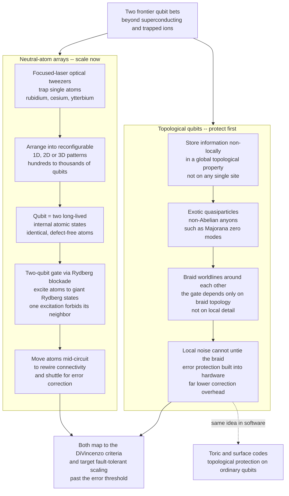

# 🪢 Neutral Atoms and Topological Qubits

> [!abstract] TL;DR
> Beyond the two incumbent qubit platforms (superconducting circuits and trapped ions) sit two very different **frontier bets** on the future of scalable quantum hardware. **Neutral-atom arrays** — championed by QuEra, Pasqal, Atom Computing, and the Lukin and Browaeys groups — hold individual atoms (rubidium, cesium, ytterbium) in **optical tweezers**: tightly focused laser beams that act like microscopic tractor beams. Hundreds to thousands of these *identical* atoms are arranged into arbitrary, **reconfigurable** 1D/2D/3D patterns; each qubit is encoded in two long-lived internal atomic states; and — crucially — the atoms can be physically **moved mid-computation** to rewire connectivity. Two-qubit entangling gates exploit the **Rydberg blockade**: briefly promote atoms to giant, highly polarizable Rydberg states, where one excited atom electrostatically forbids its neighbor from also exciting, supplying the *conditional* logic every entangling gate needs. Neutral atoms are today the **most scalable** platform and a natural engine for analog quantum **simulation** of many-body physics; their weaknesses are atom loss, slower gates than superconductors, and Rydberg-state fragility. In 2023–24 a Harvard/QuEra team ran a **48-logical-qubit** error-corrected processor on them, making neutral atoms a leading fault-tolerance contender. The second bet, **topological qubits** (Microsoft's long-term program), is more radical: store information **non-locally** in a global *topological* property of an exotic state of matter, so that *local* noise physically cannot corrupt it — **error protection baked into the hardware** instead of layered on in software. Information is manipulated by **braiding non-Abelian anyons** (quasiparticles such as **Majorana zero modes**) whose exchange enacts robust gates depending only on the *topology* of the braid, not its details. If it works, the error-correction overhead collapses; the catch is that Majoranas have proven extraordinarily hard to demonstrate conclusively, making this a scientifically contested, high-risk / high-reward path. The same topological idea appears in software as the **toric / surface code**.

---

## Intuition

**Analogy — two very different ways to keep a message safe.** Imagine you run a workshop that must reliably compute with fragile tokens, and you are weighing two philosophies.

The **neutral-atom** philosophy is *reconfigurable precision*. Picture a magician who uses invisible **laser tweezers** to pick up hundreds of identical marbles one at a time and set them down in any pattern they like on a smooth table — a line, a grid, a lattice, whatever the problem needs — and can *slide any marble to a new spot in the middle of the trick*. To make two marbles "talk," the magician briefly puffs one up into a giant, bloated balloon (a **Rydberg state**) so enormous it fills the space around it; while it is inflated, the neighbor physically *cannot* inflate too — there isn't room. That mutual "only one of us can puff up at once" veto is exactly the conditional interaction you need to entangle two qubits. The whole appeal is that the marbles are perfectly identical, you can rearrange the board on the fly, and you can already fit *lots* of them.

The **topological** philosophy is *indestructible by design*. Instead of guarding each token individually, you tie the information into a **knot** whose meaning lives in the *global* way the strands are looped around one another. A knot doesn't care if you jiggle, warm, or nudge any single strand — no *local* poke can change *which knot it is*; only cutting and re-tying (a global operation) can. So you store a qubit in the knottedness itself and compute by **braiding** the strands around each other. Because the answer depends only on the topology of the braid — how many times things wound around, not the wobbly path they took — noise that acts locally simply cannot corrupt it. The error protection is built into the *physics of the material*, before any software error correction is even switched on.

Technically: neutral-atom machines trap single atoms in [[Laser_Cooling_and_Trapping|optical tweezers]], encode qubits in atomic states, and entangle via the Rydberg blockade; topological machines encode qubits in the fusion space of **non-Abelian anyons** and compute by braiding, inheriting fault tolerance from [[Topology_in_Physics|topology]] itself.

---

## How It Works

### Branch 1 — Neutral-atom tweezer arrays

1. **Trap.** A tightly focused laser beam creates a microscopic optical-dipole trap — an **optical tweezer** — deep enough to hold a single neutral atom against gravity and thermal motion (the same laser-cooling and trapping physics used for atomic clocks). Spatial light modulators or acousto-optic deflectors split one laser into *hundreds to thousands* of tweezers at once.
2. **Arrange and rearrange.** Because each tweezer is independently steerable, atoms are sorted into **arbitrary, defect-free** 1D chains, 2D grids, or 3D lattices. Loading is probabilistic, so the machine images which traps caught an atom and then *moves* atoms to fill a perfect target pattern — reconfigurability is native, not bolted on.
3. **Encode the qubit.** The `0` and `1` states are two long-lived internal atomic levels — hyperfine ground states (rubidium, cesium) or a ground state and a metastable "clock" state (ytterbium, strontium). Being internal atomic states, they are **identical across every atom** and coherence times run into seconds.
4. **Single-qubit gates.** Focused laser or microwave pulses rotate individual atoms on the [[Qubits_and_the_Bloch_Sphere|Bloch sphere]], exactly the `Rx/Ry/Rz` rotations of [[Quantum_Gates_and_Circuits|gate-based circuits]].
5. **Two-qubit gates via the Rydberg blockade.** To entangle two atoms, a laser briefly drives them toward a **Rydberg state** — an electron promoted to a huge principal quantum number `n ≈ 50–100`, giving an atom thousands of times its normal size and an enormous dipole moment. Two nearby Rydberg atoms interact with a strong van-der-Waals energy `V(R) = C6 / R^6`. When `V(R)` far exceeds the laser's Rabi frequency `Ω`, exciting one atom shifts the doubly-excited state so far off resonance that the second atom is **energetically forbidden** from exciting — the *blockade*. Within a **blockade radius** `R_b = (C6/Ω)^(1/6)`, the pair behaves as a single collective two-level system, and this conditional dynamics is compiled into a controlled-phase / CZ entangling gate.
6. **Reconfigure connectivity mid-circuit.** Uniquely, atoms can be *physically shuttled* during a computation to bring distant qubits together, giving effectively programmable, non-local connectivity — and enabling elegant syndrome-extraction and transversal-gate layouts for error correction.

**Strengths:** best-in-class **scalability** (largest qubit arrays demonstrated), reconfigurable / movable connectivity, perfectly identical atoms, and a dual role as a powerful analog **quantum simulator** (see [[Quantum_Simulation_and_VQE]] and [[Many_Body_Quantum_Systems]]). **Weaknesses:** **atom loss** (atoms escape traps and must be reloaded), gates slower than superconducting circuits, sensitivity of fragile Rydberg states to stray fields, and two-qubit fidelities that are strong and improving but historically trailed ions.

### Branch 2 — Topological qubits

1. **Non-local encoding.** A topological qubit stores its state not on any single particle but in a **globally shared, non-local** degree of freedom of an exotic phase of matter. Because no local measurement can read or disturb that shared information, *local noise cannot corrupt it* — this is **hardware-level error protection**, in contrast to the *software* redundancy of [[Quantum_Error_Correction_Principles|conventional QEC]].
2. **Non-Abelian anyons.** In two dimensions, exotic quasiparticles called **anyons** can exist. A special class, **non-Abelian anyons** — the leading candidate being **Majorana zero modes** bound to the ends of topological superconductors — have a degenerate set of ground states. A pair of well-separated Majoranas encodes one qubit whose information lives in their *joint* parity, spread across space.
3. **Braiding as gates.** Move (adiabatically exchange) the anyons so their **worldlines braid** around one another in spacetime. For non-Abelian anyons, swapping two of them applies a *unitary gate* to the encoded state — and, remarkably, the result depends **only on the topology of the braid** (which strand went around which, how many times), not on the wobbly details of the path or its timing. Small perturbations that don't change the braid's topology change *nothing*, giving **intrinsic fault tolerance**.
4. **The promise and the peril.** *Promise:* if gates are protected at the hardware level, the crushing physical-qubit **overhead** of surface-code QEC could shrink dramatically. *Peril:* Majorana zero modes have been extraordinarily hard to demonstrate *conclusively* — early "zero-bias peak" signatures have mundane look-alikes, and the field has seen retracted claims. Microsoft's 2023–2025 program (the "Majorana 1" chip and single-shot parity-measurement results) advanced but remains **scientifically contested**.
5. **Software echo — the toric / surface code.** The very same topological idea, implemented in *software* on ordinary qubits, is the **toric code / surface code**: logical information stored in global (topological) properties of a stabilizer lattice, protected by local parity checks. Hardware anyons and the surface code are two sides of one coin.

Both platforms are judged against the **DiVincenzo criteria** (scalable well-defined qubits, initialization, universal gates, long coherence, and readout) and both are ultimately aimed at **fault-tolerant scaling** past the [[Fault_Tolerance_and_the_Threshold_Theorem|error threshold]].

### Flow / Architecture



---

## Key Concepts

### Secondary (the big picture)
- **Neutral atoms are trapped by light.** Tiny, tightly focused laser beams ("optical tweezers") grab single atoms and can put them anywhere and even move them around during a computation.
- **Identical building blocks.** Every atom of a given element is exactly the same, so there is no manufacturing variability — unlike fabricated superconducting chips.
- **The Rydberg blockade is the trick for two-qubit gates.** Puff one atom up into a giant state and its neighbor is *blocked* from puffing up too; that "only one at a time" rule is what lets you entangle them.
- **Topological qubits hide information in a knot.** Store the data in a global, knot-like property so that poking any single spot cannot change it — error protection built into the physics.
- **Braiding = computing.** You run a topological gate by looping the exotic particles around each other; only *how* they wind matters, not the shaky path, so noise is ignored.

### Undergraduate (the machinery)
- **Optical dipole traps and array assembly.** A red-detuned focused beam creates an attractive potential well; spatial light modulators / acousto-optic deflectors generate many traps, and real-time rearrangement builds defect-free target geometries from probabilistic loading.
- **Qubit encoding and coherence.** Hyperfine or clock-state qubits give second-scale coherence; single-qubit gates are laser/microwave Bloch-sphere rotations.
- **Rydberg physics.** Principal quantum number `n ≈ 50–100`; polarizability scales like `n^7` and van-der-Waals `C6` like `n^11`, so interactions are enormous. Blockade condition `V(R) = C6/R^6 ≫ Ω`; blockade radius `R_b = (C6/Ω)^(1/6)`. Inside `R_b`, the pair Rabi-oscillates collectively at the enhanced rate `√2 · Ω` between `|gg⟩` and the symmetric singly-excited state `|W⟩`.
- **Analog vs digital use.** The same array can run *digital* gate-based circuits or serve as an *analog* simulator whose native Ising-like Rydberg Hamiltonian probes many-body phases directly.
- **Non-Abelian anyons and fusion space.** `2N` Majorana modes span a `2^(N-1)`-dimensional protected space; qubits live in *joint* parities, not individual sites. Braiding enacts unitaries in this space.
- **The overhead argument.** Topological hardware protection aims to slash the `~10^3` physical-qubit-per-logical-qubit cost of surface-code QEC by making the *bare* qubit already error-suppressed.

### Graduate (the frontier)
- **Blockade-gate mechanisms.** Beyond the original blockade CZ, high-fidelity protocols use time-optimal pulses, adiabatic rapid passage, and echo sequences; leading demonstrations reach two-qubit fidelities `> 0.995`. Dominant errors: finite Rydberg lifetime, laser phase noise, atomic motion / Doppler dephasing, and imperfect blockade.
- **Coherent transport for QEC.** Shuttling atoms with sub-`ms` coherent transport enables reconfigurable stabilizer circuits, transversal logical gates between code blocks, and non-local connectivity that classical fixed-grid architectures lack — the basis of the 48-logical-qubit demonstration.
- **Topological order and TQC.** A system with anyonic excitations realizes topological order (long-range entanglement, ground-state degeneracy on a torus). Kitaev's toric code and the Majorana-wire proposals (Kitaev chain, semiconductor–superconductor nanowires with spin–orbit coupling and Zeeman field) are the canonical models.
- **Braiding is not universal alone.** Braiding Ising anyons (Majoranas) yields only Clifford gates; a **non-Clifford** resource (e.g. magic-state injection, or Fibonacci anyons which *are* braiding-universal) is required for universal quantum computation — so even topological hardware needs some form of distillation.
- **Why demonstration is hard.** A quantized `2e²/h` zero-bias conductance peak is *necessary but not sufficient* for Majoranas; disorder-induced Andreev bound states mimic the signature. Definitive proof requires non-local measurements, fusion-rule tests, and ultimately braiding statistics — an open experimental program.
- **Cross-platform QEC.** Neutral-atom surface/color codes and topological hardware are complementary routes to the *same* goal: driving logical error rates below threshold with tolerable overhead.

---

## Python Demo

The single most important primitive on a neutral-atom machine is the **Rydberg blockade** — the conditional interaction behind every two-qubit gate. Model two atoms, each a two-level system (ground `|g⟩`, Rydberg `|r⟩`), driven resonantly by a laser of Rabi frequency `Ω`. When *both* are in `|r⟩` they pay a van-der-Waals energy `V(R) = C6 / R^6`. Start both atoms in `|gg⟩`, evolve for a single-atom π-pulse, and sweep the interatomic distance `R`.

The physics to watch: **below** the blockade radius `R_b`, the doubly-excited state `|rr⟩` is pushed off resonance and its population is *suppressed* (blockade — at most one atom excites, and the pair oscillates collectively at `√2·Ω`); **beyond** `R_b`, the atoms are effectively independent and *both* excite (`P(rr) → 1`). That distance-controlled "only one at a time" switch is exactly the entangling mechanism.

```python
# Rydberg blockade with numpy + matplotlib only (no qiskit / no scipy).
# Two atoms, each a two-level system: ground |g>, Rydberg |r>.
# Basis order: |gg>=0, |gr>=1, |rg>=2, |rr>=3.
# Resonant laser drives g<->r on BOTH atoms with Rabi frequency Omega.
# When BOTH atoms are excited, a van der Waals energy V(R)=C6/R^6 shifts |rr>.
# Below the blockade radius R_b = (C6/Omega)^(1/6), that shift forbids double
# excitation (BLOCKADE); beyond it the atoms excite independently.
import numpy as np
import matplotlib.pyplot as plt

# ---- single-atom operators in the {g, r} space ----
I2  = np.eye(2, dtype=complex)
X   = np.array([[0, 1], [1, 0]], dtype=complex)   # flips g <-> r (the laser drive)
n_r = np.array([[0, 0], [0, 1]], dtype=complex)   # |r><r|, "is this atom excited?"

def kron(a, b):
    return np.kron(a, b)

Omega = 1.0                                   # Rabi frequency sets our time/energy unit
C6    = 1.0                                   # van der Waals coefficient
R_b   = (C6 / Omega) ** (1.0 / 6.0)           # blockade radius: V(R_b) == Omega

# Two-atom Hamiltonian:  drive on each atom  +  interaction only when both excited.
H_drive = (Omega / 2.0) * (kron(X, I2) + kron(I2, X))
P_rr    = kron(n_r, n_r)                       # projector onto |rr>

def H_of_R(R):
    V = C6 / R**6
    return H_drive + V * P_rr

def propagate(H, t):
    """U = exp(-i H t) via eigendecomposition of the Hermitian H (pure numpy)."""
    w, V = np.linalg.eigh(H)
    return (V * np.exp(-1j * w * t)) @ V.conj().T

psi0 = np.array([1, 0, 0, 0], dtype=complex)   # start in |gg>
t_pi = np.pi / Omega                           # a single-atom pi-pulse time

# ---------- 1. Excitation probabilities vs interatomic distance ----------
Rs        = np.linspace(0.45, 2.2, 500)
P_double  = np.empty_like(Rs)                  # population of |rr>
P_single  = np.empty_like(Rs)                  # population of |gr> + |rg>
for i, R in enumerate(Rs):
    psi = propagate(H_of_R(R), t_pi) @ psi0
    p   = np.abs(psi) ** 2
    P_double[i] = p[3]
    P_single[i] = p[1] + p[2]

# Sanity-check the two limits.
p_deep = np.abs(propagate(H_of_R(0.5), t_pi) @ psi0) ** 2   # deep blockade
p_free = np.abs(propagate(H_of_R(3.0), t_pi) @ psi0) ** 2   # essentially free
print(f"Blockade radius R_b = {R_b:.3f}")
print(f"Deep blockade R=0.5 : P(rr)={p_deep[3]:.3f}  <-- suppressed (blockade)")
print(f"Free atoms   R=3.0  : P(rr)={p_free[3]:.3f}  <-- both excite independently")

# ---------- 2. Time dynamics: blockaded pair vs independent pair ----------
ts       = np.linspace(0, 2 * np.pi, 400)
blockaded = np.array([np.abs(propagate(H_of_R(0.5), t) @ psi0)[3] ** 2 for t in ts])
free      = np.array([np.abs(propagate(H_of_R(3.0), t) @ psi0)[3] ** 2 for t in ts])

# ---------- 3. Plots ----------
fig, (ax1, ax2) = plt.subplots(1, 2, figsize=(12, 4.6))

ax1.plot(Rs, P_double, lw=2.2, color="#dc2626", label="P(rr) double excitation")
ax1.plot(Rs, P_single, lw=2.2, color="#2563eb", label="P(single) one atom excited")
ax1.axvline(R_b, ls="--", color="k", label=f"blockade radius R_b = {R_b:.2f}")
ax1.axvspan(Rs.min(), R_b, color="#fca5a5", alpha=0.20)
ax1.text(0.55, 0.06, "BLOCKADE\nP(rr) ~ 0", color="#7f1d1d", fontsize=9)
ax1.set_xlabel("interatomic distance  R  (units of R_b)")
ax1.set_ylabel("population after a pi-pulse")
ax1.set_title("Rydberg blockade suppresses double excitation for R < R_b")
ax1.legend(loc="center right", fontsize=8)
ax1.grid(alpha=0.3)

ax2.plot(ts, blockaded, lw=2.2, color="#dc2626", label="R = 0.5 R_b  (blockaded)")
ax2.plot(ts, free,      lw=2.2, color="#2563eb", label="R = 3.0 R_b  (independent)")
ax2.set_xlabel("evolution time  (units of 1/Omega)")
ax2.set_ylabel("P(rr) double-excitation probability")
ax2.set_title("Double excitation is frozen out under blockade")
ax2.legend(fontsize=8)
ax2.grid(alpha=0.3)

plt.tight_layout()
plt.savefig("rydberg_blockade.png", dpi=130)
print("Saved figure to rydberg_blockade.png")

# Takeaways:
#   * For R < R_b the |rr> state is detuned by V(R) >> Omega, so P(rr) ~ 0:
#     at most ONE atom excites -- the blockade. The pair instead oscillates
#     collectively between |gg> and (|gr>+|rg>)/sqrt(2) at the enhanced rate
#     sqrt(2)*Omega. This state-dependent "only one of us can excite" rule is
#     precisely the CONDITIONAL logic a two-qubit entangling (CZ) gate needs.
#   * For R > R_b the interaction is negligible, the atoms excite independently,
#     and a pi-pulse drives BOTH to |r>  ->  P(rr) -> 1. No entanglement.
#   * The crossover sits right at R_b = (C6/Omega)^(1/6): distance tunes the
#     blockade, and Omega vs C6 sets where it turns on.
```

Running it prints a blockade radius `R_b = 1.000`, `P(rr) ≈ 0` deep inside the blockade (`R = 0.5`) versus `P(rr) ≈ 1` for well-separated atoms (`R = 3.0`), and the figure shows the red double-excitation curve pinned near zero for `R < R_b` while it climbs to one beyond it. The right panel drives the point home: under blockade, `|rr⟩` is *dynamically frozen out* for all times, which is exactly why one excited atom can veto its neighbor and thereby entangle the pair.

---

## Real-World Applications

> **Example — QuEra / Harvard's 48-logical-qubit processor (Bluvstein et al., 2024).** A reconfigurable rubidium tweezer array with ~280 atoms was used to encode and operate **48 logical qubits**, running error-corrected circuits with transversal gates. The demonstration leaned on two neutral-atom superpowers from this note: *identical* atoms with high-fidelity Rydberg-blockade entangling gates, and **coherent atom transport** to shuttle qubits between storage, entangling, and readout zones — physically rewiring connectivity mid-circuit to lay out surface/color-code stabilizer measurements. It is among the strongest evidence that neutral atoms are a leading path to [[Fault_Tolerance_and_the_Threshold_Theorem|fault-tolerant]] scaling.

- **Programmable quantum simulators (Pasqal, QuEra, Lukin/Browaeys).** Rydberg arrays of 256+ atoms directly emulate Ising and many-body Hamiltonians, mapping quantum phase transitions, spin liquids, and lattice-gauge physics — the analog-simulation payoff described in [[Quantum_Simulation_and_VQE]] and [[Many_Body_Quantum_Systems]].
- **Neutral-atom quantum clouds.** QuEra's *Aquila* (256 qubits) is publicly available via cloud, and Atom Computing announced arrays exceeding **1000 atoms** — the largest neutral-neutral qubit counts to date, underscoring the scalability advantage.
- **Optimization and QAOA on Rydberg hardware.** Maximum-independent-set problems map naturally onto the blockade constraint (no two "connected" atoms may be simultaneously excited), letting Rydberg arrays tackle combinatorial optimization near-natively.
- **Microsoft's topological program.** Microsoft Azure Quantum's Majorana-based effort (the 2025 "Majorana 1" announcement and single-shot parity-measurement results in InAs–Al hybrid nanowires) is the flagship attempt to realize a *hardware-protected* topological qubit — high-risk, but promising radically lower QEC overhead if validated.
- **Toric / surface codes everywhere.** The *software* form of topological protection — the surface code — is the QEC scheme of choice on superconducting and neutral-atom hardware alike, a direct descendant of the same anyonic idea.

---

## Common Pitfalls

- **"The blockade is purely a distance effect."** It is the *ratio* `V(R)/Ω` that matters, not distance alone. Drive the atoms harder (larger `Ω`) and the blockade radius `R_b = (C6/Ω)^(1/6)` *shrinks*; the same geometry can be blockaded or not depending on the pulse. Design gates around the interplay, not a fixed spacing.
- **Forgetting the `√2` collective enhancement.** Under blockade the pair does *not* Rabi-oscillate at `Ω`; the symmetric state `|W⟩` is driven at `√2·Ω`. Ignoring this mistimes the entangling pulse and leaks population into `|rr⟩`, spoiling gate fidelity.
- **Treating atom loss like a gate error.** Atoms literally escape their traps; a lost atom is not a bit-flip but a *missing qubit* (leakage/erasure). It needs detection and reloading, and it is handled very differently from Pauli noise in error correction — though erasure errors can actually be *easier* to correct when their location is known.
- **Assuming Rydberg states are robust.** Giant Rydberg atoms are exquisitely sensitive to stray electric fields, blackbody radiation, and have finite lifetimes. They are a *transient* resource used only during the gate, never for storage — the qubit itself lives in stable ground states.
- **Believing topological qubits already exist as engineering reality.** Despite real progress, conclusive demonstration of a braidable, computationally useful Majorana qubit remains **contested**; zero-bias conductance peaks have non-topological look-alikes (disorder-induced Andreev bound states). Treat topological hardware as a promising research bet, not a shipped product.
- **Conflating hardware topological qubits with the surface code.** The **toric/surface code** is *software* topological protection running on ordinary noisy qubits (it still pays the full QEC overhead). A *hardware* topological qubit aims to be protected *before* any code is applied. Same idea, very different maturity and cost profile.
- **Thinking braiding alone is universal.** Braiding Majorana (Ising) anyons yields only Clifford gates; universality still needs a non-Clifford resource (magic states, or exotic Fibonacci anyons). "Topological" does not automatically mean "no distillation required."

---

## Related Concepts

- [[Quantum_Gates_and_Circuits]] — single-qubit rotations become focused laser/microwave pulses on atoms, and the Rydberg-blockade CZ (or braiding operation) is the platform's native two-qubit entangling gate.
- [[Quantum_Simulation_and_VQE]] — reconfigurable Rydberg arrays double as powerful *analog* quantum simulators of many-body Hamiltonians, one of the platform's most defensible near-term uses.
- [[Quantum_Error_Correction_Principles]] — the *software* redundancy this note contrasts with: topological qubits try to bake error protection into hardware, while neutral atoms are a leading platform for running conventional QEC codes.
- [[Fault_Tolerance_and_the_Threshold_Theorem]] — the scaling target for both bets; the 48-logical-qubit neutral-atom demonstration and the promised overhead reduction of topological qubits are both about getting below threshold cheaply.
- [[Laser_Cooling_and_Trapping]] — the AMO physics of optical-dipole traps and tweezers that makes single-atom trapping and array assembly possible in the first place.
- [[Topology_in_Physics]] — the topological invariants, winding numbers, and Berry-phase machinery that give anyon braiding its noise-immune, path-independent character.
- [[Many_Body_Quantum_Systems]] — the exponentially large Hilbert spaces and correlated phases that Rydberg simulators probe, and where topological order (anyons) physically arises.

*(Sibling hardware notes planned for this section — Physical Qubits and the DiVincenzo Criteria, Superconducting Qubits, Trapped-Ion Quantum Computers, Stabilizer Codes and the Surface Code, and Building and Scaling Quantum Computers — will be cross-linked here once those files exist.)*

---

## Review Questions

**Tier 1 — Conceptual (explain to a peer):**
1. Using the "laser tweezers rearranging marbles" and the "message tied into a knot" analogies, contrast the *neutral-atom* and *topological-qubit* philosophies. Which one adds error protection in *software* and which builds it into the *hardware*, and why does that distinction matter for qubit overhead?
2. In plain language, why does exciting one atom to a giant Rydberg state prevent its close neighbor from also exciting? What conditional logic does that "only one at a time" veto provide?

**Tier 2 — Applied (compute / reason):**
3. Given a van-der-Waals coefficient `C6` and laser Rabi frequency `Ω`, write down the blockade radius `R_b` and explain what happens to it if you *double* `Ω`. Two atoms sit at `R = 0.5 R_b`: sketch how `P(rr)` and `P(single)` behave over a π-pulse, and identify the collective Rabi frequency of the blockaded pair.
4. Explain concretely how the ability to *physically move atoms mid-circuit* helps run a surface-code error-correction cycle. What does reconfigurable connectivity buy you that a fixed 2D grid of superconducting qubits does not?

**Tier 3 — Theoretical (deep understanding):**
5. Explain why braiding *non-Abelian anyons* yields a gate that depends only on the topology of the braid, and argue precisely why *local* noise cannot corrupt the encoded information. Then explain why braiding Majorana (Ising) anyons is nevertheless *not* sufficient for universal quantum computation, and what extra resource is required.
6. A lab reports a quantized `2e²/h` zero-bias conductance peak and claims a Majorana zero mode. Why is this evidence *necessary but not sufficient*? Describe at least two non-topological effects that mimic the signature and what additional experiments would be needed to conclusively demonstrate a topological qubit. Relate this to why the topological program is "high-risk / high-reward."

---

## Sources

- Saffman, M., Walker, T. G. & Mølmer, K. "Quantum information with Rydberg atoms," *Reviews of Modern Physics* 82 (2010): 2313–2363 — the foundational review of Rydberg-blockade quantum logic. [DOI](https://doi.org/10.1103/RevModPhys.82.2313)
- Bluvstein, D. et al. "Logical quantum processor based on reconfigurable atom arrays," *Nature* 626 (2024): 58–65 — the 48-logical-qubit neutral-atom demonstration with coherent transport. [DOI](https://doi.org/10.1038/s41586-023-06927-3)
- Ebadi, S. et al. "Quantum phases of matter on a 256-atom programmable quantum simulator," *Nature* 595 (2021): 227–232 — large-scale Rydberg analog simulation. [DOI](https://doi.org/10.1038/s41586-021-03582-4)
- Nayak, C., Simon, S. H., Stern, A., Freedman, M. & Das Sarma, S. "Non-Abelian anyons and topological quantum computation," *Reviews of Modern Physics* 80 (2008): 1083–1159 — the definitive review of anyons, braiding, and TQC. [DOI](https://doi.org/10.1103/RevModPhys.80.1083)
- Kitaev, A. Y. "Fault-tolerant quantum computation by anyons," *Annals of Physics* 303 (2003): 2–30 — introduces the toric code and topological protection. [DOI](https://doi.org/10.1016/S0003-4916(02)00018-0)
- Microsoft Azure Quantum (Aghaee, M. et al.). "Interferometric single-shot parity measurement in InAs–Al hybrid devices," *Nature* 638 (2025): 651–655 — Microsoft's topological-qubit measurement milestone. [DOI](https://doi.org/10.1038/s41586-024-08445-2)

---

#quantum-computing #neutral-atoms #rydberg-blockade #topological-qubits #anyons
