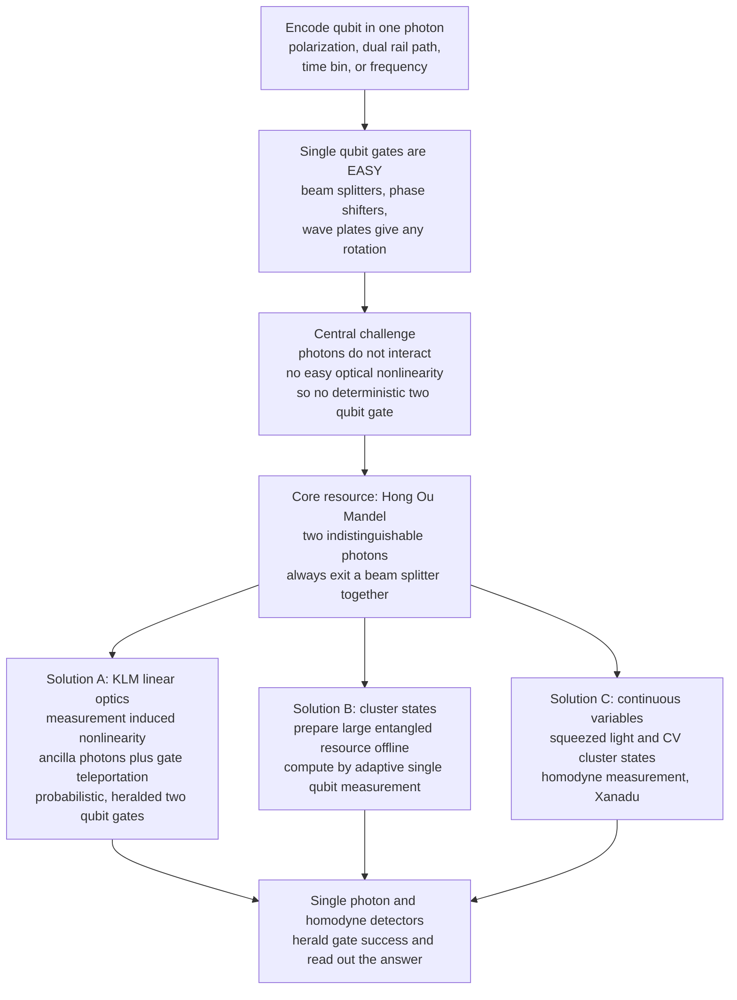

# 💡 Photonic Quantum Computing

> [!abstract] TL;DR
> **Photonic quantum computing** encodes qubits in single **particles of light** — a photon's **polarization**, its **path** (dual-rail), its **time-bin**, or its **frequency** — and processes them with ordinary optical elements: **beam splitters, phase shifters, and wave plates**. Its great gift is that photons **barely interact with their environment**, so they stay coherent even at **room temperature** and travel at light speed; the *same* qubit that computes can be shot straight down a telecom fiber, making photonics the natural substrate for both computing **and** the [[The_Quantum_Internet|quantum internet]]. Single-qubit gates are consequently trivial and high-fidelity. The catch is the mirror image of the gift: because photons **do not interact with each other**, there is no easy optical nonlinearity, so **deterministic two-qubit gates are extremely hard**. The field's central theoretical rescue is **KLM** (Knill–Laflamme–Milburn, 2001), which proved that universal quantum computing *is* possible with only **linear optics, single-photon sources, and detectors** by manufacturing an effective nonlinearity through **measurement and teleportation** — at the price of ancilla photons and **probabilistic** gates. Modern approaches lean on **measurement-based (one-way) computing** on giant **cluster states** and **continuous-variable** squeezed-light architectures (Xanadu). A non-universal cousin, **boson sampling** (Aaronson–Arkhipov), is classically hard and powered USTC's **Jiuzhang** quantum-advantage demonstration. The whole edifice rests on one purely quantum phenomenon with no classical analog: the **Hong–Ou–Mandel effect** — two indistinguishable photons meeting at a 50:50 beam splitter always leave *together*. The dominant engineering enemies are **photon loss** and **probabilistic gates**, fought with **multiplexing**, near-deterministic sources, and near-perfect detectors; **PsiQuantum** and **Xanadu** are betting integrated-photonic, telecom-compatible manufacturing can scale this to fault tolerance via **fusion-based** architectures.

---

## Intuition

**Analogy — qubits that are perfect loners.** Imagine each qubit is a monk who has taken a vow of silence and total detachment. Nothing in the outside world can disturb him — noise, heat, jostling crowds all pass right through without leaving a trace. This is *wonderful* for keeping his internal state pristine: he stays perfectly "coherent" for a long time, even in a hot, chaotic room, and he can sprint across the country in a flash. That is a photon: a particle of light that ignores its environment so thoroughly that it holds its quantum state at room temperature and flies down an optical fibre at light speed.

But now you need *two* of these monks to have a conversation — a **two-qubit gate**, where one qubit's state must depend on the other's. The very detachment that made them immune to noise makes them immune to *each other*: photons, in ordinary matter-free space, simply fly past one another without interacting. So the entire discipline of photonic quantum computing is a set of ingenious tricks for **forcing aloof particles of light to talk** — not by making them collide (they won't), but by **measuring** them cleverly so the act of detection itself entangles the survivors. Single-qubit rotations are almost free; the whole game is manufacturing a two-qubit interaction out of measurement.

---

## How It Works

### 1. Encoding a qubit in a photon

A single photon carries several degrees of freedom, and *any* of them can hold a qubit:

- **Polarization**: $|0\rangle = |H\rangle$ (horizontal), $|1\rangle = |V\rangle$ (vertical). Compact and intuitive; a **wave plate** rotates it.
- **Path / dual-rail**: one photon shared across two waveguides; "which rail" is the qubit. This is the natural encoding on **integrated photonic chips**.
- **Time-bin**: "early" vs "late" arrival. Extremely robust to fibre-induced polarization drift, so it is the workhorse of long-distance quantum communication.
- **Frequency (colour)**: two spectral modes. Enables massive **wavelength-division multiplexing** on one fibre.

All four are interconvertible, and each has a niche — path for chips, time-bin/polarization for fibre links.

### 2. Single-qubit gates are the easy part

On the [[Qubits_and_the_Bloch_Sphere|Bloch sphere]], an arbitrary single-qubit rotation is built from just two passive optical elements:

- A **phase shifter** delays one rail/polarization relative to the other → a rotation about the $Z$ axis.
- A **beam splitter** (or, for polarization, a **wave plate**) coherently mixes the two modes → a rotation about the $X$/$Y$ axes.

Cascading a phase shifter, a beam splitter, and another phase shifter realizes *any* $SU(2)$ rotation with **near-unity fidelity** — no cryogenics, no fragile control pulses, just glass and geometry. This is why photonics has the **best single-qubit gates of any platform**. See [[Quantum_Gates_and_Circuits]] for the universal-gate picture these implement.

### 3. The central challenge — photons refuse to interact

Universality needs an **entangling two-qubit gate** (e.g., CNOT). Such a gate requires the *presence* of one photon to change what happens to another — a **nonlinear** interaction. But in linear optics, beam splitters and phase shifters are, by definition, **linear**: they transform creation operators into linear combinations of creation operators, and they *cannot* entangle two independent photons on their own. A genuine photon–photon nonlinearity (e.g., a Kerr medium strong enough to act at the single-photon level) is astronomically weak in natural materials. This is the defining obstacle of the entire field: **the isolation that gives photons superb coherence is exactly what forbids an easy two-qubit gate.**

### 4. Solution A — KLM: manufacture nonlinearity from measurement

In 2001 **Knill, Laflamme, and Milburn** stunned the field by proving that **universal quantum computing is possible with linear optics alone** — no nonlinear medium required — provided you also have **single-photon sources**, **single-photon detectors**, and **feed-forward**. The trick: entangle your data photons with **ancilla** photons through a beam-splitter network, then **measure** the ancillas. Measurement is inherently nonlinear (it is a projection), so a *particular* detection outcome **heralds** that the desired entangling gate was applied to the survivors. Two consequences follow:

- **Gates are probabilistic.** The gate succeeds only for a specific detector pattern (e.g., the original CNOT proposal succeeds with probability $1/16$). When it fails, you know it failed (it is *heralded*) and can retry — but retrying is costly.
- The scheme uses **[[Quantum_Teleportation|gate teleportation]]** to boost success probability toward one by consuming pre-prepared entangled resources, trading a hard nonlinearity for a large **ancilla and resource overhead**.

KLM turned photonic quantum computing from "obviously impossible" into "possible but resource-hungry."

### 5. Solution B — measurement-based / one-way computing on cluster states

Rather than fighting to run gates one at a time, the **measurement-based (one-way) quantum computing** model splits the problem in two:

1. **Offline**, prepare a large, highly entangled **cluster state** — a lattice of photons pre-wired with entanglement. All the difficult probabilistic entangling operations happen *here*, off the critical path, where failures can simply be discarded and retried.
2. **Online**, compute by performing only **adaptive single-qubit measurements** on the cluster, choosing each measurement basis based on earlier outcomes. Since single-qubit measurements are easy and deterministic, the computation itself is straightforward.

This reframing is a perfect fit for photons: build the entangled resource with heralded, probabilistic fusion, then "consume" it by measurement. The connection to [[Measurement_and_the_No_Cloning_Theorem|measurement]] is fundamental — here measurement is not the end of a computation but its *engine*. **PsiQuantum's fusion-based quantum computing (FBQC)** is a fault-tolerant refinement: build tiny "resource states," then stitch them with **fusion measurements** (essentially HOM-style Bell measurements), tolerating loss and gate failure through error correction.

### 6. Solution C — continuous variables and squeezed light

A different encoding abandons single photons for the **quadratures** of the electromagnetic field (amplitude and phase), using **squeezed light** as the resource. **Xanadu's** architecture prepares large **CV cluster states** from squeezed modes and computes by homodyne measurement, with non-Gaussian "magic" states supplying universality. It maps naturally onto integrated photonics and room-temperature operation.

### 7. Boson sampling — a hard problem that skips universality

**Aaronson and Arkhipov (2011)** identified a *non-universal* photonic task that is nonetheless **classically intractable**: inject $n$ indistinguishable photons into an $m$-mode linear-optical network and sample the output photon-number distribution. The output probabilities are **permanents** of complex matrices — a #P-hard quantity — so no classical computer can efficiently reproduce the samples. This gave a clean route to demonstrating quantum advantage without building a full computer, and USTC's **Jiuzhang** did exactly that. See [[Entanglement_and_Bell_States|multi-photon interference]] for the underlying resource.

### 8. The core quantum resource — Hong–Ou–Mandel interference

Every entangling operation above ultimately relies on **two-photon interference**. The canonical instance is the **Hong–Ou–Mandel (HOM) effect**: send two *indistinguishable* photons into the two input ports of a 50:50 beam splitter, one per port, and they **always exit together** on the same side — the "one photon out of each port" (coincidence) outcome vanishes to **zero**. There is no classical analog; two classical light pulses would give coincidences half the time. HOM is the physical heart of photonic **Bell measurements**, **fusion gates**, and boson sampling — and its depth (the "HOM dip") is the standard yardstick of photon indistinguishability.

### Flow — from photon qubits to a computed result



---

## Key Concepts

### Secondary (intuitive level)
- Qubits are single **particles of light**; because light ignores its surroundings, photonic qubits stay coherent **at room temperature** and move at light speed.
- **Single-qubit gates are easy** — just mirrors, beam splitters, and phase plates. The hard part is making two photons interact, because they naturally *don't*.
- The famous trick is to make photons "talk" by **measuring** them cleverly, so detection itself entangles the ones left behind.
- The same photonic qubit that computes can be **sent down a fibre**, so photonics is the natural technology for a future **quantum internet**.

### Undergraduate (working level)
- **Encodings**: polarization, dual-rail path, time-bin, frequency — and where each is used (chips vs fibre).
- **Passive linear optics**: beam splitter + phase shifter as an $SU(2)$ rotation; why they cannot entangle independent photons.
- **KLM theorem**: universality from *linear optics + single-photon sources + detectors + feed-forward*; **probabilistic, heralded** gates; ancilla overhead; gate teleportation to boost success.
- **Measurement-based computing**: cluster states as a pre-entangled resource; compute by adaptive single-qubit measurements; fusion of small resource states.
- **Hong–Ou–Mandel effect**: two indistinguishable photons bunch; coincidence probability drops to zero; the "HOM dip" as an indistinguishability metric.
- **Boson sampling**: a non-universal, classically hard sampling task tied to matrix **permanents**.

### Graduate (theoretical level)
- **Second-quantized formalism**: beam splitter as a passive $U(m)$ transformation on mode operators $\hat a_j^\dagger \to \sum_k U_{jk}\hat a_k^\dagger$; output amplitudes as **permanents** of submatrices of $U$ (the Aaronson–Arkhipov result and the permanent's #P-hardness).
- **KLM resource analysis**: the $1/16$ CNOT, the $n^2/(n+1)^2$ nonlinear-sign-shift scaling, and teleportation-based error correction that pushes success $\to 1$ with polynomially many ancillas.
- **Measurement-based model**: cluster-state stabilizers, the **one-way computer** of Raussendorf–Briegel, and byproduct-operator feed-forward; **fusion-based quantum computation** and its loss/erasure thresholds.
- **Loss and multiplexing**: photon loss as the dominant error; **temporal/spatial multiplexing** to convert non-deterministic heralded sources and gates into (near-)deterministic ones; detector efficiency and dark-count budgets.
- **Continuous-variable QC**: Gaussian operations from squeezing/beam splitters, the Gottesman–Knill-style classical simulability of Gaussian circuits, and non-Gaussian resources (cubic phase / GKP states) for universality and fault tolerance.

---

## Python Demo

```python
# Hong-Ou-Mandel (HOM) two-photon interference -- the workhorse resource of
# photonic quantum computing, and a phenomenon with NO classical analog.
#
# PART 1: build the 50:50 beam-splitter UNITARY on the two-photon Fock state
#         |1,1> (one photon in each input port) and show the "coincidence"
#         amplitude |1,1> vanishes -- the photons always leave TOGETHER.
# PART 2: sweep the relative delay between the two photons and plot the
#         coincidence probability -- the famous HOM dip to zero at perfect
#         overlap, and a shallower dip for an imperfect (V<1) source.
#
# numpy + matplotlib only.
import numpy as np
import matplotlib.pyplot as plt

# =====================================================================
# PART 1 -- the beam-splitter unitary on |1,1>
# U = exp(theta * (a_dag b - a b_dag)),  theta = pi/4  -> a 50:50 splitter.
# G is anti-Hermitian, so iG is Hermitian and we exponentiate via eigh
# (no scipy needed).
# =====================================================================
N = 4  # Fock truncation per mode (0..3 photons); ample for two photons

def annihilation(n):
    """Single-mode annihilation operator on an n-dim Fock space."""
    return np.diag(np.sqrt(np.arange(1, n)), 1)

I = np.eye(N)
a_ = np.kron(annihilation(N), I)          # mode A (input port 1) annihilation
b_ = np.kron(I, annihilation(N))          # mode B (input port 2) annihilation
ad, bd = a_.conj().T, b_.conj().T         # creation operators

G = ad @ b_ - a_ @ bd                     # beam-splitter generator (anti-Hermitian)
theta = np.pi / 4                         # 50:50 beam splitter
w, V = np.linalg.eigh(1j * G)             # iG is Hermitian
U = (V * np.exp(-1j * theta * w)) @ V.conj().T   # U = exp(theta*G)

def fock(na, nb):
    """Two-mode Fock ket |na, nb> as a flat state vector."""
    v = np.zeros(N * N, dtype=complex)
    v[na * N + nb] = 1.0
    return v

psi_out = U @ fock(1, 1)                   # send in one photon per port
print("Beam-splitter output for input |1,1> (indistinguishable photons):")
for na in range(3):
    for nb in range(3):
        amp = psi_out[na * N + nb]
        if abs(amp) > 1e-9:
            print(f"   |{na},{nb}> : amplitude = {amp.real:+.4f}")
p_coinc = abs(psi_out[1 * N + 1]) ** 2
print(f"   coincidence P(|1,1>) = {p_coinc:.6f}  <-- vanishes: the HOM dip\n")

# =====================================================================
# PART 2 -- the HOM dip vs relative photon delay / distinguishability.
# Two Gaussian single-photon wavepackets of coherence time tau_c meet with
# relative delay tau. Two-photon interference gives
#     P_coincidence(tau) = 1/2 * (1 - V * gamma(tau)^2)
# where gamma(tau) = |<psi(t)|psi(t-tau)>| is the wavepacket OVERLAP
# (computed here by direct numerical integration, not a plugged-in formula)
# and V <= 1 is the source visibility (imperfect indistinguishability).
# =====================================================================
tau_c = 1.0                                # photon coherence time [arb. units]
t = np.linspace(-12, 12, 4000)             # time grid for the overlap integral
dt = t[1] - t[0]

def wavepacket(t, t0):
    """Normalized Gaussian single-photon amplitude centered at t0."""
    psi = np.exp(-(t - t0) ** 2 / (4 * tau_c ** 2))
    return psi / np.sqrt(np.sum(np.abs(psi) ** 2) * dt)

def overlap(tau):
    """gamma(tau) = |<psi(t)|psi(t-tau)>| by numerical integration."""
    return np.abs(np.sum(np.conj(wavepacket(t, 0.0)) * wavepacket(t, tau)) * dt)

taus = np.linspace(-6, 6, 400)
gamma = np.array([overlap(x) for x in taus])
P_ideal = 0.5 * (1 - 1.0 * gamma ** 2)     # perfect photons, V = 1.0
P_real = 0.5 * (1 - 0.9 * gamma ** 2)      # imperfect source, V = 0.9

plt.figure(figsize=(8, 5))
plt.plot(taus, P_ideal, color="#2563eb", lw=2, label="ideal photons (V = 1.0)")
plt.plot(taus, P_real, color="#dc2626", lw=2, ls="--", label="real source (V = 0.9)")
plt.axhline(0.5, color="gray", ls=":", lw=1,
            label="classical / distinguishable limit")
plt.annotate("HOM dip\nphotons bunch,\ncoincidences vanish",
             xy=(0, 0.0), xytext=(1.6, 0.20),
             arrowprops=dict(arrowstyle="->", color="black"))
plt.xlabel("relative photon delay  tau  [coherence times]")
plt.ylabel("coincidence probability  P_c(tau)")
plt.title("Hong-Ou-Mandel two-photon interference")
plt.ylim(-0.02, 0.55)
plt.grid(alpha=0.3)
plt.legend()
plt.tight_layout()
plt.show()

mid = len(taus) // 2
print(f"P_c at zero delay (V=1.0): {P_ideal[mid]:.4f}   (dips to 0 -- pure quantum)")
print(f"P_c at zero delay (V=0.9): {P_real[mid]:.4f}   (imperfect source stops short)")
print(f"P_c at large delay       : {P_ideal[0]:.4f}   (classical 1/2 -- no interference)")
```

**What the demo shows.** Part 1 applies the exact 50:50 beam-splitter unitary to the state $|1,1\rangle$ and prints an output of $\tfrac{1}{\sqrt2}\big(|2,0\rangle - |0,2\rangle\big)$: the two photons are always found **bunched** in one output, and the coincidence amplitude $|1,1\rangle$ is **exactly zero**. Part 2 reproduces the experimental signature — as you slide the photons out of overlap (increasing delay $\tau$), their wavepacket overlap $\gamma(\tau)$ shrinks and coincidences climb back to the classical value $1/2$, tracing the **HOM dip**. A perfect source ($V=1$) dips all the way to zero; a realistic source ($V=0.9$) bottoms out at $0.05$, which is exactly how experimentalists read **photon indistinguishability** straight off the dip depth.

---

## Real-World Applications

- **Jiuzhang boson-sampling advantage (USTC, 2020–2021).** A fully optical, room-temperature machine injected dozens of squeezed-light photons into a large interferometer and sampled outputs a classical supercomputer would need billions of years to reproduce — a photonic demonstration of computational advantage complementary to superconducting processors.
- **PsiQuantum's fault-tolerant roadmap.** PsiQuantum is building **silicon-photonic** chips in a commercial semiconductor foundry, betting that manufacturability plus a **fusion-based** architecture (small resource states stitched by measurement, with heavy error correction against loss) is the fastest route to a million-qubit machine.
- **Xanadu's continuous-variable processors.** Xanadu's **Borealis** and **X-series** chips use squeezed light and programmable interferometers, exposed to developers through the **Strawberry Fields / PennyLane** stack — photonic quantum computing you can run from a laptop.
- **The quantum internet and networking.** Because the computing qubit *is* a telecom photon, photonics is the natural carrier for [[Quantum_Teleportation|teleportation]], entanglement distribution, and [[The_Quantum_Internet|quantum-network]] links — the only platform where "compute" and "communicate" use the same physical qubit.
- **Photonic Bell measurements and repeaters.** HOM interference underpins the **Bell-state measurements** used in quantum repeaters, entanglement swapping, and measurement-device-independent QKD — the plumbing of long-distance quantum communication.

---

## Common Pitfalls

- **"Photons don't interact, so photonic quantum computing is impossible."** KLM proved the opposite: you never need a direct photon–photon force — **measurement plus feed-forward** manufactures an effective nonlinearity. The cost is probabilistic gates and ancilla overhead, not impossibility.
- **"Room-temperature operation means photonics is easy."** The cryostat moves elsewhere, not away. Photonics trades cold qubits for the brutal difficulty of **near-deterministic single-photon sources** and **near-unity-efficiency detectors** — and **photon loss** is the number-one error, not thermal noise.
- **"HOM bunching is just two waves interfering, like any beam splitter."** No — HOM is a **genuinely quantum**, two-particle interference of *indistinguishable bosons* with no classical analog. Two classical pulses give coincidences half the time; only indistinguishable single photons drive the dip to **zero**.
- **"Probabilistic gates just mean retrying, so it's fine."** Naively, a chain of low-probability heralded gates has success probability that decays exponentially with circuit depth. Scalability *requires* **multiplexing** and the offline **cluster-state** strategy to convert probabilistic operations into effectively deterministic ones — this is a first-class architectural problem, not an afterthought.
- **"Boson sampling is a universal quantum computer."** It is deliberately **non-universal** — it cannot run Shor's or Grover's algorithm. Its only job is to be classically hard, making it a clean vehicle for advantage demonstrations, not general computation.
- **"Better lasers alone will fix the scaling."** The bottlenecks are **source indistinguishability, detector efficiency, on-chip loss, and gate success probability** acting together. A brighter laser without high indistinguishability just produces more *distinguishable* photons that wash out the HOM interference the whole platform depends on.

---

## Related Concepts

- [[Quantum_Gates_and_Circuits]] — beam splitters, phase shifters, and wave plates realize the universal single-qubit rotations; the hard part is the entangling two-qubit gate photonics must manufacture from measurement.
- [[Measurement_and_the_No_Cloning_Theorem]] — measurement is not the end of a photonic computation but its *engine*: measurement-induced nonlinearity (KLM) and adaptive single-qubit measurements (cluster-state computing) are how photons entangle.
- [[Quantum_Teleportation]] — gate teleportation is the mechanism KLM uses to boost probabilistic linear-optical gates toward deterministic success by consuming entangled ancilla resources.
- [[The_Quantum_Internet]] — photonics is the only platform where the computing qubit is also the *communication* qubit; the same photon that runs a gate can be sent down a fibre.
- [[Entanglement_and_Bell_States]] — cluster states are large multipartite entangled resources, and photonic Bell measurements (via HOM interference) are how entanglement is created and fused.
- [[Qubits_and_the_Bloch_Sphere]] — polarization, path, time-bin, and frequency are just different physical coordinates on the same Bloch sphere; passive optics rotate the state vector on it.
- [[Quantum_Optics_and_Cavity_QED]] — the underlying physics of single-photon states, mode operators, and light–matter coupling that photonic sources and detectors exploit.
- [[Interference_and_Diffraction]] — the classical wave-optics backdrop against which the *non-classical* two-photon HOM interference stands out so sharply.

---

## Review Questions

**Tier 1 — Conceptual (explain to a peer):**
1. Using the "aloof monk" analogy, explain the double-edged property of photons that makes single-qubit gates trivial but two-qubit gates the central challenge of photonic quantum computing.
2. In one or two sentences, what does the Hong–Ou–Mandel effect say happens to two indistinguishable photons at a 50:50 beam splitter, and why is there no classical version of this behaviour?

**Tier 2 — Applied (reason / compute):**
3. A source produces photons whose HOM dip only reaches a coincidence probability of $0.10$ instead of $0$. Using $P_c = \tfrac12(1 - V\gamma^2)$ at perfect temporal overlap ($\gamma = 1$), infer the visibility $V$, and explain physically what imperfection (distinguishability, multi-photon emission, loss) could cause $V < 1$.
4. A photonic CNOT gate succeeds with probability $1/16$ and is heralded. Explain why simply chaining many such gates in series is catastrophic for a deep circuit, and describe how **cluster-state / measurement-based** computing plus **multiplexing** rescue scalability by moving the probabilistic operations offline.

**Tier 3 — Theoretical (deep understanding):**
5. State the KLM result precisely: what three ingredients suffice for *universal* quantum computing in linear optics, and what is the fundamental role of measurement in producing the required nonlinearity? Why are the resulting gates necessarily probabilistic?
6. Boson-sampling output probabilities are given by **permanents** of complex matrices. Explain why this makes classical simulation intractable (relate it to #P-hardness), why the task is nonetheless *non-universal*, and how this combination makes boson sampling a clean vehicle for demonstrating quantum advantage (as in Jiuzhang) without a full quantum computer.

---

## Sources

- Knill, E., Laflamme, R. & Milburn, G. J. (2001). *A scheme for efficient quantum computation with linear optics.* Nature, 409, 46–52. — the KLM theorem: universality from linear optics, single photons, and detection.
- Kok, P. et al. (2007). *Linear optical quantum computing with photonic qubits.* Reviews of Modern Physics, 79, 135. — the definitive review of encodings, gates, and resource costs.
- Hong, C. K., Ou, Z. Y. & Mandel, L. (1987). *Measurement of subpicosecond time intervals between two photons by interference.* Physical Review Letters, 59, 2044. — the original Hong–Ou–Mandel experiment.
- Aaronson, S. & Arkhipov, A. (2013). *The computational complexity of linear optics.* Theory of Computing, 9, 143–252. — boson sampling and its classical hardness.
- Zhong, H.-S. et al. (2020). *Quantum computational advantage using photons.* Science, 370, 1460–1463. — the USTC Jiuzhang boson-sampling advantage demonstration.
- Bartolucci, S. et al. (2023). *Fusion-based quantum computation.* Nature Communications, 14, 912. — PsiQuantum's fault-tolerant, loss-tolerant photonic architecture.

---

#quantum-computing #photonic-quantum-computing #linear-optics #hong-ou-mandel #boson-sampling
