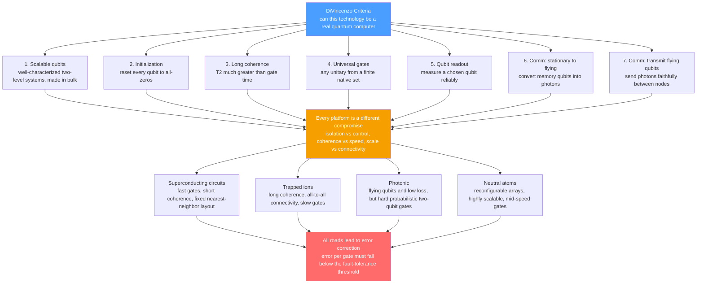

# 🧊 Physical Qubits and the DiVincenzo Criteria

> [!abstract] TL;DR
> On paper a qubit is a clean two-level system; in a lab it is a **fragile, noisy, imperfect quantum object** — a superconducting circuit, a trapped ion, a neutral atom, or a photon. The **DiVincenzo criteria** are the engineering checklist that any technology must satisfy to be a *usable* quantum computer: **(1)** a scalable set of well-characterized qubits, **(2)** the ability to **initialize** them to a known state, **(3)** **coherence** times long compared to gate times, **(4)** a **universal** set of gates, and **(5)** qubit-specific **measurement** — plus two extra criteria for quantum *communication* (interconverting stationary and flying qubits, and faithfully transmitting flying qubits). Every hardware platform is a **different compromise** on this list, driven by one central tension: a qubit must be *isolated* from the world to stay coherent, yet *strongly coupled* to it to be controlled and read out. There is no clear winner yet — only different trade-offs, all of which must eventually push error rates **below the fault-tolerance threshold** to scale.

---

## Intuition

**Analogy — a good qubit is like an ideal spinning coin.** Imagine you want a coin that can spin on a table encoding "heads-ish / tails-ish" superpositions. To be *useful* it must do five things at once: **(1)** you must be able to put down *many identical coins*, not just one lucky one; **(2)** you must be able to *set them all to heads* before you start; **(3)** each coin must **spin cleanly for a long time** without wobbling to a stop; **(4)** you must be able to **flick and nudge** it precisely into any orientation you want; and **(5)** you must be able to **read** which way it finally lands without disturbing its neighbors. A coin that spins forever but that you can't touch is useless; a coin you can flick perfectly but that stops spinning instantly is also useless. The **DiVincenzo criteria** are exactly this checklist, made rigorous for quantum hardware.

The cruel catch — the reason this is hard and not solved — is that the very thing that lets a coin spin undisturbed (isolation from bumps and drafts) is the *opposite* of what lets you flick it and read it (physical contact). A real qubit lives on the knife-edge between **too isolated to control** and **too connected to stay quantum**. Every platform — superconducting, ion, atom, photon — is a different bargain struck on that knife-edge.

---

## How It Works

### From the abstract circuit to physical reality

In the [[Quantum_Gates_and_Circuits|circuit model]] a qubit is a perfect point on the [[Qubits_and_the_Bloch_Sphere|Bloch sphere]] and a gate is an exact unitary. Physically, that point drifts, the unitary is approximate, and the environment is constantly "measuring" the qubit without permission — a process called **decoherence**. The DiVincenzo criteria are David DiVincenzo's 2000 formalization of exactly what a lab must deliver to close the gap between the clean abstraction and the messy device.

### The five computing criteria

1. **A scalable system of well-characterized qubits.** You need a genuine **two-level system** — a pair of quantum states you can cleanly label $\lvert 0\rangle$ and $\lvert 1\rangle$ — whose Hamiltonian, energy gap, and couplings are *known and reproducible*, and which you can manufacture in **large, identical numbers**. "Well-characterized" rules out using two levels that leak into a third state; "scalable" rules out heroic one-off devices.

2. **The ability to initialize to a known state.** Before a computation you must **reset** every qubit to a fiducial state, typically $\lvert 00\ldots0\rangle$. This is harder than it sounds: it requires either cooling the system to its ground state or actively measuring-and-flipping. Fast, high-fidelity reset is also what feeds fresh ancilla qubits to error correction.

3. **Long coherence times relative to gate times.** The qubit must stay quantum *long enough to compute*. The figures of merit are the relaxation time $T_1$ (how long $\lvert 1\rangle$ survives before decaying to $\lvert 0\rangle$) and the dephasing time $T_2$ (how long a superposition keeps its relative phase). What matters is not $T_2$ alone but the **ratio** $T_2 / t_\text{gate}$ — roughly *how many operations you can do before the state turns to noise*. This criterion is the deep link to **decoherence and quantum noise**.

4. **A universal set of quantum gates.** You must be able to perform *any* computation, which — as in [[Quantum_Gates_and_Circuits|quantum gates and circuits]] — reduces to implementing a small **universal set** (e.g. arbitrary single-qubit rotations plus one entangling two-qubit gate such as CNOT or CZ). The two-qubit gate is almost always the hard, low-fidelity, rate-limiting operation.

5. **A qubit-specific measurement capability.** You must be able to **read out** the state of a *chosen* qubit reliably, as governed by [[Measurement_and_the_No_Cloning_Theorem|measurement and the no-cloning theorem]]. Readout (and initialization) errors are lumped together as **SPAM** (State Preparation And Measurement) error, a floor that limits every experiment.

### The two communication criteria

DiVincenzo added two more requirements for **quantum networks** and distributed computing:

6. **Interconvert stationary and flying qubits.** A memory qubit (an ion, an atom) must be able to transfer its state onto a **flying qubit** (a photon) and back — the matter-light interface.

7. **Faithfully transmit flying qubits.** Those photons must travel between nodes with their quantum state intact. Together, criteria 6–7 underpin **the quantum internet** and rely on primitives like [[Quantum_Teleportation|quantum teleportation]] and entanglement distribution (see also [[Quantum_Key_Distribution_and_BB84|QKD/BB84]]).

### The central tensions

- **Isolation vs control.** Perfect isolation maximizes coherence (criterion 3) but forbids gates and readout (criteria 4–5). Every platform deliberately *breaks* isolation just enough to compute.
- **Coherence vs gate speed/fidelity.** Long-lived qubits (ions, atoms) tend to have **slow** gates; fast-gate qubits (superconducting) tend to be **short-lived**. The product/ratio $T_2/t_\text{gate}$ is the honest comparison.
- **Scalability vs connectivity.** Densely wired, all-to-all connected qubits (ions) are hard to scale to thousands; easily-tiled qubits (superconducting, atoms) have limited **connectivity**, forcing costly SWAP routing.

### Flow / Architecture



---

## Key Concepts

### Secondary (intuition-level)
- **Paper qubit vs real qubit:** on paper a qubit is a perfect switch that is exactly heads, tails, or a clean blend; a real qubit is a fragile spinning object that wobbles, decays, and is never quite perfect.
- **The five-item checklist:** make many identical qubits, set them to a known start, keep them spinning long enough, flick them precisely, and read them without disturbing the rest.
- **The core dilemma:** a qubit must be *shielded* from the world to stay quantum but *poked* by the world to be controlled — you cannot fully have both.
- **No winner yet:** superconducting chips, trapped ions, atoms, and photons are four different bargains; each is good at some checklist items and bad at others.

### Undergraduate (formal)
- **Two-level system:** the qubit is the lowest two eigenstates of a controllable Hamiltonian; higher levels (a "leakage" state) must be far enough in energy to ignore.
- **$T_1$ and $T_2$:** $T_1$ is energy relaxation ($\lvert 1\rangle \to \lvert 0\rangle$); $T_2 \le 2T_1$ is dephasing (loss of relative phase). Decoherence is the Bloch vector shrinking toward the center.
- **Gate error and fidelity:** average gate fidelity $F$ and error per gate $\varepsilon = 1 - F$; two-qubit gates dominate the error budget. Benchmarked by **randomized benchmarking**.
- **Figure of merit $N \sim T_2 / t_\text{gate}$:** the approximate number of coherent operations before the state decoheres — the single number that captures criterion 3 against criterion 4.
- **SPAM error:** combined state-preparation (criterion 2) and measurement (criterion 5) error; sets a noise floor independent of gate quality.
- **Connectivity graph:** which qubit pairs can be directly entangled; low connectivity forces SWAP insertion and inflates effective circuit depth.

### Graduate (rigorous / systems-level)
- **Quantum Volume and CLOPS:** IBM's **quantum volume** $= 2^{\,d}$ for the largest square circuit of width and depth $d$ that runs above a heavy-output threshold — a holistic metric folding qubit count, connectivity, gate error, and crosstalk into one number; **CLOPS** measures speed (circuit layer operations per second).
- **Below-threshold operation:** the **threshold theorem** guarantees arbitrarily long computation *iff* physical error per gate is below a code-dependent threshold (surface code $\approx 10^{-2}$); scaling is meaningless above it — this is where all platforms ultimately compete (**fault tolerance and the threshold theorem**).
- **Logical vs physical qubits:** a single fault-tolerant **logical** qubit may cost $10^3$–$10^4$ noisy **physical** qubits; "qubit count" headlines are physical qubits, not computational ones.
- **Crosstalk and correlated noise:** real devices violate the independent-error assumption via spectator errors, leakage, and $ZZ$ coupling — these degrade quantum volume faster than single-gate error alone predicts.
- **Coherent vs incoherent error:** systematic (unitary) miscalibration adds *coherently* (error $\propto \theta$) while stochastic noise adds *incoherently* (error $\propto \theta^2$); the distinction changes how errors accumulate over depth.
- **Matter-photon interface efficiency:** criteria 6–7 hinge on collection efficiency, indistinguishability, and entanglement-generation rate — the bottlenecks for networked and modular architectures.

---

## Python Demo

```python
# Physical-qubit "platform scorecard" with numpy + matplotlib ONLY.
#
# Part A: represent each hardware platform by quantitative DiVincenzo-relevant
#         metrics (coherence T2, two-qubit gate fidelity, gate speed,
#         connectivity, qubit count) and compare them on a radar chart.
# Part B: model the core tension between GATE SPEED and COHERENCE via the
#         figure of merit  N ~ T2 / gate_time  (coherent operations before
#         decoherence) and show where each platform sits on that frontier.
#
# Numbers are representative order-of-magnitude values for illustration, not
# vendor specs. No qiskit / no external quantum libraries.

import numpy as np
import matplotlib.pyplot as plt

# --- Representative platform metrics --------------------------------------
# T2        : coherence time (seconds)
# fid2q     : two-qubit gate fidelity (0..1)
# gate_time : two-qubit gate duration (seconds)
# conn      : connectivity score on a 1..10 scale (10 = all-to-all)
# nqubits   : approximate physical qubit count
platforms = {
    "Superconducting": dict(T2=1e-4, fid2q=0.995, gate_time=3e-8, conn=3,  nqubits=1121),
    "Trapped ion":     dict(T2=1.0,  fid2q=0.998, gate_time=1e-4, conn=10, nqubits=56),
    "Photonic":        dict(T2=1e-3, fid2q=0.900, gate_time=1e-9, conn=6,  nqubits=216),
    "Neutral atom":    dict(T2=1.5,  fid2q=0.995, gate_time=4e-7, conn=8,  nqubits=1180),
}
names = list(platforms.keys())
colors = plt.cm.tab10(np.linspace(0, 1, len(names)))

# --- Build a "higher is better" feature vector per platform ---------------
def features(p):
    return np.array([
        np.log10(p["T2"]),               # coherence      (criterion 3)
        -np.log10(1.0 - p["fid2q"]),     # gate quality   (criterion 4), -log10(error)
        np.log10(1.0 / p["gate_time"]),  # gate speed     (criterion 4)
        p["conn"],                       # connectivity   (routing cost)
        np.log10(p["nqubits"]),          # scalable count (criterion 1)
    ], dtype=float)

axis_labels = ["Coherence\n(log T2)", "Gate quality\n(-log err)",
               "Gate speed\n(log 1/t)", "Connectivity", "Qubit count\n(log N)"]

raw = np.array([features(platforms[n]) for n in names])   # (4 platforms, 5 axes)
lo, hi = raw.min(axis=0), raw.max(axis=0)
norm = (raw - lo) / (hi - lo + 1e-12)                     # min-max to 0..1 per axis

# --- Figure with two panels ----------------------------------------------
fig = plt.figure(figsize=(13, 5.6))

# Panel A: radar / spider chart -------------------------------------------
ax1 = fig.add_subplot(1, 2, 1, projection="polar")
angles = np.linspace(0, 2 * np.pi, len(axis_labels), endpoint=False)
angles = np.concatenate([angles, angles[:1]])            # close the loop
for i, n in enumerate(names):
    vals = np.concatenate([norm[i], norm[i][:1]])
    ax1.plot(angles, vals, color=colors[i], lw=2, label=n)
    ax1.fill(angles, vals, color=colors[i], alpha=0.10)
ax1.set_xticks(angles[:-1])
ax1.set_xticklabels(axis_labels, fontsize=8)
ax1.set_yticks([0.25, 0.5, 0.75, 1.0])
ax1.set_yticklabels([])
ax1.set_title("Platform scorecard: normalized DiVincenzo axes", fontsize=10, pad=20)
ax1.legend(loc="upper right", bbox_to_anchor=(1.28, 1.12), fontsize=8)

# Panel B: gate-speed vs coherence frontier -------------------------------
ax2 = fig.add_subplot(1, 2, 2)
gt = np.array([platforms[n]["gate_time"] for n in names])
t2 = np.array([platforms[n]["T2"] for n in names])
nops = t2 / gt                                            # ops before decoherence

# iso-lines of constant N = T2 / gate_time  (straight lines on a log-log plot)
gt_line = np.logspace(-9.5, -3.5, 100)
for N in [1e3, 1e4, 1e5, 1e6, 1e7]:
    ax2.plot(gt_line, N * gt_line, color="gray", ls="--", lw=0.7)
    ax2.text(gt_line[8], N * gt_line[8] * 1.4, f"N={N:.0e}", fontsize=7, color="gray")

for i, n in enumerate(names):
    ax2.scatter(gt[i], t2[i], s=110, color=colors[i], zorder=5, edgecolor="k", lw=0.5)
    ax2.annotate(f"{n}\nN~{nops[i]:.0e}", (gt[i], t2[i]),
                 textcoords="offset points", xytext=(9, 7), fontsize=8)

ax2.set_xscale("log"); ax2.set_yscale("log")
ax2.set_xlabel("two-qubit gate time (s)      faster  <--")
ax2.set_ylabel("coherence T2 (s)      -->  longer-lived")
ax2.set_title("Gate-speed vs coherence frontier\nN ~ T2 / gate_time = coherent ops before decoherence",
              fontsize=10)
ax2.grid(True, which="both", alpha=0.15)

plt.tight_layout()
plt.savefig("qubit_platform_scorecard.png", dpi=130)
print("Saved qubit_platform_scorecard.png")

# --- Print the figure of merit -------------------------------------------
print("\nFigure of merit  N = T2 / gate_time  (coherent ops before decoherence):")
order = np.argsort(-nops)
for i in order:
    print(f"  {names[i]:16s}: T2={t2[i]:.1e}s  gate={gt[i]:.1e}s  ->  N ~ {nops[i]:,.0f}")

# Takeaways:
#   * Superconducting wins on RAW SPEED (30 ns gates) but its short T2 caps N.
#   * Trapped ions have enormous T2 but slow gates -- long life, few ops/second.
#   * Neutral atoms and photonics sit high on N but pay elsewhere (gate fidelity,
#     probabilistic entangling gates) -- the radar shows no platform fills all axes.
#   * There is no single "best" point: each platform is a different DiVincenzo
#     compromise, which is exactly why the hardware race is still open.
```

Running it saves a two-panel figure (a radar chart where **no single platform covers all five axes**, and a log-log frontier where each platform sits on a different iso-$N$ diagonal) and prints the figure-of-merit ranking. The lesson is visual: superconducting circuits dominate the *speed* axis, trapped ions dominate *coherence* and *connectivity*, and neutral atoms balance *scale* against *speed* — but every shape has a deep notch somewhere, which is the whole point of the DiVincenzo trade-off.

---

## Real-World Applications

> **Example — the DiVincenzo checklist as an industry scorecard.** Every major quantum-hardware roadmap is, explicitly or not, a report card against these criteria. **IBM** and **Google** build *superconducting transmons*: nanosecond microwave-driven gates (criterion 4) satisfy speed, but $T_2 \sim 100\,\mu s$ (criterion 3) forces enormous error-correction overhead, and their fixed heavy-hex lattice gives low connectivity. **IonQ** and **Quantinuum** trap *ytterbium/barium ions*: hyperfine qubits with second-to-minute coherence and **all-to-all** connectivity (criteria 1, 3) but gates that are orders of magnitude slower. **QuEra**, **Pasqal**, and **Atom Computing** array *neutral Rydberg atoms* by optical tweezers, reconfiguring connectivity on the fly and scaling past a thousand physical qubits. **Xanadu** and **PsiQuantum** pursue *photonics* — natural flying qubits (criteria 6–7) with tiny decoherence, at the price of *probabilistic* two-qubit gates that demand heavy multiplexing.

- **Benchmarking and procurement:** buyers compare devices by **quantum volume**, **CLOPS** (speed), two-qubit **error per gate**, and SPAM error rather than raw qubit count — a direct operationalization of criteria 3–5.
- **Error-correction planning:** because a logical qubit costs $10^3$–$10^4$ physical qubits, roadmaps quote *when* a platform crosses **below the fault-tolerance threshold**, not just how many physical qubits it has.
- **Modular / networked quantum computing:** criteria 6–7 drive photonic interconnects between ion or atom modules (e.g. distributed **quantum internet** testbeds), using entanglement distribution and [[Quantum_Teleportation|teleportation]] to link nodes.
- **Application matching:** deep-but-narrow circuits (e.g. [[Quantum_Simulation_and_VQE|VQE]] chemistry) favor high-fidelity, well-connected ions; wide shallow circuits favor fast, numerous superconducting or atom qubits — the platform choice follows the DiVincenzo profile of the workload.

---

## Common Pitfalls

- **Counting physical qubits as if they were computational qubits.** A "1000-qubit" chip may implement *zero* fault-tolerant logical qubits. The headline number is physical; useful computation needs error-corrected logical qubits costing thousands of physical ones each.
- **Optimizing coherence in isolation.** Chasing record $T_2$ while ignoring gate speed or fidelity is meaningless — criterion 3 is a *ratio* $T_2/t_\text{gate}$, not an absolute. A qubit that lives forever but can't be quickly gated does little useful work.
- **Assuming $T_1 = T_2$.** They are different mechanisms: $T_1$ is energy loss, $T_2 \le 2T_1$ is phase loss. Dephasing usually dominates and is what actually limits algorithm depth.
- **Forgetting connectivity overhead.** Abstract circuit depth is a lower bound. On low-connectivity hardware, entangling distant qubits injects SWAP chains that multiply depth and error — a well-connected slower device can beat a fast poorly-connected one.
- **Ignoring SPAM error.** Even with perfect gates, faulty initialization (criterion 2) and readout (criterion 5) impose a noise floor. Reported "gate fidelities" sometimes hide SPAM; always ask how state prep and measurement were calibrated.
- **Conflating coherent and incoherent error.** Systematic miscalibration (a slightly-off rotation angle) accumulates *coherently* and can be far worse over depth than the same magnitude of random noise; benchmarks that report only average error can mislead.
- **Believing one platform has already won.** As of today no technology dominates all five criteria. Declaring a winner ignores that each is a distinct compromise, and that the decisive question — who crosses below threshold at scale — is still open.

---

## Related Concepts

- [[Qubits_and_the_Bloch_Sphere]] — the idealized two-level system that a physical qubit must approximate; $T_1$/$T_2$ decoherence is literally the Bloch vector shrinking toward the center.
- [[Quantum_Gates_and_Circuits]] — criterion 4 (a universal gate set); the abstract unitary circuit that hardware must realize with real, imperfect, native gates.
- [[Measurement_and_the_No_Cloning_Theorem]] — criterion 5 (qubit-specific readout) and why you cannot copy a qubit to protect it, which forces active error correction instead.
- [[Entanglement_and_Bell_States]] — the resource that two-qubit gates create and that the communication criteria (6–7) distribute across a network.
- [[Linear_Algebra_for_Quantum_Computing]] — the Hilbert-space, unitary, and density-matrix formalism underlying gate fidelity, coherence, and mixed (noisy) states.
- [[Quantum_Computing_Overview]] — the section-level map of quantum computing into which this hardware overview fits.
- [[Quantum_Teleportation]] — a primitive for the stationary-to-flying interface (criteria 6–7) and for wiring together modular quantum processors.
- [[Quantum_Key_Distribution_and_BB84]] — a communication application that depends on faithfully transmitting flying (photonic) qubits.
- [[Quantum_Simulation_and_VQE]] — a near-term workload whose depth-vs-width profile determines which DiVincenzo trade-off (connectivity vs speed) matters most.

> Sibling notes planned for this hardware section and cross-linked once written: **Decoherence and Quantum Noise** (criterion 3, $T_1/T_2$), **Superconducting Qubits** (fast gates, short coherence), **Trapped-Ion Quantum Computers** (long coherence, all-to-all), **Photonic Quantum Computing** (flying qubits, hard two-qubit gates), **Neutral Atoms and Topological Qubits** (reconfigurable, scalable), **Building and Scaling Quantum Computers** (quantum volume, benchmarks), **Fault Tolerance and the Threshold Theorem** (error-per-gate below threshold), and **The Quantum Internet** (communication criteria 6–7).

---

## Review Questions

**Secondary**
1. Using the spinning-coin analogy, name the five things a good qubit must be able to do, and explain the single core tension that makes satisfying all five at once so hard.

**Undergraduate**
2. A superconducting qubit has $T_2 = 100\,\mu s$ and a two-qubit gate time of $40\,\text{ns}$; a trapped ion has $T_2 = 1\,\text{s}$ and a gate time of $100\,\mu s$. Compute the figure of merit $N \approx T_2 / t_\text{gate}$ for each. Which platform can perform more operations before decohering, and why is raw coherence time alone a misleading way to compare them?

**Graduate**
3. A vendor advertises a 1000-physical-qubit processor with two-qubit error per gate of $2\times10^{-2}$. Given a surface-code threshold near $1\times10^{-2}$ and a logical-to-physical overhead of roughly $10^3$–$10^4$, assess whether this device can run a large fault-tolerant algorithm. Reference the threshold theorem, the distinction between physical and logical qubits, and how connectivity and SPAM error would further affect your judgment.

---

## Sources

- DiVincenzo, D. P. "The Physical Implementation of Quantum Computation." *Fortschritte der Physik* 48, 771–783 (2000). [arXiv:quant-ph/0002077](https://arxiv.org/abs/quant-ph/0002077) — the original five-plus-two criteria.
- Ladd, T. D., Jelezko, F., Laflamme, R., Nakamura, Y., Monroe, C., O'Brien, J. L. "Quantum Computers." *Nature* 464, 45–53 (2010). [doi:10.1038/nature08812](https://doi.org/10.1038/nature08812) — cross-platform survey against the criteria.
- Preskill, J. "Quantum Computing in the NISQ Era and Beyond." *Quantum* 2, 79 (2018). [arXiv:1801.00862](https://arxiv.org/abs/1801.00862) — error rates, depth, and the road to fault tolerance.
- Nielsen, M. A. & Chuang, I. L. *Quantum Computation and Quantum Information* (Cambridge, 2010), Chapter 7 "Quantum computers: physical realization." [doi:10.1017/CBO9780511976667](https://doi.org/10.1017/CBO9780511976667)
- Kjaergaard, M. et al. "Superconducting Qubits: Current State of Play." *Annual Review of Condensed Matter Physics* 11, 369–395 (2020). [arXiv:1905.13641](https://arxiv.org/abs/1905.13641) — coherence, gate speed, and benchmarking in practice.

---

#quantum-computing #physical-qubits #divincenzo-criteria #quantum-hardware #qubit-platforms
