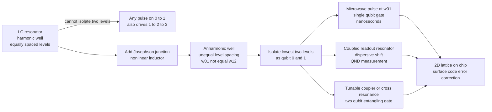

# 🧊 Superconducting Qubits

> [!abstract] TL;DR
> A **superconducting qubit** is a tiny electrical circuit — capacitor plus a **Josephson junction** — chilled to `~10–20 mK` in a dilution refrigerator until it superconducts and behaves as a single quantum object: an **artificial atom** on a chip. A plain LC circuit would be a **harmonic oscillator** with *equally spaced* energy levels, so no microwave drive could ever isolate just two of them. The Josephson junction adds **anharmonicity** (nonlinear inductance), so the `0→1` and `1→2` transitions have *different* frequencies and you can address a clean two-level system. The dominant design, the **transmon**, shunts the junction with a large capacitor to beat charge noise. Fast (nanosecond) gates, lithographic fabrication, and a natural 2D layout for the surface code make it the **most-scaled quantum platform today** — used by Google, IBM, and others — at the cost of short coherence and heavy cryogenics.

---

## Intuition

**Analogy — a hand-built atom on a chip.** Take an ordinary electrical circuit — a loop with a capacitor and an inductor — and make it *so cold* that the metal loses all resistance and current sloshes back and forth forever, without friction. At that point the circuit stops behaving like a classical wire and starts behaving like a **single quantum particle**: its energy can only take discrete, quantized values, exactly like the electron orbits of a real atom. You have grown an **artificial atom** out of wires and printed it with the same lithography that stamps out computer chips.

But there is a catch. A perfectly ordinary cold LC circuit is a **quantum harmonic oscillator** (see [[Quantum_Harmonic_Oscillator]]), and its energy levels form a ladder with **perfectly even rungs**. If you want to use the bottom two rungs as your qubit `|0⟩` and `|1⟩`, you are stuck: any microwave pulse tuned to lift the system from rung `0` to rung `1` is *equally* in tune to push it from `1` to `2`, then `2` to `3`. The oscillator leaks up the ladder and you never get a clean two-level system. The fix is to install one special, nonlinear component — the **Josephson junction** — which acts like a spring that gets *softer* the more you stretch it. That bends the ladder so the rungs are **unevenly spaced**, and now a pulse tuned to `0→1` is *off-key* for `1→2`. You have isolated a qubit.

---

## How It Works

### Core Mechanics

**1. Superconduct it, and the circuit becomes quantum.** Below a critical temperature the circuit's electrons bind into **Cooper pairs** that condense into one macroscopic wavefunction with zero resistance (see [[Superconductivity]]). Dissipation is what normally washes out quantum behaviour; remove it and the collective charge/flux of the whole circuit obeys the Schrödinger equation. This is why the chip lives at `~10–20 mK` in a **dilution refrigerator** — cold enough that thermal energy `kT` is far below the `~5 GHz` qubit transition, so the circuit sits in its ground state until *you* drive it.

**2. A plain LC circuit is a harmonic oscillator — and that is the problem.** Energy sloshes between the capacitor (electric field) and inductor (magnetic field). Quantum-mechanically this is the textbook harmonic oscillator with levels `Eₙ = ħω(n + ½)` — **evenly spaced by `ħω`**. Because every transition frequency is identical, no drive can address a two-level subspace without exciting the whole ladder. A harmonic circuit can store quantum information but cannot be *controlled* as a qubit.

**3. The Josephson junction supplies anharmonicity.** A Josephson junction is two superconductors separated by a thin insulator through which Cooper pairs tunnel. It behaves as a **nonlinear inductor** with energy `−E_J cos(φ)`, where `φ` is the superconducting phase difference. Expanding, `−E_J cos(φ) ≈ const + ½E_J φ² − (E_J/24) φ⁴ + …`: the quadratic term is an ordinary inductor, but the **quartic term bends the potential**, making the higher levels progressively *closer together*. Now `ω₀₁ ≠ ω₁₂` (typically `ω₁₂` is lower by the **anharmonicity** `α ≈ −E_C`), and a resonant pulse can isolate `{|0⟩, |1⟩}`.

**4. The transmon: trade anharmonicity for coherence.** The junction's cousin, the **Cooper-pair box**, is very anharmonic but agonizingly sensitive to stray charges (charge noise). The **transmon** shunts the junction with a **large capacitor**, pushing the ratio `E_J/E_C` up to `~30–100`. This exponentially suppresses charge-noise sensitivity — buying dramatically longer coherence — at the modest price of *reduced* anharmonicity (`|α|/ω₀₁ ≈ 3–5%`). That trade made the transmon the **workhorse of every major superconducting processor**. Its plasma frequency is `ħω_p = √(8 E_J E_C)` and anharmonicity `α ≈ −E_C`.

**5. Control — single- and two-qubit gates.** A **single-qubit gate** is a shaped **microwave pulse** at `ω₀₁` (a few GHz), a few *nanoseconds* long, rotating the Bloch vector (see [[Qubits_and_the_Bloch_Sphere]] and [[Quantum_Gates_and_Circuits]]); pulse shaping such as **DRAG** cancels the small residual leakage to `|2⟩`. **Two-qubit gates** entangle neighbours via **tunable couplers**, flux-tuned `|11⟩–|02⟩` avoided crossings (**CZ**), or the all-microwave **cross-resonance** gate used on fixed-frequency chips.

**6. Readout — dispersive measurement.** Each qubit is coupled to a **microwave resonator**. In the **dispersive regime** the resonator's frequency shifts by `±χ` depending on whether the qubit is `|0⟩` or `|1⟩`. Bouncing a probe tone off the resonator and measuring its phase reveals the qubit state *without directly touching it* — a quantum non-demolition measurement (see [[Measurement_and_the_No_Cloning_Theorem]]). A **Purcell filter** protects the qubit from decaying through this readout channel.

**7. Where it lands.** Superconducting qubits satisfy the **DiVincenzo criteria** — scalable well-defined qubits, initialization by cooling, universal gates, long-enough coherence, and qubit-specific readout — and their **fixed 2D nearest-neighbour lattice** pairs naturally with the **surface code** for error correction, the reason the platform is a leading candidate for fault tolerance.

### Flow / Architecture



---

## Key Concepts

### Secondary
- A superconducting qubit is a **tiny circuit made super-cold** so that it behaves like a single "artificial atom" with only certain allowed energies.
- We want to use its **two lowest energy levels** as the `0` and `1` of a qubit.
- A simple cold circuit has **evenly spaced** energy levels, which makes it impossible to pick out just two — a control pulse would push it past `1` to `2`, `3`, and so on.
- A special part called a **Josephson junction** makes the levels **unevenly spaced**, so a microwave pulse tuned to `0→1` cannot accidentally trigger `1→2`. Now you have a real qubit.
- You **write** to it with microwave pulses and **read** it by bouncing a weak signal off a little resonator attached to it.

### Undergraduate
- **Circuit quantization:** an LC circuit maps onto the quantum harmonic oscillator with levels `ħω(n+½)`. Charge and flux are conjugate variables like position and momentum.
- **Why harmonic fails:** equal level spacing means one drive frequency addresses *all* transitions — no isolable two-level subspace.
- **Josephson element:** inductive energy `−E_J cos(φ)`; the `φ⁴` term makes the oscillator **anharmonic**. The two competing energy scales are the **Josephson energy `E_J`** and the **charging energy `E_C = e²/2C`**.
- **Transmon regime:** `E_J/E_C ≫ 1` (`~30–100`). Plasma frequency `ħω_p = √(8 E_J E_C)`; anharmonicity `α = ω₁₂ − ω₀₁ ≈ −E_C`. Charge dispersion is exponentially suppressed → long coherence, at the cost of small `|α|`.
- **Gates and timescales:** single-qubit gates `~10–50 ns`; two-qubit gates `~tens–hundreds of ns`. Coherence times `T₁, T₂ ~ tens–hundreds of μs` (best devices approaching `~1 ms`). Gate error is bounded by the ratio of gate time to coherence time.
- **Dispersive readout:** qubit–resonator coupling gives a state-dependent frequency pull `±χ`; measuring the resonator infers the qubit non-destructively.

### Graduate
- **Transmon Hamiltonian:** `H = 4 E_C (n − n_g)² − E_J cos(φ̂)`, with `[φ̂, n̂] = i`. In the transmon limit the low levels approximate a **Duffing/Kerr oscillator**: `H ≈ ħω_p a†a − (E_C/2) a†a†a a`. The **charge dispersion** (sensitivity of `Eₙ` to the offset charge `n_g`) falls off as `~e^{−√(8 E_J/E_C)}`, the mathematical heart of the transmon's noise immunity.
- **Circuit QED:** a transmon coupled to a resonator realizes the **Jaynes–Cummings** model. In the dispersive limit `|Δ| ≫ g`, `χ = g²α / [Δ(Δ+α)]`; readout SNR and measurement-induced dephasing both scale with photon number.
- **Two-qubit gate physics:** the **CZ** exploits the `|11⟩–|02⟩` avoided crossing tuned via flux; the **cross-resonance** gate drives qubit A at qubit B's frequency to synthesize `ZX`. **Tunable couplers** turn the effective `J` on and off to suppress residual `ZZ` and idle crosstalk.
- **Decoherence channels:** energy relaxation `T₁` from **two-level-system (TLS) defects** in oxides and interfaces, quasiparticle poisoning, and Purcell decay; dephasing `T₂` from flux/charge/photon-shot noise (see [[Decoherence_and_Quantum_Noise]]). Materials engineering (tantalum, clean interfaces, 3D integration) is where much coherence progress now comes from.
- **Error correction:** the planar 2D lattice hosts the **surface code**; recent **below-threshold** demonstrations show the logical error rate *falling* as the code distance grows — the first experimental evidence that scaling error correction on this platform can work (see [[Quantum_Error_Correction_Principles]]).

---

## Python Demo

```python
"""
Superconducting qubits: WHY anharmonicity is essential.

A pure LC circuit is a quantum HARMONIC oscillator -> EQUALLY spaced levels,
so a pulse resonant with 0->1 is ALSO resonant with 1->2, 2->3, ... You can
never isolate a clean two-level qubit.

A Josephson junction turns the potential into a COSINE well (transmon-like)
-> ANHARMONIC, so 0->1 and 1->2 differ in frequency. A pulse resonant with
0->1 is off-resonant for 1->2, trapping population in {|0>, |1>}: a real qubit.

numpy + matplotlib only.
"""

import numpy as np
import matplotlib.pyplot as plt

# ---------------------------------------------------------------------------
# 1. Finite-difference solver for  H = -kin * d^2/dphi^2 + V(phi)  (Dirichlet)
# ---------------------------------------------------------------------------
def solve(V, phi, kin):
    dphi = phi[1] - phi[0]
    N = phi.size
    diag = 2.0 * kin / dphi**2 + V
    offd = -kin / dphi**2 * np.ones(N - 1)
    H = np.diag(diag) + np.diag(offd, 1) + np.diag(offd, -1)
    E, _ = np.linalg.eigh(H)
    return E

# transmon-scale parameters (units of E_C); anharmonicity mildly exaggerated
E_C = 0.5                     # charging energy
E_J = 13.0                    # Josephson energy (E_J/E_C ~ 26)
kin = 4.0 * E_C               # kinetic prefactor: H = 4 E_C n^2 - E_J cos(phi)

phi = np.linspace(-np.pi, np.pi, 1201)
V_harm = 0.5 * E_J * phi**2           # LC oscillator: parabola  (equal spacing)
V_tran = E_J * (1.0 - np.cos(phi))    # transmon: cosine well    (anharmonic)

Eh = solve(V_harm, phi, kin); Eh -= Eh[0]   # reference to ground state
Et = solve(V_tran, phi, kin); Et -= Et[0]

print("Harmonic (LC) spacings:", np.round(np.diff(Eh[:4]), 3))
print("Transmon      spacings:", np.round(np.diff(Et[:4]), 3))
w01, w12 = Et[1] - Et[0], Et[2] - Et[1]
print(f"Transmon w01={w01:.3f}  w12={w12:.3f}  anharmonicity={w12 - w01:+.3f}")

# ---------------------------------------------------------------------------
# 2. Plot the two potential wells with their energy ladders
# ---------------------------------------------------------------------------
def turning(V, x, E):                 # interval where V <= E (to draw a level)
    idx = np.where(V <= E)[0]
    return x[idx[0]], x[idx[-1]]

fig, axes = plt.subplots(1, 2, figsize=(12, 5), sharey=True)
panels = [(axes[0], V_harm, Eh, "LC oscillator (harmonic)\nEQUAL spacing: cannot isolate a qubit"),
          (axes[1], V_tran, Et, "Transmon (Josephson junction)\nUNEQUAL spacing: isolate |0>,|1>")]
for ax, V, E, title in panels:
    ax.plot(phi, V, "k", lw=2)
    for n in range(4):
        if E[n] > V.max():
            continue
        l, r = turning(V, phi, E[n])
        c = "crimson" if n < 2 else "0.5"
        ax.hlines(E[n], l, r, color=c, lw=2)
        ax.text(r + 0.12, E[n], f"|{n}>", va="center", color=c)
    ax.set_xlabel(r"phase  $\varphi$"); ax.set_title(title)
    ax.set_ylim(-1, Et[3] + 4)
axes[0].set_ylabel("energy")
fig.suptitle("Why a Josephson junction is essential: anharmonicity")
fig.tight_layout()

# ---------------------------------------------------------------------------
# 3. Driven-transition (Rabi) simulation, 3-level model
#    Harmonic ladder leaks 0->1->2;  anharmonic transmon stays in {0,1}.
# ---------------------------------------------------------------------------
g01, g12 = 1.0, np.sqrt(2.0)                       # ladder coupling elements
drive = np.array([[0, g01, 0],
                  [g01, 0, g12],
                  [0, g12, 0]], dtype=complex)

def run(levels, w_drive, Omega, T, dt):
    H0 = np.diag(levels).astype(complex)
    steps = int(T / dt)
    psi = np.array([1, 0, 0], dtype=complex)        # start in |0>
    ts = np.empty(steps); pops = np.empty((steps, 3))
    Hf = lambda tt: H0 + Omega * np.cos(w_drive * tt) * drive
    for k in range(steps):                          # RK4 for i d/dt psi = H psi
        t = k * dt
        k1 = -1j * Hf(t) @ psi
        k2 = -1j * Hf(t + dt/2) @ (psi + dt/2 * k1)
        k3 = -1j * Hf(t + dt/2) @ (psi + dt/2 * k2)
        k4 = -1j * Hf(t + dt) @ (psi + dt * k3)
        psi = psi + dt/6 * (k1 + 2*k2 + 2*k3 + k4)
        ts[k], pops[k] = t, np.abs(psi)**2
    return ts, pops

Omega, T, dt = 0.15, 180.0, 0.02
t_a, p_anh = run([0.0, w01, w01 + w12], w01, Omega, T, dt)   # unequal spacing
t_h, p_har = run([0.0, w01, 2.0 * w01], w01, Omega, T, dt)   # forced equal spacing

fig2, ax = plt.subplots(1, 2, figsize=(12, 4.5), sharey=True)
for a, t, p, title in [(ax[0], t_h, p_har, "Harmonic ladder\ndrive climbs 0->1->2 (no qubit)"),
                       (ax[1], t_a, p_anh, "Anharmonic transmon\ntrapped in {0,1} (qubit!)")]:
    a.plot(t, p[:, 0], label="P(|0>)")
    a.plot(t, p[:, 1], label="P(|1>)")
    a.plot(t, p[:, 2], label="P(|2>) leakage")
    a.set_xlabel("time"); a.set_title(title); a.legend(loc="upper right")
ax[0].set_ylabel("population")
fig2.suptitle("Same resonant pulse; anharmonicity isolates the qubit subspace")
fig2.tight_layout()
plt.show()
```

Running it prints roughly equal spacings for the LC ladder but **shrinking** spacings for the transmon (`w12 < w01`), and the Rabi panels show the punchline: with equal spacing the population *climbs the ladder* into `|2⟩`, whereas the anharmonic transmon keeps population sloshing cleanly between `|0⟩` and `|1⟩` — a controllable qubit.

---

## Real-World Applications

> **Example — Google's Sycamore / Willow.** Google's processors are grids of **transmons** with **tunable couplers**, operated at `~10 mK`. The 2019 **Sycamore** experiment (53 qubits) ran a random-circuit-sampling task claimed to be classically intractable — the first *quantum supremacy* demonstration on this hardware. The 2023–2024 **surface-code** results on the successor chip showed the logical error rate *decreasing* as code distance grew from 3 to 5 to 7 — a **below-threshold** milestone that this note's anharmonic, fast-gate, 2D-lattice architecture makes possible.

> **Example — IBM Quantum.** IBM's fixed-frequency transmons use the all-microwave **cross-resonance** gate (no flux lines to add flux noise) and publish a public roadmap of ever-larger processors (Eagle, Osprey, Condor, and modular "Heron"-class chips linked by couplers). Their cloud service lets anyone run circuits on real superconducting hardware, and their heavy-hex lattice is chosen to reduce frequency collisions and crosstalk.

> **Example — cloud NISQ workloads.** Variational algorithms such as VQE and QAOA (see [[Quantum_Simulation_and_VQE]]) are run today almost entirely on superconducting backends precisely because their **nanosecond gates** let you fit many operations inside the short coherence window before decoherence dominates.

---

## Common Pitfalls

- **"Just use the two lowest levels of any oscillator."** Without anharmonicity, a resonant `0→1` pulse *equally* drives `1→2`; population leaks up the ladder and there is no qubit. The Josephson junction exists precisely to break the even spacing — this is the whole reason the platform works.
- **Forgetting the third level.** A transmon is not really a two-level system; the small anharmonicity (`~3–5%`) means fast, hard pulses **leak** into `|2⟩`. Real control uses **pulse shaping (DRAG)** and moderate speeds to suppress leakage — going too fast trades gate time for leakage error.
- **Confusing more anharmonicity with a better qubit.** The Cooper-pair box is *more* anharmonic than the transmon but far *worse* in coherence because it is charge-noise-sensitive. The transmon deliberately **sacrifices anharmonicity** (large `E_J/E_C`) to win coherence — the opposite of the naive intuition.
- **Underestimating cryogenics and wiring.** Every qubit needs microwave control and readout lines threading multiple fridge stages. **Wiring, heat load, and yield** — not just the qubit physics — are the practical scaling bottlenecks; this is central to *building and scaling quantum computers*.
- **Assuming qubits are identical.** Fabrication variability spreads junction resistances, so frequencies scatter. Nearby qubits with colliding frequencies suffer **crosstalk**; frequency allocation and lattice choice (e.g. heavy-hex) are engineering responses to this non-uniformity.
- **Ignoring measurement back-action.** Dispersive readout is quantum non-demolition only in the right regime; too many probe photons cause **measurement-induced dephasing** and can excite the qubit out of its computational subspace.

---

## Related Concepts

- [[Quantum_Gates_and_Circuits]] — the abstract unitary gates that microwave pulses and tunable couplers physically implement on a transmon chip.
- [[Qubits_and_the_Bloch_Sphere]] — a single-qubit gate is a Bloch-sphere rotation; a shaped microwave pulse is how a transmon performs one.
- [[Decoherence_and_Quantum_Noise]] — `T₁`/`T₂`, TLS defects, and dephasing set the coherence budget that superconducting qubits are always racing against.
- [[Quantum_Error_Correction_Principles]] — the surface code that the 2D transmon lattice is built to host; below-threshold demonstrations run on this hardware.
- [[Superconductivity]] — the Cooper-pairing and Josephson-effect physics that make the circuit lossless and quantum in the first place.
- [[Quantum_Harmonic_Oscillator]] — the equally spaced LC ladder whose degeneracy the Josephson junction must break to create a usable qubit.
- [[Quantum_Simulation_and_VQE]] — the NISQ workloads run today largely on superconducting backends because of their fast gates.
- [[Quantum_Computing_Overview]] — where superconducting qubits sit among competing physical platforms (ions, photons, neutral atoms).

*Forthcoming sibling notes to cross-link once created:* Physical_Qubits_and_the_DiVincenzo_Criteria, Building_and_Scaling_Quantum_Computers, Stabilizer_Codes_and_the_Surface_Code, Quantum_Supremacy_and_Advantage, Fault_Tolerance_and_the_Threshold_Theorem.

---

## Review Questions

1. **(Secondary)** A cold LC circuit already has quantized, discrete energy levels — so why can't we simply use its bottom two levels as a qubit? What does the Josephson junction change?
2. **(Undergraduate)** The transmon is engineered with `E_J/E_C` large (`~30–100`). What does this ratio buy, and what does it cost? Explain in terms of charge-noise sensitivity and anharmonicity, and why the trade is worth it.
3. **(Graduate)** You are given a fixed-frequency transmon with anharmonicity `α ≈ −300 MHz` and want a `10 ns` single-qubit gate. Estimate the leakage risk to `|2⟩`, name one mitigation (and the mechanism it exploits), and explain how the same 2D-lattice architecture that constrains connectivity is precisely what makes surface-code error correction natural on this platform.

---

## Sources

- Koch, J. et al. (2007). "Charge-insensitive qubit design derived from the Cooper pair box." *Physical Review A* 76, 042319. [arXiv:cond-mat/0703002](https://arxiv.org/abs/cond-mat/0703002)
- Krantz, P. et al. (2019). "A quantum engineer's guide to superconducting qubits." *Applied Physics Reviews* 6, 021318. [arXiv:1904.06560](https://arxiv.org/abs/1904.06560)
- Blais, A. et al. (2021). "Circuit quantum electrodynamics." *Reviews of Modern Physics* 93, 025005. [arXiv:2005.12667](https://arxiv.org/abs/2005.12667)
- Arute, F. et al. (2019). "Quantum supremacy using a programmable superconducting processor." *Nature* 574, 505. [doi:10.1038/s41586-019-1666-5](https://www.nature.com/articles/s41586-019-1666-5)
- Google Quantum AI (2023). "Suppressing quantum errors by scaling a surface code logical qubit." *Nature* 614, 676. [doi:10.1038/s41586-022-05434-1](https://www.nature.com/articles/s41586-022-05434-1)

---

#quantum-computing #superconducting-qubits #transmon #josephson-junction #quantum-hardware
