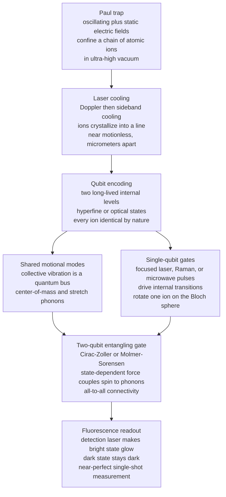

# ⚛️ Trapped Ion Quantum Computers

> [!abstract] TL;DR
> A **trapped-ion quantum computer** confines individual **charged atoms** — typically **ytterbium** or **calcium** ions — in ultra-high vacuum using oscillating and static electric fields inside a **Paul trap**, laser-cooling them into a stationary crystal that hangs in space like beads on an invisible string. The **qubit** is stored in two exceptionally long-lived internal atomic levels (often **hyperfine** ground states), giving **coherence times of seconds** and **near-perfect readout** via state-dependent fluorescence. **Single-qubit gates** are driven by focused lasers or microwaves; the signature move is a **two-qubit gate mediated by the ions' shared vibrational (phonon) modes** — the **Cirac–Zoller** and **Mølmer–Sørensen** schemes — which grants **all-to-all connectivity** so *any* ion can directly entangle with *any* other. Trapped ions hold the **highest gate fidelities and longest coherence times of any platform** and lead in small fault-tolerance and logical-qubit demos (Quantinuum, IonQ, academic groups), at the cost of **slow gates** (microseconds to milliseconds) and hard **scaling** beyond a few dozen ions per chain — driving the **QCCD** shuttling architecture and **photonic interconnects** as the road to scale. They are the leading rival to superconducting qubits.

---

## Intuition

**Analogy — beads of light on an invisible string.** Imagine you could pluck single atoms out of a gas, strip one electron off each so they carry a charge, and then levitate them one by one inside a vacuum chamber using nothing but carefully shaped electric fields — like magnets holding tiny charged marbles in mid-air. Chill them with laser light until they stop jiggling and they snap into a perfectly straight line, evenly spaced, hovering motionless: **beads on an invisible string**. Now, inside each atom, pick two of its internal energy levels and call one "0" and the other "1" — that is your qubit, written into the atom itself. To *compute*, you shine finely aimed laser beams at individual beads to flip and rotate them, and — the clever part — you use the fact that the whole string can **vibrate as one** to make any two beads "feel" each other and become entangled, no matter how far apart they sit on the string.

The magic is that **nature manufactures these qubits for you, and they are all identical**: every ytterbium ion in the universe is *exactly* the same, down to the last decimal, unlike the fabricated superconducting circuits whose properties scatter chip to chip. You are not building a qubit — you are borrowing one of nature's own perfect, indistinguishable copies, and the engineering is all about holding it still and talking to it with light.

---

## How It Works

### Core Mechanics

**1. Trapping — a Paul trap holds ions in mid-vacuum.** Earnshaw's theorem forbids trapping a charged particle with *static* electric fields alone (you can't make a 3-D electrostatic potential well). The **Paul (radio-frequency) trap** sidesteps this with an **oscillating** field — a saddle-shaped potential spun fast enough (tens of MHz) that the ion sees a *time-averaged* confining "pseudopotential" and stays put, plus static end-cap voltages for axial confinement. A handful of ions in ultra-high vacuum ($10^{-11}$ mbar), **Doppler-cooled** and then sideband-cooled with lasers to near the motional ground state, self-organize under mutual **Coulomb repulsion** into a stationary linear **Coulomb crystal**, micrometers apart.

**2. The qubit lives in internal atomic levels.** Two long-lived internal states encode $|0\rangle$ and $|1\rangle$. Common choices:
- **Hyperfine qubits** (e.g. $^{171}$Yb$^+$, $^{9}$Be$^+$): two ground-state **hyperfine** sublevels split by the electron–nucleus spin interaction, separated by a microwave-frequency gap (GHz). These are **magnetic-field-insensitive "clock" states** with *enormous* coherence — seconds to minutes. (See [[Angular_Momentum_and_Spin]] for hyperfine structure and [[Atomic_Models_and_Spectroscopy]] for atomic level structure.)
- **Optical qubits** (e.g. $^{40}$Ca$^+$, $^{88}$Sr$^+$): a ground state and a metastable excited state separated by an *optical* frequency, connected by a narrow forbidden transition.

Because the qubit is an intrinsic atomic property, **every ion of a given species is a perfectly identical qubit** — a decisive advantage over lithographically fabricated qubits.

**3. Single-qubit gates — drive the internal transition.** A resonant **laser** pulse (for optical qubits, or a two-photon **Raman** transition for hyperfine qubits) or a **microwave** pulse rotates one ion's Bloch vector by a chosen angle. Tightly focused beams or micro-fabricated antennas address individual ions. These are the $R_x, R_y, R_z$ rotations of the [[Quantum_Gates_and_Circuits]] model, realized with fidelities exceeding **99.99%**.

**4. Two-qubit gates — the shared-motion trick.** No pair of *internal* states directly interacts across a micrometer gap. The breakthrough (Cirac & Zoller, 1995) is to use the **collective vibration** of the whole ion chain as a **quantum bus**. Because the ions are Coulomb-coupled springs, their motion has **normal modes** — the **center-of-mass** mode (all ions oscillate together), the **stretch/breathing** mode, and so on. A laser applies a **state-dependent force** that couples an ion's internal qubit state to a shared **phonon** mode; a second ion, coupled to the *same* mode, thereby "feels" the first. The **Mølmer–Sørensen (MS)** gate — today's workhorse — drives both ions with bichromatic light so the motional mode is excited into a **closed loop in phase space** and returns to its starting point at the gate's end, leaving *no* residual entanglement with the motion but imprinting a **geometric spin–spin phase** that produces a maximally entangling operation. Crucially, because *any* ion can be coupled to the shared bus, you get **all-to-all connectivity**: any qubit can directly entangle with any other. (The shared mode is a quantum harmonic oscillator — see [[Quantum_Harmonic_Oscillator]].)

**5. Readout — state-dependent fluorescence.** A "detection" laser is tuned so that one qubit state (the **bright** state) scatters photons wildly and *glows*, while the other (the **dark** state) is off-resonance and stays *black*. A camera or photomultiplier collects the light: **many photons → measured 1, no photons → measured 0**. This closed-cycle fluorescence gives **near-perfect (>99.9%) single-shot readout** — one of the platform's strongest advantages. Readout is a projective measurement in the computational basis (see [[Measurement_and_the_No_Cloning_Theorem]]).

**6. How it maps to the DiVincenzo criteria.** Against the standard checklist for a physical qubit, trapped ions **excel on coherence, gate fidelity, initialization, and readout**, and offer a well-defined identical qubit — but are **challenged on scalable qubit number**: a single linear chain becomes uncontrollable past a few dozen ions because the vibrational spectrum grows dense and gates slow down. Scaling is the open problem, addressed by the **QCCD** and **photonic-interconnect** architectures below.

### Flow / Architecture



*Trapping and cooling produce a stationary ion crystal. The qubit is written into each ion's internal levels. Single-qubit gates act on one ion directly; two-qubit gates borrow the chain's shared vibration as a bus to entangle any pair. Fluorescence reads the answer out.*

---

## Key Concepts

### 🟢 Secondary (intuitive, no math)
- **The qubit is a real atom.** Nature makes the qubits; every ytterbium ion is identical, so you never have to fabricate or calibrate away chip-to-chip differences the way you do with etched circuits.
- **Held by electric fields in a vacuum.** A rapidly oscillating field levitates the charged atoms and lasers freeze them into a straight, motionless line — beads on an invisible string.
- **Lasers do the computing.** Aiming a laser at one bead flips or rotates it (a one-qubit gate); making the whole string vibrate as one lets any two beads talk and become entangled (a two-qubit gate).
- **Reading out is just "does it glow?"** A laser makes a "1" atom fluoresce brightly and leaves a "0" atom dark, so a camera reads the answer almost perfectly.
- **Best fidelity, but slow.** Ion qubits keep their state longest and make the fewest mistakes of any technology — but each operation is far slower than a superconducting chip's.

### 🟡 Undergraduate (a first quantum-hardware course)
- **Paul trap and the pseudopotential.** Earnshaw forbids a static 3-D electrostatic trap; an RF field creates a time-averaged pseudopotential well. End-cap voltages add axial confinement; Coulomb repulsion sets ion spacing.
- **Hyperfine vs optical qubits.** Hyperfine "clock" states (GHz splitting, field-insensitive, seconds-long $T_2$) vs optical qubits (a metastable state on a narrow transition). Hyperfine dominates for memory.
- **Motional modes as a bus.** $N$ Coulomb-coupled ions have $N$ axial normal modes: the **center-of-mass** mode (frequency $\omega_z$) and higher modes like the **stretch** mode at $\sqrt{3}\,\omega_z$. Gates ride these shared phonons.
- **Cirac–Zoller vs Mølmer–Sørensen.** Cirac–Zoller (1995) uses an auxiliary level and sideband pulses; the **MS gate** uses a bichromatic state-dependent force robust to motional heating and to the exact phonon number — the practical standard.
- **All-to-all connectivity.** Any pair can be entangled through the common bus, eliminating the SWAP-network overhead that a fixed 2-D grid (superconducting) imposes when routing distant qubits.
- **Fidelity and coherence figures of merit.** Two-qubit gate fidelity $>99.9\%$; single-qubit $>99.99\%$; $T_2$ of seconds — the ratio of coherence time to gate time is enormous despite slow gates.

### 🔴 Graduate (system-level and advanced)
- **State-dependent force and the geometric phase.** The MS interaction $H \propto (\sigma_x^{(i)} + \sigma_x^{(j)})(a e^{-i\delta t} + a^\dagger e^{i\delta t})$ drives the motional mode around a **closed phase-space loop** of area proportional to the enclosed geometric phase; choosing the detuning $\delta$ and duration so the loop closes **disentangles the motion** while imprinting a $\sigma_x\sigma_x$ two-qubit phase.
- **Lamb–Dicke regime and the sideband picture.** In the Lamb–Dicke limit ($\eta = k x_0 \ll 1$), laser fields couple internal states to red/blue motional sidebands; gate speed scales with the **Lamb–Dicke parameter** $\eta$ and Rabi frequency, forcing a speed–error trade-off.
- **Mode crowding and spectator errors.** As $N$ grows the normal-mode spectrum densifies, mode frequencies crowd, off-resonant coupling to spectator modes injects error, and cooling all modes to the ground state becomes costly — the fundamental limit on single-chain size.
- **QCCD (Quantum Charge-Coupled Device).** Segmented electrode traps with distinct **memory, gate, and readout zones**; ions are physically **shuttled** (transported, split, merged) between zones by dynamically varying voltages, keeping any working set of ions small enough to gate quickly. Quantinuum's H-series realizes this.
- **Photonic interconnects and networked ions.** Separate trap modules are entangled by collecting **ion-emitted photons** and performing a heralded **Bell measurement** on them — the basis of a modular, network-scaled ion computer and of quantum-networking primitives (see [[The_Quantum_Internet]]).
- **Fault tolerance on ions.** High native fidelity plus all-to-all connectivity has produced some of the best small **quantum error correction** and **logical-qubit** demonstrations, including logical two-qubit gates and repeated real-time syndrome extraction below break-even (see [[Quantum_Error_Correction_Principles]]).

---

## Python Demo

```python
# Trapped-ion normal modes and a Molmer-Sorensen entangling gate -- numpy + matplotlib only.
#
# PART A: A chain of N identical ions in a linear Paul trap is N COUPLED harmonic
#         oscillators: each ion feels harmonic axial confinement (freq w_z) PLUS mutual
#         Coulomb repulsion.  We (1) solve for the equilibrium positions, then
#         (2) diagonalize the small-oscillation (Hessian) matrix to obtain the COLLECTIVE
#         NORMAL MODES -- center-of-mass, stretch/breathing, ... -- the shared "phonon"
#         bus that laser-driven two-qubit gates ride to entangle ANY pair (all-to-all).
#
# PART B: The Molmer-Sorensen gate uses a state-dependent force on a shared mode to
#         imprint a spin-spin phase, turning |00> into a Bell state.  We build the MS
#         unitary, apply it, and draw the CLOSED phase-space loop of the motional mode
#         that returns the phonons to rest while leaving the qubits entangled.

import numpy as np
import matplotlib.pyplot as plt

# ---------- PART A: equilibrium positions of N ions (dimensionless units) ----------
# Potential  V(u) = sum_m 0.5*u_m^2  +  sum_{m<n} 1/|u_m - u_n|
# lengths in units of l = (e^2 / (4 pi eps0 m w_z^2))^(1/3);  energy in m w_z^2 l^2.
def gradient_and_hessian(u):
    N = len(u)
    grad = u.copy()
    H = np.zeros((N, N))
    for m in range(N):
        H[m, m] = 1.0
        for n in range(N):
            if n == m:
                continue
            d = u[m] - u[n]
            grad[m] -= np.sign(d) / d**2          # Coulomb force from ion n
            H[m, m] += 2.0 / abs(d)**3
            H[m, n] = -2.0 / abs(d)**3
    return grad, H

def equilibrium_positions(N, iters=100):
    u = np.linspace(-(N - 1) / 2.0, (N - 1) / 2.0, N) * 1.8   # spread-out guess
    for _ in range(iters):
        grad, H = gradient_and_hessian(u)
        u = u - np.linalg.solve(H, grad)                      # Newton step to force balance
    return u

N = 5
u_eq = equilibrium_positions(N)

# ---------- PART A: normal modes = eigenvectors of the Hessian at equilibrium ----------
_, A = gradient_and_hessian(u_eq)         # A is the James (1998) axial mode matrix
eigval, eigvec = np.linalg.eigh(A)        # ascending eigenvalues
mode_freq = np.sqrt(eigval)               # axial mode frequency in units of w_z

print(f"N = {N} ions")
print("equilibrium positions (units of l):", np.round(u_eq, 3))
print("mode frequencies (units of w_z)   :", np.round(mode_freq, 3))
print(f"lowest mode = center-of-mass, freq/w_z = {mode_freq[0]:.3f}  (exactly 1)")
print(f"second mode = stretch,        freq/w_z = {mode_freq[1]:.3f}  (exactly sqrt3 = {np.sqrt(3):.3f})")

# ---------- PART B: Molmer-Sorensen two-qubit gate ----------
sx = np.array([[0, 1], [1, 0]], dtype=complex)
XX = np.kron(sx, sx)                       # sigma_x (x) sigma_x -- mediated by the shared mode
theta = np.pi / 4                          # fully-entangling MS angle
U_MS = np.cos(theta) * np.eye(4) - 1j * np.sin(theta) * XX

psi0 = np.array([1, 0, 0, 0], dtype=complex)   # |00>
psiB = U_MS @ psi0                             # -> (|00> - i|11>)/sqrt2
labels = ["00", "01", "10", "11"]
print("\nMS gate on |00> -> Bell state amplitudes:")
for a, lab in zip(psiB, labels):
    print(f"  |{lab}> : {a: .3f}")
probs = np.abs(psiB)**2
print("populations:", dict(zip(labels, np.round(probs, 3))))

# closed phase-space loop of the shared motional mode during the gate (returns to origin)
phi = np.linspace(0, 2 * np.pi, 300)
alpha = np.exp(1j * phi) - 1.0             # loop through origin; enclosed area -> geometric phase

# ---------- Plots ----------
fig, ax = plt.subplots(2, 2, figsize=(12, 9))

# (1) equilibrium ion positions
ax[0, 0].scatter(u_eq, np.zeros(N), s=350, c="#2563eb", zorder=3, edgecolors="k")
for i, x in enumerate(u_eq):
    ax[0, 0].annotate(str(i), (x, 0), ha="center", va="center", color="white", fontsize=9)
ax[0, 0].set_title(f"{N} ions crystallized in a linear trap")
ax[0, 0].set_xlabel("axial position (units of l)")
ax[0, 0].set_yticks([]); ax[0, 0].set_ylim(-1, 1)

# (2) normal-mode frequencies (the phonon bus)
ax[0, 1].bar(range(1, N + 1), mode_freq, color="#7c3aed")
ax[0, 1].axhline(1.0, ls=":", c="gray")
ax[0, 1].set_title("Normal-mode frequencies (the phonon bus)")
ax[0, 1].set_xlabel("mode index"); ax[0, 1].set_ylabel("frequency / w_z")

# (3) displacement patterns of the two lowest modes
x = np.arange(1, N + 1)
com = eigvec[:, 0] * np.sign(eigvec[0, 0])
stretch = eigvec[:, 1] * np.sign(eigvec[0, 1])
ax[1, 0].plot(x, com, "o-", color="#059669", label="center-of-mass (all together)")
ax[1, 0].plot(x, stretch, "s-", color="#dc2626", label="stretch / breathing")
ax[1, 0].axhline(0, ls=":", c="gray")
ax[1, 0].set_title("Mode displacement patterns")
ax[1, 0].set_xlabel("ion index"); ax[1, 0].set_ylabel("relative displacement")
ax[1, 0].legend(fontsize=8)

# (4) Bell-state populations + phonon phase-space loop inset
ax[1, 1].bar(labels, probs, color=["#dc2626", "#9ca3af", "#9ca3af", "#dc2626"])
ax[1, 1].set_title("MS gate output: Bell state (|00> - i|11>)/sqrt2")
ax[1, 1].set_ylabel("population"); ax[1, 1].set_ylim(0, 0.6)
inset = ax[1, 1].inset_axes([0.55, 0.5, 0.4, 0.4])
inset.plot(alpha.real, alpha.imag, color="#2563eb")
inset.scatter([0], [0], c="k", s=15)
inset.set_title("phonon phase-space loop", fontsize=7)
inset.set_xticks([]); inset.set_yticks([])

plt.tight_layout()
plt.savefig("trapped_ion_modes.png", dpi=130)
print("\nSaved figure to trapped_ion_modes.png")
```

What the run shows: for `N = 5` ions the Newton solver returns the (non-uniform) equilibrium spacing of a Coulomb crystal — ions bunch toward the center where confinement is tighter. Diagonalizing the coupling matrix reproduces the textbook result that the **lowest mode is the center-of-mass mode at exactly $\omega_z$** (its eigenvector has all ions moving *identically*) and the **second is the stretch mode at $\sqrt{3}\,\omega_z$** (ions on opposite ends move oppositely). These shared modes are the bus. Part B then builds the MS unitary and confirms that a single entangling gate maps $|00\rangle \to (|00\rangle - i|11\rangle)/\sqrt{2}$ — populations $0.5$ on `00` and `11`, zero on `01`/`10`, the signature of a maximally entangled **Bell state** — while the inset traces the motional mode's **closed loop in phase space** that returns the phonons to rest, so the entanglement lands entirely on the qubits, not the motion.

---

## Real-World Applications

> **Example — Quantinuum H-series (QCCD) and IonQ Forte.** Quantinuum's trapped-ion processors implement the **QCCD architecture**: ions ($^{171}$Yb$^+$ qubits, with $^{138}$Ba$^+$ as sympathetic coolant) are physically **shuttled** between dedicated gate and storage zones on a segmented surface trap, keeping the number of ions co-located during any Mølmer–Sørensen gate small enough for high speed and fidelity. This underpinned record **quantum volume** figures and multiple **logical-qubit** milestones, including logical entangling gates and real-time repeated error correction below break-even. IonQ's systems exploit **all-to-all connectivity** on a single chain (Yb$^+$) and quote an **algorithmic-qubit** metric that rewards the low SWAP overhead ions enjoy versus grid-connected superconducting chips.

- **Highest-fidelity gates and quantum-logic clocks.** Academic groups (Oxford, NIST, Innsbruck, ETH, Maryland/IonQ heritage) have demonstrated **two-qubit gate fidelities above 99.9%** and single-qubit above 99.99%. The same trapped-ion control underlies the world's most accurate **optical atomic clocks** (Al$^+$ quantum-logic clocks at NIST).
- **Small-scale quantum error correction leadership.** Because ions combine long coherence, high fidelity, and all-to-all connectivity, they produced early **fault-tolerant** primitives: encoded logical qubits, transversal and lattice-surgery logical gates, and repeated syndrome extraction — key evidence for the **threshold theorem** in practice.
- **Quantum simulation of spin models.** Chains of tens of ions with tunable long-range Ising couplings (via the phonon bus) simulate frustrated magnetism, dynamical phase transitions, and many-body localization — an analog application distinct from gate-based computing.
- **Networked / modular quantum computing.** Photonic interconnects that entangle ions in *separate* traps via heralded photon Bell measurements are the building block of a **modular ion computer** and of long-distance quantum networking (see [[The_Quantum_Internet]]).

---

## Common Pitfalls

- **"Ions are trivially scalable because coherence is so good."** The opposite: coherence is the easy part. A single linear chain becomes **uncontrollable past a few dozen ions** as the normal-mode spectrum crowds, gates slow, and cooling all modes gets expensive. Scaling requires *architectural* solutions (QCCD shuttling, photonic links), not just longer chains.
- **Confusing slow gates with poor computers.** Ion gates take **microseconds to milliseconds** — orders of magnitude slower than superconducting nanosecond gates — yet the enormous $T_2$/gate-time ratio and all-to-all connectivity mean *fewer, higher-fidelity, lower-overhead* operations. Raw clock speed is the wrong figure of merit; **fidelity per useful operation** is right.
- **Ignoring motional heating and the need to re-cool.** The shared phonon bus that enables entanglement also **absorbs noise** (anomalous heating from trap-electrode surfaces). Motional modes must be re-cooled (often by **sympathetic cooling** with a second ion species) before each gate, or gate fidelity degrades.
- **Assuming Mølmer–Sørensen requires the motional ground state.** Cirac–Zoller needs a well-defined phonon number; the **MS gate is deliberately insensitive to the exact phonon occupation** and robust to modest heating — one reason it displaced Cirac–Zoller as the standard. Don't apply ground-state assumptions to MS.
- **Underestimating laser-system complexity.** Trapped-ion control demands many phase-stable, frequency-precise laser beams and tight optical alignment; **laser phase noise and beam-pointing drift**, not qubit decoherence, are often the dominant error sources. The qubits are near-perfect; the *apparatus* is the bottleneck.
- **Treating all-to-all connectivity as free at scale.** Within one chain any pair can entangle, but once you shuttle ions between QCCD zones or link modules photonically, **transport and interconnect time** reintroduce an effective connectivity cost that circuit compilers must respect.

---

## Related Concepts

- [[Quantum_Gates_and_Circuits]] — trapped ions physically realize the abstract gate model: laser pulses give the $R_x/R_y/R_z$ single-qubit rotations and the Mølmer–Sørensen gate is the native two-qubit entangler, with all-to-all connectivity removing SWAP-routing overhead.
- [[Measurement_and_the_No_Cloning_Theorem]] — state-dependent fluorescence is a projective computational-basis measurement; its near-perfect bright/dark discrimination is exactly the measurement primitive this platform excels at.
- [[Quantum_Harmonic_Oscillator]] — each shared motional (phonon) mode of the ion chain is a quantum harmonic oscillator; the ladder operators and phase-space picture are precisely what entangling gates manipulate.
- [[Angular_Momentum_and_Spin]] — hyperfine qubit levels arise from the coupling of electronic and nuclear spin; the field-insensitive "clock" states owe their long coherence to this structure.
- [[Atomic_Models_and_Spectroscopy]] — the internal electronic energy levels and transitions that encode the qubit and drive cooling, gates, and fluorescence readout.
- [[Decoherence_and_Quantum_Noise]] — ions' seconds-long $T_2$ makes memory decoherence a minor error budget; the dominant noise is control/laser and motional heating, a different noise profile from superconducting qubits.
- [[Quantum_Error_Correction_Principles]] — high native fidelity plus all-to-all connectivity make ions a leading platform for small fault-tolerant and logical-qubit demonstrations.
- [[The_Quantum_Internet]] — photonic interconnects between separate ion traps (heralded photon Bell measurements) are both a scaling path for modular computers and a quantum-networking primitive.

---

## Review Questions

**Tier 1 — Conceptual (explain to a peer):**
1. Using the "beads on an invisible string" analogy, explain what physically *is* the qubit in a trapped-ion computer, why the ions form a stationary line, and why "the qubits are identical by nature" is a genuine engineering advantage over fabricated superconducting qubits.
2. Fluorescence readout is described as "does it glow?" Explain how a single detection laser can distinguish $|0\rangle$ from $|1\rangle$ and why this yields near-perfect single-shot measurement.

**Tier 2 — Applied (reason / compute):**
3. A two-qubit Mølmer–Sørensen gate does not directly couple the two ions' internal states — they sit micrometers apart. Explain the mechanism that entangles them anyway, name the two lowest normal modes of an ion chain and their frequencies (in units of $\omega_z$), and explain why the motional mode must trace a *closed* loop in phase space by the gate's end.
4. Trapped-ion gates run in microseconds-to-milliseconds while superconducting gates run in nanoseconds, yet ions are called the higher-fidelity platform. Given $T_2 \approx 1\,$s and a $100\,\mu$s two-qubit gate, estimate the coherence-limited error per gate and contrast it with a superconducting device at $T_2 \approx 100\,\mu$s and a $100\,$ns gate. What does this say about the right figure of merit?

**Tier 3 — System-level (deep understanding):**
5. Map trapped ions onto the DiVincenzo criteria: on which does the platform excel and on which is it challenged? Explain *why* a single linear chain cannot simply be extended to hundreds of ions, and how the **QCCD** shuttling architecture and **photonic interconnects** each attack that scaling wall.
6. Contrast trapped ions with superconducting qubits across coherence time, gate speed, qubit uniformity, and connectivity. For a fixed algorithm with many long-range two-qubit gates (e.g. Shor-style modular arithmetic), argue which platform incurs less *effective* circuit overhead and why, referencing all-to-all connectivity versus a fixed 2-D grid.

---

## Sources

- Cirac, J. I. & Zoller, P. (1995). "Quantum Computations with Cold Trapped Ions." *Physical Review Letters*, 74, 4091. — the original proposal of a phonon-bus two-qubit gate.
- Sørensen, A. & Mølmer, K. (1999). "Quantum Computation with Ions in Thermal Motion." *Physical Review Letters*, 82, 1971. — the Mølmer–Sørensen gate, robust to motional temperature.
- James, D. F. V. (1998). "Quantum dynamics of cold trapped ions with application to quantum computation." *Applied Physics B*, 66, 181. — equilibrium positions and axial normal modes of an ion chain (the calculation in the demo).
- Bruzewicz, C. D., Chiaverini, J., McConnell, R. & Sage, J. M. (2019). "Trapped-ion quantum computing: Progress and challenges." *Applied Physics Reviews*, 6, 021314. — comprehensive modern review of hardware, gates, QCCD, and scaling.
- Wineland, D. J. et al. (1998). "Experimental Issues in Coherent Quantum-State Manipulation of Trapped Atomic Ions." *Journal of Research of NIST*, 103, 259. — foundational experimental treatment of trapping, cooling, gates, and readout.

---

#quantum-computing #trapped-ions #hyperfine-qubits #molmer-sorensen #quantum-hardware
