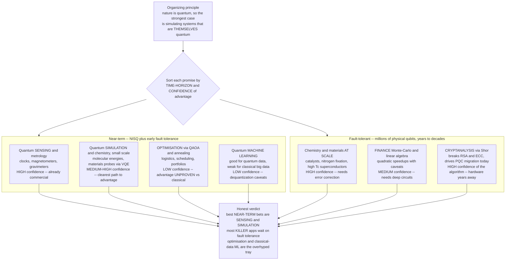

# 🧭 Near-Term Quantum Applications

> [!abstract] TL;DR
> Strip away the marketing and the honest question is narrow: **what will quantum computers actually be useful for, and when?** The single organizing principle — Feynman's original 1982 motivation — is that **nature is not classical, so the strongest case for quantum advantage is simulating systems that are themselves quantum**, not shoehorning classical big-data problems onto quantum hardware. That sorts the promised applications into three honest buckets. **Already plausible / nearest-term:** **quantum sensing and metrology** (already commercial and arguably *the* nearest-term quantum technology) and **small-scale quantum simulation and chemistry** (the clearest path to real advantage — computing molecular ground-state energies, reaction pathways, catalysts, battery materials, high-`Tc` superconductors — because the exponential quantum state space *is* the whole difficulty). **Real but far — needs large fault-tolerant machines:** **chemistry and materials at industrial scale**, and **cryptanalysis** ([[Shors_Factoring_Algorithm|Shor's algorithm]] breaking RSA/ECC) — genuine future applications that already drive the **post-quantum-cryptography** migration *today*, yet require millions of physical qubits and full error correction. **Heavily marketed but unproven:** **optimization** (QAOA / annealing for logistics, scheduling, portfolios — no proven advantage over classical heuristics) and **quantum machine learning** (promising for *quantum* data, oversold for classical big data, and haunted by *dequantization* results). **Finance** (Monte-Carlo, linear algebra) sits in between: quadratic speedups with fine-print caveats. The two hard truths: **most "killer apps" need fault tolerance a decade-plus out**, and **resource estimates are brutal** — Shor on RSA-2048 needs roughly `20` million noisy qubits, FeMoco chemistry a few thousand *logical* qubits. Realistic near-term picture: **sensing and simulation are the best bets; broad practical advantage for most applications is years away.**

---

## Intuition

**Analogy — sorting the promises into three trays.** Imagine a lab bench with three labelled trays: **"already plausible,"** **"maybe, with fault tolerance,"** and **"probably overhyped."** Someone hands you every quantum-computing promise from the last decade — cure diseases, crash Bitcoin, optimise the supply chain, revolutionise AI — and your job is to drop each one into the right tray. The rule that decides the sorting is not how *exciting* the promise sounds; it is a single physical question: **is the problem you are attacking itself quantum?**

Here is why that rule works. A quantum computer's one genuine superpower is that it *is* a quantum system — its `n` qubits natively hold a `2^n`-dimensional state that no classical machine can even store. So when the thing you want to compute is *also* a quantum state — the electrons in a molecule, the spins in a superconductor — the machine and the problem speak the same language, and the exponential cost that cripples classical simulation becomes *free*. This is Feynman's 1982 point: **"nature isn't classical, so if you want to simulate nature you'd better make it quantum."** That is why the **"already plausible"** tray fills up with **chemistry, materials, and sensing**, and why forcing a **classical big-data** problem (a spreadsheet, a logistics graph, a training set of cat photos) onto a quantum device usually lands in **"probably overhyped"** — you are asking a wind tunnel to do your accounting. The whole discipline of near-term quantum applications is learning to keep the trays straight against a relentless tide of hype.

---

## How It Works

### Core mechanics

1. **The organizing principle — quantum-native problems win.** Simulating `n` interacting quantum particles classically means tracking `2^n` complex amplitudes; at `n = 50` that is a quadrillion numbers no supercomputer can store. A quantum computer holds that state *natively* (see [[Quantum_Simulation_and_VQE]]). So the defensible advantage is largest exactly where the problem's difficulty **comes from quantum superposition and entanglement** — chemistry, materials, high-energy physics, quantum sensing. Where the difficulty is classical combinatorics or big data, the advantage is speculative and often erased by better classical algorithms.

2. **Quantum simulation and chemistry — the leading candidate.** The flagship near-term target is computing **molecular and material ground-state energies** (and reaction rates, excited states). Applications: **catalyst design**, **nitrogen fixation** (the FeMoco cofactor, whose strongly correlated electrons defy classical methods), **battery electrolytes and cathodes**, **high-`Tc` superconductors**, and **drug-binding** energetics. Two routes: the **NISQ** route (VQE — a shallow ansatz plus a classical optimiser, running today on noisy hardware) and the **fault-tolerant** route (Trotterisation / qubitisation plus phase estimation — exact, but needs error correction). The clearest path to *real* advantage likely needs **early fault tolerance**; today's VQE demos have not yet beaten the best classical chemistry.

3. **Optimisation — heavily marketed, advantage unproven.** **QAOA** and **quantum annealing** attack combinatorial problems — logistics, scheduling, portfolio optimisation — by encoding a cost function as a Hamiltonian whose ground state is the optimum. This is the *most aggressively marketed* application, yet after a decade there is **no proven, robust speedup** over classical heuristics (simulated annealing, branch-and-bound, specialised solvers). It is a *maybe*, not a *killer app*.

4. **Machine learning — promising for quantum data, oversold for classical.** **QML** (quantum kernels, variational classifiers, quantum neural nets) may help when the *data itself is quantum* (states from experiments, chemistry). For **classical big data** the case is weak and shrinking: **dequantization** results (Tang and others) showed several proposed quantum-ML speedups can be *matched classically* once you allow the classical algorithm the same sampling assumptions — deflating headline claims like exponential-speedup recommendation systems.

5. **Cryptanalysis — real, but far, and already reshaping security today.** [[Shors_Factoring_Algorithm|Shor's algorithm]] factors integers and computes discrete logs in polynomial time, breaking **RSA** and **elliptic-curve** cryptography. This is a *genuine* future application with a *proven* exponential speedup — but it needs **large fault-tolerant machines** that are years to decades away. The twist: because encrypted data can be **harvested now and decrypted later**, the threat is already driving the worldwide migration to [[Post_Quantum_Cryptography|post-quantum cryptography]] *today* — the application is future, the response is present.

6. **The nearest-term winner few mention — quantum sensing.** **Quantum sensors and metrology** (atomic clocks, magnetometers, gravimeters, interferometers exploiting entanglement to beat the standard quantum limit) are **already commercial and deployed**. They do not need a universal quantum computer at all, which is exactly why they are arguably the **nearest-term quantum technology** — and the least hyped.

7. **Finance and linear algebra — quadratic speedups with fine print.** **Quantum amplitude estimation** offers a *quadratic* (not exponential) speedup for **Monte-Carlo** pricing of derivatives and risk (see [[Monte_Carlo_Pricing]]). **Quantum linear-algebra** primitives (HHL) promise more but carry heavy caveats — state preparation, readout, and conditioning costs that often eat the advantage. Useful *someday*, deep circuits required.

8. **The NISQ-vs-fault-tolerant timeline.** The decisive axis. **NISQ** (tens to hundreds of noisy qubits, no correction — see [[Error_Mitigation_in_the_NISQ_Era]]) can run only *shallow* circuits; almost nothing with *proven* advantage fits. The **killer apps** — chemistry at scale, Shor's cryptanalysis — need **millions of physical qubits** and full error correction ([[Fault_Tolerance_and_the_Threshold_Theorem|the threshold theorem]], [[Logical_Qubits_and_Magic_States|logical qubits]]).

9. **Resource estimation — the reality check.** Honest logical-qubit counts and runtimes are sobering: **Shor on RSA-2048** is estimated at roughly `20` million noisy physical qubits running `8` hours (Gidney–Ekerå); **FeMoco** ground-state energy at a **few thousand logical** qubits (Reiher et al.; later reduced but still deep in the fault-tolerant regime). This is *why* most "killer apps" require fault tolerance — the demos we can run today are toy-sized versions of problems whose useful instances are far larger.

10. **The hype problem and how to evaluate claims.** Vendor and media over-promising has created a wide gap between **demonstrations** and **deployed value**. Evaluate any quantum claim critically (the toolkit of [[Media_Literacy_and_Source_Evaluation|source evaluation]]): Is it *advantage* (beyond all classical) or merely *utility* (useful on a noisy machine)? Was it benchmarked against the **best** classical method or a weak baseline? Does it need hardware that exists, or a machine `10-100x` larger than any built? Several early "advantage" claims were later matched classically.

### Application-readiness map — sorted by time-horizon and confidence



*Read it as two columns and a confidence label on every box. The near-term column holds few things with proven advantage; the fault-tolerant column holds the genuine killer apps but demands hardware a decade-plus away. The strongest boxes — sensing and simulation — are exactly the quantum-native problems.*

---

## Key Concepts

### Secondary (the big picture)
- Quantum computers have **one real superpower**: they *are* quantum systems, so they naturally handle other quantum systems — molecules, materials, spins.
- The **best near-term uses** are therefore **simulating chemistry and materials** and **quantum sensing** (better clocks and detectors), *not* forcing everyday big-data problems onto quantum hardware.
- **Breaking today's encryption** (Shor's algorithm) is real but needs a **huge, error-corrected** machine that does not exist yet — years away.
- **Optimisation and quantum AI** are the most *advertised* but least *proven*; be skeptical.
- Rule of thumb: **is the problem itself quantum?** If yes, hope; if no, hype.

### Undergraduate (the working picture)
- **Feynman's principle:** classical simulation of `n` quantum particles costs `2^n`; a quantum computer holds that state natively — advantage lives where difficulty is *quantum*.
- **Quantum simulation / chemistry:** ground-state energies via **VQE** (NISQ, shallow ansatz plus classical optimiser) or **phase estimation** (fault-tolerant, exact) — the clearest advantage candidate.
- **Optimisation (QAOA / annealing):** encode cost as a Hamiltonian; **no proven speedup** over classical heuristics — an open question, not a win.
- **QML:** helps mainly for **quantum data**; **dequantization** results undercut many classical-data speedup claims.
- **Cryptanalysis:** Shor gives a *proven exponential* speedup but needs *fault tolerance*; drives **PQC migration now** because of harvest-now-decrypt-later.
- **NISQ vs fault-tolerant:** the axis that decides *when* — near-term devices are shallow-circuit only; killer apps need error correction.
- **Utility vs advantage:** "useful on a noisy machine" is a weaker, honest claim than "beyond every classical computer."

### Graduate (the frontier and the numbers)
- **Resource estimation:** RSA-2048 via Shor ~ `20` million physical qubits, ~`8` hours (Gidney–Ekerå 2021); FeMoco ground state ~ a few thousand **logical** qubits (Reiher et al. 2017, reduced by Lee et al. 2021) — both squarely fault-tolerant. Physical-to-logical overhead (surface code) is `~10^3` per logical qubit at realistic error rates.
- **Amplitude estimation:** quadratic Monte-Carlo speedup `O(1/epsilon)` vs classical `O(1/epsilon^2)`; net advantage depends on oracle/state-prep cost and fault-tolerant clock speed — often marginal for realistic tolerances.
- **Dequantization (Tang 2019 and successors):** with `l2`-sampling access, several "exponential" QML/linear-algebra speedups collapse to polynomial classical algorithms — the caveat that reshaped QML expectations.
- **Barren plateaus and trainability:** deep unstructured variational ansätze have gradients vanishing exponentially in qubit count, capping NISQ optimisation/ML at scale (McClean et al. 2018).
- **HHL fine print (Aaronson's "read the fine print"):** exponential speedup requires efficient state preparation, well-conditioned matrices, and a readable *summary* of the solution — not the full vector; violate any and the advantage evaporates.
- **Utility vs advantage boundary:** whether NISQ-plus-mitigation reaches anything *classically hard and useful* before fault tolerance is the live debate; several sampling-based advantage claims (random-circuit sampling, boson sampling) were later challenged by improved classical simulation.
- **Early fault tolerance:** the transition regime — small codes plus mitigation on residual logical noise — may unlock the first modest chemistry/materials advantages before full fault tolerance.

---

## Python Demo

Two views of the **application-readiness landscape**, numpy + matplotlib only. **Panel 1** is a quadrant map: each candidate application is placed by **time-horizon** (x, NISQ-now to far-future fault-tolerant) and **confidence of advantage** (y), with **bubble size proportional to the logical qubits required** — so the sweet spot (high confidence, near-term, small) sits top-left with small bubbles. **Panel 2** is a resource-vs-timeline curve: a projected **logical-qubit growth** curve (illustrative doubling) crossed against each application's **required logical qubits**, printing the year each becomes feasible — making concrete *which applications come online when*.

```python
# Application-readiness map for near-term quantum computing.
# numpy + matplotlib only. All numbers are ILLUSTRATIVE order-of-magnitude
# estimates drawn from published resource studies, meant to convey the SHAPE
# of the landscape, not exact forecasts.
import numpy as np
import matplotlib.pyplot as plt

# ---- 1. Candidate applications, scored on three axes ----------------------
# years_out : rough time-horizon (0 = usable now, larger = further fault-tolerant)
# confidence: subjective confidence of a real quantum ADVANTAGE, in [0, 1]
# logical_q : logical qubits the USEFUL instance is estimated to need
apps = [
    # name,                         years_out, confidence, logical_q
    ("Quantum sensing / metrology",        0.5,      0.95,        1),
    ("Quantum simulation (small)",         3.0,      0.75,       50),
    ("Optimisation (QAOA/annealing)",      6.0,      0.30,      200),
    ("Quantum ML (classical data)",        8.0,      0.30,      300),
    ("Finance Monte-Carlo (QAE)",         10.0,      0.55,      500),
    ("Materials / high-Tc (at scale)",    12.0,      0.70,     1500),
    ("Chemistry at scale (FeMoco)",       13.0,      0.85,     2500),
    ("Cryptanalysis (Shor RSA-2048)",     15.0,      0.90,     4000),
]
names      = [a[0] for a in apps]
years      = np.array([a[1] for a in apps], dtype=float)
confidence = np.array([a[2] for a in apps], dtype=float)
logical_q  = np.array([a[3] for a in apps], dtype=float)

# bubble area grows with sqrt of qubit count so the huge apps do not dominate
sizes = 60 + 26 * np.sqrt(logical_q)

fig, (ax1, ax2) = plt.subplots(1, 2, figsize=(15, 6))

# ---- Panel 1: quadrant map (time-horizon vs confidence, size = resource) ---
# colour by tray: green = plausible-soon, orange = far-but-real, red = overhyped
def tray_colour(conf, yrs):
    if conf >= 0.6 and yrs <= 5:   return "#059669"   # plausible & near
    if conf >= 0.6 and yrs > 5:    return "#2563eb"   # real but far (fault-tolerant)
    return "#dc2626"                                  # marketed but unproven
colours = [tray_colour(c, y) for c, y in zip(confidence, years)]

ax1.axhspan(0.6, 1.02, xmin=0, xmax=1, color="#ecfdf5", zorder=0)
ax1.axvline(5.0, color="#9ca3af", lw=0.9, ls="--")
ax1.axhline(0.6, color="#9ca3af", lw=0.9, ls="--")
ax1.scatter(years, confidence, s=sizes, c=colours, alpha=0.75,
            edgecolors="black", linewidths=0.8, zorder=3)
for n, x, y in zip(names, years, confidence):
    ax1.annotate(n, (x, y), fontsize=7.5, xytext=(6, 5),
                 textcoords="offset points")
ax1.text(1.2, 0.97, "NEAR + HIGH CONFIDENCE\n(best near-term bets)",
         fontsize=7.5, color="#065f46", va="top")
ax1.text(10.5, 0.97, "FAR + HIGH CONFIDENCE\n(genuine killer apps)",
         fontsize=7.5, color="#1e3a8a", va="top")
ax1.text(6.0, 0.20, "LOW CONFIDENCE\n(marketed, unproven)",
         fontsize=7.5, color="#7f1d1d")
ax1.set_xlim(-0.5, 17.5); ax1.set_ylim(0.15, 1.05)
ax1.set_xlabel("time-horizon  (years-out, NISQ-now  ->  far fault-tolerant)")
ax1.set_ylabel("confidence of genuine quantum advantage")
ax1.set_title("Application-readiness map  (bubble size = logical qubits needed)")

# ---- Panel 2: resource requirement vs projected hardware timeline ----------
# Illustrative logical-qubit growth: start ~2 logical qubits in 2026,
# double every 2 years (an optimistic but instructive Moore-like curve).
t = np.linspace(0, 20, 400)               # years from 2026
L0, doubling = 2.0, 2.0
available = L0 * 2 ** (t / doubling)      # logical qubits available at year t

ax2.plot(2026 + t, available, color="#111827", lw=2.2,
         label="projected available logical qubits\n(illustrative: doubling every 2 yr)")
ax2.set_yscale("log")

# For each app, draw its required-qubit line and mark the FEASIBILITY year
# (when the growth curve first reaches the requirement).
order = np.argsort(logical_q)
for idx in order:
    req = logical_q[idx]
    # solve L0 * 2**(t/doubling) = req  ->  t = doubling * log2(req/L0)
    t_feasible = doubling * np.log2(max(req, L0) / L0)
    year_feasible = 2026 + t_feasible
    ax2.axhline(req, color=colours[idx], lw=1.0, ls=":", alpha=0.7)
    ax2.scatter([year_feasible], [req], color=colours[idx],
                s=70, zorder=5, edgecolors="black", linewidths=0.7)
    ax2.annotate(f"{names[idx].split('(')[0].strip()}  ~{year_feasible:.0f}",
                 (year_feasible, req), fontsize=7, xytext=(6, -2),
                 textcoords="offset points")
    print(f"{names[idx]:35s} needs {int(req):5d} logical qubits "
          f"-> feasible ~{year_feasible:.0f}")

ax2.set_xlim(2026, 2046); ax2.set_ylim(0.8, 8000)
ax2.set_xlabel("year")
ax2.set_ylabel("logical qubits  (log scale)")
ax2.set_title("Resource vs timeline: when each application crosses into reach")
ax2.legend(fontsize=7.5, loc="lower right")

plt.tight_layout()
plt.savefig("quantum_application_readiness.png", dpi=130)
print("\nSaved landscape figure to quantum_application_readiness.png")

# Takeaways:
#   * Panel 1: the green top-left (sensing, small simulation) is where
#     confidence is HIGH and the horizon is NEAR -- the honest best bets.
#   * The red band (optimisation, classical-data QML) sits LOW on confidence
#     no matter how loudly it is marketed.
#   * Panel 2: because required qubits span 1 -> 4000 but hardware grows
#     smoothly, the KILLER apps (chemistry at scale, Shor) only cross into
#     reach a decade-plus out -- the resource-estimation reality in one curve.
```

Running it prints a feasibility year for each application (sensing essentially now, small simulation within a few years, chemistry-at-scale and Shor well into the late 2030s on this illustrative curve) and saves a two-panel figure: a quadrant map with a green near-term/high-confidence corner and a red overhyped band, plus a log-scale timeline showing each application's required-qubit line crossing the hardware-growth curve. The picture makes the thesis visual — **the useful-and-soon corner is small, quantum-native, and does not include the loudest marketing.**

---

## Real-World Applications

> **Example — the post-quantum-cryptography migration that a *future* application forced on the *present*.** Nobody has run [[Shors_Factoring_Algorithm|Shor's algorithm]] on a cryptographically relevant key, and resource estimates say the machine needed — roughly `20` million noisy qubits — is years to decades away. Yet in 2024 NIST finalised its first **post-quantum cryptography** standards (ML-KEM/Kyber, ML-DSA/Dilithium) and organisations worldwide began migrating, because adversaries can **harvest encrypted traffic now and decrypt it later** once the hardware exists. This is the sharpest illustration of the near-term-applications thesis: the *application* (breaking RSA) is firmly in the fault-tolerant future, but its mere *inevitability* is a present-day engineering driver. See [[Post_Quantum_Cryptography]].

- **Quantum chemistry and catalysis (the flagship bet).** Companies and labs target **nitrogen fixation** (FeMoco), **battery materials**, and **catalyst design** via VQE today and phase estimation tomorrow — the quantum-native problem where advantage is most defensible ([[Quantum_Simulation_and_VQE]], [[Quantum_Chemistry_and_Atomic_Orbitals]]). Current results are proofs of concept, not yet beating classical chemistry.
- **Correlated materials and superconductivity.** Simulating Hubbard-model physics and strongly correlated electrons targets **high-`Tc` superconductors** and other materials where classical approximations break down ([[Superconductivity_and_BCS_Theory]]).
- **Quantum sensing — already deployed.** Entanglement-enhanced **atomic clocks, magnetometers, and gravimeters** are commercial products (navigation, mineral survey, medical imaging), needing no universal quantum computer — the genuinely nearest-term quantum technology.
- **Finance.** Banks pilot **quantum amplitude estimation** for **Monte-Carlo** derivative pricing and risk (quadratic speedup) and QAOA for portfolio optimisation — promising but caveat-laden and deep-circuit-hungry ([[Monte_Carlo_Pricing]]).
- **Optimisation pilots.** Logistics, scheduling, and traffic-routing demonstrations on annealers and gate machines are widespread in vendor case studies — but independent benchmarks against strong classical solvers rarely show a durable win, the canonical **utility-vs-advantage** cautionary tale.
- **Error-mitigated "utility" experiments.** IBM's 127-qubit dynamics runs ([[Error_Mitigation_in_the_NISQ_Era]]) show noisy hardware producing hard-to-simulate expectation values *now* — utility on the road to advantage, not advantage itself.

---

## Common Pitfalls

- **"Quantum computers will speed up everything."** The advantage is **problem-specific**, largest for **quantum-native** tasks (chemistry, materials, sensing) and speculative-to-nonexistent for generic classical big data. Broad "exponential speedup for AI/optimisation" claims are the #1 red flag.
- **Confusing utility with advantage.** A mitigated NISQ result that *matches* the best classical method is **utility**, not **quantum advantage**. Ask always: benchmarked against the *best* classical algorithm, or a weak baseline? Several "advantage" claims were later reproduced classically.
- **Ignoring resource estimates.** A working *demo* on a toy instance says little about the *useful* instance. Shor on RSA-2048 (~`20`M qubits) and FeMoco (~thousands of logical qubits) are **fault-tolerant-era** problems; treating today's NISQ demos as "almost there" is the core hype error.
- **Believing optimisation is a solved quantum win.** QAOA and annealing are the most-marketed, least-proven applications. There is **no robust demonstrated speedup** over classical heuristics; "we ran it on a quantum computer" is not "we beat the classical solver."
- **Overselling QML on classical data.** **Dequantization** shows many proposed speedups vanish once classical algorithms get the same sampling access. QML's honest strength is **quantum data**, not replacing classical deep learning.
- **Forgetting the fine print on linear-algebra speedups.** HHL-style "exponential" wins need efficient state preparation, good conditioning, and a *summary* readout — violate any and the speedup disappears. Read the fine print.
- **Timeline collapse.** "Within N years" from a vendor deck usually assumes best-case hardware scaling *and* algorithmic improvement *and* error correction simultaneously. Separate **what the algorithm proves** from **what the hardware can do** — the algorithm for Shor is certain; the machine for Shor is not.
- **Dismissing quantum entirely.** The opposite error. Simulation and sensing are *real*, and the fault-tolerant killer apps are a question of *when*, not *if*. Sober is not the same as cynical.

---

## Related Concepts

- [[Quantum_Simulation_and_VQE]] — the leading near-term application worked out in full; ground-state energies, VQE, and Trotterisation are the concrete content behind the "chemistry is the killer app" claim.
- [[Shors_Factoring_Algorithm]] — the cryptanalysis application: a proven exponential speedup that nonetheless needs fault tolerance, the archetype of "real but far."
- [[Error_Mitigation_in_the_NISQ_Era]] — what makes NISQ devices *usable* today (VQE, QAOA, utility experiments) and why mitigation buys reach, not scalability.
- [[Fault_Tolerance_and_the_Threshold_Theorem]] — the gate that most killer apps must pass through; the reason chemistry-at-scale and Shor are decade-plus applications.
- [[Logical_Qubits_and_Magic_States]] — the currency of resource estimation; logical-qubit counts are exactly what Panel 2 of the demo plots against a hardware-growth curve.
- [[Post_Quantum_Cryptography]] — the present-day response to a future application; how Shor's inevitability is already reshaping deployed security.
- [[Quantum_Chemistry_and_Atomic_Orbitals]] — the classical chemistry (variational principle, molecular orbitals) that quantum simulation aims to surpass; the payoff domain of the flagship application.
- [[Superconductivity_and_BCS_Theory]] — a headline materials-science target where correlated-electron physics resists classical methods and quantum simulation is most promising.
- [[Quantum_Key_Distribution_and_BB84]] — the *constructive* quantum-security application (secure key exchange), the complement to Shor's *destructive* cryptanalysis.
- [[Monte_Carlo_Pricing]] — the finance application: classical Monte-Carlo pricing that quantum amplitude estimation offers a quadratic speedup over, with fine print.
- [[Physical_Qubits_and_the_DiVincenzo_Criteria]] — the hardware constraints (coherence, gate fidelity, scalability) that set how fast the availability curve in the demo can actually rise.
- [[Media_Literacy_and_Source_Evaluation]] — the critical-thinking toolkit for separating quantum demonstrations from deployed value and evaluating vendor advantage claims.
- [[Quantum_Computing_Overview]] — the parent map of the field; this note is its honest "what is it actually good for, and when" chapter.

---

## Review Questions

**Tier 1 — Conceptual (explain to a peer):**
1. Using the three-tray analogy, sort these four promises into "already plausible," "maybe with fault tolerance," and "probably overhyped," and justify each with the single deciding rule: catalyst design, breaking RSA, optimising an airline's crew schedule, and building a better atomic clock.
2. State Feynman's 1982 principle in one sentence and explain why it makes *quantum chemistry* a stronger near-term bet than *quantum machine learning on classical big data*.

**Tier 2 — Applied (reason / evaluate):**
3. A vendor announces it "used a quantum computer to optimise a delivery network 100x faster." List three specific questions you would ask before believing this is a genuine **quantum advantage** rather than **utility** or marketing — and name what a fair classical baseline would be.
4. Shor's algorithm has a *proven* exponential speedup, yet the world is migrating to post-quantum cryptography *before* any quantum computer can run it usefully. Explain the "harvest-now-decrypt-later" logic and why the resource estimate (~`20` million physical qubits) does **not** make the migration premature.

**Tier 3 — Theoretical (deep understanding):**
5. "Most quantum killer apps require fault tolerance." Using resource estimation (surface-code overhead, logical vs physical qubits, the FeMoco and RSA-2048 numbers), explain *why* — and identify which one or two applications plausibly deliver value in the **NISQ / early-fault-tolerant** window, and why they are the exceptions.
6. Contrast the confidence of advantage for **quantum simulation**, **optimisation (QAOA)**, and **QML on classical data**. Bring in the **dequantization** results and the **utility-vs-advantage** distinction to argue which of the three deserves the most skepticism and which the most investment, and why the deciding factor is whether the problem is quantum-native.

---

## Sources

- Feynman, R. P. "Simulating Physics with Computers," *International Journal of Theoretical Physics* 21 (1982): 467–488 — the founding argument that quantum systems are best simulated by quantum computers, the organizing principle of this note. [DOI](https://doi.org/10.1007/BF02650179)
- Preskill, J. "Quantum Computing in the NISQ Era and Beyond," *Quantum* 2, 79 (2018) — frames the near-term promise and its limits, the NISQ-vs-fault-tolerant divide. [arXiv:1801.00862](https://arxiv.org/abs/1801.00862)
- Reiher, M., Wiebe, N., Svore, K. M., Wecker, D. & Troyer, M. "Elucidating reaction mechanisms on quantum computers," *PNAS* 114 (2017): 7555–7560 — the landmark FeMoco / nitrogen-fixation resource estimate for fault-tolerant chemistry. [arXiv:1605.03590](https://arxiv.org/abs/1605.03590)
- Gidney, C. & Ekerå, M. "How to factor 2048 bit RSA integers in 8 hours using 20 million noisy qubits," *Quantum* 5, 433 (2021) — the honest resource estimate behind Shor-based cryptanalysis. [arXiv:1905.09749](https://arxiv.org/abs/1905.09749)
- Aaronson, S. "Read the fine print," *Nature Physics* 11 (2015): 291–293 — the caveats on quantum linear-algebra and QML speedups (state prep, conditioning, readout). [DOI](https://doi.org/10.1038/nphys3272)
- Tang, E. "A quantum-inspired classical algorithm for recommendation systems," *STOC* (2019) — the founding *dequantization* result deflating claimed exponential QML speedups. [arXiv:1807.04271](https://arxiv.org/abs/1807.04271)

---

#quantum-computing #quantum-applications #quantum-chemistry #nisq #quantum-advantage
