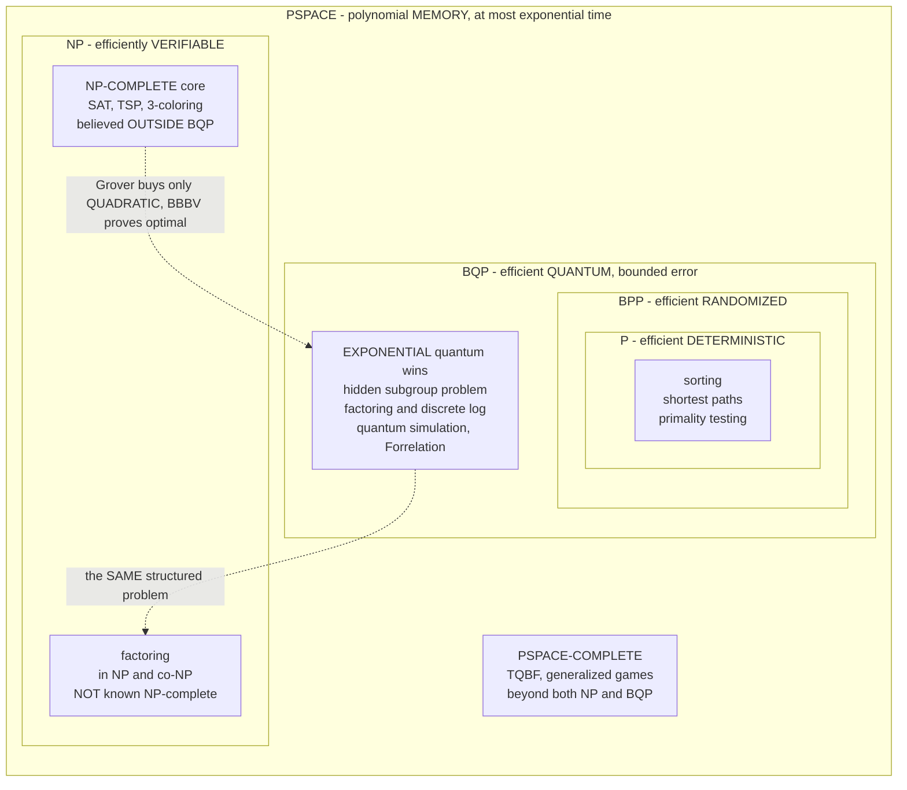

# 🗺️ Quantum Complexity Theory and BQP

> [!abstract] TL;DR
> **Quantum complexity theory** is the rigorous accounting of what a quantum computer can and cannot solve *efficiently*, and its central object is **BQP** — *bounded-error quantum polynomial time* — the class of decision problems a quantum circuit of polynomial size can decide correctly with probability at least `2/3`. BQP is the formal definition of "efficient quantum computation," the quantum analogue of the randomized class **BPP** (and hence of **P**). The known map is `P ⊆ BPP ⊆ BQP ⊆ PSPACE`: quantum computers are **at least** as powerful as classical ones and **no more than exponentially** so — they cannot compute the uncomputable and give **no** super-polynomial *space* advantage. The single most misunderstood point: BQP is **not** known to contain the **NP-complete** problems, and is widely believed **incomparable** to NP. **Factoring** lives in BQP (Shor) and in `NP ∩ co-NP`, but is *not* believed NP-complete — so breaking RSA does **not** mean `P = NP` or that quantum computers crack SAT. Quantum advantage comes from **hidden algebraic/periodic structure** (the hidden subgroup problem behind Shor), **not** brute-force search: Grover gives only a *quadratic* speedup, and the **BBBV** lower bound proves quadratic is optimal for unstructured search. The cleanest *provable* separations are in the **query/oracle model** (Deutsch–Jozsa, Simon), while unrelativized BQP-vs-classical separations remain conjectural, exactly like P-vs-NP. The quantum analogue of NP is **QMA** (quantum Merlin–Arthur), whose canonical complete problem is the **local Hamiltonian problem** (a quantum Cook–Levin), and quantum-supremacy sampling tasks (BosonSampling, random-circuit sampling) are hard to simulate for **#P**-hardness and anti-concentration reasons.

---

## Intuition

**Analogy — BQP is a new map laid over the old atlas of computation.** For decades complexity theorists drew an atlas of "what can be solved efficiently": **P** is the well-charted lowland of problems a classical computer solves quickly, and **NP** is the frontier of problems whose *solutions* are easy to check even when finding them looks hopeless (SAT, the travelling salesman). A quantum computer arrives claiming to redraw the borders — so the real question is not "is the quantum machine faster?" but **"exactly which territory does its new map, BQP, cover, and where does that map overlap the old one?"** The honest, surprising answer is that BQP is a *strangely shaped* region: it swallows all of P, it pokes out past the classical frontier to seize a few prized valleys the old map could never reach (factoring, discrete log, simulating molecules), yet it conspicuously **fails to conquer the NP-complete highlands** everyone assumed a "more powerful" computer would storm. Neither map contains the other.

The deep lesson is that "more powerful" is the wrong mental model. A quantum computer is not a faster classical computer any more than a submarine is a faster boat — it moves through a *different medium* (amplitudes that interfere and cancel, not probabilities that only add), so it reaches places classical machines cannot, while remaining useless in places they handle fine. BQP is the precise shape of that reachable territory, and quantum complexity theory is the surveying expedition that charts its coastline: proving where quantum genuinely helps (structured, periodic problems), proving where it provably *cannot* help much (`Ω(√N)` for unstructured search), and confessing where — like `P` vs `NP` — we simply do not yet know the border and can only draw it in the relativized world of oracles.

---

## How It Works

### Core Mechanics

**1. Defining BQP — "efficient" made precise for a quantum machine.** A language `L` is in **BQP** if there is a *uniform* family of polynomial-size quantum circuits (drawn from a fixed universal gate set) such that on input `x`: if `x ∈ L` the circuit accepts with probability `≥ 2/3`, and if `x ∉ L` it accepts with probability `≤ 1/3`. The gap `[1/3, 2/3]` is the **bounded error**; any constant strictly between `1/2` and `1` works, because running the circuit many times and taking a **majority vote** drives the error down exponentially (Chernoff). This is *exactly* how [[Randomized_Complexity_Classes|BPP]] is defined, with a quantum circuit swapped in for a randomized one — so **BQP is the quantum sibling of BPP**, and the phrase "solvable in BQP" is the formal meaning of "efficiently quantum-solvable."

**2. The known inclusions — `P ⊆ BPP ⊆ BQP ⊆ PSPACE`.** These four classes nest, and each containment has a concrete reason.
   - `P ⊆ BPP`: a deterministic machine is a randomized one that ignores its coins ([[The_Class_P_and_Efficient_Computation]]).
   - `BPP ⊆ BQP`: a quantum computer can flip fair coins (measure a Hadamarded qubit) and simulate any classical randomized computation.
   - `BQP ⊆ PSPACE`: the deep one. The acceptance probability of a quantum circuit is a sum of **Feynman path amplitudes** over exponentially many computational paths; a classical machine can add these up **one at a time, reusing the same memory**, so it needs only *polynomial space* (though exponential time). Hence anything quantum-tractable is classically solvable in polynomial memory — quantum computers give **no** super-polynomial space advantage and **cannot** solve undecidable problems ([[Space_Complexity_and_PSPACE]]). (Sharper analyses place BQP inside `PP` and thus inside `PSPACE`.)

   The takeaway: quantum computers are **at least** as strong as classical (they contain P) and **at most** exponentially stronger (bounded by PSPACE). BQP sits *somewhere between* P and PSPACE, and pinning it down exactly is as open as P-vs-PSPACE itself.

**3. BQP vs NP — the crucial, widely-mangled relationship.** People assume a "more powerful" computer must crush NP-complete problems. It is not known to, and almost certainly does not.
   - **NP-complete `⊄` BQP is the consensus belief.** The only general-purpose quantum tool for the unstructured search underlying SAT is **Grover**, which is merely *quadratic*: `√(2ⁿ)` is still exponential ([[Grovers_Search_Algorithm]]). There is no known quantum method that verifies-and-searches its way through NP-complete problems in polynomial time.
   - **BQP and NP are believed incomparable** — neither contains the other. NP has NP-complete problems believed outside BQP; BQP has problems (e.g. **Forrelation**) believed outside NP and even outside the entire polynomial hierarchy (see mechanic 8).
   - **Factoring is the poster child of the overlap.** `FACTORING` (as a decision problem) is in BQP via [[Shors_Factoring_Algorithm|Shor's algorithm]] **and** in `NP ∩ co-NP` (a factor is an easy certificate both ways), but it is **not** known — and not believed — to be **NP-complete** ([[NP_Completeness_and_the_Cook_Levin_Theorem]]). Therefore **Shor does *not* imply `P = NP`, nor `NP ⊆ BQP`, nor that quantum solves NP-complete problems.** It solves a *special, structured* problem that happens to sit outside P but well short of the NP-complete summit ([[The_Class_NP_and_Verification]], [[P_versus_NP]]).

**4. Where quantum advantage actually comes from — structure, not search.** Every known *exponential* quantum speedup exploits **hidden algebraic or periodic structure**. Shor's engine is period-finding, an instance of the **Hidden Subgroup Problem (HSP)** over abelian groups, solved by the **Quantum Fourier Transform** ([[Quantum_Algorithms_and_the_Oracle_Model]]). Discrete log, Simon's problem, and phase estimation are all HSP instances. Take the structure away — as in a generic NP-complete instance or an unstructured database — and the exponential edge evaporates, leaving at best Grover's quadratic gain. Quantum computers are a **scalpel for structured problems, not a sledgehammer for all hard ones.**

**5. The BBBV ceiling — quadratic is provably optimal for unstructured search.** The **Bennett–Bernstein–Brassard–Vazirani (BBBV, 1997)** theorem proves a query lower bound of `Ω(√N)` for finding a marked item in an unstructured space of size `N`. So Grover is not just the best *known* algorithm — it is *optimal*, and no clever future quantum trick will crack unstructured search (and by extension generic NP-complete search) exponentially. This is the rigorous reason "quantum computers are not magic NP-solvers" is a *theorem in the oracle world*, not merely a belief.

**6. Query/oracle complexity — the cleanest provable separations.** Because we cannot yet prove `BQP ≠ P` in the real (unrelativized) world, the sharpest *rigorous* evidence for quantum power lives in the **query model**, where cost = number of black-box oracle calls.
   - **Deutsch–Jozsa**: `1` quantum query vs up to `2ⁿ⁻¹ + 1` classical deterministic queries ([[Deutsch_Jozsa_and_Bernstein_Vazirani]]).
   - **Simon's problem**: `O(n)` quantum queries vs `Θ(√(2ⁿ)) = Θ(2^{n/2})` classical (a *provable, exponential* black-box separation) — the direct inspiration for Shor.
   These separations are **unconditional** *relative to the oracle*, sidestepping the P-vs-BQP impasse.

**7. Relativized vs unrelativized — the honest asterisk.** Oracle (relativized) separations are *proven*; the corresponding *unrelativized* separations are *conjectured*. We can prove Simon's problem is exponentially hard classically **given the oracle**, but we **cannot** prove that BQP contains a problem outside BPP without an oracle — that would resolve questions as hard as `P` vs `PSPACE`. This mirrors the P-vs-NP situation exactly: we have relativized worlds where they differ and worlds where they don't, so the real-world answer stays open. "Quantum beats classical" is a *theorem in the query model* and a *well-founded conjecture* in the standard model.

**8. BQP and the polynomial hierarchy — recent oracle news.** A landmark result of **Raz–Tal (2018)** gives an oracle relative to which **BQP `⊄` PH** (the polynomial hierarchy), using the **Forrelation** problem. Intuitively: there are things a quantum computer can do that look *nothing* like the bounded guess-and-verify structure of the polynomial hierarchy ([[The_Polynomial_Hierarchy]]). It is oracle evidence that BQP's shape is genuinely alien to the classical NP-tower — reinforcing incomparability with NP.

**9. QMA — the quantum analogue of NP.** If NP is "problems with an efficiently *checkable* classical proof," then **QMA (Quantum Merlin–Arthur)** is "problems with an efficiently *checkable quantum* proof": an all-powerful Merlin sends a quantum state (the witness), and a polynomial-time quantum verifier Arthur accepts/rejects with bounded error. The **quantum Cook–Levin theorem** (Kitaev) shows the **local Hamiltonian problem** — decide whether the ground-state energy of a sum of local Hermitian terms is below `a` or above `b` — is **QMA-complete** ([[NP_Completeness_and_the_Cook_Levin_Theorem]]). This is why estimating ground-state energies is believed intractable even for quantum computers in the worst case, and why practical [[Quantum_Simulation_and_VQE|variational quantum simulation]] targets *structured, physically-motivated* instances rather than arbitrary Hamiltonians.

**10. Sampling classes and the complexity of quantum supremacy.** The tasks used to *demonstrate* quantum advantage are **sampling** problems, not decision problems, and their hardness rests on counting complexity.
   - **BosonSampling** (Aaronson–Arkhipov, 2011): sampling the output of a linear-optical network is classically hard because the output amplitudes are **permanents** of matrices, and computing the permanent is **#P-hard** ([[Counting_Complexity_and_Equilibria]]). Combined with an **anti-concentration** property (outputs are spread out, not spiky), simulating the *sampling* would collapse the polynomial hierarchy — believed impossible.
   - **Random-circuit sampling** (the basis of Google's Sycamore claim): analogous #P-hardness-of-amplitudes plus anti-concentration arguments. These tasks are **useless by design** — they prove the hardware is hard to *simulate*, not that it computes anything you want.

**11. The honest takeaways.** Quantum computers are **provably not** exponentially faster at everything (BBBV; `BQP ⊆ PSPACE`). The class of problems they help with is **special and structured** (HSP, simulation). Their relationship to the classical world (BQP vs BPP, BQP vs PH) is *conjectural* unrelativized and *proven* only relative to oracles. Quantum complexity theory's job is to keep these three statements rigorously separated — and to resist the hype that conflates "quantum" with "solves NP."

### Flow / Architecture



*The atlas: `P ⊆ BPP ⊆ BQP ⊆ PSPACE` nests as boxes-within-boxes. **NP overlaps BQP but neither contains the other** — factoring sits in the shared ground (dotted link), the NP-complete core sits in NP but is believed outside BQP, and Grover's quadratic-only speedup (optimal by BBBV) is why quantum cannot storm that core. PSPACE-complete problems (TQBF) lie beyond everything drawn.*

---

## Key Concepts

**Secondary (intuitive, no CS background needed)**
- **BQP is the "map" of efficient quantum computation** — everything a quantum computer can solve quickly, the quantum version of "P" for classical machines.
- **Quantum is not a faster classical computer** — it reaches a *few new places* (factoring, simulating molecules) but *fails* on many hard problems classical machines also fail on.
- **Quantum does NOT crack "all hard problems"** — the famous NP-complete problems (SAT, travelling salesman) are believed to stay hard even for quantum computers.
- **Breaking RSA is not "solving everything"** — Shor factors because factoring has hidden *structure*; that trick does not transfer to unstructured search.

**Undergraduate (a first complexity / quantum course)**
- **BQP definition** — polynomial-size uniform quantum circuit, error `≤ 1/3`, amplified by majority vote; the quantum analogue of BPP.
- **Known inclusions** — `P ⊆ BPP ⊆ BQP ⊆ PSPACE`; the last proven by summing Feynman path amplitudes in polynomial space.
- **BQP vs NP** — believed **incomparable**; NP-complete `⊄` BQP; factoring `∈ BQP ∩ (NP ∩ co-NP)` but not NP-complete.
- **Structured vs unstructured** — exponential speedups need hidden periodicity (HSP, QFT); unstructured search gets only Grover's `√N`.
- **BBBV lower bound** — `Ω(√N)` is *optimal* for quantum unstructured search; the rigorous ceiling on brute-force quantum power.
- **Query model** — cost = oracle calls; Simon gives a *provable* `O(n)` vs `Θ(2^{n/2})` exponential separation.

**Graduate (advanced quantum complexity)**
- **Relativization** — oracle separations (Simon, Forrelation) are proven; unrelativized `BQP ≠ BPP` is conjectural, as hard to settle as major open problems.
- **`BQP ⊆ PP ⊆ PSPACE`** — Adleman–DeMarrais–Huang and Fortnow–Rogers place BQP inside PP via the path-integral / signed-sum viewpoint.
- **Raz–Tal (2018)** — an oracle with `BQP ⊄ PH`, via the **Forrelation** problem; quantum power is not captured by bounded quantifier alternation.
- **QMA and the local Hamiltonian problem** — Kitaev's quantum Cook–Levin; `k`-local Hamiltonian is QMA-complete; QMA `⊆ PP`, and the QMA-vs-QCMA (classical witness) question.
- **Sampling hardness** — BosonSampling and random-circuit sampling reduce to `#P`-hardness of the **permanent** plus **anti-concentration**; classical simulation would collapse PH.
- **Hidden Subgroup Problem** — abelian HSP (factoring, discrete log) is quantum-easy; non-abelian HSP (graph isomorphism, dihedral/lattice) resists, underpinning lattice-based post-quantum cryptography.

---

## Python Demo

```python
# Two views of "what BQP is and where its power comes from" -- numpy/matplotlib only.
#
# LEFT  : a conceptual MAP of the complexity landscape. Nested ellipses draw
#         P  subset  BPP  subset  BQP  subset  PSPACE, an OVERLAPPING NP region,
#         and canonical problems placed where complexity theory believes they live
#         (factoring in the BQP-and-NP overlap; NP-complete OUTSIDE BQP; etc.).
#
# RIGHT : the QUERY-COMPLEXITY separation that underlies BQP's exponential wins.
#         We simulate Simon's problem: a 2-to-1 function f with a hidden string s
#         where f(x) = f(y) iff y = x XOR s. Classically you must hunt for a COLLISION
#         (birthday bound, ~ 2^(n/2) queries); quantumly O(n) queries suffice. We
#         MEASURE the classical collision-query count empirically and plot it against
#         the theoretical 2^(n/2) curve and the LINEAR quantum curve.

import numpy as np
import matplotlib.pyplot as plt
from matplotlib.patches import Ellipse

# ----------------------------------------------------------------------
# PART 1 -- empirical Simon's-problem query separation (classical vs quantum)
# ----------------------------------------------------------------------

def make_simon_function(n, s, rng):
    """Build a 2-to-1 function f on {0,1}^n with hidden period s (s != 0)."""
    N = 1 << n
    f = -np.ones(N, dtype=np.int64)
    label = 0
    for x in range(N):
        if f[x] < 0:                 # x not yet assigned
            y = x ^ s                # its unique partner under the hidden period
            f[x] = label
            f[y] = label             # both map to the same output -> 2-to-1
            label += 1
    return f

def classical_queries_for_collision(f, rng):
    """Query random inputs until two DISTINCT inputs collide -> reveals s."""
    order = rng.permutation(len(f))
    seen = {}
    for count, x in enumerate(order, start=1):
        out = int(f[x])
        if out in seen:              # collision: seen[out] and x map to the same value
            return count             # number of oracle queries used
        seen[out] = x
    return len(f)

ns = np.arange(2, 15)                # problem sizes (qubits)
trials = 120
rng = np.random.default_rng(7)

classical_avg = []
for n in ns:
    N = 1 << n
    counts = []
    for _ in range(trials):
        s = int(rng.integers(1, N))          # random nonzero hidden string
        f = make_simon_function(n, s, rng)
        counts.append(classical_queries_for_collision(f, rng))
    classical_avg.append(np.mean(counts))
classical_avg = np.array(classical_avg)

classical_theory = 2.0 ** (ns / 2.0)         # birthday bound ~ 2^(n/2)
quantum_queries  = ns.astype(float)          # Simon: O(n) quantum queries (linear)

print("Simon's problem -- queries to recover the hidden period s")
print(f"{'n':>3} {'classical(emp)':>15} {'2^(n/2)':>10} {'quantum~n':>10}")
for i, n in enumerate(ns):
    print(f"{n:>3} {classical_avg[i]:>15.1f} {classical_theory[i]:>10.1f} "
          f"{quantum_queries[i]:>10.0f}")
print(f"\nAt n = {ns[-1]}: classical ~ {classical_avg[-1]:.0f} queries vs "
      f"quantum ~ {int(quantum_queries[-1])} -- an EXPONENTIAL gap.")

# ----------------------------------------------------------------------
# PART 2 -- draw everything
# ----------------------------------------------------------------------

fig, (axL, axR) = plt.subplots(1, 2, figsize=(15, 6.2))

# ---- LEFT: the complexity-class atlas -------------------------------------
def region(ax, xy, w, h, color, label, lx, ly, fs=10, alpha=0.16, weight="bold"):
    ax.add_patch(Ellipse(xy, w, h, facecolor=color, edgecolor=color,
                         lw=2, alpha=alpha))
    ax.text(lx, ly, label, ha="center", va="center", fontsize=fs,
            color=color, fontweight=weight)

region(axL, (5.0, 5.0), 9.6, 9.2, "#111827", "PSPACE", 5.0, 9.35, 12)
region(axL, (6.2, 5.0), 5.2, 6.6, "#7c3aed", "NP",     8.05, 7.3, 12)
region(axL, (4.1, 5.0), 5.4, 6.8, "#dc2626", "BQP",    1.9, 7.4, 12)
region(axL, (3.3, 5.0), 3.1, 3.8, "#2563eb", "BPP",    3.3, 6.35, 10)
region(axL, (3.05, 5.0), 1.7, 2.2, "#059669", "P",     3.05, 5.55, 11)

# canonical problems, placed where they are believed to live
axL.text(3.05, 4.75, "sorting\nshortest paths",
         ha="center", va="center", fontsize=7.5, color="#065f46")
axL.text(3.15, 6.05, "poly identity\ntesting",
         ha="center", va="center", fontsize=7.5, color="#1d4ed8")
axL.text(2.05, 4.0, "Forrelation\nquantum simulation\n(BQP, not in NP)",
         ha="center", va="center", fontsize=7.5, color="#b91c1c")
axL.text(5.15, 5.0, "FACTORING\ndiscrete log\n(BQP and NP,\nnot NP-complete)",
         ha="center", va="center", fontsize=8, color="#4c1d95", fontweight="bold")
axL.text(7.55, 4.2, "NP-COMPLETE\nSAT, TSP\n(believed NOT\nin BQP)",
         ha="center", va="center", fontsize=8, color="#6d28d9", fontweight="bold")
axL.text(5.0, 1.15, "PSPACE-complete: TQBF, generalized games",
         ha="center", va="center", fontsize=8, color="#111827")

axL.set_xlim(0, 10); axL.set_ylim(0, 10)
axL.set_aspect("equal"); axL.axis("off")
axL.set_title("The map of BQP:  P  subset  BPP  subset  BQP  subset  PSPACE,\n"
              "with NP OVERLAPPING (neither contains the other)", fontsize=11)

# ---- RIGHT: the query-complexity separation -------------------------------
axR.semilogy(ns, classical_avg, "o-", color="#dc2626", lw=2, ms=6,
             label="classical, empirical (collision hunt)")
axR.semilogy(ns, classical_theory, "--", color="#6b7280", lw=1.6,
             label="classical, theory  2^(n/2)")
axR.semilogy(ns, quantum_queries, "s-", color="#2563eb", lw=2, ms=6,
             label="quantum  O(n)  (Simon)")
axR.set_xlabel("problem size  n  (qubits)")
axR.set_ylabel("oracle queries to recover hidden s  (log scale)")
axR.set_title("Why BQP is powerful: an EXPONENTIAL query gap\n"
              "classical 2^(n/2)  vs  quantum linear n")
axR.grid(True, which="both", ls=":", alpha=0.4)
axR.legend(loc="upper left", fontsize=9)

plt.tight_layout()
plt.savefig("bqp_landscape_and_query_gap.png", dpi=130)
print("\nSaved landscape + query-gap figure to bqp_landscape_and_query_gap.png")

# Takeaways the run makes concrete:
#   * LEFT panel: BQP swallows P/BPP, pokes OUT to grab factoring, yet the
#     NP-complete core sits in NP OUTSIDE BQP -- the maps overlap, neither wins.
#   * RIGHT panel: the empirical classical collision count tracks 2^(n/2) and
#     EXPLODES, while quantum stays LINEAR -- the provable oracle separation
#     (Simon) that inspired Shor and demonstrates BQP's structured power.
```

Running it prints a table where the empirically-measured classical collision count hugs the `2^{n/2}` birthday curve and blows up (hundreds of queries by `n = 14`), while the quantum count stays *linear* in `n`. The left panel renders the atlas: nested `P ⊆ BPP ⊆ BQP ⊆ PSPACE` ellipses with an **overlapping** NP region, factoring drawn in the `BQP ∩ NP` shared ground, and the NP-complete core drawn inside NP but **outside** BQP. The right panel is the headline on a log axis — the exponential classical-vs-linear-quantum query gap of Simon's problem, the *provable* separation that underlies (and inspired) the exponential wins BQP is famous for. Change `ns` to reach `n = 16` to watch the classical curve climb toward a thousand queries while quantum barely moves.

---

## Real-World Applications

> **Example — accurately scoping the quantum threat to cryptography.** Quantum complexity theory is what lets a security architect answer "what actually breaks?" *precisely* rather than hysterically. Because **factoring and discrete log are in BQP** (Shor), RSA, Diffie–Hellman, and ECC fall — this is a *structural* result (abelian hidden subgroup problem), so it is reliable. But because **NP-complete `⊄` BQP** is believed and **Grover is only quadratic (BBBV-optimal)**, symmetric ciphers and hashes are *not* broken — Grover merely halves effective key length, so **AES-256 stays safe** and the mitigation is "double the key size." This asymmetry — public-key doomed, symmetric survivable — is a direct read-off of the complexity map, and it is exactly why NIST's 2024 post-quantum standards replace *only* the public-key primitives ([[Shors_Factoring_Algorithm]], [[Quantum_Computation_and_BQP]]).

- **Quantum chemistry and materials simulation** — the *strongest* candidate for useful advantage. The local Hamiltonian problem being **QMA-complete** tells us the *worst case* is hard even for quantum computers, so practical work ([[Quantum_Simulation_and_VQE|VQE]], phase estimation) targets **structured, physically-motivated** Hamiltonians — ground-state energies of catalysts, superconductors, and drug molecules — where the exponential classical cost is real and the quantum win is genuine.
- **Calibrating optimization / machine-learning hype** — quantum-complexity results are the antidote to "quantum computers will revolutionize all optimization." Since NP-complete optimization is believed outside BQP, there is **no proven exponential speedup** for QAOA, quantum annealing, or generic quantum ML; the honest expectation is modest, problem-specific gains, not a universal solver.
- **Quantum-supremacy demonstrations** — Google's random-circuit sampling (Sycamore, 2019) and USTC's Jiuzhang **BosonSampling** are *complexity experiments*: their entire justification is the `#P`-hardness of output amplitudes (permanents) plus anti-concentration, arguing classical simulation would collapse the polynomial hierarchy. They validate the theory, not any application.
- **Post-quantum cryptography design** — lattice-based schemes (Kyber, Dilithium) are trusted *because* the relevant problems are **non-abelian / lattice** HSP instances with no known efficient quantum algorithm — a design decision straight out of quantum complexity theory.

---

## Common Pitfalls

- **"A quantum computer solves NP-complete problems efficiently."** The deepest and most common error. NP-complete `⊄` BQP is believed; Grover gives only a **quadratic** speedup on SAT search (still exponential), and BBBV proves you cannot do better on unstructured search. Quantum is **not** a general NP-solver.
- **"Shor factoring means `P = NP` (or `NP ⊆ BQP`)."** No. Factoring is **not** NP-complete — it lives in `NP ∩ co-NP`, which strongly suggests it is *not* NP-hard. Shor exploits *structure* peculiar to factoring; nothing about it transfers to SAT or the travelling salesman.
- **"BQP contains NP" or "NP contains BQP."** Neither is believed. BQP and NP are **incomparable**: NP-complete problems are believed outside BQP, and Forrelation-type problems are believed outside NP (indeed outside all of PH, by Raz–Tal's oracle).
- **"Grover gives an exponential speedup."** It is **quadratic** (`√N` vs `N`) and *provably optimal*. Only *structured* problems (period-finding via the QFT) get exponential speedups, and there are very few of them.
- **"We've proven quantum beats classical."** We have proven it *relative to an oracle* (Simon, Forrelation). The **unrelativized** separation `BQP ≠ BPP` is a *conjecture* — settling it would resolve questions as hard as P-vs-PSPACE. Confusing the relativized theorem with the unrelativized conjecture overstates what is known.
- **"BQP can solve undecidable or PSPACE-hard problems."** No. `BQP ⊆ PSPACE`, so a quantum computer is simulable classically in polynomial *space* (exponential time); it changes what is *efficiently* computable, never what is *computable*. The halting problem stays undecidable.
- **"Quantum supremacy means quantum computers are now useful."** Sampling tasks (random-circuit, BosonSampling) are **useless by construction** — their only purpose is to be hard to *simulate*, demonstrating hardware capability, not solving any wanted problem.
- **"The local Hamiltonian problem is easy because it's physics."** It is **QMA-complete** — believed intractable even for quantum computers in the worst case. Practical quantum chemistry succeeds by attacking *benign, structured* instances, not arbitrary Hamiltonians.

---

## Related Concepts

- [[Quantum_Computation_and_BQP]] — the Theory-of-Computation companion: the circuit model, superposition/interference mechanics, and the same BQP landscape from the pure-complexity side.
- [[The_Class_P_and_Efficient_Computation]] — classical "efficient"; `P ⊆ BQP`, so everything classically tractable is quantumly tractable, and P is the innermost region of the map.
- [[Randomized_Complexity_Classes]] — BPP, the class BQP directly generalizes; the bounded-error majority-vote definition is inherited wholesale.
- [[The_Class_NP_and_Verification]] — efficient verification; the crucial point is that NP-complete problems are believed to lie *outside* BQP.
- [[NP_Completeness_and_the_Cook_Levin_Theorem]] — the classical Cook–Levin theorem that QMA's local-Hamiltonian completeness mirrors; also why factoring's non-NP-completeness matters.
- [[P_versus_NP]] — the surrounding open landscape; BQP-vs-NP incomparability sharpens why quantum is not a general NP-solver.
- [[Space_Complexity_and_PSPACE]] — the outer bound `BQP ⊆ PSPACE`, proven by summing Feynman path amplitudes in polynomial memory.
- [[The_Polynomial_Hierarchy]] — the classical NP-tower that Raz–Tal's Forrelation oracle places BQP *outside* of, dramatizing incomparability.
- [[Counting_Complexity_and_Equilibria]] — `#P` and the permanent, whose hardness (plus anti-concentration) grounds BosonSampling and random-circuit-sampling supremacy arguments.
- [[Shors_Factoring_Algorithm]] — the canonical BQP win: factoring in BQP and `NP ∩ co-NP`, but not NP-complete.
- [[Grovers_Search_Algorithm]] — the quadratic (BBBV-optimal) ceiling on unstructured search; why quantum is not a magic NP-solver.
- [[Deutsch_Jozsa_and_Bernstein_Vazirani]] — the first oracle separations; the query model where quantum-beats-classical is *provable*.
- [[Quantum_Algorithms_and_the_Oracle_Model]] — phase kickback, amplitude amplification, and the hidden subgroup problem that unifies BQP's exponential speedups.
- [[Quantum_Simulation_and_VQE]] — where QMA-completeness of the local Hamiltonian problem meets practice; the likely first *useful* quantum advantage.

---

## Review Questions

1. **(Conceptual)** Using the "two overlapping maps" analogy, explain why calling a quantum computer "more powerful than a classical one" is misleading. Precisely, state the known inclusions `P ⊆ BPP ⊆ BQP ⊆ PSPACE` and the believed *incomparability* of BQP and NP, and give one problem in `BQP ∩ NP` that is not NP-complete and one problem believed in `NP \ BQP`.
2. **(Scenario)** A vendor claims their quantum computer "will break AES-256 and solve large travelling-salesman instances exponentially faster." For *each* claim, decide whether it is credible using (a) the BBBV `Ω(√N)` lower bound and Grover's quadratic-only speedup, and (b) the belief that NP-complete `⊄` BQP. Then name a task the machine genuinely *could* accelerate and say *why* (structure vs search).
3. **(Trade-off / graduate)** Distinguish three claims of "quantum advantage": (a) the *proven* exponential query separation of Simon's problem, (b) the *conjectured* unrelativized separation `BQP ≠ BPP`, and (c) the sampling-based supremacy of random-circuit sampling. For each, state exactly *what has been established* (relativized theorem, open conjecture, or complexity-theoretic hardness argument) and what would break if the underlying assumption failed (e.g. if the polynomial hierarchy collapsed, or if `#P`-hardness of the permanent did not translate to sampling hardness). Where does QMA-completeness of the local Hamiltonian problem fit into this hierarchy of certainty?

---

## Sources

- Bernstein, E. & Vazirani, U. "Quantum Complexity Theory." *SIAM Journal on Computing* 26(5), 1997 — the paper that defines BQP and proves `BQP ⊆ PSPACE`.
- Bennett, C. H., Bernstein, E., Brassard, G. & Vazirani, U. "Strengths and Weaknesses of Quantum Computing." *SIAM Journal on Computing* 26(5), 1997 — the BBBV `Ω(√N)` lower bound: quantum cannot solve NP-complete problems by brute force.
- Simon, D. R. "On the Power of Quantum Computation." *SIAM Journal on Computing* 26(5), 1997 — the provable exponential query separation that inspired Shor. [Original FOCS 1994]
- Raz, R. & Tal, A. "Oracle Separation of BQP and PH." *Proc. STOC*, 2018 — the Forrelation oracle placing BQP outside the polynomial hierarchy.
- Aaronson, S. & Arkhipov, A. "The Computational Complexity of Linear Optics." *Theory of Computing* 9, 2013 — BosonSampling and the `#P`-hardness / anti-concentration argument for quantum supremacy. [arXiv:1011.3245](https://arxiv.org/abs/1011.3245)
- Kitaev, A., Shen, A. & Vyalyi, M. *Classical and Quantum Computation*, AMS, 2002 — QMA and the QMA-completeness of the local Hamiltonian problem (the quantum Cook–Levin theorem).
- Arora, S. & Barak, B. *Computational Complexity: A Modern Approach*, Cambridge University Press, 2009 — Chapter 10: BQP, `BPP ⊆ BQP ⊆ PSPACE`, and Shor/Grover in the complexity framework.

---

#quantum-computing #bqp #quantum-complexity #computational-complexity #query-complexity
