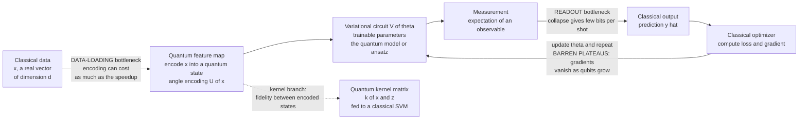

# 🧠 Quantum Machine Learning

> [!abstract] TL;DR
> **Quantum machine learning (QML)** is the intersection of quantum computing and ML — one of the field's most *hyped* and most *misunderstood* frontiers. Three paradigms dominate. **(1) Quantum linear algebra**: algorithms like **HHL** for linear systems, **quantum PCA**, and quantum recommendation promised *exponential* speedups on paper. **(2) Variational / near-term QML**: **parameterized quantum circuits (PQCs)** act as trainable models — the quantum analog of neural networks — tuned by a *classical* optimizer in a hybrid loop, exactly the [[Quantum_Simulation_and_VQE|VQE]] template pointed at data instead of chemistry. **(3) Quantum kernel methods**: encode classical data into the exponentially large quantum Hilbert space via a **feature map**, then measure similarities there as a **kernel**, feeding a classical [[SVM|support vector machine]]. The catch is that the hype outran the physics. Three obstacles temper it: the **data-loading bottleneck** (getting a big classical dataset *into* a quantum state can cost as much as the speedup it buys), the **readout bottleneck** (measurement collapses the state and returns only a trickle of classical bits), and **barren plateaus** (gradients of large random PQCs vanish *exponentially* with qubit count, making training intractable). Worse, **Ewin Tang's dequantization** results produced *classical* algorithms matching the claimed exponential speedups of quantum recommendation and PCA — showing many "quantum advantages" were illusions once classical sampling caught up. The honest 2020s verdict: **no proven practical quantum advantage for classical-data ML yet**, but genuine promise for learning on **quantum data** — states from quantum sensors and simulators — and for quantum chemistry and materials.

---

## Intuition

**Analogy — the impossibly large filing cabinet with a keyhole letterbox.** Imagine you want to sort a pile of documents by similarity. A classical clerk lays them on a big table and compares them. QML instead promises a *filing cabinet the size of the observable universe*: `n` qubits give you a `2^n`-dimensional space of quantum states — a **feature space** so vast no classical computer could ever write it down. You map each document into a single location in that cabinet (a quantum state), and the cabinet's geometry can make documents that looked hopelessly tangled on the flat table become cleanly separable inside. A quantum **kernel** is a machine that reaches into this cabinet and measures how close any two documents landed. Sounds unbeatable — until you notice two problems. **Getting data in**: the cabinet has only a narrow slot, and stuffing a million documents through it one bit at a time can take as long as the sorting you were trying to speed up. **Getting answers out**: the cabinet has a tiny keyhole letterbox — every time you peek, the state *collapses* and you learn only a single random bit, so extracting a full answer needs enormous repetition.

The vast space is real and beautiful; the two doors are the whole problem. That tension — **exponential space, but bottlenecked input and output** — is the single most important thing to understand about QML before any equation, and it is why a field that *should* obviously win so often does not.

---

## How It Works

### Core Mechanics

QML is not one algorithm but three loosely related programs, plus a set of shared obstacles.

**1. Quantum linear algebra (the "exponential speedup on paper" branch).** Much of ML is linear algebra: solving `A x = b`, finding principal components, inverting covariance matrices. The **HHL algorithm** (Harrow-Hassidim-Lloyd, 2009) solves a linear system in time `O(log N)` — exponentially faster than the `O(N)` a classical solver needs *to read the answer*. **Quantum PCA** and quantum recommendation systems followed. But the fine print is brutal: HHL needs `b` already loaded as a quantum state (the **data-loading** problem), needs `A` to be sparse and well-conditioned, and returns the solution `x` *as a quantum state you cannot fully read* (the **readout** problem). You get *statistics about* `x`, not `x` itself. See [[Linear_Algebra_for_Quantum_Computing]] for the Hilbert-space, unitary, and eigendecomposition machinery these algorithms lean on.

**2. Variational / near-term QML (the quantum neural network).** On today's noisy hardware the practical template is a **parameterized quantum circuit** used as a trainable model, structured exactly like a neural network:
- **Data encoding / feature map.** A classical input `x` is loaded by a data-dependent circuit `U(x)` — commonly **angle encoding**, where features become rotation angles. This is the quantum analog of the input layer, and it is the *nonlinear feature map* that lifts data into Hilbert space.
- **Ansatz (variational block).** A circuit `V(θ)` of trainable rotation angles `θ` interleaved with entangling gates — the analog of hidden layers and weights.
- **Measurement.** The expectation of an observable, e.g. `⟨Z⟩` on one qubit, becomes the model's scalar output — the analog of the output neuron.
- **Hybrid training loop.** A *classical* optimizer computes a loss and updates `θ` (gradients via the **parameter-shift rule**), then reruns the quantum circuit. Same guess-measure-improve loop as [[Quantum_Simulation_and_VQE|VQE]] and the same idea underlying the **QAOA** optimization algorithm — only the objective changes.

**3. Quantum kernel methods (the feature-space branch).** Rather than *train* a deep circuit, fix a feature map `|φ(x)⟩ = U(x)|0⟩` and use only the *inner products* between encoded states as a **kernel**:
`k(x, z) = |⟨φ(x)|φ(z)⟩|²` — the **fidelity** between two encoded states.
Compute this Gram matrix on the quantum device, then hand it to a *classical* [[SVM|kernel SVM]]. The hope: a feature map so expressive (living in `2^n` dimensions) that no efficient classical kernel can reproduce it, yielding a provable learning separation. The mechanics mirror the classical **kernel trick** — you never form the feature vectors explicitly, only their similarities.

**The four obstacles that temper the hype.**
- **Data-loading bottleneck.** Encoding a general `N`-dimensional classical vector into amplitudes needs `O(N)` operations (or expensive **QRAM** that does not yet exist at scale) — often erasing the very speedup it enables.
- **Readout bottleneck.** Measurement collapses the state; each shot yields a few classical bits, so reading a full answer demands many repetitions, and variance shrinks only as `1/sqrt(shots)`.
- **Barren plateaus.** For deep, random, hardware-efficient PQCs the gradient variance **vanishes exponentially** in qubit count (McClean et al., 2018). The loss landscape becomes an exponentially flat desert — the optimizer sees noise, not slope, and cannot train. This is the same trainability wall that haunts VQE and QAOA.
- **Dequantization.** Ewin Tang (2018-19), then a teenager, built *classical* sampling algorithms that match the runtime of quantum recommendation and quantum PCA under the same assumptions — proving those "exponential quantum advantages" were illusory. This reshaped the field's expectations overnight and connects directly to complexity-theory questions about **BQP** versus classical classes.

### The QML Pipeline and Its Two Doors



*The solid loop is the variational quantum-neural-network path; the dashed branch is the kernel path that reuses the same feature map but measures similarities instead of training a deep circuit. The two edge labels mark the input and output doors; the feedback edge marks the barren-plateau training wall.*

---

## Key Concepts

**Secondary (the big picture)**
- **Exponential feature space.** `n` qubits describe a `2^n`-dimensional space; QML tries to use it as a giant feature space where hard data becomes separable.
- **Two doors.** Getting classical data *in* (loading) and getting answers *out* (measurement/readout) are the recurring bottlenecks that can eat any speedup.
- **Quantum neural network.** A parameterized quantum circuit trained by a classical optimizer is the quantum analog of a neural net — encode, transform, measure, adjust, repeat.
- **Reality vs hype.** No proven practical advantage for ordinary big-data ML yet; the credible promise is *quantum data* and chemistry, not sorting cat photos.

**Undergraduate (the machinery)**
- **Angle encoding and feature maps.** Classical features become rotation angles; the encoding circuit is a *nonlinear* map into Hilbert space, exactly analogous to the kernel feature map behind an [[SVM]].
- **Quantum kernel.** `k(x, z) = |⟨φ(x)|φ(z)⟩|²`, the state fidelity, forms a Gram matrix handed to a classical kernel classifier.
- **Parameter-shift rule.** Exact gradients of `⟨Z⟩` with respect to a rotation angle come from evaluating the circuit at `θ ± π/2` — no finite differences needed.
- **Hybrid loop.** Quantum device evaluates the model and gradients; classical optimizer updates parameters — the same architecture as [[Quantum_Simulation_and_VQE|VQE]] and QAOA.
- **HHL and quantum PCA.** Log-time linear algebra *conditional* on data already being quantum, sparse, well-conditioned, and only statistics being read out.

**Graduate (the frontier)**
- **Barren plateaus.** Gradient variance scales like `2^{-n}` for circuits approximating unitary 2-designs; global cost functions and deep unstructured ansätze are worst. Mitigations: local cost functions, shallow/structured ansätze, layerwise training, clever initialization — none a full cure.
- **Dequantization.** Quantum-inspired classical algorithms with `l2`-sampling access (Tang; Chia et al.) match quantum recommendation, PCA, and low-rank linear-system runtimes, collapsing claimed exponential separations to polynomial — a lesson about *assumptions* smuggled into quantum speedup claims.
- **Provable learning separations.** Genuine advantage is provable for *learning quantum-generated distributions* and *quantum states* (Huang et al., 2021-22): with quantum memory, learning properties of quantum systems needs exponentially fewer samples — advantage that lives on **quantum data**, not classical.
- **Expressivity vs trainability vs generalization.** A more expressive feature map or ansatz can worsen barren plateaus and hurt generalization — the quantum echo of the bias-variance and overparameterization debates in classical [[Neural_Network_Basics|deep learning]].
- **Kernel concentration.** High-dimensional quantum kernels can concentrate toward a constant off-diagonal value as qubits grow, making all points look equidistant — a kernel-side analog of the barren plateau that quietly destroys classification power.

---

## Python Demo

Two demonstrations, numpy and matplotlib only, no quantum SDK. **First**, a *quantum kernel classifier*: encode 2D points into a 4-qubit state by **angle encoding** with a nonlinear feature map, compute the **quantum kernel** as the fidelity `|⟨φ(x)|φ(z)⟩|²` (a Gram matrix), and use kernel-ridge classification to separate **concentric circles** — a nonlinearly separable dataset — then compare to a classical RBF kernel. **Second**, the **barren-plateau** effect: build random parameterized circuits and show the gradient variance shrinking exponentially with qubit count.

```python
# Quantum kernels + barren plateaus, from scratch with numpy/matplotlib only.
# Part A: a QUANTUM KERNEL (state fidelity) classifier on concentric circles,
#         vs a classical RBF kernel -- illustrating the feature-map idea.
# Part B: BARREN PLATEAUS -- gradient variance of random PQCs vs qubit count.
import numpy as np
import matplotlib.pyplot as plt

rng = np.random.default_rng(0)

# ---------- shared single-qubit gate ----------
def Ry(t):
    c, s = np.cos(t / 2.0), np.sin(t / 2.0)
    return np.array([[c, -s], [s, c]], dtype=complex)

ket0 = np.array([1.0, 0.0], dtype=complex)

# ============================================================
# PART A -- QUANTUM KERNEL CLASSIFIER
# ============================================================
# Nonlinear ANGLE-ENCODING feature map: a 2D point x=(a,b) is mapped to four
# rotation angles. Crucially we include the radial term a^2+b^2, so concentric
# circles (separated purely by radius) become linearly separable in feature
# space -- the whole point of a feature map.
def feature_angles(X):                       # X: (N,2) -> (N,4) angles
    a, b = X[:, 0], X[:, 1]
    r2 = a * a + b * b
    return np.pi * np.stack([a, b, r2, a * b], axis=1)

def encode_state(x):
    """Build the actual 4-qubit quantum state |phi(x)> = tensor_i Ry(ang_i)|0>."""
    angs = np.pi * np.array([x[0], x[1], x[0]**2 + x[1]**2, x[0] * x[1]])
    psi = np.array([1.0 + 0j])
    for a in angs:
        psi = np.kron(psi, Ry(a) @ ket0)
    return psi

def quantum_kernel_matrix(A, B):
    """k(x,z) = |<phi(x)|phi(z)>|^2. For product angle-encoding this factorizes
    into a product of per-qubit fidelities cos^2((ai-bj)/2) -- vectorized here."""
    Aa, Bb = feature_angles(A), feature_angles(B)          # (Na,4),(Nb,4)
    diff = Aa[:, None, :] - Bb[None, :, :]                 # (Na,Nb,4)
    return np.prod(np.cos(diff / 2.0) ** 2, axis=2)        # (Na,Nb)

# sanity check: vectorized kernel == explicit state fidelity
p, q = np.array([0.3, -0.4]), np.array([-0.2, 0.5])
fid = np.abs(np.vdot(encode_state(p), encode_state(q))) ** 2
assert abs(fid - quantum_kernel_matrix(p[None], q[None])[0, 0]) < 1e-12
print("kernel==fidelity check passed:", round(float(fid), 4))

# ---------- concentric-circles dataset ----------
def make_circles(n, noise=0.06, r_inner=0.35, r_outer=0.85):
    m = n // 2
    th1 = rng.uniform(0, 2 * np.pi, m)
    th2 = rng.uniform(0, 2 * np.pi, n - m)
    inner = np.c_[r_inner * np.cos(th1), r_inner * np.sin(th1)]
    outer = np.c_[r_outer * np.cos(th2), r_outer * np.sin(th2)]
    X = np.vstack([inner, outer]) + rng.normal(0, noise, (n, 2))
    y = np.hstack([-np.ones(m), np.ones(n - m)])           # labels in {-1,+1}
    return X, y

Xtr, ytr = make_circles(120)

def rbf_matrix(A, B, gamma=4.0):
    d2 = (np.sum(A**2, 1)[:, None] + np.sum(B**2, 1)[None, :] - 2 * A @ B.T)
    return np.exp(-gamma * d2)

def fit_kernel_ridge(K, y, lam=1e-2):
    return np.linalg.solve(K + lam * np.eye(len(y)), y)    # dual weights alpha

# fit both classifiers
alpha_q = fit_kernel_ridge(quantum_kernel_matrix(Xtr, Xtr), ytr)
alpha_c = fit_kernel_ridge(rbf_matrix(Xtr, Xtr), ytr)

def acc(Kxx, alpha, y):
    return float(np.mean(np.sign(Kxx @ alpha) == y))
print("quantum-kernel train acc:",
      round(acc(quantum_kernel_matrix(Xtr, Xtr), alpha_q, ytr), 3))
print("classical RBF  train acc:",
      round(acc(rbf_matrix(Xtr, Xtr), alpha_c, ytr), 3))

# decision-boundary grid
g = np.linspace(-1.1, 1.1, 140)
GX, GY = np.meshgrid(g, g)
grid = np.c_[GX.ravel(), GY.ravel()]
Zq = np.sign(quantum_kernel_matrix(grid, Xtr) @ alpha_q).reshape(GX.shape)
Zc = np.sign(rbf_matrix(grid, Xtr) @ alpha_c).reshape(GX.shape)

# ============================================================
# PART B -- BARREN PLATEAUS
# ============================================================
# Random hardware-efficient circuits: L layers of random Ry rotations + a linear
# chain of CNOTs. Observable = Z on qubit 0. We measure Var over random theta of
# the gradient d<Z0>/d(theta_0) via the parameter-shift rule, for n = 2..8 qubits.
def apply_1q(psi, gate, q, n):
    psi = psi.reshape([2] * n)
    psi = np.tensordot(gate, psi, axes=(1, q))
    psi = np.moveaxis(psi, 0, q)
    return psi.reshape(2 ** n)

def apply_cnot(psi, c, n):                    # control c, target c+1 (adjacent)
    psi = psi.reshape([2] * n)
    psi = np.moveaxis(psi, [c, c + 1], [0, 1]).copy()
    psi[1] = psi[1][::-1]                      # flip target where control==1
    return np.moveaxis(psi, [0, 1], [c, c + 1]).reshape(2 ** n)

def circuit_state(thetas, n, L):
    psi = np.zeros(2 ** n, dtype=complex); psi[0] = 1.0
    k = 0
    for _ in range(L):
        for q in range(n):
            psi = apply_1q(psi, Ry(thetas[k]), q, n); k += 1
        for c in range(n - 1):
            psi = apply_cnot(psi, c, n)
    return psi

def cost_Z0(thetas, n, L):                    # <psi| Z0 |psi>
    psi = circuit_state(thetas, n, L)
    Zdiag = np.array([1.0 if (i >> (n - 1)) == 0 else -1.0 for i in range(2 ** n)])
    return float(np.real(np.sum(np.conj(psi) * Zdiag * psi)))

def grad0(thetas, n, L):                       # parameter-shift on theta_0
    tp, tm = thetas.copy(), thetas.copy()
    tp[0] += np.pi / 2; tm[0] -= np.pi / 2
    return 0.5 * (cost_Z0(tp, n, L) - cost_Z0(tm, n, L))

qubits = range(2, 9)
S = 300
variances = []
for n in qubits:
    L = n                                      # depth grows -> stronger plateau
    grads = [grad0(rng.uniform(0, 2 * np.pi, n * L), n, L) for _ in range(S)]
    variances.append(np.var(grads))
    print(f"n={n}  Var[grad] = {variances[-1]:.3e}")

# ============================================================
# PLOTS
# ============================================================
fig, ax = plt.subplots(1, 3, figsize=(16, 4.8))
for a, Z, title in [(ax[0], Zq, "Quantum kernel (fidelity feature map)"),
                    (ax[1], Zc, "Classical RBF kernel")]:
    a.contourf(GX, GY, Z, levels=[-2, 0, 2], colors=["#bfdbfe", "#fecaca"], alpha=0.8)
    a.scatter(Xtr[ytr < 0, 0], Xtr[ytr < 0, 1], s=14, c="#1d4ed8", label="inner")
    a.scatter(Xtr[ytr > 0, 0], Xtr[ytr > 0, 1], s=14, c="#b91c1c", label="outer")
    a.set_title(title); a.set_aspect("equal"); a.legend(loc="upper right", fontsize=8)

ax[2].semilogy(list(qubits), variances, "o-", color="#7c3aed", label="Var[grad]")
ref = variances[0] * (2.0 ** -(np.array(list(qubits)) - qubits.start))
ax[2].semilogy(list(qubits), ref, "--", color="#6b7280", label="2^(-n) reference")
ax[2].set_xlabel("number of qubits n"); ax[2].set_ylabel("gradient variance")
ax[2].set_title("Barren plateau: gradients vanish exponentially")
ax[2].legend()
plt.tight_layout()
plt.savefig("qml_demo.png", dpi=130)
print("saved qml_demo.png")

# Takeaways:
#  * The quantum feature map lifts concentric circles into a 4-qubit Hilbert
#    space where they separate cleanly -- the SAME idea as a classical kernel,
#    just computed as a state fidelity |<phi(x)|phi(z)>|^2.
#  * The classical RBF kernel solves this toy problem just as well: on ordinary
#    classical data a quantum kernel has no guaranteed edge (cf. dequantization).
#  * Var[grad] tracks the 2^(-n) reference line: as qubits grow, the training
#    signal drowns in an exponentially flat landscape -- the barren plateau.
```

Running it prints the fidelity/kernel sanity check, near-perfect train accuracy for *both* kernels on the circles (the quantum feature map works — but so does the classical one), the shrinking `Var[grad]` per qubit count, and saves a 3-panel figure: quantum-kernel boundary, RBF boundary, and the barren-plateau curve hugging the `2^{-n}` reference line.

---

## Real-World Applications

> **Example — IBM's quantum-kernel classifier and where advantage really lives.** Havlíček et al. (IBM, *Nature* 2019) ran a **variational quantum classifier** and a **quantum kernel SVM** on superconducting hardware, encoding data with a **ZZ feature map** whose kernel is conjectured hard to evaluate classically. It worked on small crafted datasets — but on generic classical data no robust advantage emerged, and follow-up work showed such kernels often *concentrate* and lose power as qubits scale. The clearest genuine wins have come on **quantum data**: Google/Caltech (Huang et al., *Science* 2022) demonstrated an *exponential* sample-complexity advantage for learning properties of physical systems when a quantum memory holds the states directly — advantage that classical data can never confer.

- **Quantum chemistry and materials ML.** The most defensible near-term target: learning surrogate models and potential-energy surfaces where the *data itself is quantum*, dovetailing with [[Quantum_Simulation_and_VQE|VQE]] output rather than classical big data.
- **Quantum sensing and metrology.** Classifying or estimating parameters of quantum states straight from **quantum sensors** — no lossy classical readout in between — is exactly the quantum-data regime where separations are provable.
- **Generative modeling of quantum distributions.** Quantum circuit Born machines learn distributions that are provably hard to sample classically, a niche with rigorous complexity backing.
- **High-energy physics and finance pilots.** CERN, and banks like JPMorgan, run small QML pilots (jet tagging, portfolio classification) — instructive benchmarks, but honest reports frame them as *research*, not deployed advantage.
- **Hybrid feature extraction.** PQCs used as one differentiable layer inside a classical [[Neural_Network_Basics|neural network]], trained end-to-end — a pragmatic bridge while fault-tolerant hardware matures.

---

## Common Pitfalls

- **"Exponential Hilbert space means exponential speedup."** The `2^n` space is real, but the **data-loading** and **readout** doors are narrow. Loading an `N`-vector generally costs `O(N)`, and you can never read the full output — so the naive speedup usually evaporates. Always account for both doors before claiming an edge.
- **Ignoring dequantization.** Before asserting a quantum-ML speedup over classical, check whether a **quantum-inspired classical** algorithm (Tang, Chia et al.) already matches it under the same sampling assumptions. Many headline claims did not survive this test.
- **Scaling a PQC by adding depth/qubits.** More layers seem more expressive, but deep random circuits hit **barren plateaus**: gradient variance `~2^{-n}` turns training into a flat desert. Use structured, shallow, or problem-informed ansätze and local cost functions instead.
- **Confusing quantum advantage on quantum data with advantage on classical data.** Provable separations exist for learning *quantum* states and distributions. Extrapolating them to ordinary tabular or image data is the field's most common overclaim.
- **Treating measurement as free.** Each expectation is a statistical estimate with error `~1/sqrt(shots)`; chemical- or classification-grade precision can demand millions of shots per step, and NISQ noise adds bias on top — often the true bottleneck, not gate count.
- **Kernel concentration.** As qubits grow, quantum kernels can drift toward a constant off-diagonal value, making all points look equidistant and silently destroying classification power — the kernel-side twin of the barren plateau.
- **Benchmarking on toy data and declaring victory.** A quantum kernel separating concentric circles proves the feature-map *mechanism*, not an *advantage* — a two-line classical RBF does the same, as the demo shows.

---

## Related Concepts

- [[Quantum_Simulation_and_VQE]] — the variational hybrid loop QML's near-term branch is built on; VQE is the same PQC-plus-classical-optimizer template aimed at chemistry, and shares the barren-plateau obstacle. QML's most credible advantage sits on VQE-style *quantum data*.
- [[Linear_Algebra_for_Quantum_Computing]] — the Hilbert-space, unitary, inner-product, and eigendecomposition toolkit behind HHL, quantum PCA, and the fidelity kernel `|⟨φ(x)|φ(z)⟩|²`.
- [[Error_Mitigation_in_the_NISQ_Era]] — the noise-suppression techniques (ZNE, PEC, readout correction) that make near-term QML circuits produce usable numbers at the cost of exponential shot overhead.
- [[SVM]] — the classical kernel machine (aliased *Kernel Methods*) that a quantum kernel feeds; QML's kernel branch is a direct quantum reimagining of the kernel trick and feature maps.
- [[PCA]] — the classical dimensionality-reduction method whose *quantum PCA* speedup was among the headline claims later **dequantized** by Tang, the canonical QML reality check.
- [[Neural_Network_Basics]] — the classical model a PQC is the "quantum analog" of; encoding-ansatz-measurement mirrors input-hidden-output, and expressivity/generalization debates carry over.

> Related sibling notes not yet in the vault (create and backlink later): **Quantum_Optimization_and_QAOA** (shares the variational template and barren plateaus), **Quantum_Complexity_Theory_and_BQP** (the BQP-vs-classical framing behind dequantization), and **Near_Term_Quantum_Applications** (the honest NISQ-utility landscape).

---

## Review Questions

1. **(Secondary)** A colleague says "quantum computers have an exponentially large state space, so they must be exponentially faster at machine learning." Using the "impossibly large filing cabinet with a keyhole letterbox" analogy, explain the two doors that usually spoil this reasoning.
2. **(Undergraduate)** You build a quantum kernel classifier by angle-encoding 2D points and using `k(x, z) = |⟨φ(x)|φ(z)⟩|²` inside an SVM. Explain precisely how this parallels the classical kernel trick, why including a radial term in the feature map lets it separate concentric circles, and why succeeding on this toy problem does *not* demonstrate a quantum advantage.
3. **(Graduate)** You are asked to justify a QML research direction to a skeptical review board. Address three points: (a) why **barren plateaus** make naively scaling a variational quantum neural network intractable and what mitigations exist; (b) what **Ewin Tang's dequantization** results imply about claimed exponential speedups for quantum recommendation and PCA; and (c) why learning on **quantum data** — rather than classical data — is where provable advantage most credibly lives.

---

## Sources

- Biamonte, J. et al. "Quantum Machine Learning," *Nature* 549 (2017): 195–202 — the canonical survey of the three QML paradigms. [arXiv:1611.09347](https://arxiv.org/abs/1611.09347)
- Havlíček, V. et al. "Supervised Learning with Quantum-Enhanced Feature Spaces," *Nature* 567 (2019): 209–212 — quantum kernel and variational classifiers on hardware, the ZZ feature map. [arXiv:1804.11326](https://arxiv.org/abs/1804.11326)
- McClean, J. R. et al. "Barren Plateaus in Quantum Neural Network Training Landscapes," *Nature Communications* 9 (2018): 4812 — the exponential gradient-vanishing result. [arXiv:1803.11173](https://arxiv.org/abs/1803.11173)
- Tang, E. "A Quantum-Inspired Classical Algorithm for Recommendation Systems," *STOC* 2019 — the dequantization that erased a headline QML speedup. [arXiv:1807.04271](https://arxiv.org/abs/1807.04271)
- Huang, H.-Y. et al. "Quantum Advantage in Learning from Experiments," *Science* 376 (2022): 1182–1186 — provable exponential advantage for learning on quantum data. [arXiv:2112.00778](https://arxiv.org/abs/2112.00778)

---

#quantum-computing #quantum-machine-learning #quantum-kernels #variational-circuits #barren-plateaus
