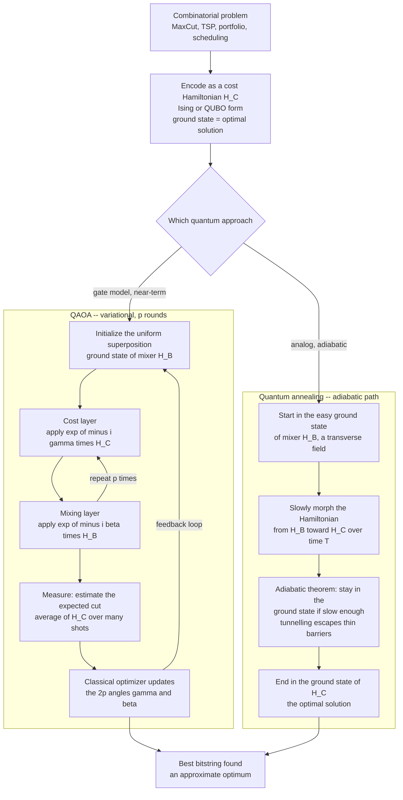

# ⚛️ Quantum Optimization and QAOA

> [!abstract] TL;DR
> **Quantum optimization** attacks hard **combinatorial** problems — MaxCut, traveling salesman, portfolio selection, scheduling — by a single unifying trick: encode the problem's cost function as the **energy of a quantum system** (an **Ising model** / **QUBO** Hamiltonian `H_C`) so that the **lowest-energy configuration is the optimal solution**, then use quantum dynamics to steer toward that ground state. Two flavours dominate. **Quantum annealing** (the *adiabatic* route, realised by D-Wave at thousands of qubits) starts in the easy ground state of a simple transverse-field Hamiltonian and **slowly morphs** it into `H_C`; the **adiabatic theorem** promises the system stays in the ground state if the change is slow enough, ending in the answer, with **quantum tunnelling** helping escape traps that block classical hill-descent. The **QAOA** (Quantum Approximate Optimization Algorithm, Farhi-Goldstone-Gutmann 2014) is a **gate-model, variational, NISQ-friendly** cousin: alternate a **cost-phase layer** `e^{-i \gamma H_C}` and a **mixing layer** `e^{-i \beta H_B}` for `p` rounds, then let a **classical optimizer** tune the `2p` angles `\gamma, \beta` to maximize the expected objective — a Trotterized discretization of the adiabatic path that becomes exact as `p \to \infty`. It is the **same hybrid variational paradigm as [[Quantum_Simulation_and_VQE|VQE]]** (QAOA for optimization, VQE for chemistry). The honest verdict: optimization is *the* most-hoped-for near-term application, yet **no clear, scalable quantum speedup over the best classical heuristics has been demonstrated** — barren plateaus, hard parameter optimization, and **[[Error_Mitigation_in_the_NISQ_Era|NISQ noise]]** all bite, and classical algorithms often match or beat both QAOA and annealing. It remains a **research vehicle**, not yet a proven advantage.

---

## Intuition

**Analogy — a landscape of hills and valleys, and a ball that must find the deepest valley.** Imagine every possible solution to your problem laid out on a vast terrain, where **altitude = cost**: bad solutions sit on high peaks, good ones in low valleys, and the single best solution is the **deepest valley of all**. Optimization *is* the search for that deepest point. A classical greedy method is a ball that rolls **downhill** — fast, but it gets stuck in the first small dip it finds (a *local* minimum) with no way to climb back out. **Simulated annealing** shakes the ball with "thermal" jitter so it can occasionally hop over ridges. The quantum idea is different and more radical: **make the terrain itself the energy of a quantum system**, and let quantum mechanics find the bottom.

Translated into physics: we build a Hamiltonian `H_C` whose energy for each candidate solution equals that solution's cost, so the **ground state (lowest-energy configuration) is the optimal answer**. Then the two methods diverge. **Quantum annealing** rolls slowly downhill and *stays in the valley* — it begins in a smooth, easy landscape with one obvious minimum and **gradually deforms** that landscape into the rugged problem terrain, slow enough that the ball never gets kicked up out of the ground state; where a classical ball would be trapped behind a thin, tall barrier, a quantum ball can **tunnel straight through it**. **QAOA** instead applies a repeating pair of nudges — a **"cost" nudge** that pushes amplitude toward low-cost states and a **"mixing" nudge** that lets amplitude flow between neighbouring configurations — with the *strength* of each nudge (`\gamma` and `\beta`) tuned by a classical optimizer until the quantum state piles up on good solutions. Same goal, two choreographies for reaching the bottom.

---

## How It Works

### Core Mechanics

**1. Map the problem to a cost Hamiltonian (the shared foundation).**
Nearly every combinatorial problem can be written as minimizing a quadratic function of binary variables — a **QUBO** (Quadratic Unconstrained Binary Optimization), equivalently an **Ising model** with spins `s_i \in \{+1, -1\}` and energy `E(s) = \sum_{i<j} J_{ij} s_i s_j + \sum_i h_i s_i`. Andrew Lucas (2014) catalogued Ising formulations for essentially all of Karp's NP-complete problems (see [[NP_Completeness_and_the_Cook_Levin_Theorem]]). Promoting each spin to a Pauli `Z` operator turns `E(s)` into a **diagonal cost Hamiltonian** `H_C`: its eigenvalue on a computational-basis state `|z\rangle` is exactly that assignment's cost. **The optimal solution = the ground state of `H_C`.** For **MaxCut** on a graph, `H_C = \sum_{(i,j)\in E} \tfrac12(I - Z_i Z_j)` counts the number of edges "cut" between the two vertex groups, and we want to *maximize* it. This is the same "cost = energy" bridge to [[Classical_Statistical_Mechanics|statistical mechanics]] that makes the Boltzmann distribution `e^{-\beta E}` and the notion of a *frustrated* ground state directly relevant.

**2. Quantum annealing — the adiabatic route.**
- **Start easy.** Begin in the ground state of a simple **mixer** Hamiltonian `H_B = -\sum_i X_i` (a *transverse field*). Its ground state is the uniform superposition `|+\rangle^{\otimes n}` — trivial to prepare.
- **Morph slowly.** Interpolate `H(s) = 1 - s` times `H_B` plus `s` times `H_C`, sweeping `s` from `0` to `1` over an annealing time `T`.
- **The adiabatic theorem.** If the evolution is slow *relative to the minimum spectral gap* between the ground and first excited state, the system **stays in the instantaneous ground state** the whole way — so at `s = 1` it sits in the ground state of `H_C`, the answer. The required `T` scales like the inverse square of that minimum gap, and for hard instances the gap can shrink **exponentially**, which is exactly where the advantage evaporates.
- **Tunnelling vs thermal hopping.** Where classical **simulated annealing** must climb *over* an energy barrier (probability `\sim e^{-\text{height}/T}`), quantum annealing can **tunnel through** thin barriers — the hoped-for edge. **D-Wave** builds superconducting-flux hardware implementing this at the scale of **thousands of qubits**, but its advantage over tuned classical solvers remains **contested and unproven** (Rønnow et al. 2014). Real devices also run at nonzero temperature with limited coherence, blurring the clean adiabatic story.

**3. QAOA — the gate-model, variational route.**
QAOA discretizes the adiabatic path into `p` alternating layers, each with its own tunable angle, making it runnable on today's gate-based NISQ machines:
- **Initialize** in `|+\rangle^{\otimes n}` (the mixer ground state).
- **Repeat `p` times:** apply the **cost layer** `U_C(\gamma) = e^{-i\gamma H_C}` (a diagonal phase that "marks" states by their cost), then the **mixing layer** `U_B(\beta) = e^{-i\beta H_B}` (which spreads amplitude between neighbouring bitstrings). This yields `|\gamma, \beta\rangle = U_B(\beta_p) U_C(\gamma_p) \cdots U_B(\beta_1) U_C(\gamma_1) |+\rangle^{\otimes n}`.
- **Measure** to estimate the expected objective `F(\gamma, \beta) = \langle \gamma, \beta | H_C | \gamma, \beta \rangle` over many shots.
- **Classically optimize** the `2p` angles to maximize `F`, then loop — the identical **quantum-classical feedback loop** used by [[Quantum_Simulation_and_VQE|VQE]], with a classical routine such as [[Gradient_Descent|gradient descent]], COBYLA, or SPSA closing it.
- **Why it converges.** A Trotterized adiabatic evolution *is* a sequence of alternating `H_C` and `H_B` exponentials, so QAOA **contains adiabatic evolution as a special case** and becomes exact as `p \to \infty`. At finite `p` (the near-term regime) it is a heuristic whose quality depends on `p`, the problem structure, and how well the classical optimizer finds good angles.

**4. Honest assessment.** Both routes face the **crucial open question**: do they give any genuine speedup over the *best classical heuristics*? So far the answer is **no clear, scalable advantage** — classical solvers (SDP relaxations like Goemans-Williamson for MaxCut, simulated annealing, tensor networks, tabu search) often **match or beat** QAOA and annealing on the sizes tested. The hype-vs-evidence gap here is large.

### QAOA loop and the adiabatic alternative



*QAOA is the discretized, parameter-tunable cousin of the smooth adiabatic sweep: the same two ingredients — a cost Hamiltonian and a mixer — are interleaved either continuously (annealing) or as `p` discrete layers with tuned angles (QAOA).*

---

## Key Concepts

**Secondary (the big picture)**
- **Cost = energy.** Rewrite an optimization problem so each candidate solution's *cost* becomes the *energy* of a quantum system; the best solution is then the **lowest-energy state** (the ground state).
- **Two ways to reach the bottom.** *Quantum annealing* starts in a simple landscape and slowly reshapes it into the hard one, staying in the valley the whole time. *QAOA* alternates two nudges — a "cost" nudge and a "mixing" nudge — whose strengths are dialed in by a classical helper.
- **Tunnelling.** A quantum ball can pass *through* a thin barrier that a classical ball would have to climb over — the intuitive source of hoped-for advantage.
- **Honesty.** This is the most-hyped near-term use of quantum computers, but **no proven, scalable speedup over good classical algorithms exists yet**.

**Undergraduate (the machinery)**
- **QUBO and the Ising model.** `E(s) = \sum J_{ij} s_i s_j + \sum h_i s_i` with `s_i = \pm 1`; promoting spins to Pauli `Z` gives a **diagonal** cost Hamiltonian `H_C`. MaxCut: `H_C = \sum_{(i,j)} \tfrac12(I - Z_iZ_j)`.
- **The mixer.** `H_B = \sum_i X_i`; its exponential `e^{-i\beta H_B}` mixes amplitude between bitstrings because the `X_i` commute, factoring into single-qubit rotations.
- **The adiabatic theorem.** Stay in the ground state if the sweep time `T` exceeds roughly `1/g_{\min}^2`, where `g_{\min}` is the minimum energy gap along the path — the gap governs everything.
- **QAOA as Trotterized annealing.** Alternating `e^{-i\gamma H_C}` and `e^{-i\beta H_B}` layers approximate the continuous adiabatic sweep; exactness in the `p \to \infty` limit.
- **The variational loop.** A classical optimizer maximizes `F(\gamma,\beta) = \langle H_C \rangle` over `2p` angles — the same hybrid structure as [[Quantum_Simulation_and_VQE|VQE]], except VQE *minimizes* an energy for chemistry while QAOA *maximizes* an objective for optimization.
- **Approximation ratio.** QAOA is *approximate*: quality is measured as expected-cut divided by optimal-cut; `p=1` MaxCut on 3-regular graphs guarantees `\geq 0.6924`, still below the classical Goemans-Williamson `0.878` SDP bound.

**Graduate (the frontier)**
- **Barren plateaus.** For deep or poorly structured circuits the objective's gradient can vanish **exponentially** in qubit count, leaving the classical optimizer on a flat landscape (McClean et al. 2018) — the same disease that afflicts VQE and [[Quantum_Simulation_and_VQE|variational quantum eigensolvers]] generally.
- **Non-convex parameter optimization.** The `\gamma,\beta` landscape is riddled with local optima; the outer classical problem is itself NP-hard-flavoured. Warm-starting, parameter-transfer between instances, and INTERP/FOURIER heuristics exploit landscape *concentration* (similar optima across instances) to sidestep it.
- **Gap-dependent annealing time.** For problems with an exponentially closing minimum gap (first-order quantum phase transitions), adiabatic runtime is exponential — annealing then has *no* asymptotic edge, and diabatic/reverse-annealing schedules are studied to beat the naive bound.
- **Speedup evidence.** Rønnow et al. (2014) formalized "**defining and detecting quantum speedup**" and found **no** scalable speedup for D-Wave versus optimized classical solvers on random instances; specific structured instances remain debated. The burden of proof is unmet.
- **Quantum-inspired spinoffs.** The main *demonstrated* payoff so far is classical: tensor-network and simulated-annealing methods sharpened by studying QAOA/annealing — a genuine, if ironic, benefit adjacent to [[Grovers_Search_Algorithm|Grover-style]] quadratic-speedup search, the one place a *provable* (though modest) quantum advantage for unstructured search exists.
- **Where hope remains.** Higher-depth `p`, better classical-parameter strategies, exploiting problem structure, custom mixers (e.g. XY mixers preserving constraints), and specific instance families — none yet delivering clear, scalable practical advantage.

---

## Python Demo

Full **QAOA for MaxCut by exact state-vector simulation**, using only numpy and matplotlib. We build the **diagonal cost Hamiltonian** counting cut edges, build the **transverse-field mixer**, implement the QAOA circuit as **matrix exponentials** for `p=1` and `p=2`, **scan and optimize** the `\gamma, \beta` angles to *maximize* the expected cut, then plot the `p=1` **parameter landscape** and the final **measurement distribution concentrating on the optimal cut**. The graph is a 5-cycle: an *odd* ring that cannot be 2-colored perfectly, so one edge must stay uncut and the **max cut is 4 of 5 edges** — a concrete taste of Ising *frustration*.

```python
# QAOA for MAX-CUT by exact state-vector simulation. numpy + matplotlib only.
# (1) build the diagonal cost Hamiltonian counting cut edges,
# (2) build the transverse-field mixer,
# (3) run p=1 and p=2 QAOA as matrix exponentials,
# (4) scan/optimize the gamma-beta angles to MAXIMIZE the expected cut,
# (5) plot the p=1 landscape and the optimized measurement distribution.
import numpy as np
import matplotlib.pyplot as plt

np.random.seed(0)

# ---------- 1. Define a small graph for MAX-CUT ----------
n = 5
# A 5-cycle (odd ring) CANNOT be 2-colored perfectly, so one edge stays uncut:
# max cut = 4 of 5 edges. This "frustration" is the Ising-model connection.
edges = [(0, 1), (1, 2), (2, 3), (3, 4), (4, 0)]
dim = 2 ** n

# ---------- Pauli matrices and single-qubit embedding ----------
I2 = np.eye(2, dtype=complex)
X = np.array([[0, 1], [1, 0]], dtype=complex)
Z = np.array([[1, 0], [0, -1]], dtype=complex)

def embed(op, q):
    """Place single-qubit `op` on qubit q (qubit 0 = most significant bit)."""
    mats = [op if i == q else I2 for i in range(n)]
    out = mats[0]
    for m in mats[1:]:
        out = np.kron(out, m)
    return out

# ---------- 2. Cost Hamiltonian: H_C = sum_{(i,j)} 0.5 (I - Z_i Z_j) ----------
# H_C is DIAGONAL; its entry for basis state |z> = number of cut edges of z.
cost_diag = np.zeros(dim)
for (i, j) in edges:
    zz = np.real(np.diag(embed(Z, i) @ embed(Z, j)))
    cost_diag += 0.5 * (1.0 - zz)

# Brute-force check + true optimum (only feasible because the graph is tiny).
def bits(idx):
    return [(idx >> (n - 1 - k)) & 1 for k in range(n)]
brute = np.array([sum(bits(b)[i] != bits(b)[j] for (i, j) in edges)
                  for b in range(dim)])
assert np.allclose(brute, cost_diag)          # sanity: Hamiltonian == cut count
max_cut = int(cost_diag.max())
opt_states = np.where(cost_diag == max_cut)[0]
print("max cut value        :", max_cut, "of", len(edges), "edges")
print("optimal bitstrings   :",
      [format(b, "0" + str(n) + "b") for b in opt_states])

# ---------- 3. Mixer exp(-i beta H_B),  H_B = sum_i X_i ----------
# The X_i commute, so exp(-i beta sum X_i) = kron of exp(-i beta X) per qubit.
def mixer(beta):
    m1 = np.cos(beta) * I2 - 1j * np.sin(beta) * X   # = exp(-i beta X)
    U = m1
    for _ in range(n - 1):
        U = np.kron(U, m1)
    return U

# ---------- 4. QAOA state and expected cut ----------
plus = np.ones(dim, dtype=complex) / np.sqrt(dim)    # |+>^n = ground state of H_B

def qaoa_state(gammas, betas):
    psi = plus.copy()
    for g, b in zip(gammas, betas):
        psi = np.exp(-1j * g * cost_diag) * psi      # cost layer (diagonal phase)
        psi = mixer(b) @ psi                         # mixing layer
    return psi

def expected_cut(params):
    p = len(params) // 2
    psi = qaoa_state(params[:p], params[p:])
    return float(np.sum(np.abs(psi) ** 2 * cost_diag))   # <psi|H_C|psi>

# ---------- p = 1 landscape scan over the (gamma, beta) plane ----------
G = 80
gs = np.linspace(0, 2 * np.pi, G)
bs = np.linspace(0, np.pi, G)
land = np.array([[expected_cut([g, b]) for b in bs] for g in gs])
ai, bi = np.unravel_index(np.argmax(land), land.shape)
best1 = np.array([gs[ai], bs[bi]])
print("p=1 grid  best <cut> :", round(expected_cut(best1), 4),
      "at gamma,beta =", np.round(best1, 3))

# ---------- simple gradient ascent to refine p=1 and to solve p=2 ----------
def grad(params, eps=1e-4):
    g = np.zeros_like(params)
    for i in range(len(params)):
        pp, pm = params.copy(), params.copy()
        pp[i] += eps; pm[i] -= eps
        g[i] = (expected_cut(pp) - expected_cut(pm)) / (2 * eps)
    return g

def ascend(init, lr=0.2, steps=300):
    p = np.array(init, float)
    for _ in range(steps):
        p = p + lr * grad(p)                         # + sign: we MAXIMIZE the cut
    return p

best1 = ascend(best1)                                # polish the p=1 optimum
best2, val2 = None, -1.0                             # p=2: 2p = 4 angles
for _ in range(12):                                  # random restarts beat plateaus
    cand = ascend(np.random.uniform(0, np.pi, size=4))
    v = expected_cut(cand)
    if v > val2:
        best2, val2 = cand, v
print("p=1 refined <cut>    :", round(expected_cut(best1), 4))
print("p=2 best    <cut>    :", round(val2, 4), " (closer to", max_cut, ")")

def opt_mass(params):                                # prob. of measuring an optimum
    psi = qaoa_state(params[:len(params) // 2], params[len(params) // 2:])
    return float(np.sum(np.abs(psi[opt_states]) ** 2))
print("P(optimal) uniform   :", round(len(opt_states) / dim, 3))
print("P(optimal) p=1       :", round(opt_mass(best1), 3))
print("P(optimal) p=2       :", round(opt_mass(best2), 3))

# ---------- 5. Plots ----------
fig, (axL, axR) = plt.subplots(1, 2, figsize=(13, 5))

# (a) p=1 expected-cut landscape over the gamma-beta plane
im = axL.imshow(land.T, origin="lower", aspect="auto", cmap="viridis",
                extent=[0, 2 * np.pi, 0, np.pi])
axL.plot(best1[0] % (2 * np.pi), best1[1] % np.pi, "r*", ms=16, label="optimum")
axL.set_xlabel("gamma  (cost-layer angle)")
axL.set_ylabel("beta  (mixing-layer angle)")
axL.set_title("p=1 QAOA landscape: expected cut over the angle plane")
axL.legend(loc="upper right")
fig.colorbar(im, ax=axL, label="expected cut  <H_C>")

# (b) final p=2 measurement distribution, concentrating on max-cut states
psi2 = qaoa_state(best2[:2], best2[2:])
probs = np.abs(psi2) ** 2
colors = ["#dc2626" if b in opt_states else "#9ca3af" for b in range(dim)]
axR.bar(range(dim), probs, color=colors)
axR.axhline(1.0 / dim, ls="--", color="k", lw=1, label="uniform (random guessing)")
axR.set_xlabel("computational basis state (bitstring index)")
axR.set_ylabel("measurement probability")
axR.set_title(f"p=2 QAOA output: red bars = optimal cut (value {max_cut})")
axR.legend()

plt.tight_layout()
plt.savefig("qaoa_maxcut.png", dpi=130)
print("Saved figure to qaoa_maxcut.png")

# Takeaways:
#   * H_C is DIAGONAL: for MaxCut the cost layer is just a phase on each bitstring,
#     and <H_C> = sum of probabilities times cut values -- no big matrix needed.
#   * the p=1 landscape is smooth and low-dimensional; a grid scan finds the
#     optimum, and higher p (more angles) pushes <cut> toward the true max of 4.
#   * the output distribution piles probability onto the OPTIMAL-cut bitstrings
#     (red), far above the uniform 1/32 baseline -- that concentration is the
#     whole point. But note: we cheated by brute-forcing the optimum for
#     reference; that is exactly what is infeasible at scale, and whether QAOA
#     beats good CLASSICAL heuristics on large instances is still unproven.
```

Running it prints `max cut value : 4 of 5 edges`, confirms the Hamiltonian equals the brute-force cut count, and shows the expected cut climbing from the uniform baseline of `3.0` toward `4` as depth grows from `p=1` to `p=2`, with the measurement probability concentrating on the optimal-cut bitstrings (the red bars) well above the `1/32` random-guessing line.

---

## Real-World Applications

> **Example — D-Wave quantum annealing on real optimization workloads.** D-Wave's superconducting-flux processors (Advantage: **5000+ qubits**) implement quantum annealing directly in hardware and are marketed for logistics routing, employee scheduling, and portfolio construction. Customers (e.g. Volkswagen's traffic-flow trials, financial-services portfolio experiments) map their problem to an **Ising/QUBO** form and submit it to the annealer. The recurring, honest finding across independent benchmarks (Rønnow et al. 2014 and successors) is that **tuned classical solvers keep pace with or beat** the annealer once you control for hardware and problem embedding — so these remain *demonstrations and research*, not established advantage.

- **Logistics and routing.** Vehicle routing, last-mile delivery, and traffic assignment map naturally to QUBO; targeted by both QAOA prototypes and D-Wave. Combinatorial cousins live in [[Integer_Programming|integer programming]] and graph algorithms.
- **Finance and portfolio selection.** Choosing an optimal asset subset under cardinality and risk constraints is a QUBO — a flagship QAOA/annealing target and a direct handshake with classical [[Portfolio_Optimization|portfolio optimization]] (mean-variance with integer/cardinality constraints).
- **Scheduling and resource allocation.** Job-shop scheduling, shift planning, and airline crew assignment are NP-hard combinatorial problems (see [[NP_Completeness_and_the_Cook_Levin_Theorem]]) with QUBO encodings people routinely try on quantum hardware.
- **Drug discovery and molecular configuration.** Lattice protein folding and molecular-conformation search have Ising formulations, positioning quantum optimization alongside its chemistry sibling [[Quantum_Simulation_and_VQE|VQE]].
- **Quantum-inspired classical wins.** Studying QAOA and annealing has sharpened **classical** methods — simulated/parallel-tempering annealing, tensor-network optimizers, and "digital annealer" ASICs — arguably the most concrete *delivered* value from the field so far.

---

## Common Pitfalls

- **"Quantum optimization beats classical."** The central, unmet claim. **No clear, scalable speedup** over the best classical heuristics (SDP relaxations, simulated annealing, tabu, tensor networks) has been demonstrated for QAOA or annealing; classical often matches or wins. Treat any advantage claim as *provisional* until it survives a fair, scaled benchmark.
- **Ignoring barren plateaus.** Adding QAOA layers or qubits can make the `\langle H_C \rangle` gradient vanish **exponentially**, so the classical optimizer sees a flat landscape and never trains. Depth is not free; structure, warm starts, and parameter-transfer matter more than raw `p`.
- **Underestimating the classical inner problem.** Optimizing the `\gamma,\beta` angles is itself a **non-convex, local-optima-ridden** search. A "quantum" algorithm that spends most of its effort in a hard classical loop can lose its whole point — budget the outer optimizer honestly.
- **Confusing annealing time with wall-clock speed.** The adiabatic theorem's runtime scales as the **inverse square of the minimum spectral gap**; for hard instances that gap closes exponentially, so "slow enough" means exponentially slow. A tiny gap silently destroys any advantage.
- **Assuming tunnelling always helps.** Quantum tunnelling beats thermal hopping only for *thin, tall* barriers; for wide barriers classical thermal fluctuations can be faster. Tunnelling is a situational tool, not a universal accelerator.
- **Forgetting NISQ noise.** Decoherence and gate errors corrupt deep QAOA circuits; [[Error_Mitigation_in_the_NISQ_Era|error mitigation]] buys limited headroom at exponential sampling cost and does not scale indefinitely, capping usable `p`.
- **Mistaking "approximate" for "optimal."** QAOA returns an *approximation*; a good expected cut still leaves nonzero probability on suboptimal bitstrings. You must sample repeatedly and keep the best, and even then you rarely *certify* optimality.
- **Encoding overhead.** Constraints (equalities, cardinality) enter the QUBO as large penalty terms that inflate qubit counts and worsen the landscape — the mapping cost is often where the difficulty really hides.

---

## Related Concepts

- [[Quantum_Simulation_and_VQE]] — the sibling **variational** algorithm: QAOA and VQE share the identical hybrid quantum-classical loop (prepare, measure, classically optimize), with VQE minimizing a chemistry Hamiltonian's ground-state energy and QAOA maximizing a combinatorial objective.
- [[Error_Mitigation_in_the_NISQ_Era]] — why deep QAOA circuits degrade on today's noisy hardware and how zero-noise extrapolation and readout correction claw back accuracy (at a sampling cost).
- [[Quantum_Computing_Overview]] — the parent map that lists optimization as a *hoped-for* near-term application; this note is the honest, detailed version of that promise.
- [[Quantum_Gates_and_Circuits]] — the `Rx/Rz` rotations and entangling gates that physically realize the cost-phase and mixing layers of a QAOA circuit.
- [[Grovers_Search_Algorithm]] — the one search primitive with a *provable* (quadratic) quantum advantage; contrasts sharply with QAOA/annealing, whose advantage is unproven.
- [[Integer_Programming]] — the classical combinatorial-optimization framework whose 0/1 problems become the QUBO/Ising instances that QAOA and annealing consume.
- [[Portfolio_Optimization]] — a flagship target application; cardinality-constrained mean-variance selection maps directly to a QUBO.
- [[Classical_Statistical_Mechanics]] — the Ising model, energy landscapes, the Boltzmann distribution, and *frustration* — the physics language in which "cost = energy" and "ground state = optimum" are expressed.
- [[NP_Completeness_and_the_Cook_Levin_Theorem]] — why these problems are hard in the first place; MaxCut and most QUBO targets are NP-hard, which frames what any quantum speedup would even mean.
- [[Gradient_Descent]] — a representative classical outer-loop optimizer used to tune the `\gamma,\beta` angles in the QAOA feedback loop.

---

## Review Questions

1. **(Secondary)** Using the "landscape of hills and valleys" analogy, explain the difference between how a **classical greedy** search, **simulated annealing**, and **quantum annealing** each try to reach the deepest valley — and say in one sentence why "tunnelling" is the feature people hope gives quantum an edge.
2. **(Undergraduate)** In QAOA for MaxCut, the cost Hamiltonian `H_C = \sum_{(i,j)} \tfrac12(I - Z_iZ_j)` is **diagonal**. Explain what that means for the cost-layer unitary `e^{-i\gamma H_C}`, why the expected cut can be computed as a simple sum of measurement probabilities times cut values, and how QAOA relates to the continuous **adiabatic** sweep as the number of rounds `p` grows.
3. **(Graduate)** A vendor claims their quantum optimizer "solves scheduling faster than any classical method." Design the argument you would demand to *validate* a genuine quantum speedup: name the classical baselines you would benchmark against, explain how **barren plateaus** and the **minimum spectral gap** could each silently negate an advantage, and summarize what the Rønnow et al. (2014) "defining and detecting quantum speedup" study concluded about existing hardware.

---

## Sources

- Farhi, E., Goldstone, J., Gutmann, S. "A Quantum Approximate Optimization Algorithm," (2014) — the paper introducing QAOA and its alternating cost/mixing structure. [arXiv:1411.4028](https://arxiv.org/abs/1411.4028)
- Farhi, E., Goldstone, J., Gutmann, S., Sipser, M. "Quantum Computation by Adiabatic Evolution," (2000) — the adiabatic-optimization framework underlying quantum annealing and QAOA. [arXiv:quant-ph/0001106](https://arxiv.org/abs/quant-ph/0001106)
- Kadowaki, T., Nishimori, H. "Quantum annealing in the transverse Ising model," *Physical Review E* 58, 5355 (1998) — the foundational quantum-annealing paper. [DOI](https://doi.org/10.1103/PhysRevE.58.5355)
- Lucas, A. "Ising formulations of many NP problems," *Frontiers in Physics* 2:5 (2014) — the catalogue of QUBO/Ising encodings for combinatorial problems. [DOI](https://doi.org/10.3389/fphy.2014.00005)
- Rønnow, T. F. et al. "Defining and detecting quantum speedup," *Science* 345, 420–424 (2014) — the rigorous, skeptical benchmark of D-Wave annealing versus classical solvers. [DOI](https://doi.org/10.1126/science.1252319)

---

#quantum-computing #qaoa #quantum-annealing #combinatorial-optimization #max-cut
