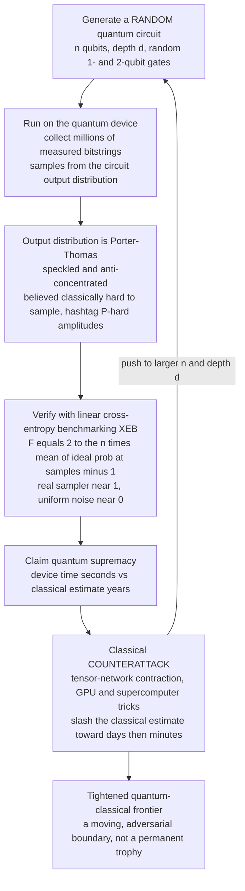

# 🏁 Quantum Supremacy and Advantage

> [!abstract] TL;DR
> **Quantum supremacy** (John Preskill's 2012 term) is the milestone where a quantum device performs **some** well-defined computational task — *however useless* — that is **infeasible for any classical computer** in reasonable time. **Quantum advantage** is the stronger, still-mostly-future goal: beating classical machines on a **useful** problem. Google's **2019 Sycamore** experiment claimed the first supremacy result: it sampled the output of a **random quantum circuit** on **53 superconducting qubits** in ~200 seconds, a task it estimated at ~10,000 years for a classical supercomputer; China's **USTC Jiuzhang** made a parallel claim via **photonic Gaussian boson sampling**. The chosen task — **random circuit sampling (RCS)** — is believed classically hard because the circuit's output follows the anti-concentrated **Porter-Thomas** distribution and computing individual amplitudes is **#P-hard** (the permanent/`#P` connection), yet it is *native* to the quantum device. Because you cannot classically compute the "right answer" at scale, correctness is checked with **linear cross-entropy benchmarking (XEB)** — a fidelity estimate near `1` for a true quantum sampler and near `0` for uniform noise. The crucial ongoing dynamic is the **classical counterattack**: improved **tensor-network** simulations and bigger supercomputers repeatedly slashed the claimed classical runtime from **10,000 years toward days, then minutes** — a healthy adversarial back-and-forth that keeps tightening the real quantum-classical frontier. The honest caveats: these tasks compute **nothing useful** by design, **NISQ noise** caps how far they scale, and supremacy is a **proof of principle**, not a practical speedup. Its deep significance is as the first experimental evidence that the **Extended Church-Turing thesis** may fail — that quantum hardware can outpace *all* classical computation.

---

## Intuition

**Analogy — a finish line for a race no one needs to win.** Imagine building a machine whose only purpose is to do **one weird trick** faster than every computer on Earth combined: shuffle a deck in a way so complicated that no classical machine could reproduce the exact statistics of the shuffle before the sun burns out. The trick has **no use** — you cannot cash it in, sell it, or solve a real problem with it. But if your machine genuinely does it and no classical computer can keep up, you have crossed a **scientific finish line**: you have demonstrated, for the first time, that a fundamentally different kind of computer can outrun the old kind at *something*. That is **quantum supremacy** — a **proof of principle**, deliberately framed as a milestone, not as immediate utility.

Now sharpen the picture. The "weird trick" is **sampling the output of a random quantum circuit**: fire a random sequence of quantum gates at some qubits, then read the qubits out. The device spits out bitstrings drawn from a fiendishly structured probability distribution that is *easy for the quantum hardware to produce* (it is literally what the physics does) but *believed astronomically hard for a classical computer to imitate*. **Quantum advantage** is the grown-up version of the same race — winning at a task someone actually **cares about** (chemistry, optimization, materials). Supremacy proves the engine can outrun classical hardware; advantage proves it can outrun it while carrying useful cargo. As of the mid-2020s we have credible supremacy demonstrations and **no** uncontested advantage on a useful problem — and the classical side keeps moving the finish line.

---

## How It Works

### Core mechanics

**1. Two definitions, deliberately distinct.**
   - **Quantum supremacy** (Preskill, 2012): a quantum device solving **any** clean computational task that is **classically infeasible**, even if the task is contrived and useless. The word was chosen to name a *scientific* threshold, decoupled from usefulness, so that the milestone could be claimed and scrutinized on its own terms.
   - **Quantum advantage** (a.k.a. *quantum computational advantage*, IBM's preferred phrasing): outperforming the best classical methods on a **practically relevant** problem. This is the goal that actually matters commercially, and it is **much harder** — the gap between "beyond classical on a random circuit" and "beyond classical on a problem someone pays for" is the central open question of the field ([[Near_Term_Quantum_Applications]]).

**2. The task — random circuit sampling (RCS), and why it was chosen.** Apply a **random** sequence of one- and two-qubit gates to `n` qubits to depth `d`, then measure all qubits in the computational basis. Repeat millions of times to collect **samples** from the circuit's output distribution `p(x) = |⟨x|ψ⟩|²`. RCS was chosen because it sits in a sweet spot:
   - It is **native and cheap** for the quantum device — no oracle, no special structure, just run gates and read out.
   - It is **believed classically hard** on solid complexity grounds. The output distribution **anti-concentrates** (spreads its weight broadly, following Porter-Thomas), and exactly computing individual output *amplitudes* is **#P-hard** — the same counting-complexity wall behind the permanent of a matrix ([[Counting_Complexity_and_Equilibria]], [[Quantum_Computation_and_BQP]]). Sampling from such a distribution is conjectured hard for classical machines *on average*, not just worst case.
   - It produces a **speckled, high-entropy** distribution — the quantum analog of laser speckle — that a classical simulator must reproduce amplitude by amplitude.

**3. The Porter-Thomas distribution — the fingerprint of a random circuit.** For a sufficiently random (Haar-like) circuit on `n` qubits with `N = 2ⁿ` outcomes, the output probabilities `p` are not uniform — they scatter according to **Porter-Thomas**: the *scaled* probability `s = N·p` follows an exponential law, `Pr(s) = e^{-s}`. Most bitstrings are *unlikely*, a few are *much more likely than average*, and this heavy-tailed speckle is precisely what makes faithful classical sampling expensive. It is also what makes **verification possible**.

**4. Verification — cross-entropy benchmarking (XEB).** Here is the subtlety: at supremacy scale you **cannot** classically compute the full output distribution — that is the whole point. So how do you check the device works? **Linear XEB** estimates a fidelity from a *modest* number of measured samples `x₁ … x_M`:

`F_XEB = 2ⁿ · mean_i[ p_ideal(x_i) ] − 1`

where `p_ideal(x)` is the ideal probability of the sampled bitstring, computed classically for the *specific samples observed* (feasible for a while, and extrapolated). Reading it off:
   - A **perfect quantum sampler** draws high-probability (heavy) bitstrings more often, so `mean_i[p_ideal] ≈ 2/N` and **`F_XEB ≈ 1`**.
   - **Uniform random noise** draws bitstrings blind to `p_ideal`, so `mean_i[p_ideal] ≈ 1/N` and **`F_XEB ≈ 0`**.
   - A **noisy real device** lands in between, with `F_XEB` tracking the circuit fidelity (roughly the product of all gate fidelities). The related **heavy-output generation (HOG)** test asks the same question a different way: does the sampler favor above-median-probability outcomes?

**5. The landmark experiments.**
   - **Google Sycamore (2019, *Nature*).** 53 working superconducting transmon qubits, RCS to depth 20, ~200 seconds of device time, XEB fidelity ~0.2%. Google estimated the same sampling would take a classical supercomputer ~10,000 years — the first supremacy claim ([[Superconducting_Qubits]]).
   - **USTC Jiuzhang (2020, *Science*).** A **photonic** machine performing **Gaussian boson sampling** — detecting up to 76 photons — a different route to computational advantage rooted in the #P-hardness of the matrix **permanent** ([[Photonic_Quantum_Computing]]). Later **Jiuzhang 2.0/3.0** and larger superconducting demonstrations (Google's 2023–2024 **70-qubit** deeper circuits) pushed the frontier further.

**6. The classical counterattack — a moving target.** Supremacy claims are **not one-and-done**; they trigger a fierce adversarial response from classical algorithm designers:
   - **IBM (2019)** argued Sycamore's task could be simulated in **~2.5 days** on the Summit supercomputer by cleverly using **secondary storage**, not 10,000 years.
   - **Tensor-network contraction** methods (Pan & Zhang and others) later reproduced Sycamore-fidelity samples in **minutes to hours on GPU clusters**, and by the mid-2020s on modest hardware — collapsing the "10,000 years" claim by *many* orders of magnitude.
   This back-and-forth is **healthy science**: each classical advance forces the quantum side to bigger `n` and depth `d`, and the true quantum-classical frontier is defined by where the *best-known* classical algorithm finally gives out. A supremacy claim is a **snapshot**, not a permanent trophy.

**7. The honest caveats.** RCS **computes nothing useful** — you get random-looking bitstrings, not a factorization or a molecular energy. **NISQ noise** limits circuit depth (past `~1/gate_error` two-qubit gates the signal drowns), which both *caps* how hard the task can be made and *lowers* the XEB fidelity that classical simulators must match ([[Error_Mitigation_in_the_NISQ_Era]], [[Decoherence_and_Quantum_Noise]]). The chasm between **supremacy on a contrived task** and **advantage on a useful one** remains wide.

**8. Why it still matters — the Extended Church-Turing thesis.** The **Extended Church-Turing thesis (ECT)** conjectures that any *physically realizable* computer can be simulated by a classical (probabilistic) machine with only **polynomial** overhead. A genuine supremacy demonstration is the first experimental crack in ECT: evidence that quantum devices can achieve an **exponential** separation from all classical computation ([[Quantum_Computation_and_BQP]]). That is the real prize — not the useless bitstrings, but the falsification of a foundational assumption about what computation *is*.

### The supremacy experiment loop



*The claim is a snapshot: every classical advance forces the quantum side to raise `n` and `d`, and the true frontier is wherever the best-known classical algorithm finally runs out of memory and time.*

---

## Key Concepts

### Secondary (intuitive level)
- **Supremacy = a race with a useless finish line.** A quantum machine does **some** task faster than any classical computer, even though the task solves nothing real. It is a *milestone*, not a product.
- **Advantage = winning a race that matters.** Beating classical computers on a **useful** problem (chemistry, optimization). Much harder, and not yet clearly achieved.
- **The task is "random circuit sampling":** run random quantum gates, read the qubits, and produce bitstrings from a pattern the quantum device makes easily but classical computers struggle to copy.
- **Checking it works:** you cannot compute the "right answer" at full scale, so you use a **fidelity score (XEB)** that reads near `1` for a real quantum sampler and near `0` for random noise.
- **The classical fight-back:** every supremacy claim gets attacked by better classical algorithms that shrink the "10,000 years" estimate — sometimes down to hours. The finish line keeps moving.

### Undergraduate (working level)
- **Preskill's supremacy (2012)** vs **quantum advantage**: *any* infeasible-for-classical task vs an *economically useful* one. The distinction is deliberate and load-bearing.
- **Random circuit sampling (RCS):** sample from `p(x) = |⟨x|ψ⟩|²` of a random depth-`d` circuit on `n` qubits. Chosen because it is native to hardware yet classically hard by **anti-concentration + #P-hard amplitudes**.
- **Porter-Thomas:** for a random circuit, scaled probabilities `s = N·p` are exponentially distributed, `Pr(s) = e^{-s}` — the speckle that makes classical sampling costly and verification feasible.
- **Linear XEB fidelity:** `F = 2ⁿ · mean_i[p_ideal(x_i)] − 1`; ideal sampler → `1`, uniform noise → `0`, noisy device → the circuit fidelity.
- **The exponential wall:** a state-vector simulation needs `2ⁿ` complex amplitudes; ~`2⁵⁰` amplitudes already exceed the RAM of the world's largest supercomputers.
- **Landmarks:** Google Sycamore (53 superconducting qubits, 2019), USTC Jiuzhang (photonic boson sampling, 2020).

### Graduate (theoretical level)
- **Complexity foundations of RCS hardness:** sampling from a random circuit's output is hard *on average* under plausible conjectures — exact amplitude computation is **#P-hard**, and **anti-concentration** plus **average-case hardness** (Aaronson–Arkhipov style arguments, originally for BosonSampling) suffice to place efficient classical sampling in a collapse-implying regime for the polynomial hierarchy ([[Counting_Complexity_and_Equilibria]]).
- **The verification problem is subtle:** linear XEB is a **proxy** for fidelity, not a proof of sampling from the correct distribution; a spoofer that reproduces the XEB score without genuinely sampling the target distribution is a live theoretical concern, and XEB verification itself becomes classically expensive at scale.
- **Fidelity–volume trade-off:** for a global depolarizing model, `F_XEB ≈ Π gate_fidelities ≈ e^{-ε·(#gates)}`; NISQ noise forces low `F` at large volume, which is *exactly* the crack tensor-network simulators exploit — low target fidelity is *easier* to spoof classically.
- **BosonSampling vs qubit RCS:** two independent routes to advantage; boson sampling ties hardness to the **permanent** of a Gaussian matrix, qubit RCS to circuit amplitudes. Both were separately attacked by improved classical algorithms.
- **The classical frontier as an algorithm-vs-hardware co-evolution:** tensor-network contraction complexity scales with the **treewidth** of the circuit graph; better contraction orderings, sparse-state, and Feynman-path hybrids repeatedly redefined the crossover point, so "supremacy" is properly stated as a *conditional, best-effort* claim.
- **Significance for ECT:** a robust separation would be the first empirical evidence against the **Extended Church-Turing thesis**, distinct from (and weaker-assumption than) a fault-tolerant [[Shors_Factoring_Algorithm|Shor]]-scale demonstration, which would settle it decisively ([[Quantum_Computation_and_BQP]]).

---

## Python Demo

Three illustrations with `numpy`/`matplotlib` only. **(A)** the exponential **simulation wall** — a state vector needs `2ⁿ` complex amplitudes, so the RAM to merely *store* the state crosses the world's largest supercomputers around `n = 50` qubits. **(B)** the **Porter-Thomas** speckle of a random circuit — the output probabilities of a Haar-random state, scaled by `N`, follow `e^{-s}`. **(C)** a toy **linear XEB** fidelity estimate that cleanly separates a real quantum sampler (`F ≈ 1`) from uniform noise (`F ≈ 0`) and tracks a device's true fidelity in between.

```python
# Quantum supremacy in three pictures -- numpy + matplotlib only.
#   A) the exponential classical-simulation WALL (2**n amplitudes)
#   B) the Porter-Thomas output distribution of a random circuit
#   C) toy linear cross-entropy benchmarking (linear XEB) fidelity
import numpy as np
import matplotlib.pyplot as plt

rng = np.random.default_rng(42)

# =====================================================================
# PART A -- the exponential simulation WALL
# A state vector for n qubits stores 2**n complex amplitudes. At
# complex128 = 16 bytes each, the RAM to merely HOLD the state blows
# past the biggest supercomputers around n = 50 qubits.
# =====================================================================
n = np.arange(20, 61)
bytes_per_amplitude = 16                       # complex128
ram_petabytes = (2.0 ** n) * bytes_per_amplitude / 1e15

supercomputers = {                             # approximate total RAM, PB
    "Summit  ~2.8 PB":  2.8,
    "Fugaku  ~4.9 PB":  4.9,
    "Frontier ~9.2 PB": 9.2,
}
crossing = int(n[np.searchsorted(ram_petabytes, 9.2)])
print(f"State vector exceeds Frontier's ~9.2 PB of RAM at n = {crossing} qubits")
for name, pb in supercomputers.items():
    nc = int(n[np.searchsorted(ram_petabytes, pb)])
    print(f"  exceeds {name:16s} at n = {nc} qubits")

# =====================================================================
# PART B -- the Porter-Thomas output distribution
# A Haar-random n-qubit state has output probabilities p whose SCALED
# values s = N*p follow an exponential law: Pr(s) = e**(-s).
# =====================================================================
n_small = 12
N = 2 ** n_small
psi = rng.normal(size=N) + 1j * rng.normal(size=N)   # complex Gaussian
psi /= np.linalg.norm(psi)                           # Haar-random pure state
p_ideal = np.abs(psi) ** 2                           # ideal output probs
scaled = N * p_ideal                                 # ~ Exp(1)

# =====================================================================
# PART C -- toy linear cross-entropy benchmarking (linear XEB)
#   F_XEB = 2**n * mean_i[ p_ideal(x_i) ] - 1
#   ideal quantum sampler -> F ~ +1 ; uniform noise -> F ~ 0
#   device at true fidelity phi (draw from ideal w.p. phi else uniform) -> F ~ phi
# =====================================================================
def linear_xeb(sample_indices):
    return N * p_ideal[sample_indices].mean() - 1.0

M = 200_000
idx_ideal   = rng.choice(N, size=M, p=p_ideal)       # perfect quantum sampler
idx_uniform = rng.integers(0, N, size=M)             # pure noise
F_ideal   = linear_xeb(idx_ideal)
F_uniform = linear_xeb(idx_uniform)
print(f"\nlinear XEB, ideal quantum sampler  F = {F_ideal:+.3f}  (expect ~ +1)")
print(f"linear XEB, uniform-random noise   F = {F_uniform:+.3f}  (expect ~  0)")

phis = np.linspace(0.0, 1.0, 11)                      # sweep true fidelity
F_est = []
for phi in phis:
    from_ideal = rng.random(M) < phi
    idx = np.where(from_ideal,
                   rng.choice(N, size=M, p=p_ideal),
                   rng.integers(0, N, size=M))
    F_est.append(linear_xeb(idx))
F_est = np.array(F_est)

# =====================================================================
# PLOTS
# =====================================================================
fig, ax = plt.subplots(1, 3, figsize=(15, 4.4))

# A: the memory wall
ax[0].semilogy(n, ram_petabytes, color="#2563eb", lw=2,
               label="state-vector RAM = 2^n * 16 bytes")
for name, pb in supercomputers.items():
    ax[0].axhline(pb, ls="--", lw=1, alpha=0.85, label=name)
ax[0].axvline(crossing, color="#111827", lw=1, ls=":")
ax[0].set_xlabel("number of qubits  n")
ax[0].set_ylabel("RAM to store the state  [petabytes]")
ax[0].set_title("A) The exponential simulation wall")
ax[0].legend(fontsize=7, loc="upper left")

# B: Porter-Thomas
xs = np.linspace(0, 8, 200)
ax[1].hist(scaled, bins=60, density=True, color="#93c5fd",
           edgecolor="white", label="random-state probabilities")
ax[1].plot(xs, np.exp(-xs), color="#dc2626", lw=2,
           label="Porter-Thomas  e^(-s)")
ax[1].set_xlabel("scaled probability  s = N * p")
ax[1].set_ylabel("density")
ax[1].set_title("B) Porter-Thomas speckle")
ax[1].legend(fontsize=8)

# C: linear XEB
ax[2].plot([0, 1], [0, 1], color="#9ca3af", ls="--", lw=1, label="ideal  F = phi")
ax[2].scatter(phis, F_est, color="#2563eb", zorder=5, label="estimated XEB")
ax[2].scatter([1], [F_ideal], marker="*", s=200, color="#059669",
              zorder=6, label=f"pure quantum  F = {F_ideal:.2f}")
ax[2].scatter([0], [F_uniform], marker="X", s=90, color="#dc2626",
              zorder=6, label=f"pure noise  F = {F_uniform:.2f}")
ax[2].set_xlabel("true circuit fidelity  phi")
ax[2].set_ylabel("linear XEB estimate  F")
ax[2].set_title("C) XEB separates signal from noise")
ax[2].legend(fontsize=8, loc="upper left")

plt.tight_layout()
plt.savefig("quantum_supremacy_demo.png", dpi=130)
print("\nSaved figure to quantum_supremacy_demo.png")

# Takeaways:
#   A) storing the state alone exceeds Frontier's RAM near n = 50 -- and a
#      full brute-force simulation is far worse, needing that memory AND
#      2**n operations per layer; this is the wall supremacy exploits.
#   B) the random-circuit output is Porter-Thomas speckle (e^-s), NOT uniform;
#      that heavy-tailed structure is what makes classical sampling costly.
#   C) linear XEB reads ~+1 for a real quantum sampler, ~0 for uniform noise,
#      and tracks the true fidelity in between -- how you verify a device you
#      CANNOT fully simulate.
```

Running it prints the crossover (`n ≈ 50` qubits exceeds Frontier's ~9.2 PB), the ideal-vs-uniform XEB values (`F ≈ +1` vs `F ≈ 0`), and saves a three-panel figure: the memory wall shooting past every supercomputer line around 50 qubits, the random-state probabilities collapsing onto the red `e^{-s}` Porter-Thomas curve, and the XEB estimates lying on the `F = φ` diagonal with the pure-quantum star at `1` and the pure-noise cross at `0`. Together these are the three pillars of a supremacy claim — *classically infeasible to simulate*, *characteristically quantum in its output statistics*, and *verifiable without a full classical simulation*.

---

## Real-World Applications

> **Example — Google's Sycamore experiment (Arute et al., *Nature* 2019) and its aftermath.** Sycamore ran **random circuit sampling** on **53 superconducting transmon qubits** to depth 20, drawing ~1 million samples in ~200 seconds at an XEB fidelity of ~0.2%. Google estimated the equivalent classical task at ~10,000 years on Summit — the first **quantum supremacy** claim. Within weeks **IBM** countered that smarter use of **secondary storage** cut the classical estimate to ~2.5 days, and over the following years **tensor-network** methods and larger machines pushed it down to **hours, then minutes**. That exact loop — *claim → classical counterattack → push to larger circuits* — is the living definition of the quantum-classical frontier and is the single most important thing to understand about supremacy claims.

- **Photonic advantage — USTC Jiuzhang.** A completely different hardware route: **Gaussian boson sampling** on a photonic processor detecting up to 76 photons (2020), with **Jiuzhang 2.0/3.0** scaling to hundreds of photons. Its hardness rests on the **#P-hard permanent** of a Gaussian matrix, giving an independent line of evidence beyond superconducting qubits ([[Photonic_Quantum_Computing]]).
- **Benchmarking real hardware.** XEB fidelity became a **standard cross-vendor metric** for whole-processor quality — it folds every gate and readout error into one number that predicts how deep a coherent circuit can run, guiding hardware roadmaps ([[Building_and_Scaling_Quantum_Computers]]).
- **Stress-testing classical simulation.** Supremacy circuits are now the **canonical hard instances** driving advances in tensor-network contraction, GPU state-vector simulators, and HPC memory hierarchies — the quantum challenge measurably improved *classical* algorithms.
- **From supremacy toward utility.** IBM reframes the near-term goal as **"quantum utility"** — useful-scale computation with **error mitigation** even before fault tolerance — arguing the meaningful target is *usefulness*, not a contrived sampling win ([[Error_Mitigation_in_the_NISQ_Era]], [[Near_Term_Quantum_Applications]]). Whether and when genuine **quantum advantage** on a useful problem arrives is an open, actively debated question ([[The_Future_of_Quantum_Computing]]).
- **Foundations of physics.** Beyond engineering, a robust separation is treated as **experimental input to the Extended Church-Turing question** — a rare case where a hardware demo speaks directly to a foundational claim about the limits of computation ([[Quantum_Computation_and_BQP]]).

---

## Common Pitfalls

- **Confusing supremacy with usefulness.** Random circuit sampling **computes nothing valuable** — it produces random-looking bitstrings. Supremacy is a *proof of principle* about raw computational power, not evidence of a practical speedup. Reporting "quantum computers now beat classical" without the "on a useless task" qualifier is the field's most common overstatement.
- **Treating a supremacy claim as permanent.** Every claim is a **snapshot** against the *best classical algorithm known at that moment*. The "10,000 years" figure was slashed by IBM and then by tensor networks. Always ask: *versus which classical method, on which hardware, at what fidelity?*
- **Ignoring the fidelity–spoofability link.** Low XEB fidelity (forced by NISQ noise) does not just weaken the claim — it makes the task **easier to spoof classically**, because a simulator only has to match a low-fidelity target. Higher fidelity at larger volume is what actually strengthens supremacy.
- **Assuming XEB proves correct sampling.** Linear XEB is a **proxy** for fidelity; a clever classical spoofer can, in principle, match the XEB score without sampling the true distribution. Verification at supremacy scale is a genuine, unsolved subtlety, not a formality.
- **Believing supremacy implies quantum computers crack NP-complete problems.** RCS hardness rests on **#P-hardness and anti-concentration**, a very specific structure. It says nothing about general NP-complete problems, and quantum computers are **not** believed to solve them efficiently ([[Quantum_Computation_and_BQP]]).
- **Underestimating the memory-vs-time distinction.** The `2ⁿ` state-vector RAM wall is only *one* cost model. Tensor-network and Feynman-path simulators trade memory for time and can beat naive state-vector estimates by orders of magnitude — which is exactly how classical counterattacks succeed.
- **Conflating boson sampling and qubit RCS.** They are **different tasks on different hardware** with different hardness arguments (permanent vs circuit amplitudes). A classical break of one does not automatically break the other.

---

## Related Concepts

- [[Quantum_Computation_and_BQP]] — the complexity home of the claim: why RCS is believed hard (#P-hardness, anti-concentration) and why a separation would crack the **Extended Church-Turing thesis**.
- [[Counting_Complexity_and_Equilibria]] — the **#P** counting-complexity wall (the permanent, exact amplitude computation) that underlies both random-circuit and boson-sampling hardness.
- [[Error_Mitigation_in_the_NISQ_Era]] — why NISQ noise caps circuit depth and XEB fidelity, and IBM's "quantum utility" reframing from supremacy toward useful computation.
- [[Decoherence_and_Quantum_Noise]] — the physical noise that limits how deep (and thus how classically hard) a supremacy circuit can be pushed.
- [[Shors_Factoring_Algorithm]] — the contrast: a *structured, useful* exponential speedup that would settle Extended Church-Turing decisively, versus supremacy's *useless but near-term* demonstration.
- [[Grovers_Search_Algorithm]] — the other reference point: only a *quadratic* speedup, underscoring how special the RCS/factoring separations are.
- [[Quantum_Gates_and_Circuits]] — random circuits are built from these one- and two-qubit gates; gate fidelity is what XEB ultimately measures.
- [[Quantum_Computing_Overview]] — the parent map placing supremacy among the field's milestones.
- [[Superconducting_Qubits]] — the transmon hardware behind Google's Sycamore supremacy experiment.
- [[Photonic_Quantum_Computing]] — the photonic route: USTC Jiuzhang's Gaussian boson sampling advantage.
- [[Building_and_Scaling_Quantum_Computers]] — how XEB became a whole-processor benchmark guiding hardware roadmaps.
- [[Near_Term_Quantum_Applications]] — the harder goal of *quantum advantage* on a useful problem, and the "utility" debate.
- [[The_Future_of_Quantum_Computing]] — when, whether, and how contrived-task supremacy becomes practical advantage.

---

## Review Questions

**Tier 1 — Conceptual (explain to a peer):**
1. Using the "finish line for a race no one needs to win" analogy, explain the difference between **quantum supremacy** and **quantum advantage**. Why did Preskill deliberately define supremacy in a way that is *decoupled from usefulness*?
2. Random circuit sampling produces random-looking bitstrings that solve no real problem. Explain why this "useless" task was nonetheless the *right* choice for the first supremacy demonstration — what makes it easy for the quantum device yet believed hard for classical computers?

**Tier 2 — Applied (reason / compute):**
3. At supremacy scale you *cannot* classically compute the full output distribution, so how do you verify the device is working? Define **linear XEB fidelity**, and explain why it reads `≈ 1` for an ideal quantum sampler and `≈ 0` for uniform noise (use the Porter-Thomas structure in your answer).
4. Google's original Sycamore claim was "~200 seconds vs ~10,000 years." IBM and later tensor-network groups drove the classical estimate down to days and then minutes. Explain *mechanically* how a better classical algorithm (e.g., using secondary storage or tensor-network contraction) can collapse a supremacy claim, and why lower device **fidelity** makes the claim *easier* to defeat.

**Tier 3 — Theoretical (deep understanding):**
5. A robust supremacy result is described as "the first experimental evidence that the **Extended Church-Turing thesis** may fail." State the ECT precisely, explain what an exponential quantum-classical separation on RCS would imply for it, and contrast this evidence with what a fault-tolerant **Shor** demonstration would prove.
6. Critique the verification problem: linear XEB is a *proxy* for sampling fidelity, and a classical *spoofer* might match the XEB score without genuinely sampling the target distribution. Why is this more than a technicality, and how does it interact with the fact that NISQ noise forces low target fidelity at large circuit volume?

---

## Sources

- Arute, F. et al. "Quantum supremacy using a programmable superconducting processor." *Nature* 574, 505–510 (2019) — the Google Sycamore experiment. [DOI](https://doi.org/10.1038/s41586-019-1666-5)
- Preskill, J. "Quantum computing and the entanglement frontier." (2012) — the essay that coined "quantum supremacy." [arXiv:1203.5813](https://arxiv.org/abs/1203.5813)
- Zhong, H.-S. et al. "Quantum computational advantage using photons." *Science* 370, 1460–1463 (2020) — USTC Jiuzhang Gaussian boson sampling. [DOI](https://doi.org/10.1126/science.abe8770)
- Pednault, E. et al. "Leveraging Secondary Storage to Simulate Deep 54-qubit Sycamore Circuits." (2019) — IBM's classical counterattack cutting 10,000 years to ~2.5 days. [arXiv:1910.09534](https://arxiv.org/abs/1910.09534)
- Pan, F., Chen, K. & Zhang, P. "Solving the Sampling Problem of the Sycamore Quantum Circuits." *Physical Review Letters* 129, 090502 (2022) — tensor-network simulation reproducing Sycamore-fidelity samples. [DOI](https://doi.org/10.1103/PhysRevLett.129.090502)

---

#quantum-computing #quantum-supremacy #quantum-advantage #random-circuit-sampling #xeb
