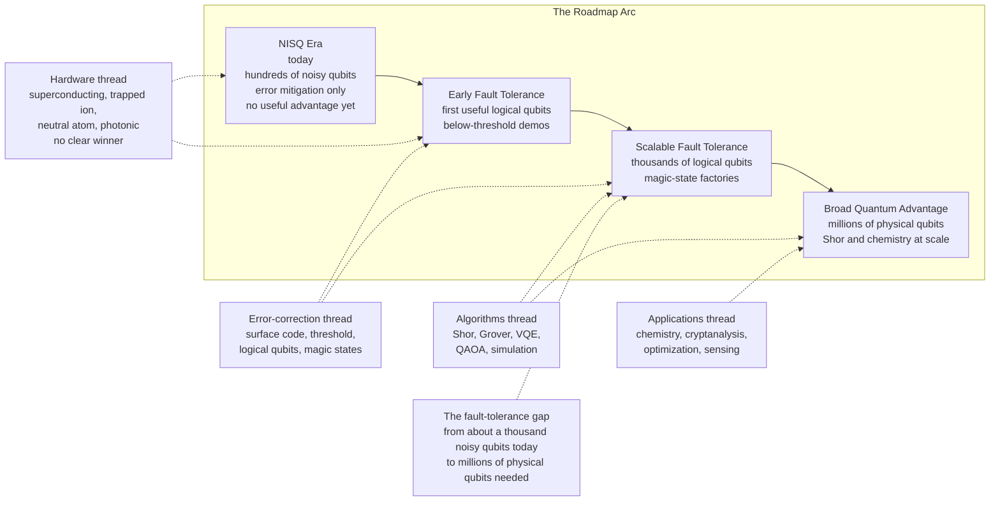

# 🔭 The Future of Quantum Computing

> [!abstract] TL;DR
> This is the **capstone** of the whole vault: quantum computing exploits **superposition**, **entanglement**, and above all **interference** to reshape probability amplitudes in ways no classical machine can ([[Quantum_Computing_Overview]], [[Entanglement_and_Bell_States]]) — but it is **not** a faster classical computer and **not** a magic NP-solver; it wins only on *special structured problems* (the class **BQP**, see [[Quantum_Computation_and_BQP]]). The journey ran from **Feynman's 1982** idea, through **Shor's** exponential factoring speedup ([[Shors_Factoring_Algorithm]]) and **Grover's** quadratic search ([[Grovers_Search_Algorithm]]), to the first quantum-advantage demonstrations and today's noisy **NISQ** devices. The field's *defining race* is **error correction and fault tolerance**: taming **decoherence** ([[Decoherence_and_Quantum_Noise]]), getting **below threshold** ([[Fault_Tolerance_and_the_Threshold_Theorem]]), and scaling **logical qubits** ([[Logical_Qubits_and_Magic_States]]). The **roadmap arc** — NISQ → early fault tolerance → scalable fault tolerance → broad quantum advantage — is run in parallel by four unsettled hardware platforms ([[Trapped_Ion_Quantum_Computers]], [[Photonic_Quantum_Computing]], superconducting, neutral-atom) with **no clear winner**. The honest verdict: quantum computing is **real, important, and advancing fast**, yet broad practical advantage is **years-to-decades** away, the field is roughly where classical computing was in the **vacuum-tube era**, and much of the marketing is overstated. The one thing already forcing action *today* is the migration to **post-quantum cryptography** ([[Post_Quantum_Cryptography]]).

---

## Intuition

**Analogy — quantum computing is in its vacuum-tube era.** In the late 1940s the ENIAC filled a room, drew enough power to dim a neighborhood, ran on thousands of fragile vacuum tubes that burned out every few hours, and needed a team of engineers just to keep it alive long enough to finish a calculation. And yet the *physics* was proven, the *idea* was correct, and every foundational concept of modern computing — the stored program, the logic gate, the bit — was already visible in embryo. What separated ENIAC from the smartphone was not a missing principle; it was **forty years of relentless engineering**: the transistor, the integrated circuit, error-tolerant design, and the exponential grind of miniaturization.

Quantum computing sits in exactly that position today. The physics is settled and demonstrated. The algorithms that prove there *are* genuine speedups exist on paper and, in small cases, in hardware. But the machines are room-sized, cryogenically cooled or laser-trapped, drown in noise, and lose their quantum state — **decohere** — in millionths of a second. The obstacle is not a missing law of nature; it is **brutal engineering**, and its name is **error correction**. The future of the field is therefore not a sprint to a single breakthrough but a **marathon** whose finish line is *fault tolerance at scale* — a decades-long project of suppressing errors and multiplying qubits, exactly the way the transistor era ground its way from ENIAC to the microprocessor.

Hold two truths at once. First: **this is real and it matters enormously** — a fault-tolerant quantum computer would break the cryptography securing the internet, design molecules classical machines cannot simulate, and change what we think computation *is*. Second: **it is not imminent, and most timelines you read are marketing.** The skill this capstone teaches is holding both truths without collapsing into hype or dismissal.

---

## How It Works

This note synthesizes the whole vault. Each subsection compresses a section you can open for depth.

### The big picture — what quantum computing actually is (and is not)

A qubit is not a "bit that is 0 and 1 at once" in the loose sense; it is a unit vector `α|0⟩ + β|1⟩` of **complex amplitudes** ([[Qubits_and_the_Bloch_Sphere]], [[Linear_Algebra_for_Quantum_Computing]]). `n` qubits span a `2ⁿ`-dimensional space, but **measurement returns one bit-string** ([[Measurement_and_the_No_Cloning_Theorem]]). The power comes from **interference** — because amplitudes are complex they can *cancel*, so a good algorithm ([[Quantum_Gates_and_Circuits]]) makes wrong answers destructively interfere and the right answer's amplitude swell. Entanglement ([[Entanglement_and_Bell_States]]) supplies correlations no product of independent bits can hold. The three-line honest summary: **not** faster classical parallelism, **not** an NP-complete solver, but a genuine exponential edge on a *few* structured problems — the class **BQP**, believed to strictly contain classical **BPP** yet be **incomparable** to **NP** ([[Quantum_Computation_and_BQP]]).

### The journey so far

1. **1982 — Feynman** asks classical computers to simulate quantum physics, sees the exponential wall, and proposes a *quantum* machine instead. **Deutsch** (1985) formalizes the universal quantum computer.
2. **1994–96 — the speedups are proven.** **Shor** ([[Shors_Factoring_Algorithm]]) factors integers in polynomial time via the [[Quantum_Fourier_Transform_and_Phase_Estimation|quantum Fourier transform]], threatening RSA/ECC. **Grover** ([[Grovers_Search_Algorithm]]) gives a provable *quadratic* speedup for unstructured search. Earlier oracle results ([[Deutsch_Jozsa_and_Bernstein_Vazirani]], [[Quantum_Algorithms_and_the_Oracle_Model]]) had already shown separations.
3. **2019 onward — quantum advantage demonstrations.** Sampling tasks engineered to be hard classically (random-circuit sampling, boson sampling) crossed into "beyond classical" territory — scientifically real, practically useless, and repeatedly contested as classical algorithms caught up (a *quantum-supremacy-and-advantage* sibling note is planned in this section).
4. **Today — the NISQ era.** Noisy Intermediate-Scale Quantum devices: hundreds to ~a thousand physical qubits, no error correction, leaning on **error *mitigation*** ([[Error_Mitigation_in_the_NISQ_Era]]) rather than correction. Impressive, but not yet useful for a problem anyone would pay to solve.

### The central challenge — decoherence, and the error-correction race

Everything hinges on one enemy: **decoherence** ([[Decoherence_and_Quantum_Noise]]). Coupling to the environment destroys the delicate *phase* relationships that interference — the entire source of speedup — depends on. The answer is **quantum error correction** ([[Quantum_Error_Correction_Principles]]): spread one *logical* qubit across many entangled *physical* qubits and measure parities (syndromes) that reveal errors without collapsing the data. The **threshold theorem** ([[Fault_Tolerance_and_the_Threshold_Theorem]]) is the field's load-bearing guarantee: **below a critical physical error rate, adding more correction drives logical error down exponentially**; above it, correction makes things worse. The workhorse code is the **surface code** ([[Stabilizer_Codes_and_the_Surface_Code]]) with its forgiving ~1% threshold, and the resource that dominates the budget is **magic-state distillation** for the non-Clifford gates the Eastin–Knill theorem forbids from being transversal ([[Logical_Qubits_and_Magic_States]]). The punchline of the whole enterprise: reaching cryptographically-useful logical error rates needs **hundreds to thousands of physical qubits per logical qubit**, projecting to **millions of physical qubits** for Shor at scale.

### The roadmap arc and the hardware race

The community-agreed arc is **NISQ → early fault tolerance (first useful logical qubits, below-threshold demos) → scalable fault tolerance (thousands of logical qubits, magic-state factories) → broad quantum advantage**. Four platforms race along it with **no clear winner** — **superconducting** (fast gates, hard wiring and cryogenics; a dedicated sibling note is planned), **trapped ions** ([[Trapped_Ion_Quantum_Computers]], superb fidelity, slower gates), **neutral atoms** (reconfigurable, huge arrays; planned sibling), and **photonics** ([[Photonic_Quantum_Computing]], room-temperature, networkable, probabilistic gates). All must satisfy the [[Physical_Qubits_and_the_DiVincenzo_Criteria|DiVincenzo criteria]], and the *engineering* of scaling — control electronics, wiring, yield, cryogenics — is itself a frontier (a *building-and-scaling* sibling note is planned).

### The applications outlook

- **Quantum simulation / chemistry** — Feynman's original motivation and the **likeliest first killer app** ([[Quantum_Simulation_and_VQE]]): catalysts, batteries, nitrogen fixation, drug candidates.
- **Cryptanalysis** — Shor's *threat* is already reshaping security **now**, driving post-quantum migration.
- **Optimization and ML** — QAOA and quantum ML are promising but **unproven**; practical advantage is not established (dedicated sibling notes planned).
- **Sensing** — quantum sensors are *already* real and deployed, the quiet success story.



---

## Key Concepts

**Secondary (the honest headline):**
- Quantum computers are **not** faster laptops and **not** magic solve-everything boxes. They help dramatically on a **few special problems** and barely at all on most.
- The field is in its **vacuum-tube era**: the physics works, the engineering is brutal, useful machines are **years to decades** away.
- The single defining obstacle is **noise** — qubits lose their quantum state almost instantly — and the whole game is **error correction**.
- The one thing happening *right now* because of quantum computing: the world is switching to **new "quantum-proof" encryption** before a code-breaking machine arrives.

**Undergraduate (the machinery of the outlook):**
- **NISQ vs fault-tolerant** — the two eras, divided by whether you *mitigate* noise or *correct* it below threshold.
- **The threshold theorem** — below a critical error rate, more correction wins exponentially; the theoretical reason scalable quantum computing is not forbidden by noise.
- **The fault-tolerance gap** — today's ~10²–10³ *noisy* qubits versus the ~10⁶ *physical* qubits needed for a useful *logical* machine; overhead of hundreds-to-thousands physical per logical.
- **BQP is not NP** — quantum advantage is a scalpel, not a sledgehammer; this is *why* the applications list is short and structured.
- **Four platforms, no winner** — superconducting, trapped-ion, neutral-atom, photonic each trade off gate speed, fidelity, connectivity, and scalability.

**Graduate (the frontier and the stakes):**
- **Extended Church–Turing thesis** — quantum advantage is the strongest empirical challenge to the claim that any physical computer can be *efficiently* simulated by a classical Turing machine; if BQP genuinely outruns BPP in the real world, our notion of "efficient computation" must be rewritten around physics ([[Quantum_Computation_and_BQP]], [[Quantum_Information_Theory]]).
- **Resource-estimation reality** — end-to-end estimates (Shor on RSA-2048, FeMoco simulation) are dominated by **magic-state distillation** and serialized `T`-gate depth, not raw qubit count; "logical qubits" is the honest metric, not physical qubits.
- **Post-quantum migration as a *present* engineering problem** — "harvest-now-decrypt-later" means adversaries record encrypted traffic today to break later; NIST's lattice-based standards (Kyber/ML-KEM, Dilithium/ML-DSA) are being deployed *now* ([[Post_Quantum_Cryptography]], [[Device_Independent_and_Post_Quantum_Security]]).
- **The quantum internet** — entanglement distribution, repeaters, and distributed quantum computing ([[The_Quantum_Internet]], [[Entanglement_Distillation_and_Quantum_Networks]], [[Quantum_Key_Distribution_and_BB84]], [[Quantum_Teleportation]], [[Superdense_Coding]]) as a parallel long-horizon program.
- **Interdisciplinary convergence** — physics + CS + mathematics + electrical engineering + chemistry; quantum computing is a *grand convergence* node in the wider knowledge graph, not a subfield of any one discipline.

---

## Python Demo

```python
# Quantum Computing Progress Dashboard -- numpy / matplotlib only.
# A synthesis figure: plot the historical growth (and simple log-linear
# projections) of three key metrics -- physical qubit count, two-qubit gate
# error rate, and logical qubit count -- against the thresholds that define
# meaningful milestones, and illustrate the "fault-tolerance gap" between
# today's NISQ devices and the millions of physical qubits Shor-at-scale needs.
#
# NOTE: numbers are representative order-of-magnitude milestones from public
# roadmaps, NOT exact specs. The point is the TREND, the THRESHOLDS, and the GAP.
import numpy as np
import matplotlib.pyplot as plt

proj_year = np.arange(2016, 2041)

# ---------------------------------------------------------------------------
# 1) Physical qubit count on leading universal gate-model devices
# ---------------------------------------------------------------------------
q_year  = np.array([2016, 2017, 2019, 2021, 2022, 2023, 2024], dtype=float)
q_count = np.array([   5,   20,   53,  127,  433, 1121, 1180], dtype=float)
cq      = np.polyfit(q_year, np.log10(q_count), 1)          # log-linear fit
q_proj  = 10 ** np.polyval(cq, proj_year)                   # exponential trend

SHOR_PHYS   = 1e6      # cryptographically-relevant fault-tolerant machine (RSA-2048)
USEFUL_PHYS = 1e5      # ~100 logical qubits x ~1000 physical each -> first advantage
year_to_million = (6.0 - cq[1]) / cq[0]                     # naive crossing of 1e6

# ---------------------------------------------------------------------------
# 2) Two-qubit gate error rate (LOWER is better)
# ---------------------------------------------------------------------------
e_year = np.array([2016, 2018, 2019, 2021, 2023, 2024], dtype=float)
e_rate = np.array([5e-2, 2e-2, 1e-2, 5e-3, 3e-3, 1.5e-3])
ce     = np.polyfit(e_year, np.log10(e_rate), 1)
e_proj = 10 ** np.polyval(ce, proj_year)

THRESHOLD = 1e-2       # surface-code threshold ~ 1 percent
FT_TARGET = 1e-3       # comfortable below-threshold operating point

# ---------------------------------------------------------------------------
# 3) Logical qubit count (the metric that actually matters long term)
# ---------------------------------------------------------------------------
l_year  = np.array([2023, 2024], dtype=float)
l_count = np.array([1, 48], dtype=float)   # first below-threshold logical qubit; 48 logical demo
fut     = np.arange(2024, 2041)
l_proj  = 48 * 2 ** ((fut - 2024) / 1.5)   # optimistic ~1.5-yr doubling toward FT

USEFUL_LOGICAL = 1e2   # ~100 clean logical qubits -> first real advantage
SHOR_LOGICAL   = 4e3   # ~thousands of logical qubits for RSA-2048

print(f"Naive log-linear extrapolation reaches 1e6 physical qubits ~ year {year_to_million:.0f}")
print("(caveat: this IGNORES the error-rate wall -- qubit count without fidelity is useless)")

# ---------------------------------------------------------------------------
# Dashboard
# ---------------------------------------------------------------------------
fig, ax = plt.subplots(2, 2, figsize=(15, 10))

# Panel A: physical qubits vs milestones
axA = ax[0, 0]
axA.semilogy(q_year, q_count, "o", color="navy", ms=7, label="demonstrated devices")
axA.semilogy(proj_year, q_proj, "--", color="navy", alpha=0.7, label="log-linear projection")
axA.axhline(USEFUL_PHYS, color="orange", ls=":", lw=1.5,
            label="~1e5: first useful logical machine")
axA.axhline(SHOR_PHYS, color="red", ls="-", lw=1.5,
            label="~1e6: crypto-relevant (Shor)")
axA.set_title("(A) Physical qubit count")
axA.set_xlabel("year"); axA.set_ylabel("physical qubits (log)")
axA.legend(fontsize=8); axA.grid(True, which="both", alpha=0.3)

# Panel B: two-qubit gate error vs threshold (lower is better)
axB = ax[0, 1]
axB.semilogy(e_year, e_rate, "s", color="darkgreen", ms=7, label="demonstrated error rate")
axB.semilogy(proj_year, e_proj, "--", color="darkgreen", alpha=0.7, label="log-linear projection")
axB.axhline(THRESHOLD, color="red", ls="-", lw=1.5, label="~1%: surface-code threshold")
axB.axhline(FT_TARGET, color="orange", ls=":", lw=1.5, label="~0.1%: comfortable below threshold")
axB.fill_between(proj_year, THRESHOLD, 1.0, color="red", alpha=0.08)
axB.set_title("(B) Two-qubit gate error rate (lower = better)")
axB.set_xlabel("year"); axB.set_ylabel("gate error rate (log)")
axB.legend(fontsize=8); axB.grid(True, which="both", alpha=0.3)

# Panel C: logical qubits vs milestones
axC = ax[1, 0]
axC.semilogy(l_year, l_count, "^", color="purple", ms=9, label="demonstrated logical qubits")
axC.semilogy(fut, l_proj, "--", color="purple", alpha=0.7, label="optimistic projection")
axC.axhline(USEFUL_LOGICAL, color="orange", ls=":", lw=1.5, label="~100: first useful logical qubits")
axC.axhline(SHOR_LOGICAL, color="red", ls="-", lw=1.5, label="~4000: RSA-2048 (Shor)")
axC.set_title("(C) Logical qubit count (the metric that matters)")
axC.set_xlabel("year"); axC.set_ylabel("logical qubits (log)")
axC.legend(fontsize=8); axC.grid(True, which="both", alpha=0.3)

# Panel D: the fault-tolerance gap, as orders of magnitude
axD = ax[1, 1]
labels = ["NISQ today\n(~1e3 noisy)", "First useful\n(~1e5 phys)", "Shor RSA-2048\n(~1e6-1e7 phys)"]
vals   = [1e3, 1e5, 5e6]
colors = ["navy", "orange", "red"]
axD.bar(labels, vals, color=colors, alpha=0.8)
axD.set_yscale("log")
axD.set_ylabel("physical qubits (log)")
axD.set_title("(D) The fault-tolerance gap: 3-4 orders of magnitude to go")
for i, v in enumerate(vals):
    axD.text(i, v * 1.3, f"{v:.0e}", ha="center", fontsize=9)
axD.grid(True, which="both", axis="y", alpha=0.3)

fig.suptitle("Quantum Computing Progress Dashboard -- where the field is and where it is going",
             fontsize=13, y=1.00)
plt.tight_layout()
plt.show()
```

Read the dashboard as a single synthesis. **Panel A** shows physical qubit counts climbing exponentially — the headline number vendors love — but a naive extrapolation crossing a million qubits (around the early 2030s) is *misleading on its own*, because **Panel B** shows the real gate: error rates must fall *below the ~1% threshold* and ideally to ~0.1% before those qubits mean anything. Qubit count without fidelity is theater. **Panel C** plots the metric that actually matters — **logical** qubits — which only became nonzero around 2023 and must climb three to four orders of magnitude to reach cryptographic relevance. **Panel D** is the honest gut-check: the **fault-tolerance gap** between today's ~10³ noisy qubits and the ~10⁶–10⁷ physical qubits a useful fault-tolerant machine needs is **three to four orders of magnitude** — the marathon this whole vault has been describing.

---

## Real-World Applications

> **Post-quantum cryptography is the one part of "the future" happening now.** Shor's algorithm ([[Shors_Factoring_Algorithm]]) would break RSA and elliptic-curve cryptography, which secures essentially all internet traffic. No machine can run it at scale yet, but the *threat* is already actionable because of **"harvest-now-decrypt-later"**: adversaries record encrypted data today to decrypt once a machine exists. NIST finalized lattice-based standards (ML-KEM/Kyber, ML-DSA/Dilithium) and organizations are migrating *right now* ([[Post_Quantum_Cryptography]]). This is the clearest case where a *future* quantum machine forces a *present* engineering response.

- **Quantum simulation / chemistry — the likeliest first killer app.** Simulating molecular electron structure (catalysts for fertilizer, better batteries, drug binding) is exponentially hard classically and natural for a quantum machine ([[Quantum_Simulation_and_VQE]]). Expected to deliver useful advantage *before* cryptanalysis because it needs fewer logical qubits.
- **Quantum sensing — already real.** Atomic clocks, magnetometers, and gravimeters exploiting superposition and entanglement are deployed today. The quiet, underhyped success of quantum technology.
- **Optimization and machine learning — promising, unproven.** QAOA for combinatorial problems and quantum ML are active research with **no demonstrated practical advantage** yet; treat vendor claims here with the most skepticism (dedicated sibling notes planned in this section).
- **A distributed quantum future.** Quantum key distribution ([[Quantum_Key_Distribution_and_BB84]]), entanglement distribution, and repeater networks point toward a **quantum internet** ([[The_Quantum_Internet]]) linking modular quantum processors — a second, parallel long-horizon program alongside the standalone-computer roadmap.

---

## Common Pitfalls

- **Believing the timeline hype.** "Quantum computers will break encryption / revolutionize AI *next year*" is almost always marketing. Broad practical advantage is **years to decades** away. The corrective: watch **logical** qubit counts and error rates, not physical qubit press releases.
- **Confusing physical qubits with logical qubits.** A 1000-*physical*-qubit chip may host **zero** useful logical qubits. The fault-tolerance gap (Panel D) is 3–4 orders of magnitude; the honest metric is logical qubits at a stated logical error rate.
- **Thinking quantum computers solve NP-complete problems.** They are *not* believed to. BQP is not known to contain NP-complete problems; generic search gets only Grover's **quadratic** speedup ([[Quantum_Computation_and_BQP]]). This single misconception drives most overstated business cases.
- **Treating "quantum advantage" demos as useful.** Random-circuit and boson-sampling milestones are scientifically real but solve **no practical problem**, and several have been eroded by improved classical algorithms. Advantage on a *contrived* task is not advantage on a *valuable* one.
- **Assuming one hardware platform has already won.** Superconducting, trapped-ion, neutral-atom, and photonic approaches each lead on different metrics ([[Trapped_Ion_Quantum_Computers]], [[Photonic_Quantum_Computing]]); it is genuinely unsettled, and betting the farm on one is premature.
- **Dismissing it as pure hype.** The opposite error. The physics is proven, progress below threshold is real ([[Fault_Tolerance_and_the_Threshold_Theorem]]), and the cryptographic threat is real enough to act on today. "It's all a scam" is as wrong as "it's here next year."
- **Ignoring the read-out and data-loading bottlenecks.** Even a working machine yields at most `n` classical bits from `n` qubits (Holevo bound), and loading big classical datasets can erase a claimed speedup — a recurring flaw in quantum-ML pitches.

---

## Related Concepts

**Foundations (Section 01):**
- [[Quantum_Computing_Overview]] — the anchor: superposition, entanglement, interference, and the "not a faster classical computer, not an NP-solver" framing this note carries to its conclusion.
- [[Qubits_and_the_Bloch_Sphere]] — the amplitude picture underlying every metric in the dashboard.
- [[Entanglement_and_Bell_States]] — the second resource, and the substrate of both error correction and the quantum internet.
- [[Quantum_Gates_and_Circuits]] — the circuit model whose *logical* version fault tolerance must realize.
- [[Measurement_and_the_No_Cloning_Theorem]] — why read-out is limited and why classical copy-and-vote redundancy is unavailable.
- [[Linear_Algebra_for_Quantum_Computing]] — the mathematics common to every section.

**Algorithms (Section 02):**
- [[Shors_Factoring_Algorithm]] — the exponential speedup that drives the entire post-quantum-cryptography timeline.
- [[Grovers_Search_Algorithm]] — the quadratic speedup that bounds how much quantum helps generic search.
- [[Quantum_Fourier_Transform_and_Phase_Estimation]] — the engine of Shor and of quantum chemistry.
- [[Quantum_Simulation_and_VQE]] — the likeliest first killer app.
- [[Quantum_Algorithms_and_the_Oracle_Model]] and [[Deutsch_Jozsa_and_Bernstein_Vazirani]] — the earliest proofs that quantum separations exist.

**Communication and cryptography (Section 03):**
- [[Quantum_Key_Distribution_and_BB84]] — physics-based key exchange, the mature end of quantum communication.
- [[The_Quantum_Internet]] — the distributed-computing and entanglement-network long-horizon program.
- [[Quantum_Teleportation]], [[Superdense_Coding]], [[Entanglement_Distillation_and_Quantum_Networks]] — the primitives a quantum internet is built from.
- [[Device_Independent_and_Post_Quantum_Security]] — where quantum and classical post-quantum security meet.

**Error correction and fault tolerance (Section 04):**
- [[Decoherence_and_Quantum_Noise]] — the central obstacle the whole marathon exists to defeat.
- [[Quantum_Error_Correction_Principles]] — how noisy physical qubits become reliable logical ones.
- [[Fault_Tolerance_and_the_Threshold_Theorem]] — the guarantee that scaling is possible below threshold; the defining race.
- [[Stabilizer_Codes_and_the_Surface_Code]] — the workhorse code behind today's below-threshold demonstrations.
- [[Logical_Qubits_and_Magic_States]] — the overhead (magic-state distillation) that dominates the resource budget.
- [[Error_Mitigation_in_the_NISQ_Era]] — the pre-fault-tolerance stopgap that defines the current era.

**Hardware (Section 05):**
- [[Physical_Qubits_and_the_DiVincenzo_Criteria]] — what any platform must satisfy to be a real quantum computer.
- [[Trapped_Ion_Quantum_Computers]] — the high-fidelity contender in the four-way race.
- [[Photonic_Quantum_Computing]] — the room-temperature, networkable contender.

**Cross-vault (verified):**
- [[Quantum_Computation_and_BQP]] — Theory of Computation: the class BQP, why quantum advantage challenges the Extended Church–Turing thesis, and why it is not an NP-solver.
- [[Quantum_Information_Theory]] — Information Theory: von Neumann entropy, no-cloning, the Holevo read-out bound, the substrate of quantum communication.
- [[Post_Quantum_Cryptography]] — Cybersecurity: the classical lattice-based response to Shor's threat, being deployed today.
- [[Wave_Particle_Duality_and_Uncertainty]], [[Schrodinger_Equation]], [[Angular_Momentum_and_Spin]] — Physics: the quantum mechanics every qubit is built on.

> [!note] Planned sibling notes referenced in prose (not yet created)
> This capstone forward-references section notes not yet written: **Quantum Complexity Theory and BQP** (the in-vault BQP treatment; the cross-vault [[Quantum_Computation_and_BQP]] is linked instead for now), **Quantum Supremacy and Advantage**, **Superconducting Qubits**, **Neutral Atoms and Topological Qubits**, **Building and Scaling Quantum Computers**, **Near-Term Quantum Applications**, **Quantum Optimization and QAOA**, and **Quantum Machine Learning**. Wikilinks will be wired once those files exist.

---

## Review Questions

1. **(Secondary)** A news headline reads: "New 1000-qubit chip means quantum computers will break all encryption next year." Using the ideas of *logical vs physical qubits* and the *fault-tolerance gap*, explain in two or three sentences what is misleading about this claim — and what would actually have to happen first.
2. **(Undergraduate)** The progress dashboard shows physical qubit count rising exponentially (Panel A) while gate error rate falls (Panel B). Explain why Panel A alone is a *deceptive* measure of progress, and why crossing the ~1% threshold in Panel B is the more consequential milestone. Reference the threshold theorem in your answer.
3. **(Graduate)** Quantum computing is often said to be in its "vacuum-tube era." Argue both sides: (a) why the analogy is apt (physics proven, engineering brutal, decades of scaling ahead), and (b) where it *breaks down* (e.g., the threshold theorem gives a known finish line classical computing never needed; error correction has no classical analog of this severity; BQP ≠ NP means quantum will *never* be a universal accelerator the way transistors made classical machines universally faster). What does quantum advantage, if it holds up, imply for the Extended Church–Turing thesis and our understanding of computation and physics itself?

---

## Sources

- Preskill, J. "Quantum Computing in the NISQ Era and Beyond." *Quantum* 2 (2018): 79. [arXiv:1801.00862](https://arxiv.org/abs/1801.00862)
- National Academies of Sciences, Engineering, and Medicine. *Quantum Computing: Progress and Prospects* (2019) — the definitive sober assessment of timelines and obstacles. [DOI](https://doi.org/10.17226/25196)
- Google Quantum AI. "Quantum error correction below the surface code threshold." *Nature* 638 (2025) (Willow). [arXiv:2408.13687](https://arxiv.org/abs/2408.13687)
- Gidney, C. & Ekerå, M. "How to factor 2048-bit RSA integers in 8 hours using 20 million noisy qubits." *Quantum* 5 (2021): 433 — the canonical resource estimate for the fault-tolerance gap. [arXiv:1905.09749](https://arxiv.org/abs/1905.09749)
- NIST. *Post-Quantum Cryptography Standardization* — FIPS 203/204/205 (ML-KEM, ML-DSA, SLH-DSA), 2024. [NIST PQC](https://csrc.nist.gov/projects/post-quantum-cryptography)
- Feynman, R. P. "Simulating Physics with Computers." *Int. J. Theoretical Physics* 21 (1982): 467–488. [DOI](https://doi.org/10.1007/BF02650179)

---

#quantum-computing #future-of-quantum #fault-tolerance #quantum-roadmap #capstone
